

  

<strong>Universidad Peruana de Ciencias Aplicadas</strong>

<strong>Ingeniería de Software</strong> 
Ciclo: 7.º ciclo - 2026-10 
1ASI0572 Desarrollo de Soluciones IoT - NRC: 6770 
<strong>Profesor: Javier Antonio Prudencio Vidal</strong>

<h2 align="center">Informe de Trabajo Final</h2>

<h3 align="center">Startup: Code Mondoguito</h3>

<strong>Producto: ParkingNow</strong>

<h3 align="center">Relación de integrantes:</h3>

| **Código** | **Apellidos y Nombres**          |
| ---------- | -------------------------------- |
| U201913495 | Cuya Villegas, Rafael Alberto    |
| U202214477 | Soto Quispe, Diego Ulises        |
| U202216831 | Lapa De La Cruz, Gabriel Omar    |
| U202213070 | Vásquez Villalobos, Elverth Jair |
| U20211e417 | Vilca Valverde, Fiorella Angela  |

<strong>Abril 2026</strong>

# Registro de Versiones del Informe

| Versión   | Fecha      | Autor                            | Descripción de la modificación                                                                                                                                                                                                                        |
| :-------- | :--------- | :------------------------------- | :---------------------------------------------------------------------------------------------------------------------------------------------------------------------------------------------------------------------------------------------------- |
| 1.0.0     | 20/04/2026 | Soto Quispe, Diego Ulises        | Creación de la primera versión del informe para la entrega **AV1**, incluyendo la carátula, la estructura base del documento, la tabla de contenidos preliminar y la organización inicial de capítulos y secciones.                                   |
| 1.1.0     | 20/04/2026 | Soto Quispe, Diego Ulises        | Incorporación de la sección **1.1 Startup Profile**, presentando el perfil general de la startup **Code Mondoguito** y su relación con el producto **ParkingNow**.                                                                                    |
| 1.1.1     | 20/04/2026 | Soto Quispe, Diego Ulises        | Desarrollo de la sección **1.1.1 Descripción de la Startup**, incluyendo origen, propósito, modelo de negocio B2B2C, misión, visión y valores de Code Mondoguito.                                                                                     |
| 1.1.2     | 20/04/2026 | Soto Quispe, Diego Ulises        | Desarrollo de la sección **1.1.2 Perfiles de integrantes del equipo**, incorporando datos académicos, conocimientos técnicos y aportes principales de cada integrante al proyecto.                                                                    |
| 1.2.0     | 20/04/2026 | Soto Quispe, Diego Ulises        | Incorporación de la sección **1.2 Solution Profile**, presentando el perfil general de la solución ParkingNow y su relación con la problemática identificada.                                                                                         |
| 1.2.1     | 20/04/2026 | Soto Quispe, Diego Ulises        | Desarrollo de la sección **1.2.1 Antecedentes y problemática**, incluyendo el contexto del problema, el enunciado del problema, el análisis mediante la técnica **5W + 2H**, los objetivos de la solución y las restricciones del proyecto.           |
| 1.2.2     | 20/04/2026 | Soto Quispe, Diego Ulises        | Incorporación de la sección **1.2.2 Lean UX Process**, estableciendo la estructura metodológica para el análisis del problema, assumptions, hypothesis statements y Lean UX Canvas.                                                                   |
| 1.2.2.1   | 20/04/2026 | Soto Quispe, Diego Ulises        | Desarrollo de la sección **1.2.2.1 Lean UX Problem Statements**, definiendo los problem statements para los segmentos de conductores urbanos y administradores de estacionamientos independientes.                                                    |
| 1.2.2.2   | 20/04/2026 | Soto Quispe, Diego Ulises        | Desarrollo de la sección **1.2.2.2 Lean UX Assumptions**, clasificando los supuestos en business outcomes, user outcomes, business assumptions, user assumptions y features assumptions, además de incorporar la matriz de priorización de supuestos. |
| 1.2.2.3   | 20/04/2026 | Soto Quispe, Diego Ulises        | Desarrollo de la sección **1.2.2.3 Lean UX Hypothesis Statements**, formulando hipótesis medibles relacionadas con adopción, confianza, reducción de tiempo de búsqueda, gestión operativa y confiabilidad técnica del nodo IoT.                      |
| 1.2.2.4   | 20/04/2026 | Soto Quispe, Diego Ulises        | Incorporación de la sección **1.2.2.4 Lean UX Canvas**, incluyendo el artefacto visual correspondiente y su explicación en relación con el problema, segmentos, beneficios, outcomes e hipótesis principales.                                         |
| 1.3.0     | 20/04/2026 | Soto Quispe, Diego Ulises        | Desarrollo de la sección **1.3 Segmentos objetivo**, describiendo los segmentos de conductores urbanos y administradores de estacionamientos independientes, junto con características demográficas e información estadística de sustento.            |
| 2.0.0     | 21/04/2026 | Soto Quispe, Diego Ulises        | Incorporación del **Capítulo II: Requirements Elicitation & Analysis**, estableciendo la estructura general para el análisis de competidores, entrevistas, needfinding, Big Picture EventStorming y Ubiquitous Language.                              |
| 2.1.0     | 21/04/2026 | Soto Quispe, Diego Ulises        | Desarrollo de la sección **2.1 Competidores**, identificando y describiendo los principales competidores directos e indirectos de ParkingNow en el mercado de soluciones digitales para estacionamientos.                                             |
| 2.1.1     | 21/04/2026 | Soto Quispe, Diego Ulises        | Desarrollo de la sección **2.1.1 Análisis competitivo**, incorporando el **Competitive Analysis Landscape** con perfil, marketing, producto, precios, canales de distribución y análisis SWOT de ParkingNow y sus competidores.                       |
| 2.1.2     | 21/04/2026 | Soto Quispe, Diego Ulises        | Desarrollo de la sección **2.1.2 Estrategias y tácticas frente a competidores**, definiendo estrategias de diferenciación por disponibilidad verificada, penetración en operadores independientes, uso de OpenStreetMap y posicionamiento local.      |
| 2.2.0     | 21/04/2026 | Soto Quispe, Diego Ulises        | Incorporación de la sección **2.2 Entrevistas**, describiendo el proceso de recolección de información primaria para los segmentos objetivo de ParkingNow.                                                                                            |
| 2.2.1     | 21/04/2026 | Soto Quispe, Diego Ulises        | Desarrollo de la sección **2.2.1 Diseño de entrevistas**, elaborando las preguntas principales y complementarias dirigidas a conductores urbanos y administradores de estacionamientos independientes.                                                |
| 2.2.2     | 21/04/2026 | Soto Quispe, Diego Ulises        | Desarrollo de la sección **2.2.2 Registro de entrevistas**, documentando las entrevistas realizadas, datos de entrevistados, timing del video consolidado, resúmenes descriptivos y evidencia audiovisual correspondiente.                            |
| 2.2.3     | 21/04/2026 | Soto Quispe, Diego Ulises        | Desarrollo de la sección **2.2.3 Análisis de entrevistas**, identificando patrones objetivos y subjetivos de cada segmento mediante porcentajes y conclusiones derivadas de la muestra entrevistada.                                                  |
| 2.3.0     | 21/04/2026 | Soto Quispe, Diego Ulises        | Incorporación de la sección **2.3 Needfinding**, organizando los artefactos derivados del análisis de entrevistas para representar necesidades, comportamientos y frustraciones de los segmentos objetivo.                                            |
| 2.3.1     | 21/04/2026 | Soto Quispe, Diego Ulises        | Desarrollo de la sección **2.3.1 User Personas**, incorporando los arquetipos elaborados en UXPressia para el conductor urbano y el administrador de estacionamiento independiente.                                                                   |
| 2.3.2     | 21/04/2026 | Soto Quispe, Diego Ulises        | Desarrollo de la sección **2.3.2 User Task Matrix**, identificando tareas reales del dominio, su frecuencia e importancia para cada User Persona.                                                                                                     |
| 2.3.3     | 21/04/2026 | Soto Quispe, Diego Ulises        | Desarrollo de la sección **2.3.3 User Journey Mapping**, incorporando los mapas de recorrido **As-Is** de los segmentos objetivo elaborados en UXPressia.                                                                                             |
| 2.3.4     | 21/04/2026 | Soto Quispe, Diego Ulises        | Desarrollo de la sección **2.3.4 Empathy Mapping**, incorporando los Empathy Maps de los segmentos objetivo y su análisis de pains, gains, pensamientos, acciones y percepciones.                                                                     |
| 2.4.0     | 22/04/2026 | Soto Quispe, Diego Ulises        | Desarrollo de la sección **2.4 Big Picture EventStorming**, modelando el dominio de ParkingNow mediante eventos de dominio, comandos, actores, read models, sistemas externos y pain points.                                                          |
| 2.5.0     | 22/04/2026 | Soto Quispe, Diego Ulises        | Desarrollo de la sección **2.5 Ubiquitous Language**, definiendo el glosario del dominio de estacionamientos urbanos en inglés, con equivalentes en español y definiciones alineadas al negocio.                                                      |
| 3.0.0     | 22/04/2026 | Soto Quispe, Diego Ulises        | Incorporación del **Capítulo III: Requirements Specification**, estableciendo la estructura para User Stories, Impact Mapping y Product Backlog.                                                                                                      |
| 3.1.0     | 22/04/2026 | Soto Quispe, Diego Ulises        | Desarrollo de la sección **3.1 User Stories**, incorporando épicas e historias de usuario para visitantes, conductores, administradores y developers, con criterios de aceptación en formato Gherkin.                                                 |
| 3.2.0     | 22/04/2026 | Soto Quispe, Diego Ulises        | Desarrollo de la sección **3.2 Impact Mapping**, relacionando business goals, actores, impactos, entregables y User Stories para los segmentos de conductor urbano y administrador independiente.                                                     |
| 3.3.0     | 22/04/2026 | Soto Quispe, Diego Ulises        | Desarrollo de la sección **3.3 Product Backlog**, priorizando las historias de usuario según valor de negocio e incorporando story points bajo la escala Fibonacci.                                                                                   |
| 4.0.0     | 23/04/2026 | Soto Quispe, Diego Ulises        | Incorporación del **Capítulo IV: Solution Software Design**, estableciendo la estructura general del diseño estratégico y táctico de la solución ParkingNow.                                                                                          |
| 4.1.0     | 23/04/2026 | Soto Quispe, Diego Ulises        | Desarrollo de la sección **4.1 Strategic-Level Domain-Driven Design**, definiendo el enfoque estratégico de diseño basado en Domain-Driven Design para el dominio de estacionamientos inteligentes.                                                   |
| 4.1.1     | 23/04/2026 | Soto Quispe, Diego Ulises        | Desarrollo de la sección **4.1.1 Design-Level EventStorming**, refinando el modelado del dominio a partir de eventos, comandos, actores, políticas y flujos de negocio identificados previamente.                                                     |
| 4.1.1.1   | 23/04/2026 | Soto Quispe, Diego Ulises        | Desarrollo de la sección **4.1.1.1 Candidate Context Discovery**, identificando candidatos a bounded contexts a partir de eventos clave, capacidades del negocio y cambios de estado relevantes.                                                      |
| 4.1.1.2   | 23/04/2026 | Soto Quispe, Diego Ulises        | Desarrollo de la sección **4.1.1.2 Domain Message Flows Modeling**, representando los flujos de comunicación entre actores, contextos y procesos relevantes del dominio.                                                                              |
| 4.1.1.3   | 23/04/2026 | Soto Quispe, Diego Ulises        | Desarrollo de la sección **4.1.1.3 Bounded Context Canvases**, documentando los bounded contexts iniciales, sus responsabilidades, reglas de negocio, dependencias y lenguaje asociado.                                                               |
| 4.1.2     | 23/04/2026 | Soto Quispe, Diego Ulises        | Desarrollo de la sección **4.1.2 Context Mapping**, definiendo las relaciones entre bounded contexts y revisando su coherencia con los procesos principales de ParkingNow.                                                                            |
| 4.1.3     | 23/04/2026 | Soto Quispe, Diego Ulises        | Desarrollo de la sección **4.1.3 Software Architecture**, incorporando la propuesta arquitectónica de la solución basada en el modelo C4.                                                                                                             |
| 4.1.3.1   | 23/04/2026 | Soto Quispe, Diego Ulises        | Desarrollo de la sección **4.1.3.1 System Landscape Diagram**, representando el ecosistema general de ParkingNow y sus relaciones con usuarios, sistemas externos y componentes principales.                                                          |
| 4.1.3.2   | 23/04/2026 | Soto Quispe, Diego Ulises        | Desarrollo de la sección **4.1.3.2 Context Level Diagrams**, describiendo la interacción entre ParkingNow, sus usuarios principales y servicios externos relevantes.                                                                                  |
| 4.1.3.3   | 23/04/2026 | Soto Quispe, Diego Ulises        | Desarrollo de la sección **4.1.3.3 Container Level Diagrams**, representando los contenedores principales de la solución, incluyendo aplicaciones, servicios, base de datos, Edge API y componentes IoT.                                              |
| 4.1.3.4   | 23/04/2026 | Soto Quispe, Diego Ulises        | Desarrollo de la sección **4.1.3.4 Deployment Diagrams**, documentando la distribución física y cloud de los componentes de la solución, incluyendo frontend, backend, base de datos, capa edge y nodo embebido.                                      |
| 4.2.0     | 23/04/2026 | Soto Quispe, Diego Ulises        | Desarrollo inicial de la sección **4.2 Tactical-Level Domain-Driven Design**, estableciendo la estructura táctica por bounded context y sus capas internas.                                                                                           |
| 4.2.1     | 23/04/2026 | Soto Quispe, Diego Ulises        | Desarrollo inicial de la sección **4.2.X Bounded Context: Parking Management**, documentando el bounded context principal relacionado con gestión de estacionamientos, espacios, reservas y eventos de ocupación.                                     |
| 4.2.1.1   | 23/04/2026 | Soto Quispe, Diego Ulises        | Desarrollo inicial de la sección **4.2.X.1 Domain Layer**, identificando entidades, value objects, aggregates, reglas de negocio y abstracciones del dominio.                                                                                         |
| 4.2.1.2   | 23/04/2026 | Soto Quispe, Diego Ulises        | Desarrollo inicial de la sección **4.2.X.2 Interface Layer**, documentando los componentes de entrada y exposición de funcionalidades del bounded context.                                                                                            |
| 4.2.1.3   | 23/04/2026 | Soto Quispe, Diego Ulises        | Desarrollo inicial de la sección **4.2.X.3 Application Layer**, describiendo casos de uso, command handlers y event handlers asociados a los flujos principales del negocio.                                                                          |
| 4.2.1.4   | 23/04/2026 | Soto Quispe, Diego Ulises        | Desarrollo inicial de la sección **4.2.X.4 Infrastructure Layer**, documentando componentes de persistencia, integración y acceso a servicios externos requeridos por el bounded context.                                                             |
| 4.2.1.5   | 23/04/2026 | Soto Quispe, Diego Ulises        | Desarrollo inicial de la sección **4.2.X.5 Component Level Diagrams**, incorporando diagramas C4 de nivel componente para representar la estructura interna del bounded context.                                                                      |
| 4.2.1.6   | 23/04/2026 | Soto Quispe, Diego Ulises        | Desarrollo inicial de la sección **4.2.X.6 Code Level Diagrams**, incorporando diagramas de mayor detalle técnico para clases de dominio y persistencia.                                                                                              |
| 4.2.1.6.1 | 23/04/2026 | Soto Quispe, Diego Ulises        | Desarrollo inicial de la sección **4.2.X.6.1 Class Diagrams**, documentando clases, atributos, métodos, relaciones y multiplicidades del Domain Layer.                                                                                                |
| 4.2.1.6.2 | 23/04/2026 | Soto Quispe, Diego Ulises        | Desarrollo inicial de la sección **4.2.X.6.2 Database Design Diagram**, documentando entidades, relaciones, atributos y consistencia entre el modelo de dominio y la estructura de persistencia.                                                      |
| 4.3.0     | 23/04/2026 | Cuya Villegas, Rafael Alberto    | Revisión y mejora del **Capítulo IV: Solution Software Design**, aportando observaciones sobre coherencia entre bounded contexts, artefactos de diseño estratégico y diagramas C4.                                                                    |
| 4.3.1     | 23/04/2026 | Lapa De La Cruz, Gabriel Omar    | Revisión y mejora del diseño táctico del **Capítulo IV**, aportando ajustes en la organización de capas, componentes internos, responsabilidades y representación de diagramas técnicos.                                                              |
| 4.3.2     | 23/04/2026 | Vilca Valverde, Fiorella Angela  | Revisión y mejora de la consistencia entre el modelo de dominio, los diagramas de clases y el **Database Design Diagram**, verificando relaciones, entidades y estructura de persistencia.                                                            |
| 4.3.3     | 23/04/2026 | Vásquez Villalobos, Elverth Jair | Revisión transversal del **Capítulo IV**, validando la coherencia entre los flujos del dominio, los bounded contexts, el context mapping y la propuesta arquitectónica general.                                                                       |
| 4.4.0     | 23/04/2026 | Soto Quispe, Diego Ulises        | Consolidación final de los capítulos **I, II, III y IV** para la entrega **AV1**, integrando observaciones del equipo y verificando consistencia entre problema, segmentos objetivo, requisitos, backlog, dominio y arquitectura propuesta.           |

## Project Report Collaboration Insights

**Organización de GitHub:** [https://github.com/G3-UPC-1ASI0572-6770-IOT](https://github.com/G3-UPC-1ASI0572-6770-IOT)  
**Repositorio del Informe:** [https://github.com/G3-UPC-1ASI0572-6770-IOT/Report](https://github.com/G3-UPC-1ASI0572-6770-IOT/Report)

**Entrega AV1:** Las actividades asignadas para la presente iteración han sido completadas y documentadas de forma colaborativa en el repositorio de control de versiones perteneciente a la organización del equipo en GitHub.

### Proceso de Elaboración Colaborativa

Durante el ciclo de desarrollo del informe para la entrega AV1, el equipo ejecutó las siguientes actividades coordinadas:

- **Redacción estructurada en Markdown:** El equipo trabajó sobre una base principal consolidada por Soto Quispe, Diego Ulises, mientras que los demás integrantes realizaron revisiones técnicas, validaciones de coherencia, ajustes de formato y aportes específicos sobre los artefactos del Capítulo IV.

- **Elaboración de artefactos técnicos y de diseño:** Se generaron los diagramas, modelos y documentos requeridos empleando las herramientas indicadas en el enunciado del curso (UXPressia, Structurizr, LucidChart, Figma, Miro, Canva, entre otras). Los recursos gráficos resultantes fueron centralizados en la carpeta `assets/` del repositorio del informe, siguiendo una nomenclatura consistente para facilitar su referencia en el documento final.

- **Coordinación y revisión iterativa:** Se realizaron sesiones de trabajo síncrono y asíncrono para distribuir responsabilidades, validar la coherencia transversal entre secciones, revisar el estado de los artefactos y consolidar los avances requeridos para la presente entrega.

- **Participación integral del equipo:** Todos los miembros del equipo participaron activamente en la elaboración del informe, contribuyendo en la redacción, revisión técnica, validación de formato y generación de evidencias de colaboración, tal como se detalla en el _Registro de Versiones del Informe_ y en la sección _Student Outcome_.

### Evidencias de Colaboración en GitHub

A continuación se presentan las métricas de colaboración extraídas del repositorio del informe, que evidencian la participación distribuida de los integrantes del equipo:

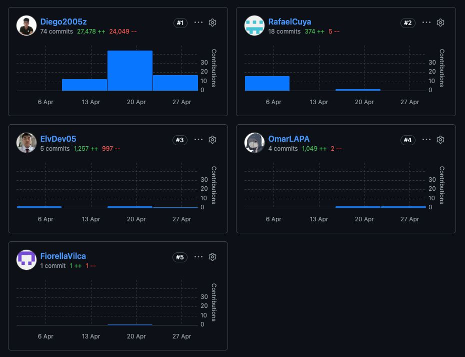

## Student Outcome

### ABET – EAC - Student Outcome 5

El curso contribuye al cumplimiento del Student Outcome ABET:  
**ABET – EAC - Student Outcome 5**  
Criterio: _La capacidad de funcionar efectivamente en un equipo cuyos miembros juntos proporcionan liderazgo, crean un entorno de colaboración e inclusivo, establecen objetivos, planifican tareas y cumplen objetivos._

En el siguiente cuadro se describen las acciones realizadas y las conclusiones del grupo, las cuales permiten sustentar el cumplimiento del ABET – EAC - Student Outcome 5.

| Criterio específico                                                                                | Acciones realizadas                                                                                                                                                                                                                                                                                                                                                                                                                                                                                                                                                                                                                                                                                                                                                                                                                                                                                                                                                                                                                                                                                                                                                                                                                                                                                                                                                                                                                                                                                                                                                                                                                                                                                                                                                                                             | Conclusiones                                                                                                                                                                                                                                                                                                                                                                                                                                                                                                                   |
| -------------------------------------------------------------------------------------------------- | --------------------------------------------------------------------------------------------------------------------------------------------------------------------------------------------------------------------------------------------------------------------------------------------------------------------------------------------------------------------------------------------------------------------------------------------------------------------------------------------------------------------------------------------------------------------------------------------------------------------------------------------------------------------------------------------------------------------------------------------------------------------------------------------------------------------------------------------------------------------------------------------------------------------------------------------------------------------------------------------------------------------------------------------------------------------------------------------------------------------------------------------------------------------------------------------------------------------------------------------------------------------------------------------------------------------------------------------------------------------------------------------------------------------------------------------------------------------------------------------------------------------------------------------------------------------------------------------------------------------------------------------------------------------------------------------------------------------------------------------------------------------------------------------------------------- | ------------------------------------------------------------------------------------------------------------------------------------------------------------------------------------------------------------------------------------------------------------------------------------------------------------------------------------------------------------------------------------------------------------------------------------------------------------------------------------------------------------------------------ |
| **Trabaja en equipo para proporcionar liderazgo en forma conjunta**                                | **Soto Quispe, Diego Ulises** **AV1:** Coordinó la organización inicial del alcance de la entrega AV1 y la definición preliminar del Sprint Goal. Desarrolló la base principal de los **Capítulos I, II, III y IV**, incluyendo el **Solution Profile**, el análisis de requisitos, los artefactos de **Needfinding**, las **User Stories**, el **Impact Mapping**, el **Product Backlog** y la propuesta inicial de **Solution Software Design**. Asimismo, articuló la coherencia entre el problema, los segmentos objetivo, los hallazgos del dominio, los requisitos y la arquitectura propuesta.  **Cuya Villegas, Rafael Alberto** **AV1:** Colaboró en la revisión de los artefactos de **Strategic-Level Domain-Driven Design**, aportando observaciones sobre la coherencia entre los **Bounded Contexts**, los hallazgos del dominio y los diagramas **C4** a nivel **Context** y **Container**.  **Lapa De La Cruz, Gabriel Omar** **AV1:** Colaboró en la revisión del diseño táctico del **Capítulo IV**, verificando la consistencia entre las capas propuestas, la organización de componentes y la representación técnica de los **Component Level Diagrams**.  **Vásquez Villalobos, Elverth Jair** **AV1:** Colaboró en la revisión transversal del **Capítulo IV: Solution Software Design**, apoyando en la validación de coherencia entre los artefactos de dominio, los flujos del sistema, el **Context Mapping** y la propuesta arquitectónica general.  **Vilca Valverde, Fiorella Angela** **AV1:** Colaboró en la revisión del **Database Design Diagram**, la consistencia entre entidades, relaciones y elementos del **Domain Layer**, además de apoyar en la revisión de estructura, formato Markdown y presentación general del informe. | **AV1:** El equipo organizó responsabilidades de liderazgo y revisión de acuerdo con las fortalezas de cada integrante. Diego asumió la construcción principal de los capítulos desarrollados para la entrega, mientras que los demás integrantes aportaron revisiones especializadas y validaciones sobre artefactos clave del diseño de solución. Esta distribución permitió mantener coherencia entre análisis, requisitos, dominio y arquitectura, evidenciando liderazgo conjunto en la elaboración y mejora del informe. |
| **Crea un entorno colaborativo e inclusivo, establece metas, planifica tareas y cumple objetivos** | **Soto Quispe, Diego Ulises** **AV1:** Participó en la planificación inicial de actividades del equipo para la entrega AV1, promoviendo reuniones breves de seguimiento y consolidando los contenidos principales en el repositorio del informe. Además, integró las observaciones del equipo para mantener alineadas las secciones de los **Capítulos I, II, III y IV** con el alcance exigido para la entrega.  **Cuya Villegas, Rafael Alberto** **AV1:** Colaboró en la revisión cruzada de artefactos de dominio y arquitectura, proponiendo ajustes relacionados con el uso de **Structurizr**, la representación de diagramas C4 y la consistencia conceptual del diseño estratégico.  **Lapa De La Cruz, Gabriel Omar** **AV1:** Apoyó en la revisión técnica del trabajo dentro del repositorio del informe, verificando convenciones de documentación, organización de capas y claridad en la representación de componentes técnicos.  **Vásquez Villalobos, Elverth Jair** **AV1:** Colaboró en la revisión de coherencia entre diagramas, flujos, bounded contexts y elementos del diseño de solución, contribuyendo a mantener alineado el trabajo técnico del equipo con la estructura general del informe.  **Vilca Valverde, Fiorella Angela** **AV1:** Colaboró en la normalización del formato del informe, la nomenclatura de recursos gráficos, la revisión de consistencia entre artefactos de análisis y especificación, y la mejora de la presentación documental en Markdown.                                                                                                                                                                                                                                                                    | **AV1:** El equipo trabajó bajo acuerdos comunes de organización, revisión y documentación, lo que favoreció un entorno colaborativo y ordenado. La planificación de tareas, la revisión cruzada de secciones y la consolidación de aportes permitieron cumplir con el alcance previsto para AV1 y mantener una participación distribuida entre los integrantes.                                                                                                                                                               |

# Contenido

- [Registro de Versiones del Informe](#registro-de-versiones-del-informe)
- [Project Report Collaboration Insights](#project-report-collaboration-insights)
- [Student Outcome](#student-outcome)

## Capítulo I: Introducción

- [1.1. Startup Profile](#11-startup-profile)
  - [1.1.1. Descripción de la Startup](#111-descripción-de-la-startup)
  - [1.1.2. Perfiles de integrantes del equipo](#112-perfiles-de-integrantes-del-equipo)
- [1.2. Solution Profile](#12-solution-profile)
  - [1.2.1. Antecedentes y problemática](#121-antecedentes-y-problemática)
  - [1.2.2. Lean UX Process](#122-lean-ux-process)
    - [1.2.2.1. Lean UX Problem Statements](#1221-lean-ux-problem-statements)
    - [1.2.2.2. Lean UX Assumptions](#1222-lean-ux-assumptions)
    - [1.2.2.3. Lean UX Hypothesis Statements](#1223-lean-ux-hypothesis-statements)
    - [1.2.2.4. Lean UX Canvas](#1224-lean-ux-canvas)
- [1.3. Segmentos objetivo](#13-segmentos-objetivo)

## Capítulo II: Requirements Elicitation & Analysis

- [2.1. Competidores](#21-competidores)
  - [2.1.1. Análisis competitivo](#211-análisis-competitivo)
  - [2.1.2. Estrategias y tácticas frente a competidores](#212-estrategias-y-tácticas-frente-a-competidores)
- [2.2. Entrevistas](#22-entrevistas)
  - [2.2.1. Diseño de entrevistas](#221-diseño-de-entrevistas)
  - [2.2.2. Registro de entrevistas](#222-registro-de-entrevistas)
  - [2.2.3. Análisis de entrevistas](#223-análisis-de-entrevistas)
- [2.3. Needfinding](#23-needfinding)
  - [2.3.1. User Personas](#231-user-personas)
  - [2.3.2. User Task Matrix](#232-user-task-matrix)
  - [2.3.3. User Journey Mapping](#233-user-journey-mapping)
  - [2.3.4. Empathy Mapping](#234-empathy-mapping)
- [2.4. Big Picture EventStorming](#24-big-picture-eventstorming)
- [2.5. Ubiquitous Language](#25-ubiquitous-language)

## Capítulo III: Requirements Specification

- [3.1. User Stories](#31-user-stories)
- [3.2. Impact Mapping](#32-impact-mapping)
- [3.3. Product Backlog](#33-product-backlog)

## Capítulo IV: Solution Software Design

- [4.1. Strategic-Level Domain-Driven Design](#41-strategic-level-domain-driven-design)
  - [4.1.1. Design-Level EventStorming](#411-design-level-eventstorming)
    - [4.1.1.1. Candidate Context Discovery](#4111-candidate-context-discovery)
    - [4.1.1.2. Domain Message Flows Modeling](#4112-domain-message-flows-modeling)
    - [4.1.1.3. Bounded Context Canvases](#4113-bounded-context-canvases)
  - [4.1.2. Context Mapping](#412-context-mapping)
  - [4.1.3. Software Architecture](#413-software-architecture)
    - [4.1.3.1. Software Architecture System Landscape Diagram](#4131-software-architecture-system-landscape-diagram)
    - [4.1.3.2. Software Architecture Context Level Diagrams](#4132-software-architecture-context-level-diagrams)
    - [4.1.3.3. Software Architecture Container Level Diagrams](#4133-software-architecture-container-level-diagrams)
    - [4.1.3.4. Software Architecture Deployment Diagrams](#4134-software-architecture-deployment-diagrams)
- [4.2. Tactical-Level Domain-Driven Design](#42-tactical-level-domain-driven-design)
  - [4.2.X. Bounded Context: <Bounded Context Name>](#42x-bounded-context-parking-management)
    - [4.2.X.1. Domain Layer](#42x1-domain-layer)
    - [4.2.X.2. Interface Layer](#42x2-interface-layer)
    - [4.2.X.3. Application Layer](#42x3-application-layer)
    - [4.2.X.4. Infrastructure Layer](#42x4-infrastructure-layer)
    - [4.2.X.5. Bounded Context Software Architecture Component Level Diagrams](#42x5-bounded-context-software-architecture-component-level-diagrams)
    - [4.2.X.6. Bounded Context Software Architecture Code Level Diagrams](#42x6-bounded-context-software-architecture-code-level-diagrams)
      - [4.2.X.6.1. Bounded Context Domain Layer Class Diagrams](#42x61-bounded-context-domain-layer-class-diagrams)
      - [4.2.X.6.2. Bounded Context Database Design Diagram](#42x62-bounded-context-database-design-diagram)

## Capítulo V: Solution UI/UX Design

- [5.1. Style Guidelines](#51-style-guidelines)
  - [5.1.1. General Style Guidelines](#511-general-style-guidelines)
  - [5.1.2. Web, Mobile and IoT Style Guidelines](#512-web-mobile-and-iot-style-guidelines)
- [5.2. Information Architecture](#52-information-architecture)
  - [5.2.1. Organization Systems](#521-organization-systems)
  - [5.2.2. Labeling Systems](#522-labeling-systems)
  - [5.2.3. SEO Tags and Meta Tags](#523-seo-tags-and-meta-tags)
  - [5.2.4. Searching Systems](#524-searching-systems)
  - [5.2.5. Navigation Systems](#525-navigation-systems)
- [5.3. Landing Page UI Design](#53-landing-page-ui-design)
  - [5.3.1. Landing Page Wireframe](#531-landing-page-wireframe)
  - [5.3.2. Landing Page Mock-up](#532-landing-page-mock-up)
- [5.4. Applications UX/UI Design](#54-applications-uxui-design)
  - [5.4.1. Applications Wireframes](#541-applications-wireframes)
  - [5.4.2. Applications Wireflow Diagrams](#542-applications-wireflow-diagrams)
  - [5.4.3. Applications Mock-ups](#543-applications-mock-ups)
  - [5.4.4. Applications User Flow Diagrams](#544-applications-user-flow-diagrams)
- [5.5. Applications Prototyping](#55-applications-prototyping)
- [5.6. IoT Device Design](#56-iot-device-design)

## Capítulo VI: Product Implementation, Validation & Deployment

- [6.1. Software Configuration Management](#61-software-configuration-management)
  - [6.1.1. Software Development Environment Configuration](#611-software-development-environment-configuration)
  - [6.1.2. Source Code Management](#612-source-code-management)
  - [6.1.3. Source Code Style Guide & Conventions](#613-source-code-style-guide--conventions)
  - [6.1.4. Software Deployment Configuration](#614-software-deployment-configuration)
- [6.2. Landing Page, Services & Applications Implementation](#62-landing-page-services--applications-implementation)
  - [6.2.X. Sprint n](#62x-sprint-n)
    - [6.2.X.1. Sprint Planning n](#62x1-sprint-planning-n)
    - [6.2.X.2. Aspect Leaders and Collaborators](#62x2-aspect-leaders-and-collaborators)
    - [6.2.X.3. Sprint Backlog n](#62x3-sprint-backlog-n)
    - [6.2.X.4. Development Evidence for Sprint Review](#62x4-development-evidence-for-sprint-review)
    - [6.2.X.5. Testing Suite Evidence for Sprint Review](#62x5-testing-suite-evidence-for-sprint-review)
    - [6.2.X.6. Execution Evidence for Sprint Review](#62x6-execution-evidence-for-sprint-review)
    - [6.2.X.7. Services Documentation Evidence for Sprint Review](#62x7-services-documentation-evidence-for-sprint-review)
    - [6.2.X.8. Software Deployment Evidence for Sprint Review](#62x8-software-deployment-evidence-for-sprint-review)
    - [6.2.X.9. Team Collaboration Insights during Sprint](#62x9-team-collaboration-insights-during-sprint)
- [6.3. Validation Interviews](#63-validation-interviews)
  - [6.3.1. Diseño de Entrevistas](#631-diseño-de-entrevistas)
  - [6.3.2. Registro de Entrevistas](#632-registro-de-entrevistas)
  - [6.3.3. Evaluaciones según heurísticas](#633-evaluaciones-según-heurísticas)
- [6.4. Video About-the-Product](#64-video-about-the-product)

## Secciones Finales

- [Conclusiones](#conclusiones)
  - [Conclusiones y recomendaciones](#conclusiones-y-recomendaciones)
  - [Video About-the-Team](#video-about-the-team)
- [Bibliografía](#bibliografía)
- [Anexos](#anexos)

# Capítulo I: Introducción

## 1.1. Startup Profile

En esta sección se presenta el perfil de la startup **Code Mondoguito**, responsable de la concepción, desarrollo y proyección comercial de su producto principal: **ParkingNow**. Se describe la empresa, su propósito, modelo de negocio, misión, visión y valores, así como los perfiles de los integrantes del equipo. Esta información permite contextualizar el origen del proyecto y establecer las bases para comprender la propuesta de valor desarrollada a lo largo del informe.

### 1.1.1. Descripción de la Startup

**Code Mondoguito** nació en 2026 como una iniciativa de estudiantes de Ingeniería de Software de la Universidad Peruana de Ciencias Aplicadas (UPC), motivados por una problemática recurrente en Lima Metropolitana: la dificultad de los conductores para encontrar estacionamientos disponibles en zonas de alta demanda vehicular y la gestión todavía manual de muchos estacionamientos independientes.

La startup identifica una brecha operativa en el sector de estacionamientos urbanos independientes: la falta de herramientas digitales accesibles que conecten el estado físico real de los espacios con la información disponible para conductores y administradores. En la práctica, muchos operadores siguen gestionando la disponibilidad mediante observación directa, registros manuales, llamadas o mensajes, lo que genera incertidumbre para el conductor y limita el control operativo del administrador.

Su propuesta se materializa en **ParkingNow**, una plataforma tecnológica orientada a optimizar la búsqueda, reserva, monitoreo y gestión de estacionamientos urbanos. La solución integra dispositivos IoT, aplicaciones móviles, paneles web y servicios en la nube, permitiendo que la ocupación de los espacios pueda detectarse físicamente y reflejarse digitalmente en tiempo real.

Code Mondoguito se define como una startup de base tecnológica, de reciente creación y con potencial de escalabilidad, debido a que propone una solución modular para un problema urbano cotidiano. Su modelo permite incorporar progresivamente nuevos estacionamientos afiliados mediante una arquitectura distribuida, donde cada operador puede integrarse a la plataforma a través de un nodo IoT y un panel de gestión digital. De esta manera, el crecimiento del producto puede ampliarse por zonas, distritos y ciudades sin rediseñar el núcleo de la solución.

Code Mondoguito adopta un modelo de negocio **B2B2C** basado en la afiliación de estacionamientos independientes. El cliente pagador principal es el operador del estacionamiento, quien accede a la plataforma mediante una suscripción mensual a cambio de visibilidad digital, monitoreo en tiempo real y herramientas de gestión operativa. El conductor participa como usuario final, beneficiándose de la consulta de disponibilidad y la reserva anticipada de espacios desde la aplicación móvil.

**Misión**

Brindar una solución tecnológica confiable y accesible que permita a los conductores encontrar y reservar estacionamientos de manera eficiente, mientras los administradores optimizan la ocupación, supervisión y gestión de sus espacios mediante herramientas digitales conectadas con información del entorno real.

**Visión**

Ser una plataforma de referencia en gestión inteligente de estacionamientos urbanos en América Latina, reconocida por la precisión de su capa IoT, la calidad de su experiencia de usuario y su capacidad para generar valor medible tanto para conductores como para operadores independientes.

**Valores**

- **Innovación aplicada:** Desarrollamos tecnología accesible para resolver problemas cotidianos de movilidad urbana, priorizando soluciones escalables y adaptadas a la realidad operativa local.
- **Transparencia:** Promovemos información clara, verificable y actualizada para reducir la incertidumbre en la experiencia de estacionamiento.
- **Sostenibilidad:** Contribuimos a reducir recorridos innecesarios, congestión vehicular y emisiones asociadas a la búsqueda prolongada de espacios.
- **Colaboración:** Diseñamos la solución considerando las necesidades reales de los operadores independientes, evitando imponer procesos complejos o inversiones tecnológicas poco viables.
- **Confiabilidad:** Priorizamos la coherencia entre el estado físico del estacionamiento y la información mostrada en las interfaces digitales.

---

### 1.1.2. Perfiles de integrantes del equipo

| **Integrante**                                                                          | **Datos Académicos**                                                     | **Conocimientos y Aporte al Equipo**                                                                                                                                                                                                                                                                                                                                                                                                                                                                                                                                                                                                                                             |
| --------------------------------------------------------------------------------------- | ------------------------------------------------------------------------ | -------------------------------------------------------------------------------------------------------------------------------------------------------------------------------------------------------------------------------------------------------------------------------------------------------------------------------------------------------------------------------------------------------------------------------------------------------------------------------------------------------------------------------------------------------------------------------------------------------------------------------------------------------------------------------- |
|  **Diego Ulises Soto Quispe**                       | **Código:** U202214477 **Carrera:** Ingeniería de Software, 7.º ciclo | Cuenta con experiencia en desarrollo frontend, mobile y backend, utilizando tecnologías como **React**, **Flutter**, **Node.js**, **TypeScript**, **Python** y **C++**, además de herramientas de diseño, documentación y colaboración como **Figma**, **GitHub**, **Postman** y **Docker**. Posee conocimientos en integración de APIs, modelado de soluciones digitales y trabajo con enfoques ágiles. En el proyecto **ParkingNow**, aporta principalmente en la definición funcional del producto, la integración entre aplicaciones y servicios, la estructuración del **Lean UX Process** y la articulación entre la solución técnica y las necesidades del usuario final. |
|  **Rafael Alberto Cuya Villegas**                 | **Código:** U201913495 **Carrera:** Ingeniería de Software, 7.º ciclo | Posee conocimientos en desarrollo backend, seguridad de aplicaciones y gestión de bases de datos, con experiencia en tecnologías como **Python**, **JavaScript**, **SQL** y **MongoDB**. Cuenta con criterio para validar integridad de datos, revisar arquitectura y estructurar componentes técnicos orientados a soluciones conectadas. En **ParkingNow**, aporta en la definición de la arquitectura backend, la revisión de aspectos de seguridad y consistencia de datos, y la construcción de artefactos de diseño estratégico como los **Bounded Contexts**.                                                                                                             |
|  **Gabriel Omar Lapa De La Cruz**               | **Código:** U202216831 **Carrera:** Ingeniería de Software, 7.º ciclo | Tiene conocimientos en desarrollo backend y modelado de soluciones de software, con experiencia en tecnologías como **.NET**, **Vue.js**, **JavaScript** y documentación técnica orientada a arquitectura. Posee criterio para representar componentes, capas y relaciones mediante diagramas técnicos y notación UML. En **ParkingNow**, aporta en la documentación del diseño táctico, la elaboración de **Component Level Diagrams**, la representación de capas de aplicación e infraestructura y la validación de consistencia entre los componentes definidos en la arquitectura.                                                                                          |
|  **Elverth Jair Vásquez Villalobos** | **Código:** U202213070 **Carrera:** Ingeniería de Software, 7.º ciclo | Cuenta con conocimientos en análisis y diseño de soluciones de software, modelado de dominio y documentación técnica. Posee criterio para revisar la coherencia entre requisitos, flujos del sistema y componentes de arquitectura. Cuenta con conocimientos técnicos en C# , ASP .NET, SQL, JavaScript, Vue, Angular y Docker. En **ParkingNow**, aporta en la revisión transversal del **Capítulo IV: Solution Software Design**, la validación de consistencia entre artefactos estratégicos y tácticos, y el apoyo en la integración de elementos de dominio con la propuesta de arquitectura.                                                                               |
|  **Fiorella Angela Vilca Valverde**  | **Código:** U20211e417 **Carrera:** Ingeniería de Software, 7.º ciclo | Cuenta con conocimientos en **UX/UI**, validación de requisitos, testing y modelado de datos, además de manejo de herramientas como **Figma** para diseño de interfaces y prototipos. Posee criterio para organizar información visualmente, revisar coherencia entre requisitos y experiencia de usuario, y documentar estructuras de datos de manera ordenada. En **ParkingNow**, aporta en el diseño centrado en el usuario, la revisión de consistencia entre necesidades, historias de usuario y criterios de aceptación, así como en la documentación del **Database Design Diagram** y en la organización visual del informe.                                             |

---

## 1.2. Solution Profile

En esta sección se presenta el perfil de la solución propuesta por **ParkingNow**, producto de la startup **Code Mondoguito**, a partir de los antecedentes y la problemática que justifican su desarrollo. Asimismo, se introduce el proceso de **Lean UX** aplicado al dominio del problema, con el fin de estructurar las necesidades de los usuarios, la brecha existente en el mercado, los supuestos iniciales y las hipótesis que orientan la construcción del producto.

### 1.2.1. Antecedentes y problemática

En el contexto de las ciudades latinoamericanas con alta densidad vehicular, la gestión del estacionamiento urbano representa uno de los problemas de movilidad más frecuentes y con mayor impacto en la experiencia cotidiana de los ciudadanos. En Lima Metropolitana, se estima que circulan aproximadamente 1.8 millones de automóviles (El Comercio, 2024), y el flujo vehicular nacional acumula 27 meses consecutivos de crecimiento al cierre del primer trimestre de 2025 (Asociación Automotriz del Perú [AAP], 2025). Esta tendencia sostenida ejerce una presión creciente sobre la infraestructura vial y de estacionamiento de la ciudad. El informe _Cities in Motion 2025_ posicionó a Lima en el puesto 176 de movilidad y transporte a nivel mundial, reflejando una crisis estructural que empeora año tras año (Infobae, 2025a).

En este escenario, encontrar espacios disponibles se convierte en un problema recurrente y costoso para los conductores. La búsqueda de estacionamiento no solo implica pérdida de tiempo, sino también mayor estrés, retrasos y recorridos innecesarios que contribuyen a la congestión vehicular. Investigaciones recientes sobre sistemas de _Smart Parking_ confirman que la falta de información actualizada es una de las principales causas de ineficiencia en el uso del espacio urbano, y que las soluciones basadas en IoT, sensores y aplicaciones móviles pueden reducir significativamente este impacto (Ruiz Cruzado et al., 2026; Nur et al., 2025).

Desde la perspectiva de los operadores, el problema también resulta crítico. Lima enfrenta una informalidad persistente en el sector: parqueadores informales se han apropiado de espacios públicos en múltiples distritos, cobrando tarifas sin regulación y desplazando a operadores formales (Infobae, 2024). Además, los distritos de Miraflores, San Borja, Surco y San Isidro cuentan apenas con 12,000 espacios de estacionamiento público entre los cuatro, pese a que solo en Miraflores transitan 40,000 vehículos diarios (El Comercio, 2024). Esta brecha estructural entre oferta y demanda limita tanto la experiencia del conductor como la capacidad de los operadores formales e independientes para captar y gestionar la demanda de manera eficiente.

#### Enunciado del Problema

En zonas de alta densidad vehicular de Lima Metropolitana, los conductores enfrentan incertidumbre recurrente para encontrar estacionamientos disponibles, mientras que los administradores independientes gestionan sus espacios de forma manual y sin visibilidad digital en tiempo real. Esta desconexión entre el estado físico real de los espacios y la información accesible para ambos actores genera pérdida de tiempo, congestión vehicular, errores operativos y subutilización de la oferta existente.

#### Análisis mediante la técnica 5W + 2H

**Who (¿Quién?):**  
El problema afecta a dos grupos de usuarios con necesidades distintas pero complementarias. Por un lado, afecta a conductores urbanos de Lima Metropolitana que utilizan vehículo particular y necesitan encontrar estacionamiento disponible de forma frecuente en zonas de alta demanda vehicular, como San Isidro, Miraflores, Surco, La Molina y el Centro Histórico. El 51.1% de los encuestados en Lima y Callao considera necesario incrementar los estacionamientos en vía pública, cifra que asciende al 70.1% en el sector socioeconómico A (Lima Cómo Vamos, 2024). Por otro lado, afecta a administradores y propietarios de estacionamientos independientes que gestionan sus espacios sin herramientas digitales integradas, en un contexto donde la informalidad del sector limita la oferta formal disponible para el conductor (Infobae, 2024).

**What (¿Qué?):**  
El problema central es la desconexión entre el estado físico real de los espacios y la información que reciben el conductor y el administrador. El conductor no sabe qué espacios están libres antes de llegar, y el administrador no cuenta con visibilidad inmediata de la ocupación de su local. Esta brecha genera decisiones ineficientes, baja previsibilidad, pérdida de tiempo y una gestión operativa limitada. Estudios sobre sistemas de _Smart Parking_ basados en IoT demuestran que la ausencia de mecanismos de detección y actualización confiables impacta directamente en la eficiencia del uso del espacio urbano (Ruiz Cruzado et al., 2026).

**Where (¿Dónde?):**  
El problema ocurre con mayor frecuencia en zonas urbanas de alta densidad vehicular de Lima Metropolitana, especialmente en áreas aledañas a centros empresariales, universidades, hospitales, mercados y zonas comerciales. Los cuatro distritos más saturados, Miraflores, San Borja, Surco y San Isidro, combinan apenas 12,000 espacios de estacionamiento público para atender una demanda vehicular diaria de decenas de miles de vehículos (El Comercio, 2024). Esta situación evidencia que la problemática no es puntual, sino sistémica dentro del contexto urbano de la ciudad.

**When (¿Cuándo?):**  
El problema se manifiesta de forma recurrente durante los días laborables, con mayor intensidad en horarios de alta demanda vehicular: mañana, mediodía y tarde-noche. El flujo vehicular en el país registró en julio de 2025 un crecimiento de 4.1% respecto al mismo mes del año anterior, con los vehículos ligeros creciendo 3.8% y los pesados 4.6% (AAP, 2025), lo que anticipa que la saturación seguirá agravándose en los próximos años. La problemática también se intensifica en fechas o eventos de alta concurrencia urbana.

**Why (¿Por qué?):**  
La causa raíz es la falta de integración entre el entorno físico del estacionamiento y los canales digitales de información y gestión. Actualmente, no existe un mecanismo suficientemente accesible y confiable que permita al conductor conocer la disponibilidad real de los espacios antes de llegar, ni que permita al administrador monitorear su operación de forma automatizada. A esto se suma una saturación vehicular creciente, agravada por infraestructura vial insuficiente, informalidad en la gestión del espacio urbano y barreras económicas para adoptar soluciones tecnológicas tradicionales de mayor costo (Infobae, 2025b).

**How (¿Cómo?):**  
El problema se manifiesta cuando los conductores recorren varias cuadras o ingresan a distintos estacionamientos sin saber si encontrarán un espacio libre, invirtiendo tiempo adicional y contribuyendo a la congestión vehicular. Del lado del administrador, la ocupación suele controlarse mediante observación directa, registros manuales, pizarras, llamadas o mensajes, lo que dificulta conocer el estado actualizado de los espacios, atender reservas de manera ordenada y responder con rapidez a cambios operativos.

**How Much (¿Cuánto?):**  
El Instituto Nacional de Estadística e Informática (INEI) reportó en diciembre de 2025 un crecimiento sostenido del flujo vehicular nacional (INEI, 2026), reflejando que la presión sobre la infraestructura de estacionamiento continúa en aumento. En el plano operativo, empresas formales de estacionamiento como Tu Parqueo reportaron en 2024 tasas de ocupación del 80% en sus locales de San Isidro, Barranco y La Victoria, con el 55% de sus ingresos generado por clientes eventuales (Gestión, 2024). Estos indicadores sustentan la magnitud del problema y la oportunidad de conectar esa demanda insatisfecha con operadores independientes que actualmente no cuentan con herramientas para captarla y gestionarla eficientemente.

#### Puntos más importantes que debe resolver la solución

A partir del análisis anterior, **ParkingNow** debe resolver de forma prioritaria los siguientes problemas:

1. **Falta de visibilidad sobre la disponibilidad real de espacios:** Los conductores no cuentan con información actualizada y verificada sobre qué espacios están libres antes de llegar al estacionamiento. La información disponible actualmente, cuando existe, no está respaldada por un mecanismo de detección física confiable.

2. **Ausencia de un mecanismo de reserva anticipada confiable:** No existe una forma simple y digital de garantizar un espacio antes de llegar físicamente al estacionamiento, lo que obliga al conductor a desplazarse con incertidumbre sobre si encontrará o no un lugar disponible.

3. **Desconexión entre el estado físico y los canales digitales:** La disponibilidad informada no refleja necesariamente la realidad del espacio, porque no hay un mecanismo de sensado que vincule el entorno físico del estacionamiento con las plataformas digitales de información y gestión.

4. **Limitada capacidad operativa de los administradores independientes:** Los operadores gestionan sus espacios de forma manual, sin herramientas que les permitan monitorear ocupación, gestionar reservas activas y visualizar eventos operativos en tiempo real desde un canal digital accesible.

5. **Baja trazabilidad de eventos operativos:** Muchos estacionamientos independientes no cuentan con un historial digital estructurado que permita revisar ocupación, reservas, ingresos o incidencias del día, lo que limita la toma de decisiones y la mejora continua del negocio.

#### Objetivos de la solución

- Permitir a los conductores urbanos consultar la disponibilidad real de espacios de estacionamiento desde una aplicación móvil, con información actualizada en tiempo real a partir del estado detectado por sensores IoT.
- Habilitar la reserva anticipada de espacios disponibles, proporcionando al conductor una confirmación digital antes de llegar físicamente al estacionamiento.
- Dotar a los administradores de estacionamientos independientes de un panel web que les permita monitorear el estado de ocupación de sus espacios, gestionar reservas activas y acceder al historial de eventos operativos generado por la solución.
- Construir una solución IoT distribuida que integre detección física mediante sensores ultrasónicos HC-SR04+ en un nodo ESP32, procesamiento local _edge_, reporte al backend vía HTTP REST y propagación automática de cambios a las aplicaciones mediante Supabase Realtime, bajo una arquitectura coherente entre dispositivo embebido, Edge API, Core API y aplicaciones de usuario.
- Evidenciar la trazabilidad _end-to-end_ entre el evento físico detectado por el sensor y su representación digital en tiempo real en las interfaces del conductor y del administrador, como validación de la integración distribuida propuesta.

#### Restricciones del proyecto

- El alcance del proyecto corresponde a un **prototipo académico funcional**, por lo que la validación se realizará sobre un escenario controlado y representativo en forma de maqueta, no sobre una implementación masiva en entornos urbanos reales.
- El nodo IoT físico contempla **dos espacios de estacionamiento** en la maqueta de demostración, lo cual es suficiente para evidenciar la integración completa de la arquitectura distribuida dentro del alcance del curso.
- La solución no incluirá funcionalidades de pago ni facturación en esta primera versión, dado que el enfoque prioriza la trazabilidad del estado de los espacios y la experiencia de reserva como valor central de la plataforma.
- El despliegue se realizará sobre servicios _cloud_ gratuitos o de bajo costo, como Railway para backend, Vercel para frontend y Supabase _free tier_ para base de datos y comunicación en tiempo real, adecuados para el alcance universitario del proyecto.

### 1.2.2. Lean UX Process

En esta sección se aplica el proceso **Lean UX** sobre el dominio del problema de estacionamiento urbano en Lima Metropolitana. El objetivo es construir una visión compartida, validable y orientada al aprendizaje sobre el modelo de negocio que sustenta el producto propuesto. El proceso parte de la identificación de **Problem Statements**, continúa con la formulación de **Assumptions** sobre el negocio, los usuarios y las funcionalidades clave, y culmina en la redacción de **Hypothesis Statements** que orientan la validación progresiva del producto durante su ciclo de desarrollo.

> **Nota metodológica:** Las assumptions se han organizado en cinco grupos para facilitar su trazabilidad con los resultados de negocio, resultados de usuario y funcionalidades del producto:
>
> - **Business Outcomes Assumptions**
> - **User Outcomes Assumptions**
> - **Business Assumptions**
> - **User Assumptions**
> - **Features Assumptions**

---

#### 1.2.2.1. Lean UX Problem Statements

##### Problem Statement #1: Segmento Conductores Urbanos

| Elemento                   | Descripción                                                                                                                                                                                                                                                                                        |
| -------------------------- | -------------------------------------------------------------------------------------------------------------------------------------------------------------------------------------------------------------------------------------------------------------------------------------------------- |
| **Domain**                 | La movilidad urbana en Lima Metropolitana se desarrolla en un contexto de alta congestión vehicular, déficit de infraestructura de estacionamiento y escasa integración entre la oferta física de espacios y los canales digitales de información.                                                 |
| **Customer Segments**      | Conductores urbanos de Lima Metropolitana que utilizan vehículo particular y se desplazan con frecuencia a zonas de alta demanda vehicular, como San Isidro, Miraflores, Surco, La Molina y el Centro Histórico.                                                                                   |
| **Pain Points**            | Los conductores recorren múltiples cuadras de forma incierta antes de encontrar un espacio libre, lo que genera pérdida de tiempo, incremento de la congestión vehicular, estrés y deterioro de su experiencia de movilidad.                                                                       |
| **Gap**                    | La oferta actual no brinda información suficientemente confiable, oportuna y verificable sobre la disponibilidad real de los espacios, lo que impide al conductor planificar con anticipación su llegada a un estacionamiento.                                                                     |
| **Visión / Strategy**      | Se requiere mejorar la experiencia de búsqueda y acceso a estacionamientos, reduciendo la incertidumbre del conductor, proporcionando información verificable sobre la disponibilidad real de espacios y haciendo más predecible el proceso de estacionamiento en zonas de alta demanda vehicular. |
| **Initial Segment**        | Conductores urbanos de 25 a 45 años, de nivel socioeconómico B y C, que trabajan o estudian en distritos de alta demanda vehicular y han experimentado de forma recurrente la frustración de perder tiempo buscando estacionamiento.                                                               |
| **Criterio de validación** | Se considerará que este problema empieza a resolverse cuando el tiempo promedio de búsqueda y acceso a un espacio disponible se reduzca de manera perceptible y cuando los usuarios reporten una mejora en la previsibilidad de su experiencia de estacionamiento.                                 |

##### Problem Statement #2: Segmento Administradores de Estacionamientos Independientes

| Elemento                   | Descripción                                                                                                                                                                                                                                                                                                |
| -------------------------- | ---------------------------------------------------------------------------------------------------------------------------------------------------------------------------------------------------------------------------------------------------------------------------------------------------------- |
| **Domain**                 | La gestión de estacionamientos independientes en Lima se caracteriza por operaciones manuales, baja digitalización, escasa visibilidad comercial y limitada capacidad de monitoreo en tiempo real.                                                                                                         |
| **Customer Segments**      | Administradores y propietarios de estacionamientos independientes que gestionan entre 2 y 30 espacios en distritos de alta demanda vehicular de Lima Metropolitana, sin herramientas digitales integradas.                                                                                                 |
| **Pain Points**            | Los operadores no tienen visibilidad inmediata del estado de sus espacios, carecen de datos históricos para tomar decisiones, dependen de registros manuales y no logran competir con ofertas más visibles o digitalizadas.                                                                                |
| **Gap**                    | Las alternativas disponibles en el mercado suelen implicar costos elevados, complejidad técnica o esquemas de implementación poco accesibles para operadores pequeños, lo que limita su adopción en este segmento.                                                                                         |
| **Visión / Strategy**      | Se requiere mejorar la gestión operativa y la visibilidad comercial del estacionamiento independiente, reduciendo la dependencia de registros manuales, centralizando la información sobre el estado de los espacios y facilitando la toma de decisiones en tiempo real para operadores de pequeña escala. |
| **Initial Segment**        | Administradores de estacionamientos independientes ubicados en Miraflores, San Isidro y Surco, que operan manualmente entre 2 y 30 espacios y no cuentan actualmente con herramientas digitales de gestión.                                                                                                |
| **Criterio de validación** | Se considerará que este problema empieza a resolverse cuando los operadores evidencien mejoras en la visibilidad de su operación, reducción de tareas manuales y una mejor capacidad para gestionar la ocupación de sus espacios.                                                                          |

---

#### 1.2.2.2. Lean UX Assumptions

> Las siguientes assumptions corresponden a supuestos iniciales de negocio, adopción, comportamiento del usuario y viabilidad funcional. Deben entenderse como hipótesis de partida que orientan el diseño del producto y que deberán contrastarse en etapas posteriores mediante entrevistas, validaciones con usuarios, pruebas piloto y evaluación del prototipo.

##### Business Outcomes Assumptions

1. **Incrementar la ocupación de estacionamientos afiliados.**  
   Se asume que la plataforma puede contribuir a incrementar en al menos 15% la ocupación de los estacionamientos afiliados durante una validación inicial, al otorgarles mayor visibilidad digital y permitir reservas anticipadas.  
   **Indicadores de referencia:** tasa de ocupación, número de reservas completadas y retroalimentación de operadores.

2. **Reducir el tiempo de búsqueda y reserva del conductor.**  
   Se asume que los conductores podrán encontrar y reservar un espacio disponible en menos de 5 minutos si cuentan con información actualizada y disponibilidad respaldada por el nodo IoT.  
   **Indicadores de referencia:** tiempo promedio de búsqueda, tiempo de reserva y percepción de reducción de recorridos innecesarios.

3. **Validar la intención de permanencia de operadores afiliados.**  
   Se asume que al menos el 60% de los operadores participantes expresará intención de mantener el servicio si percibe beneficios claros en visibilidad, control operativo y captación de demanda.  
   **Indicadores de referencia:** intención de permanencia, disposición a pagar y recomendación a otros operadores.

4. **Incrementar la confianza en la disponibilidad mostrada.**  
   Se asume que al menos el 80% de los usuarios con reserva percibirá consistencia entre la disponibilidad mostrada en la aplicación y el espacio encontrado al llegar al estacionamiento.  
   **Indicadores de referencia:** satisfacción del usuario, correspondencia entre estado digital y estado físico, y reportes de inconsistencias.

##### User Outcomes Assumptions

1. Los conductores urbanos de Lima necesitan identificar, seleccionar y acceder a un espacio disponible en menos de 5 minutos, sin búsqueda física adicional, para percibir valor real en su experiencia de movilidad.

2. Los administradores independientes necesitan evidenciar una mejora concreta en su tasa de ocupación durante los primeros meses de uso para considerar que la afiliación a la plataforma justifica el costo de suscripción y la instalación del nodo IoT.

3. Los administradores necesitan reducir la dependencia de registros manuales y centralizar el monitoreo de estados, reservas y eventos en un único panel web para disminuir su carga operativa.

4. Los conductores necesitan certeza de que el espacio reservado estará disponible al momento de su llegada, respaldado por información consistente y actualizada, para adoptar la plataforma como herramienta habitual.

##### Business Assumptions

- Los conductores urbanos de Lima adoptarán una aplicación móvil para consultar disponibilidad y reservar, siempre que esta les proporcione información confiable y reduzca perceptiblemente el tiempo de búsqueda.
- Los operadores independientes estarán dispuestos a asumir una suscripción mensual si perciben un beneficio económico claro en términos de visibilidad, mejora operativa y aumento potencial de ocupación.
- Los operadores integrarán un nodo IoT si el costo es accesible, la configuración es simple y la operación cotidiana no requiere conocimientos técnicos especializados.
- En la etapa inicial, el conductor participa como usuario final de la aplicación, mientras que el cliente pagador principal es el operador afiliado.
- Existe densidad suficiente de estacionamientos independientes en San Isidro, Miraflores y Surco para construir una oferta inicial atractiva y sostener una estrategia temprana de adopción.
- La integración con OpenStreetMap permitirá poblar el mapa inicial con estacionamientos reales de Lima y aumentar la utilidad percibida desde el primer uso.

##### User Assumptions

- Los conductores revisan la disponibilidad de estacionamiento preferentemente desde su teléfono móvil, antes o durante el trayecto hacia su destino.
- Los administradores prefieren interfaces simples, visuales y de baja complejidad operativa.
- Los conductores valoran visualizar en el mapa tanto estacionamientos con disponibilidad en tiempo real y posibilidad de reserva como estacionamientos no integrados, usados como referencia de ubicación.
- Los administradores valoran recibir actualizaciones inmediatas cuando un espacio cambia de estado, especialmente cuando una reserva activa es consumida por la llegada física del vehículo.
- Tanto conductores como administradores esperan que la plataforma mantenga el último estado conocido ante una eventual desconexión del nodo IoT, en lugar de mostrar errores o vacíos de información.

##### Features Assumptions

- **Detección de ocupación en tiempo real:** Sensores HC-SR04+ conectados al ESP32 podrán detectar la presencia de vehículos con un umbral configurable y lógica de _debounce_ para reducir falsos positivos.
- **Reserva anticipada de espacios:** El conductor podrá seleccionar y reservar un espacio libre desde la aplicación móvil antes de llegar físicamente al estacionamiento.
- **Propagación automática de estados:** Los cambios de estado físico del espacio podrán reflejarse automáticamente en la Web App y la Mobile App, sin recargar la interfaz.
- **Diferenciación entre afiliados y no afiliados:** El mapa podrá mostrar estacionamientos reales de Lima cargados desde OpenStreetMap, distinguiendo visualmente cuáles tienen disponibilidad en tiempo real y permiten reservas, y cuáles son solo puntos de referencia.
- **Comportamiento degradado ante desconexión:** Si el nodo deja de reportar, el sistema podrá conservar el último estado conocido y marcarlo visualmente como no confirmado en tiempo real.
- **Vista de cámara local:** Una cámara integrada al nodo IoT podrá permitir al administrador verificar visualmente el estado del espacio desde el panel web.

##### Assumptions Priority Matrix

A continuación se presenta la matriz de priorización de supuestos, elaborada para clasificar las assumptions según su nivel de riesgo y grado de conocimiento, con el fin de identificar cuáles deben validarse primero.

**Figura 1**  
_Assumptions Priority Matrix de ParkingNow_

**Nota.** Elaboración propia (2026).

A fin de complementar la lectura de la matriz, la siguiente tabla resume la clasificación de cada assumption priorizada según su nivel de riesgo, tomando como referencia directa los cuadrantes de la figura:

| Assumption                                                                                | Cuadrante           | Nivel de riesgo |
| ----------------------------------------------------------------------------------------- | ------------------- | --------------- |
| Los operadores independientes pagarán una suscripción mensual                             | High Risk / Unknown | Alto            |
| Los conductores confiarán en la reserva anticipada                                        | High Risk / Unknown | Alto            |
| La sincronización en tiempo real mantendrá consistencia entre el estado físico y las apps | High Risk / Unknown | Alto            |
| El sensor HC-SR04+ detectará ocupación con precisión suficiente                           | High Risk / Unknown | Alto            |
| Los conductores consultan estacionamiento desde el celular antes o durante el trayecto    | High Risk / Known   | Alto            |
| Los administradores prefieren interfaces simples y visuales                               | High Risk / Known   | Alto            |
| Los usuarios valorarán ver estacionamientos no afiliados como referencia                  | Low Risk / Unknown  | Bajo            |
| La cámara local aportará valor percibido al administrador                                 | Low Risk / Unknown  | Bajo            |
| OpenStreetMap permite poblar el mapa inicial con estacionamientos reales de Lima          | Low Risk / Known    | Bajo            |
| Los administradores necesitan reducir registros manuales                                  | Low Risk / Known    | Bajo            |

A partir de esta priorización, se consideran como supuestos de **alto riesgo y alto nivel de incertidumbre** los siguientes, por ubicarse en el cuadrante High Risk / Unknown de la matriz:

- Que los operadores independientes estén realmente dispuestos a pagar una suscripción mensual por digitalizar su operación.
- Que los sensores HC-SR04+ mantengan una detección suficientemente confiable del estado de ocupación en condiciones normales del prototipo.
- Que los conductores confíen en la reserva anticipada como mecanismo útil y adopten la plataforma como parte de su rutina.
- Que la sincronización entre el estado físico detectado y la información mostrada en las aplicaciones mantenga consistencia suficiente para generar confianza en ambos segmentos.

**Enlace a Miro:** [https://miro.com/welcomeonboard/WHNrZVNha3RDZ2pQdCtHbklaRkNBcXpCRWtvN3FyMVNOTnkwSU45UkU5NHI5UTM3QXZLUm5UZ1diZEZTbndybDdYZGkzZzVXQjZWMDRqdW40UkgwdFVmQnUraUd4TE1vQmR5bitqV3AzWkRyU2JCdnJ0Q0hDZFh1Zk56UUlFTTNNakdSWkpBejJWRjJhRnhhb1UwcS9BPT0hdjE=?share_link_id=755799786282](https://miro.com/welcomeonboard/WHNrZVNha3RDZ2pQdCtHbklaRkNBcXpCRWtvN3FyMVNOTnkwSU45UkU5NHI5UTM3QXZLUm5UZ1diZEZTbndybDdYZGkzZzVXQjZWMDRqdW40UkgwdFVmQnUraUd4TE1vQmR5bitqV3AzWkRyU2JCdnJ0Q0hDZFh1Zk56UUlFTTNNakdSWkpBejJWRjJhRnhhb1UwcS9BPT0hdjE=?share_link_id=755799786282)

---

#### 1.2.2.3. Lean UX Hypothesis Statements

> Las siguientes hipótesis se formulan a partir de la plantilla de hipótesis de Lean UX y buscan vincular de manera explícita un resultado de negocio esperado con un segmento de usuario, un beneficio observable y una funcionalidad concreta de la solución. Su propósito es orientar la validación progresiva del producto en iteraciones posteriores, sin asumir que estos resultados han sido demostrados en la presente entrega.

##### Hypothesis Statement #1

**Creemos que** reducir el tiempo de búsqueda de estacionamiento de los conductores urbanos en Lima Metropolitana **se logrará si** los conductores **consiguen** identificar espacios disponibles y reservarlos anticipadamente **con** una aplicación móvil que muestre disponibilidad en tiempo real y permita la reserva antes de llegar al destino.  
**Sabremos que estamos en lo correcto cuando veamos** que al menos el 40% de los usuarios completa una reserva exitosa en menos de 5 minutos desde el inicio de la búsqueda y que una mayoría de usuarios valida que redujo recorridos innecesarios para encontrar estacionamiento.

##### Hypothesis Statement #2

**Creemos que** mejorar la tasa de ocupación de los estacionamientos independientes afiliados **se logrará si** los administradores **consiguen** mayor visibilidad digital de sus espacios y captación de demanda **con** una plataforma que exponga su disponibilidad al conductor y permita la gestión digital de reservas.  
**Sabremos que estamos en lo correcto cuando veamos** un incremento de al menos 15% en la cantidad de reservas completadas de los estacionamientos afiliados durante el periodo de validación y retroalimentación positiva de los operadores respecto al impacto de la plataforma en su nivel de ocupación.

##### Hypothesis Statement #3

**Creemos que** incrementar la confianza del conductor en la disponibilidad mostrada por la plataforma **se logrará si** los conductores **consiguen** percibir consistencia entre la información digital y el estado real del espacio **con** una solución conectada a un nodo IoT que actualice automáticamente el estado de ocupación.  
**Sabremos que estamos en lo correcto cuando veamos** que al menos el 80% de los usuarios que completan reservas reporta satisfacción con la correspondencia entre el espacio mostrado como disponible y el espacio efectivamente encontrado al llegar al estacionamiento.

##### Hypothesis Statement #4

**Creemos que** reducir la carga operativa manual del administrador de estacionamiento **se logrará si** los administradores **consiguen** centralizar el monitoreo de ocupación, reservas y eventos operativos **con** un panel web conectado al estado actualizado de los espacios y al historial generado por el nodo IoT.  
**Sabremos que estamos en lo correcto cuando veamos** que al menos el 70% de los administradores participantes reporta una disminución significativa en el uso de registros manuales y una mejora en su capacidad de supervisar la operación diaria desde un único canal digital.

##### Hypothesis Statement #5

**Creemos que** facilitar la afiliación progresiva de estacionamientos independientes a la plataforma **se logrará si** los operadores **consiguen** percibir beneficios claros de visibilidad, control operativo y potencial incremento de demanda **con** una solución accesible, de bajo costo relativo y sencilla de implementar en negocios de pequeña escala.  
**Sabremos que estamos en lo correcto cuando veamos** que al menos el 60% de los operadores que participan en etapas iniciales de validación expresa intención de mantener el servicio, y que una parte de ellos manifiesta disposición a recomendar la solución a otros operadores.

##### Hypothesis Statement #6 _(Técnica)_

**Creemos que** lograr una detección confiable del estado de ocupación de los espacios **se logrará si** el sistema **consigue** distinguir de forma consistente entre espacio libre y espacio ocupado **con** sensores ultrasónicos HC-SR04+ conectados a un nodo ESP32 con lógica local de validación y envío de eventos.  
**Sabremos que estamos en lo correcto cuando veamos** que, durante las pruebas del prototipo, el nodo IoT alcanza una precisión mayor al 90% en la detección del estado de los espacios y mantiene bajos niveles de falsos positivos y falsos negativos en condiciones normales de operación.

---

#### 1.2.2.4. Lean UX Canvas

A continuación se presenta el Lean UX Canvas elaborado para el proyecto, como síntesis visual de los principales elementos del proceso Lean UX: el problema de negocio identificado, los segmentos priorizados, los beneficios esperados, las hipótesis centrales y los aprendizajes prioritarios que orientan el desarrollo del producto.

**Figura 2**  
_Lean UX Canvas de ParkingNow para el dominio de gestión de estacionamientos urbanos en Lima Metropolitana_

**Nota.** Elaboración propia (2026). Iteración 1.

> Según la Figura 2, el Lean UX Canvas identifica como problema central la desconexión entre el estado físico real de los espacios y los canales digitales de información. Esta brecha afecta tanto a conductores urbanos, que pierden tiempo buscando disponibilidad, como a administradores independientes, que operan sin visibilidad ni herramientas digitales.
>
> Las ideas de solución se articulan en torno a una plataforma distribuida con sensado IoT, reservas anticipadas mediante aplicación móvil, un panel web de monitoreo para el operador, propagación automática de estados y diferenciación entre estacionamientos integrados y no integrados. Los _business outcomes_ priorizan la mejora de ocupación de los estacionamientos afiliados, la reducción del tiempo de búsqueda y reserva, la intención de permanencia de operadores y la confianza del usuario en la consistencia entre disponibilidad mostrada y espacio encontrado.
>
> El Lean UX Canvas sintetiza los elementos principales del proceso Lean UX, por lo que no reproduce de forma literal todas las assumptions e hipótesis desarrolladas en las secciones anteriores, sino que prioriza aquellas de mayor impacto para la validación inicial del producto. Los aprendizajes prioritarios a contrastar en las primeras iteraciones consisten en determinar si los operadores independientes están dispuestos a pagar por digitalizar su operación, si el sensor HC-SR04+ detecta la ocupación con precisión suficiente en el prototipo, y si la reserva anticipada incrementa la confianza y percepción de valor del conductor. Estos elementos deben entenderse como hipótesis iniciales sujetas a validación, y no como resultados demostrados en la presente fase.

**Enlace al canvas:** [https://canva.link/jukpsaamxd32d5t](https://canva.link/jukpsaamxd32d5t)

---

## 1.3. Segmentos objetivo

Los segmentos objetivo de **ParkingNow** han sido identificados a partir del análisis del dominio del problema asociado a la gestión de estacionamientos urbanos en Lima Metropolitana. La solución se orienta a dos grupos con necesidades distintas pero complementarias: por un lado, los conductores urbanos que requieren encontrar y reservar estacionamiento de manera más eficiente; por otro, los administradores de estacionamientos independientes que necesitan mejorar la gestión operativa y la visibilidad de sus espacios. A continuación, se presenta la descripción de cada segmento, junto con sus características demográficas e información estadística de sustento.

---

### Segmento 1: Conductores urbanos

**Descripción:**  
Este segmento comprende a personas que se movilizan habitualmente en vehículo particular por Lima Metropolitana y que enfrentan de forma recurrente la dificultad de encontrar estacionamiento disponible en zonas de alta demanda vehicular. Constituyen los usuarios finales de la aplicación móvil de ParkingNow, mediante la cual podrán consultar disponibilidad, ubicar estacionamientos cercanos en el mapa, realizar reservas anticipadas y gestionar su historial de uso.

**Características demográficas:**

- **Edad:** Entre 25 y 45 años, con mayor concentración en población económicamente activa que trabaja o estudia en distritos de alta demanda vehicular.
- **Género:** Hombres y mujeres con vehículo propio o acceso frecuente a uno.
- **Ubicación:** Residen, estudian o trabajan en Lima Metropolitana, con desplazamientos frecuentes a distritos como San Isidro, Miraflores, Surco, La Molina, Lince y el Centro Histórico.
- **Perfil económico y de movilidad:** Usuarios económicamente activos con uso frecuente de vehículo particular en sus desplazamientos cotidianos.
- **Perfil tecnológico:** Usuarios habituales de smartphones con sistema operativo Android o iOS, familiarizados con aplicaciones de mapas, movilidad y servicios digitales como Google Maps, Waze, Uber o Rappi.

**Información estadística de sustento:**  
En Lima Metropolitana circulan aproximadamente 1.8 millones de automóviles, de los cuales el 11.2% de la población los utiliza para desplazarse al trabajo y el 7.9% para estudiar (El Comercio, 2024). Asimismo, el 51.1% de los encuestados en Lima y Callao considera necesario incrementar los estacionamientos en vía pública, porcentaje que asciende al 70.1% en el sector socioeconómico A, lo que evidencia una alta percepción de insuficiencia en la oferta actual (Lima Cómo Vamos, 2024). A ello se suma que el informe _Cities in Motion 2025_ ubicó a Lima en el puesto 176 en movilidad urbana a nivel mundial, reflejando un entorno crítico para el desplazamiento vehicular (Infobae, 2025a). Finalmente, el flujo vehicular nacional acumula 27 meses de crecimiento consecutivo, con un incremento de 3.5% acumulado entre agosto de 2024 y julio de 2025 (AAP, 2025), lo que proyecta una presión creciente sobre la infraestructura de estacionamiento en los próximos años.

---

### Segmento 2: Administradores de estacionamientos independientes

**Descripción:**  
Este segmento comprende a dueños y administradores de estacionamientos independientes de Lima Metropolitana que operan entre 2 y 30 espacios, generalmente bajo esquemas manuales o semi-formales y sin herramientas digitales integradas de gestión. Constituyen el cliente pagador principal de ParkingNow y los usuarios directos del panel web de la plataforma, desde el cual podrán registrar su local, configurar sus espacios, monitorear el estado de ocupación en tiempo real, gestionar reservas activas y consultar el historial de eventos generados por el nodo IoT instalado en su establecimiento.

**Características demográficas:**

- **Edad:** Entre 20 y 60 años, incluyendo tanto administradores jóvenes vinculados a negocios familiares como operadores con mayor experiencia en el sector.
- **Ubicación:** Operan estacionamientos ubicados en distritos de alta densidad comercial y residencial de Lima, especialmente en zonas próximas a centros empresariales, universidades, hospitales, mercados y áreas de alta concurrencia.
- **Nivel tecnológico:** Bajo o intermedio en términos de adopción de herramientas digitales. En muchos casos, la operación todavía se apoya en registros manuales o procedimientos informales.
- **Perfil de negocio:** Microempresas o negocios familiares con recursos limitados, sensibilidad al costo de implementación y orientación a resultados concretos, como mayor ocupación, mejor control operativo y mayor captación de clientes.
- **Necesidad operativa:** Requieren soluciones accesibles, fáciles de usar y con beneficios observables en la gestión diaria del estacionamiento.

**Información estadística de sustento:**  
Lima presenta una informalidad persistente en la gestión del estacionamiento urbano. Reportes periodísticos recientes documentan que, en múltiples distritos de la capital, la presencia de parqueadores informales y el uso no regulado del espacio urbano han debilitado la operación formal del sector (Infobae, 2024). Este fenómeno se inscribe en un contexto de alta informalidad estructural: según el Instituto Nacional de Estadística e Informática, la tasa de empleo informal en el Perú cerró 2024 en 70.9%, con Lima Metropolitana concentrando 3.9 millones de trabajadores en esa condición (INEI, 2025).

Desde la perspectiva de la adopción tecnológica, los estacionamientos independientes operan bajo el mismo perfil que las microempresas del sector servicios, que representan el 95.6% del universo empresarial formal peruano (Ministerio de la Producción [PRODUCE], 2024a). En julio de 2024, la Encuesta de Transformación Digital de las Empresas elaborada por PRODUCE registró que la brecha digital en el segmento de microempresas alcanza el 52% respecto a la plena madurez digital, frente al 38% de las grandes empresas (PRODUCE, 2024b). Este dato confirma que las unidades de pequeña escala enfrentan barreras estructurales significativas para incorporar herramientas tecnológicas de gestión, incluso cuando la conectividad básica está disponible. Cabe precisar que no existen estadísticas sectoriales específicas sobre digitalización en el subsector de estacionamientos independientes en Lima; el sustento aquí presentado se apoya en la analogía con el perfil MYPE del sector servicios, que resulta consistente con las características operativas identificadas en las entrevistas realizadas.

Desde una perspectiva técnica y económica, la literatura reciente sobre _Smart Parking_ respalda la pertinencia de este segmento como usuario objetivo, ya que soluciones basadas en ESP32 y sensores ultrasónicos permiten implementar sistemas de monitoreo de ocupación con costos accesibles y una complejidad técnica adecuada para contextos de pequeña escala (Ruiz Cruzado et al., 2026; Bustamante & Hidrobo, 2024).

---

### Priorización de segmentos

Estos segmentos fueron priorizados porque representan, respectivamente, al usuario final que demanda disponibilidad confiable de estacionamiento y al cliente pagador que obtiene valor operativo y económico directo de la solución. En conjunto, ambos permiten articular la propuesta de valor de ParkingNow: la capa IoT valida la disponibilidad física, la aplicación móvil reduce la incertidumbre del conductor y el panel web mejora la gestión del administrador.

La relación entre ambos segmentos es complementaria. Los conductores necesitan información confiable para tomar mejores decisiones de movilidad, mientras que los administradores necesitan visibilidad digital, control operativo y mayor captación de demanda. Esta interdependencia justifica el enfoque B2B2C de ParkingNow y sustenta la necesidad de diseñar una experiencia equilibrada para ambos actores.

# Capítulo II: Requirements Elicitation & Analysis

En este capítulo se desarrolla el proceso de levantamiento y análisis de requisitos para **ParkingNow**, con el objetivo de transformar las necesidades, frustraciones y expectativas de los segmentos objetivo en una base coherente para la especificación funcional del producto. Para ello, se analiza primero el contexto competitivo del mercado de soluciones digitales para estacionamientos y, posteriormente, se documenta el proceso de entrevistas, análisis de hallazgos, artefactos de needfinding, Big Picture EventStorming y definición del Ubiquitous Language del dominio.

El capítulo permite establecer trazabilidad entre el problema identificado en el Capítulo I, los usuarios afectados, los hallazgos obtenidos en campo y los elementos principales del dominio que serán utilizados en los capítulos posteriores de especificación de requisitos y diseño de solución.

## 2.1. Competidores

ParkingNow compite en el mercado de soluciones digitales para la búsqueda, reserva y gestión de estacionamientos urbanos en Lima Metropolitana. Para el presente análisis se han considerado como competidores relevantes a **Quadra**, **ParkGo** y **Apparka**, debido a que participan en el mismo dominio funcional o atienden necesidades cercanas dentro de la experiencia de estacionamiento del conductor.

En esta clasificación, **Quadra** y **ParkGo** se consideran **competidores directos**, ya que sus propuestas visibles al mercado se centran en conectar digitalmente la oferta y demanda de espacios de estacionamiento o cocheras. Por su parte, **Apparka** se considera un **competidor indirecto relevante**, debido a que también compite en la experiencia digital del conductor, aunque opera dentro de una red formal, cerrada y propia de estacionamientos perteneciente al grupo Los Portales.

En este contexto, ParkingNow participa en el mismo dominio de movilidad y estacionamiento, pero busca diferenciarse mediante una propuesta orientada a respaldar la disponibilidad reportada con sensado físico IoT, trazabilidad operativa y una arquitectura adaptada a operadores independientes de pequeña escala.

**Quadra** es una empresa peruana que opera como marketplace y ecosistema digital de estacionamientos, conectando conductores con cocheras privadas, emprendedores y empresas mediante aplicaciones móviles y un componente SaaS. Su comunicación pública destaca reservas, tickets digitales, monitoreo de disponibilidad, automatización, integración con add-ons de hardware y planes empresariales orientados a optimizar ocupación y accesos. Sin embargo, en la información pública revisada no se evidencia una propuesta centrada explícitamente en sensado físico por espacio con trazabilidad end-to-end orientada a operadores independientes de 2 a 30 espacios, como la planteada por ParkingNow.

**ParkGo** es una aplicación peruana creada por Katherinne Oyarce que conecta conductores con cocheras disponibles y busca reducir el tiempo necesario para encontrar estacionamiento. Una nota de _El Comercio_ indica que la aplicación suma 4,500 usuarios en Lima Metropolitana, Arequipa, Cusco y Huarmey, y que ha observado un crecimiento del 40% en el último año. Su propuesta visible al mercado se centra en la conexión digital entre oferta y demanda de espacios, sin que en la información pública revisada se evidencie una capa de sensado físico del espacio equivalente a la propuesta por ParkingNow.

**Apparka** es la plataforma digital del grupo Los Portales orientada a la ubicación y gestión de estacionamientos dentro de su propia red. La memoria anual del grupo señala que APPARKA es de uso exclusivo en los estacionamientos de Los Portales y permite ubicar el estacionamiento más cercano, además de realizar pagos desde el celular (Los Portales, 2024). En consecuencia, compite en la experiencia digital del conductor dentro del mercado formal, pero no está orientada a operadores independientes de pequeña escala.

### 2.1.1. Análisis competitivo

<table>
  <thead>
    <tr>
      <th colspan="6" align="left">Competitive Analysis Landscape</th>
    </tr>
    <tr>
      <th align="left">¿Por qué llevar a cabo este análisis?</th>
      <th colspan="5" align="left">Identificar las fortalezas, debilidades, oportunidades y amenazas de los principales competidores permite delimitar la propuesta diferenciada de ParkingNow en el mercado local: integrar detección física del estado del espacio con canales digitales de información y gestión, priorizando a operadores independientes de pequeña escala.</th>
    </tr>
    <tr>
      <th colspan="2" align="left">Startup / Competidores</th>
      <th>ParkingNow </th>
      <th>Quadra </th>
      <th>ParkGo </th>
      <th>Apparka </th>
    </tr>
  </thead>
  <tbody>
    <tr>
      <th rowspan="2" valign="middle">Perfil</th>
      <td><strong>Overview</strong></td>
      <td>Startup tecnológica peruana con una propuesta de plataforma IoT distribuida, compuesta por aplicación móvil para conductores, panel web para administradores independientes y nodo IoT orientado a detectar ocupación y reflejarla digitalmente en tiempo real.</td>
      <td>Empresa peruana con aplicación para conductores, aplicación para anfitriones o emprendedores y componente SaaS para negocios. Su propuesta visible incluye reservas, tickets digitales, monitoreo de disponibilidad, automatización y add-ons de hardware.</td>
      <td>Aplicación peruana que conecta conductores con cocheras disponibles. La cobertura reportada comprende Lima Metropolitana, Arequipa, Cusco y Huarmey, con 4,500 usuarios y crecimiento anual del 40% según <em>El Comercio</em>.</td>
      <td>Plataforma digital del grupo Los Portales para ubicar y pagar estacionamientos dentro de su propia red. Su uso está restringido a los estacionamientos del grupo.</td>
    </tr>
    <tr>
      <td><strong>Ventaja competitiva</strong> ¿Qué valor ofrece a los clientes?</td>
      <td>Disponibilidad respaldada por detección física IoT y propuesta adaptada a operadores independientes de pequeña escala con baja inversión tecnológica inicial.</td>
      <td>Ecosistema digital más amplio para marketplace y gestión, con reservas, tickets digitales, automatización y opciones empresariales.</td>
      <td>Tracción visible en el mercado, crecimiento reciente y propuesta simple de conexión entre conductores y cocheras disponibles.</td>
      <td>Respaldo financiero y reputacional de Los Portales, además de una red consolidada de estacionamientos formales.</td>
    </tr>
    <tr>
      <th rowspan="2" valign="middle">Perfil de Marketing</th>
      <td><strong>Mercado objetivo</strong></td>
      <td>Conductores urbanos de Lima Metropolitana de 25 a 45 años y administradores de estacionamientos independientes de 2 a 30 espacios ubicados en distritos de alta demanda vehicular.</td>
      <td>Conductores urbanos, propietarios de cocheras privadas, emprendedores y empresas que desean monetizar o gestionar espacios de estacionamiento.</td>
      <td>Conductores urbanos que buscan cocheras disponibles y propietarios de espacios que desean rentabilizarlos.</td>
      <td>Conductores urbanos y usuarios frecuentes de la red formal de estacionamientos del grupo Los Portales.</td>
    </tr>
    <tr>
      <td><strong>Estrategias de marketing</strong></td>
      <td>Afiliación directa de operadores independientes, propuesta de valor basada en disponibilidad respaldada por sensado físico, integración con OpenStreetMap para utilidad temprana y presencia digital en zonas de alta demanda.</td>
      <td>Presencia web y aplicaciones para distintos perfiles, posicionamiento en monetización de cocheras y gestión digital del estacionamiento.</td>
      <td>Cobertura mediática reciente y posicionamiento como solución práctica para reducir el tiempo de búsqueda de estacionamiento.</td>
      <td>Marketing institucional y aprovechamiento de la red física, reputación y marca del grupo Los Portales.</td>
    </tr>
    <tr>
      <th rowspan="3" valign="middle">Perfil de Producto</th>
      <td><strong>Productos & Servicios</strong></td>
      <td>Aplicación móvil para conductores, panel web para administradores, reserva anticipada, monitoreo de espacios y nodo IoT físico con sincronización de estados en tiempo real.</td>
      <td>Aplicación para conductores, aplicación para anfitriones o emprendedores, servicios empresariales, tickets digitales, reservas y funcionalidades SaaS con automatización.</td>
      <td>Aplicación móvil para ubicar cocheras disponibles y conectar digitalmente oferta y demanda de espacios.</td>
      <td>Aplicación móvil para ubicar estacionamientos y realizar pagos dentro de la red de Los Portales.</td>
    </tr>
    <tr>
      <td><strong>Precios & Costos</strong></td>
      <td>Modelo proyectado de suscripción mensual para operadores afiliados, con costo de entrada reducido y eventual costo inicial de instalación del nodo IoT.</td>
      <td>Cuenta con un modelo para emprendedores basado en comisión por reserva exitosa y planes SaaS empresariales con costos mensuales e instalación.</td>
      <td>La propuesta pública se sostiene en la intermediación entre conductores y cocheras; la nota periodística revisada no detalla una estructura tarifaria técnica completa.</td>
      <td>Las funciones de la aplicación operan dentro del ecosistema comercial del grupo y sus servicios asociados de estacionamiento.</td>
    </tr>
    <tr>
      <td><strong>Canales de distribución</strong> (Web y/o Móvil)</td>
      <td>Landing Page, Web App para administradores y Mobile App para conductores.</td>
      <td>Web, aplicación para conductor, aplicación para empresario, aplicación para persona natural y oferta SaaS.</td>
      <td>Aplicación móvil y presencia digital respaldada por cobertura periodística.</td>
      <td>Aplicación móvil y red física de estacionamientos del grupo Los Portales.</td>
    </tr>
    <tr>
      <th rowspan="4" valign="middle">Análisis SWOT</th>
      <td><strong>Fortalezas</strong></td>
      <td>Integración entre detección física del estado del espacio y actualización digital en tiempo real; arquitectura de bajo costo; enfoque específico en operadores independientes; trazabilidad entre evento físico, reserva y estado digital.</td>
      <td>Ecosistema digital más desarrollado, automatización, marketplace activo y alternativas para emprendedores y empresas.</td>
      <td>Tracción reciente visible, crecimiento y cobertura en más de una ciudad.</td>
      <td>Respaldo financiero y operativo del grupo Los Portales y red consolidada de estacionamientos formales.</td>
    </tr>
    <tr>
      <td><strong>Debilidades</strong></td>
      <td>Prototipo académico en etapa inicial; red de afiliados por construir; dependencia de instalación física del nodo IoT en cada local; necesidad de validar precisión del sensor en condiciones reales.</td>
      <td>En la información pública revisada no se evidencia una propuesta explícita de sensado físico por espacio orientada a operadores independientes pequeños como la de ParkingNow.</td>
      <td>En la información pública revisada no se evidencia una capa de sensado físico del espacio equivalente a la propuesta por ParkingNow.</td>
      <td>Limitado a la red formal de Los Portales; no orientado a operadores independientes de pequeña escala.</td>
    </tr>
    <tr>
      <td><strong>Oportunidades</strong></td>
      <td>Alta informalidad del sector en Lima; crecimiento vehicular sostenido; oportunidad de entrada en operadores pequeños con baja digitalización; necesidad de información confiable para reducir incertidumbre del conductor.</td>
      <td>Expansión del mercado de cocheras privadas y posible profundización tecnológica de su ecosistema.</td>
      <td>Expansión territorial y fortalecimiento de propuesta con nuevos diferenciales tecnológicos.</td>
      <td>Mayor integración con servicios del ecosistema de movilidad y crecimiento del uso de su red formal.</td>
    </tr>
    <tr>
      <td><strong>Amenazas</strong></td>
      <td>Competidores con mayor tracción y recursos; posible replicación del modelo IoT; curva de adopción del hardware por parte de operadores con bajo perfil tecnológico; desconfianza inicial si la disponibilidad mostrada falla.</td>
      <td>Entrada de competidores con mayor diferenciación basada en sensado físico y mayor profundidad en integración operativo-digital.</td>
      <td>Competencia creciente y necesidad de diferenciarse más allá del marketplace digital.</td>
      <td>Competidores digitales más ágiles dirigidos a operadores independientes y restricciones propias de operar sobre una red cerrada.</td>
    </tr>
  </tbody>
</table>

### 2.1.2. Estrategias y tácticas frente a competidores

A partir del análisis SWOT realizado en la sección anterior, se proponen estrategias y tácticas preliminares para responder a las fortalezas de los competidores, aprovechar sus debilidades y actuar sobre las oportunidades y amenazas identificadas en el mercado de gestión de estacionamientos urbanos en Lima Metropolitana.

**Estrategia 1: Diferenciación sostenida por disponibilidad respaldada físicamente**

Esta estrategia responde a una debilidad observada en Quadra y ParkGo: en la información pública revisada no se evidencia una propuesta centrada explícitamente en sensado físico por espacio orientada a operadores independientes de pequeña escala. En ese escenario, ParkingNow puede diferenciarse al comunicar que la disponibilidad mostrada al conductor se encuentra respaldada por detección física del estado del espacio dentro de una arquitectura IoT adaptada al contexto operativo de este segmento.

- Comunicar en canales digitales que la disponibilidad mostrada por ParkingNow está respaldada por detección física del espacio.
- Incorporar en la interfaz del conductor un indicador visual que distinga espacios afiliados con verificación IoT de espacios no afiliados cargados desde OpenStreetMap.
- Desarrollar contenido explicativo sobre la diferencia entre disponibilidad declarativa y disponibilidad respaldada físicamente.
- Usar la trazabilidad entre sensor, backend y aplicación como argumento técnico de diferenciación.

**Estrategia 2: Penetración directa en el segmento de operadores independientes**

Esta estrategia aprovecha una oportunidad detectada para ParkingNow: la existencia de operadores pequeños con baja digitalización, poco atendidos por soluciones cerradas o por marketplaces orientados a intermediación general. Mientras Apparka se concentra en la red de Los Portales y Quadra/ParkGo priorizan la conexión digital entre conductores y espacios disponibles, ParkingNow puede enfocarse directamente en administradores de estacionamientos independientes de 2 a 30 espacios.

- Diseñar una propuesta de afiliación de bajo costo de entrada, con hardware accesible y proceso de incorporación guiado.
- Elaborar materiales de presentación en lenguaje sencillo para explicar beneficios directos: visibilidad digital, más reservas, reducción de errores y monitoreo remoto.
- Priorizar la afiliación inicial en distritos de alta demanda vehicular como San Isidro, Miraflores, Surco y San Miguel.
- Evaluar un periodo inicial de prueba o adopción asistida para reducir barreras de entrada.
- Acompañar la instalación inicial del nodo IoT con capacitación breve para el administrador y su personal de apoyo.

**Estrategia 3: Construcción de utilidad temprana y red inicial mediante OpenStreetMap**

Esta estrategia responde al riesgo inicial de contar con una red propia de afiliados todavía reducida. En etapas tempranas, ParkingNow puede disminuir ese problema utilizando OpenStreetMap para poblar el mapa con estacionamientos reales de Lima Metropolitana, diferenciando visualmente entre estacionamientos afiliados y no afiliados. Esta táctica permite ofrecer utilidad al conductor desde el primer uso y, al mismo tiempo, fortalecer la propuesta comercial frente a operadores potenciales.

- Integrar la carga de estacionamientos desde OpenStreetMap desde etapas tempranas de desarrollo.
- Diferenciar visualmente en el mapa los estacionamientos afiliados con verificación IoT de los no afiliados que solo sirven como referencia.
- Utilizar la densidad inicial del mapa como argumento de valor en la propuesta comercial para operadores.
- Actualizar periódicamente los datos cartográficos para mantener la relevancia del mapa frente a la oferta real de la ciudad.
- Evitar que los estacionamientos no afiliados generen falsa expectativa de reserva o disponibilidad en tiempo real.

**Estrategia 4: Posicionamiento local frente a la crisis de movilidad**

Esta estrategia aprovecha el contexto local de congestión vehicular y presión creciente sobre la infraestructura de estacionamiento en Lima. Frente a competidores con mayor tracción o respaldo empresarial, ParkingNow puede posicionarse como una solución local, práctica y enfocada en un problema cotidiano no resuelto para conductores y operadores independientes. La narrativa debe centrarse en relevancia local, confianza y educación del mercado, más que en promesas amplias de transformación urbana.

- Desarrollar contenido en redes sociales y blog corporativo que vincule el problema de estacionamiento en Lima con la propuesta diferencial de ParkingNow.
- Tomar como referencia la cobertura mediática obtenida por competidores como ParkGo para evaluar alianzas con medios especializados en movilidad y tecnología.
- Posicionar a ParkingNow como una solución práctica para conductores y operadores en distritos de alta demanda vehicular.
- Reforzar la idea de que el producto no solo ayuda al conductor, sino que también ordena la operación del administrador independiente.

## 2.2. Entrevistas

En esta sección se documenta el proceso de recolección de información primaria mediante entrevistas a representantes de los dos segmentos objetivo de ParkingNow: conductores urbanos de Lima Metropolitana y administradores de estacionamientos independientes. El objetivo es obtener datos cualitativos reales que permitan identificar necesidades, comportamientos, frustraciones y expectativas de cada segmento, como base para construir los arquetipos de usuario, los Empathy Maps, los User Journey Maps y, posteriormente, los User Stories del producto.

Las entrevistas permiten validar preliminarmente si la problemática identificada en el Capítulo I aparece en situaciones reales de movilidad y operación. Asimismo, permiten observar qué condiciones deberían cumplirse para que cada segmento confíe en una solución digital de estacionamiento basada en información actualizada y sensado físico.

---

### 2.2.1. Diseño de entrevistas

A continuación se presenta la relación de preguntas principales y complementarias diseñadas para cada segmento objetivo. Las preguntas fueron organizadas en bloques para asegurar consistencia entre entrevistas y permitir la comparación posterior de hallazgos. Estas se orientan a recolectar características demográficas —edad, género, distrito, estado civil, ocupación y familia— y características subjetivas —motivaciones, frustraciones, referentes de uso, dispositivos de preferencia, canales digitales de interacción y comportamiento actual—, con el fin de contar con información suficiente para construir los arquetipos de usuario de ParkingNow.

---

#### Segmento 1: Conductores Urbanos

##### Preguntas principales

1. ¿Cuántos años tienes?
2. ¿En qué distrito resides actualmente y cuál es tu estado civil?
3. ¿Tienes hijos o personas a tu cargo?
4. ¿Cuál es tu ocupación actual? ¿Trabajas, estudias o ambas cosas?
5. ¿Tienes vehículo propio? ¿Con qué frecuencia lo usas para desplazarte por Lima?
6. ¿Qué zonas de Lima visitas más frecuentemente con tu vehículo?
7. Cuando necesitas estacionar en una zona que no conoces bien, ¿cómo te preparas antes de salir? ¿Consultas algo en tu teléfono o simplemente vas?
8. ¿Cuánto tiempo estimas que demoras en promedio en encontrar un espacio disponible en zonas como San Isidro, Miraflores o Surco?
9. ¿Has llegado alguna vez a un estacionamiento y estaba completamente lleno? ¿Qué hiciste en ese momento?
10. ¿Con qué frecuencia te ocurre no encontrar estacionamiento disponible al llegar a tu destino?
11. Si existiera una aplicación móvil que te mostrara en tiempo real qué estacionamientos cercanos tienen espacios libres antes de que llegues, ¿la usarías? ¿Qué necesitarías para confiar en esa información?
12. ¿Estarías dispuesto a reservar un espacio desde tu teléfono antes de salir si eso te garantizara encontrar lugar al llegar?
13. ¿Qué aplicaciones móviles usas con más frecuencia en tu día a día?
14. ¿Usas Android o iOS? ¿Qué navegador usas habitualmente en tu celular?
15. ¿Qué es lo que más te frustra al buscar estacionamiento en Lima?

##### Preguntas complementarias

16. ¿Qué haces cuando no encuentras estacionamiento cerca de tu destino? ¿Das vueltas, cambias de plan o buscas transporte alternativo?
17. ¿Qué tan importante es para ti saber que la disponibilidad mostrada en la aplicación está respaldada por un sensor físico real, y no solo por datos ingresados manualmente por el dueño del estacionamiento?
18. ¿Hay alguna aplicación móvil que consideres muy bien hecha? ¿Qué es lo que más valoras de ella?
19. ¿Qué haría que dejes de usar una aplicación de estacionamiento después de probarla? ¿Y qué haría que la recomiendes a alguien?

---

#### Segmento 2: Administradores de Estacionamientos Independientes

##### Preguntas principales

1. ¿Cuántos años tienes?
2. ¿En qué distrito está ubicado tu estacionamiento?
3. ¿Cuántos espacios tiene tu local actualmente?
4. ¿Cuánto tiempo llevas administrándolo?
5. ¿Operas solo o tienes personal de apoyo?
6. ¿Cómo controlas actualmente qué espacios están ocupados y cuáles están libres? ¿Usas algún sistema o es completamente manual?
7. ¿Cómo se enteran los conductores de que tu estacionamiento tiene espacios disponibles antes de llegar?
8. ¿Puedes saber en tiempo real cuántos espacios tienes ocupados si no estás físicamente en el local? ¿Cómo lo resuelves?
9. ¿Has tenido situaciones en que llegaron conductores esperando encontrar espacio y ya no había disponibilidad? ¿Cómo lo manejas?
10. ¿Qué parte de tu operación diaria te consume más tiempo o te genera más errores?
11. Si hubiera una plataforma web donde pudieras publicar tu estacionamiento y los conductores de la zona pudieran verte y reservar en línea, ¿te interesaría afiliar tu local? ¿Qué te preocuparía?
12. ¿Estarías dispuesto a instalar un sensor pequeño por espacio para que la disponibilidad se actualice automáticamente en la plataforma? ¿Qué condiciones necesitarías para aceptarlo?
13. ¿Desde qué dispositivo prefieres gestionar tu negocio: computadora, tablet o celular? ¿Cuál usas más en tu día a día?
14. ¿Usas alguna herramienta digital actualmente para gestionar tu negocio? ¿Cuál y para qué?
15. ¿Qué es lo que más te frustra del día a día en la gestión de tu local?

##### Preguntas complementarias

16. ¿Qué beneficio concreto necesitarías ver para considerar que vale la pena digitalizar tu operación? ¿Más reservas, menos trabajo manual o ambas cosas?
17. ¿Has intentado antes usar alguna aplicación o sistema para gestionar tu estacionamiento? ¿Qué pasó?
18. ¿Qué necesitarías ver o comprobar antes de confiar en una plataforma web nueva para digitalizar tu negocio?
19. ¿Recomendarías la plataforma a otros administradores si te funciona bien? ¿Bajo qué condiciones?

---

### 2.2.2. Registro de entrevistas

En esta sección se presenta el registro de las seis entrevistas realizadas a representantes de los dos segmentos objetivo de ParkingNow: conductores urbanos de Lima Metropolitana y administradores de estacionamientos independientes. Cada segmento cuenta con tres entrevistas registradas en video, completando el mínimo exigido por el curso.

Cada entrevista incluye los datos del entrevistado, una captura de pantalla del video correspondiente, el enlace al video consolidado publicado en Microsoft Stream/Clipchamp con el timing de inicio, finalización y duración, y un resumen descriptivo que recoge las respuestas principales del entrevistado. Dicho resumen documenta características objetivas —edad, género, distrito, estado civil, ocupación y dispositivo de preferencia— y características subjetivas —motivaciones, frustraciones, hábitos de uso, referentes digitales y condiciones de confianza—, con el fin de que cada rasgo del arquetipo construido en la sección 2.3 pueda trazarse directamente a los datos recolectados.

Las entrevistas fueron conducidas siguiendo el diseño establecido en la sección 2.2.1, respetando el orden general de bloques: perfil demográfico, comportamiento actual, expectativas y motivaciones, perfil tecnológico y cierre. Todas las entrevistas fueron consolidadas en un único video editado y publicado en Microsoft Stream/Clipchamp como evidencia del proceso de needfinding.

**URL del video consolidado de entrevistas:**  
[https://upcedupe-my.sharepoint.com/:v:/g/personal/u202214477_upc_edu_pe/IQCMBDZdyMVAQKh_NrFheDDEAfbJMIyo3lVGDKNSnQugT3I?e=Amq8Ep](https://upcedupe-my.sharepoint.com/:v:/g/personal/u202214477_upc_edu_pe/IQCMBDZdyMVAQKh_NrFheDDEAfbJMIyo3lVGDKNSnQugT3I?e=Amq8Ep)

---

#### Entrevistas al Segmento 1: Conductores Urbanos

A continuación se registran las entrevistas realizadas a conductores urbanos de Lima Metropolitana que utilizan vehículo propio con frecuencia y se han enfrentado de forma recurrente al problema de encontrar estacionamiento disponible en zonas de alta demanda vehicular.

##### Entrevista 1

<table style="width:100%; table-layout:fixed; border-collapse:collapse;">
  <tr>
    <th style="width:24%; text-align:left;">Campo</th>
    <th style="text-align:left;">Detalle</th>
  </tr>
  <tr><td><strong>Imagen</strong></td><td></td></tr>
  <tr><td><strong>Entrevistado</strong></td><td>Carlos Mendoza Ríos</td></tr>
  <tr><td><strong>Entrevistador</strong></td><td>Rafael Cuya</td></tr>
  <tr><td><strong>Sexo</strong></td><td>Masculino</td></tr>
  <tr><td><strong>Edad</strong></td><td>29 años</td></tr>
  <tr><td><strong>Estado civil</strong></td><td>Soltero, sin hijos ni personas a su cargo</td></tr>
  <tr><td><strong>Distrito</strong></td><td>Surquillo</td></tr>
  <tr><td><strong>URL del video</strong></td><td><a href="https://upcedupe-my.sharepoint.com/:v:/g/personal/u202214477_upc_edu_pe/IQCMBDZdyMVAQKh_NrFheDDEAfbJMIyo3lVGDKNSnQugT3I?e=Amq8Ep">https://upcedupe-my.sharepoint.com/:v:/g/personal/u202214477_upc_edu_pe/IQCMBDZdyMVAQKh_NrFheDDEAfbJMIyo3lVGDKNSnQugT3I?e=Amq8Ep</a></td></tr>
  <tr><td><strong>Timing</strong></td><td>Inicio: 00:00 | Fin: 03:56 | Duración: 03:56</td></tr>
  <tr><td><strong>Resumen</strong></td><td>Analista de sistemas que utiliza su auto todos los días de lunes a viernes para desplazarse a su trabajo en San Isidro, y también visita zonas como Miraflores y Surco. Señala que suele demorar entre 15 y 25 minutos en encontrar estacionamiento en horas punta, y que actualmente solo utiliza Google Maps para planificar la ruta, sin contar con una herramienta específica para validar disponibilidad antes de llegar. Usa Android con Chrome y toma como referencia aplicaciones rápidas, directas y sin pasos innecesarios como Yape. Manifiesta una alta disposición a usar ParkingNow siempre que la información esté realmente actualizada y respaldada por sensor físico, y precisa que el proceso de reserva debería resolverse en pocos pasos. Indica que dejaría de usar la aplicación si falla en su primera experiencia de uso.</td></tr>
</table>

##### Entrevista 2

<table style="width:100%; table-layout:fixed; border-collapse:collapse;">
  <tr>
    <th style="width:24%; text-align:left;">Campo</th>
    <th style="text-align:left;">Detalle</th>
  </tr>
  <tr><td><strong>Imagen</strong></td><td></td></tr>
  <tr><td><strong>Entrevistado</strong></td><td>Valeria Torres Chávez</td></tr>
  <tr><td><strong>Entrevistador</strong></td><td>Gabriel Lapa</td></tr>
  <tr><td><strong>Sexo</strong></td><td>Femenino</td></tr>
  <tr><td><strong>Edad</strong></td><td>34 años</td></tr>
  <tr><td><strong>Estado civil</strong></td><td>Casada, con un hijo de 5 años</td></tr>
  <tr><td><strong>Distrito</strong></td><td>La Molina</td></tr>
  <tr><td><strong>URL del video</strong></td><td><a href="https://upcedupe-my.sharepoint.com/:v:/g/personal/u202214477_upc_edu_pe/IQCMBDZdyMVAQKh_NrFheDDEAfbJMIyo3lVGDKNSnQugT3I?e=Amq8Ep">https://upcedupe-my.sharepoint.com/:v:/g/personal/u202214477_upc_edu_pe/IQCMBDZdyMVAQKh_NrFheDDEAfbJMIyo3lVGDKNSnQugT3I?e=Amq8Ep</a></td></tr>
  <tr><td><strong>Timing</strong></td><td>Inicio: 03:57 | Fin: 08:00 | Duración: 04:03</td></tr>
  <tr><td><strong>Resumen</strong></td><td>Ejecutiva de ventas que se moviliza casi todos los días por distritos como Miraflores, San Borja, Surco y San Isidro debido a sus reuniones de trabajo. Reporta que puede tardar entre 20 y 30 minutos en encontrar estacionamiento en zonas de alta demanda, y destaca que su principal frustración no es solo el tiempo perdido, sino la incertidumbre de no saber si encontrará un espacio disponible al llegar. Usa iPhone con Safari y valora experiencias digitales claras y predecibles como la de Uber. Considera especialmente valiosa la posibilidad de reservar desde el celular antes de reuniones importantes, e incluso afirma que estaría dispuesta a pagar por una garantía real de disponibilidad. Señala que la validación por sensor físico sería decisiva para confiar en la solución y que abandonaría la aplicación si esta falla en la primera experiencia de uso.</td></tr>
</table>

##### Entrevista 3

<table style="width:100%; table-layout:fixed; border-collapse:collapse;">
  <tr>
    <th style="width:24%; text-align:left;">Campo</th>
    <th style="text-align:left;">Detalle</th>
  </tr>
  <tr><td><strong>Imagen</strong></td><td></td></tr>
  <tr><td><strong>Entrevistado</strong></td><td>Rodrigo Palomino Vega</td></tr>
  <tr><td><strong>Entrevistador</strong></td><td>Diego Ulises Soto Quispe</td></tr>
  <tr><td><strong>Sexo</strong></td><td>Masculino</td></tr>
  <tr><td><strong>Edad</strong></td><td>25 años</td></tr>
  <tr><td><strong>Estado civil</strong></td><td>Soltero, sin hijos ni personas a su cargo</td></tr>
  <tr><td><strong>Distrito</strong></td><td>San Miguel</td></tr>
  <tr><td><strong>URL del video</strong></td><td><a href="https://upcedupe-my.sharepoint.com/:v:/g/personal/u202214477_upc_edu_pe/IQCMBDZdyMVAQKh_NrFheDDEAfbJMIyo3lVGDKNSnQugT3I?e=Amq8Ep">https://upcedupe-my.sharepoint.com/:v:/g/personal/u202214477_upc_edu_pe/IQCMBDZdyMVAQKh_NrFheDDEAfbJMIyo3lVGDKNSnQugT3I?e=Amq8Ep</a></td></tr>
  <tr><td><strong>Timing</strong></td><td>Inicio: 08:01 | Fin: 14:04 | Duración: 06:03</td></tr>
  <tr><td><strong>Resumen</strong></td><td>Docente universitario de 25 años, residente en San Miguel, soltero y sin hijos ni personas a su cargo, que se moviliza en auto aproximadamente tres veces por semana hacia distritos como Miraflores y San Isidro por motivos laborales. Indica que estacionar en esas zonas es especialmente problemático y que suele salir con anticipación porque puede tardar entre 20 y 40 minutos en encontrar espacio, llegando incluso a perder compromisos cuando no logra estacionar a tiempo. Usa Android con Chrome y recurre a Google Maps solo para la ruta, ya que no le ofrece información sobre disponibilidad de estacionamientos. Su principal frustración es el tiempo improductivo que pierde buscando dónde dejar el vehículo. Señala que usaría una aplicación móvil con disponibilidad en tiempo real si esta demuestra ser confiable desde los primeros usos, y considera que la validación mediante sensor físico sería clave para creer en la exactitud de la información. Afirma que la posibilidad de reservar desde el celular antes de salir sería especialmente valiosa en actividades programadas como sus clases.</td></tr>
</table>

---

#### Entrevistas al Segmento 2: Administradores de Estacionamientos Independientes

A continuación se registran las entrevistas realizadas a propietarios y administradores de estacionamientos independientes de Lima Metropolitana que operan sus locales de forma manual o semi-formal, sin herramientas digitales de gestión integradas.

##### Entrevista 4

<table style="width:100%; table-layout:fixed; border-collapse:collapse;">
  <tr>
    <th style="width:24%; text-align:left;">Campo</th>
    <th style="text-align:left;">Detalle</th>
  </tr>
  <tr><td><strong>Imagen</strong></td><td></td></tr>
  <tr><td><strong>Entrevistado</strong></td><td>Jorge Huamán Castillo</td></tr>
  <tr><td><strong>Entrevistador</strong></td><td>Fiorella Vilca</td></tr>
  <tr><td><strong>Sexo</strong></td><td>Masculino</td></tr>
  <tr><td><strong>Edad</strong></td><td>35 años</td></tr>
  <tr><td><strong>Distrito</strong></td><td>Miraflores</td></tr>
  <tr><td><strong>URL del video</strong></td><td><a href="https://upcedupe-my.sharepoint.com/:v:/g/personal/u202214477_upc_edu_pe/IQCMBDZdyMVAQKh_NrFheDDEAfbJMIyo3lVGDKNSnQugT3I?e=Amq8Ep">https://upcedupe-my.sharepoint.com/:v:/g/personal/u202214477_upc_edu_pe/IQCMBDZdyMVAQKh_NrFheDDEAfbJMIyo3lVGDKNSnQugT3I?e=Amq8Ep</a></td></tr>
  <tr><td><strong>Timing</strong></td><td>Inicio: 14:05 | Fin: 18:42 | Duración: 04:37</td></tr>
  <tr><td><strong>Resumen</strong></td><td>Administra un estacionamiento de 12 espacios en Miraflores, con una operación de control manual y apoyo de un trabajador en el turno de la mañana. Lleva 9 años en el negocio, que inició junto a su hermano. Explica que no cuenta con visibilidad remota del estado del local más allá de llamadas o mensajes por WhatsApp, y que una de sus principales dificultades es depender de su presencia física para mantener el control de entradas, salidas y cobros. Gestiona el negocio principalmente desde el celular y usa WhatsApp para coordinación y Yape para pagos. Muestra interés en una plataforma digital si esta le ayuda a captar más clientes, pero condiciona su adopción a que los sensores no requieran obras complejas y a que la inversión demuestre resultados concretos antes de asumir un pago recurrente. Para confiar en una plataforma nueva necesita ver que otros estacionamientos similares ya la usan con buenos resultados.</td></tr>
</table>

##### Entrevista 5

<table style="width:100%; table-layout:fixed; border-collapse:collapse;">
  <tr>
    <th style="width:24%; text-align:left;">Campo</th>
    <th style="text-align:left;">Detalle</th>
  </tr>
  <tr><td><strong>Imagen</strong></td><td></td></tr>
  <tr><td><strong>Entrevistado</strong></td><td>Leonardo Delgado Arriola</td></tr>
  <tr><td><strong>Entrevistador</strong></td><td>Elverth Vásquez Villalobos</td></tr>
  <tr><td><strong>Sexo</strong></td><td>Masculino</td></tr>
  <tr><td><strong>Edad</strong></td><td>20 años</td></tr>
  <tr><td><strong>Distrito</strong></td><td>San Miguel</td></tr>
  <tr><td><strong>URL del video</strong></td><td><a href="https://upcedupe-my.sharepoint.com/:v:/g/personal/u202214477_upc_edu_pe/IQCMBDZdyMVAQKh_NrFheDDEAfbJMIyo3lVGDKNSnQugT3I?e=Amq8Ep">https://upcedupe-my.sharepoint.com/:v:/g/personal/u202214477_upc_edu_pe/IQCMBDZdyMVAQKh_NrFheDDEAfbJMIyo3lVGDKNSnQugT3I?e=Amq8Ep</a></td></tr>
  <tr><td><strong>Timing</strong></td><td>Inicio: 18:44 | Fin: 23:38 | Duración: 04:54</td></tr>
  <tr><td><strong>Resumen</strong></td><td>Administra un estacionamiento de 10 espacios en San Miguel, cerca de una avenida de alto tránsito. Lleva aproximadamente 2 años en el negocio, que inició apoyando a un familiar. La gestión es completamente manual: registra entradas y salidas en un cuaderno y coordina ocasionalmente con un familiar cuando necesita ausentarse. Señala que su principal dificultad es la necesidad de permanecer presente para mantener el control de la operación. Expresa interés en una plataforma web que le permita ordenar mejor la operación y atraer más clientes, siempre que sea intuitiva, fácil de usar y de bajo costo. Prefiere gestionar desde el celular y actualmente usa WhatsApp y Yape como únicos medios digitales. Consideraría instalar sensores si alguien le explica claramente cómo funcionan y la solución no implica complejidad técnica innecesaria.</td></tr>
</table>

##### Entrevista 6

<table style="width:100%; table-layout:fixed; border-collapse:collapse;">
  <tr>
    <th style="width:24%; text-align:left;">Campo</th>
    <th style="text-align:left;">Detalle</th>
  </tr>
  <tr><td><strong>Imagen</strong></td><td></td></tr>
  <tr><td><strong>Entrevistado</strong></td><td>Patricia Quispe Alvarado</td></tr>
  <tr><td><strong>Entrevistador</strong></td><td>Diego Ulises Soto Quispe</td></tr>
  <tr><td><strong>Sexo</strong></td><td>Femenino</td></tr>
  <tr><td><strong>Edad</strong></td><td>30 años</td></tr>
  <tr><td><strong>Distrito</strong></td><td>San Isidro</td></tr>
  <tr><td><strong>URL del video</strong></td><td><a href="https://upcedupe-my.sharepoint.com/:v:/g/personal/u202214477_upc_edu_pe/IQCMBDZdyMVAQKh_NrFheDDEAfbJMIyo3lVGDKNSnQugT3I?e=Amq8Ep">https://upcedupe-my.sharepoint.com/:v:/g/personal/u202214477_upc_edu_pe/IQCMBDZdyMVAQKh_NrFheDDEAfbJMIyo3lVGDKNSnQugT3I?e=Amq8Ep</a></td></tr>
  <tr><td><strong>Timing</strong></td><td>Inicio: 23:39 | Fin: 29:20 | Duración: 05:41</td></tr>
  <tr><td><strong>Resumen</strong></td><td>Administradora de 30 años que heredó el negocio de sus padres. Responsable de un local con 20 espacios en San Isidro, cerca de varias oficinas corporativas, con 5 años de experiencia en la operación. Cuenta con dos trabajadores en turnos distintos y supervisa la administración general. Controla la disponibilidad mediante una pizarra física en la entrada que el trabajador actualiza manualmente, complementada por un grupo de WhatsApp interno, lo que provoca desactualizaciones frecuentes, reservas cruzadas y conflictos con clientes. Ha tenido que devolver dinero y disculparse en varias ocasiones por errores derivados de este sistema. Usa WhatsApp, Google Sheets, Instagram y aplicaciones bancarias, y probó un sistema de gestión hace 2 años que abandonó por costo y complejidad. Manifiesta interés en una plataforma web simple que funcione bien tanto en celular como en computadora. Valora especialmente la instalación de sensores que automaticen la disponibilidad sin requerir acción adicional de sus trabajadores. Afirma que confiaría en la solución si puede verla funcionando en vivo en su local, y que la recomendaría a otros administradores de la zona si funciona correctamente durante los primeros treinta días.</td></tr>
</table>

---

### 2.2.3. Análisis de entrevistas

En esta sección se presenta el análisis de las seis entrevistas realizadas, tres por cada segmento objetivo. A partir de las respuestas recopiladas se identifican las características objetivas y subjetivas más representativas de cada segmento, sustentadas con proporciones observadas dentro de la muestra entrevistada. Este análisis constituye la base directa para la construcción de los arquetipos de usuario en la sección 2.3.

---

#### Segmento 1: Conductores Urbanos

##### Características objetivas

**Edad y género**

Los tres entrevistados tienen entre 25 y 34 años, con un promedio aproximado de 29 años. Dos de los tres entrevistados son hombres, equivalente al 67% (2/3), y una es mujer, equivalente al 33% (1/3). Este rango corresponde a población económicamente activa que se desplaza con frecuencia en vehículo propio por Lima Metropolitana. Dentro de la muestra analizada, residen en Surquillo, La Molina y San Miguel.

**Estado civil y carga familiar**

Dos de los tres entrevistados son solteros, equivalente al 67% (2/3), y una entrevistada está casada, equivalente al 33% (1/3). Asimismo, solo una persona, equivalente al 33% (1/3), tiene un hijo o persona a su cargo. Los dos entrevistados restantes, equivalente al 67% (2/3), no tienen dependientes, lo que sugiere que en esta muestra predominan perfiles cuya principal responsabilidad de movilidad es laboral o académica.

**Ocupación**

En los tres casos entrevistados, equivalente al 100% (3/3), se identificó actividad laboral estable. Las ocupaciones corresponden a un analista de sistemas, una ejecutiva de ventas y un docente universitario. En todos los casos, equivalente al 100% (3/3), el vehículo aparece como un medio importante para cumplir responsabilidades laborales y desplazarse hacia zonas de alta demanda vehicular.

**Frecuencia de uso del vehículo**

Los tres entrevistados, equivalente al 100% (3/3), usan su vehículo con frecuencia. Un caso corresponde a uso diario de lunes a viernes, otro a uso casi diario y un tercero a uso aproximado de tres veces por semana. En todos los casos, equivalente al 100% (3/3), el auto forma parte importante de su rutina de movilidad.

**Zonas de desplazamiento**

En los tres casos, equivalente al 100% (3/3), se repiten San Isidro y Miraflores como zonas de desplazamiento frecuentes. En dos de los tres casos, equivalente al 67% (2/3), también aparece Surco. Estas zonas coinciden con distritos de alta demanda vehicular y alta presión sobre el estacionamiento.

**Dispositivo y navegador**

Dos de los tres entrevistados, equivalente al 67% (2/3), usan Android con Chrome, mientras que una entrevistada, equivalente al 33% (1/3), usa iPhone con Safari. En la totalidad de la muestra, equivalente al 100% (3/3), el smartphone es el dispositivo principal para aplicaciones de movilidad y servicios digitales.

---

##### Características subjetivas

**Comportamiento actual al buscar estacionamiento**

En los tres casos entrevistados, equivalente al 100% (3/3), no se identificó una herramienta que les informe de manera anticipada sobre la disponibilidad real de estacionamiento antes de llegar. Los entrevistados usan aplicaciones como Google Maps o Waze para consultar rutas, tráfico o ubicación, pero no cuentan con una solución que confirme espacios libres en tiempo real. Por ello, en la práctica siguen tomando decisiones con incertidumbre.

**Tiempo promedio de búsqueda**

En los tres casos, equivalente al 100% (3/3), se reportan tiempos de búsqueda superiores a 15 minutos en zonas de alta demanda. Las respuestas oscilan entre 15 y 40 minutos, especialmente en distritos como San Isidro, Miraflores y Surco. Esto evidencia que la búsqueda de estacionamiento representa una pérdida significativa de tiempo para este segmento.

**Frecuencia del problema**

En toda la muestra, equivalente al 100% (3/3), el problema aparece de forma recurrente. Dos entrevistados, equivalente al 67% (2/3), indican que lo viven varias veces por semana o casi todos los días, mientras que un tercero, equivalente al 33% (1/3), lo asocia a sus desplazamientos frecuentes a zonas de alta demanda. Esto sugiere que no se trata de un evento aislado, sino de una fricción habitual en su experiencia de movilidad.

**Reacción ante la falta de disponibilidad**

En los tres casos, equivalente al 100% (3/3), la primera reacción consiste en dar vueltas buscando una alternativa cercana. Los entrevistados también contemplan el uso de estacionamientos de pago como segunda opción o, en casos más extremos, cambiar de plan, llegar tarde o buscar alternativas de transporte. Esto evidencia que la falta de disponibilidad afecta tanto el tiempo como la planificación del usuario.

**Disposición a usar una aplicación móvil de disponibilidad en tiempo real**

En los tres casos, equivalente al 100% (3/3), se observa disposición a usar una aplicación móvil que muestre disponibilidad en tiempo real. Sin embargo, dicha disposición está condicionada a que la información sea confiable, se actualice rápidamente y no genere falsas expectativas. La confianza inicial aparece como un factor crítico de adopción.

**Disposición a reservar desde el celular**

Los tres entrevistados, equivalente al 100% (3/3), indican que reservarían un espacio desde el celular si eso les garantizara disponibilidad al llegar. Esta disposición está condicionada a que el proceso sea rápido, claro y simple, especialmente en contextos laborales, clases, reuniones o compromisos con hora fija.

**Importancia del sensor físico para la confianza**

En toda la muestra, equivalente al 100% (3/3), el sensor físico aparece como un factor relevante de confianza. Los entrevistados distinguen entre una disponibilidad declarada manualmente y una disponibilidad respaldada por detección física del estado del espacio. Este hallazgo refuerza el valor diferencial de la propuesta IoT de ParkingNow.

**Aplicaciones móviles de referencia**

En la muestra aparecen como referentes aplicaciones como Google Maps, Waze, Uber, Yape, Rappi y aplicaciones bancarias. En cuanto a experiencia de usuario, los entrevistados valoran aplicaciones simples, rápidas, predecibles y con pocos pasos. Este patrón es relevante para el diseño de la Mobile App de ParkingNow.

**Principales frustraciones**

La pérdida de tiempo aparece en los tres casos, equivalente al 100% (3/3), como una frustración central. Además, también se identifica incertidumbre respecto a si encontrarán o no un espacio disponible al llegar. Esta combinación de tiempo perdido e incertidumbre genera estrés, afecta la puntualidad y reduce la calidad de la experiencia de movilidad.

**Condición de abandono de la aplicación**

En los tres casos, equivalente al 100% (3/3), se observa una tolerancia muy baja al error. Los entrevistados señalan, con distintos matices, que una falla importante en la disponibilidad mostrada podría ser suficiente para abandonar la aplicación. Esto implica que la primera experiencia de uso será determinante para la adopción.

---

##### Conclusiones del segmento 1

Los conductores urbanos entrevistados comparten un perfil relativamente homogéneo: adultos jóvenes económicamente activos, usuarios frecuentes de vehículo particular y visitantes habituales de distritos con alta demanda vehicular como Miraflores, San Isidro y Surco. En la muestra analizada, el problema de estacionamiento aparece de forma recurrente, con tiempos de búsqueda que superan de manera consistente los 15 minutos y sin acceso a herramientas que anticipen la disponibilidad real antes de llegar.

Asimismo, se observa disposición a adoptar una aplicación móvil de estacionamiento, siempre que la información mostrada sea confiable y esté respaldada por un mecanismo físico verificable. Dentro de esta muestra, el sensor IoT aparece como un elemento con potencial para generar confianza, mientras que la tolerancia al error en la primera experiencia de uso es muy baja. En consecuencia, la promesa de valor para este segmento debe centrarse en confiabilidad, rapidez y simplicidad.

---

#### Segmento 2: Administradores de Estacionamientos Independientes

##### Características objetivas

**Edad y género**

Los tres entrevistados tienen entre 20 y 35 años, con un promedio aproximado de 28 años. Dos de los tres entrevistados son hombres, equivalente al 67% (2/3), y una es mujer, equivalente al 33% (1/3). Este rango refleja la presencia tanto de administradores jóvenes vinculados a negocios familiares como de operadores con experiencia moderada en el sector.

**Tamaño y antigüedad del local**

Los estacionamientos entrevistados tienen entre 10 y 20 espacios, con un promedio aproximado de 14 espacios. El tiempo de operación varía entre 2 y 9 años, con un promedio aproximado de 5 años. En los tres casos, equivalente al 100% (3/3), los locales se ubican en distritos urbanos con actividad vehicular relevante: Miraflores, San Isidro y San Miguel.

**Personal de apoyo**

La estructura operativa es pequeña y varía entre apoyo familiar, apoyo parcial y apoyo por turnos. Un caso, equivalente al 33% (1/3), opera con apoyo eventual de un familiar; otro, equivalente al 33% (1/3), cuenta con un trabajador en turno de mañana; y otro, equivalente al 33% (1/3), cuenta con dos trabajadores en turnos distintos. En todos los casos, equivalente al 100% (3/3), la coordinación sigue siendo mayormente informal.

**Dispositivo preferido para gestión**

En los tres casos, equivalente al 100% (3/3), el celular aparece como dispositivo principal o prioritario de gestión. Dos entrevistados, equivalente al 67% (2/3), dependen principalmente de este medio, mientras que una entrevistada, equivalente al 33% (1/3), complementa su uso con laptop o computadora de oficina. Esto sugiere que la solución debe funcionar correctamente en entorno móvil y mantener una interfaz clara en web.

**Herramientas digitales actuales**

En los tres casos, equivalente al 100% (3/3), se usa WhatsApp como herramienta digital básica de coordinación. Dos casos, equivalente al 67% (2/3), usan además Yape para pagos, y un caso, equivalente al 33% (1/3), utiliza Google Sheets para control básico e Instagram de forma ocasional. No se identificó un sistema digital formal de gestión de estacionamientos en uso activo dentro de la muestra entrevistada.

---

##### Características subjetivas

**Sistema de control de espacios**

En los tres casos, equivalente al 100% (3/3), el control de espacios sigue siendo manual o semimanual. Se utilizan cuadernos, pizarra física, registros directos o comunicación por WhatsApp, sin automatización real del estado de ocupación. Este hallazgo evidencia una baja digitalización operativa.

**Visibilidad remota de la operación**

En toda la muestra, equivalente al 100% (3/3), se observa ausencia de visibilidad remota real. Cuando el administrador no está físicamente en el local, depende de llamadas, mensajes o terceros para conocer el estado del negocio. Esta dependencia aparece como una fuente importante de fricción y limita la capacidad de supervisión.

**Conductores llegando sin espacio disponible**

Los tres entrevistados, equivalente al 100% (3/3), reportan situaciones en las que llegan conductores esperando encontrar espacio y este ya no se encuentra disponible. Esto genera incomodidad, pérdida de clientes y, en un caso, conflictos por reservas informales mal gestionadas que derivaron en devoluciones de dinero y reclamos directos.

**Mayor fuente de errores operativos**

En los tres casos, equivalente al 100% (3/3), la operación manual aparece como origen de la carga operativa y de los errores cotidianos. Dos entrevistados, equivalente al 67% (2/3), destacan específicamente la necesidad de presencia constante para mantener el control del negocio, mientras que una entrevistada, equivalente al 33% (1/3), señala de forma más específica el desorden en reservas y la coordinación manual entre trabajadores y canales de comunicación como fuente principal de conflictos.

**Interés en una plataforma web de gestión**

En los tres casos, equivalente al 100% (3/3), se observa interés por una plataforma web de gestión y visibilidad digital. Sin embargo, este interés está condicionado a simplicidad de uso, claridad del beneficio y reducción real de problemas operativos. No hay rechazo al cambio, pero sí cautela frente al costo, la complejidad de implementación y el tiempo necesario para aprender a usar la herramienta.

**Disposición a instalar sensores**

En los tres casos, equivalente al 100% (3/3), existe apertura a instalar sensores, siempre que la instalación sea simple y no implique obras, electricistas ni procesos complejos. Además, los entrevistados requieren explicación clara, demostración o evidencia previa para confiar en esta incorporación tecnológica. Esto confirma que el componente IoT debe presentarse como una herramienta de apoyo operativo, no como una carga técnica adicional.

**Experiencia previa con herramientas digitales de gestión**

Dos de los tres entrevistados, equivalente al 67% (2/3), nunca han usado un sistema de gestión para estacionamientos, principalmente porque no conocían opciones ajustadas a negocios pequeños. El caso restante, equivalente al 33% (1/3), sí probó una solución anterior, pero la abandonó por complejidad y costo excesivo frente al valor ofrecido.

**Beneficio principal esperado**

Los beneficios esperados son concretos y operativos. Dos entrevistados, equivalente al 67% (2/3), mencionan como prioridad captar más clientes o dar mayor visibilidad al local, mientras que dos casos, equivalente al 67% (2/3), también enfatizan la necesidad de ordenar mejor la operación, reducir errores y ganar control en tiempo real. En conjunto, los tres administradores, equivalente al 100% (3/3), priorizan beneficios prácticos antes que atributos tecnológicos abstractos.

**Condición para confiar en la plataforma**

La confianza no depende de marketing general, sino de evidencia tangible. Un entrevistado, equivalente al 33% (1/3), necesita ver que otros negocios similares ya la usan con buenos resultados; otro, equivalente al 33% (1/3), requiere explicación clara y acompañamiento sin complejidad técnica; y una entrevistada, equivalente al 33% (1/3), necesita una demostración en vivo en su propio local. Esto sugiere que la adopción inicial dependerá de prueba práctica, acompañamiento y validación visible.

---

##### Conclusiones del segmento 2

Los administradores entrevistados comparten un perfil operativo relativamente homogéneo: propietarios o gestores de locales pequeños o medianos, con una operación todavía fuertemente manual y con baja integración tecnológica. En la muestra analizada, se observa dependencia de la presencia física del dueño o de mecanismos informales de coordinación para conocer el estado del negocio en tiempo real.

También se observa apertura a digitalizar la operación, pero esta está claramente condicionada a simplicidad de instalación, bajo costo de entrada y evidencia tangible de valor. Dentro de esta muestra, el sensor IoT es percibido como viable siempre que no introduzca complejidad técnica. En consecuencia, la propuesta de valor para este segmento debe centrarse en control remoto, reducción de errores, facilidad de adopción y generación de beneficios operativos medibles.

---

#### Conclusiones generales

Los hallazgos del segmento 1 evidencian una necesidad clara de información confiable y verificada en tiempo real sobre la disponibilidad de estacionamientos, así como disposición a reservar desde una aplicación móvil si la plataforma demuestra coherencia entre lo que muestra y lo que el conductor encuentra al llegar. En esta muestra, el sensor físico IoT aparece como un factor importante de confianza.

En el segmento 2, se observa una necesidad igualmente clara de digitalizar una operación que hoy depende en gran medida de la presencia física del dueño y de coordinación informal. En la muestra analizada, los administradores valoran una plataforma web con monitoreo en tiempo real y automatización de disponibilidad, siempre que la instalación sea simple, el costo sea razonable y exista acompañamiento en la adopción inicial.

Ambos segmentos se complementan de manera directa: los conductores necesitan información verificada que solo puede sostenerse si los administradores cuentan con mecanismos de actualización confiables, mientras que los administradores necesitan más reservas, visibilidad digital y control operativo que solo pueden conseguir si los conductores tienen una aplicación confiable que los conecte con sus espacios. Esta interdependencia respalda preliminarmente el modelo de negocio B2B2C de ParkingNow y justifica la construcción equilibrada de ambas experiencias de usuario.

Estos hallazgos sirven como base directa para la construcción de los User Personas, Empathy Maps, User Journey Maps y demás artefactos de Needfinding desarrollados en la sección 2.3.

## 2.3. Needfinding

En esta sección se presentan los artefactos resultantes del proceso de análisis de la información recolectada en las entrevistas de la sección 2.2. A partir de los hallazgos identificados en ambos segmentos objetivo, el equipo construyó de forma colaborativa los siguientes artefactos: **User Personas**, **User Task Matrix**, **User Journey Maps** y **Empathy Maps**.

Cada uno de estos artefactos tiene como propósito consolidar el entendimiento sobre las necesidades reales, comportamientos y frustraciones de los conductores urbanos y los administradores de estacionamientos independientes, asegurando que los rasgos representados puedan trazarse directamente a los datos recolectados en las entrevistas.

### 2.3.1. User Personas

A partir del análisis de entrevistas realizado en la sección 2.2.3, el equipo construyó una ficha de User Persona por cada segmento objetivo de ParkingNow. Los arquetipos sintetizan las características objetivas y subjetivas más representativas de cada segmento: datos demográficos, ocupación, dispositivos de preferencia, canales digitales, motivaciones, frustraciones y marcas de referencia identificadas en las entrevistas. Las fichas fueron elaboradas en UXPressia.

> **Nota metodológica:** Los User Personas presentados en esta sección corresponden a arquetipos construidos a partir de patrones recurrentes identificados en las entrevistas. Por ello, no representan literalmente a un único entrevistado, sino una síntesis de rasgos comunes observados en cada segmento.

---

**Figura 3**

_User Persona del segmento conductores urbanos de Lima Metropolitana_

_Nota._ Elaboración propia (2026) en UXPressia.

Según la Figura 3, el arquetipo del conductor urbano corresponde a un profesional adulto joven que usa su vehículo con alta frecuencia para desplazarse hacia zonas de alta demanda vehicular como San Isidro, Miraflores y Surco. Utiliza principalmente su smartphone para consultar rutas y servicios digitales, y mantiene una alta familiaridad con aplicaciones de uso cotidiano como Google Maps, Waze, Yape, Uber y WhatsApp.

Sus principales motivaciones son ahorrar tiempo durante la jornada, llegar puntual a reuniones y compromisos, y reducir el estrés asociado a la búsqueda de estacionamiento en Lima. Entre sus mayores frustraciones destacan la pérdida de entre 15 y 40 minutos dando vueltas, la incertidumbre de no saber si realmente encontrará espacio al llegar y la dependencia de información no verificada o actualizada manualmente. Asimismo, muestra una alta disposición a reservar desde su celular siempre que la información esté respaldada por un sensor físico y presenta una tolerancia muy baja al error en el primer uso de la plataforma. Este arquetipo sintetiza patrones observados en las Entrevistas 1, 2 y 3.

---

**Figura 4**

_User Persona del segmento administradores de estacionamientos independientes_

_Nota._ Elaboración propia (2026) en UXPressia.

Según la Figura 4, el arquetipo del administrador independiente corresponde a un operador que gestiona un estacionamiento de pequeña escala en Lima Metropolitana. Su operación depende en gran medida de registros manuales, coordinación informal por WhatsApp y supervisión presencial, lo que le impide tener visibilidad remota confiable sobre el estado de sus espacios.

Utiliza principalmente su celular para coordinar y gestionar aspectos operativos del negocio, aunque puede apoyarse en una laptop cuando necesita revisar información con mayor detalle. Además, recurre a herramientas básicas como WhatsApp, Yape, Google Maps y hojas de cálculo. Sus principales motivaciones son monitorear la ocupación desde el celular sin necesidad de estar presente, captar nuevos conductores y reducir errores en la gestión diaria del local. Entre sus mayores frustraciones destacan la dependencia de su presencia física para mantener el control del negocio, la imposibilidad de saber en tiempo real cuántos espacios están ocupados cuando se encuentra fuera del establecimiento y los errores derivados de una gestión manual. Muestra disposición a digitalizar su operación siempre que la solución sea simple, accesible, fácil de aprender y demuestre beneficios concretos para un negocio de su escala. Este arquetipo sintetiza patrones observados en las Entrevistas 4, 5 y 6.

### 2.3.2. User Task Matrix

En esta sección se presenta el User Task Matrix de ParkingNow, que concentra las tareas y necesidades operativas que los User Personas representativos de cada segmento realizan o requieren resolver dentro del dominio del estacionamiento urbano, independientemente de la existencia de la solución propuesta. Los segmentos considerados son el conductor urbano y el administrador de estacionamiento independiente, representados mediante los arquetipos construidos en la sección 2.3.1: **Andrés Villanueva Ríos** y **Luis Ramírez Torres**.

Cada tarea se evalúa en términos de frecuencia e importancia para cada segmento, con el fin de identificar las actividades más críticas, las coincidencias entre ambos perfiles y las diferencias que orientan el diseño de las experiencias de usuario de la plataforma.

| Tarea                                                                    | Andrés Villanueva Ríos (Frecuencia) | Andrés Villanueva Ríos (Importancia) | Luis Ramírez Torres (Frecuencia) | Luis Ramírez Torres (Importancia) |
| ------------------------------------------------------------------------ | ----------------------------------- | ------------------------------------ | -------------------------------- | --------------------------------- |
| Planificar la ruta hacia el destino antes de salir                       | Frecuentemente                      | Alta                                 | Nunca                            | Baja                              |
| Buscar estacionamiento disponible en la zona de destino                  | Siempre                             | Alta                                 | Nunca                            | Baja                              |
| Buscar alternativas ante falta de disponibilidad                         | Frecuentemente                      | Alta                                 | Nunca                            | Baja                              |
| Salir con anticipación para llegar a tiempo a compromisos                | Siempre                             | Alta                                 | Nunca                            | Baja                              |
| Verificar la disponibilidad real de espacios antes de tomar una decisión | Siempre                             | Alta                                 | Frecuentemente                   | Alta                              |
| Resolver situaciones cuando no hay disponibilidad de espacios            | Frecuentemente                      | Alta                                 | Frecuentemente                   | Alta                              |
| Gestionar el pago o cobro del servicio de estacionamiento                | Siempre                             | Alta                                 | Siempre                          | Alta                              |
| Controlar entradas y salidas de vehículos en el local                    | Nunca                               | Baja                                 | Siempre                          | Alta                              |
| Registrar manualmente el estado de ocupación de espacios                 | Nunca                               | Baja                                 | Siempre                          | Alta                              |
| Comunicar disponibilidad de espacios a conductores                       | Nunca                               | Baja                                 | Frecuentemente                   | Alta                              |
| Coordinar con el personal de apoyo la operación del local                | Nunca                               | Baja                                 | Frecuentemente                   | Alta                              |
| Monitorear la operación del local a distancia                            | Nunca                               | Baja                                 | Ocasionalmente                   | Alta                              |
| Atender conductores que llegan sin espacio disponible                    | Nunca                               | Baja                                 | Frecuentemente                   | Media                             |
| Registrar ingresos diarios del negocio                                   | Nunca                               | Baja                                 | Siempre                          | Alta                              |

**Análisis**

La valoración de frecuencia e importancia se estableció a partir de los patrones identificados en las Entrevistas 1 a 6 y de su síntesis en los User Personas presentados en la sección 2.3.1.

Las tareas con mayor frecuencia e importancia para **Andrés Villanueva Ríos** son **buscar estacionamiento disponible en la zona de destino**, **verificar la disponibilidad real de espacios antes de tomar una decisión**, **gestionar el pago del servicio de estacionamiento** y **salir con anticipación para llegar a tiempo a compromisos**, todas con combinaciones de frecuencia **Siempre** o **Frecuentemente** e importancia **Alta**. Esto evidencia que el proceso de estacionamiento forma parte crítica de su rutina de movilidad y que sus decisiones están fuertemente condicionadas por la incertidumbre de no saber si realmente encontrará un espacio disponible al llegar.

Para **Luis Ramírez Torres**, las tareas con mayor frecuencia e importancia son **controlar entradas y salidas de vehículos en el local**, **registrar manualmente el estado de ocupación de espacios**, **gestionar el cobro del servicio de estacionamiento** y **registrar ingresos diarios del negocio**, todas con frecuencia **Siempre** e importancia **Alta**. Esto confirma que la operación del local depende de procesos manuales, supervisión constante y coordinación operativa continua. Asimismo, **monitorear la operación del local a distancia** presenta importancia **Alta**, pero frecuencia **Ocasionalmente**, lo que evidencia que el administrador reconoce el valor de esta actividad, aunque no puede ejecutarla de forma constante por falta de herramientas adecuadas.

La principal **coincidencia** entre ambos segmentos se encuentra en la necesidad de **verificar la disponibilidad real de espacios** y **resolver situaciones cuando no existe disponibilidad**. En el caso del conductor, esta necesidad aparece antes de estacionar, ya que busca evitar pérdida de tiempo e incertidumbre. En el caso del administrador, aparece durante la operación del local, porque necesita responder adecuadamente a la demanda y evitar conflictos con los clientes. Asimismo, la tarea **gestionar el pago o cobro del servicio de estacionamiento** muestra importancia **Alta** para ambos segmentos, aunque desde perspectivas distintas dentro del mismo proceso.

La principal **diferencia** radica en la naturaleza de las tareas realizadas por cada User Persona. En el caso de **Andrés**, las actividades se concentran en desplazamiento, búsqueda, anticipación y toma de decisiones frente a la incertidumbre. En el caso de **Luis**, las tareas se enfocan en control operativo, registro manual, coordinación del local y seguimiento del negocio. Ambos actúan sobre el mismo dominio, pero desde perspectivas complementarias.

Estos hallazgos sirven como base directa para la elaboración de los **User Journey Maps** en la siguiente sección, donde se representa el recorrido **As-Is** de cada User Persona en la situación actual, sin la intervención de la solución propuesta.

### 2.3.3. User Journey Maps

En esta sección se presentan los User Journey Maps As-Is de los dos segmentos objetivo identificados para el proyecto. Estos mapas ilustran el recorrido actual de cada User Persona en su contexto real, sin la existencia de la solución propuesta, con el propósito de identificar los puntos de mayor fricción, frustración y oportunidad en la experiencia de cada segmento.

El journey del conductor urbano recorre el proceso completo desde que planifica su salida hasta que llega a su destino, evidenciando la ausencia de información confiable sobre disponibilidad de estacionamiento a lo largo del recorrido. Por su parte, el journey del administrador independiente recorre su jornada operativa desde la apertura del local hasta el cierre del día, evidenciando la dependencia de procesos manuales, coordinación informal y limitada visibilidad remota de la operación.

Ambos mapas fueron elaborados en UXPressia, vinculados directamente a los User Personas construidos en la sección 2.3.1, y toman como insumo los hallazgos obtenidos en el análisis de entrevistas de la sección 2.2.3.

---

**Figura 5**

_User Journey Map As-Is del segmento conductores urbanos de Lima Metropolitana_

_Nota._ Elaboración propia (2026) en UXPressia.

Según la Figura 5, el journey As-Is del conductor urbano evidencia una experiencia marcada por la incertidumbre respecto a la disponibilidad de estacionamiento durante todas las etapas del recorrido. La curva de experiencia se mantiene en nivel neutral en las etapas de planificación y salida, desciende a sadness en la etapa de búsqueda, donde el conductor pierde entre 15 y 40 minutos dando vueltas sin información útil ni verificada, y alcanza su punto más crítico en la etapa de intento de estacionamiento, donde la frustración llega a nivel rage al verse obligado a tomar decisiones apresuradas, estacionarse lejos o incluso recurrir a zonas no ideales.

El journey concluye en nivel sadness, reflejando que el conductor llega a su destino con retraso o con estrés acumulado, afectando negativamente el inicio de su actividad. Las oportunidades identificadas en el mapa se orientan a reducir la incertidumbre previa al viaje, facilitar la identificación de espacios disponibles y disminuir la carga emocional asociada al proceso de estacionamiento. Este journey sintetiza patrones observados en las Entrevistas 1, 2 y 3.

---

**Figura 6**

_User Journey Map As-Is del segmento administradores de estacionamientos independientes_

_Nota._ Elaboración propia (2026) en UXPressia.

Según la Figura 6, el journey As-Is del administrador independiente evidencia una operación fuertemente dependiente de la presencia física del dueño y de mecanismos manuales de control, como cuaderno, registro directo, pizarra, cobro presencial y coordinación por llamadas o WhatsApp. La curva de experiencia se mantiene en nivel neutral en las etapas de apertura y operación diaria, desciende a sadness en la etapa de gestión de conductores, donde comienzan a aparecer conflictos por falta de información clara sobre la ocupación, y alcanza su punto más crítico en la etapa de coordinación a distancia, donde el administrador depende de terceros para saber qué ocurre en el local y se expone a errores de comunicación, reservas fallidas o discrepancias operativas.

El journey cierra en nivel sadness, reflejando que la jornada termina sin un historial estructurado ni datos consolidados que permitan revisar tendencias, ingresos o errores del día. Las oportunidades identificadas en el mapa se orientan a mejorar la visibilidad del estado del local, reducir la dependencia del registro manual y facilitar un mayor control operativo al cierre de la jornada. Este journey sintetiza patrones observados en las Entrevistas 4, 5 y 6.

### 2.3.4. Empathy Mapping

En esta sección se presentan los Empathy Maps correspondientes a los dos segmentos objetivo de ParkingNow. Estos artefactos permiten profundizar en la dimensión emocional, perceptiva y conductual de cada User Persona, recogiendo qué piensa, qué siente, qué escucha, qué observa, qué hace, cuáles son sus principales frustraciones y qué beneficios espera obtener frente al problema del estacionamiento urbano en Lima Metropolitana.

Su propósito es complementar la visión demográfica y funcional desarrollada en la sección 2.3.1, incorporando una comprensión más empática de las necesidades reales de cada segmento. Los mapas fueron elaborados en UXPressia a partir de los hallazgos obtenidos en el análisis de entrevistas de la sección 2.2.3 y guardan coherencia directa con los User Personas y User Journey Maps previamente desarrollados.

---

**Figura 7**

_Empathy Map del segmento conductores urbanos de Lima Metropolitana_

_Nota._ Elaboración propia (2026) en UXPressia.

Según la Figura 7, el Empathy Map del conductor urbano evidencia que su experiencia está marcada por una combinación de presión de tiempo, incertidumbre y baja tolerancia al error. El conductor no solo pierde tiempo buscando estacionamiento, sino que además inicia su recorrido con la preocupación de no saber si encontrará un espacio disponible al llegar. En su entorno observa congestión, estacionamientos llenos y ausencia de información verificable sobre disponibilidad real, mientras que en su rutina escucha comentarios frecuentes sobre demoras, tráfico y la dificultad de estacionar en distritos como San Isidro, Miraflores y Surco.

Asimismo, este segmento realiza acciones repetitivas e ineficientes, como salir con anticipación, revisar únicamente rutas o tráfico en aplicaciones de navegación y recorrer varias cuadras esperando que se libere un espacio. Entre sus principales pains destacan la pérdida de entre 15 y 40 minutos en la búsqueda, la ansiedad de llegar tarde, el estrés acumulado y la desconfianza inmediata frente a cualquier falla en la información mostrada. En contraste, sus gains esperados se relacionan con la posibilidad de conocer con anticipación si existe un espacio disponible, reducir el tiempo de búsqueda, tomar decisiones rápidas con información clara y confiar en que la disponibilidad observada corresponda al estado real del estacionamiento. Este mapa sintetiza patrones observados en las Entrevistas 1, 2 y 3.

---

**Figura 8**

_Empathy Map del segmento administradores de estacionamientos independientes_

_Nota._ Elaboración propia (2026) en UXPressia.

Según la Figura 8, el Empathy Map del administrador independiente evidencia que su principal tensión cotidiana se encuentra en la necesidad de mantener el control operativo del negocio sin depender por completo de su presencia física. Este segmento piensa constantemente en cómo evitar errores, mantener el orden de la operación y no perder clientes por una gestión manual poco precisa. En su entorno observa que su local depende de cuadernos, pizarras, llamadas y mensajes, mientras escucha reclamos, coordinaciones imprecisas y comentarios que refuerzan la idea de que las soluciones tecnológicas suelen ser complejas o estar orientadas a negocios de mayor escala.

De igual manera, sus acciones diarias muestran una operación altamente manual: registrar entradas y salidas, coordinar con personal o familiares por WhatsApp, atender consultas presenciales, gestionar cobros directamente y revisar el estado del negocio a distancia mediante llamadas o mensajes. Entre sus principales pains destacan la imposibilidad de ausentarse sin perder control, los errores derivados de registros manuales, la falta de visibilidad en tiempo real, la pérdida de clientes por descoordinación y la ausencia de un historial digital estructurado. Frente a ello, sus gains esperados se concentran en contar con monitoreo remoto desde el celular, reducir errores operativos, captar más conductores, disponer de una solución simple y accesible, y tener mayor tranquilidad al saber qué ocurre en el local incluso cuando no se encuentra físicamente presente. Este mapa sintetiza patrones observados en las Entrevistas 4, 5 y 6.

## 2.4. Big Picture EventStorming

En esta sección se presenta el resultado del taller de **Big Picture EventStorming** realizado para el dominio de **ParkingNow**, con el propósito de construir una visión compartida del negocio antes de profundizar en decisiones de arquitectura y diseño de software. Esta técnica permitió identificar los eventos significativos del dominio, ordenar la historia principal del proceso de estacionamiento de extremo a extremo y reconocer los principales puntos de dolor que justifican la propuesta de valor de la solución.

Para la elaboración de este artefacto, el equipo tomó como insumo los hallazgos obtenidos en las entrevistas, los **User Personas**, los **User Journey Maps** y los **Empathy Maps** desarrollados en las secciones previas. A partir de esta información, se construyó una primera aproximación visual de alto nivel del dominio, orientada a representar procesos clave, relaciones entre eventos, problemas actuales y oportunidades de mejora.

En concordancia con el enfoque aplicado por el equipo, el trabajo se organizó en tres momentos complementarios: **Open**, **Explore** y **Close**. En **Open** se capturaron los eventos iniciales del dominio; en **Explore** se ordenó la historia principal del negocio y se identificaron los principales pain points; y en **Close** se consolidaron los actores, comandos, vistas de información y sistemas externos que completan el entendimiento global del dominio.

Es importante precisar que los **Domain Events** representan hechos relevantes que ocurren en el negocio, mientras que los **Pain Points** evidencian fricciones, limitaciones o quiebres del proceso actual. Por su parte, los **Actors**, **Commands**, **Read Models** y **External Systems** enriquecen la comprensión del dominio y permiten preparar la transición hacia el modelado estratégico y táctico de la solución.

**Figura 9**

_Big Picture EventStorming del dominio ParkingNow_

_Nota._ Elaboración propia (2026) en Miro.

Según la **Figura 9**, el Big Picture EventStorming permitió representar el dominio de ParkingNow como un flujo integrado en el que intervienen el conductor, el administrador del estacionamiento y el componente IoT. En la fase **Open** se reunieron los eventos iniciales asociados al descubrimiento y reserva de espacios, incorporando también elementos operativos del negocio. En la fase **Explore** se organizó la línea principal del dominio desde la llegada al local hasta el cierre operativo de la transacción, junto con los principales puntos de dolor del escenario actual. Finalmente, en la fase **Close** se consolidaron los elementos complementarios que explican quién interviene en el proceso, qué acciones desencadenan los eventos, qué información se necesita visualizar y qué servicios externos participan en la experiencia.

---

### Etapa 1: Open

En esta primera etapa se realizó una exploración inicial del dominio mediante la identificación de eventos significativos relacionados con el inicio de la experiencia del usuario y con la configuración operativa del servicio. El objetivo fue abrir la discusión y capturar, de forma amplia, los hechos más relevantes que ocurren antes de la ejecución principal del proceso, tanto desde la perspectiva del conductor como desde la perspectiva del estacionamiento afiliado.

**Figura 10**

_Big Picture EventStorming - Etapa Open_

_Nota._ Elaboración propia (2026) en Miro.

Según la **Figura 10**, en esta fase se identificaron los siguientes eventos iniciales del dominio: **Estacionamiento afiliado**, **Espacio registrado**, **Destino buscado**, **Estacionamientos visualizados**, **Disponibilidad consultada**, **Espacio seleccionado**, **Reserva registrada**, **Reserva confirmada** y **Llegada prevista**. En conjunto, estos eventos representan la etapa temprana del proceso, en la que el conductor inicia la búsqueda de estacionamiento y el negocio ya dispone de espacios registrados y visibles dentro del ecosistema de la solución.

Asimismo, según la **Figura 10**, esta etapa resulta relevante porque evidencia que el problema no comienza únicamente cuando el usuario llega al local, sino desde el momento en que necesita tomar decisiones sin contar todavía con certeza sobre la disponibilidad real. Del mismo modo, incorpora desde el inicio elementos del lado operativo del negocio, evitando que el dominio quede reducido únicamente a la perspectiva del conductor.

---

### Etapa 2: Explore

En esta etapa se construyó la línea principal del dominio, ordenando cronológicamente los eventos de negocio más relevantes desde la llegada del conductor al local hasta el cierre operativo de la transacción. Esta fase permitió comprender con mayor claridad la secuencia del proceso principal y, al mismo tiempo, ubicar los principales puntos de dolor del escenario actual.

**Figura 11**

_Big Picture EventStorming - Etapa Explore_

_Nota._ Elaboración propia (2026) en Miro.

Según la **Figura 11**, la línea principal del dominio quedó conformada por los siguientes eventos: **Conductor llegó al local**, **Disponibilidad verificada**, **Reserva validada**, **Ingreso autorizado**, **Vehículo detectado**, **Espacio ocupado actualizado**, **Reserva consumida**, **Evento IoT registrado**, **Vehículo salió**, **Espacio liberado actualizado**, **Cobro registrado** e **Ingreso diario registrado**. Esta secuencia resume el flujo operativo central del negocio, articulando la intención digital de la reserva con la validación operativa del administrador y con la detección física realizada por el componente IoT.

Asimismo, según la **Figura 11**, durante esta etapa se identificaron los principales **Pain Points** del dominio actual: **No existe información confiable antes de salir**, **El conductor da vueltas buscando espacio**, **La disponibilidad no coincide con la realidad**, **El administrador depende de registro manual**, **La operación depende de presencia física**, **Las reservas por WhatsApp se cruzan**, **El estado del espacio se actualiza tarde** y **No existe historial digital consolidado**. Estos puntos de dolor evidencian que el problema no se limita a la dificultad del conductor para encontrar estacionamiento, sino que también compromete la operación diaria del administrador, quien carece de automatización, visibilidad remota y trazabilidad confiable sobre lo que ocurre en su local.

En consecuencia, según la **Figura 11**, esta etapa permitió identificar con claridad la principal brecha del dominio: la desconexión entre el estado físico real del espacio de estacionamiento y la información que circula entre conductor, administrador y sistema digital. Dicha brecha constituye el núcleo del problema que ParkingNow busca resolver mediante la integración entre aplicación móvil, panel de gestión y detección física con IoT.

---

### Etapa 3: Close

En la etapa final se consolidaron los elementos que complementan el entendimiento global del dominio: actores, comandos, vistas de información y sistemas externos. Esta fase permitió responder quién interviene en el proceso, qué acciones desencadenan los eventos, qué información necesita visualizar cada participante y qué servicios externos forman parte del ecosistema.

**Figura 12**

_Big Picture EventStorming - Etapa Close_

_Nota._ Elaboración propia (2026) en Miro.

Según la **Figura 12**, se identificaron como **Actors** a **Conductor**, **Administrador** y **Nodo IoT**. Estos actores representan, respectivamente, al usuario que busca y reserva estacionamiento, al operador que administra el local y al componente físico encargado de detectar ocupación y contribuir a la actualización del estado del servicio.

Asimismo, según la **Figura 12**, como **Commands** se definieron: **Buscar destino**, **Consultar estacionamientos**, **Seleccionar espacio**, **Registrar reserva**, **Confirmar reserva**, **Validar llegada**, **Detectar vehículo**, **Actualizar estado**, **Registrar salida**, **Registrar cobro**, **Registrar estacionamiento** y **Registrar espacio**. Estos comandos representan las acciones que desencadenan los hechos del dominio y permiten comprender la interacción entre los actores y la solución tecnológica.

Del mismo modo, según la **Figura 12**, como **Read Models** se identificaron: **Mapa de estacionamientos**, **Vista de disponibilidad**, **Panel de ocupación**, **Historial diario** y **Vista de reservas activas**. Estas vistas sintetizan la información necesaria para que conductores y administradores puedan tomar decisiones dentro del flujo del negocio.

Finalmente, según la **Figura 12**, se reconocieron como **External Systems** a **Google Maps / OpenStreetMap**, **WhatsApp** y **Cámara local**, ya que forman parte del entorno actual o potencial de interacción del servicio, ya sea para visualización de ubicaciones, coordinación operativa informal o apoyo visual en la supervisión del local.

---

### Conclusión del Big Picture EventStorming

Según las **Figuras 9, 10, 11 y 12**, el Big Picture EventStorming de ParkingNow permitió comprender de manera integral el flujo principal del negocio y evidenciar que el problema central del dominio radica en la falta de sincronización entre el estado físico real del estacionamiento y la información que reciben tanto el conductor como el administrador. Desde la perspectiva del conductor, esto se traduce en incertidumbre, pérdida de tiempo y estrés acumulado. Desde la perspectiva del administrador, se traduce en dependencia de registros manuales, falta de control remoto y ausencia de trazabilidad operativa consolidada.

Asimismo, este artefacto permitió identificar tempranamente los actores del dominio, los comandos relevantes, las vistas de información necesarias y los sistemas externos que intervienen en la experiencia actual del negocio. En conjunto, estos hallazgos constituyen una base directa para la siguiente etapa del informe, orientada a la definición del **Ubiquitous Language** y, posteriormente, al modelado estratégico y táctico de la solución.

**Enlace a Miro:** [https://miro.com/welcomeonboard/NkhScHNYNmNkT1ZsYTZIcmQybzdnRDRMRk1yRzV2SlMveGh5U0tmQ3RveGg0MDlObDIwUWxDcGhBWVpPOFQvSHArZTZWT3UxWlg2cUV2U0d2TDVacEVmQnUraUd4TE1vQmR5bitqV3AzWkRrMk1aY3N2VURpcWRrQy9YZlcrRHFhWWluRVAxeXRuUUgwWDl3Mk1qRGVRPT0hdjE=?share_link_id=213833676741](https://miro.com/welcomeonboard/NkhScHNYNmNkT1ZsYTZIcmQybzdnRDRMRk1yRzV2SlMveGh5U0tmQ3RveGg0MDlObDIwUWxDcGhBWVpPOFQvSHArZTZWT3UxWlg2cUV2U0d2TDVacEVmQnUraUd4TE1vQmR5bitqV3AzWkRrMk1aY3N2VURpcWRrQy9YZlcrRHFhWWluRVAxeXRuUUgwWDl3Mk1qRGVRPT0hdjE=?share_link_id=213833676741)

## 2.5. Ubiquitous Language

Para asegurar una comunicación clara, consistente y sin ambigüedades entre todos los miembros del equipo y los stakeholders del proyecto, se ha definido el **Ubiquitous Language** de ParkingNow siguiendo los principios de **Domain-Driven Design (DDD)**. Este lenguaje compartido permite que los conceptos centrales del dominio del negocio sean comprendidos y utilizados de la misma manera en el análisis, el diseño y la construcción de la solución.

Los términos incluidos en esta sección corresponden únicamente al dominio de la gestión de estacionamientos urbanos y al modelo de negocio de ParkingNow. Por ello, no se consideran términos técnicos de implementación o de ingeniería de software como base de datos, API, endpoint, despliegue o repositorio. Cada término se presenta en inglés, acompañado de su equivalente en español entre paréntesis, mientras que la definición correspondiente se redacta en español.

| Término                                                      | Definición                                                                                                                                                                                                                                           |
| ------------------------------------------------------------ | ---------------------------------------------------------------------------------------------------------------------------------------------------------------------------------------------------------------------------------------------------- |
| **Administrator** (Administrador / Dueño)                    | Persona encargada de gestionar uno o más estacionamientos, controlar la disponibilidad de los espacios y supervisar la operación diaria del local.                                                                                                   |
| **Affiliated Parking Lot** (Estacionamiento afiliado)        | Estacionamiento que mantiene una relación formal con ParkingNow y cuyos espacios forman parte de la oferta visible para los conductores dentro del servicio.                                                                                         |
| **Affiliation** (Afiliación)                                 | Relación formal mediante la cual un administrador incorpora su estacionamiento a la red de ParkingNow, permitiendo que sus espacios sean gestionados y visibles dentro del servicio.                                                                 |
| **Availability** (Disponibilidad)                            | Condición de un espacio de estacionamiento en un momento determinado que indica si puede ser ocupado o reservado por un conductor.                                                                                                                   |
| **Booking Window** (Ventana de reserva)                      | Período de tiempo durante el cual una reserva permanece vigente antes de que el conductor llegue al estacionamiento.                                                                                                                                 |
| **Consumed Reservation** (Reserva consumida)                 | Estado que adquiere una reserva cuando el conductor ya hizo uso efectivo del espacio reservado al ingresar y ocuparlo.                                                                                                                               |
| **Daily Revenue** (Ingreso diario)                           | Monto acumulado por el estacionamiento durante una jornada operativa a partir de los servicios de parqueo registrados.                                                                                                                               |
| **Driver** (Conductor)                                       | Persona que utiliza un vehículo particular y busca un espacio de estacionamiento disponible para llegar a su destino de manera más rápida, predecible y segura.                                                                                      |
| **Entry** (Ingreso)                                          | Hecho que marca la llegada de un vehículo a un espacio de estacionamiento y el inicio de su uso efectivo.                                                                                                                                            |
| **Exit** (Salida)                                            | Hecho que marca la liberación de un espacio de estacionamiento cuando el vehículo abandona el lugar.                                                                                                                                                 |
| **Non-Affiliated Parking Lot** (Estacionamiento no afiliado) | Estacionamiento que existe dentro del entorno urbano, pero que no mantiene una relación de afiliación con ParkingNow. Puede ser visible como referencia, pero no forma parte del servicio principal de reserva y disponibilidad verificada.          |
| **Occupancy** (Ocupación)                                    | Estado de un espacio de estacionamiento cuando se encuentra actualmente en uso por un vehículo.                                                                                                                                                      |
| **Occupancy Event** (Evento de ocupación)                    | Hecho relevante que registra un cambio en el estado de un espacio, como pasar de libre a ocupado o de ocupado a libre.                                                                                                                               |
| **Occupancy Status** (Estado de ocupación)                   | Condición en la que se encuentra un espacio de estacionamiento dentro del dominio del negocio. Puede expresarse, según el contexto operativo, como libre, reservado, ocupado o no confirmado.                                                        |
| **Parking Lot** (Estacionamiento)                            | Establecimiento físico que agrupa uno o más espacios de estacionamiento y ofrece el servicio de parqueo a conductores.                                                                                                                               |
| **Parking Session** (Sesión de estacionamiento)              | Período durante el cual un vehículo utiliza un espacio de estacionamiento, desde su ingreso hasta su salida.                                                                                                                                         |
| **Parking Space** (Espacio de estacionamiento)               | Unidad física individual destinada al estacionamiento de un único vehículo dentro de un estacionamiento.                                                                                                                                             |
| **Peak Demand** (Alta demanda / Hora punta)                  | Período del día en el que la cantidad de conductores que busca estacionamiento supera la disponibilidad habitual de espacios en una determinada zona urbana.                                                                                         |
| **Physical Detection** (Detección física)                    | Proceso mediante el cual un dispositivo instalado en el estacionamiento permite determinar si un espacio está libre u ocupado. Este mecanismo respalda la disponibilidad verificada que se muestra al conductor.                                     |
| **Rate** (Tarifa)                                            | Monto económico asociado al uso de un espacio de estacionamiento durante una sesión de estacionamiento o dentro de un rango de tiempo definido por el administrador.                                                                                 |
| **Reservation** (Reserva)                                    | Acuerdo previo mediante el cual un conductor asegura temporalmente un espacio disponible antes de llegar físicamente al estacionamiento.                                                                                                             |
| **Reservation Status** (Estado de reserva)                   | Condición en la que se encuentra una reserva dentro del proceso de negocio. Puede ser activa, confirmada, validada, consumida o cancelada.                                                                                                           |
| **Reserved Space** (Espacio reservado)                       | Espacio de estacionamiento que ha sido asignado temporalmente a un conductor mediante una reserva activa y que, por ello, no debe ser ocupado por otro vehículo durante ese período.                                                                 |
| **Search Time** (Tiempo de búsqueda)                         | Tiempo que transcurre desde que un conductor inicia la búsqueda de estacionamiento hasta que encuentra un espacio disponible o toma una decisión alternativa.                                                                                        |
| **Sensor Device** (Dispositivo sensor)                       | Dispositivo físico instalado en el estacionamiento para apoyar la verificación del estado de ocupación de los espacios. Su presencia distingue a un estacionamiento afiliado con disponibilidad verificada de uno que solo funciona como referencia. |
| **Urban Zone** (Zona urbana de alta demanda)                 | Área de la ciudad caracterizada por alta actividad comercial, laboral o de servicios, donde la búsqueda de estacionamiento suele ser más difícil y frecuente.                                                                                        |
| **Validated Reservation** (Reserva validada)                 | Reserva cuya vigencia y correspondencia con el conductor han sido confirmadas al momento de su llegada al estacionamiento, permitiendo autorizar el ingreso.                                                                                         |
| **Verified Availability** (Disponibilidad verificada)        | Disponibilidad de un espacio de estacionamiento que cuenta con respaldo confiable respecto a su estado real de ocupación, reduciendo la incertidumbre tanto para el conductor como para el administrador.                                            |

En conjunto, este lenguaje ubicuo permite establecer una base conceptual común para el dominio de ParkingNow, reduciendo ambigüedades y asegurando que todos los miembros del equipo comprendan de la misma manera los conceptos centrales del negocio. Asimismo, este glosario servirá como referencia para las siguientes secciones del informe, especialmente aquellas vinculadas al modelado del dominio, la especificación de requisitos y la arquitectura de la solución.

# Capítulo III: Requirements Specification

En este capítulo se presenta la especificación de requisitos de **ParkingNow**, a partir de los hallazgos obtenidos en las etapas previas de análisis del problema, entrevistas, needfinding, Big Picture EventStorming y definición del Ubiquitous Language. Su propósito es traducir el entendimiento del dominio en un conjunto estructurado de requisitos que orienten de manera clara el desarrollo del producto dentro del alcance del proyecto.

A partir de ello, este capítulo organiza los requerimientos funcionales, técnicos y físicos de la solución en artefactos que permiten vincular necesidades de los usuarios, objetivos del producto y decisiones de implementación a nivel de MVP académico. En particular, se detallan las **User Stories**, el **Impact Mapping** y el **Product Backlog**, con el fin de asegurar trazabilidad entre el problema identificado, el valor esperado para los segmentos objetivo y el trabajo que deberá ejecutar el equipo durante el desarrollo del sistema.

## 3.1. User Stories

En esta sección se presenta el conjunto de **User Stories** de **ParkingNow**, elaboradas a partir de los segmentos objetivo, los hallazgos de entrevistas, los User Personas y el modelado del dominio desarrollado en el capítulo anterior. Estas historias permiten expresar, desde la perspectiva de los distintos actores del sistema, las necesidades funcionales, técnicas y físicas que deben ser cubiertas por la solución propuesta.

El backlog integrado incluye historias orientadas al **Visitante** del landing page, al **Conductor**, al **Dueño o Administrador** del estacionamiento, al rol técnico **Developer** y al rol **Maker**, incorporando también **Technical Stories**, **Spike Stories**, historias de **Testing y Quality Assurance** y **Maker Stories**. Cada historia se encuentra redactada en formato **Como – quiero – para**, acompañada de criterios de aceptación en notación **Gherkin**, con el propósito de definir de manera clara, comprobable y consistente el alcance esperado del sistema.

Para mejorar la legibilidad del informe, las épicas y las historias se presentan en tablas separadas. La primera tabla resume las **19 épicas** del proyecto y la segunda consolida las **125 historias** que conforman el backlog de **ParkingNow**.

### Épicas del proyecto

| Epic ID | Título                                                         | Descripción                                                                                                                                                                                        |
| ------- | -------------------------------------------------------------- | -------------------------------------------------------------------------------------------------------------------------------------------------------------------------------------------------- |
| EP01    | Landing Page / Visitante                                       | Agrupa las historias orientadas a la presentación pública del producto, explicación de la propuesta de valor y captación de interés de visitantes del sitio.                                       |
| EP02    | Conductor — Descubrimiento y búsqueda                          | Agrupa las historias asociadas a la búsqueda de estacionamientos cercanos, consulta de detalle y disponibilidad por espacio desde la aplicación móvil.                                             |
| EP03    | Conductor — Reservas y ticket virtual                          | Agrupa las historias relacionadas con la reserva anticipada de espacios, el ticket virtual y el ciclo de vida de la reserva hasta su consumo o expiración.                                         |
| EP04    | Conductor — Historial y estado de reserva                      | Agrupa las historias del seguimiento del estado actual de la reserva y la consulta del historial de uso del conductor dentro de la plataforma.                                                     |
| EP05    | Dueño / Administrador — Registro de estacionamiento y espacios | Agrupa las historias relacionadas con el alta del estacionamiento, configuración de sus espacios y mantenimiento de su información operativa.                                                      |
| EP06    | Dueño / Administrador — Monitoreo operativo y eventos          | Agrupa las historias asociadas al monitoreo de estados de espacios, reservas activas, eventos IoT y vista de apoyo visual del local.                                                               |
| EP07    | Web App — Autenticación y sesión                               | Agrupa las historias de registro, inicio y cierre de sesión, recuperación de acceso y gestión de perfil para administradores del panel web.                                                        |
| EP08    | Mobile App — Autenticación y experiencia móvil                 | Agrupa las historias de registro, autenticación y experiencia base del conductor en la aplicación móvil, incluyendo manejo de sesión y perfil.                                                     |
| EP09    | Technical Stories — Backend RESTful API                        | Agrupa los requisitos técnicos del Core API que sustenta consultas, reservas, autenticación y exposición de datos a los clientes de la plataforma.                                                 |
| EP10    | Technical Stories — IoT API / Eventos IoT                      | Agrupa los requisitos técnicos de la IoT API responsable de la ingesta, validación y exposición de eventos provenientes del nodo físico.                                                           |
| EP11    | Technical Stories — Frontend Web                               | Agrupa los requisitos técnicos del panel web del administrador, incluyendo consumo de servicios, protección de rutas, actualización automática y manejo de errores.                                |
| EP12    | Technical Stories — Frontend Móvil                             | Agrupa los requisitos técnicos de la aplicación móvil del conductor, incluyendo consumo de servicios, manejo de permisos y actualización del estado de reservas.                                   |
| EP13    | Technical Stories — Cloud / Realtime / Sincronización          | Agrupa los requisitos técnicos relacionados con propagación en tiempo real, sincronización entre servicios, configuración por entornos y manejo del último estado conocido.                        |
| EP14    | Technical Stories — Embedded / Firmware ESP32                  | Agrupa los requisitos técnicos del firmware del nodo ESP32, incluyendo lectura de sensores, envío de eventos, actuación local y manejo de conectividad.                                            |
| EP15    | Technical Stories — Edge Computing / Lógica local              | Agrupa los requisitos técnicos de la lógica edge del nodo: procesamiento local básico, persistencia temporal y reenvío de eventos tras recuperación de conexión.                                   |
| EP16    | Technical Stories — Integraciones externas                     | Agrupa los requisitos técnicos de integración con fuentes externas como OpenStreetMap, incluyendo consumo, normalización y manejo de fallas.                                                       |
| EP17    | Technical Stories — Testing, Quality Assurance y Validación    | Agrupa los requisitos técnicos orientados a asegurar la calidad, consistencia y resiliencia del sistema mediante pruebas unitarias, de integración, end-to-end y de validación de reglas críticas. |
| EP18    | Spike Stories — Investigación técnica                          | Agrupa los Spike Stories orientados a reducir incertidumbre técnica en aspectos críticos del proyecto, generando conocimiento verificable mediante prototipos o pruebas de concepto.               |
| EP19    | Maker Stories — Maqueta física y prototipo IoT                 | Agrupa las historias relacionadas con la construcción, integración física, ordenamiento y documentación de la maqueta IoT utilizada para demostrar el funcionamiento de ParkingNow.                |

### Historias de usuario, técnicas, spike y maker stories

| Story ID  | Título                                                               | Descripción                                                                                                                                                                                               | Criterios de Aceptación                                                                                                                                                                                                                                                                                                                                                                                                                                                                                                                                                                                                      | Relacionado con (Epic ID) |
| --------- | -------------------------------------------------------------------- | --------------------------------------------------------------------------------------------------------------------------------------------------------------------------------------------------------- | ---------------------------------------------------------------------------------------------------------------------------------------------------------------------------------------------------------------------------------------------------------------------------------------------------------------------------------------------------------------------------------------------------------------------------------------------------------------------------------------------------------------------------------------------------------------------------------------------------------------------------- | ------------------------- |
| US-LP.1   | Comprender la propuesta de valor del servicio                        | Como Visitante, quiero entender rápidamente qué ofrece ParkingNow, para decidir si el servicio se ajusta a mis necesidades de estacionamiento.                                                            | 1. Scenario: Comprensión inicial de la propuesta  Given el visitante ingresa por primera vez a la landing page  When el visitante lee la sección principal de presentación  Then el visitante identifica con claridad el problema que resuelve el servicio y a quién está dirigido   2. Scenario: Diferenciación frente a soluciones tradicionales  Given el visitante ha leído la propuesta general  When el visitante revisa la sección comparativa del servicio  Then el visitante reconoce al menos un elemento diferencial asociado al respaldo por sensado físico                              | EP01                      |
| US-LP.2   | Conocer beneficios del servicio como conductor                       | Como Visitante interesado como conductor, quiero conocer los beneficios específicos para mi perfil, para evaluar si vale la pena instalar la aplicación móvil.                                            | 1. Scenario: Beneficios para el conductor  Given el visitante se identifica con el perfil de conductor urbano  When el visitante consulta la sección de beneficios para conductores  Then el visitante identifica beneficios relacionados con ahorro de tiempo y mayor certeza sobre la disponibilidad   2. Scenario: Claridad de los beneficios  Given el visitante ha revisado los beneficios descritos  When el visitante intenta resumir lo que obtendría al usar el servicio  Then el visitante reconoce al menos tres beneficios diferenciados sin ambigüedad                                  | EP01                      |
| US-LP.3   | Conocer beneficios del servicio como administrador                   | Como Visitante interesado en afiliar su estacionamiento, quiero conocer los beneficios para administradores, para evaluar si el servicio responde a las necesidades operativas de mi negocio.             | 1. Scenario: Beneficios para el administrador  Given el visitante se identifica como dueño o administrador de estacionamiento  When el visitante consulta la sección de beneficios para administradores  Then el visitante identifica beneficios vinculados a monitoreo, captación de demanda y reducción de gestión manual   2. Scenario: Adecuación al segmento de pequeña escala  Given el visitante opera un estacionamiento pequeño o mediano  When el visitante compara la propuesta con su operación actual  Then el visitante percibe que la propuesta se ajusta a operadores independientes | EP01                      |
| US-LP.4   | Entender cómo funciona el servicio de forma simple                   | Como Visitante, quiero comprender de manera sencilla cómo funciona el servicio, para reducir la incertidumbre antes de tomar una decisión.                                                                | 1. Scenario: Explicación general del funcionamiento  Given el visitante desconoce el detalle técnico del servicio  When el visitante consulta la sección explicativa del funcionamiento  Then el visitante comprende cómo interactúan conductor, administrador y nodo IoT   2. Scenario: Lenguaje accesible  Given el visitante no tiene perfil técnico  When el visitante lee la descripción del funcionamiento  Then el visitante comprende la idea principal sin requerir conocimientos previos de IoT                                                                                            | EP01                      |
| US-LP.5   | Percibir confianza y credibilidad del servicio                       | Como Visitante, quiero identificar señales de confianza sobre el servicio, para sentirme más seguro antes de compartir datos o afiliar mi negocio.                                                        | 1. Scenario: Señales de credibilidad visibles  Given el visitante ha recorrido las secciones principales del sitio  When el visitante busca referencias sobre la seriedad del servicio  Then el visitante encuentra elementos de confianza como descripción de la startup o información del equipo   2. Scenario: Coherencia de la información  Given el visitante compara las distintas secciones del sitio  When el visitante evalúa si los mensajes son consistentes  Then el visitante percibe coherencia entre propuesta de valor, beneficios y descripción del servicio                        | EP01                      |
| US-LP.6   | Registrar interés mediante formulario de contacto                    | Como Visitante interesado, quiero dejar mis datos de contacto para recibir información adicional, para iniciar una posible relación con el servicio.                                                      | 1. Scenario: Envío exitoso del formulario  Given el visitante ha completado los campos requeridos del formulario  When el visitante confirma el envío de la solicitud  Then el sistema registra la solicitud y confirma al visitante que sus datos fueron recibidos   2. Scenario: Validación de datos mínimos  Given el visitante omite información obligatoria  When el visitante intenta enviar el formulario incompleto  Then el sistema indica qué información es requerida antes de permitir el envío                                                                                          | EP01                      |
| US-LP.7   | Conocer quién está detrás del servicio                               | Como Visitante, quiero saber quién desarrolla el servicio y con qué propósito, para valorar la seriedad de la iniciativa antes de confiar en la plataforma.                                               | 1. Scenario: Información institucional accesible  Given el visitante desea saber más sobre la organización  When el visitante consulta la sección sobre la startup  Then el visitante accede a información clara sobre la misión, visión y contexto del producto   2. Scenario: Transparencia sobre el equipo  Given el visitante evalúa la credibilidad de la solución  When el visitante revisa la información del equipo  Then el visitante comprende que el producto es desarrollado por un equipo identificado                                                                                  | EP01                      |
| US-LP.8   | Resolver dudas frecuentes antes de adoptar el servicio               | Como Visitante, quiero acceder a respuestas claras sobre las dudas más comunes, para tomar una decisión informada sin necesidad de solicitar contacto.                                                    | 1. Scenario: Acceso a preguntas frecuentes  Given el visitante tiene dudas generales sobre el servicio  When el visitante consulta la sección de preguntas frecuentes  Then el visitante encuentra respuestas sobre temas comunes como disponibilidad, reservas y afiliación   2. Scenario: Cobertura de dudas clave  Given el visitante necesita respuestas sobre aspectos operativos  When el visitante recorre el conjunto de preguntas disponibles  Then el visitante identifica al menos una respuesta que resuelve su duda principal                                                           | EP01                      |
| US-DRV.1  | Identificar estacionamientos cercanos a su ubicación                 | Como Conductor, quiero conocer los estacionamientos disponibles cerca de donde estoy, para tomar una decisión rápida sin recorrer la zona buscando alternativas.                                          | 1. Scenario: Consulta desde ubicación actual  Given el conductor ha otorgado permiso de ubicación a la aplicación  When el conductor consulta estacionamientos cerca de su posición  Then el conductor obtiene un conjunto de estacionamientos cercanos ordenados por proximidad   2. Scenario: Ausencia de estacionamientos cercanos  Given el conductor se encuentra en una zona sin estacionamientos registrados  When el conductor consulta estacionamientos cercanos  Then el conductor recibe una indicación clara de que no existen resultados dentro del radio consultado                    | EP02                      |
| US-DRV.2  | Buscar estacionamientos cerca de un destino específico               | Como Conductor, quiero buscar estacionamientos alrededor de un destino indicado, para planificar con anticipación dónde dejar mi vehículo antes de llegar.                                                | 1. Scenario: Búsqueda por destino válido  Given el conductor indica un destino válido en la aplicación  When el conductor solicita estacionamientos cercanos a ese destino  Then el conductor obtiene un conjunto de estacionamientos asociados al área del destino   2. Scenario: Destino no reconocido  Given el conductor ingresa un destino no identificable  When el conductor solicita la búsqueda  Then el conductor recibe una indicación clara para reformular o precisar el destino                                                                                                        | EP02                      |
| US-DRV.3  | Consultar información relevante de un estacionamiento                | Como Conductor, quiero revisar los datos principales de un estacionamiento, para decidir con mayor criterio si me conviene acercarme a ese lugar.                                                         | 1. Scenario: Detalle de estacionamiento afiliado  Given el conductor selecciona un estacionamiento afiliado al servicio  When el conductor solicita ver su información detallada  Then el conductor accede a datos clave como ubicación y disponibilidad general   2. Scenario: Detalle de estacionamiento de referencia  Given el conductor selecciona un estacionamiento solo como referencia de ubicación  When el conductor solicita ver su información  Then el conductor es informado de que ese estacionamiento no forma parte del servicio de reserva                                        | EP02                      |
| US-DRV.4  | Consultar disponibilidad por espacio en un estacionamiento afiliado  | Como Conductor, quiero conocer cuántos espacios están disponibles en un estacionamiento afiliado, para decidir con confianza si me conviene desplazarme a ese lugar.                                      | 1. Scenario: Estacionamiento con espacios disponibles  Given el conductor selecciona un estacionamiento afiliado  When el conductor consulta la disponibilidad por espacio  Then el conductor recibe información clara sobre cuántos espacios están libres al momento de la consulta   2. Scenario: Estacionamiento sin espacios disponibles  Given el conductor selecciona un estacionamiento afiliado sin espacios libres  When el conductor consulta la disponibilidad  Then el conductor es informado de manera explícita de que no hay espacios disponibles                                     | EP02                      |
| US-DRV.5  | Distinguir estacionamientos con disponibilidad verificada            | Como Conductor, quiero diferenciar los estacionamientos con disponibilidad verificada por IoT de los que son solo referencia, para priorizar opciones que me dan mayor certeza antes de llegar.           | 1. Scenario: Identificación de estacionamientos verificados  Given el conductor consulta los resultados de búsqueda  When el conductor observa el listado de estacionamientos  Then el conductor identifica cuáles cuentan con disponibilidad respaldada por detección física   2. Scenario: Identificación de estacionamientos no afiliados  Given el conductor observa estacionamientos del entorno que no pertenecen al servicio  When el conductor revisa su categorización  Then el conductor comprende que esos estacionamientos solo tienen valor como referencia de ubicación                | EP02                      |
| US-DRV.6  | Filtrar resultados por estacionamientos con disponibilidad           | Como Conductor, quiero acotar los resultados a estacionamientos con espacios disponibles, para reducir opciones poco útiles cuando necesito decidir con rapidez.                                          | 1. Scenario: Filtro con coincidencias  Given el conductor ha realizado una búsqueda inicial  When el conductor aplica el criterio de disponibilidad  Then el conductor recibe únicamente estacionamientos que reportan espacios libres al momento de la consulta   2. Scenario: Filtro sin coincidencias  Given ningún estacionamiento cercano tiene disponibilidad en el momento  When el conductor aplica el criterio de disponibilidad  Then el conductor recibe una indicación clara de que ninguna opción cumple con el criterio aplicado                                                       | EP02                      |
| US-DRV.7  | Consultar información básica del estacionamiento                     | Como Conductor, quiero conocer información básica como horario o condiciones del estacionamiento, para evitar sorpresas al llegar y ahorrar tiempo.                                                       | 1. Scenario: Información complementaria publicada  Given el administrador ha publicado información complementaria del estacionamiento  When el conductor consulta el detalle del local  Then el conductor accede a información como horario estimado y condiciones generales   2. Scenario: Información complementaria ausente  Given el administrador no ha publicado información complementaria  When el conductor consulta el detalle del local  Then el conductor comprende que la información disponible es limitada y se muestra solo lo declarado                                             | EP02                      |
| US-DRV.8  | Reconocer si un estacionamiento está sin conexión                    | Como Conductor, quiero saber cuándo la disponibilidad no se está actualizando en tiempo real, para ajustar mis expectativas y decidir con información más realista.                                       | 1. Scenario: Estacionamiento con nodo desconectado  Given el estacionamiento tiene su nodo IoT sin reportar eventos recientes  When el conductor consulta el estacionamiento  Then el conductor es informado de que la información corresponde al último estado conocido y no a una lectura actual   2. Scenario: Estacionamiento con nodo activo  Given el estacionamiento tiene su nodo IoT reportando normalmente  When el conductor consulta el estacionamiento  Then el conductor percibe que la información mostrada corresponde a un estado actualizado                                       | EP02                      |
| US-DRV.9  | Reservar un espacio disponible anticipadamente                       | Como Conductor, quiero reservar un espacio libre antes de llegar al estacionamiento, para asegurar mi llegada sin depender de la disponibilidad del momento.                                              | 1. Scenario: Reserva exitosa sobre espacio disponible  Given el conductor ha identificado un espacio disponible en un estacionamiento afiliado  When el conductor confirma la reserva del espacio  Then el sistema registra la reserva y el espacio deja de estar disponible para otros conductores   2. Scenario: Reserva sobre espacio ya tomado  Given otro conductor ha reservado el mismo espacio antes  When el conductor intenta completar la reserva  Then el conductor es informado de que el espacio ya no está disponible y puede intentar con otra opción                                | EP03                      |
| US-DRV.10 | Recibir confirmación inmediata de la reserva                         | Como Conductor, quiero obtener una confirmación clara cuando mi reserva es aceptada, para tener certeza del compromiso del espacio antes de desplazarme.                                                  | 1. Scenario: Confirmación inmediata  Given el conductor ha completado la acción de reserva  When el conductor espera la respuesta del sistema  Then el conductor recibe una confirmación explícita con la información esencial de la reserva   2. Scenario: Fallo durante la confirmación  Given ocurre un error temporal en el servicio de reservas  When el conductor intenta completar la reserva  Then el conductor recibe una indicación clara del problema y puede reintentar sin crear reservas duplicadas                                                                                    | EP03                      |
| US-DRV.11 | Obtener un ticket virtual de la reserva                              | Como Conductor, quiero contar con un ticket virtual asociado a mi reserva, para acreditar al llegar al estacionamiento que el espacio me fue asignado.                                                    | 1. Scenario: Generación del ticket virtual  Given el conductor ha confirmado exitosamente una reserva  When el conductor accede a su ticket virtual  Then el conductor visualiza un ticket con información que identifica su reserva de forma única   2. Scenario: Consulta posterior del ticket  Given el conductor ya cuenta con una reserva activa  When el conductor consulta nuevamente el ticket durante su trayecto  Then el conductor accede al mismo ticket sin necesidad de volver a reservar                                                                                              | EP03                      |
| US-DRV.12 | Consultar el identificador único de su reserva                       | Como Conductor, quiero identificar de forma única mi reserva, para poder referirme a ella con claridad al llegar al estacionamiento.                                                                      | 1. Scenario: Identificador visible en la reserva  Given el conductor tiene una reserva activa  When el conductor consulta su ticket  Then el conductor accede a un identificador único asociado a su reserva   2. Scenario: Identificador estable  Given el conductor consulta la reserva en distintos momentos  When el conductor revisa el identificador en cada consulta  Then el conductor encuentra el mismo identificador durante toda la vigencia de la reserva                                                                                                                               | EP03                      |
| US-DRV.13 | Conocer el tiempo límite para consumir su reserva                    | Como Conductor, quiero saber hasta cuándo es válida mi reserva, para organizarme y llegar a tiempo sin perder el espacio comprometido.                                                                    | 1. Scenario: Tiempo límite comunicado  Given el conductor ha completado una reserva  When el conductor consulta el detalle de la reserva  Then el conductor percibe con claridad el tiempo límite a partir del cual la reserva podría expirar   2. Scenario: Proximidad al tiempo límite  Given el conductor mantiene una reserva próxima a su vencimiento  When el conductor consulta el estado de la reserva  Then el conductor es informado de que la reserva se encuentra próxima al tiempo límite                                                                                               | EP03                      |
| US-DRV.14 | Expirar automáticamente la reserva si no se consume a tiempo         | Como Conductor, quiero que el sistema libere el espacio si no llego dentro del tiempo acordado, para que el funcionamiento sea justo y el espacio pueda ofrecerse a otros conductores.                    | 1. Scenario: Reserva expirada por no consumo  Given el conductor no llega dentro del tiempo límite de su reserva  When el tiempo límite establecido se cumple  Then la reserva se marca como expirada y el espacio queda disponible nuevamente   2. Scenario: Consulta posterior de reserva expirada  Given el conductor tiene una reserva ya expirada  When el conductor consulta el estado de la reserva  Then el conductor percibe que la reserva se encuentra en estado expirado y comprende el motivo                                                                                           | EP03                      |
| US-DRV.15 | Cancelar una reserva antes de utilizarla                             | Como Conductor, quiero cancelar mi reserva cuando mis planes cambien, para liberar el espacio a tiempo y no comprometerme innecesariamente.                                                               | 1. Scenario: Cancelación exitosa de reserva activa  Given el conductor tiene una reserva activa dentro del tiempo límite  When el conductor solicita la cancelación  Then la reserva queda cancelada y el espacio se libera para otros conductores   2. Scenario: Cancelación inválida  Given la reserva del conductor ya fue consumida o ha expirado  When el conductor intenta cancelarla  Then el conductor es informado de que la reserva no puede ser cancelada por su estado actual                                                                                                            | EP03                      |
| US-DRV.16 | Reconocer que su reserva fue consumida al ocupar el espacio          | Como Conductor, quiero saber que mi reserva se marcó como consumida cuando ocupo el espacio, para confirmar que mi llegada fue reconocida correctamente por el sistema.                                   | 1. Scenario: Reserva marcada como consumida  Given el conductor ha ocupado físicamente el espacio reservado  When el sistema detecta la ocupación del espacio asociado a esa reserva  Then el conductor puede verificar que su reserva figura como consumida en la aplicación   2. Scenario: Diferenciación frente a otros estados  Given el conductor consulta el historial de sus reservas  When el conductor revisa las reservas recientes  Then el conductor distingue claramente las reservas consumidas de las expiradas o canceladas                                                          | EP03                      |
| US-DRV.17 | Consultar el estado actualizado de su reserva                        | Como Conductor, quiero conocer el estado actual de mi reserva activa, para tener certeza durante mi trayecto de que el espacio continúa asignado a mí.                                                    | 1. Scenario: Consulta de reserva vigente  Given el conductor tiene una reserva activa  When el conductor consulta el estado desde la aplicación  Then el conductor obtiene el estado actualizado de la reserva y del espacio asociado   2. Scenario: Consulta con nodo sin conexión  Given el nodo IoT del estacionamiento no está reportando eventos  When el conductor consulta el estado de su reserva  Then el conductor es informado de que la información no se está actualizando en tiempo real                                                                                               | EP04                      |
| US-DRV.18 | Acceder al historial de reservas realizadas                          | Como Conductor, quiero revisar las reservas que he realizado previamente, para tener referencia de los estacionamientos que ya he utilizado.                                                              | 1. Scenario: Historial con reservas previas  Given el conductor ha realizado reservas con anterioridad  When el conductor accede a su historial  Then el conductor visualiza un listado ordenado de reservas pasadas con información mínima para identificarlas   2. Scenario: Historial sin reservas previas  Given el conductor aún no ha realizado reservas  When el conductor accede a su historial  Then el conductor recibe una indicación clara de que no hay reservas registradas todavía                                                                                                    | EP04                      |
| US-DRV.19 | Revisar el detalle de una reserva pasada                             | Como Conductor, quiero consultar los datos específicos de una reserva anterior, para recordar en qué estacionamiento estuve y bajo qué condiciones usé el servicio.                                       | 1. Scenario: Detalle de reserva consumida  Given el conductor selecciona una reserva consumida  When el conductor consulta su detalle  Then el conductor accede a información como estacionamiento asociado, fecha y estado final   2. Scenario: Detalle de reserva cancelada o expirada  Given el conductor selecciona una reserva cancelada o expirada  When el conductor consulta su detalle  Then el conductor comprende claramente por qué esa reserva no fue consumida                                                                                                                         | EP04                      |
| US-DRV.20 | Identificar rápidamente sus reservas activas                         | Como Conductor, quiero reconocer cuáles de mis reservas están activas, para saber si actualmente tengo un espacio comprometido sin revisar cada registro.                                                 | 1. Scenario: Existencia de reservas activas  Given el conductor tiene al menos una reserva activa  When el conductor revisa sus reservas  Then el conductor distingue claramente las reservas activas del resto   2. Scenario: Ausencia de reservas activas  Given el conductor no mantiene ninguna reserva activa  When el conductor revisa sus reservas  Then el conductor percibe con claridad que no hay reservas vigentes en ese momento                                                                                                                                                        | EP04                      |
| US-DRV.21 | Comprender el motivo de cierre de una reserva                        | Como Conductor, quiero saber por qué una reserva finalizó, para entender lo ocurrido sin solicitar información al administrador.                                                                          | 1. Scenario: Cierre por consumo normal  Given el conductor consulta una reserva cuyo espacio fue ocupado físicamente  When el conductor revisa el cierre de la reserva  Then el conductor comprende que la reserva finalizó al ser consumida   2. Scenario: Cierre por expiración o cancelación  Given el conductor consulta una reserva finalizada sin consumo  When el conductor revisa el motivo de cierre  Then el conductor distingue si la reserva expiró automáticamente o fue cancelada voluntariamente                                                                                      | EP04                      |
| US-DRV.22 | Ser informado cuando el espacio reservado pierde sincronización      | Como Conductor, quiero enterarme si el espacio que reservé deja de reportar su estado, para ajustar mis expectativas antes de llegar al estacionamiento.                                                  | 1. Scenario: Pérdida de sincronización del espacio reservado  Given el conductor tiene una reserva activa  When el nodo IoT asociado al espacio deja de reportar eventos  Then el conductor es informado de que el estado del espacio reservado no se está actualizando en tiempo real   2. Scenario: Recuperación de sincronización  Given el nodo IoT asociado vuelve a reportar eventos  When el conductor consulta nuevamente el estado de su reserva  Then el conductor percibe que la información vuelve a actualizarse con base en lecturas actuales                                          | EP04                      |
| US-OWN.1  | Registrar su estacionamiento en la plataforma                        | Como Administrador, quiero dar de alta mi estacionamiento dentro del servicio, para comenzar a gestionar mi operación desde el panel web.                                                                 | 1. Scenario: Registro exitoso del estacionamiento  Given el administrador cuenta con los datos básicos de su estacionamiento  When el administrador completa el proceso de registro  Then el estacionamiento queda registrado y asociado a su cuenta como administrador responsable   2. Scenario: Datos obligatorios incompletos  Given el administrador omite datos obligatorios del registro  When el administrador intenta finalizar el alta  Then el administrador es informado de los datos faltantes antes de completar el registro                                                           | EP05                      |
| US-OWN.2  | Registrar la ubicación del estacionamiento                           | Como Administrador, quiero registrar la ubicación precisa de mi estacionamiento, para que los conductores puedan encontrarlo correctamente en la plataforma.                                              | 1. Scenario: Ubicación registrada correctamente  Given el administrador cuenta con la dirección y coordenadas del local  When el administrador completa la información de ubicación  Then la ubicación queda asociada al estacionamiento y puede usarse para búsquedas   2. Scenario: Ubicación incoherente  Given el administrador ingresa información inconsistente entre dirección y coordenadas  When el administrador intenta guardar la ubicación  Then el administrador es informado de la inconsistencia antes de confirmar el registro                                                      | EP05                      |
| US-OWN.3  | Registrar los espacios del estacionamiento                           | Como Administrador, quiero configurar los espacios disponibles de mi estacionamiento, para que el sistema los reconozca y pueda monitorearlos individualmente.                                            | 1. Scenario: Alta de espacios  Given el administrador ha registrado su estacionamiento  When el administrador agrega los espacios correspondientes  Then los espacios quedan asociados al estacionamiento y listos para su monitoreo   2. Scenario: Cantidad de espacios inválida  Given el administrador intenta registrar un número de espacios no válido  When el administrador intenta confirmar la configuración  Then el administrador es informado de que la cantidad indicada no es válida                                                                                                   | EP05                      |
| US-OWN.4  | Asignar un identificador claro a cada espacio                        | Como Administrador, quiero asociar un identificador reconocible a cada espacio, para diferenciar fácilmente los espacios al operar y revisar su estado.                                                   | 1. Scenario: Identificador único por espacio  Given el administrador configura los espacios de su estacionamiento  When el administrador asigna un identificador a cada uno  Then cada espacio queda asociado a un identificador distinto dentro del estacionamiento   2. Scenario: Identificador duplicado  Given el administrador intenta usar un identificador ya asignado en su estacionamiento  When el administrador intenta confirmar la asignación  Then el administrador es informado de que el identificador ya está en uso                                                                | EP05                      |
| US-OWN.5  | Actualizar información del estacionamiento                           | Como Administrador, quiero modificar los datos de mi estacionamiento cuando sea necesario, para mantener actualizada la información que consultan los conductores.                                        | 1. Scenario: Actualización de información básica  Given el administrador tiene su estacionamiento registrado  When el administrador actualiza datos como horario o descripción  Then los cambios quedan registrados y reflejados en la información del estacionamiento   2. Scenario: Actualización sin cambios  Given el administrador abre la edición y no realiza cambios efectivos  When el administrador intenta guardar  Then el administrador es informado de que no se detectaron modificaciones                                                                                             | EP05                      |
| US-OWN.6  | Desactivar temporalmente un espacio                                  | Como Administrador, quiero marcar un espacio como no disponible temporalmente, para gestionar correctamente situaciones como mantenimiento sin eliminar su configuración.                                 | 1. Scenario: Desactivación temporal  Given el administrador tiene un espacio registrado y operativo  When el administrador lo marca como no disponible temporalmente  Then ese espacio deja de ofrecerse a los conductores hasta que el administrador lo reactive   2. Scenario: Reactivación del espacio  Given el administrador ha desactivado previamente un espacio  When el administrador lo reactiva  Then el espacio queda nuevamente disponible para reservas y monitoreo                                                                                                                    | EP05                      |
| US-OWN.7  | Asociar el nodo IoT a su estacionamiento                             | Como Administrador, quiero vincular el nodo IoT físico a mi estacionamiento, para que los eventos detectados por sus sensores se reflejen correctamente en los espacios.                                  | 1. Scenario: Asociación exitosa del nodo  Given el administrador cuenta con el código de identificación del nodo IoT  When el administrador completa la asociación en la plataforma  Then el nodo queda vinculado al estacionamiento y sus eventos se asignan a los espacios correspondientes   2. Scenario: Código de nodo inválido o ya asignado  Given el administrador intenta asociar un código inválido o ya vinculado a otro estacionamiento  When el administrador confirma la asociación  Then el administrador es informado del motivo del rechazo y la asociación no se completa          | EP05                      |
| US-OWN.8  | Conocer el estado actual de cada espacio                             | Como Administrador, quiero conocer en qué estado se encuentra cada espacio de mi estacionamiento, para gestionar la operación sin depender de revisión presencial constante.                              | 1. Scenario: Consulta de estados actuales  Given el administrador abre el panel de monitoreo  When el administrador revisa sus espacios  Then el administrador obtiene el estado actual de cada espacio como libre, reservado, ocupado o sin conexión   2. Scenario: Cambio de estado reflejado  Given un espacio cambia de estado por una reserva o por detección física  When el administrador consulta el panel luego del cambio  Then el administrador percibe el nuevo estado del espacio sin refrescar manualmente                                                                             | EP06                      |
| US-OWN.9  | Monitorear las reservas activas del estacionamiento                  | Como Administrador, quiero saber qué reservas están vigentes en mi local, para anticipar la llegada de conductores y ordenar la operación.                                                                | 1. Scenario: Existencia de reservas activas  Given el estacionamiento tiene reservas activas  When el administrador consulta la vista de reservas activas  Then el administrador accede a información mínima de cada reserva, como espacio asociado y tiempo límite   2. Scenario: Sin reservas activas  Given el estacionamiento no tiene reservas activas  When el administrador consulta la vista de reservas activas  Then el administrador percibe con claridad que no hay reservas activas vigentes                                                                                            | EP06                      |
| US-OWN.10 | Consultar el historial de reservas del estacionamiento               | Como Administrador, quiero revisar las reservas que han ocurrido en mi local, para tener trazabilidad del uso del servicio sin depender de registros manuales.                                            | 1. Scenario: Historial con reservas  Given el estacionamiento ha tenido reservas previas  When el administrador accede al historial  Then el administrador visualiza las reservas pasadas con su estado final   2. Scenario: Historial vacío  Given el estacionamiento aún no tiene reservas registradas  When el administrador accede al historial  Then el administrador recibe una indicación clara de que no hay registros todavía                                                                                                                                                               | EP06                      |
| US-OWN.11 | Revisar eventos IoT generados por el nodo                            | Como Administrador, quiero acceder a los eventos generados por el nodo IoT, para contar con trazabilidad operativa de lo que ocurre con los espacios de mi local.                                         | 1. Scenario: Eventos IoT disponibles  Given el nodo IoT ha reportado eventos recientes  When el administrador consulta la vista de eventos  Then el administrador visualiza un listado ordenado de eventos con información del espacio involucrado   2. Scenario: Ausencia de eventos recientes  Given el nodo IoT no ha reportado eventos en el periodo consultado  When el administrador consulta la vista de eventos  Then el administrador percibe con claridad que no hay eventos registrados en ese periodo                                                                                    | EP06                      |
| US-OWN.12 | Conocer el estado de conexión del nodo IoT                           | Como Administrador, quiero saber si el nodo IoT de mi estacionamiento está reportando normalmente, para reaccionar oportunamente ante incidentes operativos.                                              | 1. Scenario: Nodo activo  Given el nodo IoT ha reportado actividad reciente  When el administrador consulta el estado de conexión  Then el administrador percibe que el nodo se encuentra operando normalmente   2. Scenario: Nodo sin conexión  Given el nodo IoT no ha reportado actividad dentro del tiempo esperado  When el administrador consulta el estado de conexión  Then el administrador es informado de que el nodo se encuentra sin conexión y de cuándo fue su último reporte                                                                                                         | EP06                      |
| US-OWN.13 | Enterarse de cambios relevantes sin revisión manual permanente       | Como Administrador, quiero enterarme de cambios importantes sin estar revisando el panel todo el tiempo, para reducir la carga operativa y reaccionar solo cuando sea necesario.                          | 1. Scenario: Cambio relevante en la operación  Given se produce un cambio relevante como una nueva reserva o una desconexión del nodo  When el administrador tiene el panel abierto en su sesión  Then el administrador percibe el cambio sin refrescar manualmente la vista   2. Scenario: Ausencia de cambios  Given no se producen cambios relevantes durante un intervalo  When el administrador mantiene el panel abierto  Then la información del panel se mantiene estable y coherente con la operación                                                                                       | EP06                      |
| US-OWN.14 | Apoyar la supervisión con una vista simple de cámara local           | Como Administrador, quiero contar con una vista visual simple del estacionamiento, para complementar la información de ocupación cuando necesite confirmar lo que ocurre.                                 | 1. Scenario: Acceso a la vista de cámara local  Given el estacionamiento cuenta con cámara local conectada al nodo  When el administrador accede a la vista de apoyo visual  Then el administrador visualiza una imagen básica del área del estacionamiento   2. Scenario: Cámara no disponible  Given la cámara local no se encuentra disponible en ese momento  When el administrador accede a la vista de apoyo visual  Then el administrador es informado de que la vista no está disponible temporalmente                                                                                       | EP06                      |
| US-OWN.15 | Comprender discrepancias entre el estado lógico y el físico          | Como Administrador, quiero entender qué sucede cuando un espacio reservado aparece como ocupado físicamente antes de tiempo, para reaccionar con criterio frente a estas situaciones.                     | 1. Scenario: Precedencia del estado físico  Given un espacio reservado es ocupado físicamente antes del consumo esperado  When el administrador consulta el estado del espacio  Then el administrador observa que el espacio aparece como ocupado y comprende que la detección física prevalece   2. Scenario: Alineación entre estado lógico y físico  Given una reserva se consume dentro del tiempo esperado  When el administrador revisa el espacio luego del consumo  Then el administrador percibe que el estado lógico y el físico son coherentes                                            | EP06                      |
| US-WEB.1  | Registrarse como administrador en el panel web                       | Como Administrador, quiero crear mi cuenta en el panel web, para acceder a las funcionalidades de gestión de mi estacionamiento.                                                                          | 1. Scenario: Registro exitoso  Given el administrador proporciona datos válidos  When el administrador completa el proceso de registro  Then la cuenta queda creada y el administrador puede iniciar sesión   2. Scenario: Registro con datos inválidos  Given el administrador proporciona datos inválidos o incompletos  When el administrador intenta completar el registro  Then el administrador es informado de los errores antes de que se cree la cuenta                                                                                                                                     | EP07                      |
| US-WEB.2  | Iniciar sesión en el panel web                                       | Como Administrador, quiero autenticarme en el panel web con mis credenciales, para acceder a la información y funcionalidades asociadas a mi estacionamiento.                                             | 1. Scenario: Inicio de sesión exitoso  Given el administrador cuenta con credenciales válidas  When el administrador ingresa sus credenciales  Then el administrador obtiene acceso al panel y a su información   2. Scenario: Credenciales inválidas  Given el administrador ingresa credenciales incorrectas  When el administrador intenta autenticarse  Then el administrador recibe una indicación clara del error sin exponer información sensible                                                                                                                                             | EP07                      |
| US-WEB.3  | Cerrar sesión de forma segura                                        | Como Administrador, quiero cerrar mi sesión cuando lo decida, para evitar que otras personas accedan a mi información desde el mismo equipo.                                                              | 1. Scenario: Cierre de sesión manual  Given el administrador se encuentra autenticado  When el administrador solicita cerrar sesión  Then la sesión se finaliza y el administrador pierde acceso a las funcionalidades protegidas   2. Scenario: Cierre automático por inactividad  Given el administrador permanece inactivo durante el tiempo configurado  When la sesión alcanza el tiempo máximo permitido  Then la sesión se cierra automáticamente y el administrador debe autenticarse nuevamente                                                                                             | EP07                      |
| US-WEB.4  | Recuperar acceso ante olvido de credenciales                         | Como Administrador, quiero recuperar el acceso a mi cuenta si olvido mis credenciales, para no perder la gestión de mi estacionamiento cuando no recuerdo mi contraseña.                                  | 1. Scenario: Solicitud válida de recuperación  Given el administrador tiene una cuenta con un correo válido  When el administrador solicita recuperar su acceso  Then el sistema envía instrucciones de recuperación al correo asociado   2. Scenario: Solicitud con correo no registrado  Given el administrador ingresa un correo no asociado a una cuenta  When el administrador solicita la recuperación  Then el sistema responde de forma consistente sin revelar si el correo existe en la plataforma                                                                                         | EP07                      |
| US-WEB.5  | Administrar información básica de perfil                             | Como Administrador, quiero mantener actualizada la información básica de mi cuenta, para que la plataforma refleje datos vigentes de contacto.                                                            | 1. Scenario: Actualización del perfil  Given el administrador se encuentra autenticado  When el administrador modifica datos permitidos de su perfil  Then los cambios quedan registrados y visibles en siguientes consultas   2. Scenario: Intento de modificar datos no permitidos  Given el administrador intenta modificar información que no puede cambiarse  When el administrador intenta guardar esos cambios  Then el administrador es informado de que esos datos no pueden modificarse desde el perfil                                                                                    | EP07                      |
| US-MOB.1  | Registrarse como conductor en la app móvil                           | Como Conductor, quiero crear mi cuenta desde la aplicación móvil, para acceder a las funcionalidades de búsqueda y reserva.                                                                               | 1. Scenario: Registro exitoso desde la app  Given el conductor proporciona datos válidos desde la aplicación  When el conductor completa el registro  Then la cuenta queda creada y el conductor puede iniciar sesión   2. Scenario: Registro con información inválida  Given el conductor proporciona datos inválidos o incompletos  When el conductor intenta completar el registro  Then el conductor es informado de los errores antes de que se cree la cuenta                                                                                                                                  | EP08                      |
| US-MOB.2  | Iniciar sesión en la aplicación móvil                                | Como Conductor, quiero autenticarme rápidamente en la aplicación, para reservar un espacio con la menor fricción posible.                                                                                 | 1. Scenario: Autenticación exitosa  Given el conductor cuenta con credenciales válidas  When el conductor inicia sesión desde la aplicación  Then el conductor obtiene acceso a las funcionalidades asociadas a su cuenta   2. Scenario: Credenciales inválidas  Given el conductor ingresa credenciales incorrectas  When el conductor intenta autenticarse  Then el conductor recibe una indicación clara del error sin exponer información sensible                                                                                                                                               | EP08                      |
| US-MOB.3  | Cerrar sesión desde la aplicación móvil                              | Como Conductor, quiero cerrar mi sesión desde mi dispositivo, para evitar que terceros usen mi cuenta si comparto el equipo o lo pierdo.                                                                  | 1. Scenario: Cierre de sesión manual  Given el conductor se encuentra autenticado en la app  When el conductor solicita cerrar sesión  Then la sesión se finaliza y el conductor pierde acceso a las funciones que requieren autenticación   2. Scenario: Autenticación posterior requerida  Given el conductor ha cerrado sesión previamente  When el conductor intenta acceder a funcionalidades que requieren autenticación  Then el conductor es redirigido a autenticarse nuevamente antes de continuar                                                                                         | EP08                      |
| US-MOB.4  | Mantener su sesión activa entre usos normales                        | Como Conductor, quiero que mi sesión se conserve entre usos regulares de la aplicación, para no tener que autenticarme constantemente al abrir la app.                                                    | 1. Scenario: Sesión preservada entre aperturas  Given el conductor tiene sesión iniciada recientemente  When el conductor cierra y vuelve a abrir la aplicación dentro de un periodo razonable  Then el conductor accede nuevamente sin necesidad de autenticarse   2. Scenario: Expiración por inactividad prolongada  Given el conductor no utiliza la aplicación por un periodo prolongado  When el conductor vuelve a abrir la aplicación  Then la aplicación solicita autenticación nuevamente para proteger su cuenta                                                                          | EP08                      |
| US-MOB.5  | Actualizar información básica de su perfil desde la app              | Como Conductor, quiero mantener al día mi información básica desde la aplicación, para que mis datos en la plataforma sigan siendo útiles y actualizados.                                                 | 1. Scenario: Actualización exitosa  Given el conductor se encuentra autenticado  When el conductor modifica datos permitidos de su perfil  Then los cambios quedan registrados en la cuenta del conductor   2. Scenario: Actualización inválida  Given el conductor intenta ingresar información inválida  When el conductor intenta guardar los cambios  Then el conductor es informado de los errores antes de aplicar los cambios                                                                                                                                                                 | EP08                      |
| TS-API.1  | Servicio de consulta de estacionamientos y espacios                  | Como Developer, quiero contar con un servicio que exponga la información de estacionamientos y sus espacios, para que los clientes web y móvil puedan presentarla de manera uniforme.                     | 1. Scenario: Respuesta consistente  Given el servicio está operativo y con datos disponibles  When un cliente autorizado realiza una consulta válida  Then el servicio responde con un contrato de datos que incluye estacionamiento, espacios y estado general   2. Scenario: Consulta sin resultados  Given no existen estacionamientos que cumplan los criterios enviados  When un cliente autorizado realiza la consulta  Then el servicio responde indicando ausencia de resultados sin tratarlo como error                                                                                     | EP09                      |
| TS-API.2  | Servicio de gestión de reservas                                      | Como Developer, quiero disponer de un servicio que gestione el ciclo de vida de las reservas, para mantener integridad operativa entre la aplicación móvil, el panel web y la información IoT.            | 1. Scenario: Creación de reserva válida  Given el cliente solicita reservar un espacio disponible  When el servicio procesa la solicitud autenticada  Then el servicio registra la reserva y deja el espacio marcado como reservado   2. Scenario: Rechazo por espacio no disponible  Given el cliente solicita reservar un espacio ya tomado  When el servicio procesa la solicitud  Then el servicio rechaza la reserva y responde con información clara para el cliente                                                                                                                           | EP09                      |
| TS-API.3  | Servicio de gestión de estacionamientos por el administrador         | Como Developer, quiero contar con un servicio que permita al administrador gestionar su estacionamiento y sus espacios, para que las operaciones de alta y actualización se realicen de forma controlada. | 1. Scenario: Operación autorizada  Given el administrador autenticado envía una operación válida  When el servicio verifica autorización y valida la operación  Then el servicio ejecuta la operación y responde con el estado resultante   2. Scenario: Operación no autorizada  Given un cliente autenticado intenta operar sobre un estacionamiento ajeno  When el servicio procesa la solicitud  Then el servicio rechaza la operación y no produce modificaciones                                                                                                                               | EP09                      |
| TS-API.4  | Servicio de autenticación de usuarios                                | Como Developer, quiero contar con un servicio de autenticación consistente, para que los clientes web y móvil verifiquen identidad bajo reglas uniformes.                                                 | 1. Scenario: Autenticación válida  Given un cliente envía credenciales válidas  When el servicio procesa la solicitud  Then el servicio responde con una credencial de sesión válida para el cliente   2. Scenario: Autenticación fallida  Given un cliente envía credenciales inválidas  When el servicio procesa la solicitud  Then el servicio responde con un error de autenticación sin exponer información sensible                                                                                                                                                                            | EP09                      |
| TS-API.5  | Validación consistente de solicitudes entrantes                      | Como Developer, quiero validar de forma consistente las solicitudes del backend, para rechazar datos inválidos antes de afectar el dominio del sistema.                                                   | 1. Scenario: Solicitud válida  Given un cliente envía una solicitud con datos válidos  When el servicio aplica sus validaciones  Then la solicitud continúa su procesamiento normal   2. Scenario: Solicitud inválida  Given un cliente envía una solicitud con datos inválidos o incompletos  When el servicio aplica sus validaciones  Then el servicio rechaza la solicitud y responde con información clara sobre los errores                                                                                                                                                                    | EP09                      |
| TS-API.6  | Manejo uniforme de errores del backend                               | Como Developer, quiero que el backend maneje los errores de manera uniforme, para que los clientes puedan interpretarlos y presentarlos de forma consistente.                                             | 1. Scenario: Error controlado  Given ocurre una condición de error previsible como recurso inexistente o validación fallida  When el servicio responde al cliente  Then el servicio utiliza un formato uniforme que permite al cliente reaccionar de forma consistente   2. Scenario: Error no previsto  Given ocurre un error no previsto en el backend  When el servicio responde al cliente  Then el servicio responde con el mismo formato sin exponer detalles internos sensibles                                                                                                               | EP09                      |
| TS-API.7  | Servicio de consulta de historial de reservas                        | Como Developer, quiero exponer un servicio de consulta de historial de reservas, para que el conductor y el administrador accedan a su información histórica de forma ordenada.                           | 1. Scenario: Consulta con historial  Given existen reservas registradas para el usuario autenticado  When el cliente consulta el historial  Then el servicio responde con las reservas del usuario ordenadas por fecha   2. Scenario: Consulta sin historial  Given no existen reservas registradas para el usuario autenticado  When el cliente consulta el historial  Then el servicio responde con una lista vacía sin tratarlo como error                                                                                                                                                        | EP09                      |
| TS-API.8  | Control de acceso por roles                                          | Como Developer, quiero que el backend aplique control de acceso según el rol del usuario, para proteger funcionalidades sensibles de operaciones no autorizadas.                                          | 1. Scenario: Acceso permitido según rol  Given un usuario autenticado con el rol adecuado realiza una operación  When el servicio evalúa autorización  Then el servicio permite la operación y responde normalmente   2. Scenario: Acceso denegado según rol  Given un usuario sin el rol adecuado intenta realizar una operación restringida  When el servicio evalúa autorización  Then el servicio rechaza la operación y responde con un error de autorización                                                                                                                                   | EP09                      |
| TS-IOT.1  | Ingesta de eventos IoT del nodo                                      | Como Developer, quiero que la IoT API reciba de forma controlada los eventos enviados por el nodo físico, para reflejar de manera confiable los cambios detectados en los espacios.                       | 1. Scenario: Ingesta de evento válido  Given el nodo IoT envía un evento válido de cambio de estado  When la IoT API recibe el evento  Then la IoT API registra el evento y actualiza el estado del espacio correspondiente   2. Scenario: Ingesta de evento inválido  Given el nodo IoT envía un evento con datos incompletos o fuera de rango  When la IoT API recibe el evento  Then la IoT API descarta el evento y no produce cambios en el estado del sistema                                                                                                                                  | EP10                      |
| TS-IOT.2  | Validación de origen del evento IoT                                  | Como Developer, quiero verificar que los eventos IoT provienen de un nodo autorizado, para impedir que datos externos afecten el estado real del sistema.                                                 | 1. Scenario: Evento desde nodo autorizado  Given el nodo IoT presenta credenciales válidas  When la IoT API recibe el evento  Then la IoT API procesa el evento de forma normal   2. Scenario: Evento desde origen no autorizado  Given el evento llega sin credenciales válidas  When la IoT API recibe el evento  Then la IoT API rechaza el evento sin aplicar cambios en el sistema                                                                                                                                                                                                              | EP10                      |
| TS-IOT.3  | Registro de heartbeat del nodo IoT                                   | Como Developer, quiero registrar el pulso de vida del nodo IoT, para saber si el nodo continúa operando y reportando al sistema.                                                                          | 1. Scenario: Heartbeat recibido a tiempo  Given el nodo IoT envía su heartbeat en el intervalo configurado  When la IoT API recibe el heartbeat  Then la IoT API actualiza la marca de último reporte del nodo   2. Scenario: Ausencia prolongada de heartbeat  Given el nodo IoT no envía heartbeat durante un periodo superior al umbral  When la IoT API evalúa la ausencia de reportes  Then la IoT API considera al nodo como sin conexión para efectos de consulta de estado                                                                                                                   | EP10                      |
| TS-IOT.4  | Aplicación de la regla de precedencia de estados                     | Como Developer, quiero aplicar la regla de precedencia que prioriza el estado físico sobre el lógico, para que el estado visible del espacio refleje coherentemente la realidad del estacionamiento.      | 1. Scenario: Conflicto resuelto a favor del estado físico  Given un espacio tiene estado lógico reservado y el sensor reporta ocupación física  When el sistema evalúa la regla de precedencia  Then el estado visible del espacio queda como ocupado por prevalencia física sobre la reserva   2. Scenario: Sin conflicto entre estados  Given un espacio tiene un único estado consistente entre su lógica de reserva y la detección física  When el sistema evalúa el estado  Then el estado visible del espacio coincide directamente con el único estado presente                               | EP10                      |
| TS-IOT.5  | Persistencia del historial de eventos IoT                            | Como Developer, quiero que los eventos IoT queden registrados en el historial del sistema, para habilitar trazabilidad y validaciones posteriores.                                                        | 1. Scenario: Persistencia exitosa  Given la IoT API recibe un evento válido  When el sistema procesa el evento  Then el evento queda almacenado en el historial asociado al espacio correspondiente   2. Scenario: Consulta posterior del historial  Given existen eventos registrados en el historial  When un cliente autorizado consulta el historial  Then el sistema responde con los eventos ordenados en el tiempo                                                                                                                                                                            | EP10                      |
| TS-IOT.6  | Exposición del estado consolidado por espacio                        | Como Developer, quiero exponer un estado consolidado por espacio, para que los clientes presenten información coherente sin calcular la regla de precedencia por su cuenta.                               | 1. Scenario: Consulta con información disponible  Given los espacios tienen eventos y reservas registradas  When un cliente autorizado consulta el estado consolidado  Then el sistema responde con el estado resultante aplicando la regla de precedencia   2. Scenario: Consulta con nodo sin conexión  Given el nodo del estacionamiento se encuentra sin conexión  When un cliente autorizado consulta el estado consolidado  Then el sistema responde con el último estado conocido e indica explícitamente la falta de conexión                                                                | EP10                      |
| TS-IOT.7  | Comportamiento ante desconexión del nodo                             | Como Developer, quiero que el sistema maneje de forma predecible la desconexión del nodo, para preservar coherencia en la experiencia del usuario ante fallas de conectividad.                            | 1. Scenario: Conservación del último estado conocido  Given el nodo pierde conexión luego de haber reportado eventos  When los clientes consultan el estado  Then el sistema conserva el último estado conocido y lo marca como no actualizado en tiempo real   2. Scenario: Recuperación tras reconexión  Given el nodo recupera conexión con el backend  When los clientes consultan el estado posteriormente  Then el sistema refleja los nuevos reportes del nodo retomando el comportamiento en tiempo real                                                                                     | EP10                      |
| TS-WEB.1  | Estructura base del panel del administrador                          | Como Developer, quiero contar con una estructura base del panel web, para organizar coherentemente las vistas destinadas al administrador.                                                                | 1. Scenario: Navegación consistente  Given el administrador se encuentra autenticado  When el administrador se desplaza entre las vistas principales  Then la estructura base conserva orientación y consistencia entre vistas   2. Scenario: Acceso restringido a rutas protegidas  Given un usuario no autenticado intenta acceder a una vista del panel  When el cliente web evalúa la sesión  Then el cliente web impide el acceso a rutas protegidas sin autenticación                                                                                                                          | EP11                      |
| TS-WEB.2  | Consumo consistente de servicios del backend                         | Como Developer, quiero que el cliente web consuma los servicios del backend de forma consistente, para simplificar el mantenimiento y reducir inconsistencias en la experiencia.                          | 1. Scenario: Respuesta exitosa del backend  Given el backend responde correctamente a las solicitudes del cliente  When el cliente web realiza sus consultas  Then el cliente web presenta la información recibida bajo el formato esperado   2. Scenario: Error controlado del backend  Given el backend responde con un error controlado  When el cliente web realiza la consulta  Then el cliente web interpreta el error y muestra un estado comprensible al administrador                                                                                                                       | EP11                      |
| TS-WEB.3  | Actualización automática de vistas operativas                        | Como Developer, quiero que las vistas operativas se actualicen automáticamente ante cambios relevantes, para que el administrador no deba refrescar manualmente para ver novedades.                       | 1. Scenario: Cambio relevante notificado  Given se produce un cambio relevante como una nueva reserva o cambio de estado  When el cliente web tiene una vista operativa abierta  Then la vista incorpora el cambio sin intervención manual del administrador   2. Scenario: Pérdida momentánea de conexión  Given el cliente web pierde conexión temporalmente  When la conexión se restablece  Then el cliente web recupera la actualización automática sin requerir recarga manual                                                                                                                 | EP11                      |
| TS-WEB.4  | Manejo de estados de carga y error                                   | Como Developer, quiero que el cliente web maneje explícitamente los estados de carga y error, para que el administrador comprenda qué ocurre con la información mostrada.                                 | 1. Scenario: Estado de carga durante consulta  Given el cliente inicia una consulta al backend  When el backend aún no ha respondido  Then el cliente web indica claramente que la información está siendo obtenida   2. Scenario: Estado de error ante falla  Given el backend responde con un error  When el cliente web procesa la respuesta  Then el cliente web muestra un estado de error comprensible y permite reintentar                                                                                                                                                                    | EP11                      |
| TS-WEB.5  | Protección del acceso a información sensible                         | Como Developer, quiero que el cliente web proteja la información sensible del administrador, para evitar que se exponga a usuarios no autorizados en el mismo dispositivo.                                | 1. Scenario: Sesión válida  Given el administrador mantiene una sesión vigente  When el administrador interactúa con el panel  Then la información sensible permanece accesible únicamente mientras la sesión es válida   2. Scenario: Cierre forzoso ante sesión inválida  Given la sesión del cliente deja de ser válida  When el administrador intenta continuar usando el panel  Then el cliente web fuerza el cierre de sesión y redirige a autenticación                                                                                                                                       | EP11                      |
| TS-MOB.1  | Estructura base de navegación de la app móvil                        | Como Developer, quiero contar con una estructura base de navegación en la app móvil, para organizar coherentemente las experiencias del conductor.                                                        | 1. Scenario: Desplazamiento consistente  Given el conductor abre la aplicación  When el conductor se desplaza entre las secciones principales  Then la estructura de navegación se mantiene consistente sin perder el contexto   2. Scenario: Regreso al punto anterior  Given el conductor se encuentra en una sección secundaria  When el conductor decide regresar  Then la aplicación retorna al punto anterior de forma predecible                                                                                                                                                              | EP12                      |
| TS-MOB.2  | Consumo consistente de servicios del backend desde la app            | Como Developer, quiero que la app móvil consuma los servicios del backend de forma consistente, para ofrecer una experiencia predecible al conductor.                                                     | 1. Scenario: Respuesta exitosa del backend  Given el backend responde correctamente a las solicitudes del cliente móvil  When la app móvil realiza sus consultas  Then la app muestra la información recibida bajo el formato esperado   2. Scenario: Error controlado del backend  Given el backend responde con un error controlado  When la app móvil realiza la consulta  Then la app interpreta el error y muestra un estado comprensible al conductor                                                                                                                                          | EP12                      |
| TS-MOB.3  | Actualización automática del estado de reservas activas              | Como Developer, quiero que la app móvil refleje automáticamente cambios en el estado de la reserva del conductor, para que el usuario reciba información coherente sin acción manual.                     | 1. Scenario: Cambio de estado durante la sesión  Given la reserva del conductor cambia de estado  When el conductor tiene la aplicación abierta  Then la app móvil incorpora el cambio sin que el conductor refresque manualmente   2. Scenario: Reanudación tras pérdida de conexión  Given la app móvil pierde conexión temporalmente  When la conexión se restablece  Then la app recupera la información actualizada de la reserva                                                                                                                                                               | EP12                      |
| TS-MOB.4  | Manejo de estados de carga y error en la app móvil                   | Como Developer, quiero que la app exprese con claridad los estados de carga y error, para que el conductor comprenda qué ocurre con la información solicitada.                                            | 1. Scenario: Estado de carga durante consulta  Given la app inicia una consulta al backend  When la respuesta aún no está disponible  Then la app indica claramente al conductor que la información está siendo obtenida   2. Scenario: Estado de error durante consulta  Given el backend responde con un error  When la app procesa la respuesta  Then la app muestra un estado de error claro y permite reintentar                                                                                                                                                                                | EP12                      |
| TS-MOB.5  | Gestión del permiso de ubicación                                     | Como Developer, quiero gestionar correctamente el permiso de ubicación del dispositivo, para habilitar funcionalidades dependientes sin degradar la experiencia cuando el permiso no está concedido.      | 1. Scenario: Permiso de ubicación concedido  Given el conductor concede permiso de ubicación a la aplicación  When la app utiliza funcionalidades dependientes de la ubicación  Then la aplicación utiliza la ubicación únicamente para las funcionalidades autorizadas   2. Scenario: Permiso de ubicación denegado  Given el conductor no concede permiso de ubicación  When el conductor accede a funcionalidades que dependen de la ubicación  Then la aplicación ofrece alternativas y explica al conductor la limitación resultante                                                            | EP12                      |
| TS-CLD.1  | Propagación en tiempo real de cambios de estado                      | Como Developer, quiero que los cambios de estado se propaguen en tiempo real a los clientes conectados, para preservar coherencia en la experiencia de conductores y administradores.                     | 1. Scenario: Propagación efectiva  Given un cambio de estado ocurre en el sistema  When hay clientes conectados que consumen información relacionada  Then los clientes reciben el cambio dentro de un tiempo razonable sin refresco manual   2. Scenario: Cliente sin conexión momentánea  Given un cliente pierde conexión temporalmente durante un cambio  When el cliente recupera conexión  Then el cliente recibe un estado coherente al reintegrarse                                                                                                                                          | EP13                      |
| TS-CLD.2  | Sincronización consistente entre Core API e IoT API                  | Como Developer, quiero que la Core API y la IoT API mantengan información consistente entre sí, para que los clientes observen un estado único y coherente del sistema.                                   | 1. Scenario: Actualización reflejada en ambos servicios  Given se produce un cambio relevante originado en uno de los servicios  When ambos servicios evalúan el cambio  Then el estado consultable resulta consistente entre las distintas rutas   2. Scenario: Resolución ante inconsistencia temporal  Given ocurre una inconsistencia temporal entre los servicios  When los servicios ejecutan su rutina de sincronización  Then la inconsistencia se resuelve dentro de un tiempo razonable sin intervención manual                                                                            | EP13                      |
| TS-CLD.3  | Despliegue controlado de los servicios                               | Como Developer, quiero contar con un mecanismo controlado de despliegue de los servicios, para publicar actualizaciones de forma segura y reversible.                                                     | 1. Scenario: Despliegue exitoso  Given el equipo prepara una nueva versión estable  When se ejecuta el proceso de despliegue  Then la nueva versión queda publicada y los clientes continúan su operación normal   2. Scenario: Reversión ante fallo  Given una nueva versión genera un fallo relevante en el entorno  When el equipo decide revertir  Then el sistema vuelve a una versión estable previa en un tiempo acotado                                                                                                                                                                      | EP13                      |
| TS-CLD.4  | Configuración de servicios por entorno                               | Como Developer, quiero manejar configuración diferenciada por entorno, para separar operación de desarrollo y pruebas de la operación principal.                                                          | 1. Scenario: Configuración aplicada por entorno  Given los servicios se inician en un entorno determinado  When el sistema aplica la configuración correspondiente  Then los servicios operan con los parámetros asociados a ese entorno   2. Scenario: Aislamiento entre entornos  Given los servicios se inician en un entorno de pruebas  When el sistema aplica la configuración correspondiente  Then los servicios operan sin afectar datos o comportamientos del entorno principal                                                                                                            | EP13                      |
| TS-CLD.5  | Mantenimiento del último estado conocido                             | Como Developer, quiero que el sistema conserve el último estado conocido por espacio, para garantizar que los clientes reciban información coherente ante pérdidas de conexión.                           | 1. Scenario: Conservación ante desconexión del nodo  Given un nodo deja de reportar eventos  When un cliente consulta información del estacionamiento  Then el sistema responde con el último estado conocido y señala que no se actualiza en tiempo real   2. Scenario: Actualización con nueva información  Given el nodo retoma reportes válidos  When el sistema recibe nuevos eventos  Then el sistema actualiza el estado conocido reemplazando la información anterior                                                                                                                        | EP13                      |
| TS-CLD.6  | Observabilidad básica de los servicios                               | Como Developer, quiero contar con observabilidad básica sobre los servicios, para identificar tempranamente problemas operativos sin afectar a los usuarios.                                              | 1. Scenario: Registro de operaciones relevantes  Given los servicios procesan solicitudes  When se generan registros operativos  Then el equipo puede revisar los registros para entender el comportamiento del sistema   2. Scenario: Detección de incidencia  Given ocurre un patrón anómalo en el comportamiento de un servicio  When el equipo revisa los registros disponibles  Then la información registrada permite identificar la incidencia                                                                                                                                                | EP13                      |
| TS-CLD.7  | Tolerancia a fallas puntuales de conectividad                        | Como Developer, quiero que el sistema tolere fallas puntuales de conectividad entre componentes, para evitar que un incidente aislado degrade toda la experiencia del usuario.                            | 1. Scenario: Falla puntual contenida  Given ocurre una falla temporal en la conectividad entre componentes  When el sistema detecta la condición  Then el sistema continúa ofreciendo la información disponible sin impactar el resto de la operación   2. Scenario: Recuperación automática  Given la conectividad se restablece  When el sistema ejecuta su rutina de recuperación  Then los componentes vuelven a operar de forma coordinada sin intervención manual                                                                                                                              | EP13                      |
| TS-EMB.1  | Lectura periódica del estado del sensor                              | Como Developer, quiero que el firmware del ESP32 lea periódicamente el estado del sensor asociado a cada espacio, para detectar de forma confiable los cambios de ocupación.                              | 1. Scenario: Lectura periódica estable  Given el nodo está energizado y operativo  When el firmware ejecuta el ciclo de lectura  Then el nodo obtiene lecturas del sensor dentro del intervalo configurado   2. Scenario: Lectura inconsistente puntual  Given el sensor reporta una lectura anómala puntual  When el firmware evalúa la lectura  Then el firmware no interpreta la lectura anómala como un cambio de estado sostenido                                                                                                                                                               | EP14                      |
| TS-EMB.2  | Lógica local de estabilización del estado detectado                  | Como Developer, quiero que el firmware aplique una lógica de estabilización antes de considerar un cambio de estado, para reducir falsos positivos por lecturas transitorias.                             | 1. Scenario: Cambio sostenido reconocido  Given el sensor reporta una lectura compatible con un nuevo estado de forma sostenida  When el firmware evalúa la lógica de estabilización  Then el firmware reconoce el nuevo estado y lo reporta al backend   2. Scenario: Cambio transitorio no reportado  Given el sensor reporta una lectura puntual que no se sostiene  When el firmware evalúa la lógica de estabilización  Then el firmware descarta el cambio y mantiene el estado anterior                                                                                                       | EP14                      |
| TS-EMB.3  | Envío de eventos del nodo al backend                                 | Como Developer, quiero que el nodo envíe eventos confiables al backend cuando detecte cambios relevantes, para mantener sincronizada la información del espacio.                                          | 1. Scenario: Envío exitoso  Given el nodo reconoce un cambio sostenido de estado  When el nodo envía el evento al backend  Then el nodo recibe confirmación y marca el evento como entregado   2. Scenario: Falla en el envío  Given el nodo intenta enviar un evento y recibe una falla de conectividad  When el nodo evalúa la respuesta  Then el nodo conserva el evento para un intento posterior sin perder información                                                                                                                                                                         | EP14                      |
| TS-EMB.4  | Emisión de heartbeat del nodo                                        | Como Developer, quiero que el nodo emita heartbeat periódico al backend, para permitir detectar oportunamente pérdidas de conexión del dispositivo.                                                       | 1. Scenario: Heartbeat emitido con normalidad  Given el nodo está operativo y con conectividad  When se cumple el intervalo configurado para el heartbeat  Then el nodo emite el heartbeat al backend   2. Scenario: Canal degradado  Given el nodo tiene conectividad intermitente  When se cumple el intervalo del heartbeat  Then el nodo intenta enviar el heartbeat y conserva su estado local ante fallas                                                                                                                                                                                      | EP14                      |
| TS-EMB.5  | Actuación local mediante indicadores visuales                        | Como Developer, quiero que el nodo active indicadores físicos locales alineados con el estado del espacio, para ofrecer referencia operativa visible dentro del estacionamiento.                          | 1. Scenario: Coherencia entre indicador y estado  Given el espacio cambia de estado en el nodo  When el nodo actualiza su indicador físico local  Then el indicador físico refleja el estado actual del espacio   2. Scenario: Fallo del indicador  Given un indicador local no responde correctamente  When el nodo detecta el problema  Then el nodo conserva el estado digital correcto y el sistema no reporta al usuario un estado incorrecto                                                                                                                                                   | EP14                      |
| TS-EMB.6  | Reconexión automática de red                                         | Como Developer, quiero que el nodo gestione automáticamente la reconexión cuando pierda red, para reducir la intervención manual sobre el dispositivo.                                                    | 1. Scenario: Reconexión automática exitosa  Given el nodo pierde conectividad momentánea  When el firmware ejecuta su lógica de reconexión  Then el nodo restablece la conexión sin intervención manual   2. Scenario: Reconexión no lograda  Given el firmware no logra reconectar tras varios intentos  When el nodo evalúa la situación  Then el nodo entra en un estado seguro conservando información local hasta una próxima oportunidad                                                                                                                                                       | EP14                      |
| TS-EMB.7  | Configuración inicial del nodo                                       | Como Developer, quiero que el nodo admita una configuración inicial controlada, para asociarse correctamente a un estacionamiento sin cambios complejos en campo.                                         | 1. Scenario: Configuración inicial exitosa  Given el nodo se energiza por primera vez con parámetros válidos  When el nodo ejecuta su proceso de configuración inicial  Then el nodo queda configurado con los parámetros necesarios para reportar al backend   2. Scenario: Parámetros inválidos  Given los parámetros de configuración iniciales son inválidos  When el nodo intenta iniciar  Then el nodo permanece en un estado seguro sin reportar eventos incorrectos                                                                                                                          | EP14                      |
| TS-EDG.1  | Procesamiento edge del estado del espacio                            | Como Developer, quiero que el nodo procese localmente el estado del espacio antes de enviarlo al backend, para reducir eventos innecesarios y mejorar la calidad de la información reportada.             | 1. Scenario: Procesamiento local de estado  Given el nodo detecta una lectura relevante  When el nodo aplica su lógica edge  Then el nodo produce un estado coherente antes de enviarlo al backend   2. Scenario: Lecturas repetidas sin cambio  Given el nodo obtiene lecturas que mantienen el mismo estado  When el nodo aplica su lógica edge  Then el nodo evita reportar cambios al backend cuando no existe variación real                                                                                                                                                                    | EP15                      |
| TS-EDG.2  | Persistencia temporal local en el nodo                               | Como Developer, quiero que el nodo guarde localmente sus eventos cuando el backend no esté disponible, para evitar perder información durante una caída momentánea de conexión.                           | 1. Scenario: Guardado local ante desconexión  Given el nodo no logra entregar eventos al backend  When el nodo evalúa el estado de conectividad  Then el nodo guarda el evento pendiente para un envío posterior   2. Scenario: Guardado con capacidad limitada  Given el almacenamiento local alcanza su capacidad disponible  When el nodo recibe un nuevo evento  Then el nodo conserva los eventos más recientes manteniendo su operación estable                                                                                                                                                | EP15                      |
| TS-EDG.3  | Reenvío de eventos almacenados tras reconexión                       | Como Developer, quiero que el nodo reenvíe los eventos guardados cuando recupera conexión, para mantener la trazabilidad del historial sin intervención manual.                                           | 1. Scenario: Reenvío tras reconexión  Given el nodo tiene eventos guardados localmente  When el nodo recupera conexión con el backend  Then el nodo reenvía los eventos pendientes y marca como entregados los confirmados   2. Scenario: Reenvío parcial  Given solo parte de los eventos logra ser entregada  When el nodo revisa qué eventos fueron confirmados  Then el nodo conserva los no confirmados para un nuevo intento                                                                                                                                                                   | EP15                      |
| TS-EDG.4  | Orden de envío de eventos pendientes                                 | Como Developer, quiero que el nodo envíe sus eventos pendientes en el orden en que fueron generados, para que el historial del sistema mantenga coherencia cronológica.                                   | 1. Scenario: Envío en orden cronológico  Given el nodo tiene varios eventos pendientes de envío  When el nodo recupera conexión y comienza el reenvío  Then el nodo entrega los eventos en el mismo orden en que fueron generados   2. Scenario: Evento único pendiente  Given el nodo tiene un único evento pendiente  When el nodo envía el evento al backend  Then el evento se entrega sin depender de otros procesos                                                                                                                                                                            | EP15                      |
| TS-EDG.5  | Evitar duplicados en el reenvío                                      | Como Developer, quiero que el nodo no reenvíe eventos ya confirmados por el backend, para que el historial no contenga cambios ficticios.                                                                 | 1. Scenario: Evento confirmado no reenviado  Given el nodo envía un evento al backend  When el backend confirma su recepción  Then el nodo no vuelve a reenviar el mismo evento   2. Scenario: Reintento sin duplicación  Given el nodo no recibe confirmación oportuna de un evento enviado  When el nodo realiza un reintento  Then el backend reconoce el evento sin generar un registro duplicado                                                                                                                                                                                                | EP15                      |
| TS-EDG.6  | Sincronización tras recuperación de conexión                         | Como Developer, quiero que el nodo sincronice su estado con el backend al recuperar conexión, para restaurar una visión coherente del espacio en el sistema.                                              | 1. Scenario: Sincronización al reconectar  Given el nodo recupera conectividad luego de estar sin conexión  When el nodo ejecuta su rutina de sincronización  Then el estado del espacio queda coherente entre el nodo y el backend   2. Scenario: Sincronización con pendientes  Given no todos los eventos logran entregarse en un único intento  When el nodo revisa los eventos entregados  Then el nodo planifica la continuación sin perder información                                                                                                                                        | EP15                      |
| TS-EXT.1  | Integración con OpenStreetMap como referencia                        | Como Developer, quiero integrar información de OpenStreetMap para poblar el mapa inicial, para ofrecer utilidad al conductor desde el primer uso.                                                         | 1. Scenario: Obtención exitosa  Given la integración con OpenStreetMap está disponible  When el sistema consulta estacionamientos en una zona de interés  Then el sistema obtiene información válida y la integra como referencia en el mapa   2. Scenario: Información externa no disponible  Given la integración no responde correctamente  When el sistema consulta estacionamientos  Then el sistema continúa operando mostrando solo estacionamientos afiliados y señalando la limitación                                                                                                      | EP16                      |
| TS-EXT.2  | Diferenciar afiliados de referencias externas                        | Como Developer, quiero diferenciar técnicamente estacionamientos afiliados de los externos de referencia, para garantizar que los clientes traten cada caso de forma adecuada.                            | 1. Scenario: Diferenciación en la respuesta  Given existen estacionamientos afiliados y no afiliados en la zona consultada  When el sistema responde a la consulta  Then la respuesta permite distinguir claramente entre afiliados y no afiliados   2. Scenario: Ausencia de afiliados  Given solo existen estacionamientos de referencia en la zona consultada  When el sistema responde a la consulta  Then la respuesta expone únicamente referencias y deja explícito que no hay disponibilidad verificada                                                                                      | EP16                      |
| TS-EXT.3  | Manejo de errores de integraciones externas                          | Como Developer, quiero manejar adecuadamente los errores de integraciones externas, para que la experiencia del usuario no se degrade ante fallas ajenas al sistema central.                              | 1. Scenario: Error temporal  Given la integración externa responde con un error temporal  When el sistema procesa la consulta  Then el sistema devuelve una respuesta coherente sin exponer detalles técnicos   2. Scenario: Indisponibilidad prolongada  Given la integración externa se mantiene indisponible  When el sistema continúa atendiendo consultas  Then el sistema degrada la experiencia de forma controlada indicando las limitaciones al cliente                                                                                                                                     | EP16                      |
| TS-EXT.4  | Caché básica de información externa                                  | Como Developer, quiero reutilizar información obtenida recientemente de integraciones externas, para reducir consultas innecesarias y mejorar el tiempo de respuesta.                                     | 1. Scenario: Reutilización de información reciente  Given el sistema cuenta con información reciente de una zona consultada  When un cliente solicita información de la misma zona  Then el sistema reutiliza la información disponible sin consultar nuevamente a la fuente   2. Scenario: Información vencida  Given la información almacenada ya no se considera vigente  When un cliente solicita información de la zona  Then el sistema consulta nuevamente a la fuente externa y actualiza la información reutilizable                                                                        | EP16                      |
| TS-EXT.5  | Normalización de datos externos                                      | Como Developer, quiero normalizar los datos obtenidos desde fuentes externas, para integrarlos de forma coherente con el modelo interno del sistema.                                                      | 1. Scenario: Datos conformes al modelo interno  Given el sistema obtiene información externa con estructura conocida  When el sistema aplica su proceso de normalización  Then los datos quedan conformes al modelo interno y pueden ser usados por los clientes   2. Scenario: Datos incompletos  Given el sistema obtiene información externa con campos incompletos  When el sistema aplica su proceso de normalización  Then el sistema descarta o marca la información incompleta sin afectar los datos válidos                                                                                 | EP16                      |
| TS-TST.1  | Pruebas unitarias de servicios del backend                           | Como Developer, quiero contar con pruebas unitarias de los servicios del backend, para asegurar el comportamiento esperado de la lógica central de forma aislada.                                         | 1. Scenario: Escenarios principales  Given un servicio recibe entradas válidas previstas por su contrato  When se ejecutan las pruebas unitarias del servicio  Then las pruebas confirman que el servicio responde según lo esperado   2. Scenario: Casos límite  Given un servicio recibe entradas en sus límites aceptables  When se ejecutan las pruebas unitarias  Then las pruebas confirman que el servicio responde coherentemente sin efectos indeseados                                                                                                                                     | EP17                      |
| TS-TST.2  | Pruebas de integración entre Core API e IoT API                      | Como Developer, quiero validar la integración entre la Core API y la IoT API, para asegurar que el estado del sistema se mantenga coherente al atravesar ambos servicios.                                 | 1. Scenario: Evento IoT reflejado en Core API  Given el nodo reporta un evento válido al sistema  When se ejecuta la prueba de integración  Then la prueba confirma que el estado reflejado por la Core API es coherente con el evento reportado   2. Scenario: Reserva reflejada en estado consolidado  Given se crea una reserva desde un cliente  When se ejecuta la prueba de integración  Then la prueba confirma que el estado consolidado del espacio es coherente con la reserva creada                                                                                                      | EP17                      |
| TS-TST.3  | Validación de la regla de precedencia de estados                     | Como Developer, quiero validar la regla de precedencia del estado del espacio, para garantizar que la ocupación física prevalece sobre la reserva cuando ambas coexisten.                                 | 1. Scenario: Precedencia del estado físico  Given un espacio reservado es ocupado físicamente  When se ejecuta la validación de la regla  Then la validación confirma que el estado visible del espacio corresponde a ocupado   2. Scenario: Coherencia sin conflicto  Given un espacio reservado no presenta ocupación física  When se ejecuta la validación de la regla  Then la validación confirma que el estado visible se mantiene como reservado                                                                                                                                              | EP17                      |
| TS-TST.4  | Validación de sincronización en tiempo real                          | Como Developer, quiero validar que los cambios se propagan a los clientes en tiempo real, para asegurar coherencia en la experiencia del usuario ante actualizaciones del sistema.                        | 1. Scenario: Propagación dentro del umbral  Given se produce un cambio relevante en el sistema  When se ejecuta la validación de propagación  Then la validación confirma que los clientes reciben el cambio dentro de un umbral razonable   2. Scenario: Propagación tras reconexión  Given un cliente se reintegra a la capa realtime tras perder conexión  When se ejecuta la validación  Then la validación confirma que el cliente recibe un estado coherente tras reconectarse                                                                                                                 | EP17                      |
| TS-TST.5  | Validación del comportamiento ante desconexión del nodo              | Como Developer, quiero validar cómo se comporta el sistema ante desconexión del nodo IoT, para asegurar que los usuarios reciben información coherente en ese escenario.                                  | 1. Scenario: Preservación del último estado conocido  Given el nodo deja de reportar eventos  When se ejecuta la validación de desconexión  Then la validación confirma que los clientes reciben el último estado conocido y un indicador de falta de sincronización   2. Scenario: Recuperación tras reconexión  Given el nodo recupera conexión y reporta eventos  When se ejecuta la validación  Then la validación confirma que el sistema retoma el comportamiento en tiempo real                                                                                                               | EP17                      |
| TS-TST.6  | Validación del reenvío de eventos almacenados                        | Como Developer, quiero validar que el nodo reenvía correctamente los eventos almacenados al recuperar conexión, para asegurar integridad del historial operativo.                                         | 1. Scenario: Reenvío completo  Given el nodo tiene eventos almacenados y recupera conexión  When se ejecuta la validación de reenvío  Then la validación confirma que los eventos son entregados y reconocidos sin pérdida   2. Scenario: Sin duplicación  Given se ejecutan reintentos durante el reenvío  When se ejecuta la validación  Then la validación confirma que el historial del sistema no contiene eventos duplicados                                                                                                                                                                   | EP17                      |
| TS-TST.7  | Validación end-to-end del flujo principal                            | Como Developer, quiero validar de extremo a extremo el flujo central del sistema, para asegurar coherencia en la experiencia completa del conductor.                                                      | 1. Scenario: Flujo completo coherente  Given un conductor busca, reserva y ocupa un espacio disponible  When se ejecuta la validación end-to-end  Then la validación confirma que cada etapa refleja el estado esperado sin inconsistencias   2. Scenario: Flujo con interrupción intermedia  Given se interrumpe una etapa intermedia como la reserva  When se ejecuta la validación end-to-end  Then la validación confirma que el sistema retorna a un estado coherente sin comprometer datos                                                                                                     | EP17                      |
| TS-TST.8  | Validación de consistencia entre estado físico, lógico y mostrado    | Como Developer, quiero validar que el estado físico, el lógico y el mostrado son coherentes entre sí, para asegurar la confiabilidad de la información en toda la plataforma.                             | 1. Scenario: Coherencia en estado estable  Given un espacio se encuentra en un estado estable  When se ejecuta la validación de consistencia  Then la validación confirma que la información mostrada coincide con el estado físico y lógico   2. Scenario: Coherencia durante transiciones  Given un espacio sufre una transición de estado  When se ejecuta la validación  Then la validación confirma que los tres niveles de información convergen al mismo estado                                                                                                                               | EP17                      |
| TS-TST.9  | Validación de autenticación y autorización                           | Como Developer, quiero validar los mecanismos de autenticación y autorización, para asegurar que el acceso a recursos sensibles esté correctamente controlado.                                            | 1. Scenario: Acceso permitido a usuario autorizado  Given un usuario con rol y credenciales válidas accede al sistema  When se ejecuta la validación  Then la validación confirma que el usuario accede únicamente a los recursos permitidos por su rol   2. Scenario: Acceso denegado a usuario no autorizado  Given un usuario sin permisos suficientes intenta acceder a un recurso restringido  When se ejecuta la validación  Then la validación confirma que el sistema niega el acceso sin exponer información sensible                                                                       | EP17                      |
| TS-TST.10 | Validación del ciclo de vida de la reserva y ticket virtual          | Como Developer, quiero validar el flujo del ticket virtual y la expiración automática de reservas, para garantizar el correcto ciclo de vida de las reservas.                                             | 1. Scenario: Ticket válido durante la vigencia  Given una reserva se encuentra dentro de su tiempo límite  When se ejecuta la validación del ticket virtual  Then la validación confirma que el ticket permanece disponible y consistente con la reserva   2. Scenario: Expiración por no consumo  Given una reserva excede su tiempo límite sin ser consumida  When se ejecuta la validación  Then la validación confirma que la reserva queda expirada y el espacio vuelve a estar disponible                                                                                                      | EP17                      |
| SP-01     | Investigación sobre confiabilidad del sensor ultrasónico             | Como Developer, quiero investigar la confiabilidad del sensor ultrasónico para la detección de ocupación, para decidir con base en evidencia cómo aplicarlo dentro del nodo IoT del proyecto.             | 1. Scenario: Resultado documentado  Given se definen escenarios representativos de prueba  When se ejecuta la investigación del sensor  Then se obtiene un informe con hallazgos de confiabilidad y recomendaciones técnicas   2. Scenario: Recomendación adoptable  Given se cuenta con los hallazgos principales  When se analizan alternativas de ajuste en el nodo  Then se propone una recomendación técnica verificable que puede ser adoptada por el equipo                                                                                                                                   | EP18                      |
| SP-02     | Investigación sobre estrategia de reconexión del nodo                | Como Developer, quiero investigar distintas estrategias de reconexión del nodo ante caídas de conectividad, para elegir la opción más robusta dentro del contexto del proyecto.                           | 1. Scenario: Comparación documentada  Given se identifican estrategias candidatas para la reconexión  When se ejecuta la investigación correspondiente  Then se documentan ventajas, desventajas y condiciones de aplicación de cada estrategia   2. Scenario: Decisión arquitectónica  Given se dispone del análisis comparativo  When el equipo evalúa los hallazgos  Then se produce una decisión arquitectónica justificada para la reconexión del nodo                                                                                                                                          | EP18                      |
| SP-03     | Investigación sobre viabilidad de cámara local                       | Como Developer, quiero investigar la viabilidad de una vista simple de cámara local para el administrador, para determinar si es realista incorporarla dentro del alcance del proyecto.                   | 1. Scenario: Prueba de concepto documentada  Given se identifican alternativas técnicas viables para la vista de cámara  When se ejecuta una prueba de concepto acotada  Then se documentan hallazgos sobre calidad, latencia y complejidad de implementación   2. Scenario: Recomendación de alcance  Given se dispone de los resultados de la prueba de concepto  When el equipo evalúa los hallazgos frente al alcance del curso  Then se produce una recomendación clara sobre si incluir, limitar o descartar la funcionalidad                                                                  | EP18                      |
| SP-04     | Investigación sobre persistencia local en el ESP32                   | Como Developer, quiero investigar alternativas de persistencia local temporal en el nodo, para definir cómo conservar eventos ante interrupciones de conectividad.                                        | 1. Scenario: Alternativas evaluadas  Given se identifican alternativas viables de persistencia local en el nodo  When se ejecuta la investigación comparativa  Then se documentan las alternativas junto con sus implicaciones técnicas   2. Scenario: Recomendación adoptable  Given se dispone del análisis comparativo  When el equipo valora el impacto sobre el firmware del nodo  Then se produce una recomendación técnica adoptable para implementar la persistencia local                                                                                                                   | EP18                      |
| SP-05     | Investigación sobre comportamiento realtime entre clientes y backend | Como Developer, quiero investigar el comportamiento en tiempo real entre clientes y backend en escenarios representativos, para anticipar riesgos de consistencia y preparar ajustes oportunos.           | 1. Scenario: Escenarios evaluados  Given se definen escenarios con múltiples clientes conectados y cambios simultáneos  When se ejecuta la investigación en tiempo real  Then se documentan hallazgos sobre latencia, coherencia y manejo de reconexión   2. Scenario: Recomendaciones para el proyecto  Given se dispone de los hallazgos obtenidos  When el equipo evalúa su impacto sobre la experiencia del usuario  Then se producen recomendaciones concretas para reforzar la capa realtime del proyecto                                                                                      | EP18                      |
| MS-01     | Construir la maqueta física del estacionamiento                      | Como Maker, quiero construir una maqueta física con espacios de estacionamiento definidos, para representar de forma tangible el escenario de validación del prototipo IoT.                               | 1. Scenario: Maqueta base construida  Given se cuenta con los materiales necesarios para la maqueta  When el equipo construye la base física del estacionamiento  Then la maqueta representa claramente al menos dos espacios de estacionamiento diferenciados   2. Scenario: Maqueta alineada al alcance del proyecto  Given el prototipo académico contempla dos espacios monitoreados  When se revisa la maqueta terminada  Then la representación física permite demostrar el flujo principal de ParkingNow sin exceder el alcance definido                                                      | EP19                      |
| MS-02     | Instalar sensores ultrasónicos en la maqueta                         | Como Maker, quiero instalar sensores ultrasónicos en los espacios de la maqueta, para detectar físicamente la ocupación de cada espacio durante la demostración.                                          | 1. Scenario: Sensores instalados correctamente  Given la maqueta cuenta con espacios definidos  When el equipo instala los sensores ultrasónicos en cada espacio monitoreado  Then cada sensor queda orientado hacia la zona donde se ubicará el vehículo de prueba   2. Scenario: Lectura física verificable  Given los sensores están conectados al nodo ESP32  When se coloca o retira un vehículo de prueba en un espacio  Then el sensor correspondiente genera lecturas compatibles con el cambio físico observado                                                                             | EP19                      |
| MS-03     | Integrar indicadores visuales locales                                | Como Maker, quiero integrar indicadores visuales en la maqueta, para representar localmente el estado de cada espacio durante la demostración.                                                            | 1. Scenario: Indicador asociado a cada espacio  Given la maqueta cuenta con espacios monitoreados  When el equipo instala indicadores visuales locales  Then cada espacio cuenta con una señal visible asociada a su estado operativo   2. Scenario: Coherencia visual durante la prueba  Given un espacio cambia entre libre y ocupado  When el nodo procesa el cambio de estado  Then el indicador visual refleja de forma coherente el estado detectado                                                                                                                                           | EP19                      |
| MS-04     | Ordenar cableado y alimentación del prototipo                        | Como Maker, quiero ordenar el cableado y la alimentación del prototipo, para reducir fallas físicas durante la demostración y facilitar su mantenimiento.                                                 | 1. Scenario: Cableado organizado  Given los sensores, indicadores y el ESP32 se encuentran instalados  When el equipo organiza el cableado físico del prototipo  Then las conexiones quedan identificables y no interfieren con la demostración de los espacios   2. Scenario: Alimentación estable  Given el prototipo se encuentra energizado para la prueba  When se ejecuta la demostración del flujo principal  Then el nodo y los componentes físicos operan sin interrupciones atribuibles a alimentación o conexiones sueltas                                                                | EP19                      |
| MS-05     | Documentar evidencia física del prototipo IoT                        | Como Maker, quiero documentar la maqueta y sus componentes físicos, para sustentar la implementación del prototipo dentro del informe y la exposición final.                                              | 1. Scenario: Evidencia visual registrada  Given la maqueta se encuentra ensamblada  When el equipo registra fotos o capturas del prototipo  Then se obtiene evidencia visual clara de la maqueta, sensores, nodo e indicadores instalados   2. Scenario: Evidencia alineada al informe  Given el informe requiere sustentar la solución IoT desarrollada  When se incorpora la evidencia del prototipo  Then la documentación permite comprender cómo la maqueta valida la trazabilidad entre evento físico y estado digital                                                                         | EP19                      |

## 3.2. Impact Mapping

En esta sección se presenta el **Impact Mapping** de **ParkingNow**, elaborado a partir de los hallazgos obtenidos en las entrevistas, los **User Personas**, los **User Journey Maps**, el **Big Picture EventStorming** y las **User Stories** definidas en la sección 3.1. Este artefacto permite establecer una relación clara entre los objetivos de negocio del producto, los actores principales del dominio, los cambios de comportamiento esperados en dichos actores y los entregables funcionales que la solución debe ofrecer para generar valor dentro del alcance del proyecto.

Para su elaboración, el equipo utilizó la herramienta **UXPressia**, siguiendo la lógica de **Business Goals (WHY)**, **Personas (WHO)**, **Impacts (HOW)**, **Deliverables (WHAT)** y **User Stories**. En concordancia con la rúbrica del curso, los **Business Goals** fueron formulados bajo un enfoque **SMART**, es decir, como metas específicas, medibles, alcanzables, relevantes y delimitadas en el tiempo. A partir de ello, se construyeron dos mapas diferenciados, uno para el segmento de **conductores urbanos** y otro para el segmento de **administradores de estacionamientos independientes**, con el fin de evidenciar cómo cada grupo contribuye al logro de objetivos concretos del producto.

### Segmento objetivo: Conductor urbano

El primer mapa toma como referencia al User Persona **Andrés Villanueva Ríos** y organiza la estrategia del producto en torno a tres objetivos de negocio principales: incrementar el uso de la plataforma para consultar disponibilidad de estacionamientos, fortalecer la confianza del conductor en la información mostrada por el sistema y promover el uso de la reserva anticipada dentro del piloto académico. Estos objetivos se vinculan directamente con la problemática identificada en el capítulo anterior, donde el conductor enfrenta pérdida de tiempo, incertidumbre y frustración al intentar estacionar en zonas de alta demanda vehicular de Lima Metropolitana.

Para asegurar que los objetivos del mapa sean evaluables, se formulan bajo el enfoque **SMART**:

- **Objetivo SMART 1:** Lograr que al menos el **60% de los conductores participantes del piloto académico** consulte disponibilidad de estacionamientos desde la aplicación móvil antes o durante su trayecto, dentro de un periodo de validación de **4 semanas**.
- **Objetivo SMART 2:** Alcanzar que al menos el **80% de los conductores participantes** perciba como confiable la disponibilidad mostrada por ParkingNow cuando esta se encuentre respaldada por detección física IoT, durante el periodo de validación del prototipo.
- **Objetivo SMART 3:** Conseguir que al menos el **40% de los conductores participantes** complete una reserva anticipada en menos de **5 minutos**, desde el inicio de la búsqueda hasta la generación del ticket virtual, durante el piloto académico.

**Figura 13**  
_Impact Mapping del segmento conductor urbano de ParkingNow_

_Nota._ Elaboración propia (2026) en UXPressia.

Según la **Figura 13**, el mapa del conductor urbano se estructura sobre tres objetivos de negocio concretos. El primero busca incrementar el uso de la plataforma para consultar disponibilidad de estacionamientos durante el piloto académico. El segundo busca fortalecer la confianza del conductor en la información mostrada por el sistema, de modo que dicha información influya efectivamente en su decisión de desplazamiento. El tercero busca promover el uso de la reserva anticipada como mecanismo para reducir incertidumbre y asegurar un espacio antes de llegar al destino.

Los impactos esperados en este segmento se centran en que el conductor consulte opciones antes de salir o durante el trayecto, tome decisiones basadas en disponibilidad confiable y utilice la reserva anticipada cuando necesite mayor certeza sobre su estacionamiento. Estos cambios de comportamiento responden directamente a los pains identificados en las entrevistas y en el **User Journey Map**, donde la incertidumbre y la pérdida de tiempo aparecen como problemas recurrentes.

Para provocar dichos impactos, se definieron entregables como el módulo de búsqueda de estacionamientos cercanos, la vista de información relevante del estacionamiento, la consulta de disponibilidad por espacio, la diferenciación entre disponibilidad verificada y estacionamientos de referencia, el módulo de reserva anticipada y la gestión del ticket virtual con vigencia de reserva. Estos entregables se conectan con User Stories específicas del backlog, tales como **US-DRV.1**, **US-DRV.2**, **US-DRV.3**, **US-DRV.4**, **US-DRV.5**, **US-DRV.7**, **US-DRV.8**, **US-DRV.9**, **US-DRV.10**, **US-DRV.11**, **US-DRV.13** y **US-DRV.14**, lo que permite mantener trazabilidad entre la meta de negocio, la necesidad del usuario y el requerimiento que posteriormente será implementado por el equipo.

### Segmento objetivo: Administrador de estacionamiento independiente

El segundo mapa se orienta al User Persona **Luis Ramírez Torres**, representante del segmento de administradores de estacionamientos independientes. En este caso, el **Impact Mapping** se construye a partir de tres objetivos de negocio: promover la afiliación de estacionamientos al piloto, impulsar el uso activo de la plataforma para gestionar espacios y reservas, y facilitar la supervisión de eventos IoT y cambios operativos relevantes desde el panel web. Esta estructura responde a los hallazgos obtenidos en las entrevistas, donde se evidenció que los administradores operan con registros manuales, baja visibilidad remota y alta dependencia de su presencia física para mantener el control del negocio.

Para asegurar que los objetivos del mapa sean evaluables, se formulan bajo el enfoque **SMART**:

- **Objetivo SMART 1:** Afiliar al menos **3 estacionamientos independientes** al piloto académico de ParkingNow dentro de un periodo de validación de **4 semanas**.
- **Objetivo SMART 2:** Lograr que al menos el **70% de los administradores participantes** utilice el panel web para revisar ocupación, reservas o eventos operativos al menos **3 veces por semana** durante el piloto académico.
- **Objetivo SMART 3:** Conseguir que al menos el **80% de los cambios físicos de ocupación detectados en la maqueta IoT** se refleje correctamente en el panel web y en la aplicación móvil dentro de un tiempo razonable durante las pruebas del prototipo.

**Figura 14**  
_Impact Mapping del segmento administrador de estacionamiento independiente de ParkingNow_

_Nota._ Elaboración propia (2026) en UXPressia.

Según la **Figura 14**, el mapa del administrador independiente se orienta a tres resultados de negocio concretos. El primero busca que más operadores afilien su estacionamiento a **ParkingNow** durante el piloto académico. El segundo busca que dichos administradores utilicen activamente la plataforma para gestionar sus espacios y reservas. El tercero busca que supervisen eventos IoT y cambios operativos relevantes desde el panel web, fortaleciendo el control del negocio sin depender de revisión presencial constante.

Los impactos definidos para este segmento buscan que el administrador afilie su estacionamiento y empiece a digitalizar su operación básica, monitoree ocupación y reservas desde el panel web sin depender de revisión presencial constante, y supervise cambios operativos relevantes desde la plataforma para reaccionar oportunamente sin revisar manualmente toda la operación. Estos impactos se alinean con los hallazgos del proceso de **Needfinding**, donde se identificó que los operadores pequeños valoran especialmente la simplicidad, la visibilidad remota y la reducción de tareas manuales.

Para responder a estos impactos, se plantearon entregables como el módulo de registro del estacionamiento, el módulo de configuración y registro de espacios, el panel de monitoreo del estado actual de los espacios, la vista de reservas activas e historial operativo, la vista de eventos IoT y estado de conexión del nodo, la actualización automática de cambios relevantes con apoyo visual del local y la maqueta IoT como evidencia física del funcionamiento del sistema. La relación entre estos entregables y el backlog se expresa a través de User Stories como **US-OWN.1**, **US-OWN.2**, **US-OWN.3**, **US-OWN.4**, **US-OWN.8**, **US-OWN.9**, **US-OWN.10**, **US-OWN.11**, **US-OWN.12**, **US-OWN.13**, **US-OWN.14**, **TS-IOT.1**, **TS-IOT.6**, **TS-EMB.1**, **TS-EMB.2**, **MS-01**, **MS-02**, **MS-03**, **MS-04** y **MS-05**, reforzando la coherencia entre el objetivo de negocio, el cambio esperado en el comportamiento del usuario y las funcionalidades priorizadas para el MVP académico.

En conjunto, ambos mapas permiten evidenciar que el desarrollo de **ParkingNow** no responde únicamente a la implementación aislada de funcionalidades, sino a una lógica estratégica en la que cada entregable y cada **User Story** contribuyen explícitamente a objetivos de negocio concretos. De esta manera, el **Impact Mapping** consolida la trazabilidad entre el problema identificado, el valor esperado para cada segmento y las decisiones funcionales, técnicas y físicas que estructuran la propuesta del producto.

## 3.3. Product Backlog

En esta sección se presenta el **Product Backlog** de **ParkingNow**, entendido como la lista priorizada de User Stories que orienta el desarrollo incremental de la solución dentro del alcance del proyecto. Su construcción se realizó a partir del backlog integrado definido en la sección 3.1, considerando como criterio principal de ordenamiento el **valor para el negocio**, tal como exige la rúbrica del curso.

En ese sentido, las historias relacionadas con el **Landing Page** y con las funcionalidades centrales de valor para los segmentos objetivo fueron ubicadas al inicio del backlog, mientras que las historias de autenticación, soporte técnico, testing, exploración y construcción física fueron ubicadas posteriormente según su aporte al desarrollo integral del producto. Para la estimación se utilizó la técnica de **Planning Poker**, asignando **Story Points** con la secuencia de Fibonacci **1, 2, 3, 5 y 8**, considerando riesgo, complejidad y repetición.

**A. URL del Product Backlog**  
**Enlace público:** https://parkingnow-backlog.atlassian.net/jira/software/projects/SCRUM/boards/1/backlog?atlOrigin=eyJpIjoiNTM4MTcxOWQyZmY0NDZiNzhiNDlmNzBmMzkyZDMxYjAiLCJwIjoiaiJ9

**B. Captura del tablero del Product Backlog**

**C. Listado del Product Backlog**

| # Orden | User Story Id | Título                                                               | Descripción                                                                                                                                                                                               | Story Points (1 / 2 / 3 / 5 / 8) |
| ------- | ------------- | -------------------------------------------------------------------- | --------------------------------------------------------------------------------------------------------------------------------------------------------------------------------------------------------- | -------------------------------- |
| 1       | US-LP.1       | Comprender la propuesta de valor del servicio                        | Como Visitante, quiero entender rápidamente qué ofrece ParkingNow, para decidir si el servicio se ajusta a mis necesidades de estacionamiento.                                                            | 2                                |
| 2       | US-LP.2       | Conocer beneficios del servicio como conductor                       | Como Visitante interesado como conductor, quiero conocer los beneficios específicos para mi perfil, para evaluar si vale la pena instalar la aplicación móvil.                                            | 2                                |
| 3       | US-LP.3       | Conocer beneficios del servicio como administrador                   | Como Visitante interesado en afiliar su estacionamiento, quiero conocer los beneficios para administradores, para evaluar si el servicio responde a las necesidades operativas de mi negocio.             | 2                                |
| 4       | US-LP.4       | Entender cómo funciona el servicio de forma simple                   | Como Visitante, quiero comprender de manera sencilla cómo funciona el servicio, para reducir la incertidumbre antes de tomar una decisión.                                                                | 3                                |
| 5       | US-LP.5       | Percibir confianza y credibilidad del servicio                       | Como Visitante, quiero identificar señales de confianza sobre el servicio, para sentirme más seguro antes de compartir datos o afiliar mi negocio.                                                        | 2                                |
| 6       | US-LP.6       | Registrar interés mediante formulario de contacto                    | Como Visitante interesado, quiero dejar mis datos de contacto para recibir información adicional, para iniciar una posible relación con el servicio.                                                      | 3                                |
| 7       | US-LP.7       | Conocer quién está detrás del servicio                               | Como Visitante, quiero saber quién desarrolla el servicio y con qué propósito, para valorar la seriedad de la iniciativa antes de confiar en la plataforma.                                               | 1                                |
| 8       | US-LP.8       | Resolver dudas frecuentes antes de adoptar el servicio               | Como Visitante, quiero acceder a respuestas claras sobre las dudas más comunes, para tomar una decisión informada sin necesidad de solicitar contacto.                                                    | 2                                |
| 9       | US-DRV.1      | Identificar estacionamientos cercanos a su ubicación                 | Como Conductor, quiero conocer los estacionamientos disponibles cerca de donde estoy, para tomar una decisión rápida sin recorrer la zona buscando alternativas.                                          | 5                                |
| 10      | US-DRV.2      | Buscar estacionamientos cerca de un destino específico               | Como Conductor, quiero buscar estacionamientos alrededor de un destino indicado, para planificar con anticipación dónde dejar mi vehículo antes de llegar.                                                | 5                                |
| 11      | US-DRV.3      | Consultar información relevante de un estacionamiento                | Como Conductor, quiero revisar los datos principales de un estacionamiento, para decidir con mayor criterio si me conviene acercarme a ese lugar.                                                         | 2                                |
| 12      | US-DRV.7      | Consultar información básica del estacionamiento                     | Como Conductor, quiero conocer información básica como horario o condiciones del estacionamiento, para evitar sorpresas al llegar y ahorrar tiempo.                                                       | 2                                |
| 13      | US-DRV.4      | Consultar disponibilidad por espacio en un estacionamiento afiliado  | Como Conductor, quiero conocer cuántos espacios están disponibles en un estacionamiento afiliado, para decidir con confianza si me conviene desplazarme a ese lugar.                                      | 3                                |
| 14      | US-DRV.5      | Distinguir estacionamientos con disponibilidad verificada            | Como Conductor, quiero diferenciar los estacionamientos con disponibilidad verificada por IoT de los que son solo referencia, para priorizar opciones que me dan mayor certeza antes de llegar.           | 3                                |
| 15      | US-DRV.6      | Filtrar resultados por estacionamientos con disponibilidad           | Como Conductor, quiero acotar los resultados a estacionamientos con espacios disponibles, para reducir opciones poco útiles cuando necesito decidir con rapidez.                                          | 2                                |
| 16      | US-DRV.8      | Reconocer si un estacionamiento está sin conexión                    | Como Conductor, quiero saber cuándo la disponibilidad no se está actualizando en tiempo real, para ajustar mis expectativas y decidir con información más realista.                                       | 3                                |
| 17      | US-DRV.9      | Reservar un espacio disponible anticipadamente                       | Como Conductor, quiero reservar un espacio libre antes de llegar al estacionamiento, para asegurar mi llegada sin depender de la disponibilidad del momento.                                              | 5                                |
| 18      | US-DRV.10     | Recibir confirmación inmediata de la reserva                         | Como Conductor, quiero obtener una confirmación clara cuando mi reserva es aceptada, para tener certeza del compromiso del espacio antes de desplazarme.                                                  | 3                                |
| 19      | US-DRV.11     | Obtener un ticket virtual de la reserva                              | Como Conductor, quiero contar con un ticket virtual asociado a mi reserva, para acreditar al llegar al estacionamiento que el espacio me fue asignado.                                                    | 3                                |
| 20      | US-DRV.12     | Consultar el identificador único de su reserva                       | Como Conductor, quiero identificar de forma única mi reserva, para poder referirme a ella con claridad al llegar al estacionamiento.                                                                      | 1                                |
| 21      | US-DRV.13     | Conocer el tiempo límite para consumir su reserva                    | Como Conductor, quiero saber hasta cuándo es válida mi reserva, para organizarme y llegar a tiempo sin perder el espacio comprometido.                                                                    | 2                                |
| 22      | US-DRV.14     | Expirar automáticamente la reserva si no se consume a tiempo         | Como Conductor, quiero que el sistema libere el espacio si no llego dentro del tiempo acordado, para que el funcionamiento sea justo y el espacio pueda ofrecerse a otros conductores.                    | 5                                |
| 23      | US-DRV.15     | Cancelar una reserva antes de utilizarla                             | Como Conductor, quiero cancelar mi reserva cuando mis planes cambien, para liberar el espacio a tiempo y no comprometerme innecesariamente.                                                               | 3                                |
| 24      | US-DRV.16     | Reconocer que su reserva fue consumida al ocupar el espacio          | Como Conductor, quiero saber que mi reserva se marcó como consumida cuando ocupo el espacio, para confirmar que mi llegada fue reconocida correctamente por el sistema.                                   | 3                                |
| 25      | US-DRV.17     | Consultar el estado actualizado de su reserva                        | Como Conductor, quiero conocer el estado actual de mi reserva activa, para tener certeza durante mi trayecto de que el espacio continúa asignado a mí.                                                    | 3                                |
| 26      | US-DRV.18     | Acceder al historial de reservas realizadas                          | Como Conductor, quiero revisar las reservas que he realizado previamente, para tener referencia de los estacionamientos que ya he utilizado.                                                              | 2                                |
| 27      | US-DRV.19     | Revisar el detalle de una reserva pasada                             | Como Conductor, quiero consultar los datos específicos de una reserva anterior, para recordar en qué estacionamiento estuve y bajo qué condiciones usé el servicio.                                       | 2                                |
| 28      | US-DRV.20     | Identificar rápidamente sus reservas activas                         | Como Conductor, quiero reconocer cuáles de mis reservas están activas, para saber si actualmente tengo un espacio comprometido sin revisar cada registro.                                                 | 2                                |
| 29      | US-DRV.21     | Comprender el motivo de cierre de una reserva                        | Como Conductor, quiero saber por qué una reserva finalizó, para entender lo ocurrido sin solicitar información al administrador.                                                                          | 2                                |
| 30      | US-DRV.22     | Ser informado cuando el espacio reservado pierde sincronización      | Como Conductor, quiero enterarme si el espacio que reservé deja de reportar su estado, para ajustar mis expectativas antes de llegar al estacionamiento.                                                  | 3                                |
| 31      | US-OWN.1      | Registrar su estacionamiento en la plataforma                        | Como Administrador, quiero dar de alta mi estacionamiento dentro del servicio, para comenzar a gestionar mi operación desde el panel web.                                                                 | 3                                |
| 32      | US-OWN.2      | Registrar la ubicación del estacionamiento                           | Como Administrador, quiero registrar la ubicación precisa de mi estacionamiento, para que los conductores puedan encontrarlo correctamente en la plataforma.                                              | 2                                |
| 33      | US-OWN.3      | Registrar los espacios del estacionamiento                           | Como Administrador, quiero configurar los espacios disponibles de mi estacionamiento, para que el sistema los reconozca y pueda monitorearlos individualmente.                                            | 3                                |
| 34      | US-OWN.4      | Asignar un identificador claro a cada espacio                        | Como Administrador, quiero asociar un identificador reconocible a cada espacio, para diferenciar fácilmente los espacios al operar y revisar su estado.                                                   | 2                                |
| 35      | US-OWN.5      | Actualizar información del estacionamiento                           | Como Administrador, quiero modificar los datos de mi estacionamiento cuando sea necesario, para mantener actualizada la información que consultan los conductores.                                        | 2                                |
| 36      | US-OWN.6      | Desactivar temporalmente un espacio                                  | Como Administrador, quiero marcar un espacio como no disponible temporalmente, para gestionar correctamente situaciones como mantenimiento sin eliminar su configuración.                                 | 2                                |
| 37      | US-OWN.7      | Asociar el nodo IoT a su estacionamiento                             | Como Administrador, quiero vincular el nodo IoT físico a mi estacionamiento, para que los eventos detectados por sus sensores se reflejen correctamente en los espacios.                                  | 3                                |
| 38      | US-OWN.8      | Conocer el estado actual de cada espacio                             | Como Administrador, quiero conocer en qué estado se encuentra cada espacio de mi estacionamiento, para gestionar la operación sin depender de revisión presencial constante.                              | 3                                |
| 39      | US-OWN.9      | Monitorear las reservas activas del estacionamiento                  | Como Administrador, quiero saber qué reservas están vigentes en mi local, para anticipar la llegada de conductores y ordenar la operación.                                                                | 3                                |
| 40      | US-OWN.10     | Consultar el historial de reservas del estacionamiento               | Como Administrador, quiero revisar las reservas que han ocurrido en mi local, para tener trazabilidad del uso del servicio sin depender de registros manuales.                                            | 2                                |
| 41      | US-OWN.11     | Revisar eventos IoT generados por el nodo                            | Como Administrador, quiero acceder a los eventos generados por el nodo IoT, para contar con trazabilidad operativa de lo que ocurre con los espacios de mi local.                                         | 3                                |
| 42      | US-OWN.12     | Conocer el estado de conexión del nodo IoT                           | Como Administrador, quiero saber si el nodo IoT de mi estacionamiento está reportando normalmente, para reaccionar oportunamente ante incidentes operativos.                                              | 2                                |
| 43      | US-OWN.13     | Enterarse de cambios relevantes sin revisión manual permanente       | Como Administrador, quiero enterarme de cambios importantes sin estar revisando el panel todo el tiempo, para reducir la carga operativa y reaccionar solo cuando sea necesario.                          | 3                                |
| 44      | US-OWN.14     | Apoyar la supervisión con una vista simple de cámara local           | Como Administrador, quiero contar con una vista visual simple del estacionamiento, para complementar la información de ocupación cuando necesite confirmar lo que ocurre.                                 | 5                                |
| 45      | US-OWN.15     | Comprender discrepancias entre el estado lógico y el físico          | Como Administrador, quiero entender qué sucede cuando un espacio reservado aparece como ocupado físicamente antes de tiempo, para reaccionar con criterio frente a estas situaciones.                     | 3                                |
| 46      | TS-API.1      | Servicio de consulta de estacionamientos y espacios                  | Como Developer, quiero contar con un servicio que exponga la información de estacionamientos y sus espacios, para que los clientes web y móvil puedan presentarla de manera uniforme.                     | 5                                |
| 47      | TS-API.2      | Servicio de gestión de reservas                                      | Como Developer, quiero disponer de un servicio que gestione el ciclo de vida de las reservas, para mantener integridad operativa entre la aplicación móvil, el panel web y la información IoT.            | 8                                |
| 48      | TS-API.3      | Servicio de gestión de estacionamientos por el administrador         | Como Developer, quiero contar con un servicio que permita al administrador gestionar su estacionamiento y sus espacios, para que las operaciones de alta y actualización se realicen de forma controlada. | 5                                |
| 49      | TS-API.5      | Validación consistente de solicitudes entrantes                      | Como Developer, quiero validar de forma consistente las solicitudes del backend, para rechazar datos inválidos antes de afectar el dominio del sistema.                                                   | 3                                |
| 50      | TS-API.6      | Manejo uniforme de errores del backend                               | Como Developer, quiero que el backend maneje los errores de manera uniforme, para que los clientes puedan interpretarlos y presentarlos de forma consistente.                                             | 2                                |
| 51      | TS-API.7      | Servicio de consulta de historial de reservas                        | Como Developer, quiero exponer un servicio de consulta de historial de reservas, para que el conductor y el administrador accedan a su información histórica de forma ordenada.                           | 3                                |
| 52      | TS-IOT.1      | Ingesta de eventos IoT del nodo                                      | Como Developer, quiero que la IoT API reciba de forma controlada los eventos enviados por el nodo físico, para reflejar de manera confiable los cambios detectados en los espacios.                       | 5                                |
| 53      | TS-IOT.4      | Aplicación de la regla de precedencia de estados                     | Como Developer, quiero aplicar la regla de precedencia que prioriza el estado físico sobre el lógico, para que el estado visible del espacio refleje coherentemente la realidad del estacionamiento.      | 5                                |
| 54      | TS-IOT.6      | Exposición del estado consolidado por espacio                        | Como Developer, quiero exponer un estado consolidado por espacio, para que los clientes presenten información coherente sin calcular la regla de precedencia por su cuenta.                               | 5                                |
| 55      | TS-IOT.7      | Comportamiento ante desconexión del nodo                             | Como Developer, quiero que el sistema maneje de forma predecible la desconexión del nodo, para preservar coherencia en la experiencia del usuario ante fallas de conectividad.                            | 3                                |
| 56      | TS-IOT.3      | Registro de heartbeat del nodo IoT                                   | Como Developer, quiero registrar el pulso de vida del nodo IoT, para saber si el nodo continúa operando y reportando al sistema.                                                                          | 2                                |
| 57      | TS-IOT.5      | Persistencia del historial de eventos IoT                            | Como Developer, quiero que los eventos IoT queden registrados en el historial del sistema, para habilitar trazabilidad y validaciones posteriores.                                                        | 3                                |
| 58      | TS-CLD.1      | Propagación en tiempo real de cambios de estado                      | Como Developer, quiero que los cambios de estado se propaguen en tiempo real a los clientes conectados, para preservar coherencia en la experiencia de conductores y administradores.                     | 5                                |
| 59      | TS-CLD.2      | Sincronización consistente entre Core API e IoT API                  | Como Developer, quiero que la Core API y la IoT API mantengan información consistente entre sí, para que los clientes observen un estado único y coherente del sistema.                                   | 5                                |
| 60      | TS-CLD.5      | Mantenimiento del último estado conocido                             | Como Developer, quiero que el sistema conserve el último estado conocido por espacio, para garantizar que los clientes reciban información coherente ante pérdidas de conexión.                           | 3                                |
| 61      | TS-CLD.7      | Tolerancia a fallas puntuales de conectividad                        | Como Developer, quiero que el sistema tolere fallas puntuales de conectividad entre componentes, para evitar que un incidente aislado degrade toda la experiencia del usuario.                            | 3                                |
| 62      | TS-CLD.6      | Observabilidad básica de los servicios                               | Como Developer, quiero contar con observabilidad básica sobre los servicios, para identificar tempranamente problemas operativos sin afectar a los usuarios.                                              | 2                                |
| 63      | TS-CLD.4      | Configuración de servicios por entorno                               | Como Developer, quiero manejar configuración diferenciada por entorno, para separar operación de desarrollo y pruebas de la operación principal.                                                          | 2                                |
| 64      | TS-CLD.3      | Despliegue controlado de los servicios                               | Como Developer, quiero contar con un mecanismo controlado de despliegue de los servicios, para publicar actualizaciones de forma segura y reversible.                                                     | 3                                |
| 65      | TS-WEB.1      | Estructura base del panel del administrador                          | Como Developer, quiero contar con una estructura base del panel web, para organizar coherentemente las vistas destinadas al administrador.                                                                | 2                                |
| 66      | TS-WEB.2      | Consumo consistente de servicios del backend                         | Como Developer, quiero que el cliente web consuma los servicios del backend de forma consistente, para simplificar el mantenimiento y reducir inconsistencias en la experiencia.                          | 3                                |
| 67      | TS-WEB.3      | Actualización automática de vistas operativas                        | Como Developer, quiero que las vistas operativas se actualicen automáticamente ante cambios relevantes, para que el administrador no deba refrescar manualmente para ver novedades.                       | 3                                |
| 68      | TS-WEB.4      | Manejo de estados de carga y error                                   | Como Developer, quiero que el cliente web maneje explícitamente los estados de carga y error, para que el administrador comprenda qué ocurre con la información mostrada.                                 | 2                                |
| 69      | TS-MOB.1      | Estructura base de navegación de la app móvil                        | Como Developer, quiero contar con una estructura base de navegación en la app móvil, para organizar coherentemente las experiencias del conductor.                                                        | 2                                |
| 70      | TS-MOB.2      | Consumo consistente de servicios del backend desde la app            | Como Developer, quiero que la app móvil consuma los servicios del backend de forma consistente, para ofrecer una experiencia predecible al conductor.                                                     | 3                                |
| 71      | TS-MOB.3      | Actualización automática del estado de reservas activas              | Como Developer, quiero que la app móvil refleje automáticamente cambios en el estado de la reserva del conductor, para que el usuario reciba información coherente sin acción manual.                     | 3                                |
| 72      | TS-MOB.4      | Manejo de estados de carga y error en la app móvil                   | Como Developer, quiero que la app exprese con claridad los estados de carga y error, para que el conductor comprenda qué ocurre con la información solicitada.                                            | 2                                |
| 73      | TS-MOB.5      | Gestión del permiso de ubicación                                     | Como Developer, quiero gestionar correctamente el permiso de ubicación del dispositivo, para habilitar funcionalidades dependientes sin degradar la experiencia cuando el permiso no está concedido.      | 2                                |
| 74      | TS-EXT.1      | Integración con OpenStreetMap como referencia                        | Como Developer, quiero integrar información de OpenStreetMap para poblar el mapa inicial, para ofrecer utilidad al conductor desde el primer uso.                                                         | 3                                |
| 75      | TS-EXT.2      | Diferenciar afiliados de referencias externas                        | Como Developer, quiero diferenciar técnicamente estacionamientos afiliados de los externos de referencia, para garantizar que los clientes traten cada caso de forma adecuada.                            | 2                                |
| 76      | TS-EXT.5      | Normalización de datos externos                                      | Como Developer, quiero normalizar los datos obtenidos desde fuentes externas, para integrarlos de forma coherente con el modelo interno del sistema.                                                      | 2                                |
| 77      | TS-EXT.4      | Caché básica de información externa                                  | Como Developer, quiero reutilizar información obtenida recientemente de integraciones externas, para reducir consultas innecesarias y mejorar el tiempo de respuesta.                                     | 2                                |
| 78      | TS-EXT.3      | Manejo de errores de integraciones externas                          | Como Developer, quiero manejar adecuadamente los errores de integraciones externas, para que la experiencia del usuario no se degrade ante fallas ajenas al sistema central.                              | 2                                |
| 79      | TS-EMB.1      | Lectura periódica del estado del sensor                              | Como Developer, quiero que el firmware del ESP32 lea periódicamente el estado del sensor asociado a cada espacio, para detectar de forma confiable los cambios de ocupación.                              | 3                                |
| 80      | TS-EMB.2      | Lógica local de estabilización del estado detectado                  | Como Developer, quiero que el firmware aplique una lógica de estabilización antes de considerar un cambio de estado, para reducir falsos positivos por lecturas transitorias.                             | 5                                |
| 81      | TS-EMB.3      | Envío de eventos del nodo al backend                                 | Como Developer, quiero que el nodo envíe eventos confiables al backend cuando detecte cambios relevantes, para mantener sincronizada la información del espacio.                                          | 5                                |
| 82      | TS-EMB.4      | Emisión de heartbeat del nodo                                        | Como Developer, quiero que el nodo emita heartbeat periódico al backend, para permitir detectar oportunamente pérdidas de conexión del dispositivo.                                                       | 2                                |
| 83      | TS-EMB.5      | Actuación local mediante indicadores visuales                        | Como Developer, quiero que el nodo active indicadores físicos locales alineados con el estado del espacio, para ofrecer referencia operativa visible dentro del estacionamiento.                          | 2                                |
| 84      | TS-EMB.6      | Reconexión automática de red                                         | Como Developer, quiero que el nodo gestione automáticamente la reconexión cuando pierda red, para reducir la intervención manual sobre el dispositivo.                                                    | 3                                |
| 85      | TS-EMB.7      | Configuración inicial del nodo                                       | Como Developer, quiero que el nodo admita una configuración inicial controlada, para asociarse correctamente a un estacionamiento sin cambios complejos en campo.                                         | 2                                |
| 86      | MS-01         | Construir la maqueta física del estacionamiento                      | Como Maker, quiero construir una maqueta física con espacios de estacionamiento definidos, para representar de forma tangible el escenario de validación del prototipo IoT.                               | 3                                |
| 87      | MS-02         | Instalar sensores ultrasónicos en la maqueta                         | Como Maker, quiero instalar sensores ultrasónicos en los espacios de la maqueta, para detectar físicamente la ocupación de cada espacio durante la demostración.                                          | 5                                |
| 88      | MS-03         | Integrar indicadores visuales locales                                | Como Maker, quiero integrar indicadores visuales en la maqueta, para representar localmente el estado de cada espacio durante la demostración.                                                            | 3                                |
| 89      | MS-04         | Ordenar cableado y alimentación del prototipo                        | Como Maker, quiero ordenar el cableado y la alimentación del prototipo, para reducir fallas físicas durante la demostración y facilitar su mantenimiento.                                                 | 2                                |
| 90      | MS-05         | Documentar evidencia física del prototipo IoT                        | Como Maker, quiero documentar la maqueta y sus componentes físicos, para sustentar la implementación del prototipo dentro del informe y la exposición final.                                              | 2                                |
| 91      | TS-EDG.1      | Procesamiento edge del estado del espacio                            | Como Developer, quiero que el nodo procese localmente el estado del espacio antes de enviarlo al backend, para reducir eventos innecesarios y mejorar la calidad de la información reportada.             | 3                                |
| 92      | TS-EDG.2      | Persistencia temporal local en el nodo                               | Como Developer, quiero que el nodo guarde localmente sus eventos cuando el backend no esté disponible, para evitar perder información durante una caída momentánea de conexión.                           | 5                                |
| 93      | TS-EDG.3      | Reenvío de eventos almacenados tras reconexión                       | Como Developer, quiero que el nodo reenvíe los eventos guardados cuando recupera conexión, para mantener la trazabilidad del historial sin intervención manual.                                           | 5                                |
| 94      | TS-EDG.4      | Orden de envío de eventos pendientes                                 | Como Developer, quiero que el nodo envíe sus eventos pendientes en el orden en que fueron generados, para que el historial del sistema mantenga coherencia cronológica.                                   | 2                                |
| 95      | TS-EDG.5      | Evitar duplicados en el reenvío                                      | Como Developer, quiero que el nodo no reenvíe eventos ya confirmados por el backend, para que el historial no contenga cambios ficticios.                                                                 | 3                                |
| 96      | TS-EDG.6      | Sincronización tras recuperación de conexión                         | Como Developer, quiero que el nodo sincronice su estado con el backend al recuperar conexión, para restaurar una visión coherente del espacio en el sistema.                                              | 3                                |
| 97      | TS-TST.1      | Pruebas unitarias de servicios del backend                           | Como Developer, quiero contar con pruebas unitarias de los servicios del backend, para asegurar el comportamiento esperado de la lógica central de forma aislada.                                         | 3                                |
| 98      | TS-TST.2      | Pruebas de integración entre Core API e IoT API                      | Como Developer, quiero validar la integración entre la Core API y la IoT API, para asegurar que el estado del sistema se mantenga coherente al atravesar ambos servicios.                                 | 5                                |
| 99      | TS-TST.3      | Validación de la regla de precedencia de estados                     | Como Developer, quiero validar la regla de precedencia del estado del espacio, para garantizar que la ocupación física prevalece sobre la reserva cuando ambas coexisten.                                 | 3                                |
| 100     | TS-TST.4      | Validación de sincronización en tiempo real                          | Como Developer, quiero validar que los cambios se propagan a los clientes en tiempo real, para asegurar coherencia en la experiencia del usuario ante actualizaciones del sistema.                        | 5                                |
| 101     | TS-TST.5      | Validación del comportamiento ante desconexión del nodo              | Como Developer, quiero validar cómo se comporta el sistema ante desconexión del nodo IoT, para asegurar que los usuarios reciben información coherente en ese escenario.                                  | 3                                |
| 102     | TS-TST.6      | Validación del reenvío de eventos almacenados                        | Como Developer, quiero validar que el nodo reenvía correctamente los eventos almacenados al recuperar conexión, para asegurar integridad del historial operativo.                                         | 3                                |
| 103     | TS-TST.7      | Validación end-to-end del flujo principal                            | Como Developer, quiero validar de extremo a extremo el flujo central del sistema, para asegurar coherencia en la experiencia completa del conductor.                                                      | 8                                |
| 104     | TS-TST.8      | Validación de consistencia entre estado físico, lógico y mostrado    | Como Developer, quiero validar que el estado físico, el lógico y el mostrado son coherentes entre sí, para asegurar la confiabilidad de la información en toda la plataforma.                             | 5                                |
| 105     | TS-TST.10     | Validación del ciclo de vida de la reserva y ticket virtual          | Como Developer, quiero validar el flujo del ticket virtual y la expiración automática de reservas, para garantizar el correcto ciclo de vida de las reservas.                                             | 3                                |
| 106     | SP-01         | Investigación sobre confiabilidad del sensor ultrasónico             | Como Developer, quiero investigar la confiabilidad del sensor ultrasónico para la detección de ocupación, para decidir con base en evidencia cómo aplicarlo dentro del nodo IoT del proyecto.             | 3                                |
| 107     | SP-02         | Investigación sobre estrategia de reconexión del nodo                | Como Developer, quiero investigar distintas estrategias de reconexión del nodo ante caídas de conectividad, para elegir la opción más robusta dentro del contexto del proyecto.                           | 3                                |
| 108     | SP-03         | Investigación sobre viabilidad de cámara local                       | Como Developer, quiero investigar la viabilidad de una vista simple de cámara local para el administrador, para determinar si es realista incorporarla dentro del alcance del proyecto.                   | 5                                |
| 109     | SP-04         | Investigación sobre persistencia local en el ESP32                   | Como Developer, quiero investigar alternativas de persistencia local temporal en el nodo, para definir cómo conservar eventos ante interrupciones de conectividad.                                        | 3                                |
| 110     | SP-05         | Investigación sobre comportamiento realtime entre clientes y backend | Como Developer, quiero investigar el comportamiento en tiempo real entre clientes y backend en escenarios representativos, para anticipar riesgos de consistencia y preparar ajustes oportunos.           | 5                                |
| 111     | US-WEB.1      | Registrarse como administrador en el panel web                       | Como Administrador, quiero crear mi cuenta en el panel web, para acceder a las funcionalidades de gestión de mi estacionamiento.                                                                          | 3                                |
| 112     | US-MOB.1      | Registrarse como conductor en la app móvil                           | Como Conductor, quiero crear mi cuenta desde la aplicación móvil, para acceder a las funcionalidades de búsqueda y reserva.                                                                               | 3                                |
| 113     | US-WEB.2      | Iniciar sesión en el panel web                                       | Como Administrador, quiero autenticarme en el panel web con mis credenciales, para acceder a la información y funcionalidades asociadas a mi estacionamiento.                                             | 2                                |
| 114     | US-MOB.2      | Iniciar sesión en la aplicación móvil                                | Como Conductor, quiero autenticarme rápidamente en la aplicación, para reservar un espacio con la menor fricción posible.                                                                                 | 2                                |
| 115     | US-WEB.4      | Recuperar acceso ante olvido de credenciales                         | Como Administrador, quiero recuperar el acceso a mi cuenta si olvido mis credenciales, para no perder la gestión de mi estacionamiento cuando no recuerdo mi contraseña.                                  | 2                                |
| 116     | US-MOB.4      | Mantener su sesión activa entre usos normales                        | Como Conductor, quiero que mi sesión se conserve entre usos regulares de la aplicación, para no tener que autenticarme constantemente al abrir la app.                                                    | 2                                |
| 117     | US-WEB.3      | Cerrar sesión de forma segura                                        | Como Administrador, quiero cerrar mi sesión cuando lo decida, para evitar que otras personas accedan a mi información desde el mismo equipo.                                                              | 1                                |
| 118     | US-MOB.3      | Cerrar sesión desde la aplicación móvil                              | Como Conductor, quiero cerrar mi sesión desde mi dispositivo, para evitar que terceros usen mi cuenta si comparto el equipo o lo pierdo.                                                                  | 1                                |
| 119     | US-WEB.5      | Administrar información básica de perfil                             | Como Administrador, quiero mantener actualizada la información básica de mi cuenta, para que la plataforma refleje datos vigentes de contacto.                                                            | 1                                |
| 120     | US-MOB.5      | Actualizar información básica de su perfil desde la app              | Como Conductor, quiero mantener al día mi información básica desde la aplicación, para que mis datos en la plataforma sigan siendo útiles y actualizados.                                                 | 1                                |
| 121     | TS-API.4      | Servicio de autenticación de usuarios                                | Como Developer, quiero contar con un servicio de autenticación consistente, para que los clientes web y móvil verifiquen identidad bajo reglas uniformes.                                                 | 3                                |
| 122     | TS-API.8      | Control de acceso por roles                                          | Como Developer, quiero que el backend aplique control de acceso según el rol del usuario, para proteger funcionalidades sensibles de operaciones no autorizadas.                                          | 3                                |
| 123     | TS-IOT.2      | Validación de origen del evento IoT                                  | Como Developer, quiero verificar que los eventos IoT provienen de un nodo autorizado, para impedir que datos externos afecten el estado real del sistema.                                                 | 3                                |
| 124     | TS-WEB.5      | Protección del acceso a información sensible                         | Como Developer, quiero que el cliente web proteja la información sensible del administrador, para evitar que se exponga a usuarios no autorizados en el mismo dispositivo.                                | 2                                |
| 125     | TS-TST.9      | Validación de autenticación y autorización                           | Como Developer, quiero validar los mecanismos de autenticación y autorización, para asegurar que el acceso a recursos sensibles esté correctamente controlado.                                            | 3                                |

## Capítulo IV: Solution Software Design

En este capítulo se desarrolla el diseño de software de **ParkingNow**, tomando como base los hallazgos obtenidos en los capítulos anteriores: el análisis del problema, las entrevistas, los artefactos de needfinding, el Big Picture EventStorming, el Ubiquitous Language, las User Stories, el Impact Mapping y el Product Backlog.

El propósito de este capítulo es transformar los requisitos identificados en una propuesta de diseño coherente, trazable y alineada con el dominio del negocio. Para ello, se aplica el enfoque de **Domain-Driven Design (DDD)**, diferenciando decisiones de diseño estratégico y táctico. En el nivel estratégico, se identifican los límites principales del dominio mediante EventStorming y Candidate Context Discovery. En el nivel táctico, se profundiza en la estructura interna de los Bounded Contexts, sus responsabilidades, reglas de negocio, objetos de dominio y relaciones entre componentes.

ParkingNow plantea una solución distribuida compuesta por una aplicación móvil para conductores, un panel web para dueños de estacionamiento, servicios backend, una capa de sincronización en tiempo real y un nodo IoT basado en ESP32 para la detección física de ocupación. Por ello, el diseño de software debe asegurar que cada parte del sistema tenga responsabilidades claras, mantenga un lenguaje coherente con el dominio y permita integrar correctamente los eventos físicos del estacionamiento con las experiencias digitales del conductor y del dueño de estacionamiento.

## 4.1. Strategic-Level Domain-Driven Design

En esta sección se presenta el diseño estratégico del dominio de **ParkingNow** mediante la aplicación de **Domain-Driven Design (DDD)**. El objetivo de este nivel de diseño es comprender el negocio desde sus conceptos principales, identificar los límites naturales del sistema y definir los contextos candidatos que permitirán organizar la solución de manera coherente.

Para desarrollar este análisis, el equipo tomó como punto de partida los artefactos elaborados en los capítulos anteriores. En primer lugar, el **Big Picture EventStorming** permitió representar el flujo general del dominio, desde la búsqueda de estacionamiento por parte del conductor hasta la actualización del estado físico del espacio mediante el nodo IoT. En segundo lugar, el **Ubiquitous Language** permitió establecer un vocabulario común para conceptos clave como _Parking Lot_, _Parking Space_, _Reservation_, _Verified Availability_, _Occupancy Status_, _Sensor Device_ y _Parking Owner_. Finalmente, las **User Stories**, el **Impact Mapping** y el **Product Backlog** permitieron validar qué funcionalidades generan mayor valor para los segmentos objetivo y qué responsabilidades deben ser consideradas dentro del diseño de la solución.

El diseño estratégico se orienta a evitar una división puramente técnica del sistema. En lugar de organizar ParkingNow únicamente por capas como frontend, backend, base de datos o firmware, el equipo analizó el dominio desde las capacidades del negocio. Esto permitió identificar áreas con responsabilidades diferenciadas, tales como la gestión de estacionamientos, la búsqueda de disponibilidad, el ciclo de vida de reservas, el monitoreo físico de ocupación, la autenticación de usuarios y la notificación operativa de cambios relevantes.

Como resultado inicial del análisis estratégico, se identificaron seis **Candidate Bounded Contexts** para ParkingNow: **Parking Management**, **Parking Discovery**, **Reservation**, **IoT Monitoring**, **Identity & Access Management** y **Operational Notification**. Estos contextos no representan todavía una implementación definitiva, sino una propuesta inicial de límites del dominio que será refinada mediante el Design-Level EventStorming y el Candidate Context Discovery.

De esta manera, el diseño estratégico permite establecer una base sólida para las siguientes secciones del capítulo, donde se documentará el proceso de EventStorming de diseño, la identificación de contextos candidatos y la posterior definición de los Bounded Contexts que estructuran la arquitectura de la solución.

### 4.1.1. Design-Level EventStorming

El **Design-Level EventStorming** de ParkingNow se desarrolló con el propósito de representar con mayor detalle el comportamiento del dominio y transformar los requisitos funcionales en una base sólida para el diseño estratégico de la solución. A diferencia del Big Picture EventStorming, cuyo objetivo fue obtener una vista general del negocio, este proceso permitió refinar los eventos principales, ordenar los flujos operativos, identificar problemas, incorporar comandos, políticas, modelos de lectura, sistemas externos y agregados.

La sesión se realizó sobre una pizarra colaborativa tipo Miro y tuvo una duración aproximada de **1 hora y 45 minutos**, manteniéndose dentro del rango recomendado para este tipo de dinámica. Durante el proceso, el equipo trabajó de forma iterativa desde la exploración inicial del dominio hasta la identificación de agregados, siguiendo los pasos del EventStorming hasta el **Step 9: Aggregates**.

El análisis se centró en las capacidades principales de ParkingNow: configuración de estacionamientos, búsqueda de disponibilidad, reserva de espacios, generación de ticket virtual, validación de ingreso, detección física de ocupación mediante IoT, actualización del historial operacional, sincronización de datos, notificación de cambios operativos y gestión de identidad y acceso.

#### Roles considerados durante la sesión

Para desarrollar la sesión se definieron roles que permitieron analizar el dominio desde una perspectiva de negocio, experiencia de usuario y arquitectura técnica. Estos roles ayudaron a identificar los eventos, comandos, reglas, modelos de lectura y sistemas externos necesarios para representar correctamente el comportamiento de ParkingNow.

| Rol                                      | Responsabilidad dentro de la sesión                                                                                                              |
| ---------------------------------------- | ------------------------------------------------------------------------------------------------------------------------------------------------ |
| **Facilitator**                          | Dirige la sesión, mantiene el orden del análisis y asegura que los elementos del EventStorming sean representados correctamente.                 |
| **Domain Expert**                        | Aporta conocimiento del negocio relacionado con estacionamientos, disponibilidad, reservas, validación de ingreso y operación diaria.            |
| **Driver Representative**                | Representa las necesidades del conductor que busca estacionamiento, consulta disponibilidad, reserva un espacio y utiliza el servicio.           |
| **Parking Parking Owner Representative** | Representa al dueño de estacionamiento encargado de registrar estacionamientos, configurar espacios, validar reservas y supervisar la operación. |
| **IoT / Embedded Representative**        | Aporta la perspectiva técnica del nodo IoT, sensores, heartbeat, conectividad, almacenamiento local y detección física de ocupación.             |
| **Backend / Cloud Representative**       | Evalúa la lógica de negocio, APIs, persistencia, sincronización, reglas automáticas y eventos en tiempo real.                                    |
| **UX / Frontend Representative**         | Analiza las pantallas, paneles, dashboard web, vistas móviles y modelos de lectura necesarios para ejecutar comandos.                            |

A partir de estos roles se identificaron los principales actores operativos del dominio: **Driver**, **Parking Owner**, **IoT Node** y **System**. Estos actores fueron representados en la pizarra mediante notas amarillas.

#### Notación visual utilizada

Para representar de manera ordenada los elementos del EventStorming, se utilizó una convención visual basada en colores. Esta notación permitió distinguir los elementos del dominio y mantener trazabilidad entre eventos, comandos, actores, políticas, modelos de lectura, sistemas externos y agregados.

**Figura 16**  
_EventStorming color legend de ParkingNow_

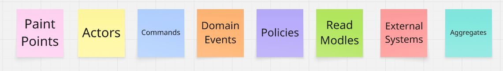

_Nota._ Elaboración propia (2026) en Miro.

La Figura 16 muestra la notación visual utilizada durante el Design-Level EventStorming de ParkingNow. Las notas amarillas representan actores, las azules comandos, las naranjas eventos de dominio, las moradas políticas, las verdes modelos de lectura, las rojas sistemas externos y las turquesas agregados. Esta convención visual se mantuvo durante todos los pasos del proceso para que cada elemento del tablero tenga un significado consistente.

#### Step 1: Unstructured Exploration

El primer paso consistió en una exploración no estructurada del dominio. En esta etapa se identificaron eventos relevantes de ParkingNow sin imponer todavía un orden cronológico. El objetivo fue capturar la mayor cantidad posible de hechos significativos que ocurren dentro del sistema.

Los eventos fueron redactados en pasado, ya que representan hechos que ya sucedieron en el dominio. Entre los eventos identificados se encuentran **Parking lot affiliated**, **Parking lot registered**, **Parking space identifiers assigned**, **Destination searched**, **Nearby parking lots displayed**, **Parking lot selected**, **Availability consulted**, **Verified availability displayed**, **Reservation requested**, **Reservation registered**, **Reservation confirmed**, **Virtual ticket generated**, **Reservation identifier assigned**, **Driver arrived at parking lot**, **Reservation validated**, **Vehicle detected**, **Parking space occupied**, **Reservation consumed**, **IoT event registered**, **Vehicle exited**, **Parking space released**, **Reservation history updated**, **IoT heartbeat received**, **IoT node disconnected**, **Data buffered locally**, **Last known status preserved** y **Synchronization restored**.

**Figura 17**  
_EventStorming Step 1: Unstructured Exploration_

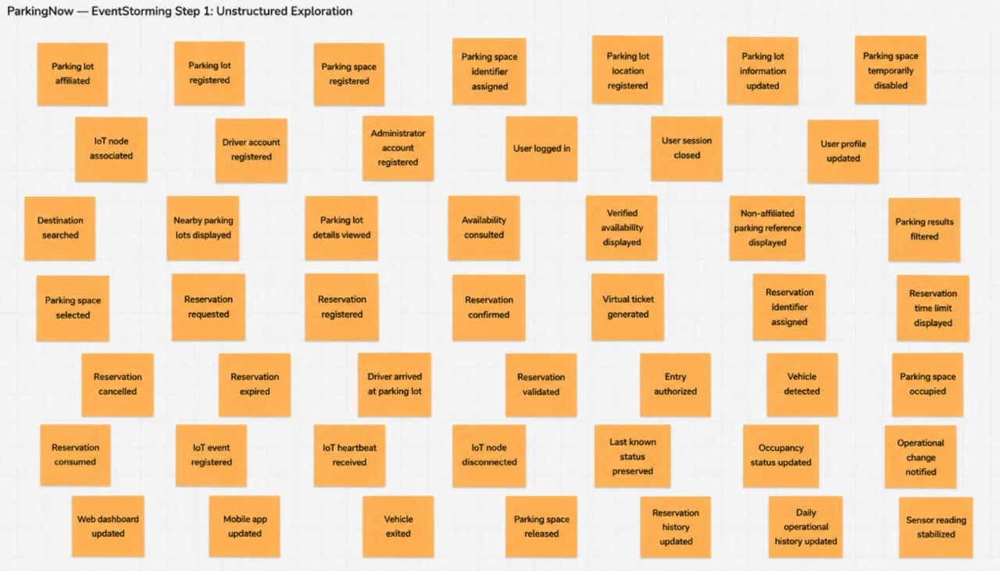

_Nota._ Elaboración propia (2026) en Miro.

La Figura 17 muestra la primera exploración del dominio mediante eventos de dominio representados con notas naranjas. En este punto, el objetivo no fue ordenar todavía el flujo, sino identificar todos los hechos relevantes que ocurren en ParkingNow. Esta exploración permitió visualizar la amplitud del dominio y detectar eventos relacionados con la configuración del estacionamiento, la búsqueda de disponibilidad, la reserva, la validación, la ocupación física y la conectividad IoT.

#### Step 2: Timelines

En el segundo paso, los eventos identificados fueron organizados en líneas de tiempo. Para ello, se ordenaron de izquierda a derecha de acuerdo con la secuencia en la que ocurren dentro de los procesos principales de ParkingNow.

A partir de esta organización se definieron seis flujos principales del dominio. El primer flujo corresponde a la configuración del estacionamiento. El segundo flujo corresponde al descubrimiento de estacionamientos y disponibilidad. El tercer flujo corresponde al ciclo de reserva y generación de ticket virtual. El cuarto flujo corresponde a la llegada, validación y ocupación física del espacio. El quinto flujo corresponde a la salida del vehículo y actualización del historial operacional. Finalmente, el sexto flujo corresponde a la conectividad IoT y sincronización de datos.

La gestión de identidad y acceso fue representada como una sección de soporte transversal, debido a que no constituye un flujo operativo principal del estacionamiento, pero sí habilita acciones protegidas para conductores y dueños de estacionamiento.

**Figura 18**  
_EventStorming Step 2: Timelines_

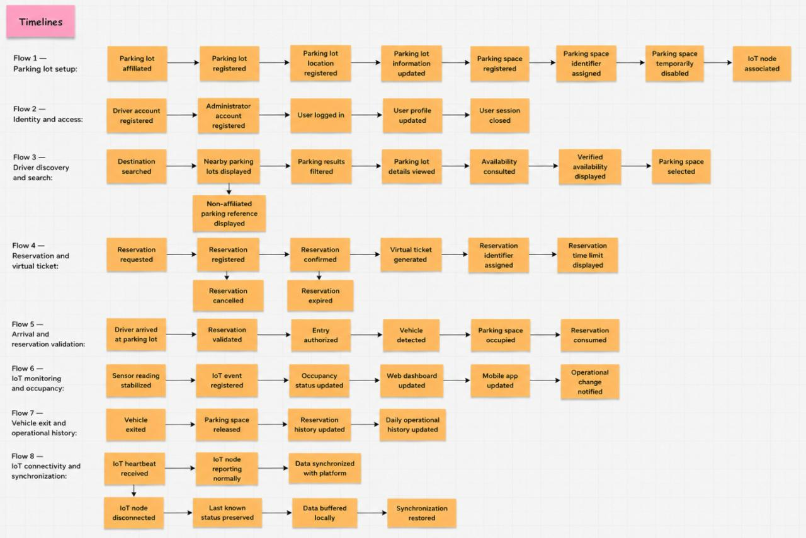

_Nota._ Elaboración propia (2026) en Miro.

La Figura 18 muestra los eventos de dominio organizados en líneas de tiempo. Cada fila representa un flujo operativo de ParkingNow, ordenado de izquierda a derecha según la secuencia en que ocurren los eventos. Este paso permitió transformar una lista inicial de eventos en una representación cronológica del comportamiento del sistema y facilitó la identificación de dependencias entre configuración, disponibilidad, reserva, validación, ocupación y sincronización.

#### Step 3: Pain Points

En el tercer paso se identificaron los principales **pain points** del dominio. Estos representan problemas, riesgos, ambigüedades o puntos de fricción dentro de los procesos de ParkingNow. En el tablero se representaron mediante notas fucsias con forma de rombo, ubicadas cerca de los eventos o secciones donde aparece el problema.

Entre los pain points identificados se encuentran el riesgo de que el registro manual ralentice la afiliación de estacionamientos, la posibilidad de errores en la configuración de espacios, la desconfianza del conductor frente a información de disponibilidad desactualizada, el riesgo de doble reserva, la necesidad de validar correctamente el ticket virtual, la posibilidad de falsos positivos del sensor y la pérdida de disponibilidad en tiempo real cuando el nodo IoT queda sin conexión.

**Figura 19**  
_EventStorming Step 3: Pain Points_

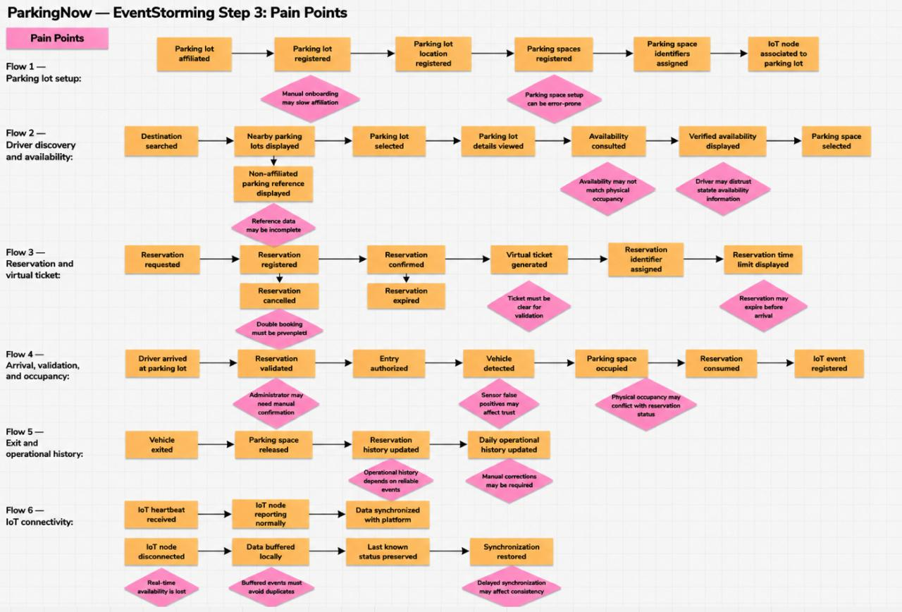

_Nota._ Elaboración propia (2026) en Miro.

La Figura 19 muestra los pain points identificados en los flujos principales de ParkingNow. Estos puntos se ubican cerca del evento o sección afectada, pero no forman parte del flujo principal. Este análisis permitió identificar riesgos de negocio y técnicos que debían considerarse en el diseño de la solución, especialmente los relacionados con disponibilidad confiable, doble reserva, validación de ticket y desconexión del nodo IoT.

#### Step 4: Pivotal Points

En el cuarto paso se identificaron los **pivotal points** o puntos fundamentales. Estos representan eventos o momentos del flujo que marcan un cambio importante de fase dentro del dominio. En el tablero se representaron mediante líneas verticales ubicadas sobre eventos clave.

En ParkingNow, los pivotal points ayudaron a distinguir momentos críticos como el registro del estacionamiento, la consulta de disponibilidad, la confirmación de reserva, la generación del ticket virtual, la validación de la reserva, la detección del vehículo, la ocupación del espacio, la liberación del estacionamiento y la recuperación de sincronización.

**Figura 20**  
_EventStorming Step 4: Pivotal Points_

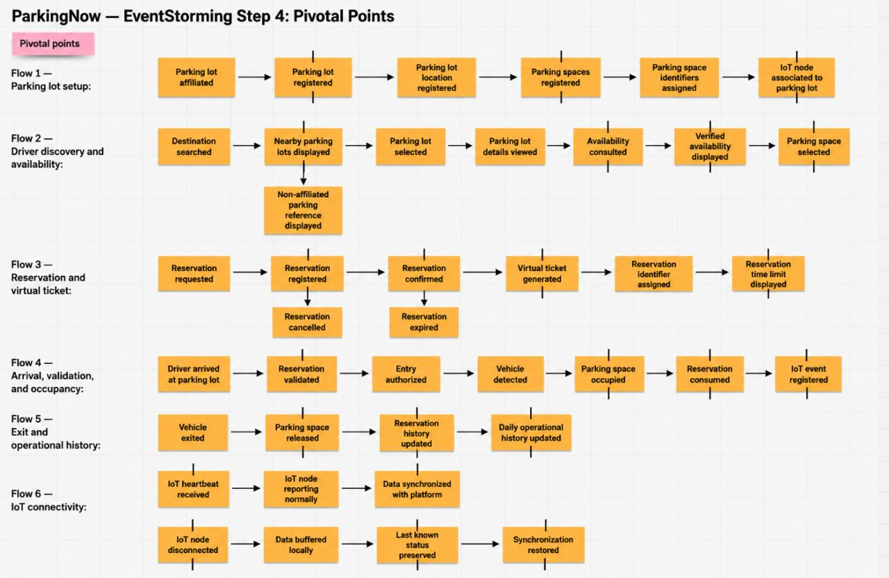

_Nota._ Elaboración propia (2026) en Miro.

La Figura 20 muestra los puntos fundamentales del dominio de ParkingNow. Las líneas verticales señalan eventos que dividen fases relevantes del proceso. La identificación de estos puntos permitió reconocer cambios importantes en el estado del negocio, como el paso de una intención de reserva a una reserva confirmada, de un espacio libre a uno ocupado físicamente, o de un nodo desconectado a una sincronización restaurada.

#### Step 5: Commands

En el quinto paso se incorporaron los comandos al tablero. Mientras los eventos representan hechos que ya ocurrieron, los comandos representan acciones u órdenes que deben ejecutarse para producir esos eventos. En la pizarra, los comandos fueron representados con notas azules y ubicados antes de los eventos de dominio correspondientes.

Dentro de ParkingNow se identificaron comandos como **Affiliate parking lot**, **Register parking lot**, **Register parking lot location**, **Register parking spaces**, **Assign parking space identifiers**, **Associate IoT node**, **Search destination**, **Display nearby parking lots**, **Select parking lot**, **Consult availability**, **Display verified availability**, **Request reservation**, **Register reservation**, **Confirm reservation**, **Generate virtual ticket**, **Assign reservation identifier**, **Display reservation time limit**, **Validate reservation**, **Authorize entry**, **Detect vehicle**, **Update parking space occupancy**, **Consume reservation**, **Register IoT event**, **Exit parking space**, **Release parking space**, **Update reservation history**, **Update daily operational history**, **Send heartbeat**, **Report node status**, **Synchronize data with platform**, **Detect IoT disconnection**, **Buffer data locally**, **Preserve last known status** y **Restore synchronization**.

**Figura 21**  
_EventStorming Step 5: Commands_

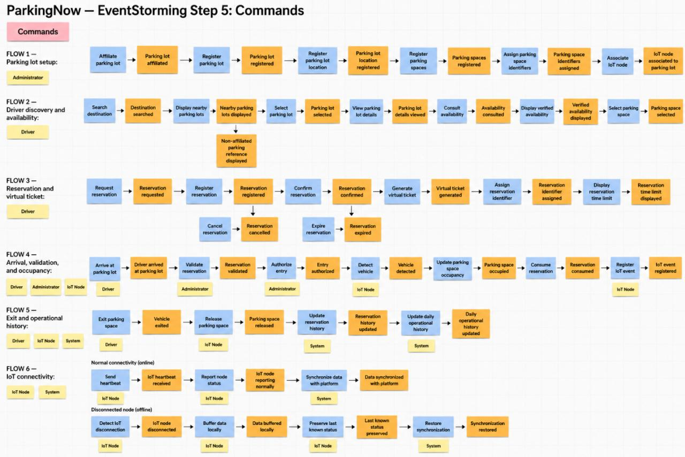

_Nota._ Elaboración propia (2026) en Miro.

La Figura 21 muestra los comandos incorporados a cada flujo del EventStorming. Las notas azules representan acciones que producen eventos de dominio representados con notas naranjas. Este paso permitió diferenciar claramente entre la intención de ejecutar una operación y el resultado que dicha operación produce dentro del dominio.

#### Step 6: Policies

En el sexto paso se agregaron políticas de automatización. Las políticas representan reglas del dominio que reaccionan ante un evento y disparan un comando sin intervención directa de un actor humano. En el tablero fueron representadas mediante notas moradas.

En ParkingNow, varias reglas del dominio se comportan como políticas. Por ejemplo, cuando se registran espacios de estacionamiento, el sistema requiere identificadores únicos; cuando se consulta disponibilidad, el sistema prioriza disponibilidad verificada por IoT; cuando una reserva es confirmada, se genera un ticket virtual; cuando un ticket virtual se genera, se asigna un identificador único de reserva; cuando el tiempo límite vence y el conductor no llega, la reserva expira; cuando un vehículo es detectado, se actualiza el estado físico de ocupación; cuando una reserva es consumida, se registra el evento IoT correspondiente; y cuando el nodo IoT pierde conexión, se preserva el último estado conocido y se almacenan eventos localmente.

**Figura 22**  
_EventStorming Step 6: Policies_

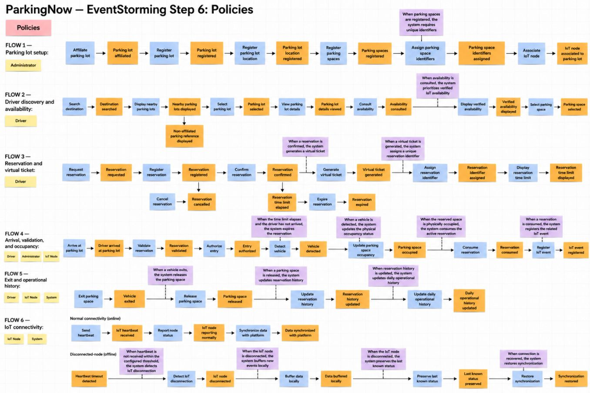

_Nota._ Elaboración propia (2026) en Miro.

La Figura 22 muestra las políticas automáticas del dominio representadas con notas moradas. Estas políticas conectan eventos con comandos que deben ejecutarse automáticamente. Su identificación fue clave para modelar reglas críticas como la expiración de reservas, la priorización de disponibilidad verificada por IoT, el consumo de reservas por ocupación física y la preservación del último estado conocido ante desconexión del nodo.

#### Step 7: Read Models

En el séptimo paso se incorporaron los modelos de lectura. Los **read models** representan la información que un actor necesita visualizar antes de ejecutar un comando. En el tablero se representaron con notas verdes y se ubicaron antes de los comandos correspondientes.

En ParkingNow se identificaron modelos de lectura como **Affiliation request form**, **Parking lot profile view**, **Location map preview**, **Parking space setup table**, **Parking space identifier list**, **IoT node pairing status**, **Destination search input**, **Nearby parking map**, **Parking results list**, **Parking lot detail screen**, **Availability status panel**, **Verified availability view**, **Available parking spaces list**, **Selected parking space detail**, **Reservation request summary**, **Reservation confirmation screen**, **Virtual ticket view**, **Reservation identifier detail**, **Reservation countdown view**, **Arrival instructions screen**, **Reservation validation panel**, **Entry authorization screen**, **Sensor reading status**, **Parking space occupancy status**, **Active reservation status**, **IoT event log**, **Occupied parking space status**, **Parking space availability panel**, **Reservation history view**, **Daily operational dashboard**, **Node heartbeat monitor**, **Node connection status panel**, **Synchronization status view**, **Offline node status panel**, **Local event buffer view**, **Last known status view** y **Reconnection status panel**.

**Figura 23**  
_EventStorming Step 7: Read Models_

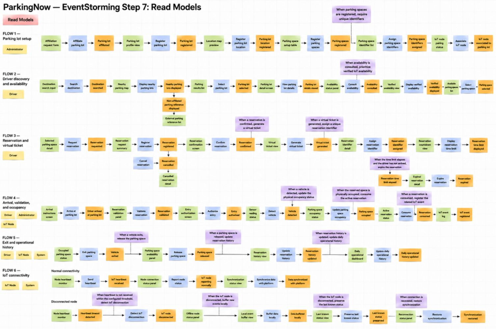

_Nota._ Elaboración propia (2026) en Miro.

La Figura 23 muestra los modelos de lectura del EventStorming de ParkingNow. Estos se representan con notas verdes y permiten visualizar qué información necesita cada actor antes de ejecutar un comando. Este paso fue relevante porque ParkingNow depende de interfaces móviles y web: el conductor requiere disponibilidad, detalle del estacionamiento y ticket virtual; mientras que el dueño de estacionamiento requiere vistas de validación, ocupación y operación diaria.

#### Step 8: External Systems

En el octavo paso se identificaron los sistemas externos que interactúan con el dominio de ParkingNow. Estos sistemas fueron representados mediante notas rojas o rosadas, ubicadas fuera de la línea principal del flujo y conectadas mediante flechas punteadas.

Los sistemas externos identificados fueron **OpenStreetMap / Nominatim**, **OpenStreetMap / Overpass API**, **Geocoding Service**, **QR / Ticket Generation Service**, **QR Scanner / Camera Module**, **Ultrasonic Sensor**, **ESP32 IoT Node**, **Cloud Database Service**, **Cloud Storage / Database**, **Cloud Realtime Database**, **Wi-Fi Network**, **ESP32 Local Storage**, **Internet Connection** y **Authentication Service**.

**Figura 24**  
_EventStorming Step 8: External Systems_

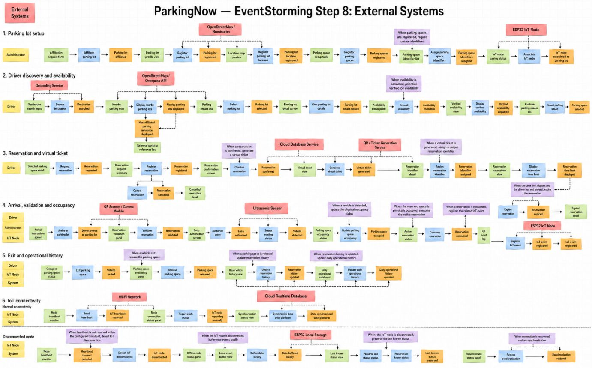

_Nota._ Elaboración propia (2026) en Miro.

La Figura 24 muestra los sistemas externos que intervienen en ParkingNow. Estos se ubican fuera del flujo principal y se conectan mediante líneas punteadas hacia los comandos, eventos o modelos de lectura que apoyan. Este paso permitió diferenciar qué responsabilidades pertenecen al dominio principal y cuáles dependen de componentes externos o físicos, como OpenStreetMap, el módulo QR, el sensor ultrasónico, el ESP32 y los servicios cloud.

#### Step 9: Aggregates

En el noveno paso se identificaron los agregados del dominio. Un agregado representa un objeto o grupo lógico de objetos que recibe comandos y produce eventos. En el tablero se representó mediante notas turquesas ubicadas cerca de los grupos de comandos, eventos, políticas y modelos de lectura que gobiernan.

A partir del análisis de los flujos, se identificaron agregados relacionados con la gestión del estacionamiento, la búsqueda, la disponibilidad, las reservas, los tickets virtuales, la validación de ingreso, la ocupación física, el historial operacional, las notificaciones, la conectividad IoT y la identidad de usuarios.

Los agregados identificados fueron **Parking Lot**, **Parking Lot Profile**, **Parking Space**, **IoT Node Pairing**, **Search Session**, **Parking Reference**, **Availability**, **Reservation**, **Virtual Ticket**, **Reservation Validation**, **Occupancy Status**, **IoT Event**, **Operational History**, **Operational Notification**, **Web Dashboard Update**, **Mobile App Update**, **Node Connection**, **Local Event Buffer**, **Last Known Status**, **Synchronization State**, **User Account**, **User Session**, **User Profile** y **Role Access**.

**Figura 25**  
_EventStorming Step 9: Aggregates_

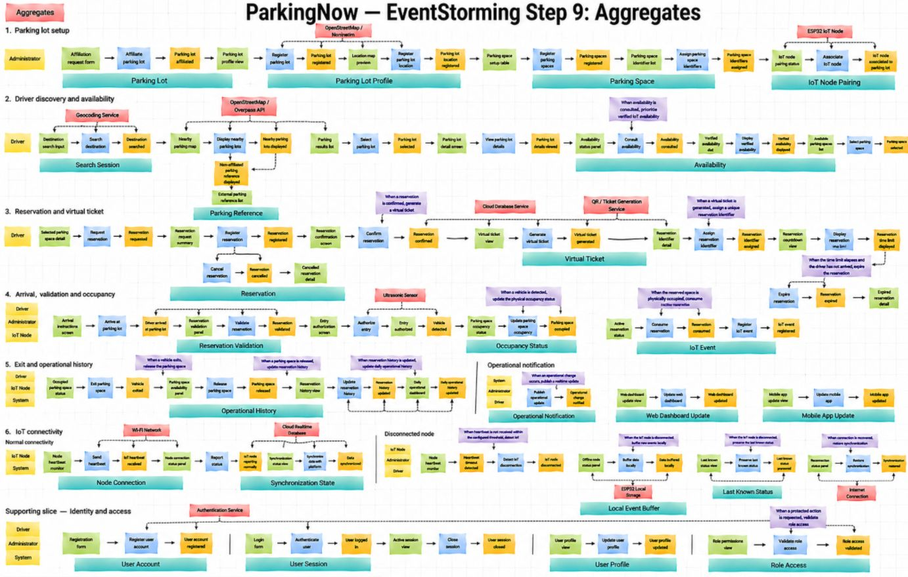

_Nota._ Elaboración propia (2026) en Miro.

La Figura 25 muestra los agregados identificados en el EventStorming de ParkingNow. Estos se representan mediante notas turquesas y agrupan comandos, eventos, políticas y modelos de lectura relacionados. Este paso permitió pasar desde una secuencia de eventos y comandos hacia una estructura de dominio más clara. Los agregados sirvieron como insumo directo para el Candidate Context Discovery, ya que permitieron observar qué grupos de conceptos tienen alta cohesión funcional y cuáles requieren límites de modelo independientes.

En este punto, el EventStorming de diseño permitió evidenciar la evolución completa de la pizarra desde la exploración inicial hasta la identificación de agregados. El siguiente paso corresponde al descubrimiento de contextos candidatos, donde los agregados son agrupados en bounded contexts de acuerdo con su responsabilidad dentro del dominio.

#### 4.1.1.1. Candidate Context Discovery

El **Candidate Context Discovery** corresponde al décimo paso del proceso de EventStorming. En esta etapa, los agregados identificados en el paso anterior fueron analizados y agrupados para descubrir límites candidatos del dominio. El objetivo fue identificar qué conjuntos de agregados comparten un lenguaje, una responsabilidad funcional y reglas de negocio suficientemente cohesionadas como para formar un **Bounded Context**.

La sesión de descubrimiento de contextos candidatos tuvo una duración aproximada de **1 hora y 30 minutos**, por lo que no superó el límite de dos horas recomendado para esta actividad. En esta sesión no se volvió a construir la pizarra desde eventos, pain points, comandos o políticas, ya que dichos elementos fueron trabajados previamente en el Design-Level EventStorming. En cambio, el equipo tomó como punto de partida los agregados obtenidos en el Step 9 y los agrupó de acuerdo con su cohesión funcional, lenguaje de dominio y relación con los eventos fundamentales del proceso.

Para realizar esta agrupación, se aplicaron tres criterios principales de descubrimiento. Primero, mediante **start-with-value**, se priorizaron las áreas que generan mayor valor para ParkingNow: la reserva de espacios y el monitoreo físico de ocupación mediante IoT. Segundo, mediante **start-with-simple**, se respetó la secuencia natural del dominio: configurar estacionamiento, descubrir disponibilidad, reservar, validar, monitorear y notificar. Tercero, mediante **look-for-pivotal-events**, se tomaron como referencia eventos clave como **Reservation confirmed**, **Virtual ticket generated**, **Vehicle detected**, **Parking space occupied**, **IoT node disconnected** y **Synchronization restored**, ya que estos eventos marcan cambios de estado importantes dentro del negocio.

La evidencia visual del descubrimiento se muestra a partir de la evolución entre los agregados del Step 9 y la agrupación final en bounded contexts del Step 10. En esta última vista, los agregados fueron encerrados mediante fronteras punteadas para representar límites candidatos del dominio.

**Figura 26**  
_EventStorming Step 10: Bounded Contexts_

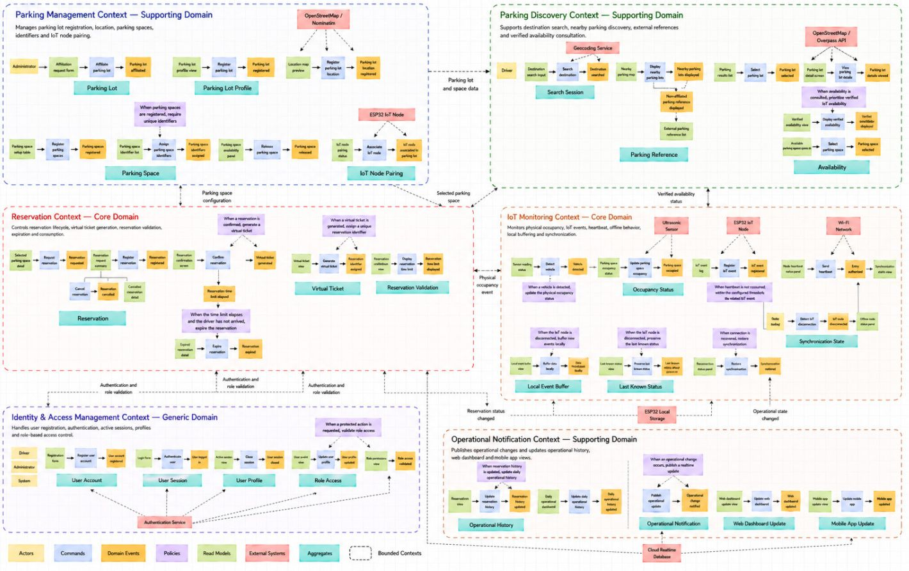

_Nota._ Elaboración propia (2026) en Miro.

La Figura 26 muestra la agrupación final de agregados en bounded contexts candidatos para ParkingNow. Las fronteras punteadas delimitan áreas del dominio con responsabilidades, lenguaje y reglas de negocio cohesionadas. Esta vista permite observar cómo los agregados del Step 9 fueron agrupados en seis contextos candidatos: **Parking Management Context**, **Parking Discovery Context**, **Reservation Context**, **IoT Monitoring Context**, **Identity & Access Management Context** y **Operational Notification Context**.

##### Parking Management Context

**Figura 27**  
_Candidate Bounded Context: Parking Management Context_

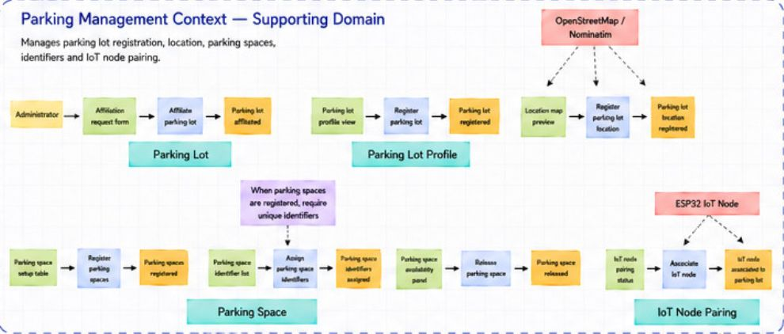

_Nota._ Elaboración propia (2026) en Miro.

Según la Figura 27, el **Parking Management Context** agrupa las responsabilidades relacionadas con la administración del estacionamiento. Su propósito es permitir que un dueño de estacionamiento afilie un estacionamiento, registre su información, configure su ubicación, registre espacios, asigne identificadores únicos y asocie nodos IoT a los espacios físicos.

Este contexto surge de los agregados **Parking Lot**, **Parking Lot Profile**, **Parking Space** y **IoT Node Pairing**. Estos agregados comparten un lenguaje centrado en la configuración del estacionamiento y en la estructura física que será utilizada posteriormente por otros procesos del sistema.

La responsabilidad de este contexto es mantener la información base del estacionamiento. Por ello, conceptos como **Parking Lot**, **Parking Space**, **Parking Lot Profile**, **Parking Space Identifier** e **IoT Node Pairing** pertenecen a este límite. Sin este contexto, los demás módulos no podrían consultar espacios disponibles, crear reservas válidas ni asociar eventos físicos del nodo IoT con un espacio real.

Este bounded context se clasifica como **Supporting Domain**, debido a que es necesario para que la solución funcione, pero no representa por sí mismo el principal diferenciador competitivo de ParkingNow. Su valor está en habilitar correctamente la operación del estacionamiento.

##### Parking Discovery Context

**Figura 28**  
_Candidate Bounded Context: Parking Discovery Context_

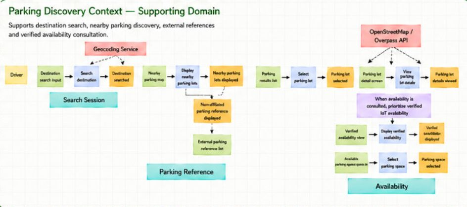

_Nota._ Elaboración propia (2026) en Miro.

Según la Figura 28, el **Parking Discovery Context** agrupa las responsabilidades relacionadas con la búsqueda de estacionamientos y consulta de disponibilidad por parte del conductor. Su propósito es permitir que el usuario busque un destino, visualice estacionamientos cercanos, revise información de referencia y consulte disponibilidad verificada antes de seleccionar un espacio.

Este contexto surge de los agregados **Search Session**, **Parking Reference** y **Availability**. Estos agregados comparten un lenguaje orientado a la exploración y descubrimiento de opciones de estacionamiento, así como a la presentación de información útil para la toma de decisión del conductor.

La responsabilidad de este contexto es transformar datos de ubicación, referencias externas y disponibilidad en información consultable para el usuario. Por ello, se relaciona con sistemas externos como **OpenStreetMap / Overpass API** y **Geocoding Service**, pero mantiene su propio modelo para conceptos como **Search Session**, **Parking Reference**, **Nearby Parking Map**, **Availability Status** y **Verified Availability**.

Este bounded context se clasifica como **Supporting Domain**, ya que facilita la experiencia de búsqueda y selección, pero depende de otros contextos para obtener datos de configuración y ocupación real. En particular, consume información del Parking Management Context y del IoT Monitoring Context.

##### Reservation Context

**Figura 29**  
_Candidate Bounded Context: Reservation Context_

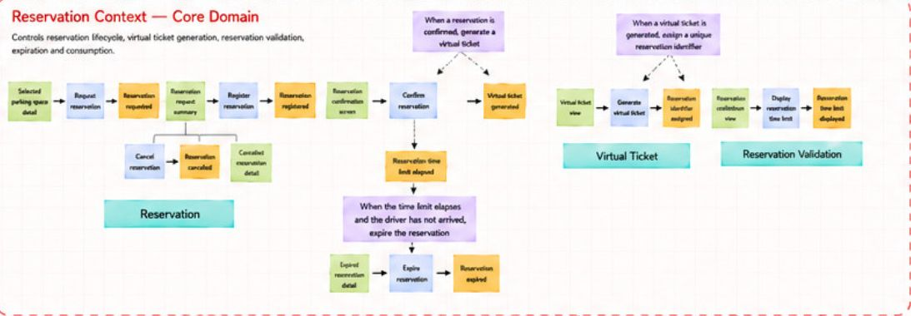

_Nota._ Elaboración propia (2026) en Miro.

Según la Figura 29, el **Reservation Context** agrupa las responsabilidades relacionadas con el ciclo de vida de la reserva y la generación del ticket virtual. Su propósito es permitir que el conductor solicite una reserva, confirme el uso de un espacio, obtenga un ticket virtual, reciba un identificador único y gestione la expiración o cancelación de la reserva.

Este contexto surge de los agregados **Reservation**, **Virtual Ticket** y **Reservation Validation**. Estos agregados comparten reglas de negocio críticas, como la confirmación de reserva, generación de ticket, asignación de identificador, control de tiempo límite, validación de llegada y consumo de la reserva cuando el vehículo ocupa físicamente el espacio.

La responsabilidad de este contexto es controlar el ciclo de vida lógico de la reserva. Por ello, conceptos como **Reservation**, **Reservation Status**, **Virtual Ticket**, **Reservation Identifier**, **Reservation Time Limit**, **Reservation Validation** y **Active Reservation** pertenecen a este límite.

Este bounded context se clasifica como **Core Domain**, porque representa una de las capacidades diferenciales de ParkingNow. No se trata únicamente de mostrar estacionamientos, sino de permitir al conductor asegurar temporalmente un espacio y vincular esa reserva con la validación física y digital del ingreso.

##### IoT Monitoring Context

**Figura 30**  
_Candidate Bounded Context: IoT Monitoring Context_

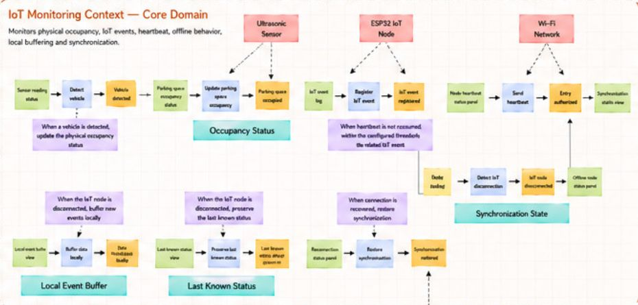

_Nota._ Elaboración propia (2026) en Miro.

Según la Figura 30, el **IoT Monitoring Context** agrupa las responsabilidades relacionadas con la detección física de ocupación, registro de eventos IoT, conectividad del nodo, almacenamiento local, último estado conocido y sincronización. Su propósito es conectar los eventos físicos del estacionamiento con el estado digital de la plataforma.

Este contexto surge de los agregados **Occupancy Status**, **IoT Event**, **Node Connection**, **Local Event Buffer**, **Last Known Status** y **Synchronization State**. Estos agregados comparten un lenguaje técnico y de dominio centrado en sensores, ocupación física, heartbeat, desconexión, almacenamiento local y sincronización.

La responsabilidad de este contexto es monitorear el estado real del espacio de estacionamiento. Por ello, conceptos como **Sensor Reading**, **Vehicle Detected**, **Parking Space Occupied**, **IoT Event**, **IoT Heartbeat**, **IoT Node Disconnected**, **Local Event Buffer**, **Last Known Status** y **Synchronization State** pertenecen a este límite.

Este bounded context se clasifica como **Core Domain**, porque representa uno de los principales diferenciadores de ParkingNow frente a soluciones que solo muestran información referencial. La capacidad de verificar disponibilidad mediante sensores físicos permite mejorar la confiabilidad del sistema y reducir inconsistencias entre la reserva lógica y la ocupación real.

##### Identity & Access Management Context

**Figura 31**  
_Candidate Bounded Context: Identity & Access Management Context_

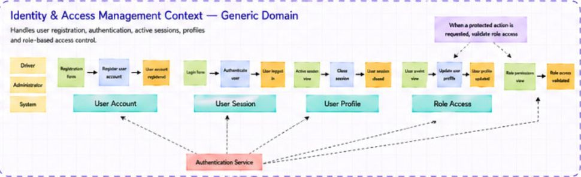

_Nota._ Elaboración propia (2026) en Miro.

Según la Figura 31, el **Identity & Access Management Context** agrupa las responsabilidades relacionadas con el registro de usuarios, autenticación, sesiones, perfiles y validación de roles. Aunque fue representado en la pizarra como una sección de soporte y no como uno de los seis flujos principales, se identificó como un bounded context independiente debido a que maneja reglas y conceptos transversales del sistema.

Este contexto surge de los agregados **User Account**, **User Session**, **User Profile** y **Role Access**. Estos agregados comparten un lenguaje centrado en identidad, autenticación, sesión activa, perfil de usuario y permisos de acceso.

La responsabilidad de este contexto es controlar quién puede acceder al sistema y qué acciones puede ejecutar. Por ello, conceptos como **User Account**, **User Session**, **User Profile**, **Role Access**, **Authentication Service**, **Driver**, **Parking Owner** y **System** pertenecen a este límite.

Este bounded context se clasifica como **Generic Domain**, debido a que la autenticación y autorización no representan el diferencial principal de ParkingNow, pero son necesarias para proteger operaciones críticas como registrar estacionamientos, validar reservas o consultar información operacional.

##### Operational Notification Context

**Figura 32**  
_Candidate Bounded Context: Operational Notification Context_

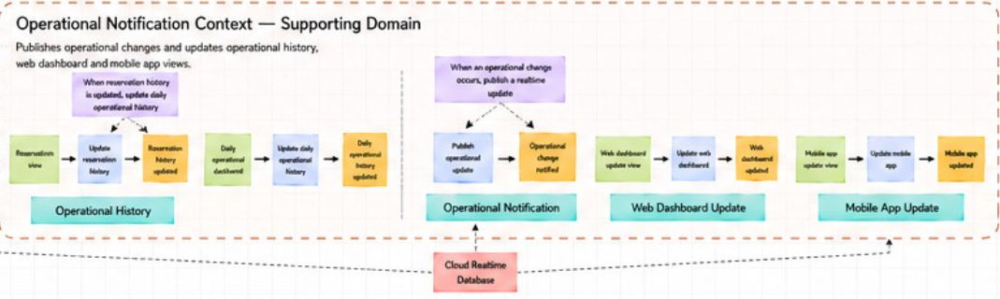

_Nota._ Elaboración propia (2026) en Miro.

Según la Figura 32, el **Operational Notification Context** agrupa las responsabilidades relacionadas con la publicación de cambios operacionales y la actualización de vistas en tiempo real. Su propósito es notificar cambios relevantes a los consumidores del sistema, como el dashboard web del dueño de estacionamiento y la aplicación móvil del conductor.

Este contexto surge de los agregados **Operational History**, **Operational Notification**, **Web Dashboard Update** y **Mobile App Update**. Estos agregados comparten un lenguaje orientado a cambios operacionales, publicación de actualizaciones, actualización de vistas y comunicación de estado hacia interfaces cliente.

La responsabilidad de este contexto es propagar eventos relevantes generados por otros contextos. Por ejemplo, cuando cambia el estado de ocupación, se consume una reserva, se libera un espacio o se actualiza el historial operacional, este contexto se encarga de publicar la información hacia el dashboard web y la aplicación móvil.

Este bounded context se clasifica como **Supporting Domain**, porque no define por sí mismo la lógica central de reserva ni la detección física IoT, pero permite que los cambios del sistema sean visibles oportunamente para los usuarios. Su importancia está en mantener la experiencia operacional actualizada y coherente.

##### Relación entre agregados y bounded contexts

La siguiente tabla resume la relación entre los agregados identificados en el Step 9 y los bounded contexts descubiertos en el Step 10.

| Bounded Context                          | Agregados relacionados                                                                                     | Clasificación     |
| ---------------------------------------- | ---------------------------------------------------------------------------------------------------------- | ----------------- |
| **Parking Management Context**           | Parking Lot, Parking Lot Profile, Parking Space, IoT Node Pairing                                          | Supporting Domain |
| **Parking Discovery Context**            | Search Session, Parking Reference, Availability                                                            | Supporting Domain |
| **Reservation Context**                  | Reservation, Virtual Ticket, Reservation Validation                                                        | Core Domain       |
| **IoT Monitoring Context**               | Occupancy Status, IoT Event, Node Connection, Local Event Buffer, Last Known Status, Synchronization State | Core Domain       |
| **Identity & Access Management Context** | User Account, User Session, User Profile, Role Access                                                      | Generic Domain    |
| **Operational Notification Context**     | Operational History, Operational Notification, Web Dashboard Update, Mobile App Update                     | Supporting Domain |

La agrupación evidencia que ParkingNow no debe diseñarse como una única aplicación monolítica sin límites claros. Por el contrario, el dominio contiene áreas con modelos, reglas y responsabilidades diferenciadas. La reserva y el monitoreo IoT concentran la lógica más crítica del negocio, mientras que la gestión de estacionamientos, el descubrimiento, la identidad y las notificaciones operacionales cumplen funciones necesarias para completar la experiencia del producto.

En conclusión, el Candidate Context Discovery permitió transformar los agregados del Design-Level EventStorming en seis bounded contexts candidatos. Estos límites serán utilizados como base para las siguientes decisiones de diseño táctico, incluyendo la definición de responsabilidades internas, objetos de dominio, servicios, APIs, integración entre contextos y componentes arquitectónicos de ParkingNow.

Enlace del miro: https://miro.com/welcomeonboard/cE81V0lIQ2x2VHg3MktWbXVaTUM4UjJ3ZXhUcEFCUTN5TmdiL3FmNXdoeURwS2YyYlpUS1BMazd1b2JXSnRGZ3l1RGl4cEhMeWJDZVlUd3FHNzNZVVVmQnUraUd4TE1vQmR5bitqV3AzWkExYTNDcmZtd00vRnM1MkY2RWc4MFpNakdSWkpBejJWRjJhRnhhb1UwcS9BPT0hdjE=?share_link_id=425067057750

### 4.1.1.2. Domain Message Flows Modeling

Luego de identificar los bounded contexts candidatos en el **Candidate Context Discovery**, se elaboraron los **Domain Message Flow Diagrams** con el propósito de representar cómo colaboran los contextos del dominio de **ParkingNow** para ejecutar los escenarios principales del negocio. Esta actividad permitió pasar de una vista estructural del dominio a una vista dinámica, donde se observa qué mensajes cruzan los límites entre contextos, actores y sistemas externos.

Para modelar estos flujos se aplicó la técnica de **Domain Storytelling**, representando actores, bounded contexts, sistemas externos y mensajes intercambiados. Los mensajes fueron clasificados en tres tipos: **Commands**, cuando un actor o contexto solicita ejecutar una acción; **Events**, cuando se comunica que algo relevante ya ocurrió en el dominio; y **Queries**, cuando un contexto solicita información para tomar una decisión o continuar el flujo.

Los diagramas se diseñaron manteniendo una notación visual consistente. Los actores se representaron con íconos de persona, los bounded contexts mediante nubes, los sistemas externos mediante íconos de engranaje y los mensajes mediante tarjetas de colores. Las tarjetas azules representan **Commands**, las tarjetas naranjas representan **Events** y las tarjetas verdes representan **Queries**. Además, las líneas punteadas indican la dirección del mensaje entre los participantes del flujo.

Para ParkingNow se modelaron cinco escenarios principales: búsqueda y reserva de espacio, validación de llegada y consumo de reserva, salida del vehículo y actualización del historial operacional, desconexión y recuperación de sincronización IoT, y configuración del estacionamiento con asociación de nodo IoT. Estos escenarios fueron seleccionados porque cruzan varios bounded contexts y representan los procesos más importantes para la operación de la plataforma.

**Figura 33**  
_Domain Message Flow Diagram: Search and Reserve Parking Space_

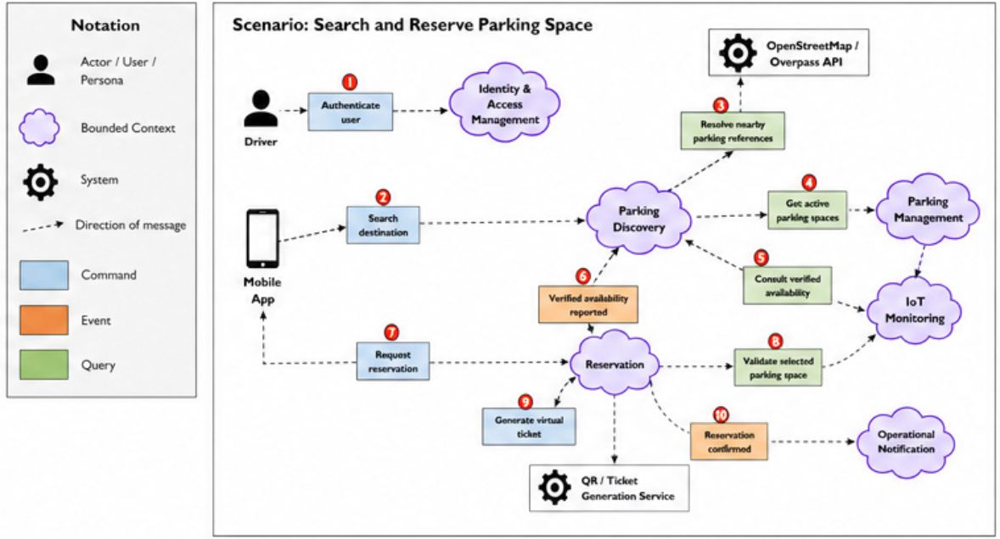

_Nota._ Elaboración propia (2026) en Miro.

Según la Figura 33, el escenario **Search and Reserve Parking Space** describe la colaboración necesaria para que un conductor busque un estacionamiento, consulte disponibilidad verificada y reserve un espacio. El flujo inicia cuando el **Driver** se autentica mediante el bounded context **Identity & Access Management**. Luego, desde la aplicación móvil, el conductor ejecuta el comando **Search destination**, el cual es procesado por el bounded context **Parking Discovery**.

El bounded context **Parking Discovery** consulta al sistema externo **OpenStreetMap / Overpass API** para resolver referencias cercanas al destino buscado. Después solicita información al bounded context **Parking Management** para obtener espacios activos y consulta al bounded context **IoT Monitoring** para verificar disponibilidad real mediante datos provenientes de sensores. Cuando la disponibilidad verificada es reportada, el conductor puede solicitar una reserva al bounded context **Reservation**.

Finalmente, el bounded context **Reservation** valida el espacio seleccionado, genera el ticket virtual mediante el sistema externo **QR / Ticket Generation Service** y produce el evento **Reservation confirmed**, que es comunicado al bounded context **Operational Notification** para permitir la actualización posterior de las interfaces del sistema. Este flujo evidencia que la reserva de un espacio no depende únicamente de una búsqueda geográfica, sino también de la disponibilidad física verificada y de la coordinación entre los contextos de descubrimiento, gestión, monitoreo IoT y reservas.

| Orden | Tipo de mensaje | Mensaje                           | Emisor              | Receptor                       |
| ----- | --------------- | --------------------------------- | ------------------- | ------------------------------ |
| 1     | Command         | Authenticate user                 | Driver              | Identity & Access Management   |
| 2     | Command         | Search destination                | Mobile App          | Parking Discovery              |
| 3     | Query           | Resolve nearby parking references | Parking Discovery   | OpenStreetMap / Overpass API   |
| 4     | Query           | Get active parking spaces         | Parking Discovery   | Parking Management             |
| 5     | Query           | Consult verified availability     | Parking Discovery   | IoT Monitoring                 |
| 6     | Event           | Verified availability reported    | IoT Monitoring      | Parking Discovery              |
| 7     | Command         | Request reservation               | Driver / Mobile App | Reservation                    |
| 8     | Query           | Validate selected parking space   | Reservation         | Parking Management             |
| 9     | Command         | Generate virtual ticket           | Reservation         | QR / Ticket Generation Service |
| 10    | Event           | Reservation confirmed             | Reservation         | Operational Notification       |

**Figura 34**  
_Domain Message Flow Diagram: Arrival Validation and Reservation Consumption_

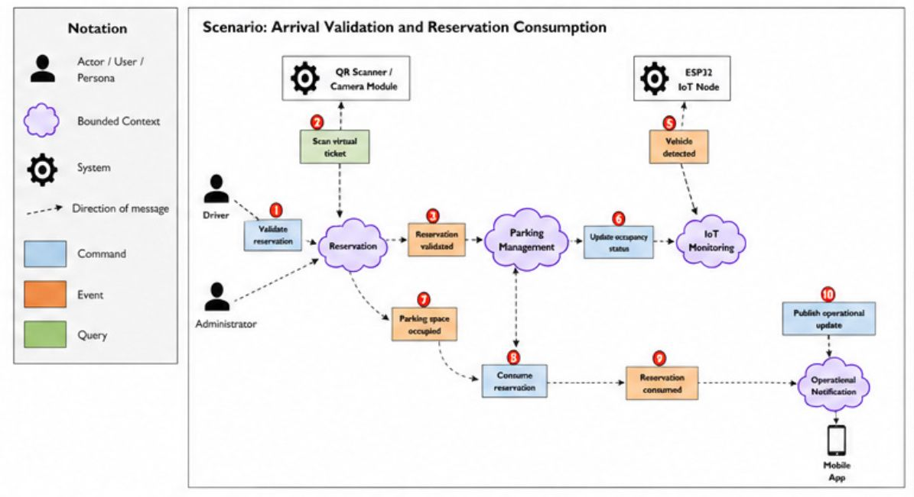

_Nota._ Elaboración propia (2026) en Miro.

Según la Figura 34, el escenario **Arrival Validation and Reservation Consumption** representa el flujo que ocurre cuando el conductor llega al estacionamiento y debe validar su reserva para ocupar el espacio físico. El proceso inicia con el comando **Validate reservation**, ejecutado por el **Driver** o por el **Parking Owner**, y recibido por el bounded context **Reservation**. Para validar el ticket virtual, este contexto consulta el sistema externo **QR Scanner / Camera Module** mediante el mensaje **Scan virtual ticket**.

Una vez validada la reserva, el bounded context **Reservation** produce el evento **Reservation validated**, el cual permite que el bounded context **Parking Management** autorice la entrada al estacionamiento. Posteriormente, el sistema externo **ESP32 IoT Node** detecta físicamente el vehículo y envía el evento **Vehicle detected** al bounded context **IoT Monitoring**.

El bounded context **IoT Monitoring** solicita actualizar el estado de ocupación al bounded context **Parking Management** mediante el comando **Update occupancy status**. Cuando el espacio queda marcado como ocupado, se produce el evento **Parking space occupied**, que permite al bounded context **Reservation** ejecutar el comando **Consume reservation**. Finalmente, el evento **Reservation consumed** se comunica al bounded context **Operational Notification**, que publica la actualización operacional hacia la aplicación móvil.

Este flujo es crítico porque conecta la reserva digital con el estado físico real del estacionamiento. La reserva no se considera consumida únicamente por la llegada del usuario, sino cuando existe una validación lógica y una confirmación física de ocupación mediante el nodo IoT.

| Orden | Tipo de mensaje | Mensaje                    | Emisor                   | Receptor                   |
| ----- | --------------- | -------------------------- | ------------------------ | -------------------------- |
| 1     | Command         | Validate reservation       | Driver / Parking Owner   | Reservation                |
| 2     | Query           | Scan virtual ticket        | Reservation              | QR Scanner / Camera Module |
| 3     | Event           | Reservation validated      | Reservation              | Parking Management         |
| 4     | Command         | Authorize entry            | Parking Management       | Reservation                |
| 5     | Event           | Vehicle detected           | ESP32 IoT Node           | IoT Monitoring             |
| 6     | Command         | Update occupancy status    | IoT Monitoring           | Parking Management         |
| 7     | Event           | Parking space occupied     | Parking Management       | Reservation                |
| 8     | Command         | Consume reservation        | Parking Management       | Reservation                |
| 9     | Event           | Reservation consumed       | Reservation              | Operational Notification   |
| 10    | Command         | Publish operational update | Operational Notification | Mobile App                 |

**Figura 35**  
_Domain Message Flow Diagram: Exit and Operational History Update_

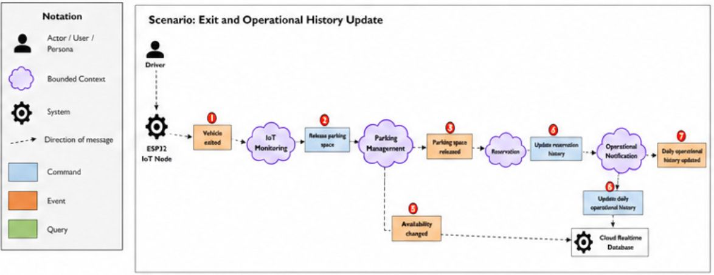

_Nota._ Elaboración propia (2026) en Miro.

Según la Figura 35, el escenario **Exit and Operational History Update** muestra cómo ParkingNow procesa la salida de un vehículo, libera el espacio ocupado y actualiza el historial operacional. El flujo inicia cuando el **ESP32 IoT Node** detecta que el vehículo salió del espacio y comunica el evento **Vehicle exited** al bounded context **IoT Monitoring**.

A partir de este evento, el bounded context **IoT Monitoring** envía el comando **Release parking space** al bounded context **Parking Management**. Este último actualiza el estado del espacio y produce el evento **Parking space released**. Como consecuencia, el bounded context **Reservation** actualiza el historial de la reserva mediante el comando **Update reservation history** y produce el evento **Reservation history updated**.

Luego, el bounded context **Operational Notification** actualiza el historial operacional diario mediante el comando **Update daily operational history** y comunica el evento **Daily operational history updated**. De forma complementaria, el bounded context **Parking Management** produce el evento **Availability changed**, que debe ser consumido por **Parking Discovery** para reflejar que el espacio vuelve a estar disponible para futuras búsquedas.

Este flujo demuestra cómo un evento físico detectado por el nodo IoT termina impactando en distintos modelos del sistema: el estado del espacio, el historial de la reserva, el historial operacional y la disponibilidad visible para los conductores. Por ello, este escenario es importante para mantener consistencia entre la operación física del estacionamiento y la experiencia digital de búsqueda.

| Orden | Tipo de mensaje | Mensaje                           | Emisor                   | Receptor                 |
| ----- | --------------- | --------------------------------- | ------------------------ | ------------------------ |
| 1     | Event           | Vehicle exited                    | ESP32 IoT Node           | IoT Monitoring           |
| 2     | Command         | Release parking space             | IoT Monitoring           | Parking Management       |
| 3     | Event           | Parking space released            | Parking Management       | Reservation              |
| 4     | Command         | Update reservation history        | Reservation              | Operational Notification |
| 5     | Event           | Availability changed              | Parking Management       | Parking Discovery        |
| 6     | Command         | Update daily operational history  | Operational Notification | Cloud Realtime Database  |
| 7     | Event           | Daily operational history updated | Operational Notification | Parking Discovery        |

**Figura 36**  
_Domain Message Flow Diagram: IoT Disconnection and Synchronization Recovery_

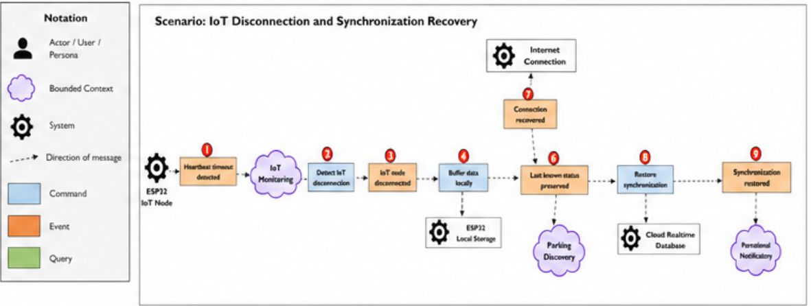

_Nota._ Elaboración propia (2026) en Miro.

Según la Figura 36, el escenario **IoT Disconnection and Synchronization Recovery** representa el comportamiento de ParkingNow cuando un nodo IoT pierde conectividad y posteriormente recupera la sincronización con la plataforma. El flujo inicia cuando el **ESP32 IoT Node** deja de enviar señales de vida dentro del umbral configurado y se produce el evento **Heartbeat timeout detected**, recibido por el bounded context **IoT Monitoring**.

Ante este evento, **IoT Monitoring** ejecuta el comando **Detect IoT disconnection** y produce el evento **IoT node disconnected**. Este evento es relevante para **Operational Notification**, ya que el estado de desconexión debe ser visible en el dashboard operacional. Además, el sistema ejecuta el comando **Buffer data locally** para almacenar eventos en **ESP32 Local Storage**, evitando pérdida de información durante la desconexión.

Mientras el nodo permanece sin conexión, el bounded context **IoT Monitoring** preserva el último estado conocido mediante el comando **Preserve last known status** y produce el evento **Last known status preserved**, que es consumido por **Parking Discovery** para evitar mostrar información inconsistente al conductor. Cuando se recupera la conexión a internet, se produce el evento **Connection recovered**, se ejecuta el comando **Restore synchronization** contra **Cloud Realtime Database** y finalmente se emite el evento **Synchronization restored**, comunicado a **Operational Notification**.

Este flujo evidencia la capacidad de resiliencia del sistema. ParkingNow no depende únicamente de conectividad permanente, sino que mantiene continuidad operacional mediante almacenamiento local, preservación de estado y restauración posterior de sincronización.

| Orden | Tipo de mensaje | Mensaje                     | Emisor              | Receptor                 |
| ----- | --------------- | --------------------------- | ------------------- | ------------------------ |
| 1     | Event           | Heartbeat timeout detected  | ESP32 IoT Node      | IoT Monitoring           |
| 2     | Command         | Detect IoT disconnection    | IoT Monitoring      | IoT Monitoring           |
| 3     | Event           | IoT node disconnected       | IoT Monitoring      | Operational Notification |
| 4     | Command         | Buffer data locally         | IoT Monitoring      | ESP32 Local Storage      |
| 5     | Command         | Preserve last known status  | IoT Monitoring      | IoT Monitoring           |
| 6     | Event           | Last known status preserved | IoT Monitoring      | Parking Discovery        |
| 7     | Event           | Connection recovered        | Internet Connection | IoT Monitoring           |
| 8     | Command         | Restore synchronization     | IoT Monitoring      | Cloud Realtime Database  |
| 9     | Event           | Synchronization restored    | IoT Monitoring      | Operational Notification |

**Figura 37**  
_Domain Message Flow Diagram: Parking Lot Setup and IoT Node Pairing_

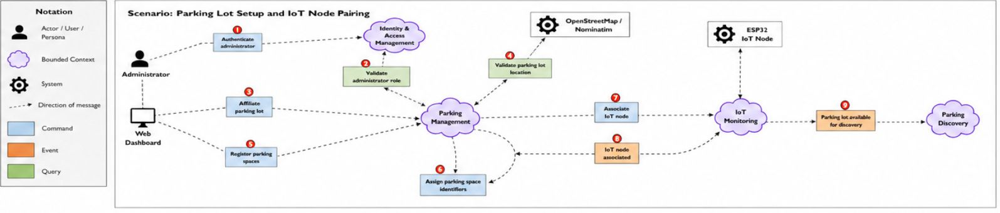

_Nota._ Elaboración propia (2026) en Miro.

Según la Figura 37, el escenario **Parking Lot Setup and IoT Node Pairing** muestra cómo un dueño de estacionamiento configura la información inicial de un estacionamiento y asocia un nodo IoT a la operación física del parking. El proceso inicia con el comando **Authenticate administrator**, enviado por el **Parking Owner** al bounded context **Identity & Access Management**. Luego, el bounded context **Parking Management** consulta la validez del rol mediante el mensaje **Validate administrator role**, ya que solo un dueño de estacionamiento autorizado puede registrar y configurar estacionamientos.

Una vez validado el acceso, el dueño de estacionamiento ejecuta el comando **Affiliate parking lot** desde el **Web Dashboard**. El bounded context **Parking Management** valida la ubicación del estacionamiento mediante el sistema externo **OpenStreetMap / Nominatim** y continúa con el registro de espacios mediante el comando **Register parking spaces**. Posteriormente, se asignan identificadores únicos a cada espacio con el comando **Assign parking space identifiers**.

Luego, el bounded context **Parking Management** solicita al bounded context **IoT Monitoring** la asociación del nodo mediante el comando **Associate IoT node**. Este contexto interactúa con el sistema externo **ESP32 IoT Node** y produce el evento **IoT node associated**. Finalmente, **Parking Management** emite el evento **Parking lot available for discovery**, que permite al bounded context **Parking Discovery** considerar el estacionamiento dentro de las búsquedas de los conductores.

Este flujo es fundamental porque crea la información base que habilita el resto del sistema. Sin la configuración correcta del estacionamiento, los espacios, sus identificadores y el nodo IoT asociado, no sería posible ofrecer disponibilidad verificada ni reservas confiables.

| Orden | Tipo de mensaje | Mensaje                             | Emisor                        | Receptor                     |
| ----- | --------------- | ----------------------------------- | ----------------------------- | ---------------------------- |
| 1     | Command         | Authenticate administrator          | Parking Owner                 | Identity & Access Management |
| 2     | Query           | Validate administrator role         | Parking Management            | Identity & Access Management |
| 3     | Command         | Affiliate parking lot               | Parking Owner / Web Dashboard | Parking Management           |
| 4     | Query           | Validate parking lot location       | Parking Management            | OpenStreetMap / Nominatim    |
| 5     | Command         | Register parking spaces             | Parking Owner / Web Dashboard | Parking Management           |
| 6     | Command         | Assign parking space identifiers    | Parking Management            | Parking Management           |
| 7     | Command         | Associate IoT node                  | Parking Management            | IoT Monitoring               |
| 8     | Event           | IoT node associated                 | IoT Monitoring                | Parking Management           |
| 9     | Event           | Parking lot available for discovery | Parking Management            | Parking Discovery            |

En conjunto, los cinco Domain Message Flow Diagrams permiten observar cómo los bounded contexts de ParkingNow colaboran para resolver los escenarios principales del negocio. La comunicación entre contextos no se diseñó como llamadas aisladas, sino como intercambio de mensajes de dominio: comandos que solicitan acciones, eventos que comunican cambios relevantes y consultas que permiten recuperar información necesaria para tomar decisiones.

Esta modelación confirma que los bounded contexts descubiertos previamente tienen límites coherentes. **Reservation** concentra el ciclo de vida de la reserva, **IoT Monitoring** gestiona la interacción con sensores y conectividad, **Parking Management** mantiene la configuración del estacionamiento, **Parking Discovery** organiza la búsqueda y disponibilidad, **Operational Notification** propaga cambios relevantes y **Identity & Access Management** protege las acciones del sistema. Por ello, los flujos de mensajes sirven como base para completar los **Bounded Context Canvases** en la siguiente sección.

Enlace de miro: https://miro.com/welcomeonboard/cE81V0lIQ2x2VHg3MktWbXVaTUM4UjJ3ZXhUcEFCUTN5TmdiL3FmNXdoeURwS2YyYlpUS1BMazd1b2JXSnRGZ3l1RGl4cEhMeWJDZVlUd3FHNzNZVVVmQnUraUd4TE1vQmR5bitqV3AzWkQ5ZTExSkU4YkhBWmRTVVJOUEZsU0VBd044SHFHaVlWYWk0d3NxeHNmeG9BPT0hdjE=?share_link_id=852085081677

### 4.1.1.3. Bounded Context Canvases

Luego de modelar los flujos de mensajes entre bounded contexts, se elaboraron los **Bounded Context Canvases** de ParkingNow. Esta actividad permitió documentar con mayor precisión el propósito, la clasificación estratégica, las responsabilidades internas, el lenguaje ubicuo, las reglas de negocio, las comunicaciones entrantes y salientes, los supuestos, las métricas de validación y las preguntas abiertas de cada contexto identificado previamente en el Candidate Context Discovery.

El desarrollo de los canvases se realizó tomando como base los bounded contexts descubiertos en la sección anterior y los mensajes definidos en los **Domain Message Flow Diagrams**. De esta manera, cada canvas no fue construido como una ficha aislada, sino como una representación detallada de un contexto que participa activamente en los escenarios principales de ParkingNow.

Para ordenar el análisis, los bounded contexts fueron trabajados según su importancia estratégica dentro del dominio. Primero se documentaron los contextos de mayor valor para el negocio, **Reservation Context** e **IoT Monitoring Context**, clasificados como **Core Domain**. Luego se desarrollaron los contextos de soporte: **Parking Management Context**, **Parking Discovery Context** y **Operational Notification Context**. Finalmente, se documentó **Identity & Access Management Context**, clasificado como **Generic Domain**, debido a que cumple una función necesaria pero no representa una capacidad diferencial del producto.

El llenado de cada canvas siguió un proceso iterativo compuesto por cuatro actividades principales. Primero, se definió el propósito del contexto y su clasificación estratégica. Segundo, se capturó el lenguaje ubicuo y las reglas de negocio internas. Tercero, se identificaron las comunicaciones entrantes y salientes, reutilizando los comandos, eventos y consultas definidos en los flujos de mensajes. Finalmente, se realizó una revisión crítica de cada contexto mediante supuestos, métricas de verificación y preguntas abiertas.

**Figura 38**  
_Bounded Context Canvas: Reservation Context_

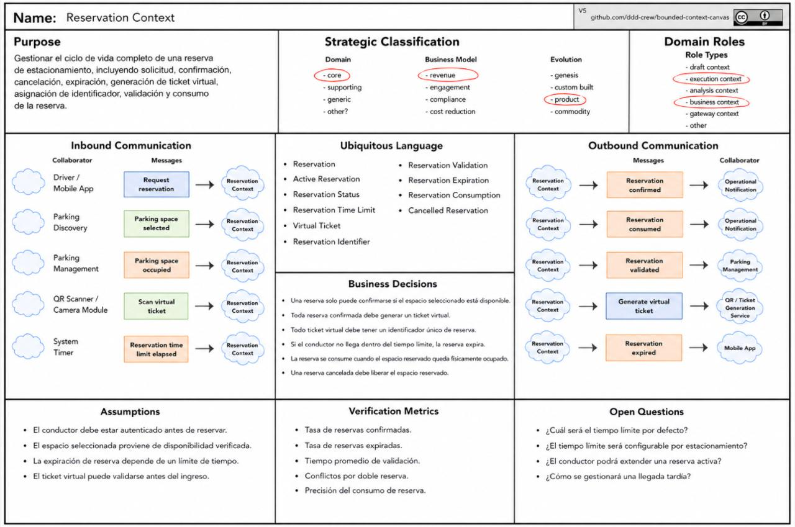

_Nota._ Elaboración propia (2026) en Miro.

Según la Figura 38, el **Reservation Context** concentra la lógica relacionada con el ciclo de vida de una reserva de estacionamiento. Este contexto permite gestionar la solicitud, confirmación, cancelación, expiración, generación de ticket virtual, asignación de identificador, validación y consumo de una reserva. Por esta razón, fue clasificado como **Core Domain**, ya que representa una de las capacidades centrales de ParkingNow: permitir que el conductor asegure temporalmente un espacio disponible y pueda utilizarlo mediante una validación digital.

El lenguaje ubicuo de este contexto incluye términos como **Reservation**, **Active Reservation**, **Reservation Status**, **Reservation Time Limit**, **Virtual Ticket**, **Reservation Identifier**, **Reservation Validation**, **Reservation Expiration**, **Reservation Consumption** y **Cancelled Reservation**. Estos conceptos delimitan claramente el modelo de negocio de la reserva y evitan mezclarlo con responsabilidades de búsqueda, administración del estacionamiento o monitoreo físico.

En cuanto a la comunicación entrante, el contexto recibe mensajes como **Request reservation** desde la aplicación móvil del conductor, **Parking space selected** desde Parking Discovery, **Parking space occupied** desde Parking Management, **Scan virtual ticket** desde el módulo QR o cámara y **Reservation time limit elapsed** desde un temporizador del sistema. Estos mensajes evidencian que el contexto Reservation no trabaja de forma aislada, sino que depende de la selección previa de un espacio, la disponibilidad operacional y la validación del ticket.

Respecto a la comunicación saliente, el contexto produce eventos y comandos como **Reservation confirmed**, **Reservation consumed**, **Reservation validated**, **Generate virtual ticket** y **Reservation expired**. Estos mensajes son consumidos por otros contextos o sistemas, como Operational Notification, Parking Management, QR / Ticket Generation Service y Mobile App. Esto permite que los demás contextos reaccionen ante cambios importantes en el estado de la reserva.

Las principales decisiones de negocio establecen que una reserva solo puede confirmarse si el espacio seleccionado está disponible, toda reserva confirmada debe generar un ticket virtual, cada ticket debe tener un identificador único, la reserva expira si el conductor no llega dentro del tiempo límite y una reserva solo se consume cuando el espacio reservado queda físicamente ocupado. Estas reglas justifican que Reservation sea un contexto independiente, ya que posee invariantes propias y controla estados críticos del negocio.

Como criterio de validación, se definieron métricas como la tasa de reservas confirmadas, la tasa de reservas expiradas, el tiempo promedio de validación, los conflictos por doble reserva y la precisión del consumo de reserva. Además, se identificaron preguntas abiertas relacionadas con el tiempo límite por defecto, la posibilidad de configurarlo por estacionamiento, la extensión de reservas activas y el manejo de llegadas tardías.

**Figura 39**  
_Bounded Context Canvas: IoT Monitoring Context_

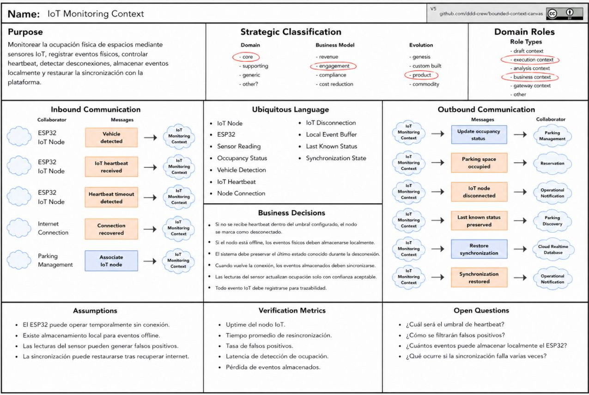

_Nota._ Elaboración propia (2026) en Miro.

Según la Figura 39, el **IoT Monitoring Context** agrupa las responsabilidades relacionadas con la detección física de ocupación, el registro de eventos IoT, el control de heartbeat, la detección de desconexiones, el almacenamiento local de eventos y la restauración de sincronización con la plataforma. Este contexto fue clasificado como **Core Domain**, debido a que la disponibilidad verificada mediante sensores físicos es uno de los principales diferenciales de ParkingNow frente a soluciones que solo muestran disponibilidad declarativa o manual.

El lenguaje ubicuo de este contexto incluye conceptos como **IoT Node**, **ESP32**, **Sensor Reading**, **Occupancy Status**, **Vehicle Detection**, **IoT Heartbeat**, **Node Connection**, **IoT Disconnection**, **Local Event Buffer**, **Last Known Status** y **Synchronization State**. Estos términos reflejan una mezcla entre el dominio de estacionamientos y la capa física IoT, por lo que resultó necesario mantenerlos dentro de un contexto especializado.

En la comunicación entrante, el contexto recibe eventos del **ESP32 IoT Node**, tales como **Vehicle detected**, **IoT heartbeat received** y **Heartbeat timeout detected**. También recibe el evento **Connection recovered** desde Internet Connection y el comando **Associate IoT node** desde Parking Management. Esto demuestra que IoT Monitoring es responsable tanto de interpretar señales físicas como de mantener la relación entre el nodo IoT y la operación del sistema.

En la comunicación saliente, el contexto envía mensajes como **Update occupancy status** hacia Parking Management, **Parking space occupied** hacia Reservation, **IoT node disconnected** y **Synchronization restored** hacia Operational Notification, **Last known status preserved** hacia Parking Discovery y **Restore synchronization** hacia Cloud Realtime Database. Estos mensajes permiten que los cambios físicos detectados por el sensor se reflejen en la disponibilidad, las reservas, el dashboard operacional y la experiencia del conductor.

Las decisiones de negocio establecen que si no se recibe heartbeat dentro del umbral configurado, el nodo debe marcarse como desconectado; si el nodo está offline, los eventos físicos deben almacenarse localmente; el sistema debe preservar el último estado conocido durante la desconexión; y cuando se recupera la conexión, los eventos almacenados deben sincronizarse. Además, las lecturas del sensor solo deben actualizar la ocupación cuando tengan un nivel aceptable de confianza, evitando inconsistencias causadas por falsos positivos.

Las métricas de verificación definidas para este contexto incluyen uptime del nodo IoT, tiempo promedio de resincronización, tasa de falsos positivos, latencia de detección de ocupación y pérdida de eventos almacenados. Como preguntas abiertas, se identificó la necesidad de definir el umbral exacto de heartbeat, el mecanismo para filtrar falsos positivos, la capacidad local de almacenamiento del ESP32 y el comportamiento del sistema ante fallos repetidos de sincronización.

**Figura 40**  
_Bounded Context Canvas: Parking Management Context_

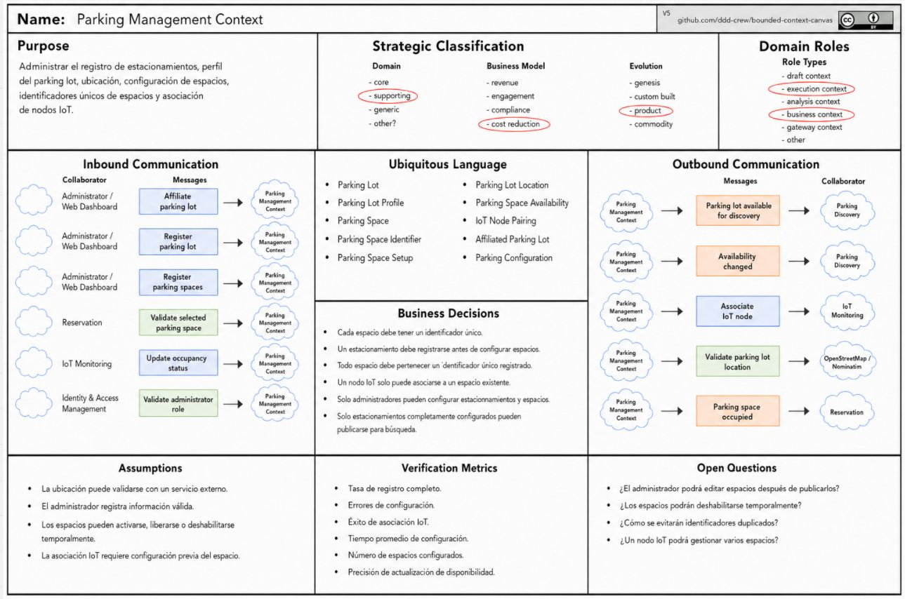

_Nota._ Elaboración propia (2026) en Miro.

Según la Figura 40, el **Parking Management Context** se encarga de administrar el registro de estacionamientos, el perfil del parking lot, la ubicación, la configuración de espacios, los identificadores únicos y la asociación de nodos IoT. Este contexto fue clasificado como **Supporting Domain**, ya que habilita la operación principal de ParkingNow, pero no representa por sí mismo el mayor diferencial competitivo del producto.

El lenguaje ubicuo de este contexto está compuesto por términos como **Parking Lot**, **Parking Lot Profile**, **Parking Space**, **Parking Space Identifier**, **Parking Space Setup**, **Parking Lot Location**, **Parking Space Availability**, **IoT Node Pairing**, **Affiliated Parking Lot** y **Parking Configuration**. Estos conceptos pertenecen al modelo administrativo y estructural del estacionamiento, por lo que deben mantenerse separados de la lógica de reserva y monitoreo IoT.

En la comunicación entrante, el contexto recibe comandos administrativos como **Affiliate parking lot**, **Register parking lot** y **Register parking spaces** desde Parking Owner / Web Dashboard. También recibe la consulta **Validate selected parking space** desde Reservation, el comando **Update occupancy status** desde IoT Monitoring y la consulta **Validate administrator role** desde Identity & Access Management. Esto muestra que Parking Management actúa como dueño de la configuración y disponibilidad base de los espacios.

En la comunicación saliente, el contexto emite **Parking lot available for discovery** y **Availability changed** hacia Parking Discovery, envía **Associate IoT node** hacia IoT Monitoring, consulta **Validate parking lot location** a OpenStreetMap / Nominatim y comunica **Parking space occupied** hacia Reservation. Estas relaciones evidencian que la configuración del estacionamiento es consumida por distintos contextos para habilitar búsqueda, disponibilidad y validación de reservas.

Las decisiones de negocio indican que cada espacio debe tener un identificador único, un estacionamiento debe registrarse antes de configurar espacios, todo espacio debe pertenecer a un estacionamiento registrado, un nodo IoT solo puede asociarse a un espacio existente, solo dueños de estacionamiento pueden configurar estacionamientos y únicamente los estacionamientos completamente configurados pueden publicarse para búsqueda.

Para validar este contexto se definieron métricas como tasa de registro completo, errores de configuración, éxito de asociación IoT, tiempo promedio de configuración, número de espacios configurados y precisión de actualización de disponibilidad. Las preguntas abiertas se enfocan en la edición posterior de espacios, la deshabilitación temporal, la prevención de identificadores duplicados y la posibilidad de que un nodo IoT gestione varios espacios.

**Figura 41**  
_Bounded Context Canvas: Parking Discovery Context_

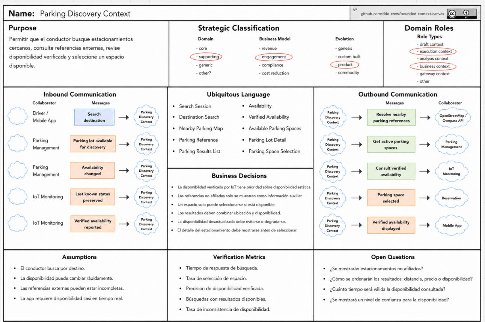

_Nota._ Elaboración propia (2026) en Miro.

Según la Figura 41, el **Parking Discovery Context** permite que el conductor busque estacionamientos cercanos, consulte referencias externas, revise disponibilidad verificada y seleccione un espacio disponible. Este contexto fue clasificado como **Supporting Domain**, debido a que mejora directamente la experiencia del conductor, pero depende de otros contextos para obtener información de estacionamientos, disponibilidad y estado físico.

El lenguaje ubicuo de este contexto incluye **Search Session**, **Destination Search**, **Nearby Parking Map**, **Parking Reference**, **Parking Results List**, **Availability**, **Verified Availability**, **Available Parking Spaces**, **Parking Lot Detail** y **Parking Space Selection**. Estos términos reflejan la experiencia de descubrimiento y selección previa a la reserva.

En la comunicación entrante, Parking Discovery recibe el comando **Search destination** desde Driver / Mobile App, así como eventos provenientes de Parking Management e IoT Monitoring. Entre ellos se encuentran **Parking lot available for discovery**, **Availability changed**, **Last known status preserved** y **Verified availability reported**. Estos mensajes permiten que el contexto construya una vista confiable de estacionamientos disponibles para el usuario.

En la comunicación saliente, este contexto consulta **Resolve nearby parking references** a OpenStreetMap / Overpass API, solicita **Get active parking spaces** a Parking Management, ejecuta **Consult verified availability** sobre IoT Monitoring, comunica **Parking space selected** hacia Reservation y muestra **Verified availability displayed** hacia Mobile App. Este flujo confirma que Parking Discovery actúa como contexto de consulta, composición y presentación de información útil para la toma de decisión del conductor.

Las decisiones de negocio establecen que la disponibilidad verificada por IoT tiene prioridad sobre disponibilidad estática, las referencias no afiliadas solo se muestran como información auxiliar, un espacio solo puede seleccionarse si está disponible, los resultados deben combinar ubicación y disponibilidad, la disponibilidad desactualizada debe evitarse o degradarse, y el detalle del estacionamiento debe mostrarse antes de seleccionar un espacio.

Las métricas de validación incluyen tiempo de respuesta de búsqueda, tasa de selección de espacio, precisión de disponibilidad verificada, búsquedas con resultados disponibles y tasa de inconsistencia de disponibilidad. Las preguntas abiertas se relacionan con la visualización de estacionamientos no afiliados, el criterio de ordenamiento de resultados, la vigencia de la disponibilidad consultada y la posibilidad de mostrar un nivel de confianza al conductor.

**Figura 42**  
_Bounded Context Canvas: Operational Notification Context_

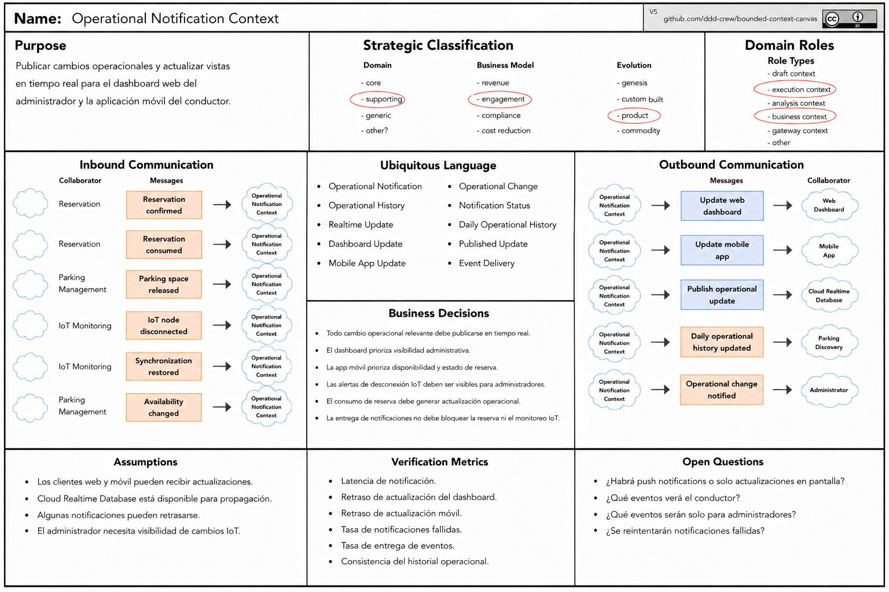

_Nota._ Elaboración propia (2026) en Miro.

Según la Figura 42, el **Operational Notification Context** tiene como propósito publicar cambios operacionales y actualizar vistas en tiempo real para el dashboard web del dueño de estacionamiento y la aplicación móvil del conductor. Este contexto fue clasificado como **Supporting Domain**, ya que no concentra la lógica principal de reserva ni de monitoreo físico, pero permite que los cambios importantes del sistema sean visibles oportunamente para los usuarios.

El lenguaje ubicuo del contexto incluye términos como **Operational Notification**, **Operational History**, **Realtime Update**, **Dashboard Update**, **Mobile App Update**, **Operational Change**, **Notification Status**, **Daily Operational History**, **Published Update** y **Event Delivery**. Estos conceptos se relacionan con la propagación de cambios y la actualización de interfaces.

En la comunicación entrante, este contexto consume eventos provenientes de Reservation, Parking Management e IoT Monitoring. Entre ellos se encuentran **Reservation confirmed**, **Reservation consumed**, **Parking space released**, **IoT node disconnected**, **Synchronization restored** y **Availability changed**. Estos mensajes representan cambios relevantes que deben ser comunicados o reflejados en las interfaces del sistema.

En la comunicación saliente, Operational Notification produce comandos y eventos como **Update web dashboard**, **Update mobile app**, **Publish operational update**, **Daily operational history updated** y **Operational change notified**. Estos mensajes se dirigen a Web Dashboard, Mobile App, Cloud Realtime Database, Parking Discovery y Parking Owner. Con ello, el contexto garantiza que los cambios operacionales lleguen a los consumidores adecuados sin acoplar directamente los contextos core con las interfaces.

Las decisiones de negocio establecen que todo cambio operacional relevante debe publicarse en tiempo real, el dashboard debe priorizar visibilidad administrativa, la aplicación móvil debe priorizar disponibilidad y estado de reserva, las alertas de desconexión IoT deben ser visibles para dueños de estacionamiento, el consumo de reserva debe generar actualización operacional y la entrega de notificaciones no debe bloquear los procesos core de reserva o monitoreo IoT.

Para validar este contexto se definieron métricas como latencia de notificación, retraso de actualización del dashboard, retraso de actualización móvil, tasa de notificaciones fallidas, tasa de entrega de eventos y consistencia del historial operacional. Las preguntas abiertas están orientadas a definir si habrá push notifications, qué eventos verá el conductor, cuáles serán exclusivos para dueños de estacionamiento y si las notificaciones fallidas deberán reintentarse.

**Figura 43**  
_Bounded Context Canvas: Identity & Access Management Context_

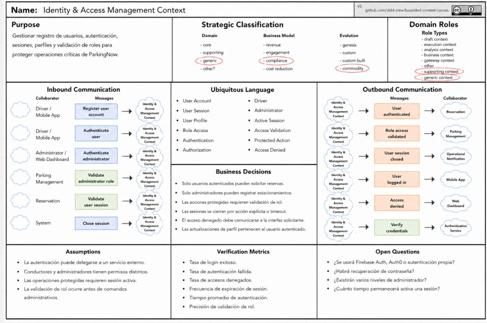

_Nota._ Elaboración propia (2026) en Miro.

Según la Figura 43, el **Identity & Access Management Context** gestiona el registro de usuarios, la autenticación, las sesiones, los perfiles y la validación de roles para proteger operaciones críticas de ParkingNow. Este contexto fue clasificado como **Generic Domain**, ya que la autenticación y autorización son capacidades necesarias para el sistema, pero no constituyen el diferencial principal del producto.

El lenguaje ubicuo de este contexto incluye **User Account**, **User Session**, **User Profile**, **Role Access**, **Authentication**, **Authorization**, **Driver**, **Parking Owner**, **Active Session**, **Access Validation**, **Protected Action** y **Access Denied**. Estos términos se relacionan con la gestión de identidad, seguridad y permisos dentro de la plataforma.

En la comunicación entrante, el contexto recibe comandos como **Register user account**, **Authenticate user**, **Authenticate administrator** y **Close session**. También recibe consultas como **Validate administrator role** desde Parking Management y **Validate user session** desde Reservation. Esto evidencia que IAM funciona como proveedor transversal de seguridad para operaciones protegidas dentro del sistema.

En la comunicación saliente, el contexto produce mensajes como **User authenticated**, **Role access validated**, **User session closed**, **User logged in**, **Access denied** y **Verify credentials**. Estos mensajes se comunican hacia Reservation, Parking Management, Operational Notification, Mobile App, Web Dashboard y Authentication Service. De este modo, IAM permite proteger acciones como solicitar reservas, registrar estacionamientos, configurar espacios y acceder a vistas administrativas.

Las decisiones de negocio determinan que solo usuarios autenticados pueden solicitar reservas, solo dueños de estacionamiento pueden registrar estacionamientos, las acciones protegidas requieren validación de rol, las sesiones se cierran por acción explícita o timeout, el acceso denegado debe comunicarse a la interfaz solicitante y las actualizaciones de perfil pertenecen únicamente al usuario autenticado.

Las métricas de verificación incluyen tasa de login exitoso, tasa de autenticación fallida, tasa de accesos denegados, frecuencia de expiración de sesión, tiempo promedio de autenticación y precisión de validación de rol. Como preguntas abiertas se identificó la necesidad de decidir si se usará Firebase Auth, Auth0 o autenticación propia, si existirá recuperación de contraseña, si habrá varios niveles de dueño de estacionamiento y cuánto tiempo permanecerá activa una sesión.

En síntesis, los Bounded Context Canvases permitieron detallar internamente cada contexto candidato de ParkingNow y validar que los límites descubiertos en el Candidate Context Discovery son coherentes con las responsabilidades del dominio. Los contextos **Reservation** e **IoT Monitoring** fueron clasificados como **Core Domain** porque concentran las capacidades de mayor valor: reserva confiable y disponibilidad física verificada. Los contextos **Parking Management**, **Parking Discovery** y **Operational Notification** fueron clasificados como **Supporting Domain**, ya que habilitan y complementan la operación principal. Finalmente, **Identity & Access Management** fue clasificado como **Generic Domain**, debido a que cumple una función transversal de seguridad que puede apoyarse en soluciones estándar.

Esta definición servirá como base para los siguientes artefactos de diseño, especialmente el **Context Mapping**, donde se representarán las relaciones entre bounded contexts, sus dependencias y los patrones de integración más adecuados para la arquitectura de ParkingNow.

Enlace de miro: https://miro.com/welcomeonboard/cE81V0lIQ2x2VHg3MktWbXVaTUM4UjJ3ZXhUcEFCUTN5TmdiL3FmNXdoeURwS2YyYlpUS1BMazd1b2JXSnRGZ3l1RGl4cEhMeWJDZVlUd3FHNzNZVVVmQnUraUd4TE1vQmR5bitqV3AzWkJOTDJ6OWpOUnI1WTZYOHVidDJrT0R3VHhHVHd5UWtSM1BidUtUYmxycDRnPT0hdjE=?share_link_id=415302191774

## 4.1.2. Context Mapping

Luego de definir los **Bounded Context Canvases**, el equipo elaboró el **Context Map** de **ParkingNow** con el objetivo de representar las relaciones estructurales entre los bounded contexts identificados en el diseño estratégico. Este artefacto permite visualizar qué contextos actúan como proveedores de capacidades o información, cuáles dependen de otros para completar sus operaciones y qué mecanismos de integración se requieren para proteger el modelo de dominio frente a sistemas externos.

Para construir el mapa de contexto, el equipo no partió directamente de una división técnica del sistema, sino de los límites descubiertos durante el EventStorming, los flujos de mensajes de dominio y los canvases desarrollados previamente. A partir de ello, se evaluaron las dependencias entre los seis bounded contexts principales: **Reservation Context**, **IoT Monitoring Context**, **Parking Management Context**, **Parking Discovery Context**, **Operational Notification Context** e **Identity & Access Management Context**.

Durante la sesión de análisis, el equipo discutió distintas alternativas mediante preguntas de evaluación del tipo _what if_. En primer lugar, se evaluó qué ocurriría si **Reservation Context** y **Parking Discovery Context** se unificaban en un solo contexto. Esta opción fue descartada porque la búsqueda de espacios disponibles y la gestión del ciclo de vida de una reserva responden a reglas de negocio distintas. Parking Discovery se enfoca en componer información de búsqueda y disponibilidad, mientras que Reservation controla estados críticos como confirmación, expiración, validación y consumo de reserva.

También se analizó qué ocurriría si **IoT Monitoring Context** actualizaba directamente todos los contextos que consumen información de ocupación. Esta alternativa habría generado un acoplamiento excesivo entre el monitoreo físico y los contextos de negocio. Por ello, se decidió que IoT Monitoring actúe como proveedor de eventos físicos y estados verificados, mientras que los contextos consumidores interpretan dichos eventos según sus propias reglas.

Otra alternativa evaluada fue integrar **Operational Notification Context** dentro de cada contexto que genera eventos relevantes. Esta opción también fue descartada porque habría duplicado lógica de actualización en tiempo real en Reservation, Parking Management e IoT Monitoring. En su lugar, se decidió mantener Operational Notification como un contexto independiente que centraliza la publicación de cambios operacionales hacia el dashboard web, la aplicación móvil y los servicios de sincronización.

Finalmente, se revisó la posibilidad de aplicar un **Shared Kernel** entre algunos contextos, especialmente entre Parking Management y Parking Discovery. Sin embargo, el equipo decidió no utilizar este patrón porque no existe una justificación suficiente para compartir código de dominio, esquemas persistentes o reglas internas entre ambos contextos. En su lugar, se prefirió modelar sus relaciones mediante **Customer/Supplier**, manteniendo límites claros y evitando dependencias innecesarias.

Como resultado de este análisis, se definió el siguiente Context Map, utilizando patrones de relación de Domain-Driven Design como **Customer/Supplier**, **Open Host Service** y **Anti-Corruption Layer**.

**Figura 44**  
_ParkingNow Context Map_

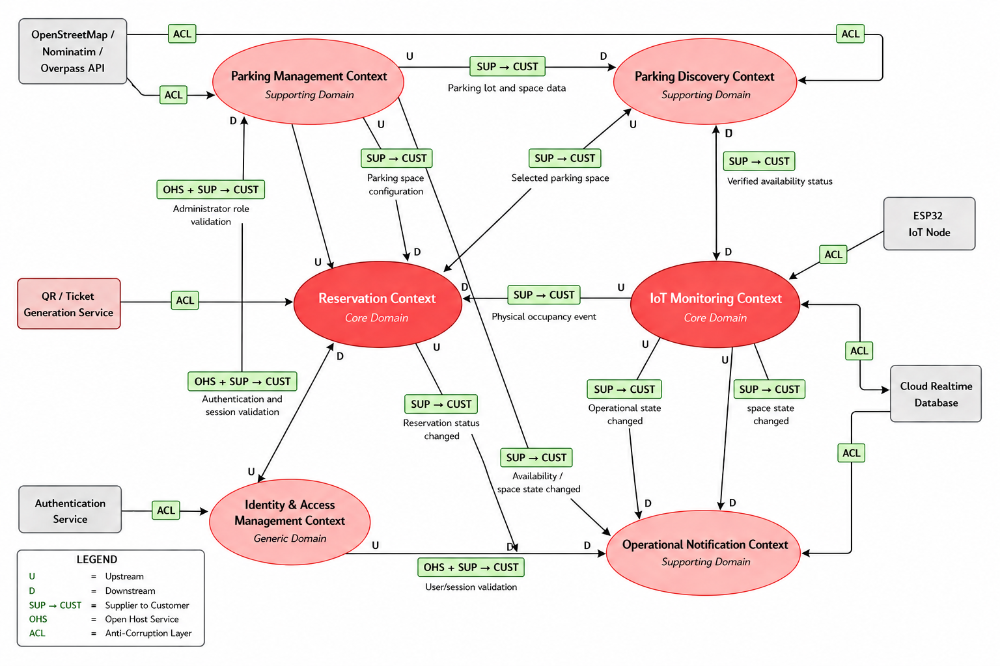

_Nota._ Elaboración propia (2026) en Miro.

Según la Figura 44, el mapa de contexto de ParkingNow organiza los bounded contexts de acuerdo con sus responsabilidades estratégicas. **Reservation Context** e **IoT Monitoring Context** se ubican como contextos centrales, debido a que representan las capacidades más importantes del producto: gestionar reservas confiables y verificar la ocupación física mediante sensores IoT. A su alrededor se encuentran los contextos de soporte: **Parking Management Context**, **Parking Discovery Context** y **Operational Notification Context**. Finalmente, **Identity & Access Management Context** se representa como un contexto genérico transversal que provee servicios de autenticación, sesión y validación de roles.

El patrón predominante entre los bounded contexts es **Customer/Supplier**, ya que varios contextos actúan como proveedores de información o eventos que otros contextos necesitan para ejecutar sus propias reglas. Además, **Identity & Access Management Context** se modela como **Open Host Service**, porque expone servicios de autenticación y autorización reutilizables por otros contextos. Por otro lado, las integraciones con sistemas externos se protegen mediante **Anti-Corruption Layer**, evitando que detalles técnicos externos contaminen el modelo de dominio de ParkingNow.

| N.º | Upstream / Supplier                  | Downstream / Customer            | Relación modelada                     | Patrón DDD                            | Justificación                                                                                                                                                                                                                       |
| --- | ------------------------------------ | -------------------------------- | ------------------------------------- | ------------------------------------- | ----------------------------------------------------------------------------------------------------------------------------------------------------------------------------------------------------------------------------------- |
| 1   | Parking Management Context           | Parking Discovery Context        | Parking lot and space data            | Customer/Supplier                     | Parking Management provee información estructural sobre estacionamientos, espacios registrados y cambios de disponibilidad. Parking Discovery consume estos datos para construir resultados de búsqueda visibles para el conductor. |
| 2   | Parking Management Context           | Reservation Context              | Parking space configuration           | Customer/Supplier                     | Reservation necesita validar que el espacio seleccionado exista, pertenezca a un estacionamiento registrado y tenga una configuración válida antes de confirmar una reserva.                                                        |
| 3   | Parking Discovery Context            | Reservation Context              | Selected parking space                | Customer/Supplier                     | Parking Discovery provee el espacio seleccionado por el conductor. Reservation consume esta selección para iniciar el ciclo de vida de la reserva.                                                                                  |
| 4   | IoT Monitoring Context               | Parking Discovery Context        | Verified availability status          | Customer/Supplier                     | IoT Monitoring provee información verificada de ocupación y último estado conocido. Parking Discovery consume esta información para mostrar disponibilidad confiable al conductor.                                                  |
| 5   | IoT Monitoring Context               | Reservation Context              | Physical occupancy event              | Customer/Supplier                     | Reservation consume eventos físicos de ocupación provenientes de IoT Monitoring para determinar cuándo una reserva debe ser consumida.                                                                                              |
| 6   | Reservation Context                  | Operational Notification Context | Reservation status changed            | Customer/Supplier                     | Operational Notification consume cambios de estado de reserva, como reservas confirmadas, consumidas o expiradas, para publicar actualizaciones en tiempo real.                                                                     |
| 7   | IoT Monitoring Context               | Operational Notification Context | Operational state changed             | Customer/Supplier                     | Operational Notification consume eventos operativos relacionados con nodos IoT, como desconexiones o restauración de sincronización, para informar al dueño de estacionamiento.                                                     |
| 8   | Parking Management Context           | Operational Notification Context | Availability / space state changed    | Customer/Supplier                     | Parking Management informa cambios de estado de los espacios, como liberación, ocupación o disponibilidad, para que Operational Notification actualice las interfaces correspondientes.                                             |
| 9   | Identity & Access Management Context | Reservation Context              | Authentication and session validation | Open Host Service + Customer/Supplier | IAM expone servicios de autenticación y validación de sesión. Reservation consume estos servicios antes de permitir solicitudes o acciones protegidas sobre reservas.                                                               |
| 10  | Identity & Access Management Context | Parking Management Context       | Parking Owner role validation         | Open Host Service + Customer/Supplier | Parking Management depende de IAM para validar que el usuario tenga rol de dueño de estacionamiento antes de registrar estacionamientos o configurar espacios.                                                                      |
| 11  | Identity & Access Management Context | Operational Notification Context | User/session validation               | Open Host Service + Customer/Supplier | Operational Notification puede consumir información de usuario o sesión para dirigir actualizaciones al público correcto, diferenciando notificaciones para conductores y dueños de estacionamiento.                                |

Además de las relaciones internas entre bounded contexts, el mapa identifica sistemas externos que participan en la solución. Estas integraciones se modelaron mediante el patrón **Anti-Corruption Layer**, porque cada sistema externo maneja modelos, formatos o reglas técnicas distintas a las del dominio de ParkingNow. La capa anticorrupción permite traducir esas diferencias hacia conceptos propios del dominio, como ubicación validada, ticket virtual generado, evento IoT registrado o sincronización restaurada.

| Sistema externo                          | Contexto relacionado                                      | Patrón DDD            | Justificación                                                                                                                                                                                           |
| ---------------------------------------- | --------------------------------------------------------- | --------------------- | ------------------------------------------------------------------------------------------------------------------------------------------------------------------------------------------------------- |
| OpenStreetMap / Nominatim / Overpass API | Parking Management Context / Parking Discovery Context    | Anti-Corruption Layer | Se utiliza para validar ubicaciones y resolver referencias geográficas cercanas. La capa anticorrupción evita que el modelo interno dependa directamente de estructuras propias del proveedor de mapas. |
| ESP32 IoT Node                           | IoT Monitoring Context                                    | Anti-Corruption Layer | El nodo ESP32 emite datos físicos y señales técnicas. IoT Monitoring traduce esa información a conceptos de dominio como Vehicle detected, IoT heartbeat received o Occupancy Status.                   |
| QR / Ticket Generation Service           | Reservation Context                                       | Anti-Corruption Layer | Reservation utiliza un servicio externo para generar tickets virtuales, pero mantiene dentro de su propio modelo los conceptos de Virtual Ticket y Reservation Identifier.                              |
| Cloud Realtime Database                  | Operational Notification Context / IoT Monitoring Context | Anti-Corruption Layer | La base de datos en tiempo real permite propagar actualizaciones y sincronizar eventos, pero la lógica de dominio no debe depender directamente de su modelo técnico de almacenamiento.                 |
| Authentication Service                   | Identity & Access Management Context                      | Anti-Corruption Layer | IAM puede delegar la verificación de credenciales a un proveedor externo, protegiendo el dominio de detalles específicos de autenticación, tokens o sesiones externas.                                  |

El Context Map confirma que los límites definidos previamente son coherentes con la arquitectura del dominio. **Reservation Context** se mantiene independiente porque posee reglas críticas sobre el ciclo de vida de la reserva. **IoT Monitoring Context** se separa porque administra la interacción con sensores, conectividad, eventos físicos y sincronización. **Parking Management Context** concentra la configuración estructural de estacionamientos y espacios. **Parking Discovery Context** compone información para la experiencia de búsqueda del conductor. **Operational Notification Context** desacopla la publicación de cambios operacionales. Finalmente, **Identity & Access Management Context** actúa como capacidad genérica transversal de seguridad.

En conclusión, el Context Mapping permitió transformar los bounded contexts descubiertos en una vista arquitectónica de colaboración entre módulos. Esta vista facilita identificar dependencias, proteger el modelo de dominio frente a sistemas externos y definir relaciones explícitas mediante patrones de Domain-Driven Design. Con ello, ParkingNow cuenta con una base estratégica clara para avanzar hacia el diseño de arquitectura de software y las decisiones tácticas de implementación.

## 4.1.3. Software Architecture

En esta sección se presenta la arquitectura de software propuesta para **ParkingNow**, tomando como base las decisiones obtenidas en el diseño estratégico del dominio. Después de identificar los bounded contexts, sus responsabilidades, sus relaciones y sus patrones de integración mediante Domain-Driven Design, el siguiente paso consiste en representar cómo estas decisiones se traducen en una arquitectura técnica concreta para el sistema.

Para ello, se utiliza el **C4 Model**, un enfoque de documentación arquitectónica que permite describir el sistema desde distintos niveles de abstracción. Este modelo facilita explicar la arquitectura de manera progresiva, empezando por una vista general del ecosistema, continuando con la frontera del sistema, luego con sus contenedores principales y finalmente con la infraestructura donde serán desplegados. De esta forma, el diseño arquitectónico de ParkingNow puede ser comprendido tanto desde una perspectiva de negocio como desde una perspectiva técnica.

La arquitectura de ParkingNow se plantea inicialmente como un **monolito modular**, organizado internamente de acuerdo con los bounded contexts definidos en las secciones anteriores. Esta decisión permite mantener una separación clara de responsabilidades sin introducir, en esta etapa del proyecto, la complejidad operacional de una arquitectura basada en microservicios. Por ello, los contextos como **Reservation**, **IoT Monitoring**, **Parking Management**, **Parking Discovery**, **Operational Notification** e **Identity & Access Management** no se interpretan como servicios independientes, sino como módulos internos alineados con el dominio dentro de una misma solución backend.

Esta decisión resulta adecuada para el alcance del MVP, ya que permite reducir la complejidad de despliegue, simplificar la integración entre módulos, facilitar las pruebas y acelerar la entrega de valor. Al mismo tiempo, mantiene una estructura arquitectónica preparada para una posible evolución futura, en caso alguno de los módulos requiera mayor autonomía, escalabilidad independiente o despliegue separado.

Desde el punto de vista tecnológico, ParkingNow se implementa con una **Landing Page** en **HTML5, CSS3 y JavaScript**; una **Parking Owner Web App** en **Angular, TypeScript, HTML, CSS y Angular Material** siguiendo Material Design; una **Driver Mobile App** en **Flutter y Dart**; un **Core REST API** en **Java, Spring Boot, RESTful API y documentación OpenAPI Specification mediante Swagger**; un **Edge API / Edge Service** en **Python, Flask, Peewee ORM y SQLite**; firmware **ESP32** y servidor local **ESP32-CAM** en **C++ / Arduino IDE**; y la plataforma administrada **Supabase** para **PostgreSQL, Supabase Auth y Supabase Realtime**. Esta arquitectura separa aplicaciones cliente, servicios backend, capa edge, persistencia cloud, servicios externos y hardware IoT dentro de las vistas C4.

Asimismo, la arquitectura contempla integraciones con sistemas externos necesarios para completar las capacidades del producto. Entre ellos se consideran servicios de mapas y geocodificación como **OpenStreetMap / Nominatim / Overpass API**, servicios de autenticación, generación de tickets virtuales o QR, y servicios de sincronización en tiempo real. Estas integraciones se mantienen alineadas con el Context Map definido previamente, donde se estableció el uso de patrones como **Customer/Supplier**, **Open Host Service** y **Anti-Corruption Layer** para proteger el modelo de dominio frente a dependencias externas.

Para documentar esta arquitectura, se elaboran cuatro vistas principales siguiendo el enfoque C4. En primer lugar, el **System Landscape Diagram** muestra el ecosistema general donde participa ParkingNow junto con sus usuarios y sistemas relacionados. En segundo lugar, el **System Context Diagram** delimita la frontera de ParkingNow como sistema de software y muestra sus relaciones directas con actores y servicios externos. En tercer lugar, el **Container Diagram** describe las aplicaciones, APIs, bases de datos y componentes ejecutables que conforman la solución. Finalmente, el **Deployment Diagram** representa cómo estos contenedores se despliegan en infraestructura concreta, considerando servicios como Vercel, Railway, Supabase y el entorno físico donde opera el dispositivo ESP32.

Los diagramas serán desarrollados utilizando **Structurizr DSL**, lo cual permite representar la arquitectura como código y mantener consistencia entre las distintas vistas del modelo. Esta elección facilita la trazabilidad de las decisiones arquitectónicas, mejora la mantenibilidad de los diagramas y permite documentar la solución de forma estructurada para el informe final.

En conjunto, esta sección permite pasar del diseño estratégico del dominio hacia una propuesta técnica concreta, mostrando cómo ParkingNow se organiza, se comunica, se despliega y se integra con los servicios necesarios para ofrecer una experiencia confiable de búsqueda, reserva, monitoreo y administración de espacios de estacionamiento.

### 4.1.3.1. Software Architecture System Landscape Diagram

El **Software Architecture System Landscape Diagram** presenta la vista más general del ecosistema de software de **ParkingNow**. Esta vista permite identificar, desde un nivel panorámico, a los actores humanos que participan en el negocio, el sistema principal desarrollado por el equipo y los sistemas externos que intervienen para completar las capacidades de la solución.

A diferencia de los diagramas posteriores del modelo C4, en esta vista no se detallan todavía los contenedores internos, aplicaciones, APIs, bases de datos ni módulos del sistema. ParkingNow se representa como un único sistema de software dentro de su ecosistema empresarial. De esta manera, el diagrama permite comprender cómo el producto se relaciona con los usuarios finales, los dueños de estacionamientos, los servicios externos de mapas, la plataforma backend administrada y el entorno físico donde opera el nodo IoT.

Para ParkingNow, el ecosistema se organiza en tres grupos principales. El primero corresponde al **ParkingNow Business Ecosystem**, donde se encuentran los actores principales del negocio: el **Driver** y el **Parking Owner**, junto con el sistema principal **ParkingNow System**. El segundo grupo corresponde a los **External Service Providers**, que agrupa los servicios externos utilizados por la plataforma, como **OpenStreetMap / Nominatim / Overpass API**, **Supabase Platform** y **QR / Ticket Generation Service**. Finalmente, el tercer grupo corresponde al **Parking Lot Edge Environment**, donde se ubica el **ESP32 IoT Node**, encargado de detectar la ocupación física de los espacios de estacionamiento.

**Figura 45**  
_Software Architecture System Landscape Diagram_

_Nota._ Elaboración propia (2026) usando Structurizr DSL.

Según la Figura 45, el **Driver** representa al conductor urbano que utiliza ParkingNow para buscar estacionamientos cercanos, consultar disponibilidad verificada, reservar un espacio y visualizar su ticket virtual desde la aplicación móvil. Este actor se relaciona directamente con **ParkingNow System**, ya que todas sus interacciones principales ocurren dentro de la plataforma.

El **Parking Owner** representa al dueño o encargado de un estacionamiento independiente. Este actor utiliza ParkingNow para registrar su estacionamiento, configurar espacios, asociar nodos IoT y monitorear el estado de ocupación de sus espacios. Además, se relaciona con el **ESP32 IoT Node** porque dicho dispositivo forma parte del entorno físico del estacionamiento y debe ser instalado u operado dentro de sus espacios.

**ParkingNow System** es el sistema principal de la solución. Su función es conectar a conductores con estacionamientos independientes, permitiendo búsqueda, reserva, validación de tickets virtuales, monitoreo IoT de ocupación y actualización operativa del estado de los espacios. En esta vista, ParkingNow se muestra como una sola unidad de software, sin exponer todavía su arquitectura interna.

El sistema se integra con **OpenStreetMap / Nominatim / Overpass API** para resolver ubicaciones, validar coordenadas de estacionamientos y recuperar referencias de estacionamientos cercanos. Esta integración permite que la plataforma pueda ofrecer una experiencia de búsqueda basada en ubicación y referencias geográficas.

Asimismo, ParkingNow utiliza **Supabase Platform** como plataforma administrada para persistencia de datos, autenticación, autorización y sincronización en tiempo real. Esta plataforma soporta el almacenamiento de usuarios, estacionamientos, espacios, reservas, eventos IoT e historial operativo.

El servicio **QR / Ticket Generation Service** participa como proveedor externo para generar tickets virtuales o códigos QR asociados a reservas confirmadas. De esta manera, ParkingNow puede emitir un comprobante digital que luego será utilizado por el conductor durante el proceso de llegada y validación.

Finalmente, el **ESP32 IoT Node** representa el dispositivo físico instalado en los espacios de estacionamiento. Este nodo envía lecturas del sensor, eventos de ocupación, señales de heartbeat y estados de sincronización hacia ParkingNow. A su vez, ParkingNow registra la configuración de emparejamiento y asocia el nodo IoT con los espacios correspondientes.

Las principales interacciones representadas en el diagrama son las siguientes:

| Elemento origen   | Elemento destino                         | Interacción                                                                                      |
| ----------------- | ---------------------------------------- | ------------------------------------------------------------------------------------------------ |
| Driver            | ParkingNow System                        | Busca estacionamientos, consulta disponibilidad, reserva espacios y visualiza tickets virtuales. |
| Parking Owner     | ParkingNow System                        | Registra estacionamientos, configura espacios, empareja nodos IoT y monitorea ocupación.         |
| Parking Owner     | ESP32 IoT Node                           | Instala y opera los nodos IoT dentro de los espacios físicos del estacionamiento.                |
| ParkingNow System | OpenStreetMap / Nominatim / Overpass API | Resuelve ubicaciones, valida coordenadas y recupera referencias geográficas cercanas.            |
| ParkingNow System | Supabase Platform                        | Almacena datos, gestiona autenticación, autorización y sincronización en tiempo real.            |
| ParkingNow System | QR / Ticket Generation Service           | Solicita la generación de tickets virtuales o códigos QR para reservas confirmadas.              |
| ParkingNow System | ESP32 IoT Node                           | Registra la configuración de emparejamiento y asocia el nodo IoT con los espacios.               |
| ESP32 IoT Node    | ParkingNow System                        | Envía lecturas de sensores, eventos de ocupación, heartbeats y estados de sincronización.        |

En conclusión, el **System Landscape Diagram** permite visualizar el ecosistema completo donde opera ParkingNow sin entrar todavía en detalles internos de implementación. Esta vista confirma que la solución se apoya en dos actores humanos principales, un sistema central de software, servicios externos administrados y un componente físico IoT ubicado en el estacionamiento. Con ello, se establece la base para el siguiente nivel del modelo C4, donde se delimitará con mayor precisión la frontera del sistema mediante el **Software Architecture Context Level Diagram**.

### 4.1.3.2. Software Architecture Context Level Diagram

El **Software Architecture Context Level Diagram** permite representar la frontera directa de **ParkingNow System** como sistema de software. A diferencia del System Landscape Diagram, que muestra el ecosistema general, esta vista se enfoca específicamente en ParkingNow como sistema central y en sus relaciones directas con los usuarios y sistemas externos que necesita para operar.

En este nivel del modelo C4, ParkingNow se representa como una sola unidad de software. Por ello, no se muestran todavía sus aplicaciones internas, APIs, base de datos, módulos del backend ni bounded contexts. Los bounded contexts identificados previamente mediante Domain-Driven Design serán considerados en los niveles internos de arquitectura, especialmente en el Container Level y, de ser necesario, en el Component Level. En esta vista, el objetivo principal es delimitar qué actores interactúan con ParkingNow y qué sistemas externos se comunican directamente con él.

Para el caso de ParkingNow, se consideran dos actores humanos principales. El primero es el **Driver**, quien utiliza la aplicación móvil para buscar estacionamientos cercanos, consultar disponibilidad verificada, reservar espacios y visualizar tickets virtuales. El segundo es el **Parking Owner**, quien representa al dueño o encargado de un estacionamiento independiente y utiliza el panel web para registrar estacionamientos, configurar espacios, asociar nodos IoT y monitorear la ocupación.

Asimismo, el sistema mantiene relaciones directas con servicios externos. **OpenStreetMap / Nominatim / Overpass API** permite resolver ubicaciones, validar coordenadas y recuperar referencias geográficas cercanas. **Supabase Platform** se utiliza como plataforma administrada para persistencia, autenticación, autorización y sincronización en tiempo real. **QR / Ticket Generation Service** permite generar tickets virtuales o códigos QR para reservas confirmadas. Finalmente, el **ESP32 IoT Node** representa el dispositivo físico instalado en el estacionamiento para enviar lecturas de sensores, eventos de ocupación, señales de heartbeat y estados de sincronización.

**Figura 46**  
_Software Architecture Context Level Diagram_

_Nota._ Elaboración propia (2026) usando Structurizr DSL.

Según la Figura 46, **ParkingNow System** se ubica como el sistema central de la solución. El **Driver** interactúa con ParkingNow desde la aplicación móvil para buscar estacionamientos, consultar disponibilidad verificada, reservar espacios y visualizar tickets virtuales. Esta interacción concentra las funcionalidades orientadas al conductor y permite que el sistema entregue información confiable antes de iniciar una reserva.

Por otro lado, el **Parking Owner** interactúa con ParkingNow desde el panel web. Este actor registra estacionamientos, configura espacios, asigna identificadores, empareja nodos IoT y monitorea la ocupación de sus espacios. De esta forma, el sistema permite que estacionamientos independientes digitalicen su disponibilidad y mejoren la gestión operativa de sus espacios.

La relación entre **ParkingNow System** y **OpenStreetMap / Nominatim / Overpass API** permite resolver ubicaciones, validar coordenadas de estacionamientos y recuperar referencias cercanas. Esta integración es necesaria para que el sistema pueda ofrecer búsqueda geolocalizada y mostrar estacionamientos relacionados con el destino del conductor.

La relación con **Supabase Platform** concentra servicios administrados de persistencia, autenticación, autorización y sincronización en tiempo real. ParkingNow utiliza esta plataforma para almacenar usuarios, estacionamientos, espacios, reservas, eventos IoT e historial operativo, además de propagar actualizaciones hacia las interfaces correspondientes.

La integración con **QR / Ticket Generation Service** permite generar tickets virtuales o códigos QR para reservas confirmadas. Estos tickets forman parte del proceso de validación de llegada del conductor y permiten vincular una reserva digital con el acceso físico al estacionamiento.

Finalmente, el **ESP32 IoT Node** mantiene una relación bidireccional con ParkingNow. Por un lado, ParkingNow registra la configuración de emparejamiento y asocia el nodo con espacios específicos. Por otro lado, el nodo ESP32 envía lecturas de sensores, eventos de ocupación, heartbeats y estados de sincronización. Esta interacción permite que la disponibilidad mostrada por el sistema tenga respaldo físico mediante monitoreo IoT.

Las principales interacciones representadas en el diagrama son las siguientes:

| Elemento origen   | Elemento destino                         | Tecnología / Canal | Interacción                                                                                                      |
| ----------------- | ---------------------------------------- | ------------------ | ---------------------------------------------------------------------------------------------------------------- |
| Driver            | ParkingNow System                        | Mobile App         | Busca estacionamientos, consulta disponibilidad verificada, reserva espacios y visualiza tickets virtuales.      |
| Parking Owner     | ParkingNow System                        | Web Dashboard      | Registra estacionamientos, configura espacios, asigna identificadores, empareja nodos IoT y monitorea ocupación. |
| ParkingNow System | OpenStreetMap / Nominatim / Overpass API | HTTPS / JSON       | Resuelve ubicaciones, valida coordenadas y recupera referencias geográficas cercanas.                            |
| ParkingNow System | Supabase Platform                        | HTTPS / WebSocket  | Almacena datos, gestiona autenticación, autorización y sincronización en tiempo real.                            |
| ParkingNow System | QR / Ticket Generation Service           | HTTPS / JSON       | Solicita la generación de tickets virtuales o códigos QR para reservas confirmadas.                              |
| ParkingNow System | ESP32 IoT Node                           | HTTPS / JSON       | Registra la configuración de emparejamiento y asocia nodos IoT con espacios de estacionamiento.                  |
| ESP32 IoT Node    | ParkingNow System                        | HTTPS / JSON       | Envía lecturas de sensores, eventos de ocupación, heartbeats y estados de sincronización.                        |

En conclusión, el **Software Architecture Context Level Diagram** delimita claramente el alcance de ParkingNow como sistema de software. Esta vista permite diferenciar las responsabilidades propias del sistema frente a las responsabilidades de los usuarios y servicios externos. Además, establece la base para el siguiente nivel del modelo C4, donde se abrirá la caja de ParkingNow para representar sus aplicaciones, APIs, base de datos y componentes de infraestructura mediante el **Container Level Diagram**.

### 4.1.3.3. Software Architecture Container Level Diagrams

El **Software Architecture Container Level Diagram** permite representar la estructura interna de alto nivel de **ParkingNow System**. A diferencia del Context Level Diagram, donde ParkingNow se muestra como una única caja de software, en este nivel se abre el sistema para identificar las aplicaciones, servicios, APIs, procesos batch, firmware embebido y plataformas externas que participan en la solución.

En el modelo C4, el término **container** no se refiere necesariamente a un contenedor Docker, sino a una unidad de software ejecutable o desplegable de alto nivel. Por ello, en este diagrama se representan aplicaciones frontend, aplicaciones móviles, APIs backend, procesos de carga de datos, firmware embebido, plataformas administradas y hardware físico relacionado con el sistema.

Para ParkingNow, el Container Level Diagram resulta especialmente importante porque la solución no está compuesta únicamente por una aplicación web o móvil, sino por un ecosistema IoT distribuido. La arquitectura integra una aplicación móvil para conductores, una aplicación web para dueños de estacionamiento, una landing page pública, APIs backend, carga de referencias geográficas, sincronización en tiempo real mediante Supabase y software embebido ejecutado sobre un nodo ESP32.

**Figura 47**  
_Software Architecture Container Level Diagram_

_Nota._ Elaboración propia (2026) usando Structurizr DSL.

Según la Figura 47, **ParkingNow System** se compone de ocho contenedores principales: **Landing Page**, **Parking Owner Web App**, **Driver Mobile App**, **Core REST API**, **Edge API**, **OSM Parking Reference Loader**, **ESP32 Embedded + Edge Firmware** y **ESP32-CAM Local Camera Server**. Además, el sistema se integra con servicios externos como **OpenStreetMap / Nominatim / Overpass API**, **QR / Ticket Generation Service**, **Supabase Platform** y el hardware físico **ESP32 IoT Node Hardware**.

La **Landing Page** corresponde al sitio público de ParkingNow. Está desarrollada con **HTML5, CSS3 y JavaScript**. Su finalidad es presentar la propuesta de valor del producto, explicar los beneficios para conductores y dueños de estacionamiento, y redirigir a cada segmento hacia la experiencia correspondiente. En este nivel, la Landing Page se considera un contenedor independiente porque puede desplegarse y evolucionar de forma separada respecto de las aplicaciones principales.

La **Parking Owner Web App** corresponde al panel web utilizado por el dueño de estacionamiento. Está desarrollada con **Angular, TypeScript, HTML, CSS y Angular Material**. Este contenedor permite registrar estacionamientos, configurar espacios, asociar nodos IoT, revisar reservas, monitorear ocupación y consultar historial operativo. La Web App consume el Core REST API mediante HTTPS/JSON y también se suscribe a Supabase Realtime para recibir cambios de estado en tiempo real.

La **Driver Mobile App** corresponde a la aplicación móvil utilizada por el conductor. Está desarrollada con **Flutter, Dart y Supabase Flutter**. Este contenedor permite buscar estacionamientos cercanos, consultar disponibilidad verificada, seleccionar un espacio, registrar una reserva y visualizar el ticket virtual asociado. La Mobile App consume el Core REST API para operaciones de negocio y utiliza Supabase Realtime para recibir actualizaciones sobre disponibilidad, reservas y estado del ticket.

El **Core REST API** representa el backend principal de negocio. Está desarrollado con **Java, Spring Boot, RESTful API y documentación OpenAPI Specification mediante Swagger**. Este contenedor gestiona las operaciones relacionadas con usuarios, estacionamientos, espacios, reservas, búsqueda de estacionamientos, tickets virtuales y consultas operativas. También se comunica con OpenStreetMap / Nominatim / Overpass API para resolver ubicaciones y referencias geográficas, y con el QR / Ticket Generation Service para generar tickets virtuales o códigos QR asociados a reservas confirmadas.

El **Edge API** representa el backend especializado en la recepción de eventos físicos provenientes del nodo ESP32. Está desarrollado con **Python, Flask, Peewee ORM y SQLite**. Este contenedor recibe lecturas de sensores, eventos de ocupación, eventos de liberación, heartbeats y estados de sincronización. Además, valida la API Key del dispositivo, procesa eventos físicos cerca del dispositivo, conserva eventos temporalmente en SQLite cuando corresponde y reenvía eventos validados al Core REST API.

El **OSM Parking Reference Loader** corresponde a un proceso batch desarrollado con **Java y Spring Boot**. Su responsabilidad es cargar referencias iniciales de estacionamientos desde OpenStreetMap / Overpass API hacia Supabase. Este contenedor no forma parte del flujo transaccional principal, sino que permite preparar datos de referencia para el proceso de descubrimiento de estacionamientos cercanos. De esta manera, la plataforma puede mostrar estacionamientos afiliados y referencias externas, diferenciando claramente cuáles cuentan con disponibilidad verificada.

El **ESP32 Embedded + Edge Firmware** corresponde al software embebido ejecutado sobre el nodo ESP32. Está desarrollado en **C++ mediante Arduino IDE**. Este firmware lee los sensores ultrasónicos HC-SR04+, aplica lógica local de debounce, determina cambios de ocupación, controla LEDs, mueve el servo SG90 y reporta eventos relevantes al Edge API mediante HTTP POST con payload JSON y API Key. Este contenedor representa la lógica edge del sistema, ya que procesa información localmente antes de enviarla al backend.

El **ESP32-CAM Local Camera Server** corresponde a un servidor local de cámara ejecutado sobre la ESP32-CAM. Está desarrollado en **C++ mediante Arduino IDE** y permite acceder a una vista local del entorno físico durante la demostración. Este contenedor se comunica con el hardware de cámara y puede ser consultado desde el navegador cuando el usuario se encuentra conectado a la misma red Wi-Fi local. Su función es brindar soporte visual al prototipo físico, sin reemplazar el flujo principal de detección por sensores.

La **Supabase Platform** se modela como una plataforma externa administrada. Incluye **PostgreSQL**, **Supabase Auth** y **Supabase Realtime**. ParkingNow utiliza Supabase para persistir usuarios, estacionamientos, espacios, reservas, eventos IoT, dispositivos, historial operativo y estados de sincronización. Asimismo, Supabase permite autenticar usuarios y propagar cambios en tiempo real hacia la Web App y la Mobile App.

El **ESP32 IoT Node Hardware** se representa fuera del límite de ParkingNow System porque corresponde al hardware físico instalado en el estacionamiento. Incluye el **ESP32 DevKit V1**, sensores ultrasónicos **HC-SR04+**, LEDs, servo **SG90** y **ESP32-CAM**. Aunque el firmware forma parte del software de ParkingNow, el hardware se modela como elemento externo porque representa el dispositivo físico donde dicho software se ejecuta.

Las responsabilidades principales de cada contenedor se resumen en la siguiente tabla:

| Contenedor                     | Tecnología                                        | Responsabilidad principal                                                                                                                                                                 |
| ------------------------------ | ------------------------------------------------- | ----------------------------------------------------------------------------------------------------------------------------------------------------------------------------------------- |
| Landing Page                   | HTML, CSS, JavaScript                             | Presentar el producto y redirigir a los usuarios hacia la experiencia correspondiente.                                                                                                    |
| Parking Owner Web App          | Angular, TypeScript, HTML, CSS y Angular Material | Permitir al dueño registrar estacionamientos, configurar espacios, emparejar nodos IoT y monitorear ocupación.                                                                            |
| Driver Mobile App              | Flutter, Dart, Supabase Flutter                   | Permitir al conductor buscar estacionamientos, consultar disponibilidad, reservar espacios y visualizar tickets virtuales.                                                                |
| Core REST API                  | Java, Spring Boot, TypeScript                     | Gestionar usuarios, estacionamientos, espacios, reservas, discovery, tickets virtuales y consultas operativas.                                                                            |
| Edge API / Edge Service        | Python, Flask, Peewee ORM y SQLite                | Recibir eventos del ESP32, validar dispositivos, procesar eventos físicos cerca del dispositivo, conservar eventos temporalmente en SQLite y reenviar eventos validados al Core REST API. |
| OSM Parking Reference Loader   | Java/Spring Boot, TypeScript                      | Cargar referencias iniciales de estacionamientos desde OpenStreetMap / Overpass API.                                                                                                      |
| ESP32 Embedded + Edge Firmware | C++ / Arduino IDE                                 | Leer sensores, procesar ocupación localmente, controlar actuadores y reportar eventos al Edge API.                                                                                        |
| ESP32-CAM Local Camera Server  | C++ / Arduino IDE                                 | Proporcionar vista local de cámara para soporte visual del prototipo físico.                                                                                                              |
| Supabase Platform              | PostgreSQL, Supabase Auth, Supabase Realtime      | Persistir datos, gestionar autenticación y propagar cambios en tiempo real.                                                                                                               |
| ESP32 IoT Node Hardware        | ESP32 DevKit V1, HC-SR04+, LEDs, SG90, ESP32-CAM  | Ejecutar el firmware y capturar eventos físicos del estacionamiento.                                                                                                                      |

La comunicación entre contenedores se organiza en torno a tres flujos principales. El primer flujo corresponde a la interacción de usuarios. El **Driver** utiliza la **Driver Mobile App** para buscar estacionamientos, consultar disponibilidad y reservar espacios. El **Parking Owner** utiliza la **Parking Owner Web App** para registrar su estacionamiento, configurar espacios, asociar nodos IoT y monitorear la operación.

El segundo flujo corresponde al backend de negocio. La Web App y la Mobile App consumen el **Core REST API** mediante **HTTPS/JSON**. Este API centraliza las operaciones de negocio y se comunica con **Supabase Platform** para persistencia, autenticación y sincronización. También se integra con **OpenStreetMap / Nominatim / Overpass API** para operaciones geográficas y con **QR / Ticket Generation Service** para generar tickets virtuales o códigos QR.

El tercer flujo corresponde al procesamiento IoT. El **ESP32 Embedded + Edge Firmware** lee los sensores HC-SR04+, procesa localmente el estado de ocupación y envía eventos al **Edge API** mediante **HTTP POST/JSON** con una **API Key**. El Edge API valida el dispositivo, procesa el evento cerca del dispositivo, conserva eventos temporalmente en SQLite cuando corresponde y reenvía eventos validados al Core REST API. Luego, **Supabase Realtime** propaga el cambio hacia la Web App y la Mobile App, permitiendo que el estado físico del estacionamiento se refleje digitalmente en tiempo real.

Las principales comunicaciones representadas en el diagrama son las siguientes:

| Origen                         | Destino                                  | Tecnología / Protocolo                     | Propósito                                                                        |
| ------------------------------ | ---------------------------------------- | ------------------------------------------ | -------------------------------------------------------------------------------- |
| Driver                         | Driver Mobile App                        | Mobile App                                 | Buscar estacionamientos, reservar espacios y visualizar tickets virtuales.       |
| Parking Owner                  | Parking Owner Web App                    | Web Browser                                | Registrar estacionamientos, configurar espacios y monitorear ocupación.          |
| Landing Page                   | Parking Owner Web App                    | HTTPS                                      | Redirigir al dueño hacia el panel web.                                           |
| Driver Mobile App              | Core REST API                            | HTTPS / JSON                               | Buscar estacionamientos, consultar disponibilidad, reservar y obtener tickets.   |
| Parking Owner Web App          | Core REST API                            | HTTPS / JSON                               | Gestionar estacionamientos, espacios, reservas, nodos IoT e historial operativo. |
| Core REST API                  | Supabase Platform                        | Spring Data JPA / JDBC / PostgreSQL Driver | Leer y escribir datos principales del negocio.                                   |
| Edge API                       | Core REST API                            | HTTPS / JSON                               | Reenviar eventos IoT validados para su procesamiento de negocio central.         |
| Parking Owner Web App          | Supabase Platform                        | Supabase Auth / Realtime WebSocket         | Autenticar sesión y recibir actualizaciones en tiempo real.                      |
| Driver Mobile App              | Supabase Platform                        | Supabase Flutter / WebSocket               | Autenticar sesión y recibir cambios de disponibilidad, reserva y ticket.         |
| Supabase Platform              | Parking Owner Web App                    | Supabase Realtime / WebSocket              | Publicar cambios operativos, reservas, espacios y eventos IoT.                   |
| Supabase Platform              | Driver Mobile App                        | Supabase Realtime / WebSocket              | Publicar cambios de disponibilidad, reservas y tickets.                          |
| Core REST API                  | OpenStreetMap / Nominatim / Overpass API | HTTPS / JSON                               | Resolver ubicaciones, validar coordenadas y obtener referencias geográficas.     |
| OSM Parking Reference Loader   | OpenStreetMap / Nominatim / Overpass API | HTTPS / JSON                               | Cargar referencias iniciales de estacionamientos.                                |
| OSM Parking Reference Loader   | Supabase Platform                        | Spring Data JPA / JDBC / PostgreSQL Driver | Guardar referencias externas normalizadas.                                       |
| Core REST API                  | QR / Ticket Generation Service           | HTTPS / JSON                               | Solicitar generación de ticket virtual o código QR.                              |
| ESP32 Embedded + Edge Firmware | ESP32 IoT Node Hardware                  | GPIO / PWM / Camera                        | Leer sensores y controlar LEDs, servo y cámara.                                  |
| ESP32-CAM Local Camera Server  | ESP32 IoT Node Hardware                  | CameraWebServer / Local Wi-Fi              | Capturar vista local desde la ESP32-CAM.                                         |
| Parking Owner                  | ESP32-CAM Local Camera Server            | Browser / Local Wi-Fi                      | Visualizar cámara local durante la demostración física.                          |
| ESP32 Embedded + Edge Firmware | Edge API                                 | HTTP POST / JSON + x-api-key               | Enviar lecturas, ocupación, heartbeats y estado de sincronización.               |
| Edge API                       | ESP32 Embedded + Edge Firmware           | HTTP / JSON                                | Retornar resultado de procesamiento y estado de validación.                      |

Una decisión relevante de esta arquitectura es separar el **Core REST API** y el **Edge API** por responsabilidad. Esta separación no implica adoptar una arquitectura de microservicios compleja, sino diferenciar claramente el tráfico de negocio del tráfico proveniente del hardware físico. El Core REST API atiende operaciones humanas y de negocio; el Edge API atiende eventos físicos, heartbeats y sincronización del nodo ESP32. Esta división reduce acoplamiento, facilita el control de seguridad mediante API Key y permite aislar el flujo crítico de monitoreo IoT.

Otra decisión importante es colocar el **firmware embebido y edge** dentro del límite de ParkingNow System, mientras que el **hardware ESP32** se mantiene fuera como elemento físico externo. Esto permite diferenciar correctamente entre el software desarrollado por el equipo y el dispositivo sobre el cual dicho software se ejecuta. El firmware forma parte de la solución porque contiene lógica de lectura, filtrado, decisión y comunicación; el hardware, en cambio, representa el entorno físico de ejecución.

También se incorpora el **OSM Parking Reference Loader** como contenedor independiente porque la carga de referencias externas no forma parte del flujo transaccional normal de reservas. Su función es preparar datos geográficos iniciales para enriquecer la experiencia de búsqueda del conductor. Esta separación evita sobrecargar el Core REST API con tareas batch de importación.

Finalmente, el uso de **Supabase Realtime** permite evitar la implementación manual de WebSockets. Cuando el Core REST API actualiza el estado de un espacio en Supabase PostgreSQL, el cambio se propaga automáticamente hacia la Web App y la Mobile App. Esta decisión reduce complejidad técnica y permite cumplir el objetivo principal del sistema: reflejar digitalmente, en tiempo real, la ocupación física detectada por el nodo IoT.

En conclusión, el **Software Architecture Container Level Diagram** muestra que ParkingNow se construye como una solución IoT distribuida compuesta por aplicaciones frontend, servicios backend, procesamiento batch, persistencia administrada, sincronización en tiempo real y firmware embebido. Esta arquitectura permite conectar el mundo físico del estacionamiento con la experiencia digital del conductor y del dueño, manteniendo separación de responsabilidades y trazabilidad entre los eventos físicos detectados por el ESP32 y los cambios visibles en las interfaces del sistema.

### 4.1.3.4. Software Architecture Deployment Diagrams

El **Software Architecture Deployment Diagram** representa cómo los contenedores definidos en el nivel anterior se distribuyen físicamente en dispositivos, plataformas cloud, servicios administrados y entorno IoT local. A diferencia del **Container Level Diagram**, donde se explican las unidades de software de alto nivel, este diagrama muestra **dónde se ejecuta cada parte de ParkingNow** y qué infraestructura soporta su funcionamiento.

En el caso de **ParkingNow**, el despliegue combina aplicaciones cliente, servicios backend, plataformas administradas y hardware físico. La aplicación móvil se ejecuta en el dispositivo del conductor; la aplicación web y la landing page se entregan desde **Vercel** hacia el navegador del dueño de estacionamiento; las APIs backend se despliegan en **Railway**; la persistencia, autenticación y sincronización en tiempo real se apoyan en **Supabase**; y el nodo físico **ESP32** opera dentro de la red Wi-Fi local del estacionamiento.

Este diagrama permite evidenciar la naturaleza distribuida de ParkingNow como solución IoT: el evento físico ocurre en la maqueta o estacionamiento real, es procesado por el firmware embebido del ESP32, se envía hacia el backend en la nube, se persiste en Supabase y finalmente se propaga hacia la Web App y la Mobile App mediante sincronización en tiempo real.

**Figura 48**  
_Software Architecture Deployment Diagram_

_Nota._ Elaboración propia (2026) usando Structurizr DSL.

Según la Figura 48, el despliegue de ParkingNow se organiza en nueve nodos principales: **Driver Mobile Device**, **Parking Owner Computer**, **Vercel Cloud**, **Cloud Backend Platform (Railway u otra plataforma compatible)**, **Edge Environment / Local Edge Device**, **Supabase Cloud**, **OpenStreetMap Cloud**, **QR / Ticket Provider Cloud** y **Parking Lot Local Wi-Fi Network**. Cada nodo representa un entorno de ejecución o infraestructura donde se aloja una parte del sistema o de sus dependencias externas.

El nodo **Driver Mobile Device** representa el dispositivo móvil personal del conductor, ya sea Android o iOS. En este entorno se ejecuta la **Driver Mobile App**, desarrollada con **Flutter** y **Dart**. Desde este dispositivo, el conductor puede buscar estacionamientos cercanos, consultar disponibilidad verificada, realizar reservas y visualizar tickets virtuales. La aplicación móvil se comunica con el **Core REST API** mediante HTTPS/JSON y también mantiene suscripciones con **Supabase Realtime** para recibir cambios de disponibilidad o estado de reserva.

El nodo **Parking Owner Computer** representa la laptop o computadora de escritorio utilizada por el dueño de estacionamiento. En este nodo no se despliega directamente la Web App, sino que se ejecuta un **Web Browser**, como Chrome, Edge, Safari o Firefox. Desde el navegador, el dueño accede a la **Parking Owner Web App** servida desde Vercel y, durante la demostración física, puede visualizar el stream local del **ESP32-CAM Local Camera Server** si se encuentra conectado a la misma red Wi-Fi local del estacionamiento.

El nodo **Vercel Cloud** representa la plataforma PaaS utilizada para alojar y entregar los activos frontend de ParkingNow. Dentro de este nodo se encuentra **Vercel Edge Network**, donde se despliegan la **Landing Page** y la **Parking Owner Web App**. La Landing Page permite presentar la propuesta de valor del producto y redirigir a cada usuario hacia su experiencia correspondiente. La Web App permite que el dueño de estacionamiento registre su local, configure espacios, asocie nodos IoT y monitoree la operación.

El nodo **Cloud Backend Platform (Railway u otra plataforma cloud compatible)** representa la plataforma utilizada para alojar los servicios backend centrales. En este entorno se despliegan dos unidades principales: **Core REST API Service** y **OSM Loader Job**. El **Core REST API** atiende las operaciones de negocio asociadas a usuarios, estacionamientos, espacios, reservas, tickets virtuales y consultas operativas. El **OSM Loader Job** se utiliza para cargar referencias iniciales de estacionamientos desde OpenStreetMap / Overpass hacia Supabase.

El nodo **Edge Environment / Local Edge Device** representa el entorno local donde se ejecuta el **Edge API / Edge Service** desarrollado con **Python, Flask, Peewee ORM y SQLite**. Este servicio recibe eventos físicos del ESP32, valida dispositivos, conserva eventos temporalmente en SQLite cuando corresponde y reenvía eventos validados hacia el Core REST API.

El nodo **Supabase Cloud** representa la plataforma BaaS utilizada para persistencia, autenticación y sincronización. Dentro de este nodo se consideran tres elementos principales: **Supabase PostgreSQL Database**, **Supabase Auth** y **Supabase Realtime**. PostgreSQL almacena usuarios, estacionamientos, espacios, reservas, eventos IoT, estado de dispositivos e historial operativo. Supabase Auth gestiona sesiones e identidad de conductores y dueños de estacionamiento. Supabase Realtime publica cambios hacia la Web App y la Mobile App mediante WebSockets administrados.

El nodo **OpenStreetMap Cloud** representa la infraestructura externa de mapas, geocodificación y referencias geográficas. En este entorno se ejecuta el servicio **OpenStreetMap / Nominatim / Overpass API**, utilizado por ParkingNow para resolver ubicaciones, validar coordenadas de estacionamientos y cargar referencias externas de estacionamientos cercanos.

El nodo **QR / Ticket Provider Cloud** representa el proveedor externo encargado de generar tickets virtuales o códigos QR para reservas confirmadas. ParkingNow solicita estos tickets desde el Core REST API cuando una reserva pasa a estado confirmado y debe contar con un mecanismo de validación para la llegada del conductor.

El nodo **Parking Lot Local Wi-Fi Network** representa el entorno físico de la maqueta o estacionamiento. Dentro de este entorno se encuentra el **Wi-Fi Router**, que proporciona conectividad local al nodo ESP32, y el **ESP32 IoT Node Hardware**, compuesto por **ESP32 DevKit V1**, sensores ultrasónicos **HC-SR04+**, LEDs, servo **SG90** y módulo **ESP32-CAM**. En este hardware se ejecutan dos contenedores de software: **ESP32 Embedded + Edge Firmware** y **ESP32-CAM Local Camera Server**.

El **ESP32 Embedded + Edge Firmware** se ejecuta directamente sobre el ESP32. Este firmware lee los sensores ultrasónicos, aplica lógica de debounce, determina si un espacio está libre u ocupado, controla LEDs y servo, y envía eventos hacia el Edge API mediante HTTP POST/JSON con una API Key. Por su parte, el **ESP32-CAM Local Camera Server** permite capturar y servir una vista local de cámara mediante la red Wi-Fi, útil para la demostración física del prototipo.

El mapeo de nodos de despliegue se resume en la siguiente tabla:

| Nodo de despliegue                      | Tecnología / Plataforma               | Elementos desplegados                                                    | Responsabilidad                                                                     |
| --------------------------------------- | ------------------------------------- | ------------------------------------------------------------------------ | ----------------------------------------------------------------------------------- |
| Driver Mobile Device                    | iOS / Android                         | Driver Mobile App                                                        | Ejecutar la aplicación móvil del conductor para búsqueda, reserva y ticket virtual. |
| Parking Owner Computer                  | Windows / macOS / Linux + Web Browser | Web Browser                                                              | Acceder a la Web App y visualizar, si corresponde, el stream local del ESP32-CAM.   |
| Vercel Cloud                            | Vercel PaaS                           | Landing Page, Parking Owner Web App                                      | Alojar y entregar los activos frontend de ParkingNow.                               |
| Cloud Backend Platform (Railway u otra) | PaaS compatible con Java/Spring Boot  | Core REST API, OSM Parking Reference Loader                              | Ejecutar servicios backend centrales y proceso batch de carga geográfica.           |
| Edge Environment / Local Edge Device    | Python, Flask, Peewee ORM, SQLite     | Edge API / Edge Service                                                  | Procesar telemetría IoT local y reenviar eventos validados al Core REST API.        |
| Supabase Cloud                          | Supabase BaaS                         | PostgreSQL, Auth, Realtime                                               | Persistir datos, autenticar usuarios y propagar cambios en tiempo real.             |
| OpenStreetMap Cloud                     | External Cloud Service                | OpenStreetMap / Nominatim / Overpass API                                 | Resolver ubicaciones, validar coordenadas y proporcionar referencias externas.      |
| QR / Ticket Provider Cloud              | External Cloud Service                | QR / Ticket Generation Service                                           | Generar tickets virtuales o códigos QR para reservas confirmadas.                   |
| Parking Lot Local Wi-Fi Network         | Wi-Fi LAN                             | ESP32 IoT Node Hardware, firmware, camera server, sensores, LEDs y servo | Ejecutar detección física de ocupación y comunicación local/cloud.                  |

La comunicación entre los nodos de despliegue se organiza en torno a los flujos principales del sistema. El **Driver Mobile Device** se comunica con el **Core REST API** desplegado en Railway mediante **HTTPS/JSON** para buscar estacionamientos, consultar disponibilidad, crear reservas y recuperar tickets. Además, se comunica con **Supabase Cloud** mediante **Supabase Flutter / WebSocket** para autenticación y recepción de actualizaciones en tiempo real.

El **Parking Owner Computer** descarga la **Parking Owner Web App** desde **Vercel Cloud** mediante HTTPS. Una vez cargada en el navegador, la aplicación se comunica con el **Core REST API** mediante HTTPS/JSON para gestionar estacionamientos, espacios, reservas y emparejamientos IoT. También mantiene suscripciones con Supabase Realtime para reflejar cambios de ocupación, reservas y eventos operativos sin recargar la página.

El **Core REST API** desplegado en Railway se comunica con **Supabase Cloud** para leer y escribir datos de negocio. También se integra con **OpenStreetMap / Nominatim / Overpass API** para resolver ubicaciones y referencias geográficas, y con **QR / Ticket Generation Service** para generar tickets virtuales asociados a reservas confirmadas.

El **Edge API**, desplegado en el **Edge Environment / Local Edge Device**, recibe eventos desde el **ESP32 Embedded + Edge Firmware** mediante **HTTP POST/JSON** con una **x-api-key**. Este mecanismo permite validar que los eventos provienen de un dispositivo reconocido. Luego, el Edge API procesa la telemetría, conserva eventos temporalmente en SQLite cuando corresponde y reenvía eventos validados al Core REST API.

El flujo IoT completo puede entenderse así: el sensor HC-SR04+ detecta una variación física de distancia; el firmware del ESP32 procesa la lectura localmente; si el cambio es válido, envía el evento al Edge API; el Edge API valida y reenvía el evento al Core REST API; el Core REST API actualiza Supabase PostgreSQL; y Supabase Realtime propaga el cambio hacia la Web App y la Mobile App. De esta forma, el estado físico del estacionamiento queda reflejado digitalmente en las interfaces del sistema.

Las principales comunicaciones del despliegue se resumen en la siguiente tabla:

| Origen                        | Destino                           | Protocolo / Canal                          | Propósito                                                                        |
| ----------------------------- | --------------------------------- | ------------------------------------------ | -------------------------------------------------------------------------------- |
| Driver Mobile Device          | Core REST API en Railway          | HTTPS / JSON                               | Buscar estacionamientos, consultar disponibilidad, reservar y recuperar tickets. |
| Driver Mobile Device          | Supabase Cloud                    | Supabase Flutter / WebSocket               | Autenticación y recepción de cambios en tiempo real.                             |
| Parking Owner Computer        | Vercel Cloud                      | HTTPS                                      | Descargar Landing Page y Parking Owner Web App.                                  |
| Parking Owner Web App         | Core REST API en Railway          | HTTPS / JSON                               | Gestionar estacionamientos, espacios, reservas, nodos IoT e historial operativo. |
| Parking Owner Web App         | Supabase Cloud                    | Supabase Auth / Realtime WebSocket         | Autenticación y actualizaciones operativas en tiempo real.                       |
| Core REST API en Railway      | Supabase Cloud                    | Spring Data JPA / JDBC / PostgreSQL Driver | Leer y escribir datos principales del negocio.                                   |
| Edge API en Edge Environment  | Core REST API en plataforma cloud | HTTPS / JSON                               | Reenviar eventos IoT validados y telemetría procesada para su consolidación.     |
| Core REST API en Railway      | OpenStreetMap Cloud               | HTTPS / JSON                               | Resolver ubicaciones, validar coordenadas y obtener referencias.                 |
| OSM Loader Job en Railway     | OpenStreetMap Cloud               | HTTPS / JSON                               | Cargar referencias iniciales de estacionamientos.                                |
| OSM Loader Job en Railway     | Supabase Cloud                    | Spring Data JPA / JDBC / PostgreSQL Driver | Guardar referencias externas normalizadas.                                       |
| Core REST API en Railway      | QR / Ticket Provider Cloud        | HTTPS / JSON                               | Solicitar generación de ticket virtual o código QR.                              |
| ESP32 Firmware                | Edge API en Edge Environment      | HTTP POST / JSON + x-api-key               | Enviar lecturas, eventos de ocupación, heartbeat y estado de sincronización.     |
| Edge API en Edge Environment  | ESP32 Firmware                    | HTTP / JSON                                | Retornar resultado de procesamiento y validación.                                |
| ESP32 Firmware                | Sensores HC-SR04+                 | GPIO                                       | Leer distancia para determinar ocupación del espacio.                            |
| ESP32 Firmware                | LED Indicators                    | GPIO                                       | Mostrar estado local del espacio.                                                |
| ESP32 Firmware                | SG90 Servo                        | PWM                                        | Controlar movimiento físico en la maqueta.                                       |
| ESP32-CAM Local Camera Server | ESP32-CAM Module                  | CameraWebServer                            | Capturar y servir vista local de cámara.                                         |
| Parking Owner Computer        | ESP32-CAM Local Camera Server     | HTTP / Local Wi-Fi                         | Visualizar cámara local durante la demostración física.                          |

Una decisión importante del despliegue es utilizar **Vercel** para el frontend. Esta plataforma permite publicar la Landing Page y la Web App como activos estáticos o aplicaciones frontend optimizadas, reduciendo la necesidad de administrar servidores web manualmente. Además, facilita el despliegue continuo y permite servir la aplicación desde una infraestructura edge.

Otra decisión relevante es utilizar una **plataforma cloud compatible (como Railway)** para los servicios backend centrales. Esta plataforma permite desplegar aplicaciones Java/Spring Boot de forma sencilla, gestionar variables de entorno y mantener separados el Core REST API y el OSM Loader Job respecto del procesamiento edge local. Esta separación permite que el tráfico IoT proveniente del ESP32 no se mezcle directamente con las operaciones de negocio del conductor y del dueño de estacionamiento.

El uso de **Supabase Cloud** responde a la necesidad de contar con persistencia relacional, autenticación y sincronización en tiempo real sin implementar infraestructura adicional. Supabase PostgreSQL permite modelar datos estructurados como usuarios, estacionamientos, espacios, reservas y eventos IoT. Supabase Auth facilita la gestión de sesiones. Supabase Realtime permite propagar cambios hacia las aplicaciones cliente sin construir manualmente un servidor WebSocket.

El **Parking Lot Local Wi-Fi Network** se mantiene como nodo de despliegue independiente porque representa el entorno físico del prototipo IoT. En este entorno se ejecuta el firmware embebido, se conectan sensores y actuadores, y se produce la interacción con el mundo físico. Esta separación permite diferenciar claramente entre infraestructura cloud y operación local del dispositivo.

También se decidió mantener el **ESP32-CAM Local Camera Server** como servicio local. Su función es apoyar visualmente la demostración del prototipo cuando el dueño de estacionamiento se encuentra conectado a la misma red Wi-Fi. No se considera parte crítica del flujo de reserva, ya que la ocupación verificada se determina mediante los sensores ultrasónicos y el procesamiento del firmware.

En conclusión, el **Software Architecture Deployment Diagram** muestra que ParkingNow se despliega como una solución distribuida entre dispositivos móviles, navegador web, servicios cloud, plataforma BaaS y hardware IoT local. Esta configuración permite conectar el evento físico detectado por el ESP32 con la experiencia digital del conductor y del dueño de estacionamiento. Además, el uso de servicios administrados como Vercel, Railway y Supabase reduce la complejidad operativa del MVP y permite concentrar el desarrollo en la lógica de negocio, la experiencia de usuario y la integración IoT.

## 4.2. Tactical-Level Domain-Driven Design

En esta sección se desarrolla el diseño táctico de **Domain-Driven Design** para **ParkingNow**, tomando como base los bounded contexts identificados en el diseño estratégico. Mientras que el nivel estratégico permitió definir los límites principales del dominio y sus relaciones, el nivel táctico permite profundizar en la estructura interna de cada contexto y describir cómo sus reglas de negocio serán representadas en capas, clases, componentes y estructuras de persistencia.

Para ParkingNow, este diseño táctico resulta necesario porque la solución integra procesos digitales y físicos dentro de un mismo flujo: búsqueda de estacionamientos, reserva de espacios, validación de disponibilidad, monitoreo IoT, actualización en tiempo real e identificación de usuarios. Por ello, cada bounded context será desarrollado de manera independiente, manteniendo coherencia con el lenguaje ubicuo del dominio y con la arquitectura definida previamente mediante el modelo C4.

El análisis táctico permitirá precisar las responsabilidades internas de cada contexto, evitando que reglas de negocio distintas se mezclen dentro de una única lógica general. De esta manera, ParkingNow conserva una organización modular, trazable y alineada con el dominio, facilitando su implementación progresiva dentro del **Core REST API en Java/Spring Boot**, el **Edge API en Python/Flask/Peewee ORM/SQLite**, la capa de persistencia en **Supabase PostgreSQL** y el firmware embebido del nodo **ESP32**.

### 4.2.1. Bounded Context: Parking Management

El bounded context **Parking Management** agrupa las clases responsables de administrar los estacionamientos registrados en ParkingNow, sus perfiles, espacios físicos, identificadores y asociación con nodos IoT. Este contexto es utilizado principalmente por el **Parking Owner**, quien registra su estacionamiento, configura sus espacios y prepara la infraestructura necesaria para que la plataforma pueda ofrecer disponibilidad verificada.

En este contexto se documentan las clases principales que permiten representar el registro del estacionamiento, la información pública del local, la configuración de espacios y el emparejamiento con el nodo IoT. Estas clases sirven como base para el diseño táctico posterior, donde se detallarán las capas de dominio, aplicación, interfaz e infraestructura.

**Figura 49**  
_Parking Management Context Class Dictionary_

_Nota._ Elaboración propia (2026).

#### Diccionario de clases

##### ParkingLot

| Campo       | Detalle                                                                                           |
| ----------- | ------------------------------------------------------------------------------------------------- |
| Nombre      | `ParkingLot`                                                                                      |
| Relaciones  | `ParkingLotProfile`, `ParkingSpace`, `IoTNodePairing`                                             |
| Descripción | Representa un estacionamiento registrado dentro de ParkingNow, administrado por un Parking Owner. |

| Atributo  | Tipo de dato       | Visibilidad |
| --------- | ------------------ | ----------- |
| `id`      | `string`           | `private`   |
| `ownerId` | `string`           | `private`   |
| `name`    | `string`           | `private`   |
| `address` | `string`           | `private`   |
| `status`  | `ParkingLotStatus` | `private`   |

| Método                   | Descripción                                           |
| ------------------------ | ----------------------------------------------------- |
| `getParkingLotDetails()` | Obtiene la información principal del estacionamiento. |
| `updateParkingLotInfo()` | Actualiza los datos generales del estacionamiento.    |
| `activateParkingLot()`   | Habilita el estacionamiento para operación.           |
| `deactivateParkingLot()` | Deshabilita temporalmente el estacionamiento.         |

##### ParkingLotProfile

| Campo       | Detalle                                                                                                        |
| ----------- | -------------------------------------------------------------------------------------------------------------- |
| Nombre      | `ParkingLotProfile`                                                                                            |
| Relaciones  | `ParkingLot`, `LocationCoordinates`                                                                            |
| Descripción | Contiene la información pública y operativa del estacionamiento, incluyendo descripción, ubicación y horarios. |

| Atributo         | Tipo de dato          | Visibilidad |
| ---------------- | --------------------- | ----------- |
| `id`             | `string`              | `private`   |
| `parkingLotId`   | `string`              | `private`   |
| `description`    | `string`              | `private`   |
| `location`       | `LocationCoordinates` | `private`   |
| `operatingHours` | `string`              | `private`   |

| Método                   | Descripción                                             |
| ------------------------ | ------------------------------------------------------- |
| `updateProfile()`        | Actualiza la información pública del perfil.            |
| `updateLocation()`       | Modifica la ubicación geográfica del estacionamiento.   |
| `updateOperatingHours()` | Actualiza los horarios de operación.                    |
| `publishProfile()`       | Publica el perfil para que pueda aparecer en búsquedas. |

##### ParkingSpace

| Campo       | Detalle                                                                          |
| ----------- | -------------------------------------------------------------------------------- |
| Nombre      | `ParkingSpace`                                                                   |
| Relaciones  | `ParkingLot`, `ParkingSpaceIdentifier`, `OccupancyStatus`                        |
| Descripción | Representa un espacio físico individual dentro de un estacionamiento registrado. |

| Atributo          | Tipo de dato             | Visibilidad |
| ----------------- | ------------------------ | ----------- |
| `id`              | `string`                 | `private`   |
| `parkingLotId`    | `string`                 | `private`   |
| `identifier`      | `ParkingSpaceIdentifier` | `private`   |
| `status`          | `ParkingSpaceStatus`     | `private`   |
| `occupancyStatus` | `OccupancyStatus`        | `private`   |

| Método               | Descripción                               |
| -------------------- | ----------------------------------------- |
| `assignIdentifier()` | Asigna un identificador único al espacio. |
| `markAvailable()`    | Marca el espacio como disponible.         |
| `markOccupied()`     | Marca el espacio como ocupado.            |
| `disableSpace()`     | Deshabilita temporalmente el espacio.     |

##### IoTNodePairing

| Campo       | Detalle                                                                                        |
| ----------- | ---------------------------------------------------------------------------------------------- |
| Nombre      | `IoTNodePairing`                                                                               |
| Relaciones  | `ParkingLot`, `ParkingSpace`, `IoTNode`                                                        |
| Descripción | Representa la asociación entre un nodo IoT ESP32 y los espacios físicos de un estacionamiento. |

| Atributo       | Tipo de dato    | Visibilidad |
| -------------- | --------------- | ----------- |
| `id`           | `string`        | `private`   |
| `parkingLotId` | `string`        | `private`   |
| `nodeId`       | `string`        | `private`   |
| `pairedAt`     | `Date`          | `private`   |
| `status`       | `PairingStatus` | `private`   |

| Método               | Descripción                                       |
| -------------------- | ------------------------------------------------- |
| `pairNode()`         | Asocia el nodo IoT al estacionamiento o espacio.  |
| `unpairNode()`       | Elimina la asociación del nodo IoT.               |
| `validatePairing()`  | Valida que el nodo pueda asociarse correctamente. |
| `getPairingStatus()` | Obtiene el estado actual del emparejamiento.      |

#### 4.2.1.1. Domain Layer

La **Domain Layer** del bounded context **Parking Management** representa el núcleo de reglas de negocio relacionadas con el registro, configuración y administración de estacionamientos dentro de ParkingNow. Esta capa contiene las clases que modelan los conceptos principales del dominio sin depender de tecnologías externas, frameworks, controladores, bases de datos ni servicios de infraestructura.

En este contexto, el actor principal es el **Parking Owner**, entendido como el dueño o encargado del estacionamiento independiente. Las clases del dominio permiten registrar un estacionamiento, definir su perfil público, configurar espacios físicos, asignar identificadores únicos y establecer la asociación entre espacios y nodos IoT. Aunque algunos estados de ocupación provienen del contexto **IoT Monitoring**, en **Parking Management** solo se mantiene la referencia operativa del estado del espacio, no la lógica física de detección del sensor.

**Figura 50**  
_Parking Management Context Domain Layer Diagram_

_Nota._ Elaboración propia (2026).

Según la Figura 50, el diseño de dominio de **Parking Management** se organiza alrededor del aggregate **ParkingLotAggregate**, el cual actúa como raíz de consistencia para el registro y administración del estacionamiento. Este aggregate agrupa la información principal del estacionamiento, su perfil, sus espacios físicos y las asociaciones con nodos IoT.

El aggregate **ParkingLotAggregate** permite garantizar que las operaciones críticas del contexto se realicen de manera consistente. Por ejemplo, un espacio no debe configurarse si el estacionamiento no existe, un identificador de espacio debe ser único dentro de un estacionamiento y un nodo IoT solo puede emparejarse con espacios previamente registrados. Por ello, el aggregate concentra operaciones como registrar el estacionamiento, actualizar el perfil, agregar espacios, asignar identificadores y emparejar nodos IoT.

Las entidades principales del contexto son **ParkingLot**, **ParkingLotProfile**, **ParkingSpace** e **IoTNodePairing**. La entidad **ParkingLot** representa el estacionamiento registrado por el Parking Owner. Contiene información esencial como identificador, dueño, nombre, dirección y estado. La entidad **ParkingLotProfile** contiene información pública y operativa del estacionamiento, como descripción, ubicación y horario de atención. La entidad **ParkingSpace** representa cada espacio físico dentro del estacionamiento, incluyendo su identificador, estado operativo y estado de ocupación reflejado. Finalmente, **IoTNodePairing** representa la asociación entre un nodo IoT ESP32 y uno o más espacios físicos del estacionamiento.

Los **Value Objects** del contexto permiten encapsular valores relevantes del dominio. **LocationCoordinates** representa la ubicación geográfica del estacionamiento mediante latitud y longitud. **ParkingSpaceIdentifier** representa el identificador único de un espacio físico. **OperatingHours** define el rango horario de operación del estacionamiento. Además, **ParkingLotStatus**, **ParkingSpaceStatus** y **PairingStatus** representan estados válidos dentro del contexto, evitando el uso de valores arbitrarios o inconsistentes.

La capa de dominio también incluye la fábrica **ParkingLotFactory**, encargada de construir objetos del dominio con una configuración válida desde el inicio. Esta fábrica permite crear un aggregate de estacionamiento, espacios y perfiles sin duplicar reglas de construcción en otras capas del sistema.

Asimismo, se definen servicios de dominio como **ParkingSpaceIdentifierService** e **IoTNodePairingPolicy**. El primero se encarga de generar y validar identificadores únicos de espacios dentro de un estacionamiento. El segundo valida reglas de emparejamiento entre nodos IoT y espacios físicos. Estos servicios se mantienen en la capa de dominio porque representan reglas puras del negocio y no detalles técnicos de persistencia o comunicación.

Finalmente, se definen interfaces de repositorio como **IParkingLotRepository**, **IParkingSpaceRepository** e **IIoTNodePairingRepository**. Estas interfaces expresan las operaciones necesarias para recuperar y guardar aggregates o entidades del contexto, pero no contienen detalles de implementación. La implementación concreta hacia Supabase o PostgreSQL se define posteriormente en la **Infrastructure Layer**.

La clasificación de clases de la Domain Layer se resume en la siguiente tabla:

| Categoría             | Clases                                                                                                                       |
| --------------------- | ---------------------------------------------------------------------------------------------------------------------------- |
| Aggregate             | `ParkingLotAggregate`                                                                                                        |
| Entities              | `ParkingLot`, `ParkingLotProfile`, `ParkingSpace`, `IoTNodePairing`                                                          |
| Value Objects         | `LocationCoordinates`, `ParkingSpaceIdentifier`, `OperatingHours`, `ParkingLotStatus`, `ParkingSpaceStatus`, `PairingStatus` |
| Factory               | `ParkingLotFactory`                                                                                                          |
| Domain Services       | `ParkingSpaceIdentifierService`, `IoTNodePairingPolicy`                                                                      |
| Repository Interfaces | `IParkingLotRepository`, `IParkingSpaceRepository`, `IIoTNodePairingRepository`                                              |

##### Aggregate

| Clase                 | Responsabilidad                                                                                                         |
| --------------------- | ----------------------------------------------------------------------------------------------------------------------- |
| `ParkingLotAggregate` | Actuar como raíz de consistencia del contexto, agrupando el estacionamiento, su perfil, espacios y emparejamientos IoT. |

El aggregate **ParkingLotAggregate** asegura que las operaciones internas del contexto respeten las reglas de negocio. Por ejemplo, impide que un espacio se registre sin pertenecer a un estacionamiento, permite validar la unicidad de identificadores y centraliza la asociación de nodos IoT.

##### Entities

| Clase               | Responsabilidad                                                        |
| ------------------- | ---------------------------------------------------------------------- |
| `ParkingLot`        | Representar el estacionamiento registrado por el Parking Owner.        |
| `ParkingLotProfile` | Representar la información pública y operativa del estacionamiento.    |
| `ParkingSpace`      | Representar un espacio físico individual dentro de un estacionamiento. |
| `IoTNodePairing`    | Representar la asociación entre un nodo IoT y los espacios físicos.    |

Las entidades poseen identidad propia y pueden cambiar de estado durante el ciclo de vida del estacionamiento. Por ejemplo, un **ParkingSpace** puede pasar de disponible a deshabilitado, o un **IoTNodePairing** puede pasar de emparejado a desemparejado.

##### Value Objects

| Clase                    | Responsabilidad                                          |
| ------------------------ | -------------------------------------------------------- |
| `LocationCoordinates`    | Encapsular latitud y longitud del estacionamiento.       |
| `ParkingSpaceIdentifier` | Representar el identificador único de un espacio.        |
| `OperatingHours`         | Representar el horario de operación del estacionamiento. |
| `ParkingLotStatus`       | Definir los estados válidos del estacionamiento.         |
| `ParkingSpaceStatus`     | Definir los estados válidos de un espacio.               |
| `PairingStatus`          | Definir los estados válidos de una asociación IoT.       |

Los value objects no tienen identidad propia y se comparan por sus valores. Esto permite mantener consistencia en conceptos como coordenadas, identificadores y estados.

##### Factory

| Clase               | Responsabilidad                                                      |
| ------------------- | -------------------------------------------------------------------- |
| `ParkingLotFactory` | Crear aggregates, perfiles y espacios con valores iniciales válidos. |

La fábrica evita que otras capas del sistema creen objetos del dominio de manera incompleta o inconsistente. De esta manera, las reglas de construcción permanecen dentro de la capa de dominio.

##### Domain Services

| Clase                           | Responsabilidad                                                            |
| ------------------------------- | -------------------------------------------------------------------------- |
| `ParkingSpaceIdentifierService` | Generar y validar identificadores únicos para espacios de estacionamiento. |
| `IoTNodePairingPolicy`          | Validar reglas de emparejamiento entre nodos IoT y espacios físicos.       |

Los servicios de dominio representan reglas que no pertenecen naturalmente a una sola entidad. En este contexto, la generación de identificadores y la validación de emparejamientos requieren evaluar datos del estacionamiento, espacios y nodos, por lo que se modelan como servicios de dominio.

##### Repository Interfaces

| Interfaz                    | Responsabilidad                                                           |
| --------------------------- | ------------------------------------------------------------------------- |
| `IParkingLotRepository`     | Definir operaciones de persistencia para el aggregate de estacionamiento. |
| `IParkingSpaceRepository`   | Definir operaciones de consulta y persistencia de espacios.               |
| `IIoTNodePairingRepository` | Definir operaciones de consulta y persistencia de emparejamientos IoT.    |

Estas interfaces permiten que la capa de dominio exprese sus necesidades de persistencia sin depender de Supabase, PostgreSQL ni de ningún mecanismo técnico específico. La implementación concreta se desarrolla en la capa de infraestructura.

En conclusión, la **Domain Layer** de **Parking Management** concentra las reglas puras para administrar estacionamientos, configurar espacios y controlar asociaciones con nodos IoT. Esta capa permite mantener el modelo del dominio independiente de detalles técnicos y asegura que las reglas centrales del contexto se mantengan consistentes durante la implementación.

#### 4.2.1.2. Interface Layer

La **Interface Layer** del bounded context **Parking Management** representa el punto de entrada para las operaciones relacionadas con la administración de estacionamientos, espacios físicos y asociación de nodos IoT. Esta capa recibe solicitudes desde el panel web utilizado por el **Parking Owner** y también puede recibir eventos provenientes de otros contextos, como actualizaciones de ocupación o cambios de estado del nodo IoT.

En esta capa no se implementan reglas de negocio. Su responsabilidad se limita a recibir la solicitud, validar superficialmente el formato de entrada, construir los comandos o queries correspondientes y delegar el procesamiento a la **Application Layer**. De esta manera, los controladores se mantienen simples y el comportamiento del negocio permanece concentrado en las capas internas del bounded context.

**Figura 51**  
_Parking Management Context Interface Layer Diagram_

_Nota._ Elaboración propia (2026).

Según la Figura 51, la capa de interfaz del bounded context **Parking Management** está compuesta por tres controladores REST implementados como **Spring REST Controllers** y un consumidor de eventos. Los controladores exponen las operaciones necesarias para que el **Parking Owner** registre estacionamientos, configure espacios, asigne identificadores y empareje nodos IoT. El consumidor de eventos permite que el contexto reciba cambios relevantes producidos por otros bounded contexts, sin mezclar directamente sus reglas internas.

##### ParkingLotController

La clase `ParkingLotController` expone las operaciones relacionadas con el registro y mantenimiento del estacionamiento. Este controlador recibe solicitudes para crear un estacionamiento, consultar sus detalles, listar los estacionamientos de un Parking Owner, actualizar información general, activar o desactivar el estacionamiento.

| Método                                                                                             | Responsabilidad                                                          |
| -------------------------------------------------------------------------------------------------- | ------------------------------------------------------------------------ |
| `registerParkingLot(request: RegisterParkingLotRequest): ParkingLotResponse`                       | Recibe la solicitud para registrar un nuevo estacionamiento.             |
| `getParkingLotDetails(parkingLotId: string): ParkingLotResponse`                                   | Obtiene los datos generales de un estacionamiento.                       |
| `getOwnerParkingLots(ownerId: string): List<ParkingLotResponse>`                                   | Lista los estacionamientos asociados a un Parking Owner.                 |
| `updateParkingLotInfo(parkingLotId: string, request: UpdateParkingLotRequest): ParkingLotResponse` | Recibe la solicitud de actualización de información del estacionamiento. |
| `activateParkingLot(parkingLotId: string): void`                                                   | Solicita la activación operativa del estacionamiento.                    |
| `deactivateParkingLot(parkingLotId: string): void`                                                 | Solicita la desactivación temporal del estacionamiento.                  |

##### ParkingSpaceController

La clase `ParkingSpaceController` concentra las operaciones de entrada relacionadas con los espacios físicos de un estacionamiento. Permite registrar nuevos espacios, consultar los espacios existentes, asignar identificadores y habilitar o deshabilitar espacios según la operación del estacionamiento.

| Método                                                                                                   | Responsabilidad                                                             |
| -------------------------------------------------------------------------------------------------------- | --------------------------------------------------------------------------- |
| `registerParkingSpace(parkingLotId: string, request: RegisterParkingSpaceRequest): ParkingSpaceResponse` | Recibe la solicitud para registrar un espacio dentro de un estacionamiento. |
| `getParkingSpaces(parkingLotId: string): List<ParkingSpaceResponse>`                                     | Consulta los espacios registrados para un estacionamiento.                  |
| `assignSpaceIdentifier(spaceId: string, request: AssignSpaceIdentifierRequest): ParkingSpaceResponse`    | Recibe la solicitud para asignar un identificador único al espacio.         |
| `disableParkingSpace(spaceId: string): void`                                                             | Solicita la deshabilitación temporal de un espacio.                         |
| `enableParkingSpace(spaceId: string): void`                                                              | Solicita la habilitación de un espacio previamente deshabilitado.           |

##### IoTNodePairingController

La clase `IoTNodePairingController` expone las operaciones necesarias para asociar nodos IoT con espacios físicos del estacionamiento. Este controlador no procesa lecturas del sensor ni eventos físicos de ocupación; esa responsabilidad pertenece al bounded context **IoT Monitoring**. En este contexto, su función es recibir solicitudes de configuración y delegarlas a la capa de aplicación.

| Método                                                                                   | Responsabilidad                                                                  |
| ---------------------------------------------------------------------------------------- | -------------------------------------------------------------------------------- |
| `pairIoTNode(parkingLotId: string, request: PairIoTNodeRequest): IoTNodePairingResponse` | Recibe la solicitud para emparejar un nodo IoT con un estacionamiento o espacio. |
| `unpairIoTNode(pairingId: string): void`                                                 | Solicita la eliminación de una asociación IoT existente.                         |
| `validatePairing(pairingId: string): PairingValidationResponse`                          | Solicita la validación de una asociación IoT.                                    |
| `getPairingStatus(pairingId: string): PairingStatusResponse`                             | Consulta el estado actual de la asociación IoT.                                  |

##### ParkingManagementEventConsumer

La clase `ParkingManagementEventConsumer` permite que el bounded context **Parking Management** reciba eventos relevantes generados por otros contextos. Por ejemplo, puede recibir una actualización de ocupación producida por **IoT Monitoring** para reflejar el estado operativo de un espacio. Sin embargo, este consumer no interpreta directamente las reglas físicas del sensor; únicamente recibe el evento y delega su procesamiento a la **Application Layer**.

| Método                                                                    | Responsabilidad                                                                     |
| ------------------------------------------------------------------------- | ----------------------------------------------------------------------------------- |
| `consumeOccupancyStatusUpdated(event: OccupancyStatusUpdatedEvent): void` | Recibe eventos de actualización de ocupación de espacios.                           |
| `consumeIoTNodePaired(event: IoTNodePairedEvent): void`                   | Recibe eventos relacionados con el emparejamiento de nodos IoT.                     |
| `consumeIoTNodeDisconnected(event: IoTNodeDisconnectedEvent): void`       | Recibe eventos cuando un nodo IoT deja de estar disponible.                         |
| `delegateToApplicationLayer(event: DomainEvent): void`                    | Delega el evento recibido a los handlers correspondientes de la capa de aplicación. |

En conclusión, la **Interface Layer** de **Parking Management** actúa como una frontera de entrada para solicitudes HTTP y eventos de dominio. Esta capa permite que el **Parking Owner** interactúe con las funcionalidades de gestión del estacionamiento sin acoplar directamente la interfaz con las reglas del dominio. A su vez, permite que el bounded context reciba eventos relevantes desde otros contextos manteniendo una separación clara entre recepción, orquestación y lógica de negocio.

#### 4.2.1.3. Application Layer

La **Application Layer** del bounded context **Parking Management** contiene las clases encargadas de orquestar los casos de uso relacionados con la administración de estacionamientos, configuración de espacios y asociación de nodos IoT. Esta capa actúa como intermediaria entre la **Interface Layer**, que recibe las solicitudes del exterior, y la **Domain Layer**, donde se encuentran las reglas de negocio puras.

En este contexto, la capa de aplicación procesa comandos generados por las acciones del **Parking Owner**, como registrar un estacionamiento, actualizar su perfil, registrar espacios, asignar identificadores y emparejar nodos IoT. También puede procesar eventos relevantes provenientes de otros contextos, como la actualización del estado de ocupación de un espacio. Sin embargo, esta capa no contiene reglas de negocio complejas; su responsabilidad es coordinar el flujo de ejecución, invocar servicios de dominio, utilizar interfaces de repositorio y devolver el resultado correspondiente.

**Figura 52**  
_Parking Management Context Application Layer Diagram_

_Nota._ Elaboración propia (2026).

Según la Figura 52, la **Application Layer** de **Parking Management** está compuesta por command handlers y event handlers. Los command handlers ejecutan acciones solicitadas por el Parking Owner desde el panel web, mientras que el event handler permite reaccionar ante eventos producidos por otros contextos. Estas clases no implementan directamente lógica de negocio; únicamente coordinan objetos del dominio, servicios de dominio e interfaces de repositorio.

##### RegisterParkingLotCommandHandler

La clase `RegisterParkingLotCommandHandler` orquesta el caso de uso de registro de un nuevo estacionamiento. Recibe un comando con los datos iniciales del estacionamiento, utiliza la fábrica del dominio para construir el aggregate correspondiente y delega la persistencia mediante la interfaz `IParkingLotRepository`.

| Elemento         | Detalle                                                                                |
| ---------------- | -------------------------------------------------------------------------------------- |
| Clase            | `RegisterParkingLotCommandHandler`                                                     |
| Tipo             | Command Handler                                                                        |
| Dependencias     | `ParkingLotFactory`, `IParkingLotRepository`                                           |
| Método principal | `handle(command: RegisterParkingLotCommand): ParkingLotAggregate`                      |
| Responsabilidad  | Coordinar el registro inicial de un estacionamiento administrado por un Parking Owner. |

Esta clase no valida reglas de negocio por sí misma. La creación válida del aggregate se delega a `ParkingLotFactory`, mientras que la persistencia se realiza mediante la abstracción del repositorio.

##### UpdateParkingLotProfileCommandHandler

La clase `UpdateParkingLotProfileCommandHandler` orquesta la actualización del perfil operativo y público de un estacionamiento. Recibe los datos actualizados del perfil, recupera el aggregate correspondiente y delega la modificación al modelo de dominio.

| Elemento         | Detalle                                                                 |
| ---------------- | ----------------------------------------------------------------------- |
| Clase            | `UpdateParkingLotProfileCommandHandler`                                 |
| Tipo             | Command Handler                                                         |
| Dependencias     | `IParkingLotRepository`                                                 |
| Método principal | `handle(command: UpdateParkingLotProfileCommand): ParkingLotProfile`    |
| Responsabilidad  | Coordinar la actualización del perfil de un estacionamiento registrado. |

Este handler permite modificar información como descripción, ubicación y horarios, pero la consistencia de dichos valores pertenece al **Domain Layer**, no a la capa de aplicación.

##### RegisterParkingSpaceCommandHandler

La clase `RegisterParkingSpaceCommandHandler` orquesta el registro de un nuevo espacio físico dentro de un estacionamiento existente. Para ello, recupera el estacionamiento asociado, utiliza la fábrica del dominio para crear el espacio y delega el guardado mediante `IParkingSpaceRepository`.

| Elemento         | Detalle                                                                  |
| ---------------- | ------------------------------------------------------------------------ |
| Clase            | `RegisterParkingSpaceCommandHandler`                                     |
| Tipo             | Command Handler                                                          |
| Dependencias     | `IParkingLotRepository`, `IParkingSpaceRepository`, `ParkingLotFactory`  |
| Método principal | `handle(command: RegisterParkingSpaceCommand): ParkingSpace`             |
| Responsabilidad  | Coordinar la creación de un espacio físico dentro de un estacionamiento. |

La existencia del estacionamiento y la correcta creación del espacio se coordinan desde esta clase, pero las reglas sobre la validez del espacio pertenecen al aggregate y a los objetos del dominio.

##### AssignSpaceIdentifierCommandHandler

La clase `AssignSpaceIdentifierCommandHandler` orquesta la asignación de un identificador único a un espacio físico. Utiliza el servicio de dominio `ParkingSpaceIdentifierService` para generar o validar el identificador y luego actualiza el espacio mediante la interfaz de repositorio correspondiente.

| Elemento         | Detalle                                                               |
| ---------------- | --------------------------------------------------------------------- |
| Clase            | `AssignSpaceIdentifierCommandHandler`                                 |
| Tipo             | Command Handler                                                       |
| Dependencias     | `IParkingSpaceRepository`, `ParkingSpaceIdentifierService`            |
| Método principal | `handle(command: AssignSpaceIdentifierCommand): ParkingSpace`         |
| Responsabilidad  | Coordinar la asignación de identificadores únicos a espacios físicos. |

Esta clase evita duplicar la lógica de generación o validación de identificadores en los controladores. La regla de unicidad se mantiene como responsabilidad del dominio.

##### PairIoTNodeCommandHandler

La clase `PairIoTNodeCommandHandler` orquesta el emparejamiento de un nodo IoT con un espacio físico del estacionamiento. Utiliza `IoTNodePairingPolicy` para validar si la asociación es permitida y luego registra el emparejamiento mediante la interfaz `IIoTNodePairingRepository`.

| Elemento         | Detalle                                                                        |
| ---------------- | ------------------------------------------------------------------------------ |
| Clase            | `PairIoTNodeCommandHandler`                                                    |
| Tipo             | Command Handler                                                                |
| Dependencias     | `IParkingSpaceRepository`, `IIoTNodePairingRepository`, `IoTNodePairingPolicy` |
| Método principal | `handle(command: PairIoTNodeCommand): IoTNodePairing`                          |
| Responsabilidad  | Coordinar la asociación entre nodos IoT y espacios físicos.                    |

Este handler no procesa lecturas de sensores ni eventos físicos. Su función se limita a coordinar la configuración del emparejamiento desde el punto de vista administrativo del Parking Owner.

##### OccupancyStatusUpdatedEventHandler

La clase `OccupancyStatusUpdatedEventHandler` procesa eventos de actualización de ocupación provenientes del contexto **IoT Monitoring**. Su responsabilidad es reflejar el nuevo estado operativo del espacio dentro de **Parking Management**, manteniendo actualizada la vista administrativa del estacionamiento.

| Elemento         | Detalle                                                                                          |
| ---------------- | ------------------------------------------------------------------------------------------------ |
| Clase            | `OccupancyStatusUpdatedEventHandler`                                                             |
| Tipo             | Event Handler                                                                                    |
| Dependencias     | `IParkingSpaceRepository`                                                                        |
| Método principal | `handle(event: OccupancyStatusUpdatedEvent): void`                                               |
| Responsabilidad  | Coordinar la actualización del estado operativo de un espacio cuando cambia su ocupación física. |

Aunque este handler recibe eventos relacionados con ocupación, la detección física y el procesamiento del sensor pertenecen al bounded context **IoT Monitoring**. En **Parking Management**, el evento se utiliza únicamente para mantener sincronizado el estado administrativo del espacio.

##### Resumen de clases de la Application Layer

| Clase                                   | Tipo            | Responsabilidad                                                            |
| --------------------------------------- | --------------- | -------------------------------------------------------------------------- |
| `RegisterParkingLotCommandHandler`      | Command Handler | Orquestar el registro inicial de un estacionamiento.                       |
| `UpdateParkingLotProfileCommandHandler` | Command Handler | Orquestar la actualización del perfil del estacionamiento.                 |
| `RegisterParkingSpaceCommandHandler`    | Command Handler | Orquestar el registro de espacios físicos.                                 |
| `AssignSpaceIdentifierCommandHandler`   | Command Handler | Orquestar la asignación de identificadores únicos a espacios.              |
| `PairIoTNodeCommandHandler`             | Command Handler | Orquestar el emparejamiento entre nodos IoT y espacios.                    |
| `OccupancyStatusUpdatedEventHandler`    | Event Handler   | Orquestar la actualización del estado operativo ante eventos de ocupación. |

En conclusión, la **Application Layer** de **Parking Management** mantiene una estructura delgada y orientada a casos de uso. Sus clases coordinan comandos y eventos, invocan reglas del dominio e interactúan con interfaces de repositorio, pero no contienen lógica de negocio pura. Esta separación permite que el bounded context conserve una arquitectura limpia, trazable y alineada con Domain-Driven Design.

#### 4.2.1.4. Infrastructure Layer

La **Infrastructure Layer** del bounded context **Parking Management** contiene las clases técnicas que permiten conectar las reglas del dominio con servicios externos, mecanismos de persistencia y clientes de integración. En esta capa se implementan las interfaces definidas en la **Domain Layer**, principalmente los repositorios encargados de almacenar y recuperar estacionamientos, espacios físicos y emparejamientos IoT.

A diferencia de la **Domain Layer**, esta capa sí depende de tecnologías concretas. Para ParkingNow, la infraestructura del contexto utiliza **Supabase** como plataforma de persistencia sobre PostgreSQL y clientes externos como **OpenStreetMap / Nominatim / Overpass API** para validar ubicaciones y consultar referencias geográficas. Estas dependencias se mantienen fuera del dominio para evitar que las reglas de negocio queden acopladas a una tecnología específica.

**Figura 53**  
_Parking Management Context Infrastructure Layer Diagram_

_Nota._ Elaboración propia (2026).

Según la Figura 53, la **Infrastructure Layer** de **Parking Management** está compuesta por clases que implementan repositorios concretos y clientes de integración externa. Estas clases no contienen reglas de negocio; su responsabilidad es ejecutar operaciones técnicas como consultas, inserciones, actualizaciones, eliminación de registros y comunicación con servicios geográficos externos.

##### JpaParkingLotRepository

La clase `JpaParkingLotRepository` implementa la persistencia concreta del aggregate `ParkingLotAggregate`. Esta clase utiliza **Spring Data JPA**, **JDBC**, **EntityManager** o **PostgreSQL Driver** para leer y escribir información relacionada con estacionamientos registrados por el **Parking Owner**.

| Elemento              | Detalle                                                                        |
| --------------------- | ------------------------------------------------------------------------------ |
| Clase                 | `JpaParkingLotRepository`                                                      |
| Tipo                  | Repository Implementation                                                      |
| Implementa            | `IParkingLotRepository`                                                        |
| Dependencia principal | `Spring Data JPA/EntityManager/PostgreSQL Driver`                              |
| Responsabilidad       | Persistir y recuperar aggregates de estacionamiento desde Supabase PostgreSQL. |

| Método                                                      | Responsabilidad                                                                 |
| ----------------------------------------------------------- | ------------------------------------------------------------------------------- |
| `findById(parkingLotId: string): ParkingLotAggregate`       | Busca un estacionamiento por su identificador.                                  |
| `findByOwnerId(ownerId: string): List<ParkingLotAggregate>` | Lista los estacionamientos asociados a un Parking Owner.                        |
| `save(aggregate: ParkingLotAggregate): void`                | Guarda un nuevo aggregate de estacionamiento.                                   |
| `update(aggregate: ParkingLotAggregate): void`              | Actualiza la información de un estacionamiento existente.                       |
| `deleteById(parkingLotId: string): void`                    | Elimina o desactiva técnicamente un estacionamiento según la política aplicada. |

Esta clase traduce el modelo del dominio hacia estructuras persistentes, pero no decide si un estacionamiento puede activarse, desactivarse o publicarse. Esas reglas pertenecen al dominio.

##### JpaParkingSpaceRepository

La clase `JpaParkingSpaceRepository` implementa la persistencia concreta de los espacios físicos registrados dentro de un estacionamiento. Su función es permitir que la capa de aplicación recupere, guarde y actualice espacios sin conocer detalles de Supabase ni de PostgreSQL.

| Elemento              | Detalle                                                                   |
| --------------------- | ------------------------------------------------------------------------- |
| Clase                 | `JpaParkingSpaceRepository`                                               |
| Tipo                  | Repository Implementation                                                 |
| Implementa            | `IParkingSpaceRepository`                                                 |
| Dependencia principal | `Spring Data JPA/EntityManager/PostgreSQL Driver`                         |
| Responsabilidad       | Persistir y consultar espacios físicos configurados por el Parking Owner. |

| Método                                                                                     | Responsabilidad                                                     |
| ------------------------------------------------------------------------------------------ | ------------------------------------------------------------------- |
| `findByParkingLotId(parkingLotId: string): List<ParkingSpace>`                             | Obtiene todos los espacios registrados para un estacionamiento.     |
| `findByIdentifier(parkingLotId: string, identifier: ParkingSpaceIdentifier): ParkingSpace` | Busca un espacio por su identificador dentro de un estacionamiento. |
| `save(space: ParkingSpace): void`                                                          | Guarda un nuevo espacio físico.                                     |
| `update(space: ParkingSpace): void`                                                        | Actualiza el estado o configuración de un espacio.                  |
| `deleteById(spaceId: string): void`                                                        | Elimina o deshabilita técnicamente un espacio según corresponda.    |

Esta clase soporta operaciones como registrar espacios, asignar identificadores, habilitar o deshabilitar espacios. La validación de identificadores únicos no pertenece a esta clase; dicha responsabilidad se mantiene en el servicio de dominio `ParkingSpaceIdentifierService`.

##### JpaIoTNodePairingRepository

La clase `JpaIoTNodePairingRepository` implementa la persistencia de las asociaciones entre nodos IoT y espacios físicos. Esta clase permite registrar qué nodo ESP32 está relacionado con un estacionamiento o con espacios específicos.

| Elemento              | Detalle                                                                   |
| --------------------- | ------------------------------------------------------------------------- |
| Clase                 | `JpaIoTNodePairingRepository`                                             |
| Tipo                  | Repository Implementation                                                 |
| Implementa            | `IIoTNodePairingRepository`                                               |
| Dependencia principal | `Spring Data JPA/EntityManager/PostgreSQL Driver`                         |
| Responsabilidad       | Persistir y consultar emparejamientos entre nodos IoT y espacios físicos. |

| Método                                                           | Responsabilidad                                             |
| ---------------------------------------------------------------- | ----------------------------------------------------------- |
| `findByParkingLotId(parkingLotId: string): List<IoTNodePairing>` | Obtiene los emparejamientos asociados a un estacionamiento. |
| `findByNodeId(nodeId: string): IoTNodePairing`                   | Busca el emparejamiento asociado a un nodo IoT específico.  |
| `save(pairing: IoTNodePairing): void`                            | Guarda un nuevo emparejamiento IoT.                         |
| `update(pairing: IoTNodePairing): void`                          | Actualiza el estado de un emparejamiento existente.         |
| `deleteById(pairingId: string): void`                            | Elimina o desactiva un emparejamiento IoT.                  |

Esta clase no procesa lecturas de sensores ni eventos físicos. Su alcance se limita a la configuración administrativa del emparejamiento. La detección de ocupación y el procesamiento de eventos del ESP32 pertenecen al bounded context **IoT Monitoring**.

##### OpenStreetMapLocationClient

La clase `OpenStreetMapLocationClient` representa el cliente de infraestructura encargado de comunicarse con servicios geográficos externos como **OpenStreetMap**, **Nominatim** u **Overpass API**. En el contexto **Parking Management**, su función principal es apoyar la validación de ubicación del estacionamiento registrado por el Parking Owner.

| Elemento                 | Detalle                                                                                            |
| ------------------------ | -------------------------------------------------------------------------------------------------- |
| Clase                    | `OpenStreetMapLocationClient`                                                                      |
| Tipo                     | External Service Client                                                                            |
| Dependencias principales | `HttpClient`, `baseUrl`                                                                            |
| Responsabilidad          | Consumir servicios geográficos externos para validar ubicaciones y consultar referencias cercanas. |

| Método                                                                                               | Responsabilidad                                                              |
| ---------------------------------------------------------------------------------------------------- | ---------------------------------------------------------------------------- |
| `validateParkingLotLocation(latitude: number, longitude: number): boolean`                           | Valida si las coordenadas del estacionamiento son consistentes.              |
| `reverseGeocode(latitude: number, longitude: number): LocationAddress`                               | Obtiene una dirección aproximada a partir de coordenadas.                    |
| `searchNearbyParkingReferences(latitude: number, longitude: number): List<ExternalParkingReference>` | Consulta referencias externas de estacionamientos cercanos.                  |
| `mapExternalResponse(response: object): LocationValidationResult`                                    | Transforma la respuesta externa a un resultado utilizable por la aplicación. |

Esta clase protege al dominio de la estructura propia de la API externa. Si OpenStreetMap o Nominatim modifican su formato de respuesta, el cambio se controla dentro de esta clase y no afecta directamente a las entidades ni a los aggregates del dominio.

##### Resumen de clases de la Infrastructure Layer

| Clase                         | Tipo                      | Responsabilidad                                                                      |
| ----------------------------- | ------------------------- | ------------------------------------------------------------------------------------ |
| `JpaParkingLotRepository`     | Repository Implementation | Implementar la persistencia concreta del aggregate `ParkingLotAggregate`.            |
| `JpaParkingSpaceRepository`   | Repository Implementation | Implementar la persistencia concreta de espacios físicos.                            |
| `JpaIoTNodePairingRepository` | Repository Implementation | Implementar la persistencia concreta de emparejamientos IoT.                         |
| `OpenStreetMapLocationClient` | External Service Client   | Validar ubicaciones y consultar referencias geográficas mediante servicios externos. |

En conclusión, la **Infrastructure Layer** de **Parking Management** permite que el bounded context se comunique con tecnologías concretas sin contaminar el dominio. Los repositorios implementan las interfaces definidas en la capa de dominio y el cliente de OpenStreetMap encapsula la comunicación con servicios externos. De esta forma, ParkingNow mantiene una separación clara entre reglas de negocio, orquestación de casos de uso y detalles técnicos de persistencia o integración.

#### 4.2.1.5. Bounded Context Software Architecture Component Level Diagrams

El **Bounded Context Software Architecture Component Level Diagram** permite representar cómo se organizan e interactúan los componentes internos del bounded context **Parking Management** dentro del contenedor **Core REST API**. Este diagrama corresponde al nivel 3 del modelo C4, por lo que no muestra todavía clases de bajo nivel ni tablas de base de datos, sino componentes de software con responsabilidades claras dentro del contexto.

Para ParkingNow, el bounded context **Parking Management** se implementa principalmente dentro del **Core REST API**, desarrollado con **Java, Spring Boot, RESTful API y documentación OpenAPI Specification mediante Swagger**. Este contexto recibe solicitudes desde la **Parking Owner Web App**, orquesta casos de uso relacionados con estacionamientos, espacios y emparejamiento de nodos IoT, aplica reglas del dominio y utiliza adaptadores de infraestructura para persistir información en Supabase PostgreSQL o validar datos geográficos mediante servicios externos.

**Figura 54**  
_Parking Management Context Component Level Diagram_

_Nota._ Elaboración propia (2026) usando Structurizr DSL.

Según la Figura 54, el bounded context **Parking Management** se organiza en componentes pertenecientes a cuatro capas principales: **Interface Layer**, **Application Layer**, **Domain Layer** e **Infrastructure Layer**. Esta organización permite separar la recepción de solicitudes, la orquestación de casos de uso, las reglas del dominio y los detalles técnicos de persistencia o integración externa.

En la **Interface Layer**, los componentes `ParkingLotController`, `ParkingSpaceController` e `IoTNodePairingController` reciben solicitudes HTTP desde la **Parking Owner Web App**. Estas solicitudes corresponden a acciones como registrar estacionamientos, configurar espacios, asignar identificadores y emparejar nodos IoT. Además, el componente `ParkingManagementEventConsumer` permite recibir eventos relevantes desde otros contextos, como actualizaciones de ocupación o cambios de estado del nodo IoT.

La **Application Layer** contiene los handlers encargados de coordinar los casos de uso del contexto. `RegisterParkingLotCommandHandler` orquesta el registro de un estacionamiento; `UpdateParkingLotProfileCommandHandler` coordina la actualización de la información pública y operativa del estacionamiento; `RegisterParkingSpaceCommandHandler` permite crear espacios físicos; `AssignSpaceIdentifierCommandHandler` coordina la asignación de identificadores únicos; `PairIoTNodeCommandHandler` gestiona la asociación entre espacios y nodos IoT; y `OccupancyStatusUpdatedEventHandler` actualiza el estado operativo del espacio cuando recibe un evento de ocupación.

La **Domain Layer** concentra los componentes que representan el núcleo del negocio. `ParkingLotAggregate` actúa como raíz de consistencia del contexto y agrupa el estacionamiento, su perfil, sus espacios y sus emparejamientos IoT. `ParkingLotFactory` permite crear objetos de dominio con un estado inicial válido. `ParkingSpaceIdentifierService` encapsula la generación y validación de identificadores únicos de espacios. `IoTNodePairingPolicy` valida las reglas de emparejamiento entre nodos IoT y espacios físicos.

La **Infrastructure Layer** contiene las implementaciones concretas de persistencia e integración. `JpaParkingLotRepository`, `JpaParkingSpaceRepository` y `JpaIoTNodePairingRepository` implementan las interfaces de repositorio definidas en la capa de dominio y se encargan de leer y escribir datos en **Supabase PostgreSQL**. Por otro lado, `OpenStreetMapLocationClient` permite validar coordenadas y resolver referencias geográficas mediante servicios externos como **OpenStreetMap / Nominatim / Overpass API**.

La siguiente tabla resume los principales componentes representados en el diagrama:

| Capa                 | Componente                              | Responsabilidad                                                                                          |
| -------------------- | --------------------------------------- | -------------------------------------------------------------------------------------------------------- |
| Interface Layer      | `ParkingLotController`                  | Recibir solicitudes relacionadas con registro, consulta, activación y actualización de estacionamientos. |
| Interface Layer      | `ParkingSpaceController`                | Recibir solicitudes para registrar espacios, consultar espacios y asignar identificadores.               |
| Interface Layer      | `IoTNodePairingController`              | Recibir solicitudes para emparejar, desemparejar y validar nodos IoT.                                    |
| Interface Layer      | `ParkingManagementEventConsumer`        | Recibir eventos de ocupación o cambios de estado IoT provenientes de otros contextos.                    |
| Application Layer    | `RegisterParkingLotCommandHandler`      | Orquestar el registro de un nuevo estacionamiento.                                                       |
| Application Layer    | `UpdateParkingLotProfileCommandHandler` | Orquestar la actualización del perfil público y operativo del estacionamiento.                           |
| Application Layer    | `RegisterParkingSpaceCommandHandler`    | Orquestar el registro de espacios físicos dentro de un estacionamiento.                                  |
| Application Layer    | `AssignSpaceIdentifierCommandHandler`   | Orquestar la asignación de identificadores únicos a espacios.                                            |
| Application Layer    | `PairIoTNodeCommandHandler`             | Orquestar el emparejamiento entre nodos IoT y espacios físicos.                                          |
| Application Layer    | `OccupancyStatusUpdatedEventHandler`    | Reflejar cambios de ocupación física dentro del estado operativo del espacio.                            |
| Domain Layer         | `ParkingLotAggregate`                   | Mantener la consistencia del estacionamiento, perfil, espacios y emparejamientos IoT.                    |
| Domain Layer         | `ParkingLotFactory`                     | Crear objetos de dominio con estado inicial válido.                                                      |
| Domain Layer         | `ParkingSpaceIdentifierService`         | Generar y validar identificadores únicos de espacios.                                                    |
| Domain Layer         | `IoTNodePairingPolicy`                  | Validar reglas de emparejamiento entre nodos IoT y espacios físicos.                                     |
| Domain Layer         | `IParkingLotRepository`                 | Definir operaciones de persistencia para el aggregate de estacionamiento.                                |
| Domain Layer         | `IParkingSpaceRepository`               | Definir operaciones de persistencia para espacios físicos.                                               |
| Domain Layer         | `IIoTNodePairingRepository`             | Definir operaciones de persistencia para emparejamientos IoT.                                            |
| Infrastructure Layer | `JpaParkingLotRepository`               | Implementar la persistencia de estacionamientos en Supabase PostgreSQL.                                  |
| Infrastructure Layer | `JpaParkingSpaceRepository`             | Implementar la persistencia de espacios físicos en Supabase PostgreSQL.                                  |
| Infrastructure Layer | `JpaIoTNodePairingRepository`           | Implementar la persistencia de asociaciones entre nodos IoT y espacios.                                  |
| Infrastructure Layer | `OpenStreetMapLocationClient`           | Validar coordenadas y resolver referencias geográficas externas.                                         |

El flujo principal del componente inicia cuando el **Parking Owner** utiliza la **Parking Owner Web App** para registrar o configurar un estacionamiento. La aplicación web envía una solicitud HTTP al controlador correspondiente dentro del **Core REST API**. Luego, el controlador delega la operación a un command handler de la **Application Layer**. Este handler coordina la operación, invoca componentes del dominio cuando se requieren reglas de negocio y utiliza interfaces de repositorio para persistir los cambios.

Por ejemplo, cuando el Parking Owner registra un estacionamiento, `ParkingLotController` recibe la solicitud y la delega a `RegisterParkingLotCommandHandler`. Este handler utiliza `ParkingLotFactory` para crear un `ParkingLotAggregate` válido y luego lo guarda mediante `IParkingLotRepository`. La implementación concreta de esta interfaz es `JpaParkingLotRepository`, encargada de persistir los datos en Supabase PostgreSQL.

En el caso de la configuración de espacios, `ParkingSpaceController` delega los comandos hacia `RegisterParkingSpaceCommandHandler` o `AssignSpaceIdentifierCommandHandler`. Este último utiliza `ParkingSpaceIdentifierService` para validar la unicidad y formato del identificador antes de actualizar el espacio. De esta manera, la regla de negocio no queda en el controlador ni en el repositorio, sino en el dominio.

Para el emparejamiento IoT, `IoTNodePairingController` recibe la solicitud de asociación entre un nodo ESP32 y un espacio físico. Luego, `PairIoTNodeCommandHandler` utiliza `IoTNodePairingPolicy` para validar si el emparejamiento es permitido. Si la operación es válida, el resultado se persiste mediante `IIoTNodePairingRepository`, cuya implementación concreta es `JpaIoTNodePairingRepository`.

El componente `ParkingManagementEventConsumer` permite que este bounded context reciba eventos generados por otros contextos, especialmente desde **IoT Monitoring**. Por ejemplo, cuando el nodo ESP32 reporta un cambio de ocupación, el contexto de monitoreo IoT puede publicar un evento `OccupancyStatusUpdatedEvent`. En Parking Management, este evento es procesado por `OccupancyStatusUpdatedEventHandler`, que actualiza el estado operativo reflejado del espacio. La detección física sigue perteneciendo a IoT Monitoring; Parking Management solo mantiene la vista administrativa actualizada.

En conclusión, el **Component Level Diagram** de **Parking Management** muestra cómo el bounded context estructura internamente sus responsabilidades dentro del **Core REST API**. La separación entre controladores, handlers, dominio e infraestructura permite mantener una arquitectura limpia, donde las reglas de negocio no se mezclan con detalles técnicos. Esta organización facilita la evolución del sistema, reduce el acoplamiento y mantiene coherencia con el diseño táctico de Domain-Driven Design.

#### 4.2.1.6. Bounded Context Software Architecture Code Level Diagrams

En esta sección se presentan los diagramas de nivel de código correspondientes al bounded context **Parking Management**. A diferencia de los diagramas C4 anteriores, que muestran la arquitectura desde una perspectiva de sistema, contenedores y componentes, este bloque profundiza en la estructura interna del contexto a nivel de clases del dominio y diseño físico de base de datos.

Para ello, primero se presenta el **Domain Layer Class Diagram**, donde se detallan las entidades, objetos de valor, agregados, servicios de dominio e interfaces de repositorio que representan las reglas principales del contexto. Luego, se presenta el **Database Design Diagram**, donde se muestra cómo se persisten los datos de este bounded context en una base de datos relacional PostgreSQL, indicando tablas, columnas, llaves primarias, llaves foráneas y relaciones entre entidades.

Estos diagramas permiten cerrar el diseño táctico del bounded context **Parking Management**, asegurando trazabilidad entre el modelo de dominio, las reglas de negocio y la estructura de persistencia utilizada por la solución.

##### 4.2.1.6.1. Bounded Context Domain Layer Class Diagrams

El **Bounded Context Domain Layer Class Diagram** presenta el diseño UML de las clases que forman parte de la capa de dominio del bounded context **Parking Management**. Este diagrama se enfoca únicamente en los elementos que representan reglas de negocio puras, por lo que no incluye controladores, servicios REST, frameworks, repositorios de infraestructura ni detalles de base de datos.

En este contexto, el núcleo del dominio está representado por el aggregate `ParkingLotAggregate`, el cual mantiene la consistencia entre el estacionamiento registrado, su perfil público, sus espacios físicos y las asociaciones con nodos IoT. A partir de este aggregate se organizan las entidades principales, los value objects, los servicios de dominio, la fábrica de creación y las interfaces de repositorio que serán implementadas posteriormente por la capa de infraestructura.

**Figura 55**  
_Parking Management Context Domain Layer Class Diagram_

_Nota._ Elaboración propia (2026) usando LucidChart / PlantUML.

Según la Figura 55, el aggregate `ParkingLotAggregate` actúa como raíz de consistencia del bounded context **Parking Management**. Este aggregate contiene una entidad `ParkingLot`, un `ParkingLotProfile`, una colección de `ParkingSpace` y una colección de `IoTNodePairing`. Esta estructura permite asegurar que las operaciones principales del contexto, como registrar un estacionamiento, actualizar su perfil, crear espacios físicos o asociar nodos IoT, se realicen bajo reglas consistentes del dominio.

La entidad `ParkingLot` representa el estacionamiento registrado dentro de ParkingNow. Contiene datos como el identificador, el dueño del estacionamiento, el nombre, la dirección y el estado operativo. Su comportamiento permite actualizar información general, activar el estacionamiento o desactivarlo según las reglas del negocio.

La entidad `ParkingLotProfile` representa la información pública y operativa del estacionamiento. Esta clase utiliza los value objects `LocationCoordinates` y `OperatingHours` para modelar la ubicación geográfica y los horarios de operación. De esta manera, la ubicación y los horarios se tratan como objetos inmutables y validados dentro del dominio.

La entidad `ParkingSpace` representa un espacio físico individual dentro de un estacionamiento. Cada espacio contiene un identificador propio, un estado de configuración y un estado de ocupación. Para evitar identificadores duplicados o inválidos, el dominio utiliza el value object `ParkingSpaceIdentifier` y el servicio de dominio `ParkingSpaceIdentifierService`.

La entidad `IoTNodePairing` representa la asociación entre un nodo IoT y un espacio físico del estacionamiento. Esta relación es validada mediante el servicio de dominio `IoTNodePairingPolicy`, el cual define si un nodo puede emparejarse con determinado espacio y si la asociación cumple las reglas del bounded context.

Los objetos de valor definidos en este diagrama permiten encapsular conceptos que no requieren identidad propia, pero sí reglas de validación. `LocationCoordinates` valida latitud y longitud; `OperatingHours` valida los rangos horarios; `ParkingSpaceIdentifier` valida el formato del identificador del espacio; y las enumeraciones `ParkingLotStatus`, `ParkingSpaceStatus`, `OccupancyStatus` y `PairingStatus` restringen los estados permitidos dentro del modelo.

La fábrica `ParkingLotFactory` centraliza la creación de objetos de dominio relevantes, evitando que los aggregates y entidades nazcan en estados inválidos. Esta fábrica permite crear estacionamientos, perfiles y espacios físicos con los datos mínimos necesarios y respetando las reglas iniciales del contexto.

Finalmente, las interfaces `IParkingLotRepository`, `IParkingSpaceRepository` e `IIoTNodePairingRepository` definen las abstracciones de persistencia que el dominio necesita para guardar y recuperar aggregates, espacios y emparejamientos IoT. Estas interfaces pertenecen al Domain Layer porque expresan contratos requeridos por el dominio, pero sus implementaciones concretas se ubican en la Infrastructure Layer.

##### 4.2.1.6.2. Bounded Context Database Design Diagram

El **Bounded Context Database Design Diagram** presenta el diseño físico de base de datos correspondiente al bounded context **Parking Management**. Este diagrama muestra cómo se almacenan las entidades principales del contexto en una base de datos relacional PostgreSQL, detallando tablas, columnas, tipos de datos, llaves primarias, llaves foráneas y relaciones entre registros.

A diferencia del diagrama de clases del dominio, este diagrama representa la estructura de persistencia. Por ello, se utilizan nombres de tablas, columnas y constraints propios de un modelo relacional. Para este contexto se consideran únicamente las tablas necesarias para gestionar estacionamientos, perfiles operativos, espacios físicos y emparejamientos con nodos IoT.

**Figura 56**  
_Parking Management Context Database Design Diagram_

_Nota._ Elaboración propia (2026) usando LucidChart / Vertabelo.

Según la Figura 56, la tabla principal del bounded context es `parking_lots`, ya que representa el estacionamiento registrado por un **Parking Owner**. Esta tabla contiene información base como el identificador del estacionamiento, el identificador del dueño, el nombre, la dirección, el estado y las fechas de creación y actualización.

La tabla `parking_lot_profiles` almacena la información pública y operativa del estacionamiento. Se relaciona con `parking_lots` mediante la columna `parking_lot_id`, definida como llave foránea. Esta relación permite separar los datos principales del estacionamiento de su perfil publicado, incluyendo descripción, coordenadas geográficas, horario de apertura, horario de cierre y estado de publicación.

La tabla `parking_spaces` almacena los espacios físicos configurados dentro de cada estacionamiento. Cada registro pertenece a un estacionamiento mediante la llave foránea `parking_lot_id`. Además, contiene el identificador visible del espacio, su estado de configuración y su estado de ocupación. Esta tabla permite administrar los espacios disponibles, ocupados, reservados o deshabilitados dentro del estacionamiento.

La tabla `iot_node_pairings` registra la asociación entre un nodo IoT y un espacio físico. Esta tabla contiene referencias hacia `parking_lots` y `parking_spaces`, permitiendo conocer qué nodo está emparejado con qué espacio. También almacena el identificador del nodo, la fecha de emparejamiento y el estado de la asociación.

Las relaciones principales del diseño son las siguientes:

| Relación                                | Cardinalidad | Descripción                                                                                |
| --------------------------------------- | ------------ | ------------------------------------------------------------------------------------------ |
| `parking_lots` → `parking_lot_profiles` | 1 a 0..1     | Un estacionamiento puede tener un perfil operativo publicado o pendiente de configuración. |
| `parking_lots` → `parking_spaces`       | 1 a 0..\*    | Un estacionamiento puede contener múltiples espacios físicos.                              |
| `parking_lots` → `iot_node_pairings`    | 1 a 0..\*    | Un estacionamiento puede tener múltiples emparejamientos de nodos IoT.                     |
| `parking_spaces` → `iot_node_pairings`  | 1 a 0..1     | Un espacio puede estar asociado como máximo a un nodo IoT activo.                          |

El diseño utiliza claves primarias de tipo `UUID` para mantener identificadores únicos a nivel de sistema. Las relaciones entre tablas se implementan mediante llaves foráneas, asegurando integridad referencial entre estacionamientos, perfiles, espacios y emparejamientos IoT.

La persistencia se define sobre **PostgreSQL**, pudiendo alojarse en una base de datos administrada como Supabase PostgreSQL. Sin embargo, la lógica de negocio no se implementa en la base de datos ni en Supabase, sino en el **Core REST API** desarrollado con Java y Spring Boot. De esta forma, la base de datos cumple únicamente la responsabilidad de persistencia dentro de la arquitectura.

### 4.2.2. Bounded Context: Parking Discovery

El bounded context **Parking Discovery** agrupa las clases responsables de permitir que el conductor busque estacionamientos cercanos, consulte referencias externas, revise disponibilidad verificada y seleccione un espacio disponible dentro de ParkingNow. Este contexto es utilizado principalmente por el **Driver**, quien interactúa desde la aplicación móvil para encontrar una alternativa de estacionamiento según su destino, ubicación y disponibilidad actual.

Este contexto cumple un rol de **supporting domain**, ya que apoya el proceso principal de reserva conectando información proveniente de otros bounded contexts y servicios externos. Por un lado, obtiene estacionamientos y espacios activos desde **Parking Management**; por otro, consulta disponibilidad verificada proveniente de **IoT Monitoring**. Además, puede apoyarse en servicios externos como **OpenStreetMap / Overpass API** para resolver referencias cercanas o estacionamientos no afiliados.

El objetivo principal de **Parking Discovery** es reducir la incertidumbre del conductor al buscar un estacionamiento. Para ello, el contexto organiza la búsqueda por destino, construye resultados cercanos, combina referencias externas con disponibilidad interna y muestra al conductor una lista de opciones para que pueda seleccionar un estacionamiento o un espacio disponible.

**Figura 57**  
*Parking Discovery Context Class Dictionary*

#### Diccionario de clases

##### SearchSession

| Campo | Detalle |
|---|---|
| Nombre | `SearchSession` |
| Relaciones | `DestinationSearch`, `NearbyParkingMap`, `ParkingResultsList` |
| Descripción | Representa una sesión de búsqueda iniciada por el conductor desde la aplicación móvil. |

| Atributo | Tipo de dato | Visibilidad |
|---|---|---|
| `id` | `string` | `private` |
| `driverId` | `string` | `private` |
| `destination` | `DestinationSearch` | `private` |
| `startedAt` | `Date` | `private` |
| `status` | `SearchSessionStatus` | `private` |

| Método | Descripción |
|---|---|
| `startSearch()` | Inicia una búsqueda de estacionamientos cercanos. |
| `updateDestination()` | Actualiza el destino consultado por el conductor. |
| `closeSearch()` | Finaliza la sesión de búsqueda. |
| `getSearchSummary()` | Obtiene el resumen de la búsqueda realizada. |

##### DestinationSearch

| Campo | Detalle |
|---|---|
| Nombre | `DestinationSearch` |
| Relaciones | `SearchSession`, `LocationCoordinates` |
| Descripción | Representa el destino ingresado por el conductor para encontrar estacionamientos cercanos. |

| Atributo | Tipo de dato | Visibilidad |
|---|---|---|
| `id` | `string` | `private` |
| `queryText` | `string` | `private` |
| `coordinates` | `LocationCoordinates` | `private` |
| `resolvedAddress` | `string` | `private` |
| `resolvedAt` | `Date` | `private` |

| Método | Descripción |
|---|---|
| `resolveDestination()` | Convierte el texto ingresado en coordenadas geográficas. |
| `updateCoordinates()` | Actualiza las coordenadas del destino. |
| `getResolvedAddress()` | Devuelve la dirección resuelta del destino. |

##### NearbyParkingMap

| Campo | Detalle |
|---|---|
| Nombre | `NearbyParkingMap` |
| Relaciones | `ParkingReference`, `ParkingResultsList` |
| Descripción | Representa el mapa de estacionamientos cercanos generado a partir del destino del conductor. |

| Atributo | Tipo de dato | Visibilidad |
|---|---|---|
| `id` | `string` | `private` |
| `searchSessionId` | `string` | `private` |
| `centerLocation` | `LocationCoordinates` | `private` |
| `radiusMeters` | `number` | `private` |
| `generatedAt` | `Date` | `private` |

| Método | Descripción |
|---|---|
| `generateNearbyMap()` | Genera el mapa de estacionamientos cercanos. |
| `filterByRadius()` | Filtra referencias según el radio de búsqueda. |
| `getMapResults()` | Obtiene los resultados mostrados en el mapa. |

##### ParkingReference

| Campo | Detalle |
|---|---|
| Nombre | `ParkingReference` |
| Relaciones | `NearbyParkingMap`, `ExternalParkingReference`, `VerifiedAvailability` |
| Descripción | Representa una referencia de estacionamiento encontrada durante la búsqueda, ya sea afiliada o externa. |

| Atributo | Tipo de dato | Visibilidad |
|---|---|---|
| `id` | `string` | `private` |
| `parkingLotId` | `string` | `private` |
| `name` | `string` | `private` |
| `location` | `LocationCoordinates` | `private` |
| `source` | `ParkingReferenceSource` | `private` |
| `availability` | `VerifiedAvailability` | `private` |

| Método | Descripción |
|---|---|
| `markAsAffiliated()` | Marca la referencia como estacionamiento afiliado. |
| `markAsExternal()` | Marca la referencia como estacionamiento externo. |
| `attachAvailability()` | Asocia disponibilidad verificada a la referencia. |
| `getReferenceDetails()` | Obtiene los detalles principales de la referencia. |

##### VerifiedAvailability

| Campo | Detalle |
|---|---|
| Nombre | `VerifiedAvailability` |
| Relaciones | `ParkingReference`, `AvailableParkingSpace` |
| Descripción | Representa la disponibilidad validada de un estacionamiento o espacio a partir de información interna e IoT. |

| Atributo | Tipo de dato | Visibilidad |
|---|---|---|
| `id` | `string` | `private` |
| `parkingLotId` | `string` | `private` |
| `availableSpacesCount` | `number` | `private` |
| `confidenceLevel` | `AvailabilityConfidenceLevel` | `private` |
| `verifiedAt` | `Date` | `private` |

| Método | Descripción |
|---|---|
| `isAvailable()` | Indica si existe disponibilidad para el conductor. |
| `updateAvailability()` | Actualiza la disponibilidad verificada. |
| `degradeAvailability()` | Reduce el nivel de confianza si la información está desactualizada. |
| `getAvailableSpacesCount()` | Devuelve la cantidad de espacios disponibles. |

##### AvailableParkingSpace

| Campo | Detalle |
|---|---|
| Nombre | `AvailableParkingSpace` |
| Relaciones | `VerifiedAvailability`, `ParkingSpaceSelection` |
| Descripción | Representa un espacio disponible que puede ser seleccionado por el conductor. |

| Atributo | Tipo de dato | Visibilidad |
|---|---|---|
| `id` | `string` | `private` |
| `parkingLotId` | `string` | `private` |
| `spaceId` | `string` | `private` |
| `identifier` | `string` | `private` |
| `status` | `AvailabilityStatus` | `private` |

| Método | Descripción |
|---|---|
| `markSelectable()` | Marca el espacio como seleccionable. |
| `markUnavailable()` | Marca el espacio como no disponible. |
| `getSpaceIdentifier()` | Obtiene el identificador visible del espacio. |

##### ParkingResultsList

| Campo | Detalle |
|---|---|
| Nombre | `ParkingResultsList` |
| Relaciones | `SearchSession`, `ParkingReference`, `ParkingLotDetail` |
| Descripción | Representa la lista de resultados de estacionamientos mostrada al conductor. |

| Atributo | Tipo de dato | Visibilidad |
|---|---|---|
| `id` | `string` | `private` |
| `searchSessionId` | `string` | `private` |
| `results` | `List<ParkingReference>` | `private` |
| `sortCriteria` | `ParkingResultSortCriteria` | `private` |
| `generatedAt` | `Date` | `private` |

| Método | Descripción |
|---|---|
| `addResult()` | Agrega una referencia de estacionamiento a la lista. |
| `sortResults()` | Ordena los resultados por distancia, disponibilidad o relevancia. |
| `filterUnavailable()` | Oculta resultados sin disponibilidad utilizable. |
| `getResults()` | Devuelve la lista de resultados disponibles. |

##### ParkingLotDetail

| Campo | Detalle |
|---|---|
| Nombre | `ParkingLotDetail` |
| Relaciones | `ParkingReference`, `VerifiedAvailability`, `AvailableParkingSpace` |
| Descripción | Representa el detalle de un estacionamiento antes de que el conductor seleccione un espacio. |

| Atributo | Tipo de dato | Visibilidad |
|---|---|---|
| `id` | `string` | `private` |
| `parkingLotId` | `string` | `private` |
| `name` | `string` | `private` |
| `address` | `string` | `private` |
| `availability` | `VerifiedAvailability` | `private` |
| `availableSpaces` | `List<AvailableParkingSpace>` | `private` |

| Método | Descripción |
|---|---|
| `loadDetails()` | Carga los datos principales del estacionamiento. |
| `showVerifiedAvailability()` | Muestra disponibilidad verificada. |
| `showAvailableSpaces()` | Muestra los espacios disponibles para selección. |

##### ParkingSpaceSelection

| Campo | Detalle |
|---|---|
| Nombre | `ParkingSpaceSelection` |
| Relaciones | `AvailableParkingSpace`, `Reservation` |
| Descripción | Representa la selección de un espacio disponible por parte del conductor antes de iniciar una reserva. |

| Atributo | Tipo de dato | Visibilidad |
|---|---|---|
| `id` | `string` | `private` |
| `driverId` | `string` | `private` |
| `parkingLotId` | `string` | `private` |
| `spaceId` | `string` | `private` |
| `selectedAt` | `Date` | `private` |

| Método | Descripción |
|---|---|
| `selectSpace()` | Selecciona un espacio disponible. |
| `validateSelection()` | Valida que el espacio siga disponible antes de continuar. |
| `cancelSelection()` | Cancela la selección del espacio. |
| `sendToReservation()` | Envía la selección al contexto de reservas. |

#### 4.2.2.1. Domain Layer

La **Domain Layer** del bounded context **Parking Discovery** representa el núcleo de reglas de negocio relacionadas con la búsqueda, consulta y selección de estacionamientos disponibles dentro de ParkingNow. Esta capa contiene las clases que modelan el proceso mediante el cual un conductor busca estacionamientos cercanos, revisa referencias externas, consulta disponibilidad verificada y selecciona un espacio disponible antes de iniciar una reserva.

En este contexto, el actor principal es el **Driver**, quien utiliza la aplicación móvil para buscar estacionamientos según su destino o ubicación. La capa de dominio permite representar conceptos como la sesión de búsqueda, el destino consultado, el mapa de estacionamientos cercanos, la lista de resultados, la disponibilidad verificada y la selección de espacios. Aunque este contexto consulta información proveniente de **Parking Management**, **IoT Monitoring** y servicios externos como **OpenStreetMap / Overpass API**, la lógica interna de Parking Discovery se mantiene independiente de los detalles técnicos de esas integraciones.

**Figura 58**  
*Parking Discovery Context Domain Layer Diagram*

*Nota.* Elaboración propia (2026).

El diseño de dominio de **Parking Discovery** se organiza alrededor del aggregate **ParkingSearchAggregate**, el cual actúa como raíz de consistencia del contexto. Este aggregate agrupa la sesión de búsqueda, el destino ingresado por el conductor, las referencias de estacionamiento encontradas, la disponibilidad verificada y la selección de espacios disponibles.

El aggregate **ParkingSearchAggregate** permite garantizar que las operaciones críticas del contexto se realicen de manera consistente. Por ejemplo, una búsqueda no debe generar resultados sin un destino válido, una referencia externa debe identificarse como auxiliar si no pertenece a la plataforma, la disponibilidad verificada por IoT debe tener prioridad sobre la disponibilidad estática y un espacio solo puede ser seleccionado si se encuentra disponible al momento de la consulta.

Las entidades principales del contexto son **SearchSession**, **DestinationSearch**, **NearbyParkingMap**, **ParkingReference**, **VerifiedAvailability**, **AvailableParkingSpace**, **ParkingResultsList**, **ParkingLotDetail** y **ParkingSpaceSelection**. La entidad **SearchSession** representa la búsqueda iniciada por el conductor. **DestinationSearch** representa el destino o ubicación consultada. **NearbyParkingMap** permite organizar las referencias cercanas dentro de un radio de búsqueda. **ParkingReference** representa un estacionamiento encontrado, ya sea afiliado o externo. **VerifiedAvailability** contiene la disponibilidad validada del estacionamiento. **AvailableParkingSpace** representa un espacio disponible para selección. **ParkingResultsList** organiza los resultados mostrados al conductor. **ParkingLotDetail** muestra información detallada antes de seleccionar un espacio. Finalmente, **ParkingSpaceSelection** representa la selección temporal de un espacio disponible antes de pasar al contexto de reservas.

Los **Value Objects** del contexto permiten encapsular valores relevantes para la búsqueda y la disponibilidad. **LocationCoordinates** representa la ubicación geográfica usada para búsquedas y referencias. **SearchRadius** define el radio de búsqueda permitido. **AvailabilityConfidenceLevel** representa el nivel de confianza de la disponibilidad consultada. **ParkingReferenceSource** diferencia si una referencia proviene de ParkingNow o de un servicio externo. **ParkingResultSortCriteria** define el criterio de ordenamiento de resultados, como distancia, disponibilidad o relevancia. Además, **SearchSessionStatus** y **AvailabilityStatus** restringen los estados válidos dentro del flujo de descubrimiento.

La capa de dominio también incluye la fábrica **ParkingSearchFactory**, encargada de crear sesiones de búsqueda, resultados y selecciones iniciales con valores válidos. Esta fábrica evita que otras capas creen objetos incompletos o inconsistentes.

Asimismo, se definen servicios de dominio como **ParkingDiscoveryPolicy**, **AvailabilityPrioritizationService** y **ParkingResultRankingService**. El primero valida reglas generales de búsqueda y selección. El segundo establece que la disponibilidad verificada por IoT tiene prioridad sobre disponibilidad estática o desactualizada. El tercero ordena los resultados según criterios como cercanía, disponibilidad y relevancia para el conductor.

Finalmente, se definen interfaces de repositorio como **ISearchSessionRepository**, **IParkingReferenceRepository** e **IAvailabilityRepository**. Estas interfaces expresan las operaciones necesarias para guardar sesiones de búsqueda, recuperar referencias y consultar disponibilidad, sin depender de implementaciones técnicas concretas. Las implementaciones reales hacia el Core REST API, PostgreSQL, OpenStreetMap o servicios internos se desarrollan posteriormente en la **Infrastructure Layer**.

La clasificación de clases de la Domain Layer se resume en la siguiente tabla:

| Categoría | Clases |
|---|---|
| Aggregate | `ParkingSearchAggregate` |
| Entities | `SearchSession`, `DestinationSearch`, `NearbyParkingMap`, `ParkingReference`, `VerifiedAvailability`, `AvailableParkingSpace`, `ParkingResultsList`, `ParkingLotDetail`, `ParkingSpaceSelection` |
| Value Objects | `LocationCoordinates`, `SearchRadius`, `AvailabilityConfidenceLevel`, `ParkingReferenceSource`, `ParkingResultSortCriteria`, `SearchSessionStatus`, `AvailabilityStatus` |
| Factory | `ParkingSearchFactory` |
| Domain Services | `ParkingDiscoveryPolicy`, `AvailabilityPrioritizationService`, `ParkingResultRankingService` |
| Repository Interfaces | `ISearchSessionRepository`, `IParkingReferenceRepository`, `IAvailabilityRepository` |

##### Aggregate

| Clase | Responsabilidad |
|---|---|
| `ParkingSearchAggregate` | Actuar como raíz de consistencia del contexto, agrupando la sesión de búsqueda, el destino, las referencias, la disponibilidad verificada y la selección del espacio. |

El aggregate **ParkingSearchAggregate** asegura que las operaciones internas del contexto respeten las reglas del negocio. Por ejemplo, impide generar resultados sin una búsqueda válida, evita mostrar disponibilidad desactualizada como información principal y valida que un espacio solo pueda seleccionarse si se encuentra disponible.

##### Entities

| Clase | Responsabilidad |
|---|---|
| `SearchSession` | Representar la sesión de búsqueda iniciada por el conductor. |
| `DestinationSearch` | Representar el destino o ubicación ingresada por el conductor. |
| `NearbyParkingMap` | Representar el mapa de estacionamientos cercanos al destino consultado. |
| `ParkingReference` | Representar una referencia de estacionamiento encontrada, afiliada o externa. |
| `VerifiedAvailability` | Representar la disponibilidad validada de un estacionamiento o espacio. |
| `AvailableParkingSpace` | Representar un espacio disponible para ser seleccionado. |
| `ParkingResultsList` | Organizar la lista de resultados mostrados al conductor. |
| `ParkingLotDetail` | Representar el detalle de un estacionamiento antes de seleccionar un espacio. |
| `ParkingSpaceSelection` | Representar la selección temporal de un espacio disponible antes de generar una reserva. |

Las entidades poseen identidad propia y pueden cambiar durante el flujo de búsqueda. Por ejemplo, una **SearchSession** puede pasar de activa a cerrada, una **ParkingReference** puede enriquecerse con disponibilidad verificada y una **ParkingSpaceSelection** puede confirmarse o cancelarse antes de iniciar la reserva.

##### Value Objects

| Clase | Responsabilidad |
|---|---|
| `LocationCoordinates` | Encapsular latitud y longitud del destino o estacionamiento. |
| `SearchRadius` | Definir el radio permitido para buscar estacionamientos cercanos. |
| `AvailabilityConfidenceLevel` | Representar el nivel de confianza de la disponibilidad consultada. |
| `ParkingReferenceSource` | Identificar si la referencia proviene de ParkingNow o de un servicio externo. |
| `ParkingResultSortCriteria` | Definir el criterio de ordenamiento de resultados. |
| `SearchSessionStatus` | Definir los estados válidos de una sesión de búsqueda. |
| `AvailabilityStatus` | Definir los estados válidos de disponibilidad de un espacio. |

Los value objects no tienen identidad propia y se comparan por sus valores. Esto permite mantener consistencia en datos como coordenadas, radio de búsqueda, fuente de referencia y nivel de confianza de disponibilidad.

##### Factory

| Clase | Responsabilidad |
|---|---|
| `ParkingSearchFactory` | Crear sesiones de búsqueda, resultados y selecciones con valores iniciales válidos. |

La fábrica evita que otras capas creen objetos del dominio de manera incompleta. Por ejemplo, una sesión de búsqueda debe tener conductor, destino y estado inicial válido antes de generar resultados.

##### Domain Services

| Clase | Responsabilidad |
|---|---|
| `ParkingDiscoveryPolicy` | Validar reglas generales para búsqueda, visualización y selección de estacionamientos. |
| `AvailabilityPrioritizationService` | Priorizar la disponibilidad verificada por IoT sobre información estática o desactualizada. |
| `ParkingResultRankingService` | Ordenar resultados según distancia, disponibilidad, relevancia o criterios definidos. |

Los servicios de dominio representan reglas que no pertenecen naturalmente a una sola entidad. En este contexto, priorizar disponibilidad, ordenar resultados y validar selección requiere evaluar información de diferentes entidades, por lo que se modelan como servicios de dominio.

##### Repository Interfaces

| Interfaz | Responsabilidad |
|---|---|
| `ISearchSessionRepository` | Definir operaciones de persistencia para sesiones de búsqueda. |
| `IParkingReferenceRepository` | Definir operaciones de consulta y persistencia de referencias de estacionamiento. |
| `IAvailabilityRepository` | Definir operaciones de consulta de disponibilidad verificada y espacios disponibles. |

Estas interfaces permiten que la capa de dominio exprese sus necesidades de persistencia y consulta sin depender de tecnologías concretas. Las implementaciones hacia bases de datos, APIs externas o servicios internos se ubican en la **Infrastructure Layer**.

En conclusión, la **Domain Layer** de **Parking Discovery** concentra las reglas puras relacionadas con la búsqueda y selección de estacionamientos. Esta capa permite que el conductor consulte opciones cercanas, revise disponibilidad verificada y seleccione un espacio de forma consistente, manteniendo el modelo del dominio independiente de detalles técnicos como APIs externas, base de datos o frameworks.

#### 4.2.2.2. Interface Layer

La **Interface Layer** del bounded context **Parking Discovery** representa el punto de entrada para las operaciones relacionadas con la búsqueda de estacionamientos, consulta de disponibilidad y selección de espacios por parte del **Driver**. Esta capa recibe solicitudes desde la **Mobile App**, así como posibles eventos provenientes de otros contextos, y se encarga de transformarlas en comandos o queries que serán procesados por la **Application Layer**.

En esta capa no se implementan reglas de negocio. Su responsabilidad es validar superficialmente los datos de entrada, mapear requests hacia objetos del dominio (comandos o queries) y delegar la ejecución a la capa de aplicación. De esta forma, se mantiene una separación clara entre la interfaz de usuario y la lógica del dominio.

**Figura 59**  
*Parking Discovery Context Interface Layer Diagram*

*Nota.* Elaboración propia (2026).

La Interface Layer de **Parking Discovery** está compuesta principalmente por controladores REST que exponen funcionalidades para iniciar búsquedas, consultar resultados, revisar detalles de estacionamientos y seleccionar espacios disponibles. Además, puede incluir consumidores de eventos para reaccionar ante cambios relevantes en disponibilidad o referencias externas.

##### ParkingSearchController

La clase `ParkingSearchController` expone las operaciones principales relacionadas con la búsqueda de estacionamientos cercanos. Este controlador recibe solicitudes del conductor cuando inicia una búsqueda o actualiza su destino.

| Método | Responsabilidad |
|---|---|
| `startSearch(request: StartSearchRequest): SearchSessionResponse` | Inicia una nueva sesión de búsqueda con el destino ingresado por el conductor. |
| `updateSearchDestination(searchId: string, request: UpdateDestinationRequest): SearchSessionResponse` | Actualiza el destino de una búsqueda activa. |
| `getSearchResults(searchId: string): ParkingResultsResponse` | Obtiene la lista de resultados de estacionamientos cercanos. |
| `closeSearch(searchId: string): void` | Finaliza una sesión de búsqueda activa. |

Este controlador actúa como el primer punto de interacción del conductor con el sistema de descubrimiento.

##### ParkingResultsController

La clase `ParkingResultsController` permite gestionar y consultar los resultados generados durante una búsqueda. Este controlador se encarga de devolver información organizada y filtrada al conductor.

| Método | Responsabilidad |
|---|---|
| `getNearbyParking(searchId: string): List<ParkingReferenceResponse>` | Obtiene los estacionamientos cercanos generados en la búsqueda. |
| `sortResults(searchId: string, criteria: SortCriteriaRequest): List<ParkingReferenceResponse>` | Ordena los resultados según distancia, disponibilidad u otros criterios. |
| `filterAvailable(searchId: string): List<ParkingReferenceResponse>` | Filtra los resultados mostrando solo estacionamientos disponibles. |
| `getParkingDetail(parkingLotId: string): ParkingLotDetailResponse` | Obtiene el detalle completo de un estacionamiento. |

Este controlador permite que la experiencia del usuario sea dinámica, ajustando resultados según preferencias o condiciones de disponibilidad.

##### ParkingSelectionController

La clase `ParkingSelectionController` expone las operaciones relacionadas con la selección de espacios disponibles dentro de un estacionamiento.

| Método | Responsabilidad |
|---|---|
| `selectParkingSpace(request: SelectParkingSpaceRequest): ParkingSelectionResponse` | Permite al conductor seleccionar un espacio disponible. |
| `validateSelection(selectionId: string): ValidationResponse` | Verifica que el espacio seleccionado siga disponible. |
| `cancelSelection(selectionId: string): void` | Cancela la selección realizada por el conductor. |
| `proceedToReservation(selectionId: string): void` | Envía la selección al contexto de reservas para continuar el flujo. |

Este controlador asegura que la selección del espacio sea válida antes de pasar a la siguiente etapa del proceso.

##### ParkingDiscoveryEventConsumer

La clase `ParkingDiscoveryEventConsumer` permite que el bounded context **Parking Discovery** reciba eventos provenientes de otros contextos, principalmente relacionados con disponibilidad y cambios en referencias externas.

| Método | Responsabilidad |
|---|---|
| `consumeAvailabilityUpdated(event: AvailabilityUpdatedEvent): void` | Recibe actualizaciones de disponibilidad desde IoT Monitoring. |
| `consumeParkingReferenceUpdated(event: ParkingReferenceUpdatedEvent): void` | Recibe actualizaciones de referencias externas o internas. |
| `consumeParkingLotStatusChanged(event: ParkingLotStatusChangedEvent): void` | Recibe cambios en el estado de estacionamientos desde Parking Management. |
| `delegateToApplicationLayer(event: DomainEvent): void` | Delega el procesamiento del evento a la capa de aplicación. |

Este componente permite mantener sincronizada la información mostrada al conductor sin acoplar directamente las reglas de negocio entre contextos.

##### Resumen de la Interface Layer

| Componente | Tipo | Responsabilidad |
|---|---|---|
| `ParkingSearchController` | REST Controller | Gestionar la creación y control de sesiones de búsqueda. |
| `ParkingResultsController` | REST Controller | Gestionar la consulta, filtrado y ordenamiento de resultados. |
| `ParkingSelectionController` | REST Controller | Gestionar la selección de espacios disponibles. |
| `ParkingDiscoveryEventConsumer` | Event Consumer | Procesar eventos externos relacionados con disponibilidad y referencias. |

En conclusión, la **Interface Layer** de **Parking Discovery** actúa como una frontera de entrada entre el usuario (Driver) y el sistema. Esta capa permite recibir solicitudes desde la aplicación móvil y eventos desde otros contextos, manteniendo los controladores simples y delegando toda la lógica al nivel de aplicación. Esto garantiza una arquitectura desacoplada, clara y alineada con los principios de Domain-Driven Design.

#### 4.2.2.3. Application Layer

La **Application Layer** del bounded context **Parking Discovery** contiene las clases encargadas de orquestar los casos de uso relacionados con la búsqueda de estacionamientos, consulta de disponibilidad y selección de espacios por parte del **Driver**. Esta capa actúa como intermediaria entre la **Interface Layer**, que recibe las solicitudes desde la aplicación móvil, y la **Domain Layer**, donde se encuentran las reglas de negocio puras.

En este contexto, la capa de aplicación procesa comandos generados por acciones del conductor, como iniciar una búsqueda, actualizar un destino, consultar resultados, visualizar detalles de un estacionamiento y seleccionar un espacio disponible. Asimismo, también puede procesar eventos provenientes de otros bounded contexts, como actualizaciones de disponibilidad desde **IoT Monitoring** o cambios de estado desde **Parking Management**. Sin embargo, esta capa no contiene lógica de negocio compleja; su responsabilidad es coordinar el flujo, invocar servicios del dominio y utilizar interfaces de repositorio.

**Figura 60**  
*Parking Discovery Context Application Layer Diagram*

*Nota.* Elaboración propia (2026).

La **Application Layer** de **Parking Discovery** está compuesta por command handlers, query handlers y event handlers, los cuales ejecutan y coordinan los diferentes casos de uso del contexto.

##### StartSearchCommandHandler

La clase `StartSearchCommandHandler` orquesta el inicio de una sesión de búsqueda de estacionamientos. Recibe el destino ingresado por el conductor, utiliza la fábrica del dominio para crear una nueva sesión y la persiste mediante el repositorio correspondiente.

| Elemento | Detalle |
|---|---|
| Clase | `StartSearchCommandHandler` |
| Tipo | Command Handler |
| Dependencias | `ParkingSearchFactory`, `ISearchSessionRepository` |
| Método principal | `handle(command: StartSearchCommand): SearchSession` |
| Responsabilidad | Coordinar la creación de una nueva sesión de búsqueda para el conductor. |

Este handler asegura que la búsqueda inicie con un estado válido, delegando la construcción al dominio.

##### UpdateSearchDestinationCommandHandler

La clase `UpdateSearchDestinationCommandHandler` permite actualizar el destino de una búsqueda activa. Recupera la sesión existente y delega la actualización al dominio.

| Elemento | Detalle |
|---|---|
| Clase | `UpdateSearchDestinationCommandHandler` |
| Tipo | Command Handler |
| Dependencias | `ISearchSessionRepository` |
| Método principal | `handle(command: UpdateSearchDestinationCommand): SearchSession` |
| Responsabilidad | Coordinar la actualización del destino de una búsqueda en curso. |

##### GetNearbyParkingQueryHandler

La clase `GetNearbyParkingQueryHandler` orquesta la obtención de estacionamientos cercanos a partir de un destino. Consulta referencias internas y externas, y construye la lista de resultados.

| Elemento | Detalle |
|---|---|
| Clase | `GetNearbyParkingQueryHandler` |
| Tipo | Query Handler |
| Dependencias | `IParkingReferenceRepository`, `ParkingResultRankingService` |
| Método principal | `handle(query: GetNearbyParkingQuery): List<ParkingReference>` |
| Responsabilidad | Obtener y organizar los estacionamientos cercanos al destino del conductor. |

Este handler no define cómo ordenar resultados, sino que utiliza servicios de dominio para ello.

##### GetParkingLotDetailQueryHandler

La clase `GetParkingLotDetailQueryHandler` permite consultar el detalle completo de un estacionamiento antes de seleccionar un espacio.

| Elemento | Detalle |
|---|---|
| Clase | `GetParkingLotDetailQueryHandler` |
| Tipo | Query Handler |
| Dependencias | `IParkingReferenceRepository`, `IAvailabilityRepository` |
| Método principal | `handle(query: GetParkingLotDetailQuery): ParkingLotDetail` |
| Responsabilidad | Obtener la información detallada de un estacionamiento, incluyendo disponibilidad. |

##### SelectParkingSpaceCommandHandler

La clase `SelectParkingSpaceCommandHandler` orquesta la selección de un espacio disponible por parte del conductor. Valida la disponibilidad antes de confirmar la selección.

| Elemento | Detalle |
|---|---|
| Clase | `SelectParkingSpaceCommandHandler` |
| Tipo | Command Handler |
| Dependencias | `IAvailabilityRepository`, `ParkingDiscoveryPolicy` |
| Método principal | `handle(command: SelectParkingSpaceCommand): ParkingSpaceSelection` |
| Responsabilidad | Coordinar la selección de un espacio disponible dentro de un estacionamiento. |

Este handler asegura que el espacio esté disponible al momento de la selección.

##### ValidateSelectionCommandHandler

La clase `ValidateSelectionCommandHandler` valida que un espacio previamente seleccionado siga disponible antes de continuar hacia la reserva.

| Elemento | Detalle |
|---|---|
| Clase | `ValidateSelectionCommandHandler` |
| Tipo | Command Handler |
| Dependencias | `IAvailabilityRepository` |
| Método principal | `handle(command: ValidateSelectionCommand): ValidationResult` |
| Responsabilidad | Verificar que el espacio seleccionado sigue disponible. |

##### AvailabilityUpdatedEventHandler

La clase `AvailabilityUpdatedEventHandler` procesa eventos provenientes de **IoT Monitoring**, reflejando cambios en la disponibilidad de estacionamientos o espacios.

| Elemento | Detalle |
|---|---|
| Clase | `AvailabilityUpdatedEventHandler` |
| Tipo | Event Handler |
| Dependencias | `IAvailabilityRepository` |
| Método principal | `handle(event: AvailabilityUpdatedEvent): void` |
| Responsabilidad | Actualizar la disponibilidad en el contexto de descubrimiento. |

##### ParkingLotStatusChangedEventHandler

La clase `ParkingLotStatusChangedEventHandler` procesa eventos provenientes de **Parking Management**, reflejando cambios en el estado de estacionamientos.

| Elemento | Detalle |
|---|---|
| Clase | `ParkingLotStatusChangedEventHandler` |
| Tipo | Event Handler |
| Dependencias | `IParkingReferenceRepository` |
| Método principal | `handle(event: ParkingLotStatusChangedEvent): void` |
| Responsabilidad | Actualizar el estado de las referencias de estacionamientos. |

##### Resumen de clases de la Application Layer

| Clase | Tipo | Responsabilidad |
|---|---|---|
| `StartSearchCommandHandler` | Command Handler | Iniciar una sesión de búsqueda. |
| `UpdateSearchDestinationCommandHandler` | Command Handler | Actualizar el destino de búsqueda. |
| `GetNearbyParkingQueryHandler` | Query Handler | Obtener estacionamientos cercanos. |
| `GetParkingLotDetailQueryHandler` | Query Handler | Obtener detalles de un estacionamiento. |
| `SelectParkingSpaceCommandHandler` | Command Handler | Seleccionar un espacio disponible. |
| `ValidateSelectionCommandHandler` | Command Handler | Validar selección antes de reservar. |
| `AvailabilityUpdatedEventHandler` | Event Handler | Procesar cambios de disponibilidad. |
| `ParkingLotStatusChangedEventHandler` | Event Handler | Procesar cambios de estado de estacionamientos. |

En conclusión, la **Application Layer** de **Parking Discovery** se encarga de coordinar los casos de uso del sistema, sin implementar reglas de negocio complejas. Esta capa recibe comandos y queries desde la interfaz, invoca servicios del dominio y utiliza repositorios para acceder a datos, manteniendo una arquitectura clara, desacoplada y alineada con Domain-Driven Design.

#### 4.2.2.4. Infrastructure Layer

La **Infrastructure Layer** del bounded context **Parking Discovery** contiene las clases técnicas encargadas de conectar las reglas del dominio con servicios externos, fuentes de datos y mecanismos de persistencia. En esta capa se implementan las interfaces definidas en la **Domain Layer**, principalmente los repositorios de sesiones de búsqueda, referencias de estacionamientos y disponibilidad.

A diferencia de la capa de dominio, esta capa sí depende de tecnologías concretas. En el caso de ParkingNow, **Parking Discovery** interactúa con múltiples fuentes: el **Core REST API (Spring Boot)** para obtener estacionamientos registrados, el contexto **IoT Monitoring** para consultar disponibilidad verificada y servicios externos como **OpenStreetMap / Nominatim / Overpass API** para resolver ubicaciones y referencias cercanas. Además, puede utilizar una base de datos como **PostgreSQL (Supabase)** para persistir sesiones de búsqueda o resultados temporales.

**Figura 61**  
*Parking Discovery Context Infrastructure Layer Diagram*

La **Infrastructure Layer** no contiene reglas de negocio; su responsabilidad es ejecutar operaciones técnicas como consumo de APIs, consultas a base de datos, mapeo de respuestas externas y adaptación de datos hacia el modelo del dominio.

##### JpaSearchSessionRepository

La clase `JpaSearchSessionRepository` implementa la persistencia concreta de las sesiones de búsqueda iniciadas por los conductores.

| Elemento | Detalle |
|---|---|
| Clase | `JpaSearchSessionRepository` |
| Tipo | Repository Implementation |
| Implementa | `ISearchSessionRepository` |
| Dependencia principal | `Spring Data JPA / PostgreSQL Driver` |
| Responsabilidad | Persistir y recuperar sesiones de búsqueda del conductor. |

| Método | Responsabilidad |
|---|---|
| `findById(searchId: string): SearchSession` | Busca una sesión de búsqueda por su identificador. |
| `findByDriverId(driverId: string): List<SearchSession>` | Obtiene las búsquedas realizadas por un conductor. |
| `save(session: SearchSession): void` | Guarda una nueva sesión de búsqueda. |
| `update(session: SearchSession): void` | Actualiza una sesión existente. |
| `deleteById(searchId: string): void` | Elimina o cierra una sesión de búsqueda. |

##### JpaParkingReferenceRepository

La clase `JpaParkingReferenceRepository` implementa la persistencia de referencias de estacionamientos afiliados dentro del sistema.

| Elemento | Detalle |
|---|---|
| Clase | `JpaParkingReferenceRepository` |
| Tipo | Repository Implementation |
| Implementa | `IParkingReferenceRepository` |
| Dependencia principal | `Spring Data JPA / PostgreSQL Driver` |
| Responsabilidad | Persistir y consultar referencias internas de estacionamientos. |

| Método | Responsabilidad |
|---|---|
| `findNearby(coordinates: LocationCoordinates, radius: number): List<ParkingReference>` | Obtiene estacionamientos cercanos registrados en ParkingNow. |
| `findById(parkingLotId: string): ParkingReference` | Busca una referencia específica. |
| `save(reference: ParkingReference): void` | Guarda una referencia interna. |
| `update(reference: ParkingReference): void` | Actualiza información de referencia. |

##### AvailabilityApiClient

La clase `AvailabilityApiClient` representa el cliente encargado de consultar la disponibilidad verificada desde el bounded context **IoT Monitoring** o desde el Core API.

| Elemento | Detalle |
|---|---|
| Clase | `AvailabilityApiClient` |
| Tipo | External Service Client |
| Dependencias principales | `HttpClient`, `REST API` |
| Responsabilidad | Consultar disponibilidad de estacionamientos y espacios en tiempo real. |

| Método | Responsabilidad |
|---|---|
| `getAvailability(parkingLotId: string): VerifiedAvailability` | Obtiene la disponibilidad de un estacionamiento. |
| `getAvailableSpaces(parkingLotId: string): List<AvailableParkingSpace>` | Obtiene espacios disponibles dentro de un estacionamiento. |
| `mapResponse(response: object): VerifiedAvailability` | Convierte la respuesta externa al modelo del dominio. |

Este cliente permite desacoplar el dominio de la estructura de la API de IoT Monitoring.

##### OpenStreetMapClient

La clase `OpenStreetMapClient` permite interactuar con servicios externos para resolver destinos y obtener referencias de estacionamientos cercanos no afiliados.

| Elemento | Detalle |
|---|---|
| Clase | `OpenStreetMapClient` |
| Tipo | External Service Client |
| Dependencias principales | `HttpClient`, `OpenStreetMap API`, `Nominatim`, `Overpass API` |
| Responsabilidad | Resolver ubicaciones y obtener referencias externas de estacionamientos. |

| Método | Responsabilidad |
|---|---|
| `geocode(query: string): LocationCoordinates` | Convierte texto de búsqueda en coordenadas geográficas. |
| `searchNearbyParking(coordinates: LocationCoordinates): List<ExternalParkingReference>` | Obtiene referencias externas cercanas. |
| `reverseGeocode(lat: number, lon: number): string` | Obtiene dirección a partir de coordenadas. |
| `mapExternalResponse(response: object): List<ParkingReference>` | Convierte datos externos al modelo del dominio. |

##### ParkingDiscoveryCache

La clase `ParkingDiscoveryCache` permite almacenar temporalmente resultados de búsqueda para mejorar el rendimiento y reducir llamadas a servicios externos.

| Elemento | Detalle |
|---|---|
| Clase | `ParkingDiscoveryCache` |
| Tipo | Cache Component |
| Dependencias principales | `Redis / In-Memory Cache` |
| Responsabilidad | Almacenar resultados de búsqueda y disponibilidad temporalmente. |

| Método | Responsabilidad |
|---|---|
| `getCachedResults(key: string): ParkingResultsList` | Obtiene resultados desde caché. |
| `storeResults(key: string, results: ParkingResultsList): void` | Guarda resultados en caché. |
| `invalidateCache(key: string): void` | Invalida resultados desactualizados. |

##### Resumen de clases de la Infrastructure Layer

| Clase | Tipo | Responsabilidad |
|---|---|---|
| `JpaSearchSessionRepository` | Repository Implementation | Persistir sesiones de búsqueda. |
| `JpaParkingReferenceRepository` | Repository Implementation | Persistir y consultar referencias internas. |
| `AvailabilityApiClient` | External Service Client | Consultar disponibilidad en tiempo real. |
| `OpenStreetMapClient` | External Service Client | Resolver ubicaciones y referencias externas. |
| `ParkingDiscoveryCache` | Cache Component | Optimizar rendimiento mediante caché de resultados. |

En conclusión, la **Infrastructure Layer** de **Parking Discovery** permite integrar el contexto con múltiples fuentes de información sin afectar el dominio. Esta capa implementa repositorios, clientes de APIs y mecanismos de caché, asegurando que el sistema pueda consultar datos en tiempo real, combinar información interna y externa, y ofrecer resultados eficientes al conductor, manteniendo una arquitectura desacoplada y alineada con Domain-Driven Design.

#### 4.2.2.5. Bounded Context Software Architecture Component Level Diagrams

El **Bounded Context Software Architecture Component Level Diagram** permite representar cómo se organizan e interactúan los componentes internos del bounded context **Parking Discovery** dentro del contenedor **Core REST API**. Este diagrama corresponde al nivel 3 del modelo C4, por lo que muestra componentes de software con responsabilidades claras, sin llegar todavía al detalle de clases, métodos internos o tablas de base de datos.

Para ParkingNow, el bounded context **Parking Discovery** se implementa principalmente dentro del **Core REST API**, desarrollado con **Java, Spring Boot, RESTful API y documentación OpenAPI Specification mediante Swagger**. Este contexto recibe solicitudes desde la **Driver Mobile App**, permite iniciar búsquedas de estacionamientos, consultar resultados cercanos, obtener detalles de estacionamientos, validar disponibilidad y seleccionar un espacio antes de continuar hacia el flujo de reserva.

**Figura 62**  
*Parking Discovery Context Component Level Diagram*

*Nota.* Elaboración propia (2026) usando Structurizr DSL.

Además, este contexto se integra con otros bounded contexts y servicios externos. Desde **Parking Management** obtiene información de estacionamientos registrados y activos. Desde **IoT Monitoring** obtiene disponibilidad actualizada o verificada mediante sensores. Desde servicios externos como **OpenStreetMap / Nominatim / Overpass API**, puede resolver destinos, coordenadas y referencias externas de estacionamientos cercanos.

El objetivo del diagrama de componentes es mostrar cómo **Parking Discovery** separa la recepción de solicitudes, la orquestación de casos de uso, las reglas de dominio y los detalles técnicos de infraestructura. Esta organización mantiene una arquitectura limpia y facilita la futura implementación del contexto en el backend.

Según el diseño propuesto, el bounded context **Parking Discovery** se organiza en cuatro capas principales: **Interface Layer**, **Application Layer**, **Domain Layer** e **Infrastructure Layer**.

##### Interface Layer

La **Interface Layer** representa la entrada al bounded context. En esta capa se ubican los controladores REST y consumidores de eventos que reciben solicitudes desde la aplicación móvil del conductor o eventos provenientes de otros contextos.

| Componente | Responsabilidad |
|---|---|
| `ParkingSearchController` | Recibe solicitudes para iniciar, actualizar o cerrar una sesión de búsqueda de estacionamientos. |
| `ParkingResultsController` | Expone operaciones para consultar estacionamientos cercanos, filtrar resultados y obtener detalles de estacionamientos. |
| `ParkingSelectionController` | Recibe solicitudes para seleccionar un espacio disponible y validar la selección antes de reservar. |
| `ParkingDiscoveryEventConsumer` | Recibe eventos externos relacionados con disponibilidad, cambios de estado de estacionamientos o referencias actualizadas. |

El componente `ParkingSearchController` es utilizado cuando el conductor inicia una búsqueda desde la aplicación móvil. Por ejemplo, cuando el usuario ingresa un destino o usa su ubicación actual, este controlador recibe la solicitud y la delega a la capa de aplicación.

El componente `ParkingResultsController` permite consultar los resultados generados durante la búsqueda. Este componente devuelve al conductor una lista de estacionamientos cercanos, ordenados por criterios como distancia, disponibilidad o relevancia.

El componente `ParkingSelectionController` participa cuando el conductor decide elegir un espacio disponible. Su función es recibir la selección y solicitar la validación correspondiente antes de enviar el flujo hacia el contexto de reservas.

El componente `ParkingDiscoveryEventConsumer` permite que el contexto reaccione ante eventos externos, como cambios en la disponibilidad reportados por **IoT Monitoring** o cambios de estado de estacionamientos reportados por **Parking Management**.

##### Application Layer

La **Application Layer** contiene los componentes que orquestan los casos de uso del bounded context. Estos componentes no contienen reglas de negocio puras, sino que coordinan comandos, queries, servicios de dominio y repositorios.

| Componente | Responsabilidad |
|---|---|
| `StartSearchCommandHandler` | Coordina el inicio de una nueva sesión de búsqueda para el conductor. |
| `UpdateSearchDestinationCommandHandler` | Coordina la actualización del destino de una búsqueda activa. |
| `GetNearbyParkingQueryHandler` | Obtiene estacionamientos cercanos combinando referencias internas y externas. |
| `GetParkingLotDetailQueryHandler` | Recupera el detalle de un estacionamiento, incluyendo disponibilidad y espacios disponibles. |
| `SelectParkingSpaceCommandHandler` | Coordina la selección de un espacio disponible por parte del conductor. |
| `ValidateSelectionCommandHandler` | Verifica que el espacio seleccionado siga disponible antes de continuar con la reserva. |
| `AvailabilityUpdatedEventHandler` | Procesa eventos de disponibilidad provenientes de IoT Monitoring. |
| `ParkingLotStatusChangedEventHandler` | Procesa eventos de cambios de estado provenientes de Parking Management. |

El componente `StartSearchCommandHandler` recibe la solicitud de inicio de búsqueda desde `ParkingSearchController`. Luego utiliza la fábrica del dominio para crear una sesión válida y la persiste mediante el repositorio correspondiente.

El componente `GetNearbyParkingQueryHandler` representa uno de los casos de uso más importantes del contexto. Su responsabilidad es obtener estacionamientos cercanos al destino del conductor, combinando datos internos de ParkingNow con referencias externas y aplicando criterios de ordenamiento.

El componente `GetParkingLotDetailQueryHandler` permite cargar la información específica de un estacionamiento antes de que el conductor tome una decisión. Esta información puede incluir nombre, dirección, ubicación, disponibilidad verificada y espacios disponibles.

El componente `SelectParkingSpaceCommandHandler` se activa cuando el conductor selecciona un espacio. Este handler valida la selección utilizando las reglas del dominio y consulta la disponibilidad más reciente antes de permitir continuar hacia el flujo de reserva.

Los event handlers permiten mantener actualizada la información de descubrimiento sin mezclar responsabilidades entre contextos. Por ejemplo, si **IoT Monitoring** reporta que un espacio cambió a ocupado, `AvailabilityUpdatedEventHandler` actualiza la disponibilidad que luego verá el conductor en la aplicación móvil.

##### Domain Layer

La **Domain Layer** contiene los componentes que representan el núcleo del negocio dentro del contexto **Parking Discovery**. Aquí se ubican el aggregate, la fábrica, los servicios de dominio y las interfaces de repositorio.

| Componente | Responsabilidad |
|---|---|
| `ParkingSearchAggregate` | Mantiene la consistencia de la sesión de búsqueda, destino, resultados, disponibilidad y selección. |
| `ParkingSearchFactory` | Crea sesiones de búsqueda, resultados y selecciones con valores iniciales válidos. |
| `ParkingDiscoveryPolicy` | Valida reglas de búsqueda, visualización y selección de estacionamientos. |
| `AvailabilityPrioritizationService` | Prioriza disponibilidad verificada por IoT sobre información estática o desactualizada. |
| `ParkingResultRankingService` | Ordena resultados por distancia, disponibilidad, relevancia o criterios definidos. |
| `ISearchSessionRepository` | Define operaciones necesarias para persistir sesiones de búsqueda. |
| `IParkingReferenceRepository` | Define operaciones para consultar referencias de estacionamientos. |
| `IAvailabilityRepository` | Define operaciones para consultar disponibilidad verificada y espacios disponibles. |

El componente `ParkingSearchAggregate` actúa como raíz de consistencia del contexto. Permite asegurar que una búsqueda tenga un destino válido, que los resultados estén asociados a una sesión activa y que una selección de espacio solo ocurra cuando exista disponibilidad.

El componente `ParkingDiscoveryPolicy` define reglas del dominio como validar que una búsqueda tenga coordenadas correctas, que un resultado sea mostrable al conductor o que una selección no continúe si el espacio ya no está disponible.

El componente `AvailabilityPrioritizationService` es importante porque el sistema puede recibir disponibilidad desde distintas fuentes. Cuando exista información verificada por sensores IoT, esta debe tener mayor prioridad que información estática o externa.

El componente `ParkingResultRankingService` permite ordenar los resultados que ve el conductor. Por ejemplo, puede priorizar estacionamientos más cercanos, con mayor disponibilidad o con mejor relevancia según el destino ingresado.

Las interfaces de repositorio expresan contratos que necesita el dominio, pero no definen cómo se implementa la persistencia ni de dónde provienen los datos. Esa responsabilidad pertenece a la capa de infraestructura.

##### Infrastructure Layer

La **Infrastructure Layer** contiene los adaptadores técnicos necesarios para persistir datos y conectarse con servicios externos. Esta capa implementa las interfaces definidas en la capa de dominio y encapsula detalles técnicos de base de datos, APIs externas, caché y comunicación HTTP.

| Componente | Responsabilidad |
|---|---|
| `JpaSearchSessionRepository` | Implementa la persistencia de sesiones de búsqueda en PostgreSQL / Supabase. |
| `JpaParkingReferenceRepository` | Consulta y persiste referencias internas de estacionamientos registrados. |
| `AvailabilityApiClient` | Consulta disponibilidad en tiempo real desde IoT Monitoring o servicios internos. |
| `OpenStreetMapClient` | Resuelve destinos, coordenadas y referencias externas usando OpenStreetMap / Nominatim / Overpass API. |
| `ParkingDiscoveryCache` | Almacena temporalmente resultados y disponibilidad para mejorar rendimiento. |

El componente `JpaSearchSessionRepository` guarda y recupera sesiones de búsqueda iniciadas por los conductores. Esto permite tener trazabilidad de las búsquedas y recuperar información asociada a una sesión.

El componente `JpaParkingReferenceRepository` permite consultar estacionamientos registrados en ParkingNow. Estas referencias provienen principalmente del bounded context **Parking Management**, pero son adaptadas para el flujo de descubrimiento del conductor.

El componente `AvailabilityApiClient` se comunica con **IoT Monitoring** para obtener disponibilidad actualizada de estacionamientos o espacios. Su función es transformar la respuesta técnica de ese contexto en objetos utilizables por **Parking Discovery**.

El componente `OpenStreetMapClient` se conecta con servicios externos para resolver ubicaciones ingresadas por el usuario. Por ejemplo, si el conductor busca una dirección o zona, este cliente puede convertirla en coordenadas y consultar referencias cercanas.

El componente `ParkingDiscoveryCache` permite mejorar el rendimiento del sistema almacenando resultados temporales. Esto evita consultar repetidamente servicios externos cuando varios conductores buscan estacionamientos en zonas similares.

##### Relaciones principales entre componentes

El flujo principal inicia cuando el **Driver** utiliza la **Driver Mobile App** para buscar estacionamientos cercanos. La aplicación envía una solicitud HTTP al `ParkingSearchController`, el cual delega la operación hacia `StartSearchCommandHandler`.

Luego, `StartSearchCommandHandler` utiliza `ParkingSearchFactory` para crear una sesión de búsqueda válida y la guarda mediante `ISearchSessionRepository`, cuya implementación concreta es `JpaSearchSessionRepository`.

Después, cuando el conductor solicita resultados cercanos, `ParkingResultsController` delega la consulta a `GetNearbyParkingQueryHandler`. Este componente consulta referencias internas mediante `IParkingReferenceRepository`, cuya implementación concreta es `JpaParkingReferenceRepository`, y también puede consultar referencias externas mediante `OpenStreetMapClient`.

Para enriquecer los resultados con disponibilidad, `GetNearbyParkingQueryHandler` utiliza `IAvailabilityRepository` o `AvailabilityApiClient`. Luego, el servicio de dominio `AvailabilityPrioritizationService` decide qué disponibilidad debe mostrarse como principal, priorizando la información verificada por IoT. Finalmente, `ParkingResultRankingService` ordena los resultados antes de enviarlos a la aplicación móvil.

Cuando el conductor abre el detalle de un estacionamiento, `ParkingResultsController` invoca `GetParkingLotDetailQueryHandler`. Este handler recupera la referencia del estacionamiento, consulta su disponibilidad y devuelve una vista detallada con espacios disponibles.

Cuando el conductor selecciona un espacio, la solicitud llega a `ParkingSelectionController`, que delega la acción a `SelectParkingSpaceCommandHandler`. Este handler utiliza `ParkingDiscoveryPolicy` y `IAvailabilityRepository` para verificar que el espacio siga disponible. Si la selección es válida, se genera una `ParkingSpaceSelection` que puede ser enviada posteriormente al bounded context de reservas.

El contexto también se mantiene actualizado mediante eventos. Si **IoT Monitoring** publica un evento de actualización de disponibilidad, `ParkingDiscoveryEventConsumer` lo recibe y lo delega a `AvailabilityUpdatedEventHandler`. Si **Parking Management** informa que un estacionamiento fue desactivado o actualizado, el evento se delega a `ParkingLotStatusChangedEventHandler`.

##### Resumen de componentes del diagrama

| Capa | Componente | Responsabilidad |
|---|---|---|
| Interface Layer | `ParkingSearchController` | Recibir solicitudes para iniciar, actualizar o cerrar búsquedas. |
| Interface Layer | `ParkingResultsController` | Recibir solicitudes para consultar, ordenar y filtrar resultados. |
| Interface Layer | `ParkingSelectionController` | Recibir solicitudes para seleccionar y validar espacios disponibles. |
| Interface Layer | `ParkingDiscoveryEventConsumer` | Recibir eventos externos de disponibilidad y cambios de estado. |
| Application Layer | `StartSearchCommandHandler` | Orquestar el inicio de una sesión de búsqueda. |
| Application Layer | `UpdateSearchDestinationCommandHandler` | Orquestar la actualización del destino buscado. |
| Application Layer | `GetNearbyParkingQueryHandler` | Orquestar la consulta de estacionamientos cercanos. |
| Application Layer | `GetParkingLotDetailQueryHandler` | Orquestar la consulta del detalle de un estacionamiento. |
| Application Layer | `SelectParkingSpaceCommandHandler` | Orquestar la selección de un espacio disponible. |
| Application Layer | `ValidateSelectionCommandHandler` | Validar que el espacio seleccionado siga disponible. |
| Application Layer | `AvailabilityUpdatedEventHandler` | Procesar eventos de disponibilidad desde IoT Monitoring. |
| Application Layer | `ParkingLotStatusChangedEventHandler` | Procesar eventos de cambios desde Parking Management. |
| Domain Layer | `ParkingSearchAggregate` | Mantener la consistencia de búsqueda, resultados, disponibilidad y selección. |
| Domain Layer | `ParkingSearchFactory` | Crear objetos de búsqueda con estado inicial válido. |
| Domain Layer | `ParkingDiscoveryPolicy` | Validar reglas de búsqueda y selección. |
| Domain Layer | `AvailabilityPrioritizationService` | Priorizar disponibilidad verificada por IoT. |
| Domain Layer | `ParkingResultRankingService` | Ordenar resultados según criterios del dominio. |
| Domain Layer | `ISearchSessionRepository` | Definir persistencia de sesiones de búsqueda. |
| Domain Layer | `IParkingReferenceRepository` | Definir consulta de referencias de estacionamiento. |
| Domain Layer | `IAvailabilityRepository` | Definir consulta de disponibilidad verificada. |
| Infrastructure Layer | `JpaSearchSessionRepository` | Implementar persistencia de sesiones en PostgreSQL / Supabase. |
| Infrastructure Layer | `JpaParkingReferenceRepository` | Implementar consulta de referencias internas. |
| Infrastructure Layer | `AvailabilityApiClient` | Consultar disponibilidad en tiempo real desde IoT Monitoring. |
| Infrastructure Layer | `OpenStreetMapClient` | Resolver ubicaciones y referencias externas. |
| Infrastructure Layer | `ParkingDiscoveryCache` | Almacenar resultados temporales para mejorar rendimiento. |

##### Flujo sugerido para representar en C4 Component Diagram

Para construir posteriormente el diagrama en **Structurizr DSL** o **PlantUML**, se recomienda representar los siguientes elementos:

| Elemento C4 | Nombre sugerido | Descripción |
|---|---|---|
| Person | `Driver` | Usuario que busca estacionamientos desde la aplicación móvil. |
| Container externo | `Driver Mobile App` | Aplicación móvil usada por el conductor. |
| Container principal | `Core REST API` | Backend principal donde se implementa Parking Discovery. |
| Component | `ParkingSearchController` | Controlador REST para búsquedas. |
| Component | `ParkingResultsController` | Controlador REST para resultados y detalles. |
| Component | `ParkingSelectionController` | Controlador REST para selección de espacios. |
| Component | `ParkingDiscoveryEventConsumer` | Consumidor de eventos de disponibilidad y estado. |
| Component | `StartSearchCommandHandler` | Caso de uso para iniciar búsqueda. |
| Component | `GetNearbyParkingQueryHandler` | Caso de uso para obtener estacionamientos cercanos. |
| Component | `GetParkingLotDetailQueryHandler` | Caso de uso para obtener detalles. |
| Component | `SelectParkingSpaceCommandHandler` | Caso de uso para seleccionar espacio. |
| Component | `ParkingSearchAggregate` | Aggregate principal del dominio. |
| Component | `ParkingDiscoveryPolicy` | Reglas de búsqueda y selección. |
| Component | `ParkingResultRankingService` | Ordenamiento de resultados. |
| Component | `AvailabilityPrioritizationService` | Priorización de disponibilidad verificada. |
| Component | `JpaSearchSessionRepository` | Persistencia de sesiones. |
| Component | `JpaParkingReferenceRepository` | Consulta de referencias internas. |
| Component | `AvailabilityApiClient` | Cliente para disponibilidad IoT. |
| Component | `OpenStreetMapClient` | Cliente para servicios geográficos externos. |
| Component | `ParkingDiscoveryCache` | Caché de resultados. |
| Sistema externo | `IoT Monitoring Context` | Provee disponibilidad verificada por sensores. |
| Sistema externo | `Parking Management Context` | Provee estacionamientos registrados y activos. |
| Sistema externo | `OpenStreetMap / Nominatim / Overpass API` | Provee coordenadas y referencias externas. |
| Base de datos | `Supabase PostgreSQL` | Persiste sesiones, referencias y datos relacionados. |

##### Relaciones sugeridas para el diagrama

| Origen | Destino | Relación |
|---|---|---|
| `Driver` | `Driver Mobile App` | Busca estacionamientos cercanos y selecciona espacios. |
| `Driver Mobile App` | `ParkingSearchController` | Envía solicitudes HTTP para iniciar búsquedas. |
| `Driver Mobile App` | `ParkingResultsController` | Consulta resultados y detalles de estacionamientos. |
| `Driver Mobile App` | `ParkingSelectionController` | Envía selección de espacio disponible. |
| `ParkingSearchController` | `StartSearchCommandHandler` | Delega inicio de búsqueda. |
| `ParkingSearchController` | `UpdateSearchDestinationCommandHandler` | Delega actualización del destino. |
| `ParkingResultsController` | `GetNearbyParkingQueryHandler` | Solicita resultados cercanos. |
| `ParkingResultsController` | `GetParkingLotDetailQueryHandler` | Solicita detalle de estacionamiento. |
| `ParkingSelectionController` | `SelectParkingSpaceCommandHandler` | Delega selección de espacio. |
| `ParkingSelectionController` | `ValidateSelectionCommandHandler` | Valida disponibilidad antes de reservar. |
| `StartSearchCommandHandler` | `ParkingSearchFactory` | Crea sesión de búsqueda válida. |
| `StartSearchCommandHandler` | `ISearchSessionRepository` | Guarda sesión de búsqueda. |
| `GetNearbyParkingQueryHandler` | `IParkingReferenceRepository` | Consulta referencias internas. |
| `GetNearbyParkingQueryHandler` | `OpenStreetMapClient` | Consulta referencias externas y coordenadas. |
| `GetNearbyParkingQueryHandler` | `AvailabilityApiClient` | Consulta disponibilidad actualizada. |
| `GetNearbyParkingQueryHandler` | `AvailabilityPrioritizationService` | Prioriza disponibilidad verificada. |
| `GetNearbyParkingQueryHandler` | `ParkingResultRankingService` | Ordena resultados. |
| `SelectParkingSpaceCommandHandler` | `ParkingDiscoveryPolicy` | Valida reglas de selección. |
| `SelectParkingSpaceCommandHandler` | `IAvailabilityRepository` | Verifica disponibilidad del espacio. |
| `ParkingDiscoveryEventConsumer` | `AvailabilityUpdatedEventHandler` | Delega eventos de disponibilidad. |
| `ParkingDiscoveryEventConsumer` | `ParkingLotStatusChangedEventHandler` | Delega eventos de cambios de estado. |
| `JpaSearchSessionRepository` | `Supabase PostgreSQL` | Lee y escribe sesiones de búsqueda. |
| `JpaParkingReferenceRepository` | `Supabase PostgreSQL` | Consulta referencias internas. |
| `AvailabilityApiClient` | `IoT Monitoring Context` | Consulta disponibilidad verificada. |
| `OpenStreetMapClient` | `OpenStreetMap / Nominatim / Overpass API` | Resuelve ubicaciones y referencias externas. |
| `ParkingDiscoveryCache` | `GetNearbyParkingQueryHandler` | Entrega resultados temporales si están disponibles. |

En conclusión, el **Component Level Diagram** de **Parking Discovery** muestra cómo el bounded context organiza sus componentes internos para permitir la búsqueda de estacionamientos, consulta de disponibilidad y selección de espacios. La separación entre controladores, handlers, dominio e infraestructura facilita que el contexto se mantenga desacoplado, reutilizable y alineado con Domain-Driven Design. Esta estructura también permite construir posteriormente un diagrama C4 claro en Structurizr o PlantUML, representando las relaciones entre la aplicación móvil, el Core REST API, los servicios externos, los contextos internos y la base de datos.

#### 4.2.2.6. Bounded Context Software Architecture Code Level Diagrams

En esta sección se presentan los diagramas de nivel de código correspondientes al bounded context **Parking Discovery**. A diferencia de los diagramas C4 anteriores, que muestran la arquitectura desde una perspectiva de sistema, contenedores y componentes, este bloque profundiza en la estructura interna del contexto a nivel de clases del dominio y diseño físico de base de datos.

Para ello, primero se presenta el **Domain Layer Class Diagram**, donde se detallan las entidades, objetos de valor, agregados, servicios de dominio e interfaces de repositorio que representan las reglas principales del contexto. Luego, se presenta el **Database Design Diagram**, donde se muestra cómo se persisten los datos de este bounded context en una base de datos relacional PostgreSQL, indicando tablas, columnas, llaves primarias, llaves foráneas y relaciones entre entidades.

Estos diagramas permiten cerrar el diseño táctico del bounded context **Parking Discovery**, asegurando trazabilidad entre el modelo de dominio, las reglas de negocio y la estructura de persistencia utilizada por la solución.

##### 4.2.2.6.1. Bounded Context Domain Layer Class Diagrams

El **Bounded Context Domain Layer Class Diagram** presenta el diseño UML de las clases que forman parte de la capa de dominio del bounded context **Parking Discovery**. Este diagrama se enfoca exclusivamente en los elementos que representan reglas de negocio puras, por lo que no incluye controladores, servicios REST, frameworks, implementaciones de repositorios ni detalles de base de datos.

En este contexto, el núcleo del dominio está representado por el aggregate **`ParkingSearchAggregate`**, el cual actúa como raíz de consistencia del proceso de descubrimiento. Este aggregate agrupa los elementos principales que intervienen en la búsqueda de estacionamientos: la sesión de búsqueda, el destino consultado, las referencias encontradas, la disponibilidad verificada y la selección de espacios.

**Figura 63**  
*Parking Discovery Context Domain Layer Class Diagram*

*Nota.* Elaboración propia (2026) usando LucidChart / PlantUML.

El aggregate **`ParkingSearchAggregate`** contiene una entidad `SearchSession`, un objeto `DestinationSearch`, una colección de `ParkingReference`, una estructura de `VerifiedAvailability`, una colección de `AvailableParkingSpace` y una entidad `ParkingSpaceSelection`. Esta organización permite garantizar que las operaciones de búsqueda, visualización y selección se realicen de manera consistente dentro del contexto.

La entidad **`SearchSession`** representa la sesión de búsqueda iniciada por el conductor. Contiene información como el identificador de la sesión, el identificador del conductor, el destino consultado y el estado de la búsqueda. Su comportamiento permite iniciar, actualizar y finalizar el proceso de búsqueda.

La entidad **`DestinationSearch`** representa el destino ingresado por el conductor. Esta clase utiliza el value object `LocationCoordinates` para encapsular la latitud y longitud, asegurando que las búsquedas se realicen sobre ubicaciones válidas.

La entidad **`ParkingReference`** representa una referencia de estacionamiento encontrada durante la búsqueda. Puede corresponder a un estacionamiento afiliado (proveniente de ParkingNow) o a una referencia externa (proveniente de OpenStreetMap u otros servicios). Esta entidad puede enriquecerse con información de disponibilidad.

La entidad **`VerifiedAvailability`** representa la disponibilidad validada de un estacionamiento o de sus espacios. Esta información puede provenir del contexto **IoT Monitoring**, por lo que incluye un nivel de confianza representado mediante el value object `AvailabilityConfidenceLevel`.

La entidad **`AvailableParkingSpace`** representa un espacio físico disponible dentro de un estacionamiento. Contiene el identificador del espacio, su estado y su capacidad de ser seleccionado por el conductor.

La entidad **`ParkingResultsList`** organiza los resultados obtenidos durante la búsqueda. Permite aplicar filtros y criterios de ordenamiento antes de mostrar la información al conductor.

La entidad **`ParkingLotDetail`** representa el detalle completo de un estacionamiento, incluyendo información descriptiva y disponibilidad de espacios.

La entidad **`ParkingSpaceSelection`** representa la selección temporal de un espacio realizada por el conductor antes de iniciar el proceso de reserva.

Los **Value Objects** definidos en este diagrama permiten encapsular valores relevantes del dominio sin necesidad de identidad propia. Entre ellos se encuentran:

- `LocationCoordinates`, que encapsula latitud y longitud
- `SearchRadius`, que define el radio de búsqueda
- `AvailabilityConfidenceLevel`, que representa el nivel de confianza de la disponibilidad
- `ParkingReferenceSource`, que identifica si la referencia es interna o externa
- `ParkingResultSortCriteria`, que define el criterio de ordenamiento de resultados
- `SearchSessionStatus`, que define los estados válidos de una sesión de búsqueda
- `AvailabilityStatus`, que define los estados válidos de disponibilidad de un espacio

Estos value objects permiten mantener consistencia en conceptos clave del dominio y evitar el uso de valores arbitrarios.

La capa de dominio también incluye la fábrica **`ParkingSearchFactory`**, encargada de crear objetos del dominio con un estado inicial válido. Esta fábrica permite construir sesiones de búsqueda, resultados y selecciones sin duplicar reglas de inicialización en otras capas.

Asimismo, se definen servicios de dominio como **`ParkingDiscoveryPolicy`**, **`AvailabilityPrioritizationService`** y **`ParkingResultRankingService`**. El primero valida reglas generales del proceso de búsqueda y selección, el segundo prioriza la disponibilidad verificada por IoT frente a información estática, y el tercero permite ordenar los resultados según criterios relevantes para el conductor.

Finalmente, se incluyen las interfaces de repositorio **`ISearchSessionRepository`**, **`IParkingReferenceRepository`** e **`IAvailabilityRepository`**, que definen los contratos necesarios para persistir y consultar datos del dominio. Estas interfaces no contienen detalles de implementación, los cuales se definen en la capa de infraestructura.

En conjunto, este diagrama de clases permite visualizar cómo se estructura internamente el dominio de **Parking Discovery**, asegurando que las reglas de negocio relacionadas con la búsqueda de estacionamientos, la consulta de disponibilidad y la selección de espacios se mantengan coherentes, desacopladas y alineadas con los principios de Domain-Driven Design.

##### 4.2.2.6.2. Bounded Context Database Design Diagram

El **Bounded Context Database Design Diagram** presenta el diseño físico de base de datos correspondiente al bounded context **Parking Discovery**. Este diagrama muestra cómo se almacenan las entidades principales del contexto en una base de datos relacional PostgreSQL, detallando tablas, columnas, tipos de datos, llaves primarias, llaves foráneas y relaciones entre registros.

A diferencia del diagrama de clases del dominio, este diagrama representa la estructura de persistencia. Por ello, se utilizan nombres de tablas y columnas propios de un modelo relacional, siguiendo buenas prácticas como el uso de `snake_case`, identificadores únicos tipo `UUID` y relaciones mediante claves foráneas.

**Figura 64**  
*Parking Discovery Context Database Design Diagram*

*Nota.* Elaboración propia (2026) usando LucidChart / Vertabelo.

En este contexto, se consideran únicamente las tablas necesarias para soportar el proceso de búsqueda, consulta de resultados y selección de espacios por parte del conductor.

---

##### Tabla `search_sessions`

Esta tabla almacena las sesiones de búsqueda iniciadas por los conductores.

| Columna | Tipo de dato | Descripción |
|---|---|---|
| `id` | `UUID` | Identificador único de la sesión de búsqueda. |
| `driver_id` | `UUID` | Identificador del conductor. |
| `destination_text` | `TEXT` | Texto del destino ingresado. |
| `latitude` | `DECIMAL` | Latitud del destino. |
| `longitude` | `DECIMAL` | Longitud del destino. |
| `status` | `VARCHAR` | Estado de la sesión (activa, finalizada). |
| `created_at` | `TIMESTAMP` | Fecha de creación. |
| `updated_at` | `TIMESTAMP` | Fecha de actualización. |

---

##### Tabla `parking_references`

Esta tabla almacena las referencias de estacionamientos obtenidas durante la búsqueda. Puede incluir tanto referencias internas (ParkingNow) como externas (OpenStreetMap).

| Columna | Tipo de dato | Descripción |
|---|---|---|
| `id` | `UUID` | Identificador de la referencia. |
| `parking_lot_id` | `UUID` | Referencia al estacionamiento interno (nullable si es externo). |
| `name` | `TEXT` | Nombre del estacionamiento. |
| `latitude` | `DECIMAL` | Latitud. |
| `longitude` | `DECIMAL` | Longitud. |
| `source` | `VARCHAR` | Fuente de la referencia (INTERNAL / EXTERNAL). |
| `created_at` | `TIMESTAMP` | Fecha de creación. |

---

##### Tabla `verified_availability`

Esta tabla almacena la disponibilidad validada de los estacionamientos, generalmente proveniente del contexto **IoT Monitoring**.

| Columna | Tipo de dato | Descripción |
|---|---|---|
| `id` | `UUID` | Identificador único. |
| `parking_lot_id` | `UUID` | Estacionamiento asociado. |
| `available_spaces_count` | `INT` | Cantidad de espacios disponibles. |
| `confidence_level` | `VARCHAR` | Nivel de confianza de la disponibilidad. |
| `verified_at` | `TIMESTAMP` | Fecha de verificación. |

---

##### Tabla `available_parking_spaces`

Esta tabla representa los espacios disponibles dentro de un estacionamiento específico.

| Columna | Tipo de dato | Descripción |
|---|---|---|
| `id` | `UUID` | Identificador del espacio. |
| `parking_lot_id` | `UUID` | Estacionamiento al que pertenece. |
| `space_identifier` | `VARCHAR` | Identificador visible del espacio. |
| `status` | `VARCHAR` | Estado del espacio (AVAILABLE / UNAVAILABLE). |

---

##### Tabla `parking_space_selections`

Esta tabla almacena las selecciones de espacios realizadas por los conductores antes de iniciar el proceso de reserva.

| Columna | Tipo de dato | Descripción |
|---|---|---|
| `id` | `UUID` | Identificador de la selección. |
| `driver_id` | `UUID` | Identificador del conductor. |
| `parking_lot_id` | `UUID` | Estacionamiento seleccionado. |
| `space_id` | `UUID` | Espacio seleccionado. |
| `selected_at` | `TIMESTAMP` | Fecha de selección. |

---

##### Relaciones principales

| Relación | Cardinalidad | Descripción |
|---|---|---|
| `search_sessions` → `parking_references` | 1 a 0..* | Una sesión puede generar múltiples referencias. |
| `parking_references` → `verified_availability` | 1 a 0..1 | Una referencia puede tener disponibilidad verificada. |
| `parking_references` → `available_parking_spaces` | 1 a 0..* | Un estacionamiento puede tener múltiples espacios. |
| `available_parking_spaces` → `parking_space_selections` | 1 a 0..1 | Un espacio puede ser seleccionado una vez. |

---

##### Consideraciones de diseño

- Se utilizan identificadores tipo **UUID** para garantizar unicidad global.
- Las relaciones se implementan mediante **llaves foráneas**, asegurando integridad referencial.
- La disponibilidad (`verified_availability`) puede actualizarse frecuentemente, por lo que se maneja separada de las referencias.
- Las referencias externas no siempre tendrán `parking_lot_id`, lo que permite integrar datos híbridos (internos + externos).
- Las selecciones son temporales y pueden eliminarse o invalidarse si el espacio deja de estar disponible.

---

En conclusión, el diseño de base de datos del bounded context **Parking Discovery** permite soportar de manera eficiente el flujo de búsqueda de estacionamientos, consulta de disponibilidad y selección de espacios. La estructura mantiene coherencia con el modelo de dominio, separa responsabilidades y permite integrar información proveniente tanto de sistemas internos como de servicios externos, asegurando escalabilidad y consistencia en la solución.
### 4.2.3. Bounded Context: Reservation

El bounded context **Reservation** agrupa las responsabilidades relacionadas con el ciclo de vida de la reserva dentro de ParkingNow. Su propósito es permitir que el conductor solicite una reserva, confirme el uso de un espacio, obtenga un ticket virtual, reciba un identificador único y gestione la expiración o cancelación de la reserva. Este contexto nace de los agregados **Reservation**, **Virtual Ticket** y **Reservation Validation**, y se clasifica como **Core Domain** porque concentra una de las capacidades más críticas de la solución: convertir la disponibilidad en un compromiso real y controlado.

Dentro de este contexto, la lógica no se enfoca en buscar estacionamientos ni en detectar ocupación física con sensores, sino en controlar la promesa de uso de un espacio ya seleccionado. Por ello, su lenguaje ubicuo gira alrededor de conceptos como **Reservation**, **Active Reservation**, **Reservation Status**, **Reservation Time Limit**, **Virtual Ticket**, **Reservation Identifier**, **Reservation Validation**, **Reservation Expiration**, **Reservation Consumption** y **Cancelled Reservation**. Estos conceptos delimitan con claridad el modelo del negocio y evitan mezclar esta lógica con responsabilidades de búsqueda, administración del estacionamiento o monitoreo IoT.

En términos operativos, este bounded context recibe mensajes como **Request reservation** desde la aplicación móvil del conductor, **Parking space selected** desde Parking Discovery, **Parking space occupied** desde Parking Management y **Reservation time limit elapsed** desde el temporizador del sistema. A su vez, genera salidas relevantes como **Reservation confirmed**, **Reservation validated**, **Reservation consumed**, **Generate virtual ticket** y **Reservation expired**, lo que confirma que este contexto actúa como el coordinador del estado de una reserva durante todo su ciclo de vida.

En este contexto se documentan las clases principales que permiten representar la creación, confirmación, validación, expiración, cancelación y consumo de una reserva. Estas clases servirán como base para el desarrollo táctico posterior en las capas de dominio, aplicación, interfaz e infraestructura, siguiendo la misma organización empleada en el bounded context anterior.

### Diccionario de clases

#### Reservation

| Campo           | Detalle                                                                                                                                                                                                                                           |
| --------------- | ------------------------------------------------------------------------------------------------------------------------------------------------------------------------------------------------------------------------------------------------- |
| **Nombre**      | `Reservation`                                                                                                                                                                                                                                     |
| **Relaciones**  | `VirtualTicket`, `ReservationValidation`                                                                                                                                                                                                          |
| **Descripción** | Representa la reserva realizada por un conductor sobre un espacio de estacionamiento previamente seleccionado. Controla el estado de la reserva durante su ciclo de vida: solicitud, confirmación, validación, cancelación, expiración y consumo. |

| Atributo         | Tipo de dato        | Visibilidad |
| ---------------- | ------------------- | ----------- |
| `id`             | `string`            | `private`   |
| `driverId`       | `string`            | `private`   |
| `parkingLotId`   | `string`            | `private`   |
| `parkingSpaceId` | `string`            | `private`   |
| `status`         | `ReservationStatus` | `private`   |
| `reservedAt`     | `DateTime`          | `private`   |
| `expiresAt`      | `DateTime`          | `private`   |

| Método                 | Descripción                                                                           |
| ---------------------- | ------------------------------------------------------------------------------------- |
| `confirmReservation()` | Confirma la reserva luego de validar que el espacio seleccionado es reservable.       |
| `cancelReservation()`  | Cancela la reserva antes de su consumo.                                               |
| `expireReservation()`  | Marca la reserva como expirada cuando supera el tiempo límite.                        |
| `consumeReservation()` | Marca la reserva como consumida cuando la ocupación física del espacio es confirmada. |
| `isActive()`           | Verifica si la reserva sigue vigente dentro de su ventana operativa.                  |

#### VirtualTicket

| Campo           | Detalle                                                                                                                                                                |
| --------------- | ---------------------------------------------------------------------------------------------------------------------------------------------------------------------- |
| **Nombre**      | `VirtualTicket`                                                                                                                                                        |
| **Relaciones**  | `Reservation`                                                                                                                                                          |
| **Descripción** | Representa el ticket virtual emitido para una reserva confirmada. Contiene el identificador único que servirá para la validación de llegada y autorización de ingreso. |

| Atributo        | Tipo de dato            | Visibilidad |
| --------------- | ----------------------- | ----------- |
| `id`            | `string`                | `private`   |
| `reservationId` | `string`                | `private`   |
| `ticketCode`    | `ReservationIdentifier` | `private`   |
| `generatedAt`   | `DateTime`              | `private`   |
| `status`        | `VirtualTicketStatus`   | `private`   |

| Método               | Descripción                                                                 |
| -------------------- | --------------------------------------------------------------------------- |
| `generateTicket()`   | Genera el ticket virtual asociado a una reserva confirmada.                 |
| `invalidateTicket()` | Invalida el ticket cuando la reserva expira, se cancela o ya fue consumida. |
| `getTicketDetails()` | Obtiene la información principal del ticket virtual.                        |

#### ReservationValidation

| Campo           | Detalle                                                                                                                                                                  |
| --------------- | ------------------------------------------------------------------------------------------------------------------------------------------------------------------------ |
| **Nombre**      | `ReservationValidation`                                                                                                                                                  |
| **Relaciones**  | `Reservation`, `VirtualTicket`                                                                                                                                           |
| **Descripción** | Representa el proceso de validación de la reserva al momento de llegada del conductor. Comprueba la validez del ticket virtual y registra el resultado de la validación. |

| Atributo          | Tipo de dato       | Visibilidad |
| ----------------- | ------------------ | ----------- |
| `id`              | `string`           | `private`   |
| `reservationId`   | `string`           | `private`   |
| `virtualTicketId` | `string`           | `private`   |
| `validatedAt`     | `DateTime`         | `private`   |
| `result`          | `ValidationResult` | `private`   |

| Método                  | Descripción                                                                                         |
| ----------------------- | --------------------------------------------------------------------------------------------------- |
| `validateTicket()`      | Valida el ticket virtual presentado por el conductor.                                               |
| `approveValidation()`   | Registra la validación exitosa de la reserva.                                                       |
| `rejectValidation()`    | Registra el rechazo de la validación cuando el ticket no es válido o la reserva ya no está vigente. |
| `getValidationResult()` | Obtiene el resultado final del proceso de validación.                                               |

### Explicación general del diccionario

La clase **Reservation** representa la entidad central del contexto porque concentra la información principal de la reserva y sus cambios de estado. A su alrededor se articulan **VirtualTicket**, que materializa el comprobante digital necesario para el ingreso, y **ReservationValidation**, que registra la verificación del ticket cuando el conductor llega al estacionamiento. Esta separación permite que el modelo sea coherente con los mensajes del dominio definidos en el proyecto, donde la reserva se confirma, el ticket se genera y luego la llegada se valida antes de autorizar la entrada.

Además, este planteamiento mantiene el límite del contexto bien definido frente a otros bounded contexts. **Parking Discovery** solo entrega el espacio seleccionado, **Parking Management** valida que el espacio exista y luego informa su ocupación, **IoT Monitoring** participa indirectamente mediante eventos físicos, e **Operational Notification** consume los cambios de estado para reflejarlos en la aplicación. Por ello, las clases propuestas para Reservation se centran únicamente en la consistencia del ciclo de vida de la reserva y no en otras responsabilidades externas.

#### 4.2.3.1. Domain Layer

La **Domain Layer** del bounded context **Reservation** representa el núcleo de reglas de negocio relacionadas con la creación, confirmación, validación, cancelación, expiración y consumo de reservas dentro de ParkingNow. Esta capa concentra únicamente los conceptos del negocio y sus invariantes, sin depender de controladores, frameworks, base de datos o servicios externos. Su objetivo es asegurar que una reserva solo exista si el espacio seleccionado puede comprometerse temporalmente, que toda reserva confirmada genere un ticket virtual y que su ciclo de vida se mantenga consistente hasta su validación, cancelación, expiración o consumo. Estas responsabilidades se desprenden del propio diseño estratégico del proyecto, donde el contexto Reservation nace de los agregados **Reservation**, **Virtual Ticket** y **Reservation Validation**, y coordina mensajes como **Request reservation**, **Reservation confirmed**, **Reservation validated**, **Reservation consumed** y **Reservation expired**.

A diferencia de otros bounded contexts, aquí el foco no está en descubrir estacionamientos ni en detectar ocupación física mediante sensores. El foco está en proteger la consistencia de la promesa hecha al conductor: reservar un espacio por un tiempo limitado, emitir un comprobante digital único y controlar qué ocurre cuando el conductor llega, cancela o no se presenta a tiempo. Por ello, la Domain Layer se organiza alrededor de la entidad principal **Reservation**, la cual actúa como **aggregate root** del contexto y agrupa las reglas críticas necesarias para controlar el ciclo de vida completo de la reserva. Esta forma de organización sigue la misma lógica usada en el bounded context **Parking Management**, donde la capa de dominio se estructura a partir de un aggregate root, entidades, value objects, factory, servicios de dominio e interfaces de repositorio.

**Figura 65** _Reservation Context Domain Layer Diagram_

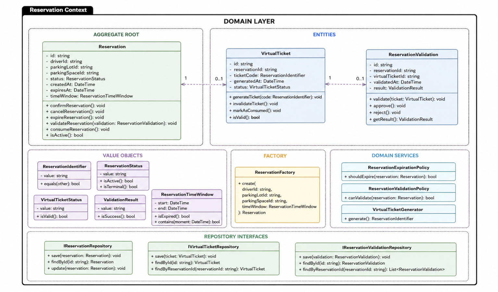

_Nota._ Elaboración propia (2026).

Según el modelo propuesto para este bounded context, la capa de dominio se organiza alrededor de **Reservation** como **aggregate root**, ya que esta clase actúa como raíz de consistencia para controlar todo el ciclo de vida de la reserva. Desde ella se gobiernan las reglas sobre confirmación, cancelación, expiración, validación y consumo. Además, se relaciona con **VirtualTicket** y **ReservationValidation**, que representan conceptos relevantes del dominio pero subordinados a la consistencia de la reserva principal. Gracias a ello, las operaciones críticas del contexto pueden ejecutarse de forma consistente, especialmente aquellas relacionadas con cambios de estado y restricciones temporales.

La clasificación de clases de la **Domain Layer** se resume en la siguiente tabla:

| Categoría                 | Clases                                                                                                           |
| ------------------------- | ---------------------------------------------------------------------------------------------------------------- |
| **Aggregate Root**        | `Reservation`                                                                                                    |
| **Entities**              | `VirtualTicket`, `ReservationValidation`                                                                         |
| **Value Objects**         | `ReservationIdentifier`, `ReservationStatus`, `VirtualTicketStatus`, `ValidationResult`, `ReservationTimeWindow` |
| **Factory**               | `ReservationFactory`                                                                                             |
| **Domain Services**       | `ReservationExpirationPolicy`, `ReservationValidationPolicy`, `VirtualTicketGenerator`                           |
| **Repository Interfaces** | `IReservationRepository`, `IVirtualTicketRepository`, `IReservationValidationRepository`                         |

##### Aggregate Root

| Clase         | Responsabilidad                                                                                                                                                                            |
| ------------- | ------------------------------------------------------------------------------------------------------------------------------------------------------------------------------------------ |
| `Reservation` | Actuar como raíz de consistencia del contexto, controlando el ciclo de vida completo de la reserva y gobernando las reglas de confirmación, cancelación, expiración, validación y consumo. |

##### Entities

| Clase                   | Responsabilidad                                                                                                                                       |
| ----------------------- | ----------------------------------------------------------------------------------------------------------------------------------------------------- |
| `VirtualTicket`         | Representar el ticket virtual generado a partir de una reserva confirmada. Conserva el código o identificador único usado para validación de llegada. |
| `ReservationValidation` | Representar el proceso y resultado de validación de una reserva cuando el conductor llega al estacionamiento y presenta su ticket.                    |

##### Value Objects

| Clase                   | Responsabilidad                                                                                                     |
| ----------------------- | ------------------------------------------------------------------------------------------------------------------- |
| `ReservationIdentifier` | Representar el código único e inmutable de identificación de la reserva o ticket virtual.                           |
| `ReservationStatus`     | Representar el estado de negocio de la reserva, evitando valores inválidos y centralizando transiciones permitidas. |
| `VirtualTicketStatus`   | Representar el estado del ticket virtual, por ejemplo vigente, invalidado o consumido.                              |
| `ValidationResult`      | Representar el resultado inmutable de la validación del ticket, como aprobado o rechazado.                          |
| `ReservationTimeWindow` | Representar la ventana temporal de vigencia de la reserva, incluyendo hora de creación, límite y expiración.        |

##### Factory

| Clase                | Responsabilidad                                                                                                                                                                 |
| -------------------- | ------------------------------------------------------------------------------------------------------------------------------------------------------------------------------- |
| `ReservationFactory` | Crear una `Reservation` válida desde el inicio, asegurando que la reserva nazca con los datos mínimos requeridos, un estado inicial correcto y una ventana de tiempo coherente. |

##### Domain Services

| Clase                         | Responsabilidad                                                                                                                 |
| ----------------------------- | ------------------------------------------------------------------------------------------------------------------------------- |
| `ReservationExpirationPolicy` | Evaluar si una reserva debe expirar según su límite de tiempo y su estado actual.                                               |
| `ReservationValidationPolicy` | Determinar si una reserva puede validarse cuando el conductor presenta su ticket, revisando vigencia y consistencia del estado. |
| `VirtualTicketGenerator`      | Generar el identificador único del ticket virtual respetando las reglas del dominio.                                            |

##### Repository Interfaces

| Clase                              | Responsabilidad                                                            |
| ---------------------------------- | -------------------------------------------------------------------------- |
| `IReservationRepository`           | Guardar, recuperar y actualizar reservas como aggregate root del contexto. |
| `IVirtualTicketRepository`         | Persistir y consultar tickets virtuales asociados a reservas.              |
| `IReservationValidationRepository` | Persistir y consultar registros de validación de reservas.                 |

### Identificación de los elementos del dominio

En este bounded context, el **aggregate root** es `Reservation` porque el negocio necesita una única raíz de consistencia para controlar todo lo que le ocurre a una reserva. Una reserva no debería confirmarse, validarse o consumirse de manera aislada respecto a su ticket, su tiempo de vigencia o su resultado de validación. Por ello, no es necesario crear una clase separada llamada `ReservationAggregate`; basta con que `Reservation` asuma directamente el rol de aggregate root, tal como suele hacerse en DDD cuando la entidad principal del dominio ya representa naturalmente la raíz del agregado.

Las **entities** subordinadas al aggregate root son `VirtualTicket` y `ReservationValidation`, porque ambas poseen identidad propia y evolucionan a lo largo del tiempo, pero siempre dentro del límite de consistencia gobernado por `Reservation`. `VirtualTicket` puede generarse e invalidarse; `ReservationValidation` registra un hecho específico de llegada y validación. En cambio, `Reservation` no se vuelve a listar como entidad separada porque ya fue reconocida como la raíz del agregado.

Los **value objects** se usan para encapsular atributos del dominio que no requieren identidad propia, pero sí reglas de validez e inmutabilidad. Por ejemplo, `ReservationStatus` y `VirtualTicketStatus` evitan manejar estados como simples cadenas dispersas; `ReservationIdentifier` encapsula el código único de ticket; `ValidationResult` expresa el resultado del proceso de validación; y `ReservationTimeWindow` concentra la lógica temporal de vigencia. Su propósito es reducir errores, mejorar expresividad del modelo y proteger invariantes del negocio.

La **factory** `ReservationFactory` se propone porque la creación de una reserva no debería quedar dispersa en constructores o controladores. Desde el inicio, el dominio necesita garantizar datos obligatorios, estado inicial correcto y una vigencia temporal coherente. La fábrica centraliza esa creación válida y mantiene al aggregate root libre de instanciaciones inconsistentes.

Los **domain services** aparecen cuando la lógica no pertenece con naturalidad a una sola entidad. En Reservation, esto ocurre con la política de expiración, la política de validación y la generación del ticket virtual. Son reglas puras del negocio, pero su responsabilidad atraviesa más de una parte del agregado. Por ello, modelarlas como servicios de dominio mantiene la cohesión y evita sobrecargar al aggregate root con lógica transversal.

Finalmente, las **interfaces de repositorio** se ubican en la Domain Layer porque expresan los contratos que el dominio necesita para persistir y recuperar información sin conocer detalles técnicos concretos. Sus implementaciones reales pertenecerán a la Infrastructure Layer.

### Conclusión

En conclusión, la **Domain Layer** de **Reservation** se estructura alrededor de `Reservation` como **aggregate root** del contexto. A partir de esta raíz se controlan las reglas del ciclo de vida de la reserva, mientras que `VirtualTicket` y `ReservationValidation` funcionan como entidades relacionadas que dependen de su consistencia. Los value objects encapsulan estados, identificadores y restricciones temporales; la factory asegura creaciones válidas; los domain services resuelven políticas transversales del negocio; y las interfaces de repositorio definen los contratos que luego implementará la infraestructura. De esta forma, el bounded context mantiene una base táctica clara, coherente con el diseño estratégico de ParkingNow y alineada con un modelado DDD más natural para este caso.

#### 4.2.3.2. Interface Layer

La **Interface Layer** del bounded context **Reservation** representa el punto de entrada para las operaciones relacionadas con la solicitud, consulta, validación, cancelación y seguimiento de reservas dentro de ParkingNow. Esta capa recibe solicitudes principalmente desde la aplicación móvil utilizada por el **Driver**, y también puede recibir acciones operativas desde la interfaz del **Parking Owner** cuando este necesita revisar reservas activas o validar la llegada de un conductor. Además, el contexto Reservation intercambia eventos con otros bounded contexts, ya que en el diseño estratégico del proyecto participa en mensajes como **Request reservation**, **Reservation confirmed**, **Reservation validated**, **Reservation consumed**, **Reservation expired** y **Parking space occupied**.

Al igual que en el bounded context **Parking Management**, en esta capa no se implementan reglas de negocio. Su responsabilidad se limita a recibir la solicitud, validar superficialmente el formato de entrada, construir los **commands** o **queries** correspondientes y delegar el procesamiento a la **Application Layer**. De esta forma, los controladores permanecen ligeros y el comportamiento del negocio sigue concentrado en las capas internas del contexto. Este criterio es consistente con la estructura ya usada en la sección **4.2.1.2 Interface Layer** del contexto anterior.

**Figura 66** _Reservation Context Interface Layer Diagram_

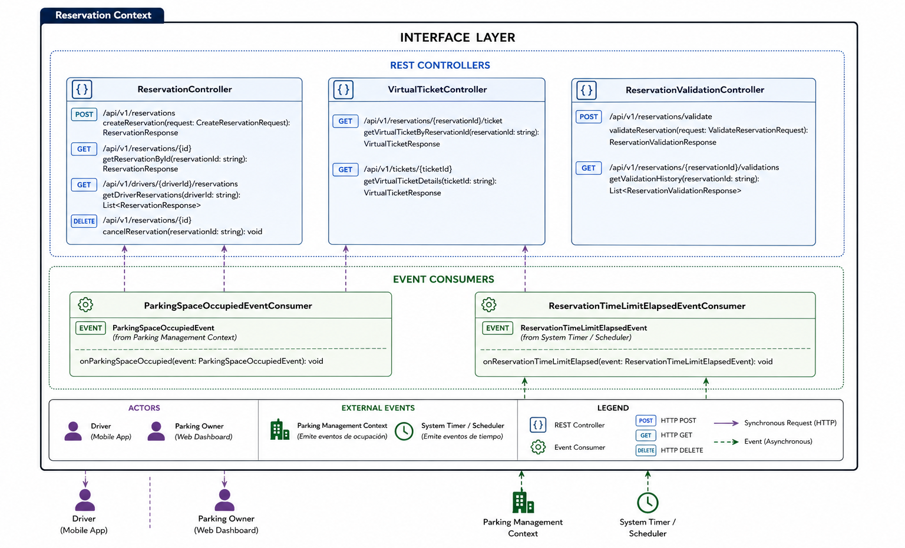

_Nota._ Elaboración propia (2026).

Según el modelo del contexto, la capa de interfaz de **Reservation** puede organizarse alrededor de tres controladores REST principales y dos consumidores de eventos. Los controladores exponen las operaciones necesarias para que el conductor cree y consulte sus reservas, y para que el administrador valide la llegada del conductor o revise reservas activas. Los consumidores de eventos permiten que el contexto reaccione a hechos externos relevantes, como la ocupación física confirmada de un espacio o el vencimiento del tiempo límite de la reserva, sin mezclar directamente lógica de otros bounded contexts dentro de Reservation. Esto es coherente con la trazabilidad del proyecto, donde el administrador necesita monitorear reservas activas y el sistema debe reflejar la precedencia del estado físico cuando un espacio reservado pasa a estar ocupado.

### Actores que interactúan con la Interface Layer

| Actor                        | Tipo de interacción | Rol dentro del contexto                                                                             |
| ---------------------------- | ------------------- | --------------------------------------------------------------------------------------------------- |
| `Driver`                     | Solicitudes REST    | Solicita una reserva, consulta sus reservas, revisa el ticket virtual y cancela una reserva activa. |
| `Parking Owner`              | Solicitudes REST    | Consulta reservas activas del estacionamiento y valida la llegada del conductor mediante el ticket. |
| `Parking Management Context` | Evento externo      | Notifica que el espacio reservado fue ocupado físicamente, permitiendo consumir la reserva.         |
| `System Timer / Scheduler`   | Evento externo      | Notifica que el tiempo límite de una reserva ha finalizado, permitiendo marcarla como expirada.     |

### Controladores REST propuestos

#### ReservationController

La clase `ReservationController` expone las operaciones principales relacionadas con la creación, consulta y cancelación de reservas desde la perspectiva del conductor. Este controlador es el punto de entrada natural para los flujos derivados de las historias donde el conductor reserva un espacio, consulta sus reservas activas o deja sin efecto una reserva antes de usarla.

| Método                                                                      | Responsabilidad                                                                             |
| --------------------------------------------------------------------------- | ------------------------------------------------------------------------------------------- |
| `createReservation(request: CreateReservationRequest): ReservationResponse` | Recibe la solicitud para crear una nueva reserva sobre un espacio previamente seleccionado. |
| `getReservationById(reservationId: string): ReservationResponse`            | Obtiene el detalle de una reserva específica.                                               |
| `getDriverReservations(driverId: string): List<ReservationResponse>`        | Lista las reservas asociadas a un conductor.                                                |
| `cancelReservation(reservationId: string): void`                            | Solicita la cancelación de una reserva activa antes de su consumo o expiración.             |

#### VirtualTicketController

La clase `VirtualTicketController` concentra las operaciones relacionadas con el ticket virtual generado después de confirmar la reserva. Su presencia se justifica porque el ticket es un artefacto central del contexto y debe poder consultarse sin mezclar esta responsabilidad con la creación o validación de la reserva.

| Método                                                                          | Responsabilidad                                      |
| ------------------------------------------------------------------------------- | ---------------------------------------------------- |
| `getVirtualTicketByReservationId(reservationId: string): VirtualTicketResponse` | Obtiene el ticket virtual generado para una reserva. |
| `getVirtualTicketDetails(ticketId: string): VirtualTicketResponse`              | Consulta el detalle de un ticket virtual específico. |

#### ReservationValidationController

La clase `ReservationValidationController` expone las operaciones relacionadas con la validación de llegada del conductor. Este controlador se alinea con la lógica del proyecto donde la reserva confirmada genera un ticket y luego, al llegar al estacionamiento, dicho ticket debe validarse antes de autorizar el uso del espacio.

| Método                                                                                    | Responsabilidad                                                           |
| ----------------------------------------------------------------------------------------- | ------------------------------------------------------------------------- |
| `validateReservation(request: ValidateReservationRequest): ReservationValidationResponse` | Recibe la solicitud de validación del ticket presentado por el conductor. |
| `getValidationHistory(reservationId: string): List<ReservationValidationResponse>`        | Consulta el historial de validaciones asociadas a una reserva.            |

### Consumidores de eventos propuestos

#### ParkingSpaceOccupiedEventConsumer

La clase `ParkingSpaceOccupiedEventConsumer` recibe eventos provenientes de **Parking Management** o de la capa que consolida el estado físico del espacio. Su responsabilidad es traducir el hecho externo **Parking space occupied** en una invocación hacia la capa de aplicación para marcar la reserva correspondiente como consumida. Esto se alinea con la regla del proyecto según la cual la ocupación física prevalece sobre el estado reservado cuando ambas coexisten.

| Método                                                           | Responsabilidad                                                                                      |
| ---------------------------------------------------------------- | ---------------------------------------------------------------------------------------------------- |
| `onParkingSpaceOccupied(event: ParkingSpaceOccupiedEvent): void` | Recibe el evento de ocupación física confirmada e inicia el flujo para consumir la reserva asociada. |

#### ReservationTimeLimitElapsedEventConsumer

La clase `ReservationTimeLimitElapsedEventConsumer` recibe el evento que indica que el tiempo máximo de espera de una reserva ha finalizado. Su función es traducir ese hecho en una solicitud a la Application Layer para marcar la reserva como expirada e invalidar su ticket virtual si corresponde. Este flujo responde al comportamiento esperado del contexto frente al mensaje **Reservation time limit elapsed** definido en el proyecto.

| Método                                                                         | Responsabilidad                                                                  |
| ------------------------------------------------------------------------------ | -------------------------------------------------------------------------------- |
| `onReservationTimeLimitElapsed(event: ReservationTimeLimitElapsedEvent): void` | Recibe el evento de vencimiento e inicia el proceso de expiración de la reserva. |

### Requests y responses de la capa de interfaz

Para mantener desacoplada la Interface Layer respecto del dominio, los controladores trabajan con objetos de entrada y salida propios de esta capa. Estos DTOs permiten validar formato, transportar datos y evitar exponer directamente las entidades del dominio. Esta misma lógica de separación entre request/response y reglas internas ya se observa en el bounded context anterior, donde los controladores reciben objetos como `RegisterParkingLotRequest` y devuelven `ParkingLotResponse`.

#### Requests principales

| Clase                        | Propósito                                                                                                                  |
| ---------------------------- | -------------------------------------------------------------------------------------------------------------------------- |
| `CreateReservationRequest`   | Contiene datos como `driverId`, `parkingLotId`, `parkingSpaceId` y la referencia temporal necesaria para crear la reserva. |
| `ValidateReservationRequest` | Contiene datos como `reservationId`, `ticketCode` y, si aplica, el identificador del operador o punto de validación.       |

#### Responses principales

| Clase                           | Propósito                                                                                                    |
| ------------------------------- | ------------------------------------------------------------------------------------------------------------ |
| `ReservationResponse`           | Devuelve los datos principales de la reserva, incluyendo identificador, estado, espacio asociado y vigencia. |
| `VirtualTicketResponse`         | Devuelve la información principal del ticket virtual, incluyendo código, estado y fecha de generación.       |
| `ReservationValidationResponse` | Devuelve el resultado de la validación, la fecha y el estado final del intento de validación.                |

### Conclusión

En conclusión, la **Interface Layer** del bounded context **Reservation** actúa como la frontera de entrada del contexto y canaliza las interacciones del **Driver**, del **Parking Owner** y de eventos externos relevantes hacia la **Application Layer**. Su estructura puede organizarse en controladores REST especializados en reservas, tickets y validaciones, además de consumidores de eventos para ocupación física y vencimiento del tiempo límite. Así, el contexto conserva una interfaz clara, alineada con el flujo funcional del proyecto y con el mismo estilo arquitectónico ya utilizado en **Parking Management**.

#### 4.2.3.3. Application Layer

La **Application Layer** del bounded context **Reservation** contiene las clases encargadas de orquestar los casos de uso relacionados con la creación, consulta, cancelación, validación, expiración y consumo de reservas dentro de ParkingNow. Esta capa actúa como intermediaria entre la **Interface Layer**, que recibe solicitudes HTTP y eventos externos, y la **Domain Layer**, donde se encuentran las reglas de negocio puras del contexto. Su función principal es coordinar el flujo de ejecución, invocar fábricas, servicios de dominio y repositorios, y devolver el resultado correspondiente sin incorporar lógica de negocio compleja. Esta misma función de orquestación es la que ya se observa en la **Application Layer** del bounded context **Parking Management**, donde los handlers coordinan comandos y eventos sin contaminar el dominio con detalles de interfaz o infraestructura

En el caso de **Reservation**, esta capa debe responder a los mensajes estratégicos identificados en la solución, como **Request reservation**, **Generate virtual ticket**, **Reservation validated**, **Reservation consumed** y **Reservation expired**. Por ello, su diseño se organiza principalmente en **command handlers**, **query handlers** y **event handlers**, cada uno enfocado en un caso de uso específico del ciclo de vida de la reserva. Este enfoque también es coherente con el planteamiento general del proyecto, donde la reserva es el mecanismo que transforma la disponibilidad de un espacio en un compromiso temporal verificable mediante ticket digital y validación posterior.

**Figura 67** _Reservation Context Application Layer Diagram_

_Nota._ Elaboración propia (2026).

Según el modelo propuesto para este bounded context, la **Application Layer** de **Reservation** está compuesta por handlers que reciben comandos desde la interfaz o eventos desde otros contextos y coordinan las acciones necesarias sobre el aggregate root `Reservation`. Algunos handlers crean nuevas reservas, otros consultan información, otros ejecutan validaciones o cancelaciones, y otros reaccionan a eventos de expiración temporal o de ocupación física. De esta manera, la capa de aplicación conserva una estructura delgada y orientada a casos de uso, manteniendo separadas la recepción de solicitudes, la lógica del dominio y la persistencia técnica. Esta forma de organización es consistente con el patrón ya utilizado en la documentación táctica del repositorio.

### Command Handlers propuestos

##### CreateReservationCommandHandler

La clase `CreateReservationCommandHandler` orquesta el caso de uso de creación de una nueva reserva. Recibe la solicitud proveniente de la interfaz, valida la existencia de los datos mínimos requeridos, utiliza `ReservationFactory` para construir una reserva válida, invoca `VirtualTicketGenerator` para preparar el identificador del ticket y persiste el aggregate root mediante `IReservationRepository`. Además, coordina la persistencia del ticket virtual generado a través de `IVirtualTicketRepository`.

| Método                                                           | Responsabilidad                                                         |
| ---------------------------------------------------------------- | ----------------------------------------------------------------------- |
| `handle(command: CreateReservationCommand): ReservationResponse` | Orquesta la creación de una nueva reserva y su ticket virtual asociado. |

##### CancelReservationCommandHandler

La clase `CancelReservationCommandHandler` orquesta el caso de uso de cancelación de una reserva activa. Recupera la reserva desde el repositorio, verifica que aún pueda cancelarse, ejecuta la transición correspondiente en el dominio y actualiza el estado persistido. Si la reserva tenía un ticket virtual vigente, también coordina su invalidación.

| Método                                            | Responsabilidad                                                                 |
| ------------------------------------------------- | ------------------------------------------------------------------------------- |
| `handle(command: CancelReservationCommand): void` | Orquesta la cancelación de una reserva activa antes de su consumo o expiración. |

##### ValidateReservationCommandHandler

La clase `ValidateReservationCommandHandler` orquesta el proceso de validación cuando el conductor llega al estacionamiento y presenta su ticket. Recupera la reserva y el ticket asociado, consulta la política de validación, registra el resultado mediante `ReservationValidation` y persiste tanto la validación como el nuevo estado de la reserva.

| Método                                                                       | Responsabilidad                                                                    |
| ---------------------------------------------------------------------------- | ---------------------------------------------------------------------------------- |
| `handle(command: ValidateReservationCommand): ReservationValidationResponse` | Orquesta la validación de la reserva usando el ticket presentado por el conductor. |

### Query Handlers propuestos

##### GetReservationByIdQueryHandler

La clase `GetReservationByIdQueryHandler` orquesta la consulta de detalle de una reserva específica. Recupera la información del aggregate root desde el repositorio y la transforma en un objeto de respuesta adecuado para la interfaz.

| Método                                                        | Responsabilidad                                |
| ------------------------------------------------------------- | ---------------------------------------------- |
| `handle(query: GetReservationByIdQuery): ReservationResponse` | Consulta el detalle de una reserva específica. |

##### GetDriverReservationsQueryHandler

La clase `GetDriverReservationsQueryHandler` permite recuperar la lista de reservas asociadas a un conductor. Este caso de uso es importante para que el conductor pueda consultar sus reservas activas, expiradas, canceladas o consumidas desde la aplicación.

| Método                                                                 | Responsabilidad                        |
| ---------------------------------------------------------------------- | -------------------------------------- |
| `handle(query: GetDriverReservationsQuery): List<ReservationResponse>` | Consulta las reservas de un conductor. |

##### GetVirtualTicketByReservationIdQueryHandler

La clase `GetVirtualTicketByReservationIdQueryHandler` consulta el ticket virtual asociado a una reserva confirmada. Su responsabilidad es recuperar el ticket y devolver su información de manera desacoplada del dominio interno.

| Método                                                                       | Responsabilidad                                       |
| ---------------------------------------------------------------------------- | ----------------------------------------------------- |
| `handle(query: GetVirtualTicketByReservationIdQuery): VirtualTicketResponse` | Consulta el ticket virtual generado para una reserva. |

##### GetReservationValidationHistoryQueryHandler

La clase `GetReservationValidationHistoryQueryHandler` permite consultar los intentos o registros de validación asociados a una reserva. Este caso de uso es útil para auditoría operativa y trazabilidad.

| Método                                                                                     | Responsabilidad                                       |
| ------------------------------------------------------------------------------------------ | ----------------------------------------------------- |
| `handle(query: GetReservationValidationHistoryQuery): List<ReservationValidationResponse>` | Consulta el historial de validaciones de una reserva. |

### Event Handlers propuestos

##### ReservationTimeLimitElapsedEventHandler

La clase `ReservationTimeLimitElapsedEventHandler` procesa el evento que indica que el tiempo de espera permitido para una reserva ha finalizado. Recupera la reserva, evalúa la expiración mediante `ReservationExpirationPolicy`, actualiza su estado a expirada y coordina la invalidación del ticket virtual correspondiente si todavía seguía vigente.

| Método                                                  | Responsabilidad                                                         |
| ------------------------------------------------------- | ----------------------------------------------------------------------- |
| `handle(event: ReservationTimeLimitElapsedEvent): void` | Procesa el vencimiento temporal de una reserva y ejecuta su expiración. |

##### ParkingSpaceOccupiedEventHandler

La clase `ParkingSpaceOccupiedEventHandler` procesa el evento de ocupación física de un espacio reservado. Recupera la reserva asociada al espacio, verifica que corresponda a una reserva válida y la marca como consumida, reflejando así la precedencia del estado físico del estacionamiento sobre la simple reserva lógica.

| Método                                           | Responsabilidad                                                                   |
| ------------------------------------------------ | --------------------------------------------------------------------------------- |
| `handle(event: ParkingSpaceOccupiedEvent): void` | Procesa la ocupación física confirmada del espacio y consume la reserva asociada. |

### Commands y Queries de la capa de aplicación

Para mantener separadas las responsabilidades, la **Application Layer** trabaja con objetos explícitos de comando y consulta. Estos objetos representan intenciones del usuario o del sistema, y son procesados por handlers especializados.

#### Commands principales

| Clase                        | Propósito                                                                                       |
| ---------------------------- | ----------------------------------------------------------------------------------------------- |
| `CreateReservationCommand`   | Representa la intención de crear una nueva reserva para un conductor y un espacio seleccionado. |
| `CancelReservationCommand`   | Representa la intención de cancelar una reserva vigente.                                        |
| `ValidateReservationCommand` | Representa la intención de validar una reserva mediante el ticket presentado por el conductor.  |

#### Queries principales

| Clase                                  | Propósito                                              |
| -------------------------------------- | ------------------------------------------------------ |
| `GetReservationByIdQuery`              | Consultar el detalle de una reserva específica.        |
| `GetDriverReservationsQuery`           | Consultar las reservas asociadas a un conductor.       |
| `GetVirtualTicketByReservationIdQuery` | Consultar el ticket virtual generado para una reserva. |
| `GetReservationValidationHistoryQuery` | Consultar el historial de validaciones de una reserva. |

### Resumen de clases de la Application Layer

| Clase                                         | Tipo            | Responsabilidad                                                                |
| --------------------------------------------- | --------------- | ------------------------------------------------------------------------------ |
| `CreateReservationCommandHandler`             | Command Handler | Orquestar la creación de una nueva reserva y la generación del ticket virtual. |
| `CancelReservationCommandHandler`             | Command Handler | Orquestar la cancelación de una reserva activa.                                |
| `ValidateReservationCommandHandler`           | Command Handler | Orquestar la validación de una reserva mediante ticket.                        |
| `GetReservationByIdQueryHandler`              | Query Handler   | Orquestar la consulta del detalle de una reserva.                              |
| `GetDriverReservationsQueryHandler`           | Query Handler   | Orquestar la consulta de reservas de un conductor.                             |
| `GetVirtualTicketByReservationIdQueryHandler` | Query Handler   | Orquestar la consulta del ticket virtual asociado a una reserva.               |
| `GetReservationValidationHistoryQueryHandler` | Query Handler   | Orquestar la consulta del historial de validaciones.                           |
| `ReservationTimeLimitElapsedEventHandler`     | Event Handler   | Procesar el evento de expiración temporal de una reserva.                      |
| `ParkingSpaceOccupiedEventHandler`            | Event Handler   | Procesar el evento de ocupación física y consumir la reserva correspondiente.  |

### Conclusión

En conclusión, la **Application Layer** del bounded context **Reservation** mantiene una estructura delgada, orientada a casos de uso y coherente con el estilo arquitectónico del repositorio. Sus handlers reciben comandos, consultas y eventos; coordinan fábricas, servicios de dominio y repositorios; y devuelven respuestas útiles para la interfaz o actualizan el estado del contexto según eventos externos. Así, esta capa permite que ParkingNow mantenga separadas la orquestación del negocio, las reglas puras del dominio y los detalles técnicos de infraestructura, siguiendo el mismo enfoque aplicado previamente en **Parking Management**.

#### 4.2.3.4. Infrastructure Layer

La **Infrastructure Layer** del bounded context **Reservation** agrupa los componentes técnicos que permiten materializar en software las operaciones definidas en las capas superiores del contexto. Mientras la **Domain Layer** expresa las reglas del negocio y la **Application Layer** coordina los casos de uso, la infraestructura se encarga de resolver aspectos concretos como la persistencia en base de datos, la publicación y consumo de eventos, la integración con generadores de tickets y la implementación real de los contratos definidos por el dominio. En otras palabras, esta capa no define qué debe hacer el negocio, sino **cómo se soporta técnicamente su ejecución**.

Siguiendo el mismo enfoque usado en el bounded context anterior, la **Infrastructure Layer** no debe contener reglas del dominio. Su responsabilidad es implementar los repositorios declarados en la Domain Layer, configurar el acceso a datos, persistir entidades como `Reservation`, `VirtualTicket` y `ReservationValidation`, y proporcionar adaptadores para interactuar con mecanismos externos del sistema. Así, el bounded context mantiene una separación clara entre lógica de negocio y detalles tecnológicos, lo cual es coherente con una arquitectura basada en DDD.

**Figura 68** _Reservation Context Infrastructure Layer Diagram_

_Nota._ Elaboración propia (2026).

En el caso de **Reservation**, la infraestructura debe soportar principalmente cuatro necesidades técnicas. Primero, la persistencia de reservas, tickets y validaciones. Segundo, la ejecución de integraciones externas, como la generación del ticket virtual o código QR. Tercero, la recepción o publicación de eventos del sistema, como la expiración de una reserva o la ocupación física de un espacio. Y cuarto, el mapeo entre el modelo del dominio y la base de datos relacional. Por ello, esta capa se organiza alrededor de **repository implementations**, **ORM mappings**, **integration adapters**, **event publishers/consumers** y **persistence configuration**.

### Componentes principales de la Infrastructure Layer

La clasificación de clases de la **Infrastructure Layer** se resume en la siguiente tabla:

| Categoría                      | Clases                                                                                                           |
| ------------------------------ | ---------------------------------------------------------------------------------------------------------------- |
| **Repository Implementations** | `ReservationRepository`, `VirtualTicketRepository`, `ReservationValidationRepository`                            |
| **ORM / Persistence Mapping**  | `ReservationEntityMapper`, `VirtualTicketEntityMapper`, `ReservationValidationEntityMapper`                      |
| **Persistence Context**        | `ReservationDbContext`                                                                                           |
| **External Service Adapters**  | `QrTicketGenerationAdapter`, `SystemClockAdapter`                                                                |
| **Event Infrastructure**       | `ReservationEventPublisher`, `ParkingSpaceOccupiedMessageConsumer`, `ReservationTimeLimitElapsedMessageConsumer` |

##### Repository Implementations

| Clase                             | Responsabilidad                                                                                                 |
| --------------------------------- | --------------------------------------------------------------------------------------------------------------- |
| `ReservationRepository`           | Implementar `IReservationRepository` y encargarse de guardar, buscar y actualizar reservas en la base de datos. |
| `VirtualTicketRepository`         | Implementar `IVirtualTicketRepository` y gestionar la persistencia de tickets virtuales asociados a reservas.   |
| `ReservationValidationRepository` | Implementar `IReservationValidationRepository` y persistir los registros de validación de reservas.             |

Estas clases representan la implementación concreta de los contratos definidos en la Domain Layer. Desde la perspectiva del dominio, solo existe la necesidad de guardar y recuperar objetos; sin embargo, en infraestructura se decide cómo hacerlo, normalmente mediante un ORM como Entity Framework, JPA o una tecnología similar. La idea es que la lógica del negocio no dependa directamente de tablas, sentencias SQL ni configuraciones técnicas.

##### ORM / Persistence Mapping

| Clase                               | Responsabilidad                                                                                    |
| ----------------------------------- | -------------------------------------------------------------------------------------------------- |
| `ReservationEntityMapper`           | Configurar el mapeo entre la entidad `Reservation` y la tabla correspondiente en la base de datos. |
| `VirtualTicketEntityMapper`         | Configurar el mapeo entre la entidad `VirtualTicket` y su tabla persistente.                       |
| `ReservationValidationEntityMapper` | Configurar el mapeo entre la entidad `ReservationValidation` y su estructura de persistencia.      |

Los mappers o configuraciones de entidad permiten traducir el modelo del dominio a una representación persistente. Esto incluye claves primarias, relaciones entre tablas, restricciones de longitud, columnas obligatorias y conversiones necesarias para value objects como `ReservationStatus`, `ReservationIdentifier` o `ValidationResult`. Esta decisión ayuda a que el dominio siga siendo expresivo y limpio, sin llenarse de anotaciones o configuraciones técnicas.

##### Persistence Context

| Clase                  | Responsabilidad                                                                                                                      |
| ---------------------- | ------------------------------------------------------------------------------------------------------------------------------------ |
| `ReservationDbContext` | Centralizar la configuración del contexto de persistencia, el acceso a las tablas del bounded context y la aplicación de mapeos ORM. |

`ReservationDbContext` actúa como el punto técnico de acceso a la base de datos del contexto. Su función es registrar los conjuntos de entidades persistentes, aplicar configuraciones de mapeo y servir como soporte para los repositorios concretos. Dependiendo de la tecnología elegida, este contexto puede representar un `DbContext`, una unidad de trabajo o un módulo de persistencia específico para Reservation.

##### External Service Adapters

| Clase                       | Responsabilidad                                                                                                                                   |
| --------------------------- | ------------------------------------------------------------------------------------------------------------------------------------------------- |
| `QrTicketGenerationAdapter` | Integrarse con el mecanismo técnico encargado de materializar el ticket virtual o código QR a partir de un identificador generado por el dominio. |
| `SystemClockAdapter`        | Proveer la hora actual del sistema de manera desacoplada, facilitando el cálculo de expiraciones y la trazabilidad temporal.                      |

Estos adaptadores aíslan al dominio y a la aplicación de dependencias externas. Por ejemplo, el dominio puede necesitar un identificador para el ticket, pero no debería saber cómo se codifica un QR, cómo se serializa o qué librería externa lo genera. Del mismo modo, usar un adaptador para la hora del sistema evita acoplar la lógica temporal a llamadas directas del framework y facilita las pruebas.

##### Event Infrastructure

| Clase                                        | Responsabilidad                                                                                                                         |
| -------------------------------------------- | --------------------------------------------------------------------------------------------------------------------------------------- |
| `ReservationEventPublisher`                  | Publicar eventos relevantes del contexto, como reserva confirmada, validada, consumida o expirada, hacia otros componentes del sistema. |
| `ParkingSpaceOccupiedMessageConsumer`        | Recibir técnicamente el mensaje externo de ocupación física del espacio y trasladarlo a la Application Layer.                           |
| `ReservationTimeLimitElapsedMessageConsumer` | Recibir técnicamente el mensaje de vencimiento temporal de la reserva y redirigirlo hacia el caso de uso correspondiente.               |

Estos componentes permiten conectar el bounded context con el estilo orientado a eventos presente en la solución. Aunque la decisión de negocio de consumir una reserva o expirar una reserva pertenece a capas superiores, la infraestructura es la que resuelve detalles como colas, brokers, serialización de mensajes, suscripciones o publicación de eventos.

### Responsabilidades técnicas de la Infrastructure Layer

La **Infrastructure Layer** de **Reservation** cumple, principalmente, las siguientes responsabilidades:

| Responsabilidad técnica           | Descripción                                                                           |
| --------------------------------- | ------------------------------------------------------------------------------------- |
| Persistencia de reservas          | Guardar y recuperar instancias de `Reservation` como aggregate root del contexto.     |
| Persistencia de tickets virtuales | Guardar y recuperar tickets asociados a reservas confirmadas.                         |
| Persistencia de validaciones      | Registrar y consultar validaciones realizadas sobre reservas.                         |
| Traducción ORM                    | Mapear entidades y value objects del dominio a tablas y columnas de la base de datos. |
| Integración externa               | Soportar la generación técnica del ticket virtual y la obtención de hora del sistema. |
| Publicación y consumo de eventos  | Conectar el bounded context con eventos internos y externos del sistema.              |

### Flujo técnico general dentro de la infraestructura

A nivel general, el flujo técnico dentro de esta capa puede resumirse así:

1. La **Application Layer** solicita guardar, recuperar o actualizar una reserva, ticket o validación.
2. La infraestructura delega estas operaciones a los **repository implementations**.
3. Los repositorios usan `ReservationDbContext` y los **entity mappers** para traducir el modelo de dominio al modelo persistente.
4. Cuando se necesita integración externa, la infraestructura utiliza adaptadores como `QrTicketGenerationAdapter` o `SystemClockAdapter`.
5. Cuando debe interactuar con otros contextos o componentes del sistema, la infraestructura publica o consume mensajes mediante `ReservationEventPublisher` y los `MessageConsumer`.

Este flujo conserva la independencia del dominio y mantiene los detalles tecnológicos encapsulados en la capa que les corresponde.

### Resumen de clases de la Infrastructure Layer

| Clase                                        | Tipo                      | Responsabilidad                                               |
| -------------------------------------------- | ------------------------- | ------------------------------------------------------------- |
| `ReservationRepository`                      | Repository Implementation | Persistir y consultar reservas.                               |
| `VirtualTicketRepository`                    | Repository Implementation | Persistir y consultar tickets virtuales.                      |
| `ReservationValidationRepository`            | Repository Implementation | Persistir y consultar validaciones de reservas.               |
| `ReservationEntityMapper`                    | ORM Mapper                | Mapear la entidad `Reservation` a la base de datos.           |
| `VirtualTicketEntityMapper`                  | ORM Mapper                | Mapear la entidad `VirtualTicket` a la base de datos.         |
| `ReservationValidationEntityMapper`          | ORM Mapper                | Mapear la entidad `ReservationValidation` a la base de datos. |
| `ReservationDbContext`                       | Persistence Context       | Configurar y centralizar el acceso a datos del contexto.      |
| `QrTicketGenerationAdapter`                  | External Adapter          | Resolver técnicamente la generación del ticket virtual o QR.  |
| `SystemClockAdapter`                         | External Adapter          | Proveer tiempo del sistema de forma desacoplada.              |
| `ReservationEventPublisher`                  | Event Publisher           | Publicar eventos del contexto hacia otros módulos.            |
| `ParkingSpaceOccupiedMessageConsumer`        | Message Consumer          | Recibir eventos externos de ocupación física.                 |
| `ReservationTimeLimitElapsedMessageConsumer` | Message Consumer          | Recibir eventos externos de expiración temporal.              |

### Conclusión

En conclusión, la **Infrastructure Layer** del bounded context **Reservation** concentra todos los elementos técnicos necesarios para soportar la ejecución real del contexto sin contaminar la lógica del dominio. Sus repositorios implementan los contratos definidos por la Domain Layer, sus mappers traducen entidades y value objects a estructuras persistentes, sus adaptadores aíslan integraciones externas y sus componentes de mensajería permiten la comunicación orientada a eventos con otros módulos del sistema. De esta manera, el contexto Reservation conserva una arquitectura limpia, coherente con DDD y alineada con la estructura ya utilizada en el bounded context previamente desarrollado.

#### 4.2.3.5. Bounded Context Software Architecture Component Level Diagrams

El **Bounded Context Software Architecture Component Level Diagram** del bounded context **Reservation** permite representar cómo se organizan e interactúan sus componentes internos dentro del contenedor **Core REST API**. Este diagrama corresponde al **nivel 3 del modelo C4**, por lo que muestra componentes de software con responsabilidades claras dentro del contexto, sin llegar todavía al detalle de clases, atributos o tablas de base de datos. Este mismo enfoque ya se utiliza en la documentación del proyecto para otros bounded contexts, donde los diagramas de componente muestran la descomposición interna de cada contexto siguiendo la separación por capas.

Para ParkingNow, el bounded context **Reservation** se implementa principalmente dentro del **Core REST API**, el cual forma parte de la arquitectura central de la solución y se encuentra alineado con una implementación basada en **Java, Spring Boot, RESTful API y documentación OpenAPI/Swagger**. Dentro de este contexto se concentran las responsabilidades relacionadas con la creación, consulta, validación, cancelación, expiración y consumo de reservas, así como la generación y consulta de tickets virtuales asociados.

Este contexto recibe solicitudes desde la **Driver Mobile App** y desde el **Parking Owner Web Dashboard**. Desde la aplicación móvil, el conductor puede crear una reserva, consultar sus reservas activas y revisar el ticket virtual generado. Desde la interfaz web, el administrador puede validar la llegada del conductor y consultar el historial de validaciones. Además, el contexto también recibe eventos externos relevantes, como la ocupación física de un espacio y el vencimiento del tiempo límite de una reserva, para reflejar correctamente su ciclo de vida dentro del sistema.

**Figura 69** _Reservation Context Component Level Diagram_  
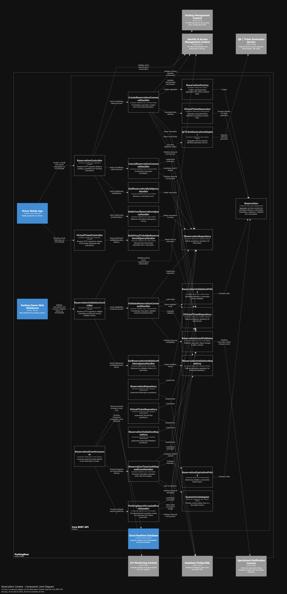  
_Nota._ Elaboración propia (2026).

Según la Figura 69, el bounded context **Reservation** se organiza en componentes pertenecientes a cuatro capas principales: **Interface Layer**, **Application Layer**, **Domain Layer** e **Infrastructure Layer**. Esta distribución mantiene coherencia con el estilo de diseño táctico ya aplicado en el repositorio, ya que permite separar claramente la recepción de solicitudes, la orquestación de casos de uso, las reglas puras del dominio y los mecanismos técnicos de persistencia o integración externa.

En la **Interface Layer** se ubican los componentes de entrada del contexto, principalmente `ReservationController`, `VirtualTicketController`, `ReservationValidationController` y el componente `ReservationEventConsumer`. Estos elementos reciben solicitudes HTTP o eventos externos y los traducen hacia comandos, consultas o eventos internos que luego serán atendidos por la capa de aplicación. De esta manera, la interfaz actúa como frontera del contexto sin mezclar lógica de negocio con detalles de transporte o exposición. Esta organización es consistente con la lógica de controladores y consumidores de eventos ya descrita en otros bounded contexts del proyecto.
En la **Application Layer** se agrupan los handlers que coordinan los casos de uso del contexto. Entre ellos destacan `CreateReservationCommandHandler`, `CancelReservationCommandHandler`, `ValidateReservationCommandHandler`, `GetReservationByIdQueryHandler`, `GetDriverReservationsQueryHandler`, `GetVirtualTicketByReservationIdQueryHandler`, `GetReservationValidationHistoryQueryHandler`, `ReservationTimeLimitElapsedEventHandler` y `ParkingSpaceOccupiedEventHandler`. Estos componentes no implementan reglas de negocio puras, sino que orquestan la ejecución de operaciones del dominio, consultan repositorios y coordinan la respuesta del sistema frente a solicitudes o eventos. Esta separación por handlers sigue el mismo criterio táctico usado en la documentación existente del proyecto.

En la **Domain Layer** se concentra el núcleo del bounded context. Allí se ubica `Reservation` como **aggregate root**, junto con componentes como `ReservationFactory`, `ReservationExpirationPolicy`, `ReservationValidationPolicy`, `VirtualTicketGenerator` y las interfaces `IReservationRepository`, `IVirtualTicketRepository` e `IReservationValidationRepository`. Esta capa encapsula las reglas que controlan el ciclo de vida de la reserva, desde su creación hasta su validación, expiración o consumo, manteniendo independencia respecto de tecnologías externas y detalles de persistencia.

En la **Infrastructure Layer** se ubican las implementaciones concretas que permiten ejecutar técnicamente el contexto, como `ReservationRepository`, `VirtualTicketRepository`, `ReservationValidationRepository`, `QrTicketGenerationAdapter`, `SystemClockAdapter` y `ReservationEventPublisher`. Estos componentes resuelven la persistencia en **Supabase PostgreSQL**, la integración con servicios externos para generación de tickets o QR, la obtención de tiempo del sistema y la publicación de eventos hacia otros bounded contexts o módulos de la solución. Esta responsabilidad de encapsular detalles técnicos también sigue el patrón arquitectónico observado en los demás contextos documentados.

Además, el diagrama de componentes muestra que **Reservation** no opera de forma aislada, sino que se integra con otros bounded contexts y sistemas de apoyo dentro de ParkingNow. Desde **Parking Management** obtiene la referencia del estacionamiento y del espacio seleccionado; desde **IoT Monitoring** puede recibir el evento de ocupación física del espacio; con **Identity & Access Management** valida autenticación y autorización; con el servicio de **QR / Ticket Generation** genera el ticket virtual; y hacia **Operational Notification** publica eventos de cambio de estado, como reserva confirmada, validada, consumida o expirada. Estas relaciones reflejan el context mapping y los flujos de mensajes definidos en el diseño estratégico del proyecto.

En conclusión, el **Component Level Diagram** del bounded context **Reservation** muestra cómo este módulo estructura internamente sus responsabilidades dentro del **Core REST API**. La separación entre controladores, handlers, dominio e infraestructura permite mantener una arquitectura limpia y coherente con Domain-Driven Design, donde las reglas de negocio no se mezclan con detalles técnicos y cada componente cumple una responsabilidad específica dentro del ciclo de vida de la reserva. Esta organización facilita la evolución del sistema, reduce el acoplamiento y asegura trazabilidad entre el diseño estratégico, el diseño táctico y la futura implementación del contexto.

#### 4.2.3.6. Bounded Context Software Architecture Code Level Diagrams

Los **Bounded Context Software Architecture Code Level Diagrams** del bounded context **Reservation** permiten representar el diseño interno del contexto con un nivel de detalle mayor al mostrado en los diagramas de componentes. Mientras el **Component Level Diagram** presenta la organización general de controladores, handlers, servicios de dominio, repositorios y adaptadores, los diagramas de nivel de código buscan aterrizar cómo se estructura técnicamente el bounded context a partir de sus clases principales y de su modelo de persistencia.

En esta sección, el objetivo no es volver a explicar la lógica funcional del contexto, sino mostrar cómo dicha lógica se traduce en una estructura de software concreta y coherente con el enfoque **Domain-Driven Design** adoptado por ParkingNow. Por ello, los diagramas de nivel de código permiten visualizar con mayor precisión las clases del dominio, sus relaciones, sus responsabilidades y la forma en que estas se reflejan posteriormente en el diseño de base de datos del contexto.

Para el bounded context **Reservation**, estos diagramas son especialmente importantes porque el ciclo de vida de la reserva involucra varios elementos relacionados entre sí, como la reserva principal, el ticket virtual, la validación de llegada, los identificadores únicos, los estados de la reserva y las restricciones temporales. En consecuencia, el nivel de código ayuda a entender de forma más clara cómo se organiza internamente el modelo propuesto y cómo se mantiene la consistencia entre el dominio y la persistencia.

Dentro de esta sección se desarrollan dos diagramas principales. En primer lugar, el **Bounded Context Domain Layer Class Diagram**, que muestra las clases pertenecientes a la capa de dominio, incluyendo el **aggregate root** `Reservation`, las entidades relacionadas, los value objects, la factory, los domain services y las interfaces de repositorio. En segundo lugar, el **Bounded Context Database Design Diagram**, que representa la traducción de dicho modelo a una estructura relacional de persistencia, mostrando tablas, claves, relaciones y atributos relevantes para almacenar la información del contexto.

De esta manera, los diagramas de nivel de código permiten cerrar la transición entre el diseño táctico y la futura implementación del bounded context. Por un lado, muestran cómo se modela el negocio en clases y relaciones; por otro, evidencian cómo estas decisiones impactan directamente en la forma en que los datos serán almacenados y consultados por la aplicación. Así, esta sección complementa las capas ya desarrolladas anteriormente y aporta una vista más técnica y precisa del bounded context **Reservation**.

En las subsecciones siguientes se presenta, primero, el diagrama de clases de la capa de dominio y, después, el diagrama de diseño de base de datos correspondiente al bounded context.

##### 4.2.3.6.1. Bounded Context Domain Layer Class Diagrams

El **Bounded Context Domain Layer Class Diagram** del bounded context **Reservation** permite representar, a nivel de código, las clases principales que conforman la capa de dominio y las relaciones existentes entre ellas. A diferencia del diagrama de componentes, que muestra una vista más general de las responsabilidades del contexto dentro del sistema, este diagrama se enfoca en la estructura interna del modelo de dominio, mostrando el **aggregate root**, las entidades asociadas, los value objects, la factory, los domain services y las interfaces de repositorio que sostienen la lógica del negocio.

En el caso de **Reservation**, este diagrama es especialmente importante porque el contexto no se limita a una sola entidad aislada, sino que articula varios conceptos que deben mantenerse consistentes entre sí durante todo el ciclo de vida de la reserva. La reserva principal debe controlar estados, tiempos de vigencia, generación de ticket virtual, validación de llegada, cancelación, expiración y consumo. Por ello, el diagrama de clases de dominio permite visualizar con claridad cómo se distribuyen estas responsabilidades dentro del modelo y qué relaciones estructurales existen entre sus elementos.

**Figura 70** _Reservation Context Domain Layer Class Diagram_  
  
_Nota._ Elaboración propia (2026).

Según la Figura 70, la clase central del bounded context es **`Reservation`**, la cual actúa como **aggregate root**. Esta clase representa la reserva realizada por un conductor sobre un espacio de estacionamiento y concentra la consistencia principal del contexto. Desde ella se gobiernan las operaciones más importantes del dominio, como confirmar la reserva, cancelarla, expirar su vigencia, validarla y finalmente consumirla cuando el espacio reservado pasa a estar físicamente ocupado. Modelar a `Reservation` como raíz del agregado permite mantener bajo un mismo límite de consistencia todo aquello que afecta directamente el ciclo de vida de la reserva.

Relacionadas con esta raíz del agregado aparecen las entidades **`VirtualTicket`** y **`ReservationValidation`**. La primera representa el ticket virtual generado luego de confirmar una reserva y contiene el identificador único que permitirá su validación posterior. La segunda representa el proceso de validación de la reserva cuando el conductor llega al estacionamiento y presenta su ticket. Ambas son entidades porque poseen identidad propia y evolucionan con el tiempo, pero permanecen subordinadas a la consistencia definida por `Reservation`.

El diagrama también incorpora un conjunto de **value objects** que encapsulan atributos del dominio que no requieren identidad propia, pero sí reglas de validez e inmutabilidad. Entre ellos se encuentran **`ReservationIdentifier`**, que modela el código único asociado a la reserva o ticket; **`ReservationStatus`**, que encapsula el estado de negocio de la reserva; **`VirtualTicketStatus`**, que expresa la situación actual del ticket virtual; **`ValidationResult`**, que representa el resultado de la validación; y **`ReservationTimeWindow`**, que concentra la lógica relacionada con la ventana temporal de vigencia de la reserva. La presencia de estos objetos de valor permite evitar el uso de cadenas o valores primitivos dispersos y mejora la expresividad del modelo.

Además, el diagrama muestra la clase **`ReservationFactory`**, cuya responsabilidad es crear instancias válidas de `Reservation` desde el inicio. Esta fábrica centraliza la construcción inicial del agregado, asegurando que la reserva nazca con los datos obligatorios, un estado inicial correcto y una ventana de tiempo coherente. De esta forma, se evita que la lógica de creación quede dispersa en constructores o servicios ajenos al dominio.

Por otro lado, aparecen los **domain services** **`ReservationExpirationPolicy`**, **`ReservationValidationPolicy`** y **`VirtualTicketGenerator`**. Estas clases encapsulan reglas de negocio que no pertenecen naturalmente a una sola entidad del agregado. `ReservationExpirationPolicy` evalúa si una reserva debe expirar según su tiempo límite y estado actual; `ReservationValidationPolicy` determina si una reserva puede validarse; y `VirtualTicketGenerator` resuelve la generación del identificador del ticket según las reglas del dominio. Su inclusión en el diagrama responde al principio de mantener alta cohesión dentro de las entidades y evitar sobrecargarlas con responsabilidades transversales.

Finalmente, el diagrama incluye las interfaces **`IReservationRepository`**, **`IVirtualTicketRepository`** e **`IReservationValidationRepository`**, las cuales representan los contratos que el dominio necesita para persistir y recuperar información. Aunque sus implementaciones concretas pertenecen a la **Infrastructure Layer**, estas interfaces aparecen en la capa de dominio porque expresan necesidades propias del modelo de negocio sin depender de una tecnología específica de almacenamiento.

En conjunto, el **Domain Layer Class Diagram** del bounded context **Reservation** muestra un modelo centrado en la consistencia del ciclo de vida de la reserva, donde `Reservation` gobierna el agregado principal y se apoya en entidades relacionadas, objetos de valor, servicios de dominio, una fábrica y contratos de repositorio. Esta estructura resulta coherente con el enfoque de **Domain-Driven Design** adoptado por ParkingNow, ya que permite reflejar el lenguaje del negocio directamente en el diseño del software y preparar una base sólida para la implementación posterior del contexto.

##### 4.2.3.6.2. Bounded Context Database Design Diagram

El **Bounded Context Database Design Diagram** del bounded context **Reservation** representa la traducción del modelo de dominio a una estructura relacional de persistencia. Su propósito es mostrar cómo los conceptos principales del negocio, previamente modelados en la **Domain Layer**, se almacenan en tablas, columnas y relaciones dentro de la base de datos. A diferencia del diagrama de clases, que se enfoca en la lógica y organización del dominio, este diagrama se orienta a la persistencia y permite visualizar de forma concreta cómo se guardará la información de reservas, tickets virtuales y validaciones dentro del sistema.

En el contexto **Reservation**, este diagrama resulta clave porque la reserva no se limita a un solo registro aislado. El modelo necesita almacenar la reserva principal, el ticket virtual asociado y el historial o registro de validación vinculado a dicha reserva. Además, debe reflejar correctamente atributos importantes del negocio, como el conductor que realiza la reserva, el estacionamiento y espacio reservado, el estado actual de la reserva, la vigencia temporal y el resultado de las validaciones. Por ello, el diseño de base de datos debe mantener coherencia con el aggregate root `Reservation` y con las entidades relacionadas del dominio.

**Figura 71** _Reservation Context Database Design Diagram_  
  
_Nota._ Elaboración propia (2026).

Según la Figura 71, la tabla principal del bounded context es **`reservations`**, ya que representa al aggregate root `Reservation` y concentra la información central de cada reserva realizada dentro de la plataforma. Esta tabla almacena el identificador único de la reserva, el identificador del conductor, el identificador del estacionamiento y del espacio reservado, el estado actual de la reserva, la fecha de creación, la fecha de expiración y los datos que componen la ventana temporal de vigencia. Al ubicarse como tabla principal del contexto, `reservations` funciona como el eje de consistencia del diseño persistente.

Relacionada con esta tabla aparece **`virtual_tickets`**, la cual representa la persistencia de la entidad `VirtualTicket`. Esta tabla guarda el identificador del ticket, la referencia a la reserva asociada, el código único del ticket, su estado, la fecha de generación y, si corresponde, la fecha de invalidación o consumo. La relación entre `reservations` y `virtual_tickets` se modela normalmente como una relación **uno a cero o uno**, ya que una reserva confirmada puede generar un ticket virtual, pero no toda reserva necesariamente tendrá uno en todos los estados posibles del ciclo de vida.

Asimismo, el diseño incorpora la tabla **`reservation_validations`**, que representa la entidad `ReservationValidation`. Esta tabla registra los intentos o resultados de validación asociados a una reserva específica. Entre sus atributos se encuentran el identificador de la validación, la reserva relacionada, el ticket virtual validado, la fecha de validación, el resultado obtenido y, si se requiere trazabilidad operativa, el identificador del usuario u operador que realizó la validación. Esta relación se modela como **uno a muchos** respecto de `reservations`, ya que una reserva podría registrar cero, una o varias validaciones según la política operativa implementada.

Desde la perspectiva del diseño relacional, este bounded context mantiene una estructura simple pero suficiente para soportar el ciclo de vida completo de la reserva. La tabla `reservations` actúa como núcleo persistente, mientras que `virtual_tickets` y `reservation_validations` extienden la información necesaria para soportar la generación del ticket y la validación de llegada. Esta organización respeta la lógica del dominio, ya que las entidades subordinadas dependen conceptualmente de la existencia y consistencia de la reserva principal.

Además, el diagrama de base de datos permite observar cómo los **value objects** del dominio se traducen a columnas persistentes. Por ejemplo, `ReservationStatus`, `VirtualTicketStatus` y `ValidationResult` pueden almacenarse como cadenas controladas o valores enumerados; `ReservationIdentifier` se traduce al campo del código único del ticket; y `ReservationTimeWindow` se descompone en columnas relacionadas con inicio, fin o expiración de la vigencia. Esta decisión permite conservar la riqueza semántica del dominio en el diseño lógico, aunque en la base de datos se represente mediante tipos primitivos.

A nivel de claves, la tabla `reservations` utiliza una **primary key** propia para identificar cada reserva. La tabla `virtual_tickets` contiene una **foreign key** que apunta a `reservations`, mientras que `reservation_validations` contiene también una **foreign key** hacia `reservations` y, opcionalmente, otra hacia `virtual_tickets` si se desea registrar explícitamente qué ticket fue validado en cada operación. Esta estructura garantiza integridad referencial y facilita consultas comunes del contexto, como obtener la reserva activa de un conductor, recuperar el ticket virtual de una reserva o revisar el historial de validaciones asociado.

En términos de implementación, este diseño resulta consistente con el uso de un almacenamiento relacional como **Supabase PostgreSQL**, el cual ya forma parte de la arquitectura general documentada para ParkingNow. Además, la separación de tablas y relaciones permite que los repositorios del contexto trabajen de manera clara con las entidades persistentes, manteniendo alineación entre el modelo del dominio y la infraestructura de datos.

En conclusión, el **Database Design Diagram** del bounded context **Reservation** muestra cómo el modelo de dominio se proyecta de manera coherente a un diseño relacional compuesto principalmente por `reservations`, `virtual_tickets` y `reservation_validations`. La tabla `reservations` funciona como núcleo del contexto, mientras que las demás tablas extienden la persistencia necesaria para soportar ticketing y validación. De esta forma, el diseño de base de datos conserva la lógica del aggregate root, respeta las relaciones del dominio y proporciona una base técnica sólida para la implementación del bounded context dentro de la solución ParkingNow.
### 4.2.4. Bounded Context: IoT Monitoring Context

El bounded context **IoT Monitoring Context** concentra las capacidades relacionadas con el monitoreo operativo de los nodos IoT instalados en los espacios de estacionamiento. Este contexto permite recibir lecturas físicas provenientes del dispositivo ESP32, validar mediciones del sensor ultrasónico, detectar cambios de ocupación, registrar eventos operativos, controlar el estado de conexión del nodo y sincronizar los eventos procesados hacia el backend principal de ParkingNow.

A diferencia del **Parking Management Context**, que se encarga de registrar estacionamientos, configurar espacios y asociar nodos IoT, el **IoT Monitoring Context** se enfoca en el comportamiento operativo del dispositivo una vez instalado. Su responsabilidad principal es convertir señales físicas del prototipo IoT en eventos confiables para el sistema, evitando que lecturas inválidas, pérdidas temporales de conexión o estados inconsistentes afecten la disponibilidad mostrada a los usuarios.

Desde la perspectiva tecnológica, este contexto se implementa principalmente en el **Edge API / Edge Service**, desarrollado con **Python, Flask, Peewee ORM y SQLite**, debido a que el procesamiento inicial debe realizarse cerca del dispositivo físico. Este contexto también se integra con el **ESP32 Embedded Firmware**, desarrollado en **C++ / Arduino IDE**, y con el **Core REST API**, desarrollado con **Java y Spring Boot**, para sincronizar eventos validados hacia la capa cloud de ParkingNow.

**Figura 72**  
*IoT Monitoring Context Class Dictionary*

*Nota.* Elaboración propia (2026) usando LucidChart.

A continuación, se presenta el diccionario de clases identificado para el bounded context **IoT Monitoring Context**.

| Clase | Tipo | Propósito | Relaciones principales |
|---|---|---|---|
| `IoTMonitoringAggregate` | Aggregate | Agrupa el estado operativo de un nodo IoT, sus lecturas, eventos de ocupación, heartbeats y estado de sincronización. | Contiene `IoTNode`, `SensorReading`, `OccupancyEvent`, `DeviceHeartbeat` y `EdgeSyncState`. |
| `IoTNode` | Entity | Representa un nodo físico ESP32 instalado para monitorear un espacio de estacionamiento. | Usa `NodeIdentifier`, `DeviceConnectionStatus` y `DeviceOperationalStatus`. |
| `SensorReading` | Entity | Representa una lectura generada por el sensor ultrasónico HC-SR04+. | Usa `NodeIdentifier`, `SensorDistance` y `ReadingValidationStatus`. |
| `OccupancyEvent` | Entity | Representa un cambio físico de ocupación detectado a partir de una lectura válida. | Usa `OccupancyStatus` y se genera desde `SensorReading`. |
| `DeviceHeartbeat` | Entity | Representa una señal periódica enviada por el nodo IoT para indicar que sigue conectado y operativo. | Se relaciona con `IoTNode`. |
| `EdgeSyncState` | Entity | Representa el estado de sincronización local de eventos pendientes, enviados o fallidos. | Usa `SynchronizationStatus`. |
| `NodeIdentifier` | Value Object | Encapsula el identificador único del nodo IoT. | Es usado por `IoTNode`, `SensorReading`, `OccupancyEvent` y `DeviceHeartbeat`. |
| `SensorDistance` | Value Object | Representa la distancia medida por el sensor ultrasónico y valida rangos físicos aceptables. | Es usado por `SensorReading`. |
| `OccupancyStatus` | Enumeration | Define los estados físicos posibles de un espacio monitoreado. | Es usado por `OccupancyEvent`. |
| `DeviceConnectionStatus` | Enumeration | Define el estado de conexión del nodo IoT. | Es usado por `IoTNode`. |
| `DeviceOperationalStatus` | Enumeration | Define el estado operativo del dispositivo físico. | Es usado por `IoTNode`. |
| `ReadingValidationStatus` | Enumeration | Define si una lectura es válida, inválida o sospechosa. | Es usado por `SensorReading`. |
| `SynchronizationStatus` | Enumeration | Define si un evento local está pendiente, sincronizado o fallido. | Es usado por `EdgeSyncState`. |
| `SensorReadingFactory` | Factory | Crea lecturas de sensor a partir del payload recibido desde el ESP32. | Crea `SensorReading` y `SensorDistance`. |
| `OccupancyEventFactory` | Factory | Crea eventos de ocupación a partir de lecturas validadas. | Crea `OccupancyEvent`. |
| `SensorReadingValidationService` | Domain Service | Valida si una lectura del sensor se encuentra dentro de rangos físicos aceptables. | Usa `SensorReading` y `SensorDistance`. |
| `OccupancyDetectionPolicy` | Domain Service | Determina si una lectura representa un cambio real de ocupación. | Usa `SensorReading` y `OccupancyStatus`. |
| `HeartbeatMonitoringPolicy` | Domain Service | Determina si un nodo debe considerarse conectado, desconectado o inestable. | Usa `DeviceHeartbeat` y `DeviceConnectionStatus`. |
| `IIoTNodeMonitoringRepository` | Repository Interface | Define operaciones de persistencia para el estado operativo del nodo IoT. | Es implementada en Infrastructure Layer. |
| `ISensorReadingRepository` | Repository Interface | Define operaciones de persistencia para lecturas de sensores. | Es implementada en Infrastructure Layer. |
| `IOccupancyEventRepository` | Repository Interface | Define operaciones de persistencia para eventos de ocupación. | Es implementada en Infrastructure Layer. |
| `IDeviceHeartbeatRepository` | Repository Interface | Define operaciones de persistencia para heartbeats del dispositivo. | Es implementada en Infrastructure Layer. |
| `IEdgeSyncStateRepository` | Repository Interface | Define operaciones de persistencia para estados de sincronización local. | Es implementada en Infrastructure Layer. |

#### 4.2.4.1. Domain Layer

La **Domain Layer** del **IoT Monitoring Context** contiene las clases que representan las reglas centrales del monitoreo físico de espacios de estacionamiento. Esta capa modela el estado del nodo IoT, las lecturas generadas por sensores, los eventos de ocupación, los heartbeats del dispositivo y las reglas necesarias para validar si un evento físico debe considerarse confiable.

Esta capa no depende de frameworks, controladores, bases de datos ni servicios externos. Su responsabilidad es definir el comportamiento del dominio IoT de forma independiente de la tecnología utilizada para implementarlo. Por ello, aquí se incluyen entidades, objetos de valor, enumeraciones, fábricas, servicios de dominio e interfaces de repositorio.

**Figura 73**  
*IoT Monitoring Context Domain Layer*

*Nota.* Elaboración propia (2026) usando LucidChart / PlantUML.

El aggregate principal de este contexto es `IoTMonitoringAggregate`, encargado de mantener la consistencia entre el nodo IoT, sus lecturas, sus eventos de ocupación, sus heartbeats y el estado de sincronización local. Este aggregate permite que las operaciones relacionadas con el monitoreo físico se procesen bajo reglas coherentes antes de ser persistidas o sincronizadas hacia el Core REST API.

La entidad `IoTNode` representa el nodo físico ESP32 instalado en un espacio de estacionamiento. Esta clase mantiene información sobre el identificador del nodo, su estado de conexión y su estado operativo. Su comportamiento permite actualizar su estado cuando se reciben lecturas válidas, heartbeats o eventos de desconexión.

La entidad `SensorReading` representa una lectura física enviada por el sensor ultrasónico HC-SR04+. Esta lectura incluye el identificador del nodo, la distancia medida, el momento de captura y el estado de validación. El dominio utiliza `SensorDistance` para encapsular la medición y evitar valores inválidos, como distancias negativas o fuera del rango físico esperado.

La entidad `OccupancyEvent` representa un cambio de ocupación detectado a partir de una lectura válida. Este evento permite determinar si un espacio físico se encuentra libre, ocupado o en estado desconocido. La creación de este evento se apoya en `OccupancyDetectionPolicy`, que define las reglas para interpretar las lecturas del sensor.

La entidad `DeviceHeartbeat` representa una señal periódica enviada por el ESP32 para indicar que el nodo sigue conectado. Esta información es utilizada por `HeartbeatMonitoringPolicy`, que permite determinar si el dispositivo debe considerarse conectado, desconectado o inestable.

La entidad `EdgeSyncState` representa el estado de sincronización de los eventos locales procesados por el Edge API. Esto permite manejar escenarios donde la conectividad con el Core REST API sea intermitente, evitando la pérdida de eventos físicos importantes.

Dentro de los objetos de valor se encuentran `NodeIdentifier` y `SensorDistance`. El primero asegura que el identificador del nodo tenga un formato válido y consistente. El segundo encapsula la medición del sensor y valida que la distancia se encuentre dentro de los límites permitidos.

Las enumeraciones `OccupancyStatus`, `DeviceConnectionStatus`, `DeviceOperationalStatus`, `ReadingValidationStatus` y `SynchronizationStatus` restringen los estados permitidos dentro del modelo, evitando inconsistencias al representar la ocupación física, la conexión del dispositivo, su operación, la validez de las lecturas y el estado de sincronización.

Las fábricas `SensorReadingFactory` y `OccupancyEventFactory` centralizan la creación de lecturas y eventos, evitando que estas entidades se construyan en estados inválidos. Los servicios de dominio `SensorReadingValidationService`, `OccupancyDetectionPolicy` y `HeartbeatMonitoringPolicy` encapsulan reglas que no pertenecen a una sola entidad, pero que son necesarias para mantener la coherencia del contexto.

Finalmente, las interfaces `IIoTNodeMonitoringRepository`, `ISensorReadingRepository`, `IOccupancyEventRepository`, `IDeviceHeartbeatRepository` e `IEdgeSyncStateRepository` representan contratos de persistencia requeridos por el dominio. Sus implementaciones concretas se ubican en la Infrastructure Layer.

#### 4.2.4.2. Interface Layer

La **Interface Layer** del **IoT Monitoring Context** representa el punto de entrada para las solicitudes y eventos provenientes del entorno físico IoT. Esta capa está compuesta por controladores REST y consumidores de eventos encargados de recibir payloads generados por el ESP32, peticiones de sincronización y señales operativas del dispositivo.

En este contexto, los controladores se implementan principalmente dentro del **Edge API / Edge Service**, desarrollado con **Python y Flask**. Su responsabilidad es recibir solicitudes HTTP, validar superficialmente la estructura del payload y delegar el procesamiento hacia la Application Layer. Esta capa no contiene lógica de negocio pura ni reglas de detección de ocupación.

**Figura 74**  
*IoT Monitoring Context Interface Layer*

*Nota.* Elaboración propia (2026) usando LucidChart.

Las clases consideradas para esta capa son las siguientes:

| Clase | Tipo | Propósito |
|---|---|---|
| `SensorReadingController` | REST Controller | Recibe lecturas de sensores enviadas por el ESP32 mediante HTTP/JSON. |
| `DeviceHeartbeatController` | REST Controller | Recibe heartbeats periódicos del dispositivo para validar su estado de conexión. |
| `EdgeSyncController` | REST Controller | Expone operaciones para consultar y reenviar eventos pendientes de sincronización. |
| `OccupancyEventConsumer` | Event Consumer | Consume eventos internos generados por el procesamiento de lecturas válidas. |

La clase `SensorReadingController` recibe las lecturas enviadas por el firmware del ESP32. Su responsabilidad consiste en validar que el payload tenga los campos mínimos requeridos, como identificador del nodo, distancia medida y timestamp. Luego delega el procesamiento al `RegisterSensorReadingCommandHandler`.

La clase `DeviceHeartbeatController` recibe señales periódicas del nodo IoT. Estas señales permiten conocer si el dispositivo sigue conectado y funcionando. Esta clase delega el procesamiento al `RegisterDeviceHeartbeatCommandHandler`.

La clase `EdgeSyncController` permite gestionar la sincronización de eventos almacenados localmente en SQLite. Su propósito es consultar eventos pendientes, reintentar envíos fallidos y coordinar el flujo de sincronización con el Core REST API.

La clase `OccupancyEventConsumer` consume eventos internos de ocupación generados dentro del Edge API después de validar una lectura. Su responsabilidad es delegar la actualización del estado operativo y el registro del evento hacia la Application Layer.

#### 4.2.4.3. Application Layer

La **Application Layer** del **IoT Monitoring Context** contiene los command handlers y event handlers que orquestan los casos de uso relacionados con el monitoreo IoT. Esta capa actúa como intermediaria entre la Interface Layer, el Domain Layer y la Infrastructure Layer.

Su responsabilidad es coordinar el flujo de procesamiento: recibe datos validados superficialmente desde los controladores, utiliza fábricas y servicios de dominio para aplicar reglas, consulta o actualiza repositorios y finalmente solicita la sincronización de eventos hacia el Core REST API cuando corresponde.

Esta capa debe mantenerse delgada. No contiene reglas de negocio puras ni detalles tecnológicos de persistencia. Las reglas de validación de lecturas, detección de ocupación o monitoreo de conexión pertenecen al Domain Layer, mientras que el almacenamiento en SQLite o la comunicación HTTP hacia el backend pertenecen a Infrastructure Layer.

**Figura 75**  
*IoT Monitoring Context Application Layer*

*Nota.* Elaboración propia (2026) usando LucidChart.

Las clases consideradas para esta capa son las siguientes:

| Clase | Tipo | Propósito |
|---|---|---|
| `RegisterSensorReadingCommandHandler` | Command Handler | Orquesta el registro y validación de una lectura enviada por el ESP32. |
| `ProcessOccupancyChangeCommandHandler` | Command Handler | Orquesta la generación de un evento de ocupación a partir de una lectura válida. |
| `RegisterDeviceHeartbeatCommandHandler` | Command Handler | Orquesta el registro de heartbeats del dispositivo y la actualización de su estado de conexión. |
| `SyncPendingIoTEventsCommandHandler` | Command Handler | Orquesta el reenvío de eventos pendientes hacia el Core REST API. |
| `NodeDisconnectedEventHandler` | Event Handler | Reacciona ante la pérdida de heartbeats o desconexión temporal del nodo. |
| `OccupancyStatusChangedEventHandler` | Event Handler | Reacciona ante un cambio de ocupación detectado y prepara su sincronización. |

El `RegisterSensorReadingCommandHandler` inicia el flujo principal del contexto. Recibe la lectura enviada por el `SensorReadingController`, utiliza `SensorReadingFactory` para construir una entidad válida y solicita a `SensorReadingValidationService` la validación del rango físico de medición. Si la lectura es aceptada, la almacena mediante `ISensorReadingRepository`.

El `ProcessOccupancyChangeCommandHandler` se encarga de interpretar una lectura validada y determinar si representa un cambio real de ocupación. Para ello utiliza `OccupancyDetectionPolicy` y `OccupancyEventFactory`. Si se detecta un cambio relevante, se genera un `OccupancyEvent`.

El `RegisterDeviceHeartbeatCommandHandler` procesa las señales periódicas enviadas por el nodo ESP32. Su flujo permite actualizar el estado de conexión del dispositivo y registrar evidencia de que el nodo continúa operativo.

El `SyncPendingIoTEventsCommandHandler` coordina la sincronización de eventos pendientes almacenados localmente. Este handler obtiene eventos con estado pendiente o fallido desde `IEdgeSyncStateRepository` y solicita a la infraestructura el envío hacia el Core REST API.

El `NodeDisconnectedEventHandler` reacciona cuando un nodo deja de enviar heartbeats durante un tiempo superior al permitido. Su responsabilidad es actualizar el estado operativo y registrar el evento para que el sistema pueda advertir posibles fallas del dispositivo.

El `OccupancyStatusChangedEventHandler` reacciona cuando se detecta un cambio de ocupación. Su responsabilidad es preparar la información para su sincronización y permitir que el backend principal actualice el estado operativo del espacio correspondiente.

#### 4.2.4.4. Infrastructure Layer

La **Infrastructure Layer** del **IoT Monitoring Context** contiene las clases que conectan el contexto con tecnologías concretas, como SQLite, Peewee ORM, HTTP clients y servicios externos. Esta capa implementa las interfaces de repositorio definidas en el Domain Layer y provee adaptadores para la comunicación con el Core REST API.

En este contexto, la infraestructura local es importante porque el Edge API debe poder operar incluso si la conexión con la nube es intermitente. Por ello, se utiliza **SQLite** como almacenamiento local y **Peewee ORM** como mecanismo de acceso a datos desde Python.

**Figura 76**  
*IoT Monitoring Context Infrastructure Layer*

*Nota.* Elaboración propia (2026) usando LucidChart.

Las clases consideradas para esta capa son las siguientes:

| Clase | Tipo | Propósito |
|---|---|---|
| `PeeweeIoTNodeMonitoringRepository` | Repository Implementation | Implementa `IIoTNodeMonitoringRepository` usando Peewee ORM y SQLite. |
| `PeeweeSensorReadingRepository` | Repository Implementation | Implementa `ISensorReadingRepository` para guardar lecturas del sensor en SQLite. |
| `PeeweeOccupancyEventRepository` | Repository Implementation | Implementa `IOccupancyEventRepository` para persistir eventos de ocupación. |
| `PeeweeDeviceHeartbeatRepository` | Repository Implementation | Implementa `IDeviceHeartbeatRepository` para registrar heartbeats del dispositivo. |
| `PeeweeEdgeSyncStateRepository` | Repository Implementation | Implementa `IEdgeSyncStateRepository` para controlar eventos pendientes de sincronización. |
| `CoreRestApiClient` | External Service Client | Envía eventos IoT validados hacia el Core REST API mediante HTTPS/JSON. |
| `EdgeClockProvider` | Infrastructure Service | Proporciona timestamps consistentes para eventos registrados en el Edge API. |
| `DevicePayloadMapper` | Mapper | Transforma payloads JSON recibidos desde el ESP32 en objetos del dominio. |

La clase `PeeweeIoTNodeMonitoringRepository` permite almacenar y recuperar el estado operativo local del nodo IoT. Su implementación usa Peewee ORM sobre SQLite, evitando que el dominio dependa directamente de detalles de base de datos.

La clase `PeeweeSensorReadingRepository` persiste las lecturas recibidas desde el sensor ultrasónico. Esto permite conservar evidencia de las mediciones utilizadas para detectar cambios de ocupación.

La clase `PeeweeOccupancyEventRepository` almacena eventos de ocupación detectados localmente. Estos eventos pueden ser enviados inmediatamente al backend principal o quedar pendientes si no existe conexión.

La clase `PeeweeDeviceHeartbeatRepository` registra los heartbeats del dispositivo. Esto permite identificar desconexiones, latencia o fallas del nodo IoT.

La clase `PeeweeEdgeSyncStateRepository` controla el estado de sincronización de los eventos locales. Gracias a esta clase, el Edge API puede identificar eventos pendientes, fallidos o sincronizados.

La clase `CoreRestApiClient` actúa como cliente HTTP para enviar eventos validados hacia el Core REST API. Esta clase encapsula detalles de comunicación como endpoints, headers, timeouts y formato JSON.

La clase `DevicePayloadMapper` transforma los payloads recibidos desde el firmware ESP32 en objetos utilizados por la Application Layer y el Domain Layer. Esto evita que el formato externo del dispositivo contamine el modelo de dominio.

#### 4.2.4.5. Bounded Context Software Architecture Component Level Diagrams

El **Bounded Context Software Architecture Component Level Diagram** del **IoT Monitoring Context** muestra la descomposición interna del contenedor **Edge API / Edge Service**, el cual concentra la lógica principal de recepción, validación, procesamiento y sincronización de eventos físicos provenientes del ESP32.

Este diagrama corresponde al nivel 3 del C4 Model. En él se muestran los componentes principales del Edge API, incluyendo controladores Flask, command handlers, event handlers, componentes de dominio, repositorios locales implementados con Peewee ORM y adaptadores externos para sincronizar eventos hacia el Core REST API.

**Figura 77**  
*IoT Monitoring Context Component Level Diagram*

*Nota.* Elaboración propia (2026) usando Structurizr DSL.

Según la Figura 77, el flujo principal inicia cuando el **ESP32 Embedded Firmware** envía una lectura al `SensorReadingController`. Este controlador recibe el payload HTTP/JSON y delega la operación al `RegisterSensorReadingCommandHandler`. Luego, la Application Layer utiliza `SensorReadingFactory` y `SensorReadingValidationService` para construir y validar la lectura.

Cuando una lectura válida representa un cambio físico relevante, el `ProcessOccupancyChangeCommandHandler` utiliza `OccupancyDetectionPolicy` y `OccupancyEventFactory` para generar un `OccupancyEvent`. Dicho evento se almacena localmente mediante `PeeweeOccupancyEventRepository` y se registra su estado de sincronización usando `PeeweeEdgeSyncStateRepository`.

Posteriormente, el `SyncPendingIoTEventsCommandHandler` utiliza `CoreRestApiClient` para enviar los eventos validados hacia el **Core REST API**, desarrollado con Java y Spring Boot. Si la conexión falla, el evento queda almacenado localmente en SQLite para ser reenviado después.

La siguiente tabla resume los componentes principales del diagrama:

| Capa | Componente | Tecnología | Responsabilidad |
|---|---|---|---|
| Interface Layer | `SensorReadingController` | Python / Flask | Recibe lecturas de sensores enviadas por el ESP32. |
| Interface Layer | `DeviceHeartbeatController` | Python / Flask | Recibe heartbeats periódicos del nodo IoT. |
| Interface Layer | `EdgeSyncController` | Python / Flask | Permite consultar y reenviar eventos pendientes. |
| Interface Layer | `OccupancyEventConsumer` | Python / Flask Events | Consume eventos internos de ocupación. |
| Application Layer | `RegisterSensorReadingCommandHandler` | Python | Orquesta el registro y validación de lecturas. |
| Application Layer | `ProcessOccupancyChangeCommandHandler` | Python | Orquesta la creación de eventos de ocupación. |
| Application Layer | `RegisterDeviceHeartbeatCommandHandler` | Python | Orquesta el registro de heartbeats. |
| Application Layer | `SyncPendingIoTEventsCommandHandler` | Python | Orquesta la sincronización de eventos pendientes. |
| Domain Layer | `IoTMonitoringAggregate` | Domain Model | Mantiene la consistencia del estado operativo IoT. |
| Domain Layer | `SensorReadingValidationService` | Domain Service | Valida rangos físicos de medición. |
| Domain Layer | `OccupancyDetectionPolicy` | Domain Service | Determina cambios reales de ocupación. |
| Domain Layer | `HeartbeatMonitoringPolicy` | Domain Service | Determina estados de conexión del nodo. |
| Infrastructure Layer | `PeeweeSensorReadingRepository` | Peewee ORM / SQLite | Persiste lecturas de sensores. |
| Infrastructure Layer | `PeeweeOccupancyEventRepository` | Peewee ORM / SQLite | Persiste eventos de ocupación. |
| Infrastructure Layer | `PeeweeDeviceHeartbeatRepository` | Peewee ORM / SQLite | Persiste heartbeats del dispositivo. |
| Infrastructure Layer | `PeeweeEdgeSyncStateRepository` | Peewee ORM / SQLite | Persiste estados de sincronización. |
| Infrastructure Layer | `CoreRestApiClient` | HTTP Client | Envía eventos validados al Core REST API. |

#### 4.2.4.6. Bounded Context Software Architecture Code Level Diagrams

En esta sección se presentan los diagramas de nivel de código correspondientes al bounded context **IoT Monitoring**. A diferencia del Component Level Diagram, que muestra bloques estructurales de alto nivel dentro del Edge API, este bloque profundiza en el diseño de clases del dominio y en la estructura física de persistencia utilizada por este contexto.

Primero se presenta el **Domain Layer Class Diagram**, donde se detallan las entidades, objetos de valor, agregados, servicios de dominio, fábricas e interfaces de repositorio del contexto. Luego se presenta el **Database Design Diagram**, donde se especifican las tablas, columnas, llaves primarias, llaves foráneas y relaciones utilizadas para persistir la información operativa del monitoreo IoT.

Estos diagramas permiten cerrar el diseño táctico del bounded context **IoT Monitoring**, asegurando trazabilidad entre las reglas del dominio, el procesamiento local del Edge API y la persistencia de eventos físicos generados por el dispositivo ESP32.

###### 4.2.4.6.1. Bounded Context Domain Layer Class Diagrams

El **Bounded Context Domain Layer Class Diagram** presenta el diseño UML de las clases que forman parte de la capa de dominio del bounded context **IoT Monitoring**. Este diagrama se enfoca exclusivamente en los elementos que representan reglas de negocio puras relacionadas con monitoreo IoT, sin incluir controladores, frameworks, clientes HTTP, bases de datos ni detalles de infraestructura.

**Figura 78**  
*IoT Monitoring Context Domain Layer Class Diagram*

*Nota.* Elaboración propia (2026) usando LucidChart / PlantUML.

Según la Figura 78, el aggregate `IoTMonitoringAggregate` actúa como raíz de consistencia del contexto. Este aggregate contiene el nodo IoT monitoreado, las lecturas generadas por sensores, los eventos de ocupación, los heartbeats del dispositivo y los estados de sincronización local.

La entidad `IoTNode` representa al dispositivo ESP32 instalado en el entorno físico. Esta entidad mantiene su identificador, estado de conexión, estado operativo y último momento de actividad. Su comportamiento permite actualizar el estado del nodo cuando recibe lecturas, heartbeats o eventos de desconexión.

La entidad `SensorReading` representa una medición física capturada por el sensor ultrasónico. Esta clase utiliza el value object `SensorDistance` para encapsular la distancia medida y validar que se encuentre dentro del rango físico permitido. Además, utiliza `ReadingValidationStatus` para indicar si la lectura es válida, inválida o sospechosa.

La entidad `OccupancyEvent` representa el resultado de interpretar una lectura física. Esta entidad permite registrar si un espacio pasa a estar libre, ocupado o en estado desconocido. La transición de estado se determina mediante `OccupancyDetectionPolicy`.

La entidad `DeviceHeartbeat` permite registrar señales periódicas enviadas por el ESP32. Estas señales son utilizadas para determinar si el nodo sigue conectado, se encuentra inestable o debe considerarse desconectado.

La entidad `EdgeSyncState` permite controlar la sincronización de eventos locales. Su objetivo es evitar pérdida de información cuando la conexión con el Core REST API no está disponible.

Los servicios de dominio `SensorReadingValidationService`, `OccupancyDetectionPolicy` y `HeartbeatMonitoringPolicy` concentran reglas que no pertenecen a una única entidad. Estas reglas permiten validar mediciones físicas, detectar cambios de ocupación y determinar el estado de conexión del dispositivo.

Las interfaces `IIoTNodeMonitoringRepository`, `ISensorReadingRepository`, `IOccupancyEventRepository`, `IDeviceHeartbeatRepository` e `IEdgeSyncStateRepository` definen los contratos de persistencia requeridos por el dominio. Sus implementaciones concretas pertenecen a la Infrastructure Layer.

###### 4.2.4.6.2. Bounded Context Database Design Diagram

El **Bounded Context Database Design Diagram** presenta el diseño físico de base de datos correspondiente al bounded context **IoT Monitoring**. Este diagrama muestra cómo se almacenan localmente las lecturas, eventos, heartbeats y estados de sincronización procesados por el Edge API.

Para este contexto se utiliza una base de datos local **SQLite**, accedida mediante **Peewee ORM**, debido a que el Edge API debe conservar eventos aun cuando la conexión hacia el Core REST API sea intermitente. Esta persistencia local permite que el sistema mantenga trazabilidad de lecturas y eventos físicos sin depender completamente de la conectividad cloud.

**Figura 79**  
*IoT Monitoring Context Database Design Diagram*

*Nota.* Elaboración propia (2026) usando LucidChart / Vertabelo.

Las tablas consideradas para este bounded context son las siguientes:

| Tabla | Propósito |
|---|---|
| `iot_nodes` | Almacena el estado operativo local de los nodos IoT monitoreados. |
| `sensor_readings` | Registra las lecturas físicas enviadas por sensores ultrasónicos. |
| `occupancy_events` | Registra eventos de cambio de ocupación generados desde lecturas validadas. |
| `device_heartbeats` | Registra señales periódicas enviadas por el dispositivo para verificar conexión. |
| `edge_sync_states` | Controla el estado de sincronización de eventos locales hacia el Core REST API. |

La tabla `iot_nodes` representa los dispositivos IoT monitoreados por el Edge API. Incluye el identificador del nodo, referencias externas hacia el estacionamiento o espacio asociado, estado de conexión, estado operativo, versión de firmware y fecha de última actividad. Las referencias `parking_lot_id` y `parking_space_id` se consideran referencias externas al **Parking Management Context**, por lo que no se dibujan sus tablas dentro de este diagrama.

La tabla `sensor_readings` almacena las lecturas capturadas por el sensor ultrasónico. Cada lectura se asocia con un nodo IoT mediante la llave foránea `node_id`. Esta tabla registra la distancia medida, el umbral utilizado, el estado de validación y los timestamps de captura y recepción.

La tabla `occupancy_events` almacena los eventos de ocupación detectados por el Edge API. Cada evento se relaciona con un nodo y, opcionalmente, con una lectura específica. Esta tabla permite conocer el estado anterior, el estado actual, el nivel de confianza y el momento en que ocurrió el cambio físico.

La tabla `device_heartbeats` almacena las señales periódicas enviadas por el ESP32. Esta información permite determinar si un nodo continúa activo o si ha dejado de comunicarse con el Edge API.

La tabla `edge_sync_states` registra el estado de sincronización de eventos locales. Esta tabla permite identificar qué eventos están pendientes, cuáles fueron sincronizados correctamente y cuáles fallaron durante el envío hacia el Core REST API.

| Relación | Cardinalidad | Descripción |
|---|---|---|
| `iot_nodes` → `sensor_readings` | 1 a 0..* | Un nodo IoT puede generar múltiples lecturas de sensor. |
| `iot_nodes` → `occupancy_events` | 1 a 0..* | Un nodo IoT puede generar múltiples eventos de ocupación. |
| `sensor_readings` → `occupancy_events` | 1 a 0..1 | Una lectura puede generar como máximo un evento de ocupación. |
| `iot_nodes` → `device_heartbeats` | 1 a 0..* | Un nodo IoT puede enviar múltiples heartbeats. |
| `iot_nodes` → `edge_sync_states` | 1 a 0..* | Un nodo IoT puede tener múltiples registros de sincronización asociados. |

El diseño utiliza identificadores de tipo `UUID` para mantener unicidad en los registros generados por el Edge API. Los estados se almacenan como `VARCHAR`, alineados con las enumeraciones definidas en el Domain Layer. Las relaciones internas se implementan mediante llaves foráneas, asegurando integridad entre nodos, lecturas, eventos, heartbeats y estados de sincronización.

A nivel físico, esta base de datos pertenece al entorno local del Edge API y no reemplaza la base PostgreSQL administrada utilizada por el backend principal. Su función es permitir continuidad operativa, almacenamiento temporal y sincronización posterior de eventos IoT procesados localmente.

### 4.2.5. Bounded Context: Operational Notification Context

El bounded context **Operational Notification Context** concentra las capacidades relacionadas con la generación, gestión, priorización y entrega de notificaciones operativas dentro de ParkingNow. Este contexto permite informar a los usuarios sobre eventos relevantes del sistema, como confirmaciones de reserva, cambios de disponibilidad, generación de tickets, alertas de ocupación, desconexión de nodos IoT o fallas de sincronización.

A diferencia de otros bounded contexts, este contexto no decide la lógica principal de reservas, monitoreo IoT o gestión de estacionamientos. Su responsabilidad consiste en recibir eventos relevantes desde otros contextos, transformarlos en notificaciones comprensibles para el usuario correspondiente y gestionar su entrega por los canales definidos, como notificaciones internas, correo electrónico o servicios externos de notificación push.

Desde la perspectiva técnica, este bounded context se implementa principalmente dentro del **Core REST API**, desarrollado con **Java y Spring Boot**. Además, utiliza infraestructura de persistencia relacional sobre **PostgreSQL** y puede integrarse con proveedores externos de notificación cuando el canal elegido lo requiera. La lógica de negocio se mantiene dentro del dominio, mientras que los detalles de envío, persistencia y comunicación externa se ubican en la capa de infraestructura.

**Figura 80**  
*Operational Notification Context Class Dictionary*

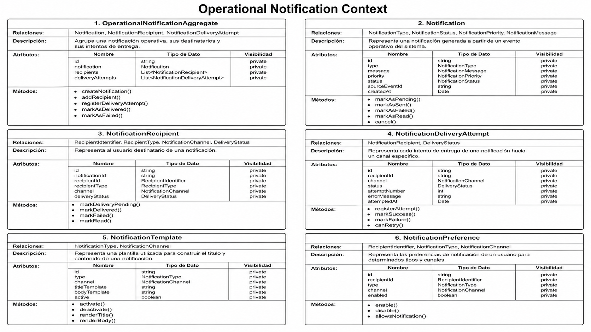

*Nota.* Elaboración propia (2026) usando LucidChart.

A continuación, se presenta el diccionario de clases identificado para el bounded context **Operational Notification Context**.

| Clase | Tipo | Propósito | Relaciones principales |
|---|---|---|---|
| `OperationalNotificationAggregate` | Aggregate | Agrupa una notificación operativa, sus destinatarios, preferencias aplicables y sus intentos de entrega. | Contiene `Notification`, `NotificationRecipient` y `NotificationDeliveryAttempt`. |
| `Notification` | Entity | Representa una notificación generada a partir de un evento operativo del sistema. | Usa `NotificationType`, `NotificationStatus`, `NotificationPriority` y `NotificationMessage`. |
| `NotificationRecipient` | Entity | Representa al usuario destinatario de una notificación. | Usa `RecipientType`, `NotificationChannel` y `DeliveryStatus`. |
| `NotificationDeliveryAttempt` | Entity | Representa cada intento de entrega de una notificación hacia un canal específico. | Se relaciona con `NotificationRecipient`. |
| `NotificationTemplate` | Entity | Representa una plantilla utilizada para construir el título y contenido de una notificación. | Usa `NotificationType` y `NotificationChannel`. |
| `NotificationPreference` | Entity | Representa las preferencias de notificación de un usuario para determinados tipos y canales. | Usa `NotificationType`, `NotificationChannel` y `RecipientType`. |
| `NotificationMessage` | Value Object | Encapsula el título y cuerpo de una notificación, validando que el contenido sea presentable. | Es usado por `Notification`. |
| `RecipientIdentifier` | Value Object | Encapsula el identificador del usuario destinatario sin acoplarse al modelo de Identity & Access Management. | Es usado por `NotificationRecipient` y `NotificationPreference`. |
| `NotificationType` | Enumeration | Define el tipo de evento operacional que originó la notificación. | Es usado por `Notification`, `NotificationTemplate` y `NotificationPreference`. |
| `NotificationStatus` | Enumeration | Define el estado general de una notificación dentro del contexto. | Es usado por `Notification`. |
| `NotificationChannel` | Enumeration | Define el canal por el cual se enviará una notificación. | Es usado por `NotificationRecipient`, `NotificationTemplate` y `NotificationPreference`. |
| `NotificationPriority` | Enumeration | Define la prioridad de una notificación operativa. | Es usado por `Notification`. |
| `RecipientType` | Enumeration | Define si el destinatario pertenece al segmento Driver o Parking Owner. | Es usado por `NotificationRecipient` y `NotificationPreference`. |
| `DeliveryStatus` | Enumeration | Define el estado de entrega para un destinatario específico. | Es usado por `NotificationRecipient` y `NotificationDeliveryAttempt`. |
| `NotificationFactory` | Factory | Crea notificaciones operativas a partir de eventos de dominio recibidos desde otros contextos. | Crea `OperationalNotificationAggregate` y `Notification`. |
| `NotificationRecipientFactory` | Factory | Crea destinatarios de notificaciones según el tipo de evento y el segmento objetivo. | Crea `NotificationRecipient`. |
| `NotificationRoutingPolicy` | Domain Service | Determina qué usuarios deben recibir una notificación según el evento operacional. | Usa `NotificationType`, `RecipientType` y `NotificationRecipient`. |
| `NotificationEligibilityPolicy` | Domain Service | Determina si una notificación puede enviarse según preferencias del usuario y tipo de evento. | Usa `NotificationPreference`. |
| `NotificationRetryPolicy` | Domain Service | Define si un intento de entrega fallido debe reintentarse. | Usa `NotificationDeliveryAttempt` y `DeliveryStatus`. |
| `INotificationRepository` | Repository Interface | Define operaciones de persistencia para notificaciones. | Es implementada en Infrastructure Layer. |
| `INotificationRecipientRepository` | Repository Interface | Define operaciones de persistencia para destinatarios de notificaciones. | Es implementada en Infrastructure Layer. |
| `INotificationTemplateRepository` | Repository Interface | Define operaciones de persistencia para plantillas de notificación. | Es implementada en Infrastructure Layer. |
| `INotificationPreferenceRepository` | Repository Interface | Define operaciones de persistencia para preferencias de notificación. | Es implementada en Infrastructure Layer. |
| `INotificationDeliveryAttemptRepository` | Repository Interface | Define operaciones de persistencia para intentos de entrega. | Es implementada en Infrastructure Layer. |

#### 4.2.5.1. Domain Layer

La **Domain Layer** del **Operational Notification Context** contiene las clases que representan las reglas centrales de generación, clasificación, elegibilidad y entrega de notificaciones operativas. Esta capa no depende de frameworks, controladores, bases de datos ni servicios externos. Su responsabilidad es modelar cuándo una notificación debe crearse, quién debe recibirla, qué prioridad tiene, por qué canal puede entregarse y cómo debe gestionarse un intento de entrega fallido.

Este contexto recibe eventos relevantes desde otros bounded contexts, pero no modifica las reglas de dichos contextos. Por ejemplo, una reserva confirmada pertenece al **Reservation Context**, una desconexión de dispositivo pertenece al **IoT Monitoring Context**, y la configuración de espacios pertenece al **Parking Management Context**. El **Operational Notification Context** solo transforma esos eventos en mensajes operativos para los usuarios afectados.

**Figura 81**  
*Operational Notification Context Domain Layer*

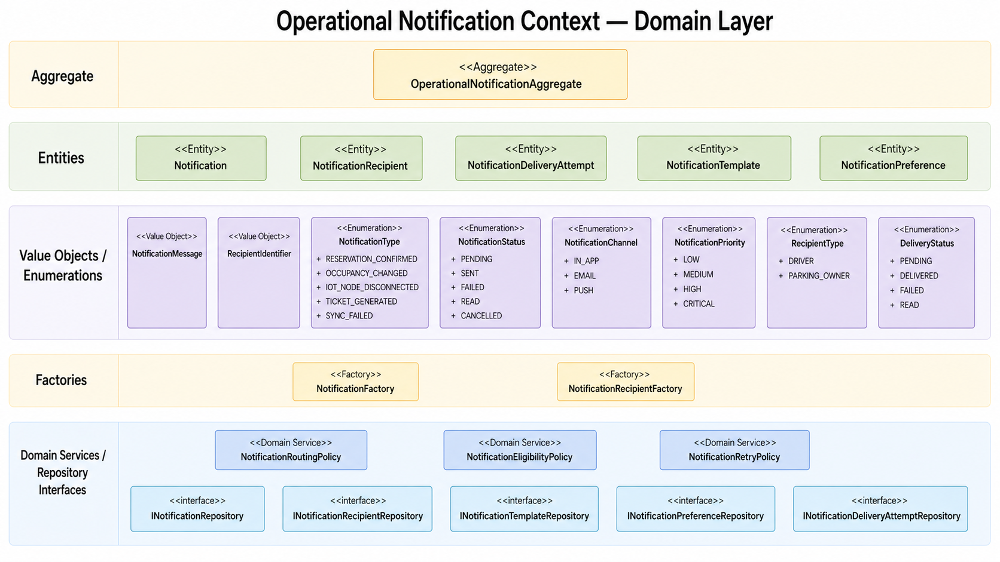

*Nota.* Elaboración propia (2026) usando LucidChart / PlantUML.

El aggregate principal es `OperationalNotificationAggregate`, encargado de mantener la consistencia entre una notificación, sus destinatarios y sus intentos de entrega. Este aggregate permite que la creación de una notificación, su asignación a destinatarios y el registro de intentos de envío se manejen bajo reglas coherentes del dominio.

La entidad `Notification` representa la notificación operativa generada por el sistema. Contiene información como el tipo de notificación, el mensaje, la prioridad, el estado general y la referencia al evento de origen. Su comportamiento permite marcar una notificación como pendiente, enviada, fallida, leída o cancelada.

La entidad `NotificationRecipient` representa al destinatario de una notificación. Esta entidad define qué usuario recibirá el mensaje, qué tipo de usuario es, qué canal se utilizará y cuál es el estado de entrega para ese destinatario específico. Esto permite que una misma notificación pueda tener múltiples destinatarios y distintos resultados de entrega.

La entidad `NotificationDeliveryAttempt` representa un intento concreto de entrega. Su propósito es mantener trazabilidad sobre los envíos realizados, los errores producidos, la cantidad de reintentos y el canal utilizado. Esta clase es importante porque las notificaciones pueden fallar por causas externas, como errores del proveedor de correo o pérdida temporal de conexión.

La entidad `NotificationTemplate` representa una plantilla de contenido para construir mensajes consistentes según el tipo de evento. Por ejemplo, una notificación de reserva confirmada no tiene el mismo contenido que una alerta por desconexión de nodo IoT.

La entidad `NotificationPreference` representa las preferencias del usuario respecto a tipos de notificación y canales permitidos. Esta clase permite modelar si un usuario puede recibir cierto tipo de alerta por determinado canal.

El value object `NotificationMessage` encapsula el título y cuerpo de una notificación, validando que el mensaje no esté vacío y que cumpla con una longitud razonable. El value object `RecipientIdentifier` encapsula el identificador del usuario destinatario, evitando que el dominio de notificaciones dependa directamente del modelo interno de Identity & Access Management.

Las enumeraciones `NotificationType`, `NotificationStatus`, `NotificationChannel`, `NotificationPriority`, `RecipientType` y `DeliveryStatus` restringen los valores permitidos dentro del contexto. Esto evita inconsistencias en los estados y mejora la claridad del lenguaje ubicuo.

La fábrica `NotificationFactory` centraliza la creación de notificaciones operativas a partir de eventos de dominio. La fábrica `NotificationRecipientFactory` permite construir destinatarios según el tipo de evento y el segmento afectado.

Los servicios de dominio `NotificationRoutingPolicy`, `NotificationEligibilityPolicy` y `NotificationRetryPolicy` encapsulan reglas que no pertenecen a una sola entidad. Estas reglas permiten decidir a quién notificar, si corresponde enviar la notificación según preferencias y si un intento fallido debe reintentarse.

Finalmente, las interfaces `INotificationRepository`, `INotificationRecipientRepository`, `INotificationTemplateRepository`, `INotificationPreferenceRepository` e `INotificationDeliveryAttemptRepository` definen los contratos de persistencia requeridos por el dominio. Sus implementaciones concretas se ubican en la **Infrastructure Layer**.

#### 4.2.5.2. Interface Layer

La **Interface Layer** del **Operational Notification Context** representa la puerta de entrada para solicitudes HTTP y eventos provenientes de otros bounded contexts. En esta capa se ubican los controladores REST y consumidores de eventos encargados de recibir comandos de consulta, actualización de preferencias y eventos operativos que pueden originar notificaciones.

Esta capa se implementa dentro del **Core REST API**, desarrollado con **Java y Spring Boot**. Su responsabilidad es recibir solicitudes o eventos, validar superficialmente la estructura de entrada y delegar el procesamiento hacia la **Application Layer**. No contiene reglas de negocio ni detalles de persistencia.

**Figura 82**  
*Operational Notification Context Interface Layer*

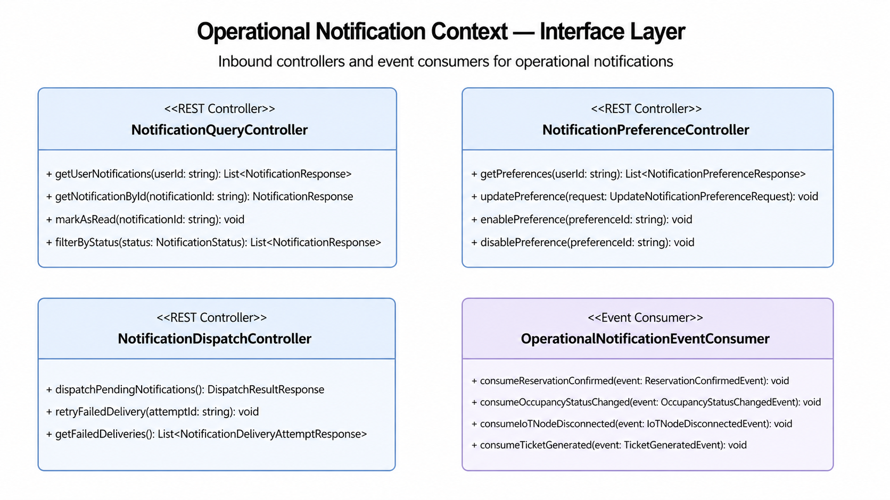

*Nota.* Elaboración propia (2026) usando LucidChart.

Las clases consideradas para esta capa son las siguientes:

| Clase | Tipo | Propósito |
|---|---|---|
| `NotificationQueryController` | REST Controller | Permite consultar notificaciones del usuario, filtrar por estado y marcar notificaciones como leídas. |
| `NotificationPreferenceController` | REST Controller | Permite consultar y actualizar preferencias de notificación del usuario. |
| `NotificationDispatchController` | REST Controller | Permite ejecutar operaciones administrativas de reintento o despacho de notificaciones pendientes. |
| `OperationalNotificationEventConsumer` | Event Consumer | Consume eventos de dominio provenientes de otros bounded contexts para generar notificaciones operativas. |

La clase `NotificationQueryController` expone endpoints para que el **Driver** o el **Parking Owner** puedan consultar sus notificaciones. También permite marcar notificaciones como leídas o filtrar por estado.

La clase `NotificationPreferenceController` expone endpoints para actualizar preferencias de notificación. Estas preferencias permiten definir qué tipos de notificación pueden enviarse y por qué canales.

La clase `NotificationDispatchController` permite ejecutar acciones internas relacionadas con el reintento de notificaciones fallidas o pendientes. Su uso está orientado a operaciones del sistema y no reemplaza la lógica de negocio del dominio.

La clase `OperationalNotificationEventConsumer` recibe eventos relevantes de otros contextos, como `ReservationConfirmedEvent`, `OccupancyStatusChangedEvent`, `IoTNodeDisconnectedEvent` o `TicketGeneratedEvent`. Su responsabilidad es traducir el evento recibido en un comando de aplicación para que el contexto determine si corresponde generar una notificación.

#### 4.2.5.3. Application Layer

La **Application Layer** del **Operational Notification Context** contiene los command handlers y event handlers que orquestan los casos de uso relacionados con la generación, consulta, lectura, despacho y reintento de notificaciones operativas.

Esta capa recibe datos desde controladores o consumidores de eventos, invoca reglas del dominio, utiliza interfaces de repositorio y coordina la entrega de notificaciones mediante servicios de infraestructura. Debe mantenerse como una capa delgada: no contiene reglas puras de negocio ni detalles tecnológicos de envío.

**Figura 83**  
*Operational Notification Context Application Layer*

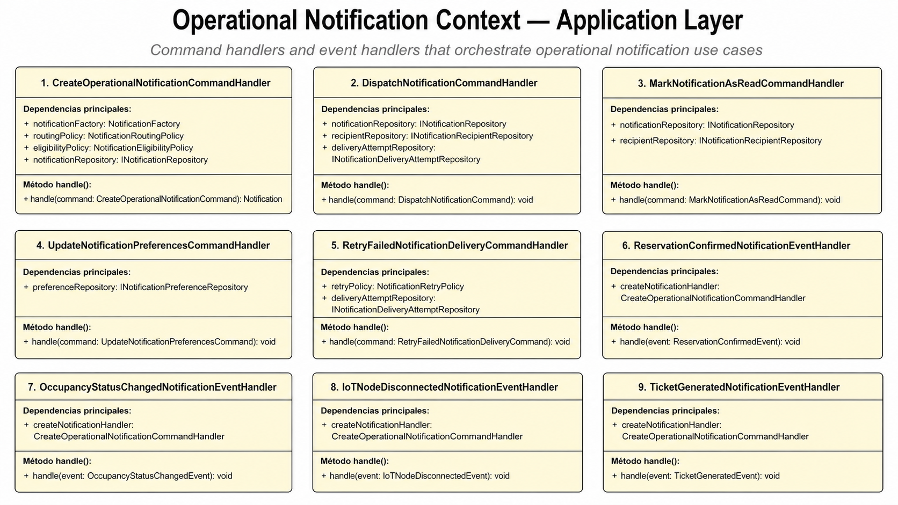

*Nota.* Elaboración propia (2026) usando LucidChart.

Las clases consideradas para esta capa son las siguientes:

| Clase | Tipo | Propósito |
|---|---|---|
| `CreateOperationalNotificationCommandHandler` | Command Handler | Orquesta la creación de una notificación operativa a partir de un evento recibido. |
| `DispatchNotificationCommandHandler` | Command Handler | Orquesta el envío de una notificación pendiente hacia sus destinatarios. |
| `MarkNotificationAsReadCommandHandler` | Command Handler | Orquesta el cambio de estado de una notificación a leída. |
| `UpdateNotificationPreferencesCommandHandler` | Command Handler | Orquesta la actualización de preferencias de notificación del usuario. |
| `RetryFailedNotificationDeliveryCommandHandler` | Command Handler | Orquesta el reintento de notificaciones fallidas según la política del dominio. |
| `ReservationConfirmedNotificationEventHandler` | Event Handler | Reacciona ante una reserva confirmada y solicita la creación de una notificación. |
| `OccupancyStatusChangedNotificationEventHandler` | Event Handler | Reacciona ante un cambio de ocupación y solicita una notificación operativa. |
| `IoTNodeDisconnectedNotificationEventHandler` | Event Handler | Reacciona ante la desconexión de un nodo IoT y genera una alerta para el Parking Owner. |
| `TicketGeneratedNotificationEventHandler` | Event Handler | Reacciona ante la generación de un ticket virtual y notifica al Driver. |

El `CreateOperationalNotificationCommandHandler` inicia el flujo de creación. Recibe el evento operacional, utiliza `NotificationFactory` para construir la notificación, aplica `NotificationRoutingPolicy` para determinar destinatarios y valida la elegibilidad mediante `NotificationEligibilityPolicy`.

El `DispatchNotificationCommandHandler` coordina el envío de notificaciones pendientes. Obtiene la notificación desde `INotificationRepository`, consulta destinatarios mediante `INotificationRecipientRepository` y delega el envío a adaptadores de infraestructura.

El `MarkNotificationAsReadCommandHandler` permite actualizar el estado de una notificación cuando el usuario la visualiza. Esta operación no elimina la notificación, sino que preserva trazabilidad histórica.

El `UpdateNotificationPreferencesCommandHandler` coordina la actualización de preferencias del usuario. Esta operación permite activar o desactivar determinados tipos de notificación o canales.

El `RetryFailedNotificationDeliveryCommandHandler` utiliza `NotificationRetryPolicy` para determinar si un intento fallido debe reintentarse. Si el reintento es válido, solicita nuevamente el envío mediante la infraestructura correspondiente.

Los event handlers del contexto transforman eventos provenientes de otros bounded contexts en comandos internos. Por ejemplo, `ReservationConfirmedNotificationEventHandler` recibe un evento de reserva confirmada y solicita la creación de una notificación para el Driver. `IoTNodeDisconnectedNotificationEventHandler` recibe una alerta de desconexión desde IoT Monitoring y solicita una notificación para el Parking Owner.

#### 4.2.5.4. Infrastructure Layer

La **Infrastructure Layer** del **Operational Notification Context** contiene las clases que conectan el contexto con tecnologías concretas, como la base de datos PostgreSQL, servicios externos de notificación, clientes HTTP, motores de plantillas y proveedores de tiempo del sistema.

En esta capa se implementan los repositorios definidos en el **Domain Layer** mediante **Java, Spring Data JPA y PostgreSQL**. Además, se ubican los adaptadores encargados de enviar notificaciones por canales externos, como correo electrónico o notificaciones push.

**Figura 84**  
*Operational Notification Context Infrastructure Layer*

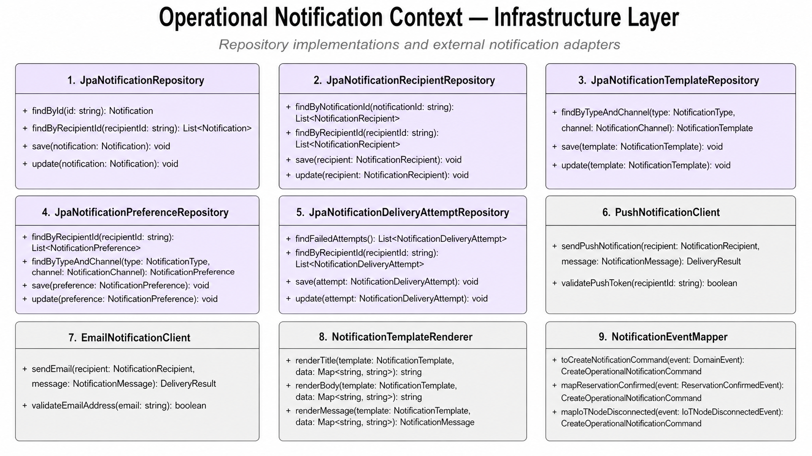

*Nota.* Elaboración propia (2026) usando LucidChart.

Las clases consideradas para esta capa son las siguientes:

| Clase | Tipo | Propósito |
|---|---|---|
| `JpaNotificationRepository` | Repository Implementation | Implementa `INotificationRepository` usando Spring Data JPA y PostgreSQL. |
| `JpaNotificationRecipientRepository` | Repository Implementation | Implementa `INotificationRecipientRepository` para persistir destinatarios. |
| `JpaNotificationTemplateRepository` | Repository Implementation | Implementa `INotificationTemplateRepository` para persistir plantillas. |
| `JpaNotificationPreferenceRepository` | Repository Implementation | Implementa `INotificationPreferenceRepository` para persistir preferencias. |
| `JpaNotificationDeliveryAttemptRepository` | Repository Implementation | Implementa `INotificationDeliveryAttemptRepository` para persistir intentos de entrega. |
| `PushNotificationClient` | External Service Client | Envía notificaciones push mediante un proveedor externo. |
| `EmailNotificationClient` | External Service Client | Envía notificaciones por correo electrónico mediante un proveedor externo. |
| `NotificationTemplateRenderer` | Infrastructure Service | Renderiza plantillas de notificación usando datos del evento recibido. |
| `NotificationEventMapper` | Mapper | Convierte eventos externos en comandos del contexto de notificaciones. |
| `NotificationClockProvider` | Infrastructure Service | Proporciona timestamps consistentes para creación, envío y lectura de notificaciones. |

La clase `JpaNotificationRepository` permite almacenar y recuperar notificaciones operativas. Su implementación usa Spring Data JPA sobre PostgreSQL, evitando que el dominio dependa directamente de consultas SQL o detalles de persistencia.

La clase `JpaNotificationRecipientRepository` persiste los destinatarios asociados a cada notificación. Esto permite que una notificación tenga múltiples usuarios destinatarios y distintos estados de entrega.

La clase `JpaNotificationTemplateRepository` administra las plantillas utilizadas para construir mensajes según el tipo de evento y canal de comunicación.

La clase `JpaNotificationPreferenceRepository` persiste las preferencias de notificación de los usuarios. Estas preferencias se consultan antes de despachar una notificación.

La clase `JpaNotificationDeliveryAttemptRepository` registra cada intento de entrega, permitiendo trazabilidad sobre errores, reintentos y confirmaciones.

La clase `PushNotificationClient` encapsula la integración con un proveedor externo de notificaciones push. Esta clase no contiene reglas de negocio; solo ejecuta el envío técnico.

La clase `EmailNotificationClient` encapsula la integración con un proveedor externo de correo electrónico. Su función es enviar mensajes construidos previamente por la capa de aplicación e infraestructura.

La clase `NotificationTemplateRenderer` construye el contenido final de la notificación a partir de una plantilla y los datos del evento. Esto evita duplicar textos en los handlers de aplicación.

La clase `NotificationEventMapper` transforma eventos externos en comandos internos del bounded context, protegiendo el modelo de notificaciones de cambios en otros contextos.

#### 4.2.5.5. Bounded Context Software Architecture Component Level Diagrams

El **Bounded Context Software Architecture Component Level Diagram** del **Operational Notification Context** muestra la descomposición interna del módulo de notificaciones dentro del contenedor **Core REST API**. Este diagrama corresponde al nivel 3 del modelo C4 y permite visualizar cómo se organizan los controladores, consumidores de eventos, handlers de aplicación, componentes de dominio, repositorios e integraciones externas.

Este contexto se implementa dentro del **Core REST API**, desarrollado con **Java y Spring Boot**, debido a que las notificaciones operativas dependen de eventos generados por procesos centrales del sistema, como reservas, tickets, monitoreo IoT y gestión de estacionamientos.

**Figura 85**  
*Operational Notification Context Component Level Diagram*

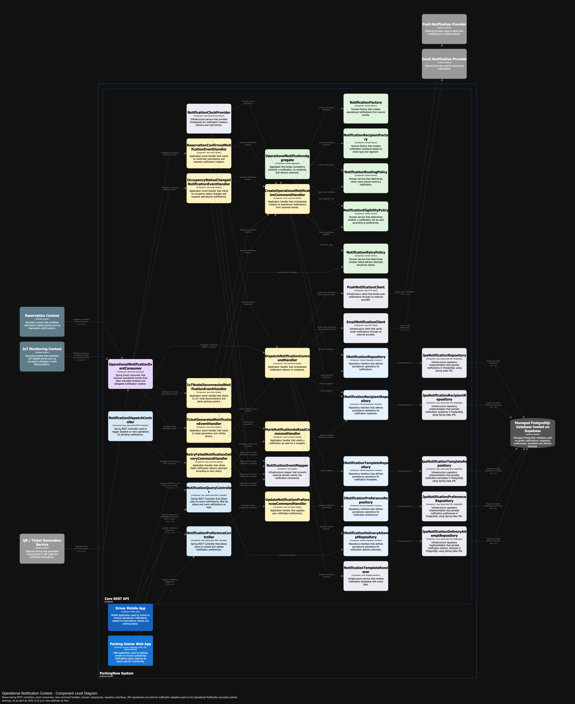

*Nota.* Elaboración propia (2026) usando Structurizr DSL.

Según la Figura 85, el flujo principal inicia cuando `OperationalNotificationEventConsumer` recibe un evento proveniente de otro bounded context. Luego, el consumer delega la operación al event handler correspondiente. El event handler transforma el evento en un comando interno y solicita la creación de una notificación mediante `CreateOperationalNotificationCommandHandler`.

El command handler utiliza `NotificationFactory` para crear la notificación y aplica `NotificationRoutingPolicy` para determinar los destinatarios correspondientes. Luego consulta `NotificationEligibilityPolicy` para verificar si el usuario puede recibir la notificación por el canal configurado. Finalmente, la notificación se persiste mediante `INotificationRepository`.

Cuando una notificación debe entregarse, `DispatchNotificationCommandHandler` obtiene los destinatarios y utiliza los adaptadores de infraestructura `PushNotificationClient` o `EmailNotificationClient`, según el canal definido. Cada intento de entrega queda registrado mediante `INotificationDeliveryAttemptRepository`.

La siguiente tabla resume los componentes principales del diagrama:

| Capa | Componente | Tecnología | Responsabilidad |
|---|---|---|---|
| Interface Layer | `NotificationQueryController` | Java / Spring Boot REST Controller | Permite consultar y marcar notificaciones como leídas. |
| Interface Layer | `NotificationPreferenceController` | Java / Spring Boot REST Controller | Permite gestionar preferencias de notificación. |
| Interface Layer | `NotificationDispatchController` | Java / Spring Boot REST Controller | Permite disparar reintentos o despacho de notificaciones pendientes. |
| Interface Layer | `OperationalNotificationEventConsumer` | Java Event Consumer | Consume eventos de otros bounded contexts. |
| Application Layer | `CreateOperationalNotificationCommandHandler` | Java Command Handler | Orquesta la creación de notificaciones operativas. |
| Application Layer | `DispatchNotificationCommandHandler` | Java Command Handler | Orquesta el envío de notificaciones pendientes. |
| Application Layer | `MarkNotificationAsReadCommandHandler` | Java Command Handler | Orquesta el cambio de estado a leída. |
| Application Layer | `UpdateNotificationPreferencesCommandHandler` | Java Command Handler | Orquesta la actualización de preferencias. |
| Application Layer | `RetryFailedNotificationDeliveryCommandHandler` | Java Command Handler | Orquesta reintentos de envío fallidos. |
| Domain Layer | `OperationalNotificationAggregate` | Domain Model | Mantiene consistencia entre notificación, destinatarios e intentos. |
| Domain Layer | `NotificationFactory` | Domain Factory | Crea notificaciones operativas. |
| Domain Layer | `NotificationRoutingPolicy` | Domain Service | Determina destinatarios de una notificación. |
| Domain Layer | `NotificationEligibilityPolicy` | Domain Service | Evalúa si una notificación puede enviarse. |
| Domain Layer | `NotificationRetryPolicy` | Domain Service | Define reglas para reintentos. |
| Infrastructure Layer | `JpaNotificationRepository` | Spring Data JPA / PostgreSQL | Persiste notificaciones. |
| Infrastructure Layer | `JpaNotificationRecipientRepository` | Spring Data JPA / PostgreSQL | Persiste destinatarios. |
| Infrastructure Layer | `JpaNotificationDeliveryAttemptRepository` | Spring Data JPA / PostgreSQL | Persiste intentos de entrega. |
| Infrastructure Layer | `PushNotificationClient` | External Client | Envía notificaciones push. |
| Infrastructure Layer | `EmailNotificationClient` | External Client | Envía notificaciones por correo. |

#### 4.2.5.6. Bounded Context Software Architecture Code Level Diagrams

En esta sección se presentan los diagramas de nivel de código correspondientes al bounded context **Operational Notification**. A diferencia del Component Level Diagram, que muestra bloques estructurales de alto nivel, este bloque profundiza en el diseño de clases del dominio y en la estructura física de persistencia utilizada por este contexto.

Primero se presenta el **Domain Layer Class Diagram**, donde se detallan las entidades, objetos de valor, agregados, servicios de dominio, fábricas, enumeraciones e interfaces de repositorio del contexto. Luego se presenta el **Database Design Diagram**, donde se especifican las tablas, columnas, llaves primarias, llaves foráneas y relaciones utilizadas para persistir notificaciones, destinatarios, plantillas, preferencias e intentos de entrega.

Estos diagramas permiten cerrar el diseño táctico del bounded context **Operational Notification**, asegurando trazabilidad entre eventos operativos, reglas de notificación, destinatarios, canales de entrega y persistencia relacional.

###### 4.2.5.6.1. Bounded Context Domain Layer Class Diagrams

El **Bounded Context Domain Layer Class Diagram** presenta el diseño UML de las clases que forman parte de la capa de dominio del bounded context **Operational Notification**. Este diagrama se enfoca exclusivamente en los elementos que representan reglas de negocio puras relacionadas con notificaciones operativas, sin incluir controladores, frameworks, clientes externos, bases de datos ni detalles de infraestructura.

**Figura 86**  
*Operational Notification Context Domain Layer Class Diagram*

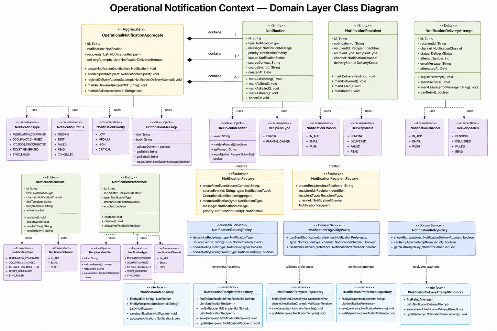

*Nota.* Elaboración propia (2026) usando LucidChart / PlantUML.

Según la Figura 86, el aggregate `OperationalNotificationAggregate` actúa como raíz de consistencia del contexto. Este aggregate contiene una notificación, sus destinatarios y sus intentos de entrega. Esta estructura permite controlar que la notificación tenga contenido válido, destinatarios definidos y trazabilidad de envío.

La entidad `Notification` representa el mensaje operativo generado a partir de un evento del sistema. Esta entidad utiliza `NotificationType`, `NotificationStatus`, `NotificationPriority` y `NotificationMessage` para representar el tipo de alerta, su estado, su criticidad y su contenido.

La entidad `NotificationRecipient` representa a cada destinatario de una notificación. Esta clase permite diferenciar si el usuario corresponde al segmento Driver o Parking Owner, además de definir el canal de entrega y el estado de envío.

La entidad `NotificationDeliveryAttempt` registra cada intento de entrega. Esto permite conocer si un envío fue exitoso, falló o debe reintentarse posteriormente.

La entidad `NotificationTemplate` permite reutilizar contenido para distintos tipos de notificaciones y canales. Esto evita que los textos se generen manualmente en cada caso de uso.

La entidad `NotificationPreference` permite modelar las preferencias del usuario respecto a los tipos de notificación y canales permitidos. Esto permite respetar configuraciones del usuario sin mezclar dicha lógica con controladores o infraestructura.

Los value objects `NotificationMessage` y `RecipientIdentifier` encapsulan conceptos importantes del dominio. `NotificationMessage` valida que el título y cuerpo sean consistentes, mientras que `RecipientIdentifier` representa al usuario destinatario sin acoplar este contexto al modelo interno de identidad.

Los servicios de dominio `NotificationRoutingPolicy`, `NotificationEligibilityPolicy` y `NotificationRetryPolicy` concentran reglas que no pertenecen a una sola entidad. Estas reglas permiten determinar destinatarios, verificar si una notificación puede enviarse y definir si un intento fallido debe reintentarse.

Las interfaces de repositorio definen los contratos de persistencia requeridos por el dominio. Sus implementaciones concretas se ubican en la **Infrastructure Layer**, manteniendo separado el modelo de negocio de los detalles técnicos.

###### 4.2.5.6.2. Bounded Context Database Design Diagram

El **Bounded Context Database Design Diagram** presenta el diseño físico de base de datos correspondiente al bounded context **Operational Notification**. Este diagrama muestra cómo se almacenan las notificaciones operativas, destinatarios, preferencias, plantillas e intentos de entrega en una base de datos relacional PostgreSQL.

Para este contexto se utiliza persistencia relacional porque las notificaciones requieren trazabilidad, consulta por usuario, actualización de estado, auditoría de intentos de entrega y relaciones claras entre notificaciones, destinatarios y canales.

**Figura 87**  
*Operational Notification Context Database Design Diagram*

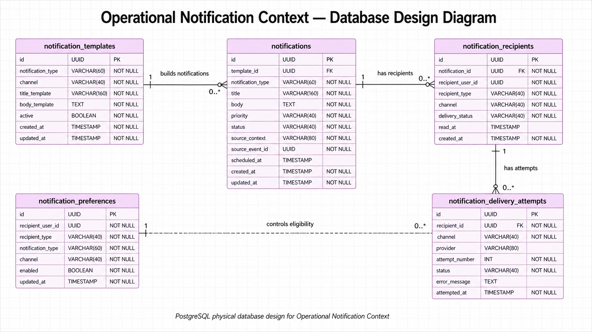

*Nota.* Elaboración propia (2026) usando LucidChart / Vertabelo.

Las tablas consideradas para este bounded context son las siguientes:

| Tabla | Propósito |
|---|---|
| `notifications` | Almacena las notificaciones operativas generadas por eventos del sistema. |
| `notification_recipients` | Almacena los destinatarios asociados a cada notificación. |
| `notification_delivery_attempts` | Registra los intentos de entrega realizados por canal. |
| `notification_templates` | Almacena plantillas reutilizables de notificación. |
| `notification_preferences` | Almacena preferencias de notificación por usuario, canal y tipo. |

La tabla `notifications` representa la notificación operativa principal. Contiene información como el tipo de notificación, título, mensaje, prioridad, estado, contexto de origen, identificador del evento de origen y fechas de creación o programación.

La tabla `notification_recipients` representa los usuarios destinatarios de cada notificación. Esta tabla se relaciona con `notifications` mediante `notification_id` y permite gestionar el estado de entrega y lectura por cada destinatario.

La tabla `notification_delivery_attempts` registra cada intento de envío realizado hacia un destinatario. Esta tabla permite almacenar el canal usado, proveedor, número de intento, estado, mensaje de error y fecha del intento.

La tabla `notification_templates` almacena plantillas reutilizables para construir mensajes consistentes. Cada plantilla se relaciona con un tipo de notificación y un canal específico.

La tabla `notification_preferences` almacena preferencias del usuario respecto a tipos de notificación y canales. La columna `recipient_user_id` se considera una referencia externa al usuario del **Identity & Access Management Context**, por lo que la tabla de usuarios no se dibuja dentro de este diagrama.

| Relación | Cardinalidad | Descripción |
|---|---|---|
| `notifications` → `notification_recipients` | 1 a 0..* | Una notificación puede estar dirigida a múltiples destinatarios. |
| `notification_recipients` → `notification_delivery_attempts` | 1 a 0..* | Un destinatario puede tener múltiples intentos de entrega. |
| `notification_templates` → `notifications` | 1 a 0..* | Una plantilla puede utilizarse para construir múltiples notificaciones. |
| `notification_preferences` → `notification_recipients` | Relación lógica | Las preferencias determinan si un destinatario puede recibir una notificación por cierto canal. |

El diseño utiliza identificadores de tipo `UUID` para mantener unicidad. Los estados y tipos se almacenan como `VARCHAR`, alineados con las enumeraciones definidas en el Domain Layer. Las relaciones internas se implementan mediante llaves foráneas para asegurar integridad entre notificaciones, destinatarios e intentos de entrega.

La persistencia se define sobre **PostgreSQL** y es accedida desde el **Core REST API** mediante **Spring Data JPA** o **JDBC**. La lógica de generación y despacho de notificaciones no se implementa en la base de datos, sino en el bounded context **Operational Notification**, manteniendo la separación entre reglas de negocio e infraestructura.

### 4.2.6. Bounded Context: Identity & Access Management Context

El bounded context **Identity & Access Management Context** concentra las capacidades relacionadas con el registro, autenticación, autorización y gestión de acceso de los usuarios de ParkingNow. Este contexto permite identificar a los usuarios del sistema, validar credenciales, asignar roles, controlar sesiones y proteger el acceso a las funcionalidades disponibles para los dos segmentos principales: **Driver** y **Parking Owner**.

A diferencia de los contextos orientados a estacionamientos, reservas, monitoreo IoT o notificaciones, este bounded context no gestiona operaciones del negocio principal, sino que proporciona una base transversal de seguridad e identidad para el resto del sistema. Su responsabilidad es asegurar que cada usuario acceda únicamente a las funciones que corresponden a su rol dentro de ParkingNow.

Desde la perspectiva técnica, este contexto se implementa dentro del **Core REST API**, desarrollado con **Java y Spring Boot**. Para la autenticación y autorización se considera el uso de **Spring Security**, generación de tokens **JWT**, persistencia en **PostgreSQL** mediante **Spring Data JPA** y documentación de endpoints mediante **OpenAPI/Swagger**.

**Figura 88**  
*Identity & Access Management Context Class Dictionary*

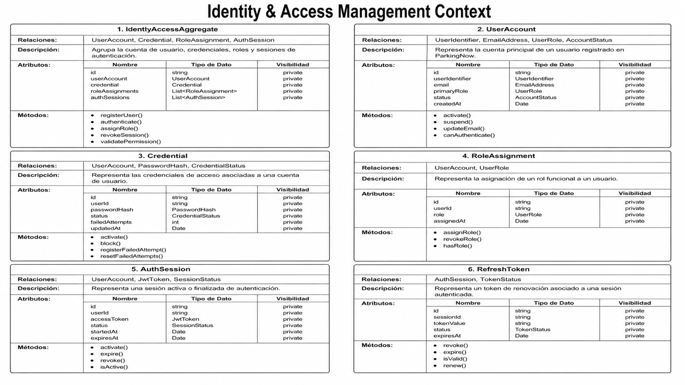

*Nota.* Elaboración propia (2026) usando LucidChart.

A continuación, se presenta el diccionario de clases identificado para el bounded context **Identity & Access Management Context**.

| Clase | Tipo | Propósito | Relaciones principales |
|---|---|---|---|
| `IdentityAccessAggregate` | Aggregate | Agrupa la cuenta de usuario, credenciales, roles y sesiones de autenticación. | Contiene `UserAccount`, `Credential`, `RoleAssignment` y `AuthSession`. |
| `UserAccount` | Entity | Representa la cuenta principal de un usuario registrado en ParkingNow. | Usa `UserIdentifier`, `EmailAddress`, `UserRole` y `AccountStatus`. |
| `Credential` | Entity | Representa las credenciales de acceso asociadas a una cuenta de usuario. | Usa `PasswordHash` y `CredentialStatus`. |
| `RoleAssignment` | Entity | Representa la asignación de un rol funcional a un usuario. | Usa `UserRole`. |
| `AuthSession` | Entity | Representa una sesión activa o finalizada de autenticación. | Usa `SessionStatus` y se relaciona con `UserAccount`. |
| `RefreshToken` | Entity | Representa un token de renovación asociado a una sesión autenticada. | Usa `TokenStatus` y se relaciona con `AuthSession`. |
| `UserIdentifier` | Value Object | Encapsula el identificador único del usuario dentro del sistema. | Es usado por `UserAccount`, `Credential`, `RoleAssignment` y `AuthSession`. |
| `EmailAddress` | Value Object | Encapsula y valida el correo electrónico del usuario. | Es usado por `UserAccount`. |
| `PasswordHash` | Value Object | Representa la contraseña procesada mediante un algoritmo de hash seguro. | Es usado por `Credential`. |
| `JwtToken` | Value Object | Representa el token de acceso generado luego de una autenticación válida. | Es usado por `AuthSession`. |
| `UserRole` | Enumeration | Define los roles funcionales permitidos dentro del sistema. | Es usado por `UserAccount` y `RoleAssignment`. |
| `AccountStatus` | Enumeration | Define el estado de una cuenta de usuario. | Es usado por `UserAccount`. |
| `CredentialStatus` | Enumeration | Define el estado de las credenciales de acceso. | Es usado por `Credential`. |
| `SessionStatus` | Enumeration | Define el estado de una sesión de autenticación. | Es usado por `AuthSession`. |
| `TokenStatus` | Enumeration | Define el estado de un token de renovación. | Es usado por `RefreshToken`. |
| `UserAccountFactory` | Factory | Crea cuentas de usuario válidas según el segmento seleccionado. | Crea `IdentityAccessAggregate` y `UserAccount`. |
| `CredentialFactory` | Factory | Crea credenciales válidas a partir de una contraseña procesada. | Crea `Credential` y `PasswordHash`. |
| `PasswordPolicy` | Domain Service | Valida reglas de seguridad de contraseña. | Usa `PasswordHash` y datos de entrada del registro. |
| `AuthenticationPolicy` | Domain Service | Determina si una cuenta puede autenticarse. | Usa `UserAccount`, `Credential` y `AccountStatus`. |
| `AuthorizationPolicy` | Domain Service | Determina si un usuario tiene permiso para ejecutar una acción. | Usa `UserRole` y `RoleAssignment`. |
| `TokenLifecyclePolicy` | Domain Service | Define reglas de expiración, renovación y revocación de tokens. | Usa `AuthSession`, `RefreshToken` y `TokenStatus`. |
| `IUserAccountRepository` | Repository Interface | Define operaciones de persistencia para cuentas de usuario. | Es implementada en Infrastructure Layer. |
| `ICredentialRepository` | Repository Interface | Define operaciones de persistencia para credenciales. | Es implementada en Infrastructure Layer. |
| `IRoleAssignmentRepository` | Repository Interface | Define operaciones de persistencia para asignaciones de rol. | Es implementada en Infrastructure Layer. |
| `IAuthSessionRepository` | Repository Interface | Define operaciones de persistencia para sesiones de autenticación. | Es implementada en Infrastructure Layer. |
| `IRefreshTokenRepository` | Repository Interface | Define operaciones de persistencia para tokens de renovación. | Es implementada en Infrastructure Layer. |

#### 4.2.6.1. Domain Layer

La **Domain Layer** del **Identity & Access Management Context** contiene las clases que representan las reglas centrales de identidad, autenticación y autorización de ParkingNow. Esta capa define cómo se crea una cuenta, cómo se valida su estado, cómo se asocian roles funcionales y qué condiciones deben cumplirse para autenticar o autorizar a un usuario.

Esta capa no depende de controladores, frameworks, bases de datos ni proveedores externos. Su responsabilidad es modelar las reglas de seguridad desde el dominio, manteniendo independencia frente a detalles tecnológicos como Spring Security, JWT, PostgreSQL o endpoints REST.

**Figura 89**  
*Identity & Access Management Context Domain Layer*

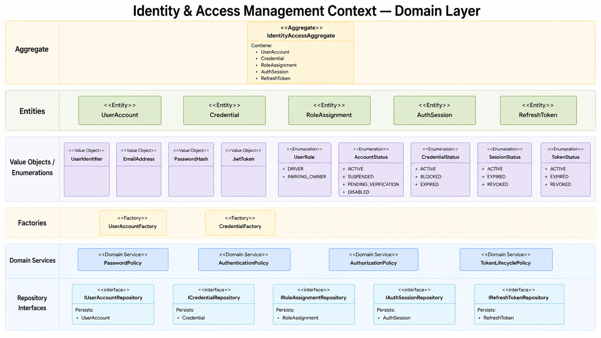

*Nota.* Elaboración propia (2026) usando LucidChart / PlantUML.

El aggregate principal es `IdentityAccessAggregate`, encargado de mantener la consistencia entre la cuenta de usuario, sus credenciales, sus roles y sus sesiones activas. Este aggregate permite que las operaciones de registro, autenticación, asignación de roles y revocación de sesiones se realicen bajo reglas coherentes del dominio.

La entidad `UserAccount` representa la cuenta de un usuario registrado en ParkingNow. Esta entidad contiene el identificador del usuario, correo electrónico, rol principal, estado de la cuenta y fecha de creación. Su comportamiento permite activar, suspender o validar si una cuenta puede operar dentro del sistema.

La entidad `Credential` representa las credenciales asociadas a una cuenta. No almacena contraseñas en texto plano, sino un `PasswordHash`, el cual encapsula el resultado del procesamiento seguro de la contraseña. Esta entidad permite validar si las credenciales están activas o si deben bloquearse por razones de seguridad.

La entidad `RoleAssignment` representa la asignación de un rol funcional a un usuario. En ParkingNow, los roles principales son `DRIVER` y `PARKING_OWNER`, alineados con los dos segmentos definidos para la solución. No se considera un rol de administrador global como segmento del sistema.

La entidad `AuthSession` representa una sesión de autenticación. Esta clase permite conocer si una sesión está activa, expirada o revocada. También se relaciona con `RefreshToken`, que permite renovar el acceso sin solicitar credenciales nuevamente.

Los value objects `UserIdentifier`, `EmailAddress`, `PasswordHash` y `JwtToken` encapsulan conceptos relevantes del dominio de identidad. `EmailAddress` valida el formato del correo, `PasswordHash` representa una contraseña procesada de forma segura, `JwtToken` encapsula el token de acceso y `UserIdentifier` permite referenciar usuarios sin exponer detalles internos de persistencia.

Las enumeraciones `UserRole`, `AccountStatus`, `CredentialStatus`, `SessionStatus` y `TokenStatus` restringen los estados permitidos dentro del contexto. Esto evita inconsistencias en cuentas, credenciales, sesiones y tokens.

Las fábricas `UserAccountFactory` y `CredentialFactory` centralizan la creación de cuentas y credenciales válidas. Esto evita que las entidades se construyan en estados incompletos o inseguros.

Los servicios de dominio `PasswordPolicy`, `AuthenticationPolicy`, `AuthorizationPolicy` y `TokenLifecyclePolicy` encapsulan reglas que no pertenecen a una sola entidad. Estas reglas permiten validar contraseñas, determinar si una cuenta puede autenticarse, verificar permisos según rol y controlar el ciclo de vida de los tokens.

Finalmente, las interfaces `IUserAccountRepository`, `ICredentialRepository`, `IRoleAssignmentRepository`, `IAuthSessionRepository` e `IRefreshTokenRepository` definen los contratos de persistencia requeridos por el dominio. Sus implementaciones concretas se ubican en la **Infrastructure Layer**.

#### 4.2.6.2. Interface Layer

La **Interface Layer** del **Identity & Access Management Context** representa la puerta de entrada para las solicitudes de registro, autenticación, cierre de sesión, renovación de tokens y consulta de permisos. Esta capa se implementa dentro del **Core REST API**, desarrollado con **Java y Spring Boot**.

Su responsabilidad es recibir solicitudes HTTP, validar superficialmente los datos de entrada y delegar el procesamiento hacia la **Application Layer**. Esta capa no contiene reglas de negocio puras, no valida contraseñas en profundidad y no decide permisos por sí misma; dichas responsabilidades pertenecen al Domain Layer y a los handlers de aplicación.

**Figura 90**  
*Identity & Access Management Context Interface Layer*

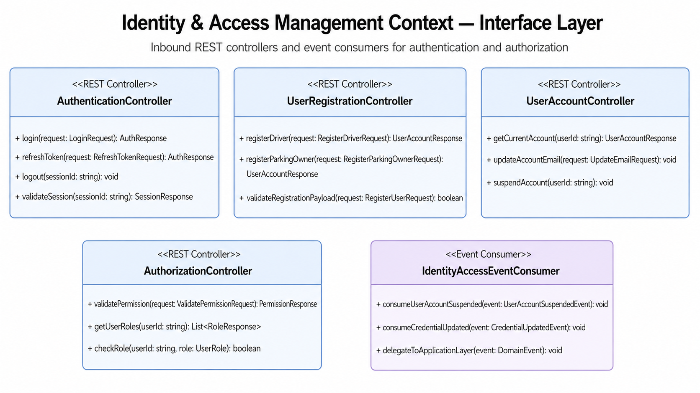

*Nota.* Elaboración propia (2026) usando LucidChart.

Las clases consideradas para esta capa son las siguientes:

| Clase | Tipo | Propósito |
|---|---|---|
| `AuthenticationController` | REST Controller | Expone endpoints para iniciar sesión, renovar tokens y cerrar sesión. |
| `UserRegistrationController` | REST Controller | Expone endpoints para registrar cuentas de Driver y Parking Owner. |
| `UserAccountController` | REST Controller | Permite consultar y actualizar información básica de la cuenta autenticada. |
| `AuthorizationController` | REST Controller | Permite validar permisos o recuperar información de roles del usuario autenticado. |
| `IdentityAccessEventConsumer` | Event Consumer | Consume eventos relacionados con creación o actualización de usuarios desde otros contextos cuando corresponda. |

La clase `AuthenticationController` recibe solicitudes de inicio de sesión y renovación de tokens. Su responsabilidad es validar que el request tenga los campos mínimos, como correo electrónico y contraseña, y luego delegar el procesamiento a `AuthenticateUserCommandHandler`.

La clase `UserRegistrationController` recibe solicitudes de registro para los dos segmentos del sistema. Esta clase permite crear cuentas para `DRIVER` o `PARKING_OWNER`, delegando la lógica de creación al `RegisterUserAccountCommandHandler`.

La clase `UserAccountController` permite consultar datos básicos de la cuenta autenticada y solicitar cambios de estado cuando corresponda. No gestiona información específica de estacionamientos, reservas o monitoreo IoT.

La clase `AuthorizationController` expone operaciones para validar permisos de acceso en función del rol del usuario. Su objetivo es apoyar a otros módulos del sistema cuando requieren verificar si un usuario puede ejecutar una operación determinada.

La clase `IdentityAccessEventConsumer` consume eventos internos relacionados con identidad cuando existan integraciones entre contextos. Por ejemplo, puede reaccionar ante la eliminación lógica de una cuenta o ante solicitudes internas de revocación de sesiones.

#### 4.2.6.3. Application Layer

La **Application Layer** del **Identity & Access Management Context** contiene los command handlers y event handlers que orquestan los casos de uso relacionados con registro, autenticación, autorización, renovación de tokens, cierre de sesión y gestión de estado de cuenta.

Esta capa coordina el flujo entre la Interface Layer, el Domain Layer y la Infrastructure Layer. Recibe datos previamente validados a nivel superficial, invoca fábricas y políticas del dominio, utiliza interfaces de repositorio y solicita a la infraestructura tareas técnicas como generación de tokens o hash de contraseñas.

Esta capa debe mantenerse delgada. Las reglas de seguridad pertenecen al Domain Layer, mientras que detalles como JWT, Spring Security, hashing o persistencia en PostgreSQL pertenecen a Infrastructure Layer.

**Figura 91**  
*Identity & Access Management Context Application Layer*

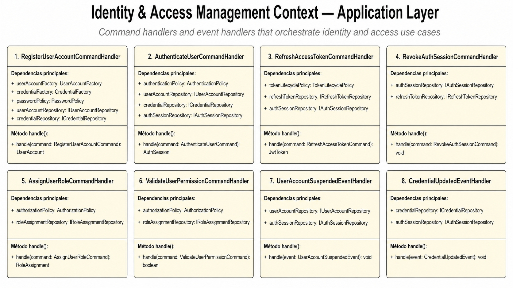

*Nota.* Elaboración propia (2026) usando LucidChart.

Las clases consideradas para esta capa son las siguientes:

| Clase | Tipo | Propósito |
|---|---|---|
| `RegisterUserAccountCommandHandler` | Command Handler | Orquesta el registro de una nueva cuenta de usuario. |
| `AuthenticateUserCommandHandler` | Command Handler | Orquesta la autenticación de un usuario mediante credenciales. |
| `RefreshAccessTokenCommandHandler` | Command Handler | Orquesta la renovación de un token de acceso. |
| `RevokeAuthSessionCommandHandler` | Command Handler | Orquesta el cierre de sesión o revocación de una sesión activa. |
| `AssignUserRoleCommandHandler` | Command Handler | Orquesta la asignación de rol funcional durante el registro o actualización de cuenta. |
| `ValidateUserPermissionCommandHandler` | Command Handler | Orquesta la validación de permisos según el rol del usuario. |
| `UserAccountSuspendedEventHandler` | Event Handler | Reacciona ante la suspensión de una cuenta y revoca sesiones activas. |
| `CredentialUpdatedEventHandler` | Event Handler | Reacciona ante una actualización de credenciales y puede invalidar sesiones anteriores. |

El `RegisterUserAccountCommandHandler` inicia el flujo de registro. Recibe datos del usuario, valida el rol solicitado, invoca `UserAccountFactory`, solicita el procesamiento seguro de la contraseña y guarda la cuenta mediante `IUserAccountRepository`.

El `AuthenticateUserCommandHandler` coordina el flujo de inicio de sesión. Obtiene la cuenta por correo electrónico, recupera sus credenciales, aplica `AuthenticationPolicy` y solicita a la infraestructura la verificación del hash de contraseña. Si la autenticación es válida, genera una sesión y un token de acceso.

El `RefreshAccessTokenCommandHandler` permite renovar el token de acceso cuando el refresh token sigue vigente. Para ello utiliza `TokenLifecyclePolicy` y consulta el estado del token mediante `IRefreshTokenRepository`.

El `RevokeAuthSessionCommandHandler` permite cerrar sesión o revocar una sesión activa. Esta operación marca la sesión y sus tokens asociados como revocados, evitando su uso posterior.

El `AssignUserRoleCommandHandler` coordina la asignación de roles funcionales. En ParkingNow, esta asignación se limita a los roles `DRIVER` y `PARKING_OWNER`.

El `ValidateUserPermissionCommandHandler` permite verificar si un usuario tiene autorización para ejecutar una operación determinada. Esta clase utiliza `AuthorizationPolicy` y los roles asignados al usuario.

Los event handlers `UserAccountSuspendedEventHandler` y `CredentialUpdatedEventHandler` reaccionan ante cambios relevantes de seguridad. Su responsabilidad es mantener la consistencia del acceso cuando una cuenta se suspende o cuando se actualizan credenciales.

#### 4.2.6.4. Infrastructure Layer

La **Infrastructure Layer** del **Identity & Access Management Context** contiene las clases que conectan el contexto con tecnologías concretas, como PostgreSQL, Spring Data JPA, Spring Security, JWT y mecanismos de hashing de contraseñas.

En esta capa se implementan los repositorios definidos en el Domain Layer. Además, se ubican adaptadores técnicos para generación y validación de tokens, codificación de contraseñas, extracción de claims y adaptación con Spring Security.

**Figura 92**  
*Identity & Access Management Context Infrastructure Layer*

*Nota.* Elaboración propia (2026) usando LucidChart.

Las clases consideradas para esta capa son las siguientes:

| Clase | Tipo | Propósito |
|---|---|---|
| `JpaUserAccountRepository` | Repository Implementation | Implementa `IUserAccountRepository` usando Spring Data JPA y PostgreSQL. |
| `JpaCredentialRepository` | Repository Implementation | Implementa `ICredentialRepository` para persistir credenciales de usuario. |
| `JpaRoleAssignmentRepository` | Repository Implementation | Implementa `IRoleAssignmentRepository` para persistir roles asignados. |
| `JpaAuthSessionRepository` | Repository Implementation | Implementa `IAuthSessionRepository` para persistir sesiones de autenticación. |
| `JpaRefreshTokenRepository` | Repository Implementation | Implementa `IRefreshTokenRepository` para persistir tokens de renovación. |
| `PasswordHashingService` | Infrastructure Service | Procesa y verifica contraseñas mediante algoritmo de hash seguro. |
| `JwtTokenProvider` | Infrastructure Service | Genera y valida tokens JWT para usuarios autenticados. |
| `SpringSecurityUserDetailsAdapter` | Adapter | Adapta la cuenta del dominio al modelo requerido por Spring Security. |
| `SecurityClaimsMapper` | Mapper | Convierte datos del dominio en claims incluidos dentro del JWT. |
| `AuthenticationClockProvider` | Infrastructure Service | Proporciona timestamps para expiración de sesiones y tokens. |

La clase `JpaUserAccountRepository` permite almacenar y recuperar cuentas de usuario. Su implementación usa Spring Data JPA sobre PostgreSQL y mantiene aislado al dominio de los detalles de persistencia.

La clase `JpaCredentialRepository` persiste las credenciales asociadas a cada cuenta. No almacena contraseñas en texto plano, sino valores procesados mediante `PasswordHashingService`.

La clase `JpaRoleAssignmentRepository` almacena los roles asignados a un usuario. En ParkingNow, los roles principales corresponden a los segmentos `DRIVER` y `PARKING_OWNER`.

La clase `JpaAuthSessionRepository` registra las sesiones de autenticación. Esto permite controlar sesiones activas, expiradas o revocadas.

La clase `JpaRefreshTokenRepository` persiste los tokens de renovación asociados a una sesión. Esto permite renovar accesos sin requerir credenciales en cada operación.

La clase `PasswordHashingService` encapsula el algoritmo de hash y verificación de contraseñas. Esto evita que la lógica de aplicación o dominio conozca detalles del mecanismo criptográfico utilizado.

La clase `JwtTokenProvider` genera y valida tokens JWT. Esta clase permite incluir claims como identificador de usuario, rol y tiempo de expiración.

La clase `SpringSecurityUserDetailsAdapter` permite integrar el modelo de cuenta de ParkingNow con Spring Security, sin contaminar el dominio con clases del framework.

La clase `SecurityClaimsMapper` transforma información del dominio en claims de seguridad para el token JWT.

#### 4.2.6.5. Bounded Context Software Architecture Component Level Diagrams

El **Bounded Context Software Architecture Component Level Diagram** del **Identity & Access Management Context** muestra la descomposición interna del módulo de identidad y acceso dentro del contenedor **Core REST API**. Este diagrama corresponde al nivel 3 del modelo C4 y permite visualizar cómo se organizan los controladores REST, command handlers, event handlers, componentes de dominio, repositorios e infraestructura de seguridad.

Este contexto se implementa dentro del **Core REST API**, desarrollado con **Java y Spring Boot**, debido a que la autenticación y autorización son capacidades transversales utilizadas por la Web App, la Mobile App y otros contextos del sistema.

**Figura 93**  
*Identity & Access Management Context Component Level Diagram*

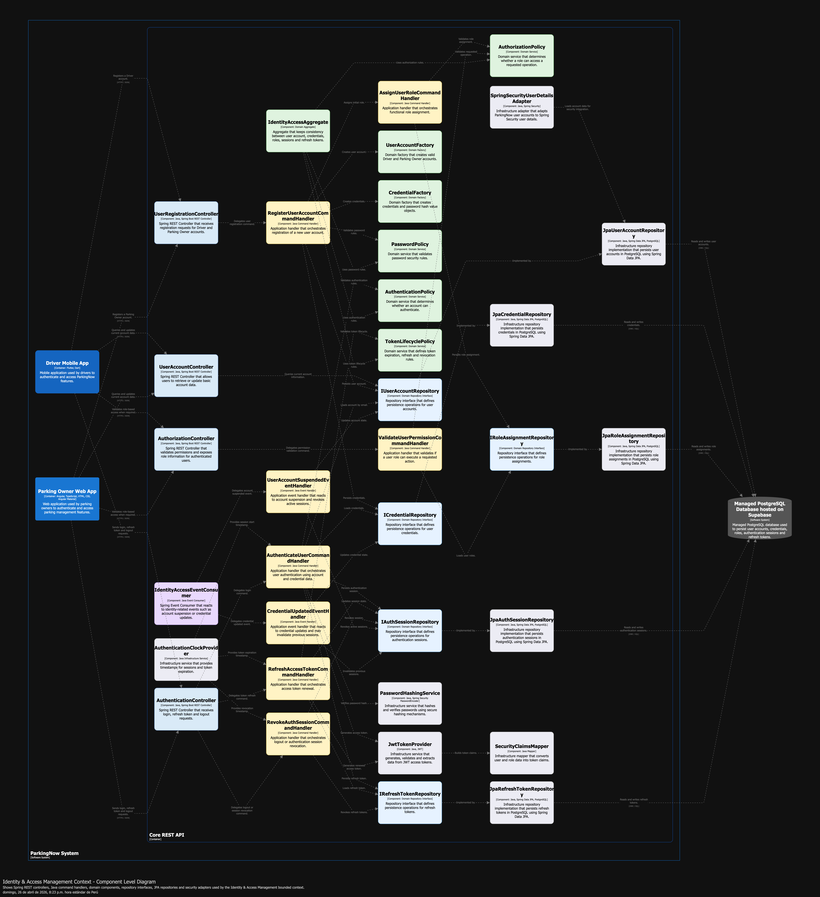

*Nota.* Elaboración propia (2026) usando Structurizr DSL.

Según la Figura 93, el flujo principal inicia cuando un usuario envía una solicitud desde la **Driver Mobile App** o la **Parking Owner Web App** hacia los controladores del contexto. Por ejemplo, una solicitud de inicio de sesión es recibida por `AuthenticationController`, que delega el procesamiento a `AuthenticateUserCommandHandler`.

El command handler recupera la cuenta mediante `IUserAccountRepository`, obtiene las credenciales mediante `ICredentialRepository`, aplica `AuthenticationPolicy` y utiliza `PasswordHashingService` para verificar la contraseña. Si la autenticación es válida, se crea una sesión mediante `IAuthSessionRepository` y se genera un JWT mediante `JwtTokenProvider`.

En el caso de autorización, `AuthorizationController` delega la solicitud a `ValidateUserPermissionCommandHandler`, el cual utiliza `AuthorizationPolicy` y consulta los roles del usuario mediante `IRoleAssignmentRepository`.

La siguiente tabla resume los componentes principales del diagrama:

| Capa | Componente | Tecnología | Responsabilidad |
|---|---|---|---|
| Interface Layer | `AuthenticationController` | Java / Spring Boot REST Controller | Recibe solicitudes de login, refresh token y logout. |
| Interface Layer | `UserRegistrationController` | Java / Spring Boot REST Controller | Recibe solicitudes de registro de usuarios. |
| Interface Layer | `UserAccountController` | Java / Spring Boot REST Controller | Permite consultar y actualizar información básica de la cuenta. |
| Interface Layer | `AuthorizationController` | Java / Spring Boot REST Controller | Permite validar permisos según rol. |
| Interface Layer | `IdentityAccessEventConsumer` | Java Event Consumer | Consume eventos internos relacionados con identidad. |
| Application Layer | `RegisterUserAccountCommandHandler` | Java Command Handler | Orquesta el registro de una nueva cuenta. |
| Application Layer | `AuthenticateUserCommandHandler` | Java Command Handler | Orquesta la autenticación de usuario. |
| Application Layer | `RefreshAccessTokenCommandHandler` | Java Command Handler | Orquesta la renovación de token de acceso. |
| Application Layer | `RevokeAuthSessionCommandHandler` | Java Command Handler | Orquesta el cierre o revocación de sesión. |
| Application Layer | `AssignUserRoleCommandHandler` | Java Command Handler | Orquesta la asignación de roles. |
| Application Layer | `ValidateUserPermissionCommandHandler` | Java Command Handler | Orquesta la validación de permisos. |
| Domain Layer | `IdentityAccessAggregate` | Domain Model | Mantiene consistencia entre cuenta, credenciales, roles y sesiones. |
| Domain Layer | `UserAccountFactory` | Domain Factory | Crea cuentas de usuario válidas. |
| Domain Layer | `CredentialFactory` | Domain Factory | Crea credenciales válidas. |
| Domain Layer | `PasswordPolicy` | Domain Service | Valida reglas de contraseña. |
| Domain Layer | `AuthenticationPolicy` | Domain Service | Determina si una cuenta puede autenticarse. |
| Domain Layer | `AuthorizationPolicy` | Domain Service | Determina si un usuario tiene permiso para una acción. |
| Domain Layer | `TokenLifecyclePolicy` | Domain Service | Controla expiración, renovación y revocación de tokens. |
| Infrastructure Layer | `JpaUserAccountRepository` | Spring Data JPA / PostgreSQL | Persiste cuentas de usuario. |
| Infrastructure Layer | `JpaCredentialRepository` | Spring Data JPA / PostgreSQL | Persiste credenciales. |
| Infrastructure Layer | `JpaRoleAssignmentRepository` | Spring Data JPA / PostgreSQL | Persiste roles asignados. |
| Infrastructure Layer | `JpaAuthSessionRepository` | Spring Data JPA / PostgreSQL | Persiste sesiones. |
| Infrastructure Layer | `JpaRefreshTokenRepository` | Spring Data JPA / PostgreSQL | Persiste tokens de renovación. |
| Infrastructure Layer | `PasswordHashingService` | Spring Security | Procesa y verifica contraseñas. |
| Infrastructure Layer | `JwtTokenProvider` | JWT | Genera y valida tokens de acceso. |
| Infrastructure Layer | `SpringSecurityUserDetailsAdapter` | Spring Security | Adapta cuentas del dominio al modelo de seguridad del framework. |

#### 4.2.6.6. Bounded Context Software Architecture Code Level Diagrams

En esta sección se presentan los diagramas de nivel de código correspondientes al bounded context **Identity & Access Management**. A diferencia del Component Level Diagram, que muestra bloques estructurales de alto nivel, este bloque profundiza en el diseño de clases del dominio y en la estructura física de persistencia utilizada por este contexto.

Primero se presenta el **Domain Layer Class Diagram**, donde se detallan las entidades, objetos de valor, agregados, servicios de dominio, fábricas, enumeraciones e interfaces de repositorio del contexto. Luego se presenta el **Database Design Diagram**, donde se especifican las tablas, columnas, llaves primarias, llaves foráneas y relaciones utilizadas para persistir cuentas, credenciales, roles, sesiones y tokens.

Estos diagramas permiten cerrar el diseño táctico del bounded context **Identity & Access Management**, asegurando trazabilidad entre reglas de identidad, autenticación, autorización, sesiones y persistencia relacional.

###### 4.2.6.6.1. Bounded Context Domain Layer Class Diagrams

El **Bounded Context Domain Layer Class Diagram** presenta el diseño UML de las clases que forman parte de la capa de dominio del bounded context **Identity & Access Management**. Este diagrama se enfoca exclusivamente en los elementos que representan reglas de negocio puras relacionadas con identidad y acceso, sin incluir controladores, frameworks, repositorios de infraestructura, JWT, Spring Security ni detalles de base de datos.

**Figura 94**  
*Identity & Access Management Context Domain Layer Class Diagram*

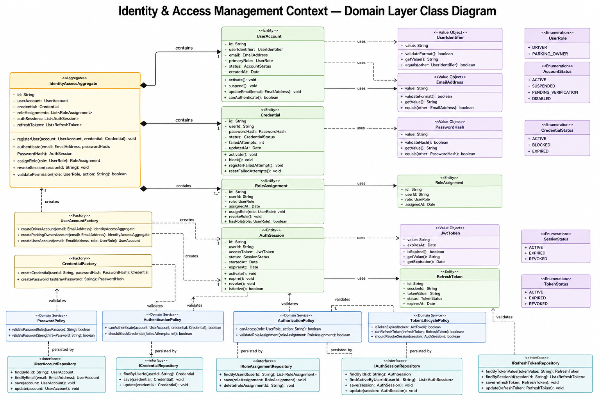

*Nota.* Elaboración propia (2026) usando LucidChart / PlantUML.

Según la Figura 94, el aggregate `IdentityAccessAggregate` actúa como raíz de consistencia del contexto. Este aggregate contiene la cuenta de usuario, sus credenciales, sus roles y sus sesiones de autenticación. Esta estructura permite controlar que la identidad del usuario y sus permisos se mantengan consistentes dentro del sistema.

La entidad `UserAccount` representa la cuenta principal del usuario. Esta clase contiene el identificador del usuario, correo electrónico, rol principal y estado de cuenta. Su comportamiento permite activar, suspender o validar si una cuenta puede operar.

La entidad `Credential` representa las credenciales de acceso asociadas a una cuenta. Esta entidad se apoya en el value object `PasswordHash`, evitando almacenar o manipular contraseñas en texto plano dentro del dominio.

La entidad `RoleAssignment` representa los roles asignados a un usuario. En ParkingNow, los roles definidos son `DRIVER` y `PARKING_OWNER`, ya que el sistema trabaja con dos segmentos principales y no considera un administrador global como segmento de negocio.

La entidad `AuthSession` representa una sesión autenticada. Esta clase permite identificar si una sesión está activa, expirada o revocada. La entidad `RefreshToken` permite gestionar la renovación del acceso mientras la sesión sea válida.

Los value objects `UserIdentifier`, `EmailAddress`, `PasswordHash` y `JwtToken` encapsulan conceptos críticos del dominio de seguridad. Estos objetos permiten validar formato, consistencia y representación de datos sin exponer detalles de infraestructura.

Los servicios de dominio `PasswordPolicy`, `AuthenticationPolicy`, `AuthorizationPolicy` y `TokenLifecyclePolicy` concentran reglas que no pertenecen a una sola entidad. Estas reglas permiten validar contraseñas, determinar si una cuenta puede autenticarse, verificar permisos y controlar el ciclo de vida de tokens y sesiones.

Las interfaces de repositorio definen los contratos de persistencia requeridos por el dominio. Sus implementaciones concretas se ubican en la **Infrastructure Layer**, manteniendo separado el modelo de dominio de los detalles técnicos.

###### 4.2.6.6.2. Bounded Context Database Design Diagram

El **Bounded Context Database Design Diagram** presenta el diseño físico de base de datos correspondiente al bounded context **Identity & Access Management**. Este diagrama muestra cómo se almacenan las cuentas de usuario, credenciales, roles, sesiones y tokens de renovación en una base de datos relacional PostgreSQL.

Para este contexto se utiliza persistencia relacional porque las entidades de identidad requieren integridad, trazabilidad, unicidad de correos, control de sesiones y consistencia entre cuentas, credenciales y roles.

**Figura 95**  
*Identity & Access Management Context Database Design Diagram*

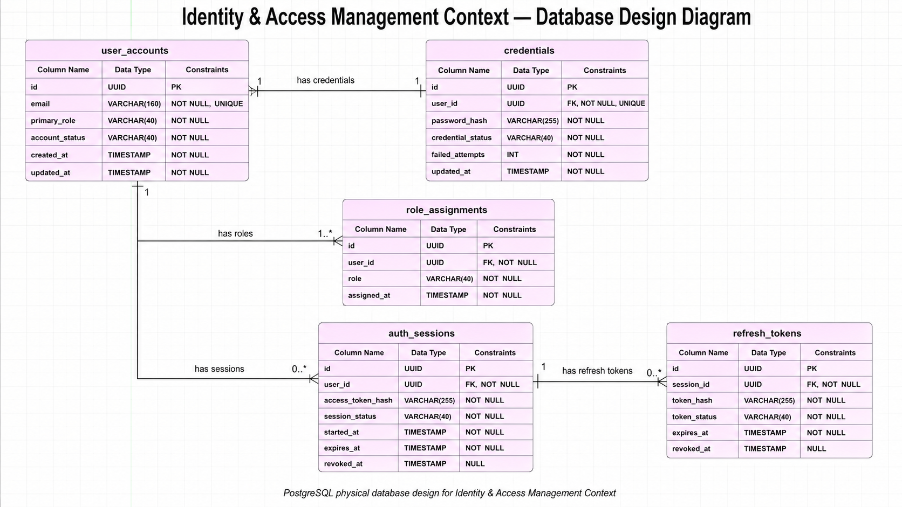

*Nota.* Elaboración propia (2026) usando LucidChart / Vertabelo.

Las tablas consideradas para este bounded context son las siguientes:

| Tabla | Propósito |
|---|---|
| `user_accounts` | Almacena las cuentas principales de los usuarios registrados. |
| `credentials` | Almacena credenciales procesadas mediante hash seguro. |
| `role_assignments` | Almacena los roles funcionales asignados a cada usuario. |
| `auth_sessions` | Almacena sesiones de autenticación activas, expiradas o revocadas. |
| `refresh_tokens` | Almacena tokens de renovación asociados a sesiones. |

La tabla `user_accounts` representa la cuenta principal del usuario dentro de ParkingNow. Contiene datos como el identificador, correo electrónico, rol principal, estado de cuenta y fechas de creación o actualización.

La tabla `credentials` almacena las credenciales asociadas a cada cuenta. Esta tabla contiene el hash de la contraseña, estado de credencial, fecha de actualización y contador de intentos fallidos cuando corresponda.

La tabla `role_assignments` permite asociar roles funcionales a una cuenta. En el sistema se consideran los roles `DRIVER` y `PARKING_OWNER`, alineados con los segmentos definidos en el proyecto.

La tabla `auth_sessions` permite registrar sesiones de autenticación. Esto facilita cerrar sesión, revocar accesos, auditar actividad y controlar sesiones expiradas.

La tabla `refresh_tokens` almacena los tokens de renovación asociados a una sesión. Esto permite renovar tokens de acceso sin solicitar credenciales en cada operación, siempre que el token siga vigente y no haya sido revocado.

| Relación | Cardinalidad | Descripción |
|---|---|---|
| `user_accounts` → `credentials` | 1 a 1 | Una cuenta tiene un conjunto de credenciales activo. |
| `user_accounts` → `role_assignments` | 1 a 1..* | Una cuenta puede tener uno o más roles funcionales. |
| `user_accounts` → `auth_sessions` | 1 a 0..* | Una cuenta puede tener múltiples sesiones históricas o activas. |
| `auth_sessions` → `refresh_tokens` | 1 a 0..* | Una sesión puede tener tokens de renovación asociados. |

El diseño utiliza identificadores de tipo `UUID` para mantener unicidad. El correo electrónico se almacena con una restricción `UNIQUE` para evitar cuentas duplicadas. Los estados y roles se almacenan como `VARCHAR`, alineados con las enumeraciones definidas en el Domain Layer.

La persistencia se define sobre **PostgreSQL** y es accedida desde el **Core REST API** mediante **Spring Data JPA** o **JDBC**. La lógica de autenticación, autorización y generación de sesiones no se implementa en la base de datos, sino en el bounded context **Identity & Access Management**, manteniendo la separación entre reglas de negocio e infraestructura.
## Conclusiones

Como equipo, concluimos que la problemática de estacionamiento en Lima Metropolitana es estructural y combina tres factores: alta presión vehicular, baja visibilidad de disponibilidad en tiempo real y operación altamente manual en estacionamientos de pequeña escala. La evidencia levantada en el informe y en las entrevistas confirma que los conductores toman decisiones con incertidumbre y los administradores operan con herramientas fragmentadas.

También concluimos que el enfoque de ParkingNow es técnicamente viable para el alcance del proyecto, porque integra un flujo completo entre búsqueda, reserva, monitoreo IoT y notificación operativa, manteniendo separación de responsabilidades mediante bounded contexts y arquitectura por capas. Esta decisión reduce acoplamiento y facilita evolución incremental.

Finalmente, concluimos que la propuesta de valor más crítica no es solo "mostrar estacionamientos", sino ofrecer disponibilidad confiable respaldada por detección física y sincronización digital. Ese atributo diferencia la solución frente a alternativas que priorizan intermediación sin validación física del estado del espacio.

## Capítulo V: Solution UI/UX Design 

### 5.1. Style Guidelines. 
En este capítulo, se desarrollara lo correspondiente a los estilos y herrmaientas que usaremos para el diseño de nuestro proyecto.
#### 5.1.1. General Style Guidelines. 

**Brand Overview**
En una ciudad como Lima, donde el tráfico y la falta de estacionamientos son problemas constantes, encontrar un espacio disponible suele ser difícil y toma tiempo. PARKINGNOW surge como una solución que permite a los conductores ubicar y reservar estacionamientos en tiempo real mediante una aplicación móvil. La plataforma utiliza tecnologías IoT, como sensores que detectan la ocupación de los espacios, para brindar información actualizada y confiable. De esta manera, se busca reducir el tiempo de búsqueda, mejorar la experiencia del usuario y contribuir a una gestión más eficiente del estacionamiento urbano.

**Brand name**
El nombre que seleccionamos para nuestro proyecto es PARKINGNOW, ya que refleja la propuesta principal de la solución: permitir a los usuarios encontrar y gestionar espacios de estacionamiento de forma rápida y en el momento que lo necesitan. La combinación de “Parking” (estacionamiento) y “Now” (ahora) transmite inmediatez, practicidad y acceso en tiempo real. Se eligió un nombre en inglés por su carácter universal y su fácil recordación, alineándose con una solución tecnológica moderna orientada a entornos urbanos.

A continuación, presentaremos el logo de nuestra aplicación:

#### 5.1.2. Web, Mobile and IoT Style Guidelines. 

En PARKINGNOW contemplamos el desarrollo de una aplicación web y móvil con diseño adaptable, asegurando una correcta visualización y uso en distintos dispositivos y tamaños de pantalla. Se prioriza una experiencia intuitiva, donde el usuario pueda acceder rápidamente a la información de disponibilidad de estacionamientos y realizar acciones como búsqueda y reserva sin complicaciones.

En cuanto al diseño, se aplicará el patrón visual en Z para organizar el contenido de manera natural, iniciando con el logo y los elementos principales en la parte superior, seguido de las opciones de navegación, y posteriormente la información relevante distribuida de forma clara y ordenada. Esto permite que tanto conductores como administradores comprendan fácilmente el funcionamiento de la plataforma.

Para la interfaz, se utilizará una paleta de colores que transmita confianza y claridad, apoyada en indicadores visuales simples como el uso de colores (por ejemplo, verde para espacios disponibles y rojo para ocupados), lo cual resulta clave en la experiencia del usuario.

En relación con el componente IoT, la información captada por los sensores será representada en tiempo real dentro de las interfaces, manteniendo consistencia visual entre la aplicación móvil y web. Esto asegura que los usuarios puedan interpretar rápidamente el estado de los espacios y confiar en la precisión de los datos mostrados.

### 5.2. Information Architecture. 
En esta sección, detallaremos decisicones y fundamentos sobr el contenido en las experiencias web y móvil de PARKINGNOW. Estas propuestas estan diseñadas para asegurar que los visitantes y usuarios se adapten a las funcionalidades de cada producto sin esfuerzo. Las decisiones incluyen los sistemas de organización, etiquetado, navegación y búsqueda.

#### 5.2.1. Organization Systems. 

Para estructurar la arquitectura de la información de PARKINGNOW, se ha adoptado un sistema de organización jerárquico que abarca la Landing Page, la aplicación móvil, la aplicación web y la infraestructura IoT. Este enfoque permite organizar la información de manera clara, facilitando la navegación y asegurando que cada tipo de usuario pueda acceder rápidamente a las funciones que necesita.

**Landing Page**
La Landing Page se organiza de forma jerárquica para presentar la propuesta de valor y guiar al usuario hacia el uso de la plataforma:

Barra de Navegación Principal:
Ubicada en la parte superior, permite acceder a las secciones clave:

- Inicio (Home): Presenta una visión general de PARKINGNOW, destacando el problema del estacionamiento en la ciudad y la solución propuesta, con llamados a la acción para registro e inicio de sesión.
- Servicios (Services): Explica los beneficios tanto para conductores como para administradores de estacionamientos.
- Tecnología (Technology): Describe el uso de sensores IoT y monitoreo para la detección de espacios en tiempo real.
- Planes (Plans): Muestra las opciones de uso o afiliación para los distintos usuarios.
- Contáctanos (Contact): Incluye formulario de contacto y enlaces de comunicación.
- Nosotros (About Us): Presenta la misión, visión y propósito del proyecto.

Estructura de Contenido:
Se organiza mediante encabezados, secciones claras y botones de acción (CTAs) que guían al usuario hacia el registro o exploración de la plataforma.

Footer:
Incluye enlaces adicionales como políticas, contacto y redes sociales.

**Aplicación Móvil (Conductores urbanos)**

La aplicación móvil está diseñada para ofrecer una experiencia rápida y práctica a los conductores:

- Inicio (Home): Muestra espacios disponibles cercanos y accesos rápidos a búsqueda.
- Buscar Estacionamiento (Search): Permite ubicar espacios en tiempo real con ayuda de geolocalización.
- Reservas (Reservations): Permite gestionar reservas activas.
- Favoritos (Favorites): Guarda estacionamientos frecuentes.
- Historial (History): Registro de reservas anteriores.

La información se presenta de forma simple, priorizando rapidez y facilidad de uso.

**Aplicación Web (Administradores de estacionamientos independientes)**

La aplicación web está orientada a la gestión de estacionamientos:

- Inicio (Dashboard): Resumen general de ocupación y actividad.
- Monitoreo (Monitoring): Visualización en tiempo real del estado de los espacios.
- Reservas (Reservations): Gestión de solicitudes y ocupación.
- Espacios (Spaces): Configuración y control de los espacios disponibles.
- Estadísticas (Analytics): Datos sobre uso, ocupación e ingresos.

La interfaz está diseñada para ofrecer mayor detalle y control operativo.

**Infraestructura IoT**

El sistema IoT cumple un rol fundamental dentro de la organización del sistema:

- Sensores en cada espacio: Detectan si un espacio está ocupado o libre.
- Cámaras de monitoreo: Apoyan en la verificación y seguridad.
- Comunicación en tiempo real: Los datos se envían a un sistema central (backend).
- Integración con apps: La información se refleja automáticamente en la app móvil y web.

Esto permite mantener una sincronización constante entre los estacionamientos y la plataforma digital.

#### 5.2.2. Labeling Systems. 

En esta sección se describen los sistemas de etiquetado utilizados en la Landing Page, la aplicación móvil y la aplicación web de PARKINGNOW. El objetivo del etiquetado es facilitar la comprensión del sistema, permitiendo que los usuarios identifiquen rápidamente las funciones disponibles y naveguen de manera intuitiva. Se busca mantener consistencia en los nombres y utilizar términos claros y familiares.

**Etiquetas de Encabezados (Headings)**

Las etiquetas de encabezado permiten organizar el contenido principal de la plataforma:

- Inicio (Home): Presenta una visión general de la solución y accesos rápidos al registro o inicio de sesión.
- Servicios (Services): Describe las funcionalidades principales para conductores y administradores.
- Tecnología (Technology): Explica el uso de sensores IoT y monitoreo en tiempo real de los espacios.
- Planes (Plans): Muestra opciones de uso o afiliación para los usuarios.
- Contáctanos (Contact): Permite la comunicación con el equipo mediante formularios o enlaces.
- Nosotros (About Us): Información sobre la propuesta, misión y visión de PARKINGNOW.

**Etiquetas Textuales (Text Labels)**

Estas etiquetas ayudan a los usuarios a identificar acciones dentro de la plataforma:

- Buscar Estacionamiento (Search Parking): Permite ubicar espacios disponibles en tiempo real.
- Reservar (Reserve): Acción para seleccionar y confirmar un espacio.
- Disponibilidad (Availability): Indica si un espacio está libre u ocupado.
- Mis Reservas (My Reservations): Acceso a reservas activas.
- Historial (History): Registro de reservas anteriores.
- Favoritos (Favorites): Espacios guardados por el usuario.
- Monitoreo (Monitoring): Vista en tiempo real para administradores.
- Estadísticas (Analytics): Información sobre uso y ocupación.
- Configuración (Settings): Ajustes de la cuenta y preferencias.

**Etiquetas Icónicas (Iconic Labels)**

Se utilizan íconos para reforzar visualmente las acciones y facilitar la navegación:

- Lupa: Representa la búsqueda de estacionamientos.
- Ubicación: Indica la posición del usuario o estacionamientos cercanos.
- Estrella: Marca favoritos.
- Vehículo: Representa espacios de estacionamiento.
- Notificaciones: Alertas sobre reservas o disponibilidad.
- Indicadores de estado: Verde para espacio disponible y rojo para ocupado (basado en datos IoT).

Estas etiquetas se aplican de manera consistente en la web y la aplicación móvil, permitiendo que el usuario reconozca fácilmente las funciones sin necesidad de aprendizaje previo. Además, los indicadores visuales vinculados a los sensores IoT ayudan a interpretar rápidamente el estado de los espacios de estacionamiento, mejorando la experiencia general del sistema.

#### 5.2.3. SEO Tags and Meta Tags

Los SEO Tags y Meta Tags permiten que la Landing Page y la aplicación web de PARKINGNOW sean fácilmente identificables por los motores de búsqueda, mejorando su visibilidad y facilitando el acceso de los usuarios. Además, contribuyen a una correcta visualización en distintos dispositivos y a una mejor gestión del contenido.

**Title**
El título define el nombre de la startup en el navegador y en los resultados de búsqueda:

<title>PARKINGNOW</title>

**Description**
Describe de forma breve el propósito de la plataforma, incluyendo su enfoque en tecnología e IoT:

<meta name="description" content="PARKINGNOW es una plataforma que permite encontrar y reservar estacionamientos en tiempo real."/>

**Keywords y Viewport**
Se incluyen etiquetas que ayudan a posicionar la página y asegurar su correcta adaptación en dispositivos móviles:

<meta name="keywords" content="estacionamiento, parking, IoT, sensores, reservas, Lima, conductores"/>
<meta name="viewport" content="width=device-width, initial-scale=1.0">

**Author / Copyright**
Identifica la autoría del contenido y los derechos de la plataforma:

<meta name="author" content="Equipo PARKINGNOW"/>
<meta name="copyright" content="© 2026 PARKINGNOW. Todos los derechos reservados."/>

Estos elementos permiten mejorar la presencia digital de PARKINGNOW y asegurar una correcta indexación en buscadores, alineándose con la propuesta tecnológica del proyecto.

#### 5.2.4. Searching Systems. 

#### 5.2.5. Navigation Systems.

### 5.3. Landing Page UI Design. 

#### 5.3.1. Landing Page Wireframe.

#### 5.3.2. Landing Page Mock-up. 

### 5.4. Applications UX/UI Design. 

#### 5.4.1. Applications Wireframes. 

#### 5.4.2. Applications Wireflow Diagrams. 

#### 5.4.3. Applications Mock-ups. 

#### 5.4.4. Applications User Flow Diagrams. 

### 5.5. Applications Prototyping. 

### 5.6. IoT Device Design. 

## Conclusiones y recomendaciones

A nivel grupal, concluimos que el diseño estratégico y táctico desarrollado en el informe mantiene coherencia entre problema, segmentos, requisitos, modelo de dominio y arquitectura de software. La solución está correctamente orientada a reducir incertidumbre del conductor y mejorar control operativo del administrador.

Recomendamos priorizar, para el siguiente ciclo, los siguientes frentes:

1. Implementar un piloto controlado con estacionamientos independientes (2 a 30 espacios) para medir indicadores reales: tiempo de búsqueda, tasa de reservas completadas, precisión disponibilidad física/digital y reducción de conflictos operativos.
2. Endurecer la calidad de datos en tiempo real mediante reglas de validación de eventos IoT (debounce, heartbeats, detección de desconexión y reconciliación de estados).
3. Definir métricas de negocio por contexto (Discovery, Reservation, IoT Monitoring, Notifications e IAM) con tableros de seguimiento semanales.
4. Formalizar una política de referencias: toda cita en el cuerpo debe tener correspondencia 1:1 en Bibliografía y toda fuente operacional debe quedar en Anexos.
5. Ejecutar pruebas de usabilidad separadas por segmento (Driver y Parking Owner) para reducir fricción en onboarding, búsqueda, reserva y validación.

## Bibliografía

- Asociación Automotriz del Perú. (2025). *Informe Cities in Motion 2025: ¿Cómo está Lima?* [https://aap.org.pe/observatorio-aap/informe_cities_in_motion_2025_-_como_esta_lima/Informe_Cities_in_Motion_2025_-_Como_esta_Lima.pdf](https://aap.org.pe/observatorio-aap/informe_cities_in_motion_2025_-_como_esta_lima/Informe_Cities_in_Motion_2025_-_Como_esta_Lima.pdf). URL: https://aap.org.pe/observatorio-aap/informe_cities_in_motion_2025_-_como_esta_lima/Informe_Cities_in_Motion_2025_-_Como_esta_Lima.pdf
- Bustamante Villagómez, D. F., & Hidrobo Moreno, C. A. (2024). *Diseño de un sistema prototipo de uso de parqueaderos bajo disponibilidad, mediante IoT y sensórica*. Repositorio UISEK. [https://repositorio.uisek.edu.ec/handle/123456789/5221](https://repositorio.uisek.edu.ec/handle/123456789/5221). URL: https://repositorio.uisek.edu.ec/handle/123456789/5221
- El Comercio. (2025). *AAP: Flujo vehicular creció 4,1% en julio, segundo mayor avance del 2025*. [https://elcomercio.pe/economia/peru/aap-flujo-vehicular-crecio-41-en-julio-segundo-mayor-avance-del-2025-l-ultimas-noticia//](https://elcomercio.pe/economia/peru/aap-flujo-vehicular-crecio-41-en-julio-segundo-mayor-avance-del-2025-l-ultimas-noticia//). URL: https://elcomercio.pe/economia/peru/aap-flujo-vehicular-crecio-41-en-julio-segundo-mayor-avance-del-2025-l-ultimas-noticia//
- El Comercio. (2024). *Miraflores, San Borja, Surco y San Isidro tienen solo hasta 12,000 lugares para estacionamientos públicos*. [https://elcomercio.pe/lima/obras/miraflores-san-borja-surco-y-san-isidro-tienen-solo-hasta-12000-lugares-para-estacionamientos-publicos-como-mejorar-la-gestion-de-espacios-autos-via-publica-obras-lima-como-vamos-noticia/](https://elcomercio.pe/lima/obras/miraflores-san-borja-surco-y-san-isidro-tienen-solo-hasta-12000-lugares-para-estacionamientos-publicos-como-mejorar-la-gestion-de-espacios-autos-via-publica-obras-lima-como-vamos-noticia/). URL: https://elcomercio.pe/lima/obras/miraflores-san-borja-surco-y-san-isidro-tienen-solo-hasta-12000-lugares-para-estacionamientos-publicos-como-mejorar-la-gestion-de-espacios-autos-via-publica-obras-lima-como-vamos-noticia/
- Gestión. (2025). *Informalidad en Perú cayó, pero en 10 ciudades la situación fue otra*. [https://gestion.pe/economia/informalidad-en-peru-cayo-pero-en-10-ciudades-la-situacion-fue-otra-como-entenderlo-empleo-en-peru-puestos-de-trabajo-inei-mercado-laboral-noticia//](https://gestion.pe/economia/informalidad-en-peru-cayo-pero-en-10-ciudades-la-situacion-fue-otra-como-entenderlo-empleo-en-peru-puestos-de-trabajo-inei-mercado-laboral-noticia//). URL: https://gestion.pe/economia/informalidad-en-peru-cayo-pero-en-10-ciudades-la-situacion-fue-otra-como-entenderlo-empleo-en-peru-puestos-de-trabajo-inei-mercado-laboral-noticia//
- Instituto Nacional de Estadística e Informática. (2025). *Producción y empleo informal en el Perú: Cuenta Satélite de la Economía Informal 2022-2024*. [https://www.gob.pe/es/institucion/inei/informes-publicaciones/7564428-production-and-informal-employment-in-peru-satellite-account-of-the-informal-economy-2022-2024](https://www.gob.pe/es/institucion/inei/informes-publicaciones/7564428-production-and-informal-employment-in-peru-satellite-account-of-the-informal-economy-2022-2024). URL: https://www.gob.pe/es/institucion/inei/informes-publicaciones/7564428-production-and-informal-employment-in-peru-satellite-account-of-the-informal-economy-2022-2024
- Instituto Nacional de Estadística e Informática. (2025). *Flujo Vehicular por Unidades de Peaje - Diciembre 2025*. [https://www.gob.pe/institucion/inei/informes-publicaciones/7760821-flujo-vehicular-por-unidades-de-peaje-diciembre-2025](https://www.gob.pe/institucion/inei/informes-publicaciones/7760821-flujo-vehicular-por-unidades-de-peaje-diciembre-2025). URL: https://www.gob.pe/institucion/inei/informes-publicaciones/7760821-flujo-vehicular-por-unidades-de-peaje-diciembre-2025
- Infobae. (2024). *‘Parqueadores informales’ se adueñan de Lima y amenazan a quienes estacionan en espacios que reclaman como suyos*. [https://www.infobae.com/peru/2024/07/02/parqueadores-informales-se-aduenan-de-lima-y-amenazan-a-quienes-estacionan-en-espacios-que-reclaman-como-suyos/](https://www.infobae.com/peru/2024/07/02/parqueadores-informales-se-aduenan-de-lima-y-amenazan-a-quienes-estacionan-en-espacios-que-reclaman-como-suyos/). URL: https://www.infobae.com/peru/2024/07/02/parqueadores-informales-se-aduenan-de-lima-y-amenazan-a-quienes-estacionan-en-espacios-que-reclaman-como-suyos/
- Infobae. (2025a). *Lima: Una de las peores ciudades del mundo en movilidad y transporte por estos motivos*. [https://www.infobae.com/peru/2025/12/26/lima-una-de-las-peores-ciudades-del-mundo-en-movilidad-y-transporte-por-estos-motivos/](https://www.infobae.com/peru/2025/12/26/lima-una-de-las-peores-ciudades-del-mundo-en-movilidad-y-transporte-por-estos-motivos/). URL: https://www.infobae.com/peru/2025/12/26/lima-una-de-las-peores-ciudades-del-mundo-en-movilidad-y-transporte-por-estos-motivos/
- Infobae. (2025b). *Lima: una ciudad atrapada en el tráfico y la desarticulación urbana*. [https://www.infobae.com/peru/2025/03/31/lima-una-ciudad-atrapada-en-el-trafico-y-la-desarticulacion-urbana/](https://www.infobae.com/peru/2025/03/31/lima-una-ciudad-atrapada-en-el-trafico-y-la-desarticulacion-urbana/). URL: https://www.infobae.com/peru/2025/03/31/lima-una-ciudad-atrapada-en-el-trafico-y-la-desarticulacion-urbana/
- Kamarudin, A. S., Zainal, Z., Baharom, M. N. R., & Che Ros, Z. (2025). IoT-Based Smart Parking System with Real-Time Violation Detection and Alarm. *Multidisciplinary Applied Research and Innovation, 6*(4), 310-316. [https://penerbit.uthm.edu.my/periodicals/index.php/mari/article/view/18084](https://penerbit.uthm.edu.my/periodicals/index.php/mari/article/view/18084). URL: https://penerbit.uthm.edu.my/periodicals/index.php/mari/article/view/18084
- Lima Cómo Vamos. (2024). *Lima y Callao según sus habitantes: Reporte urbano de percepción ciudadana (Edición 14)* [https://www.limacomovamos.org/wp-content/uploads/2025/01/EncuestaLCV2024.pdf](https://www.limacomovamos.org/wp-content/uploads/2025/01/EncuestaLCV2024.pdf). URL: https://www.limacomovamos.org/wp-content/uploads/2025/01/EncuestaLCV2024.pdf
- Los Portales. (2024). *Memoria Anual 2024*. [https://memoriaanual2024.losportales.com.pe/](https://memoriaanual2024.losportales.com.pe/). URL: https://memoriaanual2024.losportales.com.pe/
- Ministerio de la Producción. (2024a). *Las MIPYME en cifras 2024*. [https://ogeiee.produce.gob.pe/index.php/en/shortcode/oee-documentos-publicaciones/publicaciones-anuales/item/1290-las-mipyme-en-cifras-2024](https://ogeiee.produce.gob.pe/index.php/en/shortcode/oee-documentos-publicaciones/publicaciones-anuales/item/1290-las-mipyme-en-cifras-2024). URL: https://ogeiee.produce.gob.pe/index.php/en/shortcode/oee-documentos-publicaciones/publicaciones-anuales/item/1290-las-mipyme-en-cifras-2024
- Ministerio de la Producción. (2024b). *Estadística MIPYME* [https://ogeiee.produce.gob.pe/index.php/shortcode/estadistica-oee/estadisticas-miPyme](https://ogeiee.produce.gob.pe/index.php/shortcode/estadistica-oee/estadisticas-miPyme). URL: https://ogeiee.produce.gob.pe/index.php/shortcode/estadistica-oee/estadisticas-miPyme
- Muhamad, N. A., Othman, N., Md Sin, N. D., Abdul Rahman, N. H., & Mohd Rodzi, M. I. (2025). Cyberpark: An-IoT based Automated Parking Management and Monitoring System using RFID and ESP32. *Journal of Computing Research and Innovation, 10*(2), 119-129. [https://doi.org/10.24191/jcrinn.v10i2.547](https://doi.org/10.24191/jcrinn.v10i2.547). URL: https://doi.org/10.24191/jcrinn.v10i2.547
- Ruiz Cruzado, C. V. del P., Diaz Diaz, F. A., Saldaña Amaya, J. F., Mostacero, K. A., & Quesquén Rodas, C. M. (2026). Sistema de Smart Parking basado en IoT con comunicación MQTT y visualización en tiempo real. *Científica Technologica, 1*. [https://revistas.unitru.edu.pe/index.php/ctech/article/download/7424/7352/29920](https://revistas.unitru.edu.pe/index.php/ctech/article/download/7424/7352/29920). URL: https://revistas.unitru.edu.pe/index.php/ctech/article/download/7424/7352/29920

## Anexos

### Enlaces de trabajo y evidencias del proyecto

- Repositorio de la organización: [https://github.com/G3-UPC-1ASI0572-6770-IOT](https://github.com/G3-UPC-1ASI0572-6770-IOT)  
  URL: https://github.com/G3-UPC-1ASI0572-6770-IOT
- Repositorio del informe: [https://github.com/G3-UPC-1ASI0572-6770-IOT/Report](https://github.com/G3-UPC-1ASI0572-6770-IOT/Report)  
  URL: https://github.com/G3-UPC-1ASI0572-6770-IOT/Report
- Lean UX Canvas: [https://canva.link/jukpsaamxd32d5t](https://canva.link/jukpsaamxd32d5t)  
  URL: https://canva.link/jukpsaamxd32d5t
- Video consolidado de entrevistas: [https://upcedupe-my.sharepoint.com/:v:/g/personal/u202214477_upc_edu_pe/IQCMBDZdyMVAQKh_NrFheDDEAfbJMIyo3lVGDKNSnQugT3I?e=Amq8Ep](https://upcedupe-my.sharepoint.com/:v:/g/personal/u202214477_upc_edu_pe/IQCMBDZdyMVAQKh_NrFheDDEAfbJMIyo3lVGDKNSnQugT3I?e=Amq8Ep)  
  URL: https://upcedupe-my.sharepoint.com/:v:/g/personal/u202214477_upc_edu_pe/IQCMBDZdyMVAQKh_NrFheDDEAfbJMIyo3lVGDKNSnQugT3I?e=Amq8Ep
- Video de la exposición del AV1: [https://upcedupe-my.sharepoint.com/:v:/g/personal/u202213070_upc_edu_pe/IQDQT28ea1C4SKq7jWxtYq2ZAdfXe2QTF8b-zzUj1pfZnCg?e=XyaXzi&nav=eyJyZWZlcnJhbEluZm8iOnsicmVmZXJyYWxBcHAiOiJTdHJlYW1XZWJBcHAiLCJyZWZlcnJhbFZpZXciOiJTaGFyZURpYWxvZy1MaW5rIiwicmVmZXJyYWxBcHBQbGF0Zm9ybSI6IldlYiIsInJlZmVycmFsTW9kZSI6InZpZXcifX0%3D](https://upcedupe-my.sharepoint.com/:v:/g/personal/u202213070_upc_edu_pe/IQDQT28ea1C4SKq7jWxtYq2ZAdfXe2QTF8b-zzUj1pfZnCg?e=XyaXzi&nav=eyJyZWZlcnJhbEluZm8iOnsicmVmZXJyYWxBcHAiOiJTdHJlYW1XZWJBcHAiLCJyZWZlcnJhbFZpZXciOiJTaGFyZURpYWxvZy1MaW5rIiwicmVmZXJyYWxBcHBQbGF0Zm9ybSI6IldlYiIsInJlZmVycmFsTW9kZSI6InZpZXcifX0%3D)
  URL: https://upcedupe-my.sharepoint.com/:v:/g/personal/u202213070_upc_edu_pe/IQDQT28ea1C4SKq7jWxtYq2ZAdfXe2QTF8b-zzUj1pfZnCg?e=XyaXzi&nav=eyJyZWZlcnJhbEluZm8iOnsicmVmZXJyYWxBcHAiOiJTdHJlYW1XZWJBcHAiLCJyZWZlcnJhbFZpZXciOiJTaGFyZURpYWxvZy1MaW5rIiwicmVmZXJyYWxBcHBQbGF0Zm9ybSI6IldlYiIsInJlZmVycmFsTW9kZSI6InZpZXcifX0%3D
- Backlog del proyecto (Jira): [https://parkingnow-backlog.atlassian.net/jira/software/projects/SCRUM/boards/1/backlog?atlOrigin=eyJpIjoiNTM4MTcxOWQyZmY0NDZiNzhiNDlmNzBmMzkyZDMxYjAiLCJwIjoiaiJ9](https://parkingnow-backlog.atlassian.net/jira/software/projects/SCRUM/boards/1/backlog?atlOrigin=eyJpIjoiNTM4MTcxOWQyZmY0NDZiNzhiNDlmNzBmMzkyZDMxYjAiLCJwIjoiaiJ9)  
  URL: https://parkingnow-backlog.atlassian.net/jira/software/projects/SCRUM/boards/1/backlog?atlOrigin=eyJpIjoiNTM4MTcxOWQyZmY0NDZiNzhiNDlmNzBmMzkyZDMxYjAiLCJwIjoiaiJ9

### Tableros Miro citados

- Assumptions Priority Matrix: [https://miro.com/welcomeonboard/WHNrZVNha3RDZ2pQdCtHbklaRkNBcXpCRWtvN3FyMVNOTnkwSU45UkU5NHI5UTM3QXZLUm5UZ1diZEZTbndybDdYZGkzZzVXQjZWMDRqdW40UkgwdFVmQnUraUd4TE1vQmR5bitqV3AzWkRyU2JCdnJ0Q0hDZFh1Zk56UUlFTTNNakdSWkpBejJWRjJhRnhhb1UwcS9BPT0hdjE=?share_link_id=755799786282](https://miro.com/welcomeonboard/WHNrZVNha3RDZ2pQdCtHbklaRkNBcXpCRWtvN3FyMVNOTnkwSU45UkU5NHI5UTM3QXZLUm5UZ1diZEZTbndybDdYZGkzZzVXQjZWMDRqdW40UkgwdFVmQnUraUd4TE1vQmR5bitqV3AzWkRyU2JCdnJ0Q0hDZFh1Zk56UUlFTTNNakdSWkpBejJWRjJhRnhhb1UwcS9BPT0hdjE=?share_link_id=755799786282)  
  URL: https://miro.com/welcomeonboard/WHNrZVNha3RDZ2pQdCtHbklaRkNBcXpCRWtvN3FyMVNOTnkwSU45UkU5NHI5UTM3QXZLUm5UZ1diZEZTbndybDdYZGkzZzVXQjZWMDRqdW40UkgwdFVmQnUraUd4TE1vQmR5bitqV3AzWkRyU2JCdnJ0Q0hDZFh1Zk56UUlFTTNNakdSWkpBejJWRjJhRnhhb1UwcS9BPT0hdjE=?share_link_id=755799786282
- Big Picture EventStorming: [https://miro.com/welcomeonboard/NkhScHNYNmNkT1ZsYTZIcmQybzdnRDRMRk1yRzV2SlMveGh5U0tmQ3RveGg0MDlObDIwUWxDcGhBWVpPOFQvSHArZTZWT3UxWlg2cUV2U0d2TDVacEVmQnUraUd4TE1vQmR5bitqV3AzWkRrMk1aY3N2VURpcWRrQy9YZlcrRHFhWWluRVAxeXRuUUgwWDl3Mk1qRGVRPT0hdjE=?share_link_id=213833676741](https://miro.com/welcomeonboard/NkhScHNYNmNkT1ZsYTZIcmQybzdnRDRMRk1yRzV2SlMveGh5U0tmQ3RveGg0MDlObDIwUWxDcGhBWVpPOFQvSHArZTZWT3UxWlg2cUV2U0d2TDVacEVmQnUraUd4TE1vQmR5bitqV3AzWkRrMk1aY3N2VURpcWRrQy9YZlcrRHFhWWluRVAxeXRuUUgwWDl3Mk1qRGVRPT0hdjE=?share_link_id=213833676741)  
  URL: https://miro.com/welcomeonboard/NkhScHNYNmNkT1ZsYTZIcmQybzdnRDRMRk1yRzV2SlMveGh5U0tmQ3RveGg0MDlObDIwUWxDcGhBWVpPOFQvSHArZTZWT3UxWlg2cUV2U0d2TDVacEVmQnUraUd4TE1vQmR5bitqV3AzWkRrMk1aY3N2VURpcWRrQy9YZlcrRHFhWWluRVAxeXRuUUgwWDl3Mk1qRGVRPT0hdjE=?share_link_id=213833676741
- Design/Discovery board 1: [https://miro.com/welcomeonboard/cE81V0lIQ2x2VHg3MktWbXVaTUM4UjJ3ZXhUcEFCUTN5TmdiL3FmNXdoeURwS2YyYlpUS1BMazd1b2JXSnRGZ3l1RGl4cEhMeWJDZVlUd3FHNzNZVVVmQnUraUd4TE1vQmR5bitqV3AzWkExYTNDcmZtd00vRnM1MkY2RWc4MFpNakdSWkpBejJWRjJhRnhhb1UwcS9BPT0hdjE=?share_link_id=425067057750](https://miro.com/welcomeonboard/cE81V0lIQ2x2VHg3MktWbXVaTUM4UjJ3ZXhUcEFCUTN5TmdiL3FmNXdoeURwS2YyYlpUS1BMazd1b2JXSnRGZ3l1RGl4cEhMeWJDZVlUd3FHNzNZVVVmQnUraUd4TE1vQmR5bitqV3AzWkExYTNDcmZtd00vRnM1MkY2RWc4MFpNakdSWkpBejJWRjJhRnhhb1UwcS9BPT0hdjE=?share_link_id=425067057750)  
  URL: https://miro.com/welcomeonboard/cE81V0lIQ2x2VHg3MktWbXVaTUM4UjJ3ZXhUcEFCUTN5TmdiL3FmNXdoeURwS2YyYlpUS1BMazd1b2JXSnRGZ3l1RGl4cEhMeWJDZVlUd3FHNzNZVVVmQnUraUd4TE1vQmR5bitqV3AzWkExYTNDcmZtd00vRnM1MkY2RWc4MFpNakdSWkpBejJWRjJhRnhhb1UwcS9BPT0hdjE=?share_link_id=425067057750
- Design/Discovery board 2: [https://miro.com/welcomeonboard/cE81V0lIQ2x2VHg3MktWbXVaTUM4UjJ3ZXhUcEFCUTN5TmdiL3FmNXdoeURwS2YyYlpUS1BMazd1b2JXSnRGZ3l1RGl4cEhMeWJDZVlUd3FHNzNZVVVmQnUraUd4TE1vQmR5bitqV3AzWkQ5ZTExSkU4YkhBWmRTVVJOUEZsU0VBd044SHFHaVlWYWk0d3NxeHNmeG9BPT0hdjE=?share_link_id=852085081677](https://miro.com/welcomeonboard/cE81V0lIQ2x2VHg3MktWbXVaTUM4UjJ3ZXhUcEFCUTN5TmdiL3FmNXdoeURwS2YyYlpUS1BMazd1b2JXSnRGZ3l1RGl4cEhMeWJDZVlUd3FHNzNZVVVmQnUraUd4TE1vQmR5bitqV3AzWkQ5ZTExSkU4YkhBWmRTVVJOUEZsU0VBd044SHFHaVlWYWk0d3NxeHNmeG9BPT0hdjE=?share_link_id=852085081677)  
  URL: https://miro.com/welcomeonboard/cE81V0lIQ2x2VHg3MktWbXVaTUM4UjJ3ZXhUcEFCUTN5TmdiL3FmNXdoeURwS2YyYlpUS1BMazd1b2JXSnRGZ3l1RGl4cEhMeWJDZVlUd3FHNzNZVVVmQnUraUd4TE1vQmR5bitqV3AzWkQ5ZTExSkU4YkhBWmRTVVJOUEZsU0VBd044SHFHaVlWYWk0d3NxeHNmeG9BPT0hdjE=?share_link_id=852085081677
- Design/Discovery board 3: [https://miro.com/welcomeonboard/cE81V0lIQ2x2VHg3MktWbXVaTUM4UjJ3ZXhUcEFCUTN5TmdiL3FmNXdoeURwS2YyYlpUS1BMazd1b2JXSnRGZ3l1RGl4cEhMeWJDZVlUd3FHNzNZVVVmQnUraUd4TE1vQmR5bitqV3AzWkJOTDJ6OWpOUnI1WTZYOHVidDJrT0R3VHhHVHd5UWtSM1BidUtUYmxycDRnPT0hdjE=?share_link_id=415302191774](https://miro.com/welcomeonboard/cE81V0lIQ2x2VHg3MktWbXVaTUM4UjJ3ZXhUcEFCUTN5TmdiL3FmNXdoeURwS2YyYlpUS1BMazd1b2JXSnRGZ3l1RGl4cEhMeWJDZVlUd3FHNzNZVVVmQnUraUd4TE1vQmR5bitqV3AzWkJOTDJ6OWpOUnI1WTZYOHVidDJrT0R3VHhHVHd5UWtSM1BidUtUYmxycDRnPT0hdjE=?share_link_id=415302191774)  
  URL: https://miro.com/welcomeonboard/cE81V0lIQ2x2VHg3MktWbXVaTUM4UjJ3ZXhUcEFCUTN5TmdiL3FmNXdoeURwS2YyYlpUS1BMazd1b2JXSnRGZ3l1RGl4cEhMeWJDZVlUd3FHNzNZVVVmQnUraUd4TE1vQmR5bitqV3AzWkJOTDJ6OWpOUnI1WTZYOHVidDJrT0R3VHhHVHd5UWtSM1BidUtUYmxycDRnPT0hdjE=?share_link_id=415302191774
