

  

<strong>Universidad Peruana de Ciencias Aplicadas</strong>

<strong>Ingeniería de Software</strong> 
Ciclo: 7.º ciclo - 2026-10 
1ASI0572 Desarrollo de Soluciones IoT - NRC: 6770 
<strong>Profesor: Javier Antonio Prudencio Vidal</strong>

<h2 align="center">Informe de Trabajo Final</h2>

<h3 align="center">Startup: Code Mondoguito</h3>

<strong>Producto: ParkingNow</strong>

<h3 align="center">Relación de integrantes:</h3>

| **Código** | **Apellidos y Nombres** |
|------------|--------------------------|
| U201913495 | Cuya Villegas, Rafael Alberto |
| U202214477 | Soto Quispe, Diego Ulises |
| U202216831 | Lapa De La Cruz, Gabriel Omar |
| U202213070 | Vásquez Villalobos, Elverth Jair |
| U20211e417 | Vilca Valverde, Fiorella Angela |

<strong>Abril 2026</strong>

# Registro de Versiones del Informe

| Versión | Fecha | Autor | Descripción de la modificación |
| :--- | :--- | :--- | :--- |
| 1.0.0 | 20/04/2026 | Soto Quispe, Diego Ulises | Creación de la primera versión del informe para la entrega **AV1**, incluyendo la carátula, la estructura base del documento, la tabla de contenidos preliminar y la organización inicial de capítulos y secciones. |
| 1.1.0 | 20/04/2026 | Soto Quispe, Diego Ulises | Incorporación de la sección **1.1 Startup Profile**, presentando el perfil general de la startup **Code Mondoguito** y su relación con el producto **ParkingNow**. |
| 1.1.1 | 20/04/2026 | Soto Quispe, Diego Ulises | Desarrollo de la sección **1.1.1 Descripción de la Startup**, incluyendo origen, propósito, modelo de negocio B2B2C, misión, visión y valores de Code Mondoguito. |
| 1.1.2 | 20/04/2026 | Soto Quispe, Diego Ulises | Desarrollo de la sección **1.1.2 Perfiles de integrantes del equipo**, incorporando datos académicos, conocimientos técnicos y aportes principales de cada integrante al proyecto. |
| 1.2.0 | 20/04/2026 | Soto Quispe, Diego Ulises | Incorporación de la sección **1.2 Solution Profile**, presentando el perfil general de la solución ParkingNow y su relación con la problemática identificada. |
| 1.2.1 | 20/04/2026 | Soto Quispe, Diego Ulises | Desarrollo de la sección **1.2.1 Antecedentes y problemática**, incluyendo el contexto del problema, el enunciado del problema, el análisis mediante la técnica **5W + 2H**, los objetivos de la solución y las restricciones del proyecto. |
| 1.2.2 | 20/04/2026 | Soto Quispe, Diego Ulises | Incorporación de la sección **1.2.2 Lean UX Process**, estableciendo la estructura metodológica para el análisis del problema, assumptions, hypothesis statements y Lean UX Canvas. |
| 1.2.2.1 | 20/04/2026 | Soto Quispe, Diego Ulises | Desarrollo de la sección **1.2.2.1 Lean UX Problem Statements**, definiendo los problem statements para los segmentos de conductores urbanos y administradores de estacionamientos independientes. |
| 1.2.2.2 | 20/04/2026 | Soto Quispe, Diego Ulises | Desarrollo de la sección **1.2.2.2 Lean UX Assumptions**, clasificando los supuestos en business outcomes, user outcomes, business assumptions, user assumptions y features assumptions, además de incorporar la matriz de priorización de supuestos. |
| 1.2.2.3 | 20/04/2026 | Soto Quispe, Diego Ulises | Desarrollo de la sección **1.2.2.3 Lean UX Hypothesis Statements**, formulando hipótesis medibles relacionadas con adopción, confianza, reducción de tiempo de búsqueda, gestión operativa y confiabilidad técnica del nodo IoT. |
| 1.2.2.4 | 20/04/2026 | Soto Quispe, Diego Ulises | Incorporación de la sección **1.2.2.4 Lean UX Canvas**, incluyendo el artefacto visual correspondiente y su explicación en relación con el problema, segmentos, beneficios, outcomes e hipótesis principales. |
| 1.3.0 | 20/04/2026 | Soto Quispe, Diego Ulises | Desarrollo de la sección **1.3 Segmentos objetivo**, describiendo los segmentos de conductores urbanos y administradores de estacionamientos independientes, junto con características demográficas e información estadística de sustento. |
| 2.0.0 | 21/04/2026 | Soto Quispe, Diego Ulises | Incorporación del **Capítulo II: Requirements Elicitation & Analysis**, estableciendo la estructura general para el análisis de competidores, entrevistas, needfinding, Big Picture EventStorming y Ubiquitous Language. |
| 2.1.0 | 21/04/2026 | Soto Quispe, Diego Ulises | Desarrollo de la sección **2.1 Competidores**, identificando y describiendo los principales competidores directos e indirectos de ParkingNow en el mercado de soluciones digitales para estacionamientos. |
| 2.1.1 | 21/04/2026 | Soto Quispe, Diego Ulises | Desarrollo de la sección **2.1.1 Análisis competitivo**, incorporando el **Competitive Analysis Landscape** con perfil, marketing, producto, precios, canales de distribución y análisis SWOT de ParkingNow y sus competidores. |
| 2.1.2 | 21/04/2026 | Soto Quispe, Diego Ulises | Desarrollo de la sección **2.1.2 Estrategias y tácticas frente a competidores**, definiendo estrategias de diferenciación por disponibilidad verificada, penetración en operadores independientes, uso de OpenStreetMap y posicionamiento local. |
| 2.2.0 | 21/04/2026 | Soto Quispe, Diego Ulises | Incorporación de la sección **2.2 Entrevistas**, describiendo el proceso de recolección de información primaria para los segmentos objetivo de ParkingNow. |
| 2.2.1 | 21/04/2026 | Soto Quispe, Diego Ulises | Desarrollo de la sección **2.2.1 Diseño de entrevistas**, elaborando las preguntas principales y complementarias dirigidas a conductores urbanos y administradores de estacionamientos independientes. |
| 2.2.2 | 21/04/2026 | Soto Quispe, Diego Ulises | Desarrollo de la sección **2.2.2 Registro de entrevistas**, documentando las entrevistas realizadas, datos de entrevistados, timing del video consolidado, resúmenes descriptivos y evidencia audiovisual correspondiente. |
| 2.2.3 | 21/04/2026 | Soto Quispe, Diego Ulises | Desarrollo de la sección **2.2.3 Análisis de entrevistas**, identificando patrones objetivos y subjetivos de cada segmento mediante porcentajes y conclusiones derivadas de la muestra entrevistada. |
| 2.3.0 | 21/04/2026 | Soto Quispe, Diego Ulises | Incorporación de la sección **2.3 Needfinding**, organizando los artefactos derivados del análisis de entrevistas para representar necesidades, comportamientos y frustraciones de los segmentos objetivo. |
| 2.3.1 | 21/04/2026 | Soto Quispe, Diego Ulises | Desarrollo de la sección **2.3.1 User Personas**, incorporando los arquetipos elaborados en UXPressia para el conductor urbano y el administrador de estacionamiento independiente. |
| 2.3.2 | 21/04/2026 | Soto Quispe, Diego Ulises | Desarrollo de la sección **2.3.2 User Task Matrix**, identificando tareas reales del dominio, su frecuencia e importancia para cada User Persona. |
| 2.3.3 | 21/04/2026 | Soto Quispe, Diego Ulises | Desarrollo de la sección **2.3.3 User Journey Mapping**, incorporando los mapas de recorrido **As-Is** de los segmentos objetivo elaborados en UXPressia. |
| 2.3.4 | 21/04/2026 | Soto Quispe, Diego Ulises | Desarrollo de la sección **2.3.4 Empathy Mapping**, incorporando los Empathy Maps de los segmentos objetivo y su análisis de pains, gains, pensamientos, acciones y percepciones. |
| 2.4.0 | 22/04/2026 | Soto Quispe, Diego Ulises | Desarrollo de la sección **2.4 Big Picture EventStorming**, modelando el dominio de ParkingNow mediante eventos de dominio, comandos, actores, read models, sistemas externos y pain points. |
| 2.5.0 | 22/04/2026 | Soto Quispe, Diego Ulises | Desarrollo de la sección **2.5 Ubiquitous Language**, definiendo el glosario del dominio de estacionamientos urbanos en inglés, con equivalentes en español y definiciones alineadas al negocio. |
| 3.0.0 | 22/04/2026 | Soto Quispe, Diego Ulises | Incorporación del **Capítulo III: Requirements Specification**, estableciendo la estructura para User Stories, Impact Mapping y Product Backlog. |
| 3.1.0 | 22/04/2026 | Soto Quispe, Diego Ulises | Desarrollo de la sección **3.1 User Stories**, incorporando épicas e historias de usuario para visitantes, conductores, administradores y developers, con criterios de aceptación en formato Gherkin. |
| 3.2.0 | 22/04/2026 | Soto Quispe, Diego Ulises | Desarrollo de la sección **3.2 Impact Mapping**, relacionando business goals, actores, impactos, entregables y User Stories para los segmentos de conductor urbano y administrador independiente. |
| 3.3.0 | 22/04/2026 | Soto Quispe, Diego Ulises | Desarrollo de la sección **3.3 Product Backlog**, priorizando las historias de usuario según valor de negocio e incorporando story points bajo la escala Fibonacci. |
| 4.0.0 | 23/04/2026 | Soto Quispe, Diego Ulises | Incorporación del **Capítulo IV: Solution Software Design**, estableciendo la estructura general del diseño estratégico y táctico de la solución ParkingNow. |
| 4.1.0 | 23/04/2026 | Soto Quispe, Diego Ulises | Desarrollo de la sección **4.1 Strategic-Level Domain-Driven Design**, definiendo el enfoque estratégico de diseño basado en Domain-Driven Design para el dominio de estacionamientos inteligentes. |
| 4.1.1 | 23/04/2026 | Soto Quispe, Diego Ulises | Desarrollo de la sección **4.1.1 Design-Level EventStorming**, refinando el modelado del dominio a partir de eventos, comandos, actores, políticas y flujos de negocio identificados previamente. |
| 4.1.1.1 | 23/04/2026 | Soto Quispe, Diego Ulises | Desarrollo de la sección **4.1.1.1 Candidate Context Discovery**, identificando candidatos a bounded contexts a partir de eventos clave, capacidades del negocio y cambios de estado relevantes. |
| 4.1.1.2 | 23/04/2026 | Soto Quispe, Diego Ulises | Desarrollo de la sección **4.1.1.2 Domain Message Flows Modeling**, representando los flujos de comunicación entre actores, contextos y procesos relevantes del dominio. |
| 4.1.1.3 | 23/04/2026 | Soto Quispe, Diego Ulises | Desarrollo de la sección **4.1.1.3 Bounded Context Canvases**, documentando los bounded contexts iniciales, sus responsabilidades, reglas de negocio, dependencias y lenguaje asociado. |
| 4.1.2 | 23/04/2026 | Soto Quispe, Diego Ulises | Desarrollo de la sección **4.1.2 Context Mapping**, definiendo las relaciones entre bounded contexts y revisando su coherencia con los procesos principales de ParkingNow. |
| 4.1.3 | 23/04/2026 | Soto Quispe, Diego Ulises | Desarrollo de la sección **4.1.3 Software Architecture**, incorporando la propuesta arquitectónica de la solución basada en el modelo C4. |
| 4.1.3.1 | 23/04/2026 | Soto Quispe, Diego Ulises | Desarrollo de la sección **4.1.3.1 System Landscape Diagram**, representando el ecosistema general de ParkingNow y sus relaciones con usuarios, sistemas externos y componentes principales. |
| 4.1.3.2 | 23/04/2026 | Soto Quispe, Diego Ulises | Desarrollo de la sección **4.1.3.2 Context Level Diagrams**, describiendo la interacción entre ParkingNow, sus usuarios principales y servicios externos relevantes. |
| 4.1.3.3 | 23/04/2026 | Soto Quispe, Diego Ulises | Desarrollo de la sección **4.1.3.3 Container Level Diagrams**, representando los contenedores principales de la solución, incluyendo aplicaciones, servicios, base de datos, Edge API y componentes IoT. |
| 4.1.3.4 | 23/04/2026 | Soto Quispe, Diego Ulises | Desarrollo de la sección **4.1.3.4 Deployment Diagrams**, documentando la distribución física y cloud de los componentes de la solución, incluyendo frontend, backend, base de datos, capa edge y nodo embebido. |
| 4.2.0 | 23/04/2026 | Soto Quispe, Diego Ulises | Desarrollo inicial de la sección **4.2 Tactical-Level Domain-Driven Design**, estableciendo la estructura táctica por bounded context y sus capas internas. |
| 4.2.1 | 23/04/2026 | Soto Quispe, Diego Ulises | Desarrollo inicial de la sección **4.2.X Bounded Context: Parking Management**, documentando el bounded context principal relacionado con gestión de estacionamientos, espacios, reservas y eventos de ocupación. |
| 4.2.1.1 | 23/04/2026 | Soto Quispe, Diego Ulises | Desarrollo inicial de la sección **4.2.X.1 Domain Layer**, identificando entidades, value objects, aggregates, reglas de negocio y abstracciones del dominio. |
| 4.2.1.2 | 23/04/2026 | Soto Quispe, Diego Ulises | Desarrollo inicial de la sección **4.2.X.2 Interface Layer**, documentando los componentes de entrada y exposición de funcionalidades del bounded context. |
| 4.2.1.3 | 23/04/2026 | Soto Quispe, Diego Ulises | Desarrollo inicial de la sección **4.2.X.3 Application Layer**, describiendo casos de uso, command handlers y event handlers asociados a los flujos principales del negocio. |
| 4.2.1.4 | 23/04/2026 | Soto Quispe, Diego Ulises | Desarrollo inicial de la sección **4.2.X.4 Infrastructure Layer**, documentando componentes de persistencia, integración y acceso a servicios externos requeridos por el bounded context. |
| 4.2.1.5 | 23/04/2026 | Soto Quispe, Diego Ulises | Desarrollo inicial de la sección **4.2.X.5 Component Level Diagrams**, incorporando diagramas C4 de nivel componente para representar la estructura interna del bounded context. |
| 4.2.1.6 | 23/04/2026 | Soto Quispe, Diego Ulises | Desarrollo inicial de la sección **4.2.X.6 Code Level Diagrams**, incorporando diagramas de mayor detalle técnico para clases de dominio y persistencia. |
| 4.2.1.6.1 | 23/04/2026 | Soto Quispe, Diego Ulises | Desarrollo inicial de la sección **4.2.X.6.1 Class Diagrams**, documentando clases, atributos, métodos, relaciones y multiplicidades del Domain Layer. |
| 4.2.1.6.2 | 23/04/2026 | Soto Quispe, Diego Ulises | Desarrollo inicial de la sección **4.2.X.6.2 Database Design Diagram**, documentando entidades, relaciones, atributos y consistencia entre el modelo de dominio y la estructura de persistencia. |
| 4.3.0 | 23/04/2026 | Cuya Villegas, Rafael Alberto | Revisión y mejora del **Capítulo IV: Solution Software Design**, aportando observaciones sobre coherencia entre bounded contexts, artefactos de diseño estratégico y diagramas C4. |
| 4.3.1 | 23/04/2026 | Lapa De La Cruz, Gabriel Omar | Revisión y mejora del diseño táctico del **Capítulo IV**, aportando ajustes en la organización de capas, componentes internos, responsabilidades y representación de diagramas técnicos. |
| 4.3.2 | 23/04/2026 | Vilca Valverde, Fiorella Angela | Revisión y mejora de la consistencia entre el modelo de dominio, los diagramas de clases y el **Database Design Diagram**, verificando relaciones, entidades y estructura de persistencia. |
| 4.3.3 | 23/04/2026 | Vásquez Villalobos, Elverth Jair | Revisión transversal del **Capítulo IV**, validando la coherencia entre los flujos del dominio, los bounded contexts, el context mapping y la propuesta arquitectónica general. |
| 4.4.0 | 23/04/2026 | Soto Quispe, Diego Ulises | Consolidación final de los capítulos **I, II, III y IV** para la entrega **AV1**, integrando observaciones del equipo y verificando consistencia entre problema, segmentos objetivo, requisitos, backlog, dominio y arquitectura propuesta. |

## Project Report Collaboration Insights

**Organización de GitHub:** [https://github.com/G3-UPC-1ASI0572-6770-IOT](https://github.com/G3-UPC-1ASI0572-6770-IOT)  
**Repositorio del Informe:** [https://github.com/G3-UPC-1ASI0572-6770-IOT/Report](https://github.com/G3-UPC-1ASI0572-6770-IOT/Report)

**Entrega AV1:** Las actividades asignadas para la presente iteración han sido completadas y documentadas de forma colaborativa en el repositorio de control de versiones perteneciente a la organización del equipo en GitHub.

### Proceso de Elaboración Colaborativa

Durante el ciclo de desarrollo del informe para la entrega AV1, el equipo ejecutó las siguientes actividades coordinadas:

- **Redacción estructurada en Markdown:** El equipo trabajó sobre una base principal consolidada por Soto Quispe, Diego Ulises, mientras que los demás integrantes realizaron revisiones técnicas, validaciones de coherencia, ajustes de formato y aportes específicos sobre los artefactos del Capítulo IV.

- **Elaboración de artefactos técnicos y de diseño:** Se generaron los diagramas, modelos y documentos requeridos empleando las herramientas indicadas en el enunciado del curso (UXPressia, Structurizr, LucidChart, Figma, Miro, Canva, entre otras). Los recursos gráficos resultantes fueron centralizados en la carpeta `assets/` del repositorio del informe, siguiendo una nomenclatura consistente para facilitar su referencia en el documento final.

- **Coordinación y revisión iterativa:** Se realizaron sesiones de trabajo síncrono y asíncrono para distribuir responsabilidades, validar la coherencia transversal entre secciones, revisar el estado de los artefactos y consolidar los avances requeridos para la presente entrega.

- **Participación integral del equipo:** Todos los miembros del equipo participaron activamente en la elaboración del informe, contribuyendo en la redacción, revisión técnica, validación de formato y generación de evidencias de colaboración, tal como se detalla en el *Registro de Versiones del Informe* y en la sección *Student Outcome*.

### Evidencias de Colaboración en GitHub

A continuación se presentan las métricas de colaboración extraídas del repositorio del informe, que evidencian la participación distribuida de los integrantes del equipo:

> **Evidencia pendiente de inserción:** Se incorporará la captura de GitHub Insights, historial de commits y actividad por rama antes de la entrega final de AV1.

## Student Outcome

### ABET – EAC - Student Outcome 5

El curso contribuye al cumplimiento del Student Outcome ABET:  
**ABET – EAC - Student Outcome 5**  
Criterio: *La capacidad de funcionar efectivamente en un equipo cuyos miembros juntos proporcionan liderazgo, crean un entorno de colaboración e inclusivo, establecen objetivos, planifican tareas y cumplen objetivos.*

En el siguiente cuadro se describen las acciones realizadas y las conclusiones del grupo, las cuales permiten sustentar el cumplimiento del ABET – EAC - Student Outcome 5.

| Criterio específico | Acciones realizadas | Conclusiones |
|---------------------|---------------------|--------------|
| **Trabaja en equipo para proporcionar liderazgo en forma conjunta** | **Soto Quispe, Diego Ulises** **AV1:** Coordinó la organización inicial del alcance de la entrega AV1 y la definición preliminar del Sprint Goal. Desarrolló la base principal de los **Capítulos I, II, III y IV**, incluyendo el **Solution Profile**, el análisis de requisitos, los artefactos de **Needfinding**, las **User Stories**, el **Impact Mapping**, el **Product Backlog** y la propuesta inicial de **Solution Software Design**. Asimismo, articuló la coherencia entre el problema, los segmentos objetivo, los hallazgos del dominio, los requisitos y la arquitectura propuesta.  **Cuya Villegas, Rafael Alberto** **AV1:** Colaboró en la revisión de los artefactos de **Strategic-Level Domain-Driven Design**, aportando observaciones sobre la coherencia entre los **Bounded Contexts**, los hallazgos del dominio y los diagramas **C4** a nivel **Context** y **Container**.  **Lapa De La Cruz, Gabriel Omar** **AV1:** Colaboró en la revisión del diseño táctico del **Capítulo IV**, verificando la consistencia entre las capas propuestas, la organización de componentes y la representación técnica de los **Component Level Diagrams**.  **Vásquez Villalobos, Elverth Jair** **AV1:** Colaboró en la revisión transversal del **Capítulo IV: Solution Software Design**, apoyando en la validación de coherencia entre los artefactos de dominio, los flujos del sistema, el **Context Mapping** y la propuesta arquitectónica general.  **Vilca Valverde, Fiorella Angela** **AV1:** Colaboró en la revisión del **Database Design Diagram**, la consistencia entre entidades, relaciones y elementos del **Domain Layer**, además de apoyar en la revisión de estructura, formato Markdown y presentación general del informe. | **AV1:** El equipo organizó responsabilidades de liderazgo y revisión de acuerdo con las fortalezas de cada integrante. Diego asumió la construcción principal de los capítulos desarrollados para la entrega, mientras que los demás integrantes aportaron revisiones especializadas y validaciones sobre artefactos clave del diseño de solución. Esta distribución permitió mantener coherencia entre análisis, requisitos, dominio y arquitectura, evidenciando liderazgo conjunto en la elaboración y mejora del informe. |
| **Crea un entorno colaborativo e inclusivo, establece metas, planifica tareas y cumple objetivos** | **Soto Quispe, Diego Ulises** **AV1:** Participó en la planificación inicial de actividades del equipo para la entrega AV1, promoviendo reuniones breves de seguimiento y consolidando los contenidos principales en el repositorio del informe. Además, integró las observaciones del equipo para mantener alineadas las secciones de los **Capítulos I, II, III y IV** con el alcance exigido para la entrega.  **Cuya Villegas, Rafael Alberto** **AV1:** Colaboró en la revisión cruzada de artefactos de dominio y arquitectura, proponiendo ajustes relacionados con el uso de **Structurizr**, la representación de diagramas C4 y la consistencia conceptual del diseño estratégico.  **Lapa De La Cruz, Gabriel Omar** **AV1:** Apoyó en la revisión técnica del trabajo dentro del repositorio del informe, verificando convenciones de documentación, organización de capas y claridad en la representación de componentes técnicos.  **Vásquez Villalobos, Elverth Jair** **AV1:** Colaboró en la revisión de coherencia entre diagramas, flujos, bounded contexts y elementos del diseño de solución, contribuyendo a mantener alineado el trabajo técnico del equipo con la estructura general del informe.  **Vilca Valverde, Fiorella Angela** **AV1:** Colaboró en la normalización del formato del informe, la nomenclatura de recursos gráficos, la revisión de consistencia entre artefactos de análisis y especificación, y la mejora de la presentación documental en Markdown. | **AV1:** El equipo trabajó bajo acuerdos comunes de organización, revisión y documentación, lo que favoreció un entorno colaborativo y ordenado. La planificación de tareas, la revisión cruzada de secciones y la consolidación de aportes permitieron cumplir con el alcance previsto para AV1 y mantener una participación distribuida entre los integrantes. |

# Contenido

- [Registro de Versiones del Informe](#registro-de-versiones-del-informe)
- [Project Report Collaboration Insights](#project-report-collaboration-insights)
- [Student Outcome](#student-outcome)

## Capítulo I: Introducción

- [1.1. Startup Profile](#11-startup-profile)
  - [1.1.1. Descripción de la Startup](#111-descripción-de-la-startup)
  - [1.1.2. Perfiles de integrantes del equipo](#112-perfiles-de-integrantes-del-equipo)
- [1.2. Solution Profile](#12-solution-profile)
  - [1.2.1. Antecedentes y problemática](#121-antecedentes-y-problemática)
  - [1.2.2. Lean UX Process](#122-lean-ux-process)
    - [1.2.2.1. Lean UX Problem Statements](#1221-lean-ux-problem-statements)
    - [1.2.2.2. Lean UX Assumptions](#1222-lean-ux-assumptions)
    - [1.2.2.3. Lean UX Hypothesis Statements](#1223-lean-ux-hypothesis-statements)
    - [1.2.2.4. Lean UX Canvas](#1224-lean-ux-canvas)
- [1.3. Segmentos objetivo](#13-segmentos-objetivo)

## Capítulo II: Requirements Elicitation & Analysis

- [2.1. Competidores](#21-competidores)
  - [2.1.1. Análisis competitivo](#211-análisis-competitivo)
  - [2.1.2. Estrategias y tácticas frente a competidores](#212-estrategias-y-tácticas-frente-a-competidores)
- [2.2. Entrevistas](#22-entrevistas)
  - [2.2.1. Diseño de entrevistas](#221-diseño-de-entrevistas)
  - [2.2.2. Registro de entrevistas](#222-registro-de-entrevistas)
  - [2.2.3. Análisis de entrevistas](#223-análisis-de-entrevistas)
- [2.3. Needfinding](#23-needfinding)
  - [2.3.1. User Personas](#231-user-personas)
  - [2.3.2. User Task Matrix](#232-user-task-matrix)
  - [2.3.3. User Journey Mapping](#233-user-journey-mapping)
  - [2.3.4. Empathy Mapping](#234-empathy-mapping)
- [2.4. Big Picture EventStorming](#24-big-picture-eventstorming)
- [2.5. Ubiquitous Language](#25-ubiquitous-language)

## Capítulo III: Requirements Specification

- [3.1. User Stories](#31-user-stories)
- [3.2. Impact Mapping](#32-impact-mapping)
- [3.3. Product Backlog](#33-product-backlog)

## Capítulo IV: Solution Software Design

- [4.1. Strategic-Level Domain-Driven Design](#41-strategic-level-domain-driven-design)
  - [4.1.1. Design-Level EventStorming](#411-design-level-eventstorming)
    - [4.1.1.1. Candidate Context Discovery](#4111-candidate-context-discovery)
    - [4.1.1.2. Domain Message Flows Modeling](#4112-domain-message-flows-modeling)
    - [4.1.1.3. Bounded Context Canvases](#4113-bounded-context-canvases)
  - [4.1.2. Context Mapping](#412-context-mapping)
  - [4.1.3. Software Architecture](#413-software-architecture)
    - [4.1.3.1. Software Architecture System Landscape Diagram](#4131-software-architecture-system-landscape-diagram)
    - [4.1.3.2. Software Architecture Context Level Diagrams](#4132-software-architecture-context-level-diagrams)
    - [4.1.3.3. Software Architecture Container Level Diagrams](#4133-software-architecture-container-level-diagrams)
    - [4.1.3.4. Software Architecture Deployment Diagrams](#4134-software-architecture-deployment-diagrams)
- [4.2. Tactical-Level Domain-Driven Design](#42-tactical-level-domain-driven-design)
  - [4.2.X. Bounded Context: Parking Management](#42x-bounded-context-parking-management)
    - [4.2.X.1. Domain Layer](#42x1-domain-layer)
    - [4.2.X.2. Interface Layer](#42x2-interface-layer)
    - [4.2.X.3. Application Layer](#42x3-application-layer)
    - [4.2.X.4. Infrastructure Layer](#42x4-infrastructure-layer)
    - [4.2.X.5. Bounded Context Software Architecture Component Level Diagrams](#42x5-bounded-context-software-architecture-component-level-diagrams)
    - [4.2.X.6. Bounded Context Software Architecture Code Level Diagrams](#42x6-bounded-context-software-architecture-code-level-diagrams)
      - [4.2.X.6.1. Bounded Context Domain Layer Class Diagrams](#42x61-bounded-context-domain-layer-class-diagrams)
      - [4.2.X.6.2. Bounded Context Database Design Diagram](#42x62-bounded-context-database-design-diagram)

## Capítulo V: Solution UI/UX Design

- [5.1. Style Guidelines](#51-style-guidelines)
  - [5.1.1. General Style Guidelines](#511-general-style-guidelines)
  - [5.1.2. Web, Mobile and IoT Style Guidelines](#512-web-mobile-and-iot-style-guidelines)
- [5.2. Information Architecture](#52-information-architecture)
  - [5.2.1. Organization Systems](#521-organization-systems)
  - [5.2.2. Labeling Systems](#522-labeling-systems)
  - [5.2.3. SEO Tags and Meta Tags](#523-seo-tags-and-meta-tags)
  - [5.2.4. Searching Systems](#524-searching-systems)
  - [5.2.5. Navigation Systems](#525-navigation-systems)
- [5.3. Landing Page UI Design](#53-landing-page-ui-design)
  - [5.3.1. Landing Page Wireframe](#531-landing-page-wireframe)
  - [5.3.2. Landing Page Mock-up](#532-landing-page-mock-up)
- [5.4. Applications UX/UI Design](#54-applications-uxui-design)
  - [5.4.1. Applications Wireframes](#541-applications-wireframes)
  - [5.4.2. Applications Wireflow Diagrams](#542-applications-wireflow-diagrams)
  - [5.4.3. Applications Mock-ups](#543-applications-mock-ups)
  - [5.4.4. Applications User Flow Diagrams](#544-applications-user-flow-diagrams)
- [5.5. Applications Prototyping](#55-applications-prototyping)
- [5.6. IoT Device Design](#56-iot-device-design)

## Capítulo VI: Product Implementation, Validation & Deployment

- [6.1. Software Configuration Management](#61-software-configuration-management)
  - [6.1.1. Software Development Environment Configuration](#611-software-development-environment-configuration)
  - [6.1.2. Source Code Management](#612-source-code-management)
  - [6.1.3. Source Code Style Guide & Conventions](#613-source-code-style-guide--conventions)
  - [6.1.4. Software Deployment Configuration](#614-software-deployment-configuration)
- [6.2. Landing Page, Services & Applications Implementation](#62-landing-page-services--applications-implementation)
  - [6.2.X. Sprint n](#62x-sprint-n)
    - [6.2.X.1. Sprint Planning n](#62x1-sprint-planning-n)
    - [6.2.X.2. Aspect Leaders and Collaborators](#62x2-aspect-leaders-and-collaborators)
    - [6.2.X.3. Sprint Backlog n](#62x3-sprint-backlog-n)
    - [6.2.X.4. Development Evidence for Sprint Review](#62x4-development-evidence-for-sprint-review)
    - [6.2.X.5. Testing Suite Evidence for Sprint Review](#62x5-testing-suite-evidence-for-sprint-review)
    - [6.2.X.6. Execution Evidence for Sprint Review](#62x6-execution-evidence-for-sprint-review)
    - [6.2.X.7. Services Documentation Evidence for Sprint Review](#62x7-services-documentation-evidence-for-sprint-review)
    - [6.2.X.8. Software Deployment Evidence for Sprint Review](#62x8-software-deployment-evidence-for-sprint-review)
    - [6.2.X.9. Team Collaboration Insights during Sprint](#62x9-team-collaboration-insights-during-sprint)
- [6.3. Validation Interviews](#63-validation-interviews)
  - [6.3.1. Diseño de Entrevistas](#631-diseño-de-entrevistas)
  - [6.3.2. Registro de Entrevistas](#632-registro-de-entrevistas)
  - [6.3.3. Evaluaciones según heurísticas](#633-evaluaciones-según-heurísticas)
- [6.4. Video About-the-Product](#64-video-about-the-product)

## Secciones Finales

- [Conclusiones](#conclusiones)
  - [Conclusiones y recomendaciones](#conclusiones-y-recomendaciones)
  - [Video About-the-Team](#video-about-the-team)
- [Bibliografía](#bibliografía)
- [Anexos](#anexos)

# Capítulo I: Introducción

## 1.1. Startup Profile

En esta sección se presenta el perfil de la startup **Code Mondoguito**, responsable de la concepción, desarrollo y proyección comercial de su producto principal: **ParkingNow**. Se describe la empresa, su propósito, modelo de negocio, misión, visión y valores, así como los perfiles de los integrantes del equipo. Esta información permite contextualizar el origen del proyecto y establecer las bases para comprender la propuesta de valor desarrollada a lo largo del informe.

### 1.1.1. Descripción de la Startup

**Code Mondoguito** nació en 2026 como una iniciativa de estudiantes de Ingeniería de Software de la Universidad Peruana de Ciencias Aplicadas (UPC), motivados por una problemática recurrente en Lima Metropolitana: la dificultad de los conductores para encontrar estacionamientos disponibles en zonas de alta demanda vehicular y la gestión todavía manual de muchos estacionamientos independientes.

La startup identifica una brecha operativa en el sector de estacionamientos urbanos independientes: la falta de herramientas digitales accesibles que conecten el estado físico real de los espacios con la información disponible para conductores y administradores. En la práctica, muchos operadores siguen gestionando la disponibilidad mediante observación directa, registros manuales, llamadas o mensajes, lo que genera incertidumbre para el conductor y limita el control operativo del administrador.

Su propuesta se materializa en **ParkingNow**, una plataforma tecnológica orientada a optimizar la búsqueda, reserva, monitoreo y gestión de estacionamientos urbanos. La solución integra dispositivos IoT, aplicaciones móviles, paneles web y servicios en la nube, permitiendo que la ocupación de los espacios pueda detectarse físicamente y reflejarse digitalmente en tiempo real.

Code Mondoguito se define como una startup de base tecnológica, de reciente creación y con potencial de escalabilidad, debido a que propone una solución modular para un problema urbano cotidiano. Su modelo permite incorporar progresivamente nuevos estacionamientos afiliados mediante una arquitectura distribuida, donde cada operador puede integrarse a la plataforma a través de un nodo IoT y un panel de gestión digital. De esta manera, el crecimiento del producto puede ampliarse por zonas, distritos y ciudades sin rediseñar el núcleo de la solución.

Code Mondoguito adopta un modelo de negocio **B2B2C** basado en la afiliación de estacionamientos independientes. El cliente pagador principal es el operador del estacionamiento, quien accede a la plataforma mediante una suscripción mensual a cambio de visibilidad digital, monitoreo en tiempo real y herramientas de gestión operativa. El conductor participa como usuario final, beneficiándose de la consulta de disponibilidad y la reserva anticipada de espacios desde la aplicación móvil.

**Misión**

Brindar una solución tecnológica confiable y accesible que permita a los conductores encontrar y reservar estacionamientos de manera eficiente, mientras los administradores optimizan la ocupación, supervisión y gestión de sus espacios mediante herramientas digitales conectadas con información del entorno real.

**Visión**

Ser una plataforma de referencia en gestión inteligente de estacionamientos urbanos en América Latina, reconocida por la precisión de su capa IoT, la calidad de su experiencia de usuario y su capacidad para generar valor medible tanto para conductores como para operadores independientes.

**Valores**

- **Innovación aplicada:** Desarrollamos tecnología accesible para resolver problemas cotidianos de movilidad urbana, priorizando soluciones escalables y adaptadas a la realidad operativa local.
- **Transparencia:** Promovemos información clara, verificable y actualizada para reducir la incertidumbre en la experiencia de estacionamiento.
- **Sostenibilidad:** Contribuimos a reducir recorridos innecesarios, congestión vehicular y emisiones asociadas a la búsqueda prolongada de espacios.
- **Colaboración:** Diseñamos la solución considerando las necesidades reales de los operadores independientes, evitando imponer procesos complejos o inversiones tecnológicas poco viables.
- **Confiabilidad:** Priorizamos la coherencia entre el estado físico del estacionamiento y la información mostrada en las interfaces digitales.

---

### 1.1.2. Perfiles de integrantes del equipo

| **Integrante** | **Datos Académicos** | **Conocimientos y Aporte al Equipo** |
|----------------|----------------------|--------------------------------------|
|  **Diego Ulises Soto Quispe** | **Código:** U202214477 **Carrera:** Ingeniería de Software, 7.º ciclo | Cuenta con experiencia en desarrollo frontend, mobile y backend, utilizando tecnologías como **React**, **Flutter**, **Node.js**, **TypeScript**, **Python** y **C++**, además de herramientas de diseño, documentación y colaboración como **Figma**, **GitHub**, **Postman** y **Docker**. Posee conocimientos en integración de APIs, modelado de soluciones digitales y trabajo con enfoques ágiles. En el proyecto **ParkingNow**, aporta principalmente en la definición funcional del producto, la integración entre aplicaciones y servicios, la estructuración del **Lean UX Process** y la articulación entre la solución técnica y las necesidades del usuario final. |
|  **Rafael Alberto Cuya Villegas** | **Código:** U201913495 **Carrera:** Ingeniería de Software, 7.º ciclo | Posee conocimientos en desarrollo backend, seguridad de aplicaciones y gestión de bases de datos, con experiencia en tecnologías como **Python**, **JavaScript**, **SQL** y **MongoDB**. Cuenta con criterio para validar integridad de datos, revisar arquitectura y estructurar componentes técnicos orientados a soluciones conectadas. En **ParkingNow**, aporta en la definición de la arquitectura backend, la revisión de aspectos de seguridad y consistencia de datos, y la construcción de artefactos de diseño estratégico como los **Bounded Contexts**. |
|  **Gabriel Omar Lapa De La Cruz** | **Código:** U202216831 **Carrera:** Ingeniería de Software, 7.º ciclo | Tiene conocimientos en desarrollo backend y modelado de soluciones de software, con experiencia en tecnologías como **.NET**, **Vue.js**, **JavaScript** y documentación técnica orientada a arquitectura. Posee criterio para representar componentes, capas y relaciones mediante diagramas técnicos y notación UML. En **ParkingNow**, aporta en la documentación del diseño táctico, la elaboración de **Component Level Diagrams**, la representación de capas de aplicación e infraestructura y la validación de consistencia entre los componentes definidos en la arquitectura. |
| **Elverth Jair Vásquez Villalobos** | **Código:** U202213070 **Carrera:** Ingeniería de Software, 7.º ciclo | Cuenta con conocimientos en análisis y diseño de soluciones de software, modelado de dominio y documentación técnica. Posee criterio para revisar la coherencia entre requisitos, flujos del sistema y componentes de arquitectura. En **ParkingNow**, aporta en la revisión transversal del **Capítulo IV: Solution Software Design**, la validación de consistencia entre artefactos estratégicos y tácticos, y el apoyo en la integración de elementos de dominio con la propuesta de arquitectura. |
|  **Fiorella Angela Vilca Valverde** | **Código:** U20211e417 **Carrera:** Ingeniería de Software, 7.º ciclo | Cuenta con conocimientos en **UX/UI**, validación de requisitos, testing y modelado de datos, además de manejo de herramientas como **Figma** para diseño de interfaces y prototipos. Posee criterio para organizar información visualmente, revisar coherencia entre requisitos y experiencia de usuario, y documentar estructuras de datos de manera ordenada. En **ParkingNow**, aporta en el diseño centrado en el usuario, la revisión de consistencia entre necesidades, historias de usuario y criterios de aceptación, así como en la documentación del **Database Design Diagram** y en la organización visual del informe. |

---

## 1.2. Solution Profile

En esta sección se presenta el perfil de la solución propuesta por **ParkingNow**, producto de la startup **Code Mondoguito**, a partir de los antecedentes y la problemática que justifican su desarrollo. Asimismo, se introduce el proceso de **Lean UX** aplicado al dominio del problema, con el fin de estructurar las necesidades de los usuarios, la brecha existente en el mercado, los supuestos iniciales y las hipótesis que orientan la construcción del producto.

### 1.2.1. Antecedentes y problemática

En el contexto de las ciudades latinoamericanas con alta densidad vehicular, la gestión del estacionamiento urbano representa uno de los problemas de movilidad más frecuentes y con mayor impacto en la experiencia cotidiana de los ciudadanos. En Lima Metropolitana, se estima que circulan aproximadamente 1.8 millones de automóviles (El Comercio, 2024), y el flujo vehicular nacional acumula 27 meses consecutivos de crecimiento al cierre del primer trimestre de 2025 (Asociación Automotriz del Perú [AAP], 2025). Esta tendencia sostenida ejerce una presión creciente sobre la infraestructura vial y de estacionamiento de la ciudad. El informe *Cities in Motion 2025* posicionó a Lima en el puesto 176 de movilidad y transporte a nivel mundial, reflejando una crisis estructural que empeora año tras año (Infobae, 2025a).

En este escenario, encontrar espacios disponibles se convierte en un problema recurrente y costoso para los conductores. La búsqueda de estacionamiento no solo implica pérdida de tiempo, sino también mayor estrés, retrasos y recorridos innecesarios que contribuyen a la congestión vehicular. Investigaciones recientes sobre sistemas de *Smart Parking* confirman que la falta de información actualizada es una de las principales causas de ineficiencia en el uso del espacio urbano, y que las soluciones basadas en IoT, sensores y aplicaciones móviles pueden reducir significativamente este impacto (Ruiz Cruzado et al., 2026; Nur et al., 2025).

Desde la perspectiva de los operadores, el problema también resulta crítico. Lima enfrenta una informalidad persistente en el sector: parqueadores informales se han apropiado de espacios públicos en múltiples distritos, cobrando tarifas sin regulación y desplazando a operadores formales (Infobae, 2024). Además, los distritos de Miraflores, San Borja, Surco y San Isidro cuentan apenas con 12,000 espacios de estacionamiento público entre los cuatro, pese a que solo en Miraflores transitan 40,000 vehículos diarios (El Comercio, 2024). Esta brecha estructural entre oferta y demanda limita tanto la experiencia del conductor como la capacidad de los operadores formales e independientes para captar y gestionar la demanda de manera eficiente.

#### Enunciado del Problema

En zonas de alta densidad vehicular de Lima Metropolitana, los conductores enfrentan incertidumbre recurrente para encontrar estacionamientos disponibles, mientras que los administradores independientes gestionan sus espacios de forma manual y sin visibilidad digital en tiempo real. Esta desconexión entre el estado físico real de los espacios y la información accesible para ambos actores genera pérdida de tiempo, congestión vehicular, errores operativos y subutilización de la oferta existente.

#### Análisis mediante la técnica 5W + 2H

**Who (¿Quién?):**  
El problema afecta a dos grupos de usuarios con necesidades distintas pero complementarias. Por un lado, afecta a conductores urbanos de Lima Metropolitana que utilizan vehículo particular y necesitan encontrar estacionamiento disponible de forma frecuente en zonas de alta demanda vehicular, como San Isidro, Miraflores, Surco, La Molina y el Centro Histórico. El 51.1% de los encuestados en Lima y Callao considera necesario incrementar los estacionamientos en vía pública, cifra que asciende al 70.1% en el sector socioeconómico A (Lima Cómo Vamos, 2024). Por otro lado, afecta a administradores y propietarios de estacionamientos independientes que gestionan sus espacios sin herramientas digitales integradas, en un contexto donde la informalidad del sector limita la oferta formal disponible para el conductor (Infobae, 2024).

**What (¿Qué?):**  
El problema central es la desconexión entre el estado físico real de los espacios y la información que reciben el conductor y el administrador. El conductor no sabe qué espacios están libres antes de llegar, y el administrador no cuenta con visibilidad inmediata de la ocupación de su local. Esta brecha genera decisiones ineficientes, baja previsibilidad, pérdida de tiempo y una gestión operativa limitada. Estudios sobre sistemas de *Smart Parking* basados en IoT demuestran que la ausencia de mecanismos de detección y actualización confiables impacta directamente en la eficiencia del uso del espacio urbano (Ruiz Cruzado et al., 2026).

**Where (¿Dónde?):**  
El problema ocurre con mayor frecuencia en zonas urbanas de alta densidad vehicular de Lima Metropolitana, especialmente en áreas aledañas a centros empresariales, universidades, hospitales, mercados y zonas comerciales. Los cuatro distritos más saturados, Miraflores, San Borja, Surco y San Isidro, combinan apenas 12,000 espacios de estacionamiento público para atender una demanda vehicular diaria de decenas de miles de vehículos (El Comercio, 2024). Esta situación evidencia que la problemática no es puntual, sino sistémica dentro del contexto urbano de la ciudad.

**When (¿Cuándo?):**  
El problema se manifiesta de forma recurrente durante los días laborables, con mayor intensidad en horarios de alta demanda vehicular: mañana, mediodía y tarde-noche. El flujo vehicular en el país registró en julio de 2025 un crecimiento de 4.1% respecto al mismo mes del año anterior, con los vehículos ligeros creciendo 3.8% y los pesados 4.6% (AAP, 2025), lo que anticipa que la saturación seguirá agravándose en los próximos años. La problemática también se intensifica en fechas o eventos de alta concurrencia urbana.

**Why (¿Por qué?):**  
La causa raíz es la falta de integración entre el entorno físico del estacionamiento y los canales digitales de información y gestión. Actualmente, no existe un mecanismo suficientemente accesible y confiable que permita al conductor conocer la disponibilidad real de los espacios antes de llegar, ni que permita al administrador monitorear su operación de forma automatizada. A esto se suma una saturación vehicular creciente, agravada por infraestructura vial insuficiente, informalidad en la gestión del espacio urbano y barreras económicas para adoptar soluciones tecnológicas tradicionales de mayor costo (Infobae, 2025b).

**How (¿Cómo?):**  
El problema se manifiesta cuando los conductores recorren varias cuadras o ingresan a distintos estacionamientos sin saber si encontrarán un espacio libre, invirtiendo tiempo adicional y contribuyendo a la congestión vehicular. Del lado del administrador, la ocupación suele controlarse mediante observación directa, registros manuales, pizarras, llamadas o mensajes, lo que dificulta conocer el estado actualizado de los espacios, atender reservas de manera ordenada y responder con rapidez a cambios operativos.

**How Much (¿Cuánto?):**  
El Instituto Nacional de Estadística e Informática (INEI) reportó en diciembre de 2025 un crecimiento sostenido del flujo vehicular nacional (INEI, 2026), reflejando que la presión sobre la infraestructura de estacionamiento continúa en aumento. En el plano operativo, empresas formales de estacionamiento como Tu Parqueo reportaron en 2024 tasas de ocupación del 80% en sus locales de San Isidro, Barranco y La Victoria, con el 55% de sus ingresos generado por clientes eventuales (Gestión, 2024). Estos indicadores sustentan la magnitud del problema y la oportunidad de conectar esa demanda insatisfecha con operadores independientes que actualmente no cuentan con herramientas para captarla y gestionarla eficientemente.

#### Puntos más importantes que debe resolver la solución

A partir del análisis anterior, **ParkingNow** debe resolver de forma prioritaria los siguientes problemas:

1. **Falta de visibilidad sobre la disponibilidad real de espacios:** Los conductores no cuentan con información actualizada y verificada sobre qué espacios están libres antes de llegar al estacionamiento. La información disponible actualmente, cuando existe, no está respaldada por un mecanismo de detección física confiable.

2. **Ausencia de un mecanismo de reserva anticipada confiable:** No existe una forma simple y digital de garantizar un espacio antes de llegar físicamente al estacionamiento, lo que obliga al conductor a desplazarse con incertidumbre sobre si encontrará o no un lugar disponible.

3. **Desconexión entre el estado físico y los canales digitales:** La disponibilidad informada no refleja necesariamente la realidad del espacio, porque no hay un mecanismo de sensado que vincule el entorno físico del estacionamiento con las plataformas digitales de información y gestión.

4. **Limitada capacidad operativa de los administradores independientes:** Los operadores gestionan sus espacios de forma manual, sin herramientas que les permitan monitorear ocupación, gestionar reservas activas y visualizar eventos operativos en tiempo real desde un canal digital accesible.

5. **Baja trazabilidad de eventos operativos:** Muchos estacionamientos independientes no cuentan con un historial digital estructurado que permita revisar ocupación, reservas, ingresos o incidencias del día, lo que limita la toma de decisiones y la mejora continua del negocio.

#### Objetivos de la solución

- Permitir a los conductores urbanos consultar la disponibilidad real de espacios de estacionamiento desde una aplicación móvil, con información actualizada en tiempo real a partir del estado detectado por sensores IoT.
- Habilitar la reserva anticipada de espacios disponibles, proporcionando al conductor una confirmación digital antes de llegar físicamente al estacionamiento.
- Dotar a los administradores de estacionamientos independientes de un panel web que les permita monitorear el estado de ocupación de sus espacios, gestionar reservas activas y acceder al historial de eventos operativos generado por la solución.
- Construir una solución IoT distribuida que integre detección física mediante sensores ultrasónicos HC-SR04+ en un nodo ESP32, procesamiento local *edge*, reporte al backend vía HTTP REST y propagación automática de cambios a las aplicaciones mediante Supabase Realtime, bajo una arquitectura coherente entre dispositivo embebido, Edge API, Core API y aplicaciones de usuario.
- Evidenciar la trazabilidad *end-to-end* entre el evento físico detectado por el sensor y su representación digital en tiempo real en las interfaces del conductor y del administrador, como validación de la integración distribuida propuesta.

#### Restricciones del proyecto

- El alcance del proyecto corresponde a un **prototipo académico funcional**, por lo que la validación se realizará sobre un escenario controlado y representativo en forma de maqueta, no sobre una implementación masiva en entornos urbanos reales.
- El nodo IoT físico contempla **dos espacios de estacionamiento** en la maqueta de demostración, lo cual es suficiente para evidenciar la integración completa de la arquitectura distribuida dentro del alcance del curso.
- La solución no incluirá funcionalidades de pago ni facturación en esta primera versión, dado que el enfoque prioriza la trazabilidad del estado de los espacios y la experiencia de reserva como valor central de la plataforma.
- El despliegue se realizará sobre servicios *cloud* gratuitos o de bajo costo, como Railway para backend, Vercel para frontend y Supabase *free tier* para base de datos y comunicación en tiempo real, adecuados para el alcance universitario del proyecto.

### 1.2.2. Lean UX Process

En esta sección se aplica el proceso **Lean UX** sobre el dominio del problema de estacionamiento urbano en Lima Metropolitana. El objetivo es construir una visión compartida, validable y orientada al aprendizaje sobre el modelo de negocio que sustenta el producto propuesto. El proceso parte de la identificación de **Problem Statements**, continúa con la formulación de **Assumptions** sobre el negocio, los usuarios y las funcionalidades clave, y culmina en la redacción de **Hypothesis Statements** que orientan la validación progresiva del producto durante su ciclo de desarrollo.

> **Nota metodológica:** Las assumptions se han organizado en cinco grupos para facilitar su trazabilidad con los resultados de negocio, resultados de usuario y funcionalidades del producto:
>
> - **Business Outcomes Assumptions**
> - **User Outcomes Assumptions**
> - **Business Assumptions**
> - **User Assumptions**
> - **Features Assumptions**

---

#### 1.2.2.1. Lean UX Problem Statements

##### Problem Statement #1: Segmento Conductores Urbanos

| Elemento | Descripción |
|----------|-------------|
| **Domain** | La movilidad urbana en Lima Metropolitana se desarrolla en un contexto de alta congestión vehicular, déficit de infraestructura de estacionamiento y escasa integración entre la oferta física de espacios y los canales digitales de información. |
| **Customer Segments** | Conductores urbanos de Lima Metropolitana que utilizan vehículo particular y se desplazan con frecuencia a zonas de alta demanda vehicular, como San Isidro, Miraflores, Surco, La Molina y el Centro Histórico. |
| **Pain Points** | Los conductores recorren múltiples cuadras de forma incierta antes de encontrar un espacio libre, lo que genera pérdida de tiempo, incremento de la congestión vehicular, estrés y deterioro de su experiencia de movilidad. |
| **Gap** | La oferta actual no brinda información suficientemente confiable, oportuna y verificable sobre la disponibilidad real de los espacios, lo que impide al conductor planificar con anticipación su llegada a un estacionamiento. |
| **Visión / Strategy** | Se requiere mejorar la experiencia de búsqueda y acceso a estacionamientos, reduciendo la incertidumbre del conductor, proporcionando información verificable sobre la disponibilidad real de espacios y haciendo más predecible el proceso de estacionamiento en zonas de alta demanda vehicular. |
| **Initial Segment** | Conductores urbanos de 25 a 45 años, de nivel socioeconómico B y C, que trabajan o estudian en distritos de alta demanda vehicular y han experimentado de forma recurrente la frustración de perder tiempo buscando estacionamiento. |
| **Criterio de validación** | Se considerará que este problema empieza a resolverse cuando el tiempo promedio de búsqueda y acceso a un espacio disponible se reduzca de manera perceptible y cuando los usuarios reporten una mejora en la previsibilidad de su experiencia de estacionamiento. |

##### Problem Statement #2: Segmento Administradores de Estacionamientos Independientes

| Elemento | Descripción |
|----------|-------------|
| **Domain** | La gestión de estacionamientos independientes en Lima se caracteriza por operaciones manuales, baja digitalización, escasa visibilidad comercial y limitada capacidad de monitoreo en tiempo real. |
| **Customer Segments** | Administradores y propietarios de estacionamientos independientes que gestionan entre 2 y 30 espacios en distritos de alta demanda vehicular de Lima Metropolitana, sin herramientas digitales integradas. |
| **Pain Points** | Los operadores no tienen visibilidad inmediata del estado de sus espacios, carecen de datos históricos para tomar decisiones, dependen de registros manuales y no logran competir con ofertas más visibles o digitalizadas. |
| **Gap** | Las alternativas disponibles en el mercado suelen implicar costos elevados, complejidad técnica o esquemas de implementación poco accesibles para operadores pequeños, lo que limita su adopción en este segmento. |
| **Visión / Strategy** | Se requiere mejorar la gestión operativa y la visibilidad comercial del estacionamiento independiente, reduciendo la dependencia de registros manuales, centralizando la información sobre el estado de los espacios y facilitando la toma de decisiones en tiempo real para operadores de pequeña escala. |
| **Initial Segment** | Administradores de estacionamientos independientes ubicados en Miraflores, San Isidro y Surco, que operan manualmente entre 2 y 30 espacios y no cuentan actualmente con herramientas digitales de gestión. |
| **Criterio de validación** | Se considerará que este problema empieza a resolverse cuando los operadores evidencien mejoras en la visibilidad de su operación, reducción de tareas manuales y una mejor capacidad para gestionar la ocupación de sus espacios. |

---

#### 1.2.2.2. Lean UX Assumptions

> Las siguientes assumptions corresponden a supuestos iniciales de negocio, adopción, comportamiento del usuario y viabilidad funcional. Deben entenderse como hipótesis de partida que orientan el diseño del producto y que deberán contrastarse en etapas posteriores mediante entrevistas, validaciones con usuarios, pruebas piloto y evaluación del prototipo.

##### Business Outcomes Assumptions

1. **Incrementar la ocupación de estacionamientos afiliados.**  
   Se asume que la plataforma puede contribuir a incrementar en al menos 15% la ocupación de los estacionamientos afiliados durante una validación inicial, al otorgarles mayor visibilidad digital y permitir reservas anticipadas.  
   **Indicadores de referencia:** tasa de ocupación, número de reservas completadas y retroalimentación de operadores.

2. **Reducir el tiempo de búsqueda y reserva del conductor.**  
   Se asume que los conductores podrán encontrar y reservar un espacio disponible en menos de 5 minutos si cuentan con información actualizada y disponibilidad respaldada por el nodo IoT.  
   **Indicadores de referencia:** tiempo promedio de búsqueda, tiempo de reserva y percepción de reducción de recorridos innecesarios.

3. **Validar la intención de permanencia de operadores afiliados.**  
   Se asume que al menos el 60% de los operadores participantes expresará intención de mantener el servicio si percibe beneficios claros en visibilidad, control operativo y captación de demanda.  
   **Indicadores de referencia:** intención de permanencia, disposición a pagar y recomendación a otros operadores.

4. **Incrementar la confianza en la disponibilidad mostrada.**  
   Se asume que al menos el 80% de los usuarios con reserva percibirá consistencia entre la disponibilidad mostrada en la aplicación y el espacio encontrado al llegar al estacionamiento.  
   **Indicadores de referencia:** satisfacción del usuario, correspondencia entre estado digital y estado físico, y reportes de inconsistencias.

##### User Outcomes Assumptions

1. Los conductores urbanos de Lima necesitan identificar, seleccionar y acceder a un espacio disponible en menos de 5 minutos, sin búsqueda física adicional, para percibir valor real en su experiencia de movilidad.

2. Los administradores independientes necesitan evidenciar una mejora concreta en su tasa de ocupación durante los primeros meses de uso para considerar que la afiliación a la plataforma justifica el costo de suscripción y la instalación del nodo IoT.

3. Los administradores necesitan reducir la dependencia de registros manuales y centralizar el monitoreo de estados, reservas y eventos en un único panel web para disminuir su carga operativa.

4. Los conductores necesitan certeza de que el espacio reservado estará disponible al momento de su llegada, respaldado por información consistente y actualizada, para adoptar la plataforma como herramienta habitual.

##### Business Assumptions

- Los conductores urbanos de Lima adoptarán una aplicación móvil para consultar disponibilidad y reservar, siempre que esta les proporcione información confiable y reduzca perceptiblemente el tiempo de búsqueda.
- Los operadores independientes estarán dispuestos a asumir una suscripción mensual si perciben un beneficio económico claro en términos de visibilidad, mejora operativa y aumento potencial de ocupación.
- Los operadores integrarán un nodo IoT si el costo es accesible, la configuración es simple y la operación cotidiana no requiere conocimientos técnicos especializados.
- En la etapa inicial, el conductor participa como usuario final de la aplicación, mientras que el cliente pagador principal es el operador afiliado.
- Existe densidad suficiente de estacionamientos independientes en San Isidro, Miraflores y Surco para construir una oferta inicial atractiva y sostener una estrategia temprana de adopción.
- La integración con OpenStreetMap permitirá poblar el mapa inicial con estacionamientos reales de Lima y aumentar la utilidad percibida desde el primer uso.

##### User Assumptions

- Los conductores revisan la disponibilidad de estacionamiento preferentemente desde su teléfono móvil, antes o durante el trayecto hacia su destino.
- Los administradores prefieren interfaces simples, visuales y de baja complejidad operativa.
- Los conductores valoran visualizar en el mapa tanto estacionamientos con disponibilidad en tiempo real y posibilidad de reserva como estacionamientos no integrados, usados como referencia de ubicación.
- Los administradores valoran recibir actualizaciones inmediatas cuando un espacio cambia de estado, especialmente cuando una reserva activa es consumida por la llegada física del vehículo.
- Tanto conductores como administradores esperan que la plataforma mantenga el último estado conocido ante una eventual desconexión del nodo IoT, en lugar de mostrar errores o vacíos de información.

##### Features Assumptions

- **Detección de ocupación en tiempo real:** Sensores HC-SR04+ conectados al ESP32 podrán detectar la presencia de vehículos con un umbral configurable y lógica de *debounce* para reducir falsos positivos.
- **Reserva anticipada de espacios:** El conductor podrá seleccionar y reservar un espacio libre desde la aplicación móvil antes de llegar físicamente al estacionamiento.
- **Propagación automática de estados:** Los cambios de estado físico del espacio podrán reflejarse automáticamente en la Web App y la Mobile App, sin recargar la interfaz.
- **Diferenciación entre afiliados y no afiliados:** El mapa podrá mostrar estacionamientos reales de Lima cargados desde OpenStreetMap, distinguiendo visualmente cuáles tienen disponibilidad en tiempo real y permiten reservas, y cuáles son solo puntos de referencia.
- **Comportamiento degradado ante desconexión:** Si el nodo deja de reportar, el sistema podrá conservar el último estado conocido y marcarlo visualmente como no confirmado en tiempo real.
- **Vista de cámara local:** Una cámara integrada al nodo IoT podrá permitir al administrador verificar visualmente el estado del espacio desde el panel web.

##### Assumptions Priority Matrix

A continuación se presenta la matriz de priorización de supuestos, elaborada para clasificar las assumptions según su nivel de riesgo y grado de conocimiento, con el fin de identificar cuáles deben validarse primero.

**Figura 1**  
*Assumptions Priority Matrix de ParkingNow*

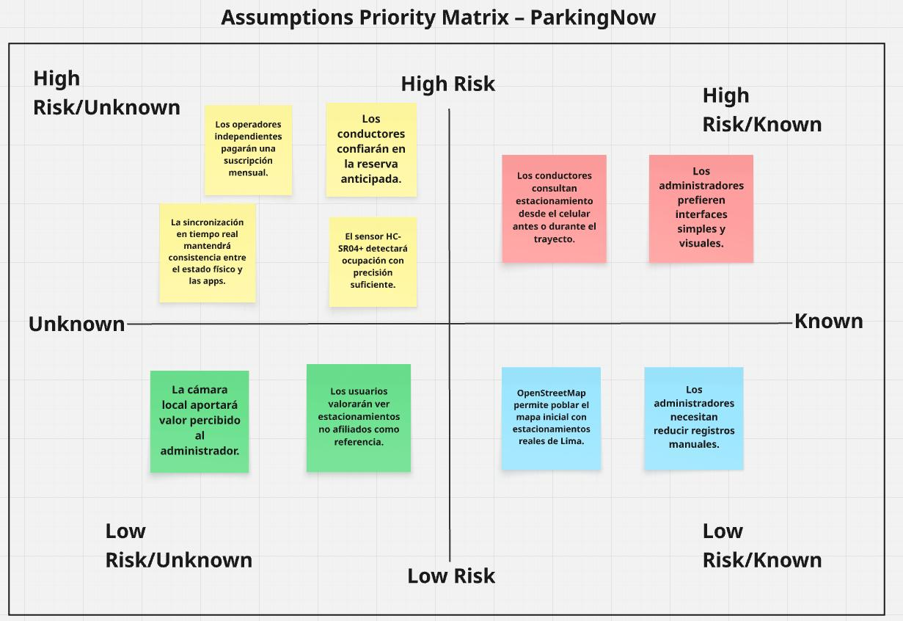

**Nota.** Elaboración propia (2026).

A fin de complementar la lectura de la matriz, la siguiente tabla resume la clasificación de cada assumption priorizada según su nivel de riesgo, tomando como referencia directa los cuadrantes de la figura:

| Assumption | Cuadrante | Nivel de riesgo |
|---|---|---|
| Los operadores independientes pagarán una suscripción mensual | High Risk / Unknown | Alto |
| Los conductores confiarán en la reserva anticipada | High Risk / Unknown | Alto |
| La sincronización en tiempo real mantendrá consistencia entre el estado físico y las apps | High Risk / Unknown | Alto |
| El sensor HC-SR04+ detectará ocupación con precisión suficiente | High Risk / Unknown | Alto |
| Los conductores consultan estacionamiento desde el celular antes o durante el trayecto | High Risk / Known | Alto |
| Los administradores prefieren interfaces simples y visuales | High Risk / Known | Alto |
| Los usuarios valorarán ver estacionamientos no afiliados como referencia | Low Risk / Unknown | Bajo |
| La cámara local aportará valor percibido al administrador | Low Risk / Unknown | Bajo |
| OpenStreetMap permite poblar el mapa inicial con estacionamientos reales de Lima | Low Risk / Known | Bajo |
| Los administradores necesitan reducir registros manuales | Low Risk / Known | Bajo |

A partir de esta priorización, se consideran como supuestos de **alto riesgo y alto nivel de incertidumbre** los siguientes, por ubicarse en el cuadrante High Risk / Unknown de la matriz:

- Que los operadores independientes estén realmente dispuestos a pagar una suscripción mensual por digitalizar su operación.
- Que los sensores HC-SR04+ mantengan una detección suficientemente confiable del estado de ocupación en condiciones normales del prototipo.
- Que los conductores confíen en la reserva anticipada como mecanismo útil y adopten la plataforma como parte de su rutina.
- Que la sincronización entre el estado físico detectado y la información mostrada en las aplicaciones mantenga consistencia suficiente para generar confianza en ambos segmentos.

**Enlace a Miro:** [Assumptions Priority Matrix de ParkingNow](https://miro.com/welcomeonboard/WHNrZVNha3RDZ2pQdCtHbklaRkNBcXpCRWtvN3FyMVNOTnkwSU45UkU5NHI5UTM3QXZLUm5UZ1diZEZTbndybDdYZGkzZzVXQjZWMDRqdW40UkgwdFVmQnUraUd4TE1vQmR5bitqV3AzWkRyU2JCdnJ0Q0hDZFh1Zk56UUlFTTNNakdSWkpBejJWRjJhRnhhb1UwcS9BPT0hdjE=?share_link_id=755799786282)

---

#### 1.2.2.3. Lean UX Hypothesis Statements

> Las siguientes hipótesis se formulan a partir de la plantilla de hipótesis de Lean UX y buscan vincular de manera explícita un resultado de negocio esperado con un segmento de usuario, un beneficio observable y una funcionalidad concreta de la solución. Su propósito es orientar la validación progresiva del producto en iteraciones posteriores, sin asumir que estos resultados han sido demostrados en la presente entrega.

##### Hypothesis Statement #1

**Creemos que** reducir el tiempo de búsqueda de estacionamiento de los conductores urbanos en Lima Metropolitana **se logrará si** los conductores **consiguen** identificar espacios disponibles y reservarlos anticipadamente **con** una aplicación móvil que muestre disponibilidad en tiempo real y permita la reserva antes de llegar al destino.  
**Sabremos que estamos en lo correcto cuando veamos** que al menos el 40% de los usuarios completa una reserva exitosa en menos de 5 minutos desde el inicio de la búsqueda y que una mayoría de usuarios valida que redujo recorridos innecesarios para encontrar estacionamiento.

##### Hypothesis Statement #2

**Creemos que** mejorar la tasa de ocupación de los estacionamientos independientes afiliados **se logrará si** los administradores **consiguen** mayor visibilidad digital de sus espacios y captación de demanda **con** una plataforma que exponga su disponibilidad al conductor y permita la gestión digital de reservas.  
**Sabremos que estamos en lo correcto cuando veamos** un incremento de al menos 15% en la cantidad de reservas completadas de los estacionamientos afiliados durante el periodo de validación y retroalimentación positiva de los operadores respecto al impacto de la plataforma en su nivel de ocupación.

##### Hypothesis Statement #3

**Creemos que** incrementar la confianza del conductor en la disponibilidad mostrada por la plataforma **se logrará si** los conductores **consiguen** percibir consistencia entre la información digital y el estado real del espacio **con** una solución conectada a un nodo IoT que actualice automáticamente el estado de ocupación.  
**Sabremos que estamos en lo correcto cuando veamos** que al menos el 80% de los usuarios que completan reservas reporta satisfacción con la correspondencia entre el espacio mostrado como disponible y el espacio efectivamente encontrado al llegar al estacionamiento.

##### Hypothesis Statement #4

**Creemos que** reducir la carga operativa manual del administrador de estacionamiento **se logrará si** los administradores **consiguen** centralizar el monitoreo de ocupación, reservas y eventos operativos **con** un panel web conectado al estado actualizado de los espacios y al historial generado por el nodo IoT.  
**Sabremos que estamos en lo correcto cuando veamos** que al menos el 70% de los administradores participantes reporta una disminución significativa en el uso de registros manuales y una mejora en su capacidad de supervisar la operación diaria desde un único canal digital.

##### Hypothesis Statement #5

**Creemos que** facilitar la afiliación progresiva de estacionamientos independientes a la plataforma **se logrará si** los operadores **consiguen** percibir beneficios claros de visibilidad, control operativo y potencial incremento de demanda **con** una solución accesible, de bajo costo relativo y sencilla de implementar en negocios de pequeña escala.  
**Sabremos que estamos en lo correcto cuando veamos** que al menos el 60% de los operadores que participan en etapas iniciales de validación expresa intención de mantener el servicio, y que una parte de ellos manifiesta disposición a recomendar la solución a otros operadores.

##### Hypothesis Statement #6 *(Técnica)*

**Creemos que** lograr una detección confiable del estado de ocupación de los espacios **se logrará si** el sistema **consigue** distinguir de forma consistente entre espacio libre y espacio ocupado **con** sensores ultrasónicos HC-SR04+ conectados a un nodo ESP32 con lógica local de validación y envío de eventos.  
**Sabremos que estamos en lo correcto cuando veamos** que, durante las pruebas del prototipo, el nodo IoT alcanza una precisión mayor al 90% en la detección del estado de los espacios y mantiene bajos niveles de falsos positivos y falsos negativos en condiciones normales de operación.

---

#### 1.2.2.4. Lean UX Canvas

A continuación se presenta el Lean UX Canvas elaborado para el proyecto, como síntesis visual de los principales elementos del proceso Lean UX: el problema de negocio identificado, los segmentos priorizados, los beneficios esperados, las hipótesis centrales y los aprendizajes prioritarios que orientan el desarrollo del producto.

**Figura 2**  
*Lean UX Canvas de ParkingNow para el dominio de gestión de estacionamientos urbanos en Lima Metropolitana*

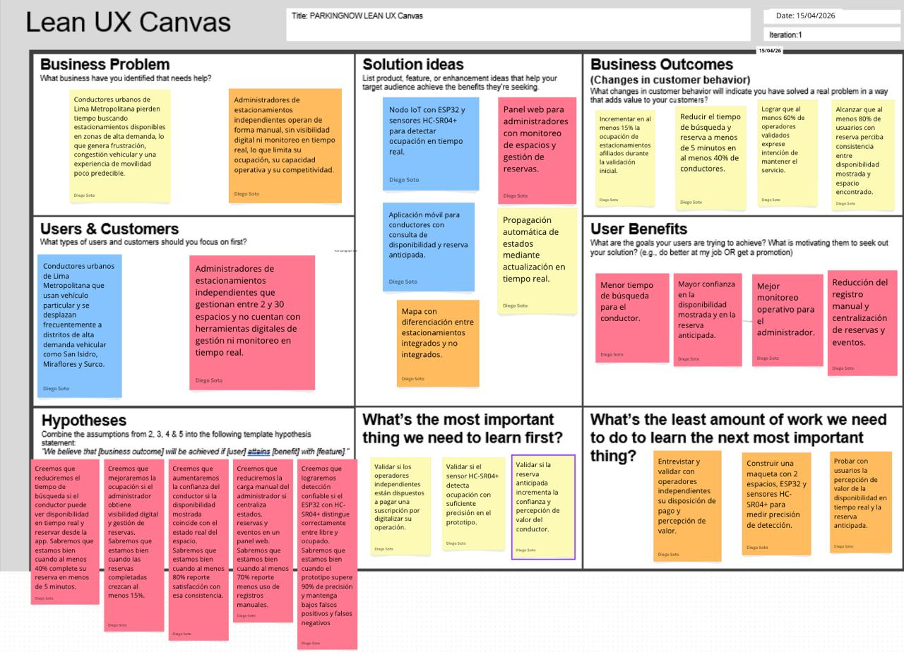

**Nota.** Elaboración propia (2026). Iteración 1.

> Según la Figura 2, el Lean UX Canvas identifica como problema central la desconexión entre el estado físico real de los espacios y los canales digitales de información. Esta brecha afecta tanto a conductores urbanos, que pierden tiempo buscando disponibilidad, como a administradores independientes, que operan sin visibilidad ni herramientas digitales.
>
> Las ideas de solución se articulan en torno a una plataforma distribuida con sensado IoT, reservas anticipadas mediante aplicación móvil, un panel web de monitoreo para el operador, propagación automática de estados y diferenciación entre estacionamientos integrados y no integrados. Los *business outcomes* priorizan la mejora de ocupación de los estacionamientos afiliados, la reducción del tiempo de búsqueda y reserva, la intención de permanencia de operadores y la confianza del usuario en la consistencia entre disponibilidad mostrada y espacio encontrado.
>
> El Lean UX Canvas sintetiza los elementos principales del proceso Lean UX, por lo que no reproduce de forma literal todas las assumptions e hipótesis desarrolladas en las secciones anteriores, sino que prioriza aquellas de mayor impacto para la validación inicial del producto. Los aprendizajes prioritarios a contrastar en las primeras iteraciones consisten en determinar si los operadores independientes están dispuestos a pagar por digitalizar su operación, si el sensor HC-SR04+ detecta la ocupación con precisión suficiente en el prototipo, y si la reserva anticipada incrementa la confianza y percepción de valor del conductor. Estos elementos deben entenderse como hipótesis iniciales sujetas a validación, y no como resultados demostrados en la presente fase.

**Enlace al canvas:** [Lean UX Canvas de ParkingNow](https://canva.link/jukpsaamxd32d5t)

---

## 1.3. Segmentos objetivo

Los segmentos objetivo de **ParkingNow** han sido identificados a partir del análisis del dominio del problema asociado a la gestión de estacionamientos urbanos en Lima Metropolitana. La solución se orienta a dos grupos con necesidades distintas pero complementarias: por un lado, los conductores urbanos que requieren encontrar y reservar estacionamiento de manera más eficiente; por otro, los administradores de estacionamientos independientes que necesitan mejorar la gestión operativa y la visibilidad de sus espacios. A continuación, se presenta la descripción de cada segmento, junto con sus características demográficas e información estadística de sustento.

---

### Segmento 1: Conductores urbanos

**Descripción:**  
Este segmento comprende a personas que se movilizan habitualmente en vehículo particular por Lima Metropolitana y que enfrentan de forma recurrente la dificultad de encontrar estacionamiento disponible en zonas de alta demanda vehicular. Constituyen los usuarios finales de la aplicación móvil de ParkingNow, mediante la cual podrán consultar disponibilidad, ubicar estacionamientos cercanos en el mapa, realizar reservas anticipadas y gestionar su historial de uso.

**Características demográficas:**

- **Edad:** Entre 25 y 45 años, con mayor concentración en población económicamente activa que trabaja o estudia en distritos de alta demanda vehicular.
- **Género:** Hombres y mujeres con vehículo propio o acceso frecuente a uno.
- **Ubicación:** Residen, estudian o trabajan en Lima Metropolitana, con desplazamientos frecuentes a distritos como San Isidro, Miraflores, Surco, La Molina, Lince y el Centro Histórico.
- **Perfil económico y de movilidad:** Usuarios económicamente activos con uso frecuente de vehículo particular en sus desplazamientos cotidianos.
- **Perfil tecnológico:** Usuarios habituales de smartphones con sistema operativo Android o iOS, familiarizados con aplicaciones de mapas, movilidad y servicios digitales como Google Maps, Waze, Uber o Rappi.

**Información estadística de sustento:**  
En Lima Metropolitana circulan aproximadamente 1.8 millones de automóviles, de los cuales el 11.2% de la población los utiliza para desplazarse al trabajo y el 7.9% para estudiar (El Comercio, 2024). Asimismo, el 51.1% de los encuestados en Lima y Callao considera necesario incrementar los estacionamientos en vía pública, porcentaje que asciende al 70.1% en el sector socioeconómico A, lo que evidencia una alta percepción de insuficiencia en la oferta actual (Lima Cómo Vamos, 2024). A ello se suma que el informe *Cities in Motion 2025* ubicó a Lima en el puesto 176 en movilidad urbana a nivel mundial, reflejando un entorno crítico para el desplazamiento vehicular (Infobae, 2025a). Finalmente, el flujo vehicular nacional acumula 27 meses de crecimiento consecutivo, con un incremento de 3.5% acumulado entre agosto de 2024 y julio de 2025 (AAP, 2025), lo que proyecta una presión creciente sobre la infraestructura de estacionamiento en los próximos años.

---

### Segmento 2: Administradores de estacionamientos independientes

**Descripción:**  
Este segmento comprende a dueños y administradores de estacionamientos independientes de Lima Metropolitana que operan entre 2 y 30 espacios, generalmente bajo esquemas manuales o semi-formales y sin herramientas digitales integradas de gestión. Constituyen el cliente pagador principal de ParkingNow y los usuarios directos del panel web de la plataforma, desde el cual podrán registrar su local, configurar sus espacios, monitorear el estado de ocupación en tiempo real, gestionar reservas activas y consultar el historial de eventos generados por el nodo IoT instalado en su establecimiento.

**Características demográficas:**

- **Edad:** Entre 20 y 60 años, incluyendo tanto administradores jóvenes vinculados a negocios familiares como operadores con mayor experiencia en el sector.
- **Ubicación:** Operan estacionamientos ubicados en distritos de alta densidad comercial y residencial de Lima, especialmente en zonas próximas a centros empresariales, universidades, hospitales, mercados y áreas de alta concurrencia.
- **Nivel tecnológico:** Bajo o intermedio en términos de adopción de herramientas digitales. En muchos casos, la operación todavía se apoya en registros manuales o procedimientos informales.
- **Perfil de negocio:** Microempresas o negocios familiares con recursos limitados, sensibilidad al costo de implementación y orientación a resultados concretos, como mayor ocupación, mejor control operativo y mayor captación de clientes.
- **Necesidad operativa:** Requieren soluciones accesibles, fáciles de usar y con beneficios observables en la gestión diaria del estacionamiento.

**Información estadística de sustento:**  
Lima presenta una informalidad persistente en la gestión del estacionamiento urbano. Reportes periodísticos recientes documentan que, en múltiples distritos de la capital, la presencia de parqueadores informales y el uso no regulado del espacio urbano han debilitado la operación formal del sector (Infobae, 2024). Este fenómeno se inscribe en un contexto de alta informalidad estructural: según el Instituto Nacional de Estadística e Informática, la tasa de empleo informal en el Perú cerró 2024 en 70.9%, con Lima Metropolitana concentrando 3.9 millones de trabajadores en esa condición (INEI, 2025).

Desde la perspectiva de la adopción tecnológica, los estacionamientos independientes operan bajo el mismo perfil que las microempresas del sector servicios, que representan el 95.6% del universo empresarial formal peruano (Ministerio de la Producción [PRODUCE], 2024a). En julio de 2024, la Encuesta de Transformación Digital de las Empresas elaborada por PRODUCE registró que la brecha digital en el segmento de microempresas alcanza el 52% respecto a la plena madurez digital, frente al 38% de las grandes empresas (PRODUCE, 2024b). Este dato confirma que las unidades de pequeña escala enfrentan barreras estructurales significativas para incorporar herramientas tecnológicas de gestión, incluso cuando la conectividad básica está disponible. Cabe precisar que no existen estadísticas sectoriales específicas sobre digitalización en el subsector de estacionamientos independientes en Lima; el sustento aquí presentado se apoya en la analogía con el perfil MYPE del sector servicios, que resulta consistente con las características operativas identificadas en las entrevistas realizadas.

Desde una perspectiva técnica y económica, la literatura reciente sobre *Smart Parking* respalda la pertinencia de este segmento como usuario objetivo, ya que soluciones basadas en ESP32 y sensores ultrasónicos permiten implementar sistemas de monitoreo de ocupación con costos accesibles y una complejidad técnica adecuada para contextos de pequeña escala (Ruiz Cruzado et al., 2026; Bustamante & Hidrobo, 2024).

---

### Priorización de segmentos

Estos segmentos fueron priorizados porque representan, respectivamente, al usuario final que demanda disponibilidad confiable de estacionamiento y al cliente pagador que obtiene valor operativo y económico directo de la solución. En conjunto, ambos permiten articular la propuesta de valor de ParkingNow: la capa IoT valida la disponibilidad física, la aplicación móvil reduce la incertidumbre del conductor y el panel web mejora la gestión del administrador.

La relación entre ambos segmentos es complementaria. Los conductores necesitan información confiable para tomar mejores decisiones de movilidad, mientras que los administradores necesitan visibilidad digital, control operativo y mayor captación de demanda. Esta interdependencia justifica el enfoque B2B2C de ParkingNow y sustenta la necesidad de diseñar una experiencia equilibrada para ambos actores.

# Capítulo II: Requirements Elicitation & Analysis

En este capítulo se desarrolla el proceso de levantamiento y análisis de requisitos para **ParkingNow**, con el objetivo de transformar las necesidades, frustraciones y expectativas de los segmentos objetivo en una base coherente para la especificación funcional del producto. Para ello, se analiza primero el contexto competitivo del mercado de soluciones digitales para estacionamientos y, posteriormente, se documenta el proceso de entrevistas, análisis de hallazgos, artefactos de needfinding, Big Picture EventStorming y definición del Ubiquitous Language del dominio.

El capítulo permite establecer trazabilidad entre el problema identificado en el Capítulo I, los usuarios afectados, los hallazgos obtenidos en campo y los elementos principales del dominio que serán utilizados en los capítulos posteriores de especificación de requisitos y diseño de solución.

## 2.1. Competidores

ParkingNow compite en el mercado de soluciones digitales para la búsqueda, reserva y gestión de estacionamientos urbanos en Lima Metropolitana. Para el presente análisis se han considerado como competidores relevantes a **Quadra**, **ParkGo** y **Apparka**, debido a que participan en el mismo dominio funcional o atienden necesidades cercanas dentro de la experiencia de estacionamiento del conductor.

En esta clasificación, **Quadra** y **ParkGo** se consideran **competidores directos**, ya que sus propuestas visibles al mercado se centran en conectar digitalmente la oferta y demanda de espacios de estacionamiento o cocheras. Por su parte, **Apparka** se considera un **competidor indirecto relevante**, debido a que también compite en la experiencia digital del conductor, aunque opera dentro de una red formal, cerrada y propia de estacionamientos perteneciente al grupo Los Portales.

En este contexto, ParkingNow participa en el mismo dominio de movilidad y estacionamiento, pero busca diferenciarse mediante una propuesta orientada a respaldar la disponibilidad reportada con sensado físico IoT, trazabilidad operativa y una arquitectura adaptada a operadores independientes de pequeña escala.

**Quadra** es una empresa peruana que opera como marketplace y ecosistema digital de estacionamientos, conectando conductores con cocheras privadas, emprendedores y empresas mediante aplicaciones móviles y un componente SaaS. Su comunicación pública destaca reservas, tickets digitales, monitoreo de disponibilidad, automatización, integración con add-ons de hardware y planes empresariales orientados a optimizar ocupación y accesos. Sin embargo, en la información pública revisada no se evidencia una propuesta centrada explícitamente en sensado físico por espacio con trazabilidad end-to-end orientada a operadores independientes de 2 a 30 espacios, como la planteada por ParkingNow.

**ParkGo** es una aplicación peruana creada por Katherinne Oyarce que conecta conductores con cocheras disponibles y busca reducir el tiempo necesario para encontrar estacionamiento. Una nota de *El Comercio* indica que la aplicación suma 4,500 usuarios en Lima Metropolitana, Arequipa, Cusco y Huarmey, y que ha observado un crecimiento del 40% en el último año. Su propuesta visible al mercado se centra en la conexión digital entre oferta y demanda de espacios, sin que en la información pública revisada se evidencie una capa de sensado físico del espacio equivalente a la propuesta por ParkingNow.

**Apparka** es la plataforma digital del grupo Los Portales orientada a la ubicación y gestión de estacionamientos dentro de su propia red. La memoria anual del grupo señala que APPARKA es de uso exclusivo en los estacionamientos de Los Portales y permite ubicar el estacionamiento más cercano, además de realizar pagos desde el celular (Los Portales, 2024). En consecuencia, compite en la experiencia digital del conductor dentro del mercado formal, pero no está orientada a operadores independientes de pequeña escala.

### 2.1.1. Análisis competitivo

<table>
  <thead>
    <tr>
      <th colspan="6" align="left">Competitive Analysis Landscape</th>
    </tr>
    <tr>
      <th align="left">¿Por qué llevar a cabo este análisis?</th>
      <th colspan="5" align="left">Identificar las fortalezas, debilidades, oportunidades y amenazas de los principales competidores permite delimitar la propuesta diferenciada de ParkingNow en el mercado local: integrar detección física del estado del espacio con canales digitales de información y gestión, priorizando a operadores independientes de pequeña escala.</th>
    </tr>
    <tr>
      <th colspan="2" align="left">Startup / Competidores</th>
      <th>ParkingNow </th>
      <th>Quadra </th>
      <th>ParkGo </th>
      <th>Apparka </th>
    </tr>
  </thead>
  <tbody>
    <tr>
      <th rowspan="2" valign="middle">Perfil</th>
      <td><strong>Overview</strong></td>
      <td>Startup tecnológica peruana con una propuesta de plataforma IoT distribuida, compuesta por aplicación móvil para conductores, panel web para administradores independientes y nodo IoT orientado a detectar ocupación y reflejarla digitalmente en tiempo real.</td>
      <td>Empresa peruana con aplicación para conductores, aplicación para anfitriones o emprendedores y componente SaaS para negocios. Su propuesta visible incluye reservas, tickets digitales, monitoreo de disponibilidad, automatización y add-ons de hardware.</td>
      <td>Aplicación peruana que conecta conductores con cocheras disponibles. La cobertura reportada comprende Lima Metropolitana, Arequipa, Cusco y Huarmey, con 4,500 usuarios y crecimiento anual del 40% según <em>El Comercio</em>.</td>
      <td>Plataforma digital del grupo Los Portales para ubicar y pagar estacionamientos dentro de su propia red. Su uso está restringido a los estacionamientos del grupo.</td>
    </tr>
    <tr>
      <td><strong>Ventaja competitiva</strong> ¿Qué valor ofrece a los clientes?</td>
      <td>Disponibilidad respaldada por detección física IoT y propuesta adaptada a operadores independientes de pequeña escala con baja inversión tecnológica inicial.</td>
      <td>Ecosistema digital más amplio para marketplace y gestión, con reservas, tickets digitales, automatización y opciones empresariales.</td>
      <td>Tracción visible en el mercado, crecimiento reciente y propuesta simple de conexión entre conductores y cocheras disponibles.</td>
      <td>Respaldo financiero y reputacional de Los Portales, además de una red consolidada de estacionamientos formales.</td>
    </tr>
    <tr>
      <th rowspan="2" valign="middle">Perfil de Marketing</th>
      <td><strong>Mercado objetivo</strong></td>
      <td>Conductores urbanos de Lima Metropolitana de 25 a 45 años y administradores de estacionamientos independientes de 2 a 30 espacios ubicados en distritos de alta demanda vehicular.</td>
      <td>Conductores urbanos, propietarios de cocheras privadas, emprendedores y empresas que desean monetizar o gestionar espacios de estacionamiento.</td>
      <td>Conductores urbanos que buscan cocheras disponibles y propietarios de espacios que desean rentabilizarlos.</td>
      <td>Conductores urbanos y usuarios frecuentes de la red formal de estacionamientos del grupo Los Portales.</td>
    </tr>
    <tr>
      <td><strong>Estrategias de marketing</strong></td>
      <td>Afiliación directa de operadores independientes, propuesta de valor basada en disponibilidad respaldada por sensado físico, integración con OpenStreetMap para utilidad temprana y presencia digital en zonas de alta demanda.</td>
      <td>Presencia web y aplicaciones para distintos perfiles, posicionamiento en monetización de cocheras y gestión digital del estacionamiento.</td>
      <td>Cobertura mediática reciente y posicionamiento como solución práctica para reducir el tiempo de búsqueda de estacionamiento.</td>
      <td>Marketing institucional y aprovechamiento de la red física, reputación y marca del grupo Los Portales.</td>
    </tr>
    <tr>
      <th rowspan="3" valign="middle">Perfil de Producto</th>
      <td><strong>Productos & Servicios</strong></td>
      <td>Aplicación móvil para conductores, panel web para administradores, reserva anticipada, monitoreo de espacios y nodo IoT físico con sincronización de estados en tiempo real.</td>
      <td>Aplicación para conductores, aplicación para anfitriones o emprendedores, servicios empresariales, tickets digitales, reservas y funcionalidades SaaS con automatización.</td>
      <td>Aplicación móvil para ubicar cocheras disponibles y conectar digitalmente oferta y demanda de espacios.</td>
      <td>Aplicación móvil para ubicar estacionamientos y realizar pagos dentro de la red de Los Portales.</td>
    </tr>
    <tr>
      <td><strong>Precios & Costos</strong></td>
      <td>Modelo proyectado de suscripción mensual para operadores afiliados, con costo de entrada reducido y eventual costo inicial de instalación del nodo IoT.</td>
      <td>Cuenta con un modelo para emprendedores basado en comisión por reserva exitosa y planes SaaS empresariales con costos mensuales e instalación.</td>
      <td>La propuesta pública se sostiene en la intermediación entre conductores y cocheras; la nota periodística revisada no detalla una estructura tarifaria técnica completa.</td>
      <td>Las funciones de la aplicación operan dentro del ecosistema comercial del grupo y sus servicios asociados de estacionamiento.</td>
    </tr>
    <tr>
      <td><strong>Canales de distribución</strong> (Web y/o Móvil)</td>
      <td>Landing Page, Web App para administradores y Mobile App para conductores.</td>
      <td>Web, aplicación para conductor, aplicación para empresario, aplicación para persona natural y oferta SaaS.</td>
      <td>Aplicación móvil y presencia digital respaldada por cobertura periodística.</td>
      <td>Aplicación móvil y red física de estacionamientos del grupo Los Portales.</td>
    </tr>
    <tr>
      <th rowspan="4" valign="middle">Análisis SWOT</th>
      <td><strong>Fortalezas</strong></td>
      <td>Integración entre detección física del estado del espacio y actualización digital en tiempo real; arquitectura de bajo costo; enfoque específico en operadores independientes; trazabilidad entre evento físico, reserva y estado digital.</td>
      <td>Ecosistema digital más desarrollado, automatización, marketplace activo y alternativas para emprendedores y empresas.</td>
      <td>Tracción reciente visible, crecimiento y cobertura en más de una ciudad.</td>
      <td>Respaldo financiero y operativo del grupo Los Portales y red consolidada de estacionamientos formales.</td>
    </tr>
    <tr>
      <td><strong>Debilidades</strong></td>
      <td>Prototipo académico en etapa inicial; red de afiliados por construir; dependencia de instalación física del nodo IoT en cada local; necesidad de validar precisión del sensor en condiciones reales.</td>
      <td>En la información pública revisada no se evidencia una propuesta explícita de sensado físico por espacio orientada a operadores independientes pequeños como la de ParkingNow.</td>
      <td>En la información pública revisada no se evidencia una capa de sensado físico del espacio equivalente a la propuesta por ParkingNow.</td>
      <td>Limitado a la red formal de Los Portales; no orientado a operadores independientes de pequeña escala.</td>
    </tr>
    <tr>
      <td><strong>Oportunidades</strong></td>
      <td>Alta informalidad del sector en Lima; crecimiento vehicular sostenido; oportunidad de entrada en operadores pequeños con baja digitalización; necesidad de información confiable para reducir incertidumbre del conductor.</td>
      <td>Expansión del mercado de cocheras privadas y posible profundización tecnológica de su ecosistema.</td>
      <td>Expansión territorial y fortalecimiento de propuesta con nuevos diferenciales tecnológicos.</td>
      <td>Mayor integración con servicios del ecosistema de movilidad y crecimiento del uso de su red formal.</td>
    </tr>
    <tr>
      <td><strong>Amenazas</strong></td>
      <td>Competidores con mayor tracción y recursos; posible replicación del modelo IoT; curva de adopción del hardware por parte de operadores con bajo perfil tecnológico; desconfianza inicial si la disponibilidad mostrada falla.</td>
      <td>Entrada de competidores con mayor diferenciación basada en sensado físico y mayor profundidad en integración operativo-digital.</td>
      <td>Competencia creciente y necesidad de diferenciarse más allá del marketplace digital.</td>
      <td>Competidores digitales más ágiles dirigidos a operadores independientes y restricciones propias de operar sobre una red cerrada.</td>
    </tr>
  </tbody>
</table>

### 2.1.2. Estrategias y tácticas frente a competidores

A partir del análisis SWOT realizado en la sección anterior, se proponen estrategias y tácticas preliminares para responder a las fortalezas de los competidores, aprovechar sus debilidades y actuar sobre las oportunidades y amenazas identificadas en el mercado de gestión de estacionamientos urbanos en Lima Metropolitana.

**Estrategia 1: Diferenciación sostenida por disponibilidad respaldada físicamente**

Esta estrategia responde a una debilidad observada en Quadra y ParkGo: en la información pública revisada no se evidencia una propuesta centrada explícitamente en sensado físico por espacio orientada a operadores independientes de pequeña escala. En ese escenario, ParkingNow puede diferenciarse al comunicar que la disponibilidad mostrada al conductor se encuentra respaldada por detección física del estado del espacio dentro de una arquitectura IoT adaptada al contexto operativo de este segmento.

- Comunicar en canales digitales que la disponibilidad mostrada por ParkingNow está respaldada por detección física del espacio.
- Incorporar en la interfaz del conductor un indicador visual que distinga espacios afiliados con verificación IoT de espacios no afiliados cargados desde OpenStreetMap.
- Desarrollar contenido explicativo sobre la diferencia entre disponibilidad declarativa y disponibilidad respaldada físicamente.
- Usar la trazabilidad entre sensor, backend y aplicación como argumento técnico de diferenciación.

**Estrategia 2: Penetración directa en el segmento de operadores independientes**

Esta estrategia aprovecha una oportunidad detectada para ParkingNow: la existencia de operadores pequeños con baja digitalización, poco atendidos por soluciones cerradas o por marketplaces orientados a intermediación general. Mientras Apparka se concentra en la red de Los Portales y Quadra/ParkGo priorizan la conexión digital entre conductores y espacios disponibles, ParkingNow puede enfocarse directamente en administradores de estacionamientos independientes de 2 a 30 espacios.

- Diseñar una propuesta de afiliación de bajo costo de entrada, con hardware accesible y proceso de incorporación guiado.
- Elaborar materiales de presentación en lenguaje sencillo para explicar beneficios directos: visibilidad digital, más reservas, reducción de errores y monitoreo remoto.
- Priorizar la afiliación inicial en distritos de alta demanda vehicular como San Isidro, Miraflores, Surco y San Miguel.
- Evaluar un periodo inicial de prueba o adopción asistida para reducir barreras de entrada.
- Acompañar la instalación inicial del nodo IoT con capacitación breve para el administrador y su personal de apoyo.

**Estrategia 3: Construcción de utilidad temprana y red inicial mediante OpenStreetMap**

Esta estrategia responde al riesgo inicial de contar con una red propia de afiliados todavía reducida. En etapas tempranas, ParkingNow puede disminuir ese problema utilizando OpenStreetMap para poblar el mapa con estacionamientos reales de Lima Metropolitana, diferenciando visualmente entre estacionamientos afiliados y no afiliados. Esta táctica permite ofrecer utilidad al conductor desde el primer uso y, al mismo tiempo, fortalecer la propuesta comercial frente a operadores potenciales.

- Integrar la carga de estacionamientos desde OpenStreetMap desde etapas tempranas de desarrollo.
- Diferenciar visualmente en el mapa los estacionamientos afiliados con verificación IoT de los no afiliados que solo sirven como referencia.
- Utilizar la densidad inicial del mapa como argumento de valor en la propuesta comercial para operadores.
- Actualizar periódicamente los datos cartográficos para mantener la relevancia del mapa frente a la oferta real de la ciudad.
- Evitar que los estacionamientos no afiliados generen falsa expectativa de reserva o disponibilidad en tiempo real.

**Estrategia 4: Posicionamiento local frente a la crisis de movilidad**

Esta estrategia aprovecha el contexto local de congestión vehicular y presión creciente sobre la infraestructura de estacionamiento en Lima. Frente a competidores con mayor tracción o respaldo empresarial, ParkingNow puede posicionarse como una solución local, práctica y enfocada en un problema cotidiano no resuelto para conductores y operadores independientes. La narrativa debe centrarse en relevancia local, confianza y educación del mercado, más que en promesas amplias de transformación urbana.

- Desarrollar contenido en redes sociales y blog corporativo que vincule el problema de estacionamiento en Lima con la propuesta diferencial de ParkingNow.
- Tomar como referencia la cobertura mediática obtenida por competidores como ParkGo para evaluar alianzas con medios especializados en movilidad y tecnología.
- Posicionar a ParkingNow como una solución práctica para conductores y operadores en distritos de alta demanda vehicular.
- Reforzar la idea de que el producto no solo ayuda al conductor, sino que también ordena la operación del administrador independiente.

## 2.2. Entrevistas

En esta sección se documenta el proceso de recolección de información primaria mediante entrevistas a representantes de los dos segmentos objetivo de ParkingNow: conductores urbanos de Lima Metropolitana y administradores de estacionamientos independientes. El objetivo es obtener datos cualitativos reales que permitan identificar necesidades, comportamientos, frustraciones y expectativas de cada segmento, como base para construir los arquetipos de usuario, los Empathy Maps, los User Journey Maps y, posteriormente, los User Stories del producto.

Las entrevistas permiten validar preliminarmente si la problemática identificada en el Capítulo I aparece en situaciones reales de movilidad y operación. Asimismo, permiten observar qué condiciones deberían cumplirse para que cada segmento confíe en una solución digital de estacionamiento basada en información actualizada y sensado físico.

---

### 2.2.1. Diseño de entrevistas

A continuación se presenta la relación de preguntas principales y complementarias diseñadas para cada segmento objetivo. Las preguntas fueron organizadas en bloques para asegurar consistencia entre entrevistas y permitir la comparación posterior de hallazgos. Estas se orientan a recolectar características demográficas —edad, género, distrito, estado civil, ocupación y familia— y características subjetivas —motivaciones, frustraciones, referentes de uso, dispositivos de preferencia, canales digitales de interacción y comportamiento actual—, con el fin de contar con información suficiente para construir los arquetipos de usuario de ParkingNow.

---

#### Segmento 1: Conductores Urbanos

##### Preguntas principales

1. ¿Cuántos años tienes?
2. ¿En qué distrito resides actualmente y cuál es tu estado civil?
3. ¿Tienes hijos o personas a tu cargo?
4. ¿Cuál es tu ocupación actual? ¿Trabajas, estudias o ambas cosas?
5. ¿Tienes vehículo propio? ¿Con qué frecuencia lo usas para desplazarte por Lima?
6. ¿Qué zonas de Lima visitas más frecuentemente con tu vehículo?
7. Cuando necesitas estacionar en una zona que no conoces bien, ¿cómo te preparas antes de salir? ¿Consultas algo en tu teléfono o simplemente vas?
8. ¿Cuánto tiempo estimas que demoras en promedio en encontrar un espacio disponible en zonas como San Isidro, Miraflores o Surco?
9. ¿Has llegado alguna vez a un estacionamiento y estaba completamente lleno? ¿Qué hiciste en ese momento?
10. ¿Con qué frecuencia te ocurre no encontrar estacionamiento disponible al llegar a tu destino?
11. Si existiera una aplicación móvil que te mostrara en tiempo real qué estacionamientos cercanos tienen espacios libres antes de que llegues, ¿la usarías? ¿Qué necesitarías para confiar en esa información?
12. ¿Estarías dispuesto a reservar un espacio desde tu teléfono antes de salir si eso te garantizara encontrar lugar al llegar?
13. ¿Qué aplicaciones móviles usas con más frecuencia en tu día a día?
14. ¿Usas Android o iOS? ¿Qué navegador usas habitualmente en tu celular?
15. ¿Qué es lo que más te frustra al buscar estacionamiento en Lima?

##### Preguntas complementarias

16. ¿Qué haces cuando no encuentras estacionamiento cerca de tu destino? ¿Das vueltas, cambias de plan o buscas transporte alternativo?
17. ¿Qué tan importante es para ti saber que la disponibilidad mostrada en la aplicación está respaldada por un sensor físico real, y no solo por datos ingresados manualmente por el dueño del estacionamiento?
18. ¿Hay alguna aplicación móvil que consideres muy bien hecha? ¿Qué es lo que más valoras de ella?
19. ¿Qué haría que dejes de usar una aplicación de estacionamiento después de probarla? ¿Y qué haría que la recomiendes a alguien?

---

#### Segmento 2: Administradores de Estacionamientos Independientes

##### Preguntas principales

1. ¿Cuántos años tienes?
2. ¿En qué distrito está ubicado tu estacionamiento?
3. ¿Cuántos espacios tiene tu local actualmente?
4. ¿Cuánto tiempo llevas administrándolo?
5. ¿Operas solo o tienes personal de apoyo?
6. ¿Cómo controlas actualmente qué espacios están ocupados y cuáles están libres? ¿Usas algún sistema o es completamente manual?
7. ¿Cómo se enteran los conductores de que tu estacionamiento tiene espacios disponibles antes de llegar?
8. ¿Puedes saber en tiempo real cuántos espacios tienes ocupados si no estás físicamente en el local? ¿Cómo lo resuelves?
9. ¿Has tenido situaciones en que llegaron conductores esperando encontrar espacio y ya no había disponibilidad? ¿Cómo lo manejas?
10. ¿Qué parte de tu operación diaria te consume más tiempo o te genera más errores?
11. Si hubiera una plataforma web donde pudieras publicar tu estacionamiento y los conductores de la zona pudieran verte y reservar en línea, ¿te interesaría afiliar tu local? ¿Qué te preocuparía?
12. ¿Estarías dispuesto a instalar un sensor pequeño por espacio para que la disponibilidad se actualice automáticamente en la plataforma? ¿Qué condiciones necesitarías para aceptarlo?
13. ¿Desde qué dispositivo prefieres gestionar tu negocio: computadora, tablet o celular? ¿Cuál usas más en tu día a día?
14. ¿Usas alguna herramienta digital actualmente para gestionar tu negocio? ¿Cuál y para qué?
15. ¿Qué es lo que más te frustra del día a día en la gestión de tu local?

##### Preguntas complementarias

16. ¿Qué beneficio concreto necesitarías ver para considerar que vale la pena digitalizar tu operación? ¿Más reservas, menos trabajo manual o ambas cosas?
17. ¿Has intentado antes usar alguna aplicación o sistema para gestionar tu estacionamiento? ¿Qué pasó?
18. ¿Qué necesitarías ver o comprobar antes de confiar en una plataforma web nueva para digitalizar tu negocio?
19. ¿Recomendarías la plataforma a otros administradores si te funciona bien? ¿Bajo qué condiciones?

---

### 2.2.2. Registro de entrevistas

En esta sección se presenta el registro de las seis entrevistas realizadas a representantes de los dos segmentos objetivo de ParkingNow: conductores urbanos de Lima Metropolitana y administradores de estacionamientos independientes. Cada segmento cuenta con tres entrevistas registradas en video, completando el mínimo exigido por el curso.

Cada entrevista incluye los datos del entrevistado, una captura de pantalla del video correspondiente, el enlace al video consolidado publicado en Microsoft Stream/Clipchamp con el timing de inicio, finalización y duración, y un resumen descriptivo que recoge las respuestas principales del entrevistado. Dicho resumen documenta características objetivas —edad, género, distrito, estado civil, ocupación y dispositivo de preferencia— y características subjetivas —motivaciones, frustraciones, hábitos de uso, referentes digitales y condiciones de confianza—, con el fin de que cada rasgo del arquetipo construido en la sección 2.3 pueda trazarse directamente a los datos recolectados.

Las entrevistas fueron conducidas siguiendo el diseño establecido en la sección 2.2.1, respetando el orden general de bloques: perfil demográfico, comportamiento actual, expectativas y motivaciones, perfil tecnológico y cierre. Todas las entrevistas fueron consolidadas en un único video editado y publicado en Microsoft Stream/Clipchamp como evidencia del proceso de needfinding.

**URL del video consolidado de entrevistas:**  
[Video consolidado de entrevistas - ParkingNow](https://upcedupe-my.sharepoint.com/:v:/g/personal/u202214477_upc_edu_pe/IQCMBDZdyMVAQKh_NrFheDDEAfbJMIyo3lVGDKNSnQugT3I?e=Amq8Ep)

---

#### Entrevistas al Segmento 1: Conductores Urbanos

A continuación se registran las entrevistas realizadas a conductores urbanos de Lima Metropolitana que utilizan vehículo propio con frecuencia y se han enfrentado de forma recurrente al problema de encontrar estacionamiento disponible en zonas de alta demanda vehicular.

##### Entrevista 1

<table style="width:100%; table-layout:fixed; border-collapse:collapse;">
  <tr>
    <th style="width:24%; text-align:left;">Campo</th>
    <th style="text-align:left;">Detalle</th>
  </tr>
  <tr><td><strong>Imagen</strong></td><td>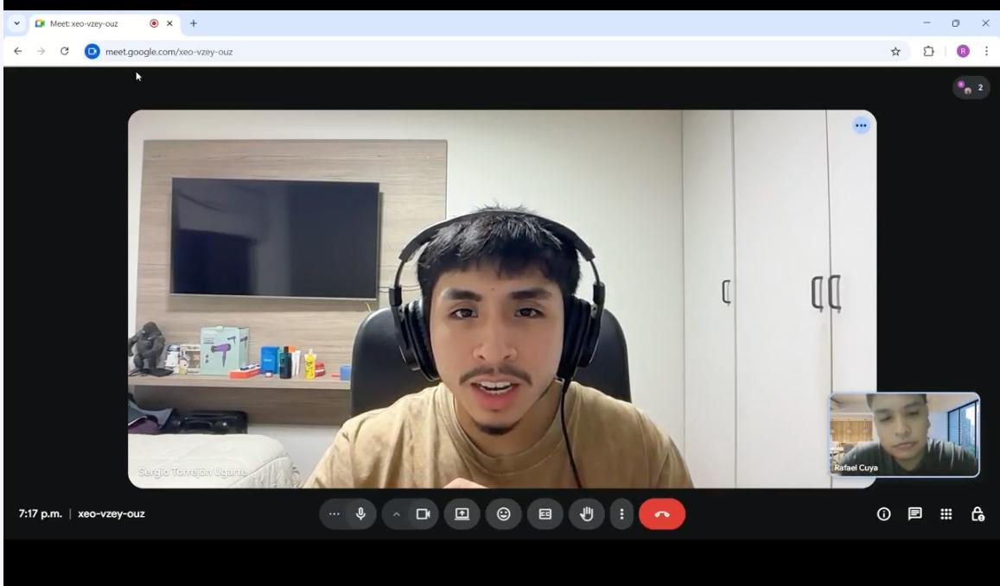</td></tr>
  <tr><td><strong>Entrevistado</strong></td><td>Carlos Mendoza Ríos</td></tr>
  <tr><td><strong>Entrevistador</strong></td><td>Rafael Cuya</td></tr>
  <tr><td><strong>Sexo</strong></td><td>Masculino</td></tr>
  <tr><td><strong>Edad</strong></td><td>29 años</td></tr>
  <tr><td><strong>Estado civil</strong></td><td>Soltero, sin hijos ni personas a su cargo</td></tr>
  <tr><td><strong>Distrito</strong></td><td>Surquillo</td></tr>
  <tr><td><strong>URL del video</strong></td><td><a href="https://upcedupe-my.sharepoint.com/:v:/g/personal/u202214477_upc_edu_pe/IQCMBDZdyMVAQKh_NrFheDDEAfbJMIyo3lVGDKNSnQugT3I?e=Amq8Ep">Video consolidado de entrevistas</a></td></tr>
  <tr><td><strong>Timing</strong></td><td>Inicio: 00:00 | Fin: 03:56 | Duración: 03:56</td></tr>
  <tr><td><strong>Resumen</strong></td><td>Analista de sistemas que utiliza su auto todos los días de lunes a viernes para desplazarse a su trabajo en San Isidro, y también visita zonas como Miraflores y Surco. Señala que suele demorar entre 15 y 25 minutos en encontrar estacionamiento en horas punta, y que actualmente solo utiliza Google Maps para planificar la ruta, sin contar con una herramienta específica para validar disponibilidad antes de llegar. Usa Android con Chrome y toma como referencia aplicaciones rápidas, directas y sin pasos innecesarios como Yape. Manifiesta una alta disposición a usar ParkingNow siempre que la información esté realmente actualizada y respaldada por sensor físico, y precisa que el proceso de reserva debería resolverse en pocos pasos. Indica que dejaría de usar la aplicación si falla en su primera experiencia de uso.</td></tr>
</table>

##### Entrevista 2

<table style="width:100%; table-layout:fixed; border-collapse:collapse;">
  <tr>
    <th style="width:24%; text-align:left;">Campo</th>
    <th style="text-align:left;">Detalle</th>
  </tr>
  <tr><td><strong>Imagen</strong></td><td></td></tr>
  <tr><td><strong>Entrevistado</strong></td><td>Valeria Torres Chávez</td></tr>
  <tr><td><strong>Entrevistador</strong></td><td>Gabriel Lapa</td></tr>
  <tr><td><strong>Sexo</strong></td><td>Femenino</td></tr>
  <tr><td><strong>Edad</strong></td><td>34 años</td></tr>
  <tr><td><strong>Estado civil</strong></td><td>Casada, con un hijo de 5 años</td></tr>
  <tr><td><strong>Distrito</strong></td><td>La Molina</td></tr>
  <tr><td><strong>URL del video</strong></td><td><a href="https://upcedupe-my.sharepoint.com/:v:/g/personal/u202214477_upc_edu_pe/IQCMBDZdyMVAQKh_NrFheDDEAfbJMIyo3lVGDKNSnQugT3I?e=Amq8Ep">Video consolidado de entrevistas</a></td></tr>
  <tr><td><strong>Timing</strong></td><td>Inicio: 03:57 | Fin: 08:00 | Duración: 04:03</td></tr>
  <tr><td><strong>Resumen</strong></td><td>Ejecutiva de ventas que se moviliza casi todos los días por distritos como Miraflores, San Borja, Surco y San Isidro debido a sus reuniones de trabajo. Reporta que puede tardar entre 20 y 30 minutos en encontrar estacionamiento en zonas de alta demanda, y destaca que su principal frustración no es solo el tiempo perdido, sino la incertidumbre de no saber si encontrará un espacio disponible al llegar. Usa iPhone con Safari y valora experiencias digitales claras y predecibles como la de Uber. Considera especialmente valiosa la posibilidad de reservar desde el celular antes de reuniones importantes, e incluso afirma que estaría dispuesta a pagar por una garantía real de disponibilidad. Señala que la validación por sensor físico sería decisiva para confiar en la solución y que abandonaría la aplicación si esta falla en la primera experiencia de uso.</td></tr>
</table>

##### Entrevista 3

<table style="width:100%; table-layout:fixed; border-collapse:collapse;">
  <tr>
    <th style="width:24%; text-align:left;">Campo</th>
    <th style="text-align:left;">Detalle</th>
  </tr>
  <tr><td><strong>Imagen</strong></td><td></td></tr>
  <tr><td><strong>Entrevistado</strong></td><td>Rodrigo Palomino Vega</td></tr>
  <tr><td><strong>Entrevistador</strong></td><td>Diego Ulises Soto Quispe</td></tr>
  <tr><td><strong>Sexo</strong></td><td>Masculino</td></tr>
  <tr><td><strong>Edad</strong></td><td>25 años</td></tr>
  <tr><td><strong>Estado civil</strong></td><td>Soltero, sin hijos ni personas a su cargo</td></tr>
  <tr><td><strong>Distrito</strong></td><td>San Miguel</td></tr>
  <tr><td><strong>URL del video</strong></td><td><a href="https://upcedupe-my.sharepoint.com/:v:/g/personal/u202214477_upc_edu_pe/IQCMBDZdyMVAQKh_NrFheDDEAfbJMIyo3lVGDKNSnQugT3I?e=Amq8Ep">Video consolidado de entrevistas</a></td></tr>
  <tr><td><strong>Timing</strong></td><td>Inicio: 08:01 | Fin: 14:04 | Duración: 06:03</td></tr>
  <tr><td><strong>Resumen</strong></td><td>Docente universitario de 25 años, residente en San Miguel, soltero y sin hijos ni personas a su cargo, que se moviliza en auto aproximadamente tres veces por semana hacia distritos como Miraflores y San Isidro por motivos laborales. Indica que estacionar en esas zonas es especialmente problemático y que suele salir con anticipación porque puede tardar entre 20 y 40 minutos en encontrar espacio, llegando incluso a perder compromisos cuando no logra estacionar a tiempo. Usa Android con Chrome y recurre a Google Maps solo para la ruta, ya que no le ofrece información sobre disponibilidad de estacionamientos. Su principal frustración es el tiempo improductivo que pierde buscando dónde dejar el vehículo. Señala que usaría una aplicación móvil con disponibilidad en tiempo real si esta demuestra ser confiable desde los primeros usos, y considera que la validación mediante sensor físico sería clave para creer en la exactitud de la información. Afirma que la posibilidad de reservar desde el celular antes de salir sería especialmente valiosa en actividades programadas como sus clases.</td></tr>
</table>

---

#### Entrevistas al Segmento 2: Administradores de Estacionamientos Independientes

A continuación se registran las entrevistas realizadas a propietarios y administradores de estacionamientos independientes de Lima Metropolitana que operan sus locales de forma manual o semi-formal, sin herramientas digitales de gestión integradas.

##### Entrevista 4

<table style="width:100%; table-layout:fixed; border-collapse:collapse;">
  <tr>
    <th style="width:24%; text-align:left;">Campo</th>
    <th style="text-align:left;">Detalle</th>
  </tr>
  <tr><td><strong>Imagen</strong></td><td>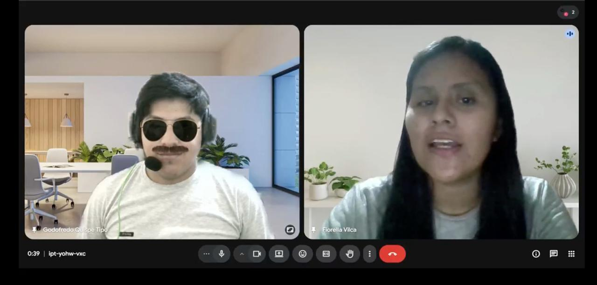</td></tr>
  <tr><td><strong>Entrevistado</strong></td><td>Jorge Huamán Castillo</td></tr>
  <tr><td><strong>Entrevistador</strong></td><td>Fiorella Vilca</td></tr>
  <tr><td><strong>Sexo</strong></td><td>Masculino</td></tr>
  <tr><td><strong>Edad</strong></td><td>35 años</td></tr>
  <tr><td><strong>Distrito</strong></td><td>Miraflores</td></tr>
  <tr><td><strong>URL del video</strong></td><td><a href="https://upcedupe-my.sharepoint.com/:v:/g/personal/u202214477_upc_edu_pe/IQCMBDZdyMVAQKh_NrFheDDEAfbJMIyo3lVGDKNSnQugT3I?e=Amq8Ep">Video consolidado de entrevistas</a></td></tr>
  <tr><td><strong>Timing</strong></td><td>Inicio: 14:05 | Fin: 18:42 | Duración: 04:37</td></tr>
  <tr><td><strong>Resumen</strong></td><td>Administra un estacionamiento de 12 espacios en Miraflores, con una operación de control manual y apoyo de un trabajador en el turno de la mañana. Lleva 9 años en el negocio, que inició junto a su hermano. Explica que no cuenta con visibilidad remota del estado del local más allá de llamadas o mensajes por WhatsApp, y que una de sus principales dificultades es depender de su presencia física para mantener el control de entradas, salidas y cobros. Gestiona el negocio principalmente desde el celular y usa WhatsApp para coordinación y Yape para pagos. Muestra interés en una plataforma digital si esta le ayuda a captar más clientes, pero condiciona su adopción a que los sensores no requieran obras complejas y a que la inversión demuestre resultados concretos antes de asumir un pago recurrente. Para confiar en una plataforma nueva necesita ver que otros estacionamientos similares ya la usan con buenos resultados.</td></tr>
</table>

##### Entrevista 5

<table style="width:100%; table-layout:fixed; border-collapse:collapse;">
  <tr>
    <th style="width:24%; text-align:left;">Campo</th>
    <th style="text-align:left;">Detalle</th>
  </tr>
  <tr><td><strong>Imagen</strong></td><td></td></tr>
  <tr><td><strong>Entrevistado</strong></td><td>Leonardo Delgado Arriola</td></tr>
  <tr><td><strong>Entrevistador</strong></td><td>Elverth Vásquez Villalobos</td></tr>
  <tr><td><strong>Sexo</strong></td><td>Masculino</td></tr>
  <tr><td><strong>Edad</strong></td><td>20 años</td></tr>
  <tr><td><strong>Distrito</strong></td><td>San Miguel</td></tr>
  <tr><td><strong>URL del video</strong></td><td><a href="https://upcedupe-my.sharepoint.com/:v:/g/personal/u202214477_upc_edu_pe/IQCMBDZdyMVAQKh_NrFheDDEAfbJMIyo3lVGDKNSnQugT3I?e=Amq8Ep">Video consolidado de entrevistas</a></td></tr>
  <tr><td><strong>Timing</strong></td><td>Inicio: 18:44 | Fin: 23:38 | Duración: 04:54</td></tr>
  <tr><td><strong>Resumen</strong></td><td>Administra un estacionamiento de 10 espacios en San Miguel, cerca de una avenida de alto tránsito. Lleva aproximadamente 2 años en el negocio, que inició apoyando a un familiar. La gestión es completamente manual: registra entradas y salidas en un cuaderno y coordina ocasionalmente con un familiar cuando necesita ausentarse. Señala que su principal dificultad es la necesidad de permanecer presente para mantener el control de la operación. Expresa interés en una plataforma web que le permita ordenar mejor la operación y atraer más clientes, siempre que sea intuitiva, fácil de usar y de bajo costo. Prefiere gestionar desde el celular y actualmente usa WhatsApp y Yape como únicos medios digitales. Consideraría instalar sensores si alguien le explica claramente cómo funcionan y la solución no implica complejidad técnica innecesaria.</td></tr>
</table>

##### Entrevista 6

<table style="width:100%; table-layout:fixed; border-collapse:collapse;">
  <tr>
    <th style="width:24%; text-align:left;">Campo</th>
    <th style="text-align:left;">Detalle</th>
  </tr>
  <tr><td><strong>Imagen</strong></td><td></td></tr>
  <tr><td><strong>Entrevistado</strong></td><td>Patricia Quispe Alvarado</td></tr>
  <tr><td><strong>Entrevistador</strong></td><td>Diego Ulises Soto Quispe</td></tr>
  <tr><td><strong>Sexo</strong></td><td>Femenino</td></tr>
  <tr><td><strong>Edad</strong></td><td>30 años</td></tr>
  <tr><td><strong>Distrito</strong></td><td>San Isidro</td></tr>
  <tr><td><strong>URL del video</strong></td><td><a href="https://upcedupe-my.sharepoint.com/:v:/g/personal/u202214477_upc_edu_pe/IQCMBDZdyMVAQKh_NrFheDDEAfbJMIyo3lVGDKNSnQugT3I?e=Amq8Ep">Video consolidado de entrevistas</a></td></tr>
  <tr><td><strong>Timing</strong></td><td>Inicio: 23:39 | Fin: 29:20 | Duración: 05:41</td></tr>
  <tr><td><strong>Resumen</strong></td><td>Administradora de 30 años que heredó el negocio de sus padres. Responsable de un local con 20 espacios en San Isidro, cerca de varias oficinas corporativas, con 5 años de experiencia en la operación. Cuenta con dos trabajadores en turnos distintos y supervisa la administración general. Controla la disponibilidad mediante una pizarra física en la entrada que el trabajador actualiza manualmente, complementada por un grupo de WhatsApp interno, lo que provoca desactualizaciones frecuentes, reservas cruzadas y conflictos con clientes. Ha tenido que devolver dinero y disculparse en varias ocasiones por errores derivados de este sistema. Usa WhatsApp, Google Sheets, Instagram y aplicaciones bancarias, y probó un sistema de gestión hace 2 años que abandonó por costo y complejidad. Manifiesta interés en una plataforma web simple que funcione bien tanto en celular como en computadora. Valora especialmente la instalación de sensores que automaticen la disponibilidad sin requerir acción adicional de sus trabajadores. Afirma que confiaría en la solución si puede verla funcionando en vivo en su local, y que la recomendaría a otros administradores de la zona si funciona correctamente durante los primeros treinta días.</td></tr>
</table>

---

### 2.2.3. Análisis de entrevistas

En esta sección se presenta el análisis de las seis entrevistas realizadas, tres por cada segmento objetivo. A partir de las respuestas recopiladas se identifican las características objetivas y subjetivas más representativas de cada segmento, sustentadas con proporciones observadas dentro de la muestra entrevistada. Este análisis constituye la base directa para la construcción de los arquetipos de usuario en la sección 2.3.

---

#### Segmento 1: Conductores Urbanos

##### Características objetivas

**Edad y género**

Los tres entrevistados tienen entre 25 y 34 años, con un promedio aproximado de 29 años. Dos de los tres entrevistados son hombres, equivalente al 67% (2/3), y una es mujer, equivalente al 33% (1/3). Este rango corresponde a población económicamente activa que se desplaza con frecuencia en vehículo propio por Lima Metropolitana. Dentro de la muestra analizada, residen en Surquillo, La Molina y San Miguel.

**Estado civil y carga familiar**

Dos de los tres entrevistados son solteros, equivalente al 67% (2/3), y una entrevistada está casada, equivalente al 33% (1/3). Asimismo, solo una persona, equivalente al 33% (1/3), tiene un hijo o persona a su cargo. Los dos entrevistados restantes, equivalente al 67% (2/3), no tienen dependientes, lo que sugiere que en esta muestra predominan perfiles cuya principal responsabilidad de movilidad es laboral o académica.

**Ocupación**

En los tres casos entrevistados, equivalente al 100% (3/3), se identificó actividad laboral estable. Las ocupaciones corresponden a un analista de sistemas, una ejecutiva de ventas y un docente universitario. En todos los casos, equivalente al 100% (3/3), el vehículo aparece como un medio importante para cumplir responsabilidades laborales y desplazarse hacia zonas de alta demanda vehicular.

**Frecuencia de uso del vehículo**

Los tres entrevistados, equivalente al 100% (3/3), usan su vehículo con frecuencia. Un caso corresponde a uso diario de lunes a viernes, otro a uso casi diario y un tercero a uso aproximado de tres veces por semana. En todos los casos, equivalente al 100% (3/3), el auto forma parte importante de su rutina de movilidad.

**Zonas de desplazamiento**

En los tres casos, equivalente al 100% (3/3), se repiten San Isidro y Miraflores como zonas de desplazamiento frecuentes. En dos de los tres casos, equivalente al 67% (2/3), también aparece Surco. Estas zonas coinciden con distritos de alta demanda vehicular y alta presión sobre el estacionamiento.

**Dispositivo y navegador**

Dos de los tres entrevistados, equivalente al 67% (2/3), usan Android con Chrome, mientras que una entrevistada, equivalente al 33% (1/3), usa iPhone con Safari. En la totalidad de la muestra, equivalente al 100% (3/3), el smartphone es el dispositivo principal para aplicaciones de movilidad y servicios digitales.

---

##### Características subjetivas

**Comportamiento actual al buscar estacionamiento**

En los tres casos entrevistados, equivalente al 100% (3/3), no se identificó una herramienta que les informe de manera anticipada sobre la disponibilidad real de estacionamiento antes de llegar. Los entrevistados usan aplicaciones como Google Maps o Waze para consultar rutas, tráfico o ubicación, pero no cuentan con una solución que confirme espacios libres en tiempo real. Por ello, en la práctica siguen tomando decisiones con incertidumbre.

**Tiempo promedio de búsqueda**

En los tres casos, equivalente al 100% (3/3), se reportan tiempos de búsqueda superiores a 15 minutos en zonas de alta demanda. Las respuestas oscilan entre 15 y 40 minutos, especialmente en distritos como San Isidro, Miraflores y Surco. Esto evidencia que la búsqueda de estacionamiento representa una pérdida significativa de tiempo para este segmento.

**Frecuencia del problema**

En toda la muestra, equivalente al 100% (3/3), el problema aparece de forma recurrente. Dos entrevistados, equivalente al 67% (2/3), indican que lo viven varias veces por semana o casi todos los días, mientras que un tercero, equivalente al 33% (1/3), lo asocia a sus desplazamientos frecuentes a zonas de alta demanda. Esto sugiere que no se trata de un evento aislado, sino de una fricción habitual en su experiencia de movilidad.

**Reacción ante la falta de disponibilidad**

En los tres casos, equivalente al 100% (3/3), la primera reacción consiste en dar vueltas buscando una alternativa cercana. Los entrevistados también contemplan el uso de estacionamientos de pago como segunda opción o, en casos más extremos, cambiar de plan, llegar tarde o buscar alternativas de transporte. Esto evidencia que la falta de disponibilidad afecta tanto el tiempo como la planificación del usuario.

**Disposición a usar una aplicación móvil de disponibilidad en tiempo real**

En los tres casos, equivalente al 100% (3/3), se observa disposición a usar una aplicación móvil que muestre disponibilidad en tiempo real. Sin embargo, dicha disposición está condicionada a que la información sea confiable, se actualice rápidamente y no genere falsas expectativas. La confianza inicial aparece como un factor crítico de adopción.

**Disposición a reservar desde el celular**

Los tres entrevistados, equivalente al 100% (3/3), indican que reservarían un espacio desde el celular si eso les garantizara disponibilidad al llegar. Esta disposición está condicionada a que el proceso sea rápido, claro y simple, especialmente en contextos laborales, clases, reuniones o compromisos con hora fija.

**Importancia del sensor físico para la confianza**

En toda la muestra, equivalente al 100% (3/3), el sensor físico aparece como un factor relevante de confianza. Los entrevistados distinguen entre una disponibilidad declarada manualmente y una disponibilidad respaldada por detección física del estado del espacio. Este hallazgo refuerza el valor diferencial de la propuesta IoT de ParkingNow.

**Aplicaciones móviles de referencia**

En la muestra aparecen como referentes aplicaciones como Google Maps, Waze, Uber, Yape, Rappi y aplicaciones bancarias. En cuanto a experiencia de usuario, los entrevistados valoran aplicaciones simples, rápidas, predecibles y con pocos pasos. Este patrón es relevante para el diseño de la Mobile App de ParkingNow.

**Principales frustraciones**

La pérdida de tiempo aparece en los tres casos, equivalente al 100% (3/3), como una frustración central. Además, también se identifica incertidumbre respecto a si encontrarán o no un espacio disponible al llegar. Esta combinación de tiempo perdido e incertidumbre genera estrés, afecta la puntualidad y reduce la calidad de la experiencia de movilidad.

**Condición de abandono de la aplicación**

En los tres casos, equivalente al 100% (3/3), se observa una tolerancia muy baja al error. Los entrevistados señalan, con distintos matices, que una falla importante en la disponibilidad mostrada podría ser suficiente para abandonar la aplicación. Esto implica que la primera experiencia de uso será determinante para la adopción.

---

##### Conclusiones del segmento 1

Los conductores urbanos entrevistados comparten un perfil relativamente homogéneo: adultos jóvenes económicamente activos, usuarios frecuentes de vehículo particular y visitantes habituales de distritos con alta demanda vehicular como Miraflores, San Isidro y Surco. En la muestra analizada, el problema de estacionamiento aparece de forma recurrente, con tiempos de búsqueda que superan de manera consistente los 15 minutos y sin acceso a herramientas que anticipen la disponibilidad real antes de llegar.

Asimismo, se observa disposición a adoptar una aplicación móvil de estacionamiento, siempre que la información mostrada sea confiable y esté respaldada por un mecanismo físico verificable. Dentro de esta muestra, el sensor IoT aparece como un elemento con potencial para generar confianza, mientras que la tolerancia al error en la primera experiencia de uso es muy baja. En consecuencia, la promesa de valor para este segmento debe centrarse en confiabilidad, rapidez y simplicidad.

---

#### Segmento 2: Administradores de Estacionamientos Independientes

##### Características objetivas

**Edad y género**

Los tres entrevistados tienen entre 20 y 35 años, con un promedio aproximado de 28 años. Dos de los tres entrevistados son hombres, equivalente al 67% (2/3), y una es mujer, equivalente al 33% (1/3). Este rango refleja la presencia tanto de administradores jóvenes vinculados a negocios familiares como de operadores con experiencia moderada en el sector.

**Tamaño y antigüedad del local**

Los estacionamientos entrevistados tienen entre 10 y 20 espacios, con un promedio aproximado de 14 espacios. El tiempo de operación varía entre 2 y 9 años, con un promedio aproximado de 5 años. En los tres casos, equivalente al 100% (3/3), los locales se ubican en distritos urbanos con actividad vehicular relevante: Miraflores, San Isidro y San Miguel.

**Personal de apoyo**

La estructura operativa es pequeña y varía entre apoyo familiar, apoyo parcial y apoyo por turnos. Un caso, equivalente al 33% (1/3), opera con apoyo eventual de un familiar; otro, equivalente al 33% (1/3), cuenta con un trabajador en turno de mañana; y otro, equivalente al 33% (1/3), cuenta con dos trabajadores en turnos distintos. En todos los casos, equivalente al 100% (3/3), la coordinación sigue siendo mayormente informal.

**Dispositivo preferido para gestión**

En los tres casos, equivalente al 100% (3/3), el celular aparece como dispositivo principal o prioritario de gestión. Dos entrevistados, equivalente al 67% (2/3), dependen principalmente de este medio, mientras que una entrevistada, equivalente al 33% (1/3), complementa su uso con laptop o computadora de oficina. Esto sugiere que la solución debe funcionar correctamente en entorno móvil y mantener una interfaz clara en web.

**Herramientas digitales actuales**

En los tres casos, equivalente al 100% (3/3), se usa WhatsApp como herramienta digital básica de coordinación. Dos casos, equivalente al 67% (2/3), usan además Yape para pagos, y un caso, equivalente al 33% (1/3), utiliza Google Sheets para control básico e Instagram de forma ocasional. No se identificó un sistema digital formal de gestión de estacionamientos en uso activo dentro de la muestra entrevistada.

---

##### Características subjetivas

**Sistema de control de espacios**

En los tres casos, equivalente al 100% (3/3), el control de espacios sigue siendo manual o semimanual. Se utilizan cuadernos, pizarra física, registros directos o comunicación por WhatsApp, sin automatización real del estado de ocupación. Este hallazgo evidencia una baja digitalización operativa.

**Visibilidad remota de la operación**

En toda la muestra, equivalente al 100% (3/3), se observa ausencia de visibilidad remota real. Cuando el administrador no está físicamente en el local, depende de llamadas, mensajes o terceros para conocer el estado del negocio. Esta dependencia aparece como una fuente importante de fricción y limita la capacidad de supervisión.

**Conductores llegando sin espacio disponible**

Los tres entrevistados, equivalente al 100% (3/3), reportan situaciones en las que llegan conductores esperando encontrar espacio y este ya no se encuentra disponible. Esto genera incomodidad, pérdida de clientes y, en un caso, conflictos por reservas informales mal gestionadas que derivaron en devoluciones de dinero y reclamos directos.

**Mayor fuente de errores operativos**

En los tres casos, equivalente al 100% (3/3), la operación manual aparece como origen de la carga operativa y de los errores cotidianos. Dos entrevistados, equivalente al 67% (2/3), destacan específicamente la necesidad de presencia constante para mantener el control del negocio, mientras que una entrevistada, equivalente al 33% (1/3), señala de forma más específica el desorden en reservas y la coordinación manual entre trabajadores y canales de comunicación como fuente principal de conflictos.

**Interés en una plataforma web de gestión**

En los tres casos, equivalente al 100% (3/3), se observa interés por una plataforma web de gestión y visibilidad digital. Sin embargo, este interés está condicionado a simplicidad de uso, claridad del beneficio y reducción real de problemas operativos. No hay rechazo al cambio, pero sí cautela frente al costo, la complejidad de implementación y el tiempo necesario para aprender a usar la herramienta.

**Disposición a instalar sensores**

En los tres casos, equivalente al 100% (3/3), existe apertura a instalar sensores, siempre que la instalación sea simple y no implique obras, electricistas ni procesos complejos. Además, los entrevistados requieren explicación clara, demostración o evidencia previa para confiar en esta incorporación tecnológica. Esto confirma que el componente IoT debe presentarse como una herramienta de apoyo operativo, no como una carga técnica adicional.

**Experiencia previa con herramientas digitales de gestión**

Dos de los tres entrevistados, equivalente al 67% (2/3), nunca han usado un sistema de gestión para estacionamientos, principalmente porque no conocían opciones ajustadas a negocios pequeños. El caso restante, equivalente al 33% (1/3), sí probó una solución anterior, pero la abandonó por complejidad y costo excesivo frente al valor ofrecido.

**Beneficio principal esperado**

Los beneficios esperados son concretos y operativos. Dos entrevistados, equivalente al 67% (2/3), mencionan como prioridad captar más clientes o dar mayor visibilidad al local, mientras que dos casos, equivalente al 67% (2/3), también enfatizan la necesidad de ordenar mejor la operación, reducir errores y ganar control en tiempo real. En conjunto, los tres administradores, equivalente al 100% (3/3), priorizan beneficios prácticos antes que atributos tecnológicos abstractos.

**Condición para confiar en la plataforma**

La confianza no depende de marketing general, sino de evidencia tangible. Un entrevistado, equivalente al 33% (1/3), necesita ver que otros negocios similares ya la usan con buenos resultados; otro, equivalente al 33% (1/3), requiere explicación clara y acompañamiento sin complejidad técnica; y una entrevistada, equivalente al 33% (1/3), necesita una demostración en vivo en su propio local. Esto sugiere que la adopción inicial dependerá de prueba práctica, acompañamiento y validación visible.

---

##### Conclusiones del segmento 2

Los administradores entrevistados comparten un perfil operativo relativamente homogéneo: propietarios o gestores de locales pequeños o medianos, con una operación todavía fuertemente manual y con baja integración tecnológica. En la muestra analizada, se observa dependencia de la presencia física del dueño o de mecanismos informales de coordinación para conocer el estado del negocio en tiempo real.

También se observa apertura a digitalizar la operación, pero esta está claramente condicionada a simplicidad de instalación, bajo costo de entrada y evidencia tangible de valor. Dentro de esta muestra, el sensor IoT es percibido como viable siempre que no introduzca complejidad técnica. En consecuencia, la propuesta de valor para este segmento debe centrarse en control remoto, reducción de errores, facilidad de adopción y generación de beneficios operativos medibles.

---

#### Conclusiones generales

Los hallazgos del segmento 1 evidencian una necesidad clara de información confiable y verificada en tiempo real sobre la disponibilidad de estacionamientos, así como disposición a reservar desde una aplicación móvil si la plataforma demuestra coherencia entre lo que muestra y lo que el conductor encuentra al llegar. En esta muestra, el sensor físico IoT aparece como un factor importante de confianza.

En el segmento 2, se observa una necesidad igualmente clara de digitalizar una operación que hoy depende en gran medida de la presencia física del dueño y de coordinación informal. En la muestra analizada, los administradores valoran una plataforma web con monitoreo en tiempo real y automatización de disponibilidad, siempre que la instalación sea simple, el costo sea razonable y exista acompañamiento en la adopción inicial.

Ambos segmentos se complementan de manera directa: los conductores necesitan información verificada que solo puede sostenerse si los administradores cuentan con mecanismos de actualización confiables, mientras que los administradores necesitan más reservas, visibilidad digital y control operativo que solo pueden conseguir si los conductores tienen una aplicación confiable que los conecte con sus espacios. Esta interdependencia respalda preliminarmente el modelo de negocio B2B2C de ParkingNow y justifica la construcción equilibrada de ambas experiencias de usuario.

Estos hallazgos sirven como base directa para la construcción de los User Personas, Empathy Maps, User Journey Maps y demás artefactos de Needfinding desarrollados en la sección 2.3.

## 2.3. Needfinding

En esta sección se presentan los artefactos resultantes del proceso de análisis de la información recolectada en las entrevistas de la sección 2.2. A partir de los hallazgos identificados en ambos segmentos objetivo, el equipo construyó de forma colaborativa los siguientes artefactos: **User Personas**, **User Task Matrix**, **User Journey Maps** y **Empathy Maps**.

Cada uno de estos artefactos tiene como propósito consolidar el entendimiento sobre las necesidades reales, comportamientos y frustraciones de los conductores urbanos y los administradores de estacionamientos independientes, asegurando que los rasgos representados puedan trazarse directamente a los datos recolectados en las entrevistas.

### 2.3.1. User Personas

A partir del análisis de entrevistas realizado en la sección 2.2.3, el equipo construyó una ficha de User Persona por cada segmento objetivo de ParkingNow. Los arquetipos sintetizan las características objetivas y subjetivas más representativas de cada segmento: datos demográficos, ocupación, dispositivos de preferencia, canales digitales, motivaciones, frustraciones y marcas de referencia identificadas en las entrevistas. Las fichas fueron elaboradas en UXPressia.

> **Nota metodológica:** Los User Personas presentados en esta sección corresponden a arquetipos construidos a partir de patrones recurrentes identificados en las entrevistas. Por ello, no representan literalmente a un único entrevistado, sino una síntesis de rasgos comunes observados en cada segmento.

---

**Figura 3**

*User Persona del segmento conductores urbanos de Lima Metropolitana*

*Nota.* Elaboración propia (2026) en UXPressia.

Según la Figura 3, el arquetipo del conductor urbano corresponde a un profesional adulto joven que usa su vehículo con alta frecuencia para desplazarse hacia zonas de alta demanda vehicular como San Isidro, Miraflores y Surco. Utiliza principalmente su smartphone para consultar rutas y servicios digitales, y mantiene una alta familiaridad con aplicaciones de uso cotidiano como Google Maps, Waze, Yape, Uber y WhatsApp.

Sus principales motivaciones son ahorrar tiempo durante la jornada, llegar puntual a reuniones y compromisos, y reducir el estrés asociado a la búsqueda de estacionamiento en Lima. Entre sus mayores frustraciones destacan la pérdida de entre 15 y 40 minutos dando vueltas, la incertidumbre de no saber si realmente encontrará espacio al llegar y la dependencia de información no verificada o actualizada manualmente. Asimismo, muestra una alta disposición a reservar desde su celular siempre que la información esté respaldada por un sensor físico y presenta una tolerancia muy baja al error en el primer uso de la plataforma. Este arquetipo sintetiza patrones observados en las Entrevistas 1, 2 y 3.

---

**Figura 4**

*User Persona del segmento administradores de estacionamientos independientes*

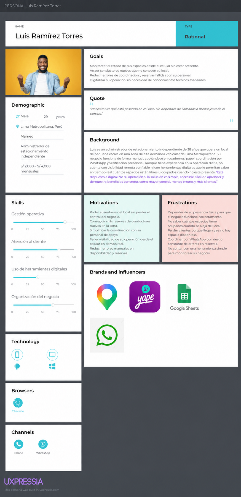

*Nota.* Elaboración propia (2026) en UXPressia.

Según la Figura 4, el arquetipo del administrador independiente corresponde a un operador que gestiona un estacionamiento de pequeña escala en Lima Metropolitana. Su operación depende en gran medida de registros manuales, coordinación informal por WhatsApp y supervisión presencial, lo que le impide tener visibilidad remota confiable sobre el estado de sus espacios.

Utiliza principalmente su celular para coordinar y gestionar aspectos operativos del negocio, aunque puede apoyarse en una laptop cuando necesita revisar información con mayor detalle. Además, recurre a herramientas básicas como WhatsApp, Yape, Google Maps y hojas de cálculo. Sus principales motivaciones son monitorear la ocupación desde el celular sin necesidad de estar presente, captar nuevos conductores y reducir errores en la gestión diaria del local. Entre sus mayores frustraciones destacan la dependencia de su presencia física para mantener el control del negocio, la imposibilidad de saber en tiempo real cuántos espacios están ocupados cuando se encuentra fuera del establecimiento y los errores derivados de una gestión manual. Muestra disposición a digitalizar su operación siempre que la solución sea simple, accesible, fácil de aprender y demuestre beneficios concretos para un negocio de su escala. Este arquetipo sintetiza patrones observados en las Entrevistas 4, 5 y 6.

### 2.3.2. User Task Matrix

En esta sección se presenta el User Task Matrix de ParkingNow, que concentra las tareas y necesidades operativas que los User Personas representativos de cada segmento realizan o requieren resolver dentro del dominio del estacionamiento urbano, independientemente de la existencia de la solución propuesta. Los segmentos considerados son el conductor urbano y el administrador de estacionamiento independiente, representados mediante los arquetipos construidos en la sección 2.3.1: **Andrés Villanueva Ríos** y **Luis Ramírez Torres**.

Cada tarea se evalúa en términos de frecuencia e importancia para cada segmento, con el fin de identificar las actividades más críticas, las coincidencias entre ambos perfiles y las diferencias que orientan el diseño de las experiencias de usuario de la plataforma.

| Tarea | Andrés Villanueva Ríos (Frecuencia) | Andrés Villanueva Ríos (Importancia) | Luis Ramírez Torres (Frecuencia) | Luis Ramírez Torres (Importancia) |
|-------|-------------------------------------|--------------------------------------|----------------------------------|-----------------------------------|
| Planificar la ruta hacia el destino antes de salir | Frecuentemente | Alta | Nunca | Baja |
| Buscar estacionamiento disponible en la zona de destino | Siempre | Alta | Nunca | Baja |
| Buscar alternativas ante falta de disponibilidad | Frecuentemente | Alta | Nunca | Baja |
| Salir con anticipación para llegar a tiempo a compromisos | Siempre | Alta | Nunca | Baja |
| Verificar la disponibilidad real de espacios antes de tomar una decisión | Siempre | Alta | Frecuentemente | Alta |
| Resolver situaciones cuando no hay disponibilidad de espacios | Frecuentemente | Alta | Frecuentemente | Alta |
| Gestionar el pago o cobro del servicio de estacionamiento | Siempre | Alta | Siempre | Alta |
| Controlar entradas y salidas de vehículos en el local | Nunca | Baja | Siempre | Alta |
| Registrar manualmente el estado de ocupación de espacios | Nunca | Baja | Siempre | Alta |
| Comunicar disponibilidad de espacios a conductores | Nunca | Baja | Frecuentemente | Alta |
| Coordinar con el personal de apoyo la operación del local | Nunca | Baja | Frecuentemente | Alta |
| Monitorear la operación del local a distancia | Nunca | Baja | Ocasionalmente | Alta |
| Atender conductores que llegan sin espacio disponible | Nunca | Baja | Frecuentemente | Media |
| Registrar ingresos diarios del negocio | Nunca | Baja | Siempre | Alta |

**Análisis**

La valoración de frecuencia e importancia se estableció a partir de los patrones identificados en las Entrevistas 1 a 6 y de su síntesis en los User Personas presentados en la sección 2.3.1.

Las tareas con mayor frecuencia e importancia para **Andrés Villanueva Ríos** son **buscar estacionamiento disponible en la zona de destino**, **verificar la disponibilidad real de espacios antes de tomar una decisión**, **gestionar el pago del servicio de estacionamiento** y **salir con anticipación para llegar a tiempo a compromisos**, todas con combinaciones de frecuencia **Siempre** o **Frecuentemente** e importancia **Alta**. Esto evidencia que el proceso de estacionamiento forma parte crítica de su rutina de movilidad y que sus decisiones están fuertemente condicionadas por la incertidumbre de no saber si realmente encontrará un espacio disponible al llegar.

Para **Luis Ramírez Torres**, las tareas con mayor frecuencia e importancia son **controlar entradas y salidas de vehículos en el local**, **registrar manualmente el estado de ocupación de espacios**, **gestionar el cobro del servicio de estacionamiento** y **registrar ingresos diarios del negocio**, todas con frecuencia **Siempre** e importancia **Alta**. Esto confirma que la operación del local depende de procesos manuales, supervisión constante y coordinación operativa continua. Asimismo, **monitorear la operación del local a distancia** presenta importancia **Alta**, pero frecuencia **Ocasionalmente**, lo que evidencia que el administrador reconoce el valor de esta actividad, aunque no puede ejecutarla de forma constante por falta de herramientas adecuadas.

La principal **coincidencia** entre ambos segmentos se encuentra en la necesidad de **verificar la disponibilidad real de espacios** y **resolver situaciones cuando no existe disponibilidad**. En el caso del conductor, esta necesidad aparece antes de estacionar, ya que busca evitar pérdida de tiempo e incertidumbre. En el caso del administrador, aparece durante la operación del local, porque necesita responder adecuadamente a la demanda y evitar conflictos con los clientes. Asimismo, la tarea **gestionar el pago o cobro del servicio de estacionamiento** muestra importancia **Alta** para ambos segmentos, aunque desde perspectivas distintas dentro del mismo proceso.

La principal **diferencia** radica en la naturaleza de las tareas realizadas por cada User Persona. En el caso de **Andrés**, las actividades se concentran en desplazamiento, búsqueda, anticipación y toma de decisiones frente a la incertidumbre. En el caso de **Luis**, las tareas se enfocan en control operativo, registro manual, coordinación del local y seguimiento del negocio. Ambos actúan sobre el mismo dominio, pero desde perspectivas complementarias.

Estos hallazgos sirven como base directa para la elaboración de los **User Journey Maps** en la siguiente sección, donde se representa el recorrido **As-Is** de cada User Persona en la situación actual, sin la intervención de la solución propuesta.

### 2.3.3. User Journey Maps

En esta sección se presentan los User Journey Maps As-Is de los dos segmentos objetivo identificados para el proyecto. Estos mapas ilustran el recorrido actual de cada User Persona en su contexto real, sin la existencia de la solución propuesta, con el propósito de identificar los puntos de mayor fricción, frustración y oportunidad en la experiencia de cada segmento.

El journey del conductor urbano recorre el proceso completo desde que planifica su salida hasta que llega a su destino, evidenciando la ausencia de información confiable sobre disponibilidad de estacionamiento a lo largo del recorrido. Por su parte, el journey del administrador independiente recorre su jornada operativa desde la apertura del local hasta el cierre del día, evidenciando la dependencia de procesos manuales, coordinación informal y limitada visibilidad remota de la operación.

Ambos mapas fueron elaborados en UXPressia, vinculados directamente a los User Personas construidos en la sección 2.3.1, y toman como insumo los hallazgos obtenidos en el análisis de entrevistas de la sección 2.2.3.

---

**Figura 5**

*User Journey Map As-Is del segmento conductores urbanos de Lima Metropolitana*

*Nota.* Elaboración propia (2026) en UXPressia.

Según la Figura 5, el journey As-Is del conductor urbano evidencia una experiencia marcada por la incertidumbre respecto a la disponibilidad de estacionamiento durante todas las etapas del recorrido. La curva de experiencia se mantiene en nivel neutral en las etapas de planificación y salida, desciende a sadness en la etapa de búsqueda, donde el conductor pierde entre 15 y 40 minutos dando vueltas sin información útil ni verificada, y alcanza su punto más crítico en la etapa de intento de estacionamiento, donde la frustración llega a nivel rage al verse obligado a tomar decisiones apresuradas, estacionarse lejos o incluso recurrir a zonas no ideales.

El journey concluye en nivel sadness, reflejando que el conductor llega a su destino con retraso o con estrés acumulado, afectando negativamente el inicio de su actividad. Las oportunidades identificadas en el mapa se orientan a reducir la incertidumbre previa al viaje, facilitar la identificación de espacios disponibles y disminuir la carga emocional asociada al proceso de estacionamiento. Este journey sintetiza patrones observados en las Entrevistas 1, 2 y 3.

---

**Figura 6**

*User Journey Map As-Is del segmento administradores de estacionamientos independientes*

*Nota.* Elaboración propia (2026) en UXPressia.

Según la Figura 6, el journey As-Is del administrador independiente evidencia una operación fuertemente dependiente de la presencia física del dueño y de mecanismos manuales de control, como cuaderno, registro directo, pizarra, cobro presencial y coordinación por llamadas o WhatsApp. La curva de experiencia se mantiene en nivel neutral en las etapas de apertura y operación diaria, desciende a sadness en la etapa de gestión de conductores, donde comienzan a aparecer conflictos por falta de información clara sobre la ocupación, y alcanza su punto más crítico en la etapa de coordinación a distancia, donde el administrador depende de terceros para saber qué ocurre en el local y se expone a errores de comunicación, reservas fallidas o discrepancias operativas.

El journey cierra en nivel sadness, reflejando que la jornada termina sin un historial estructurado ni datos consolidados que permitan revisar tendencias, ingresos o errores del día. Las oportunidades identificadas en el mapa se orientan a mejorar la visibilidad del estado del local, reducir la dependencia del registro manual y facilitar un mayor control operativo al cierre de la jornada. Este journey sintetiza patrones observados en las Entrevistas 4, 5 y 6.

### 2.3.4. Empathy Mapping

En esta sección se presentan los Empathy Maps correspondientes a los dos segmentos objetivo de ParkingNow. Estos artefactos permiten profundizar en la dimensión emocional, perceptiva y conductual de cada User Persona, recogiendo qué piensa, qué siente, qué escucha, qué observa, qué hace, cuáles son sus principales frustraciones y qué beneficios espera obtener frente al problema del estacionamiento urbano en Lima Metropolitana.

Su propósito es complementar la visión demográfica y funcional desarrollada en la sección 2.3.1, incorporando una comprensión más empática de las necesidades reales de cada segmento. Los mapas fueron elaborados en UXPressia a partir de los hallazgos obtenidos en el análisis de entrevistas de la sección 2.2.3 y guardan coherencia directa con los User Personas y User Journey Maps previamente desarrollados.

---

**Figura 7**

*Empathy Map del segmento conductores urbanos de Lima Metropolitana*

*Nota.* Elaboración propia (2026) en UXPressia.

Según la Figura 7, el Empathy Map del conductor urbano evidencia que su experiencia está marcada por una combinación de presión de tiempo, incertidumbre y baja tolerancia al error. El conductor no solo pierde tiempo buscando estacionamiento, sino que además inicia su recorrido con la preocupación de no saber si encontrará un espacio disponible al llegar. En su entorno observa congestión, estacionamientos llenos y ausencia de información verificable sobre disponibilidad real, mientras que en su rutina escucha comentarios frecuentes sobre demoras, tráfico y la dificultad de estacionar en distritos como San Isidro, Miraflores y Surco.

Asimismo, este segmento realiza acciones repetitivas e ineficientes, como salir con anticipación, revisar únicamente rutas o tráfico en aplicaciones de navegación y recorrer varias cuadras esperando que se libere un espacio. Entre sus principales pains destacan la pérdida de entre 15 y 40 minutos en la búsqueda, la ansiedad de llegar tarde, el estrés acumulado y la desconfianza inmediata frente a cualquier falla en la información mostrada. En contraste, sus gains esperados se relacionan con la posibilidad de conocer con anticipación si existe un espacio disponible, reducir el tiempo de búsqueda, tomar decisiones rápidas con información clara y confiar en que la disponibilidad observada corresponda al estado real del estacionamiento. Este mapa sintetiza patrones observados en las Entrevistas 1, 2 y 3.

---

**Figura 8**

*Empathy Map del segmento administradores de estacionamientos independientes*

*Nota.* Elaboración propia (2026) en UXPressia.

Según la Figura 8, el Empathy Map del administrador independiente evidencia que su principal tensión cotidiana se encuentra en la necesidad de mantener el control operativo del negocio sin depender por completo de su presencia física. Este segmento piensa constantemente en cómo evitar errores, mantener el orden de la operación y no perder clientes por una gestión manual poco precisa. En su entorno observa que su local depende de cuadernos, pizarras, llamadas y mensajes, mientras escucha reclamos, coordinaciones imprecisas y comentarios que refuerzan la idea de que las soluciones tecnológicas suelen ser complejas o estar orientadas a negocios de mayor escala.

De igual manera, sus acciones diarias muestran una operación altamente manual: registrar entradas y salidas, coordinar con personal o familiares por WhatsApp, atender consultas presenciales, gestionar cobros directamente y revisar el estado del negocio a distancia mediante llamadas o mensajes. Entre sus principales pains destacan la imposibilidad de ausentarse sin perder control, los errores derivados de registros manuales, la falta de visibilidad en tiempo real, la pérdida de clientes por descoordinación y la ausencia de un historial digital estructurado. Frente a ello, sus gains esperados se concentran en contar con monitoreo remoto desde el celular, reducir errores operativos, captar más conductores, disponer de una solución simple y accesible, y tener mayor tranquilidad al saber qué ocurre en el local incluso cuando no se encuentra físicamente presente. Este mapa sintetiza patrones observados en las Entrevistas 4, 5 y 6.

## 2.4. Big Picture EventStorming

En esta sección se presenta el resultado del taller de **Big Picture EventStorming** realizado para el dominio de **ParkingNow**, con el propósito de construir una visión compartida del negocio antes de profundizar en decisiones de arquitectura y diseño de software. Esta técnica permitió identificar los eventos significativos del dominio, ordenar la historia principal del proceso de estacionamiento de extremo a extremo y reconocer los principales puntos de dolor que justifican la propuesta de valor de la solución.

Para la elaboración de este artefacto, el equipo tomó como insumo los hallazgos obtenidos en las entrevistas, los **User Personas**, los **User Journey Maps** y los **Empathy Maps** desarrollados en las secciones previas. A partir de esta información, se construyó una primera aproximación visual de alto nivel del dominio, orientada a representar procesos clave, relaciones entre eventos, problemas actuales y oportunidades de mejora.

En concordancia con el enfoque aplicado por el equipo, el trabajo se organizó en tres momentos complementarios: **Open**, **Explore** y **Close**. En **Open** se capturaron los eventos iniciales del dominio; en **Explore** se ordenó la historia principal del negocio y se identificaron los principales pain points; y en **Close** se consolidaron los actores, comandos, vistas de información y sistemas externos que completan el entendimiento global del dominio.

Es importante precisar que los **Domain Events** representan hechos relevantes que ocurren en el negocio, mientras que los **Pain Points** evidencian fricciones, limitaciones o quiebres del proceso actual. Por su parte, los **Actors**, **Commands**, **Read Models** y **External Systems** enriquecen la comprensión del dominio y permiten preparar la transición hacia el modelado estratégico y táctico de la solución.

**Figura 9**

*Big Picture EventStorming del dominio ParkingNow*

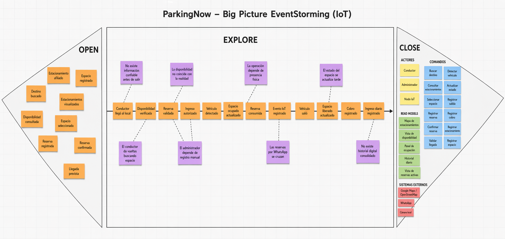

*Nota.* Elaboración propia (2026) en Miro.

Según la **Figura 9**, el Big Picture EventStorming permitió representar el dominio de ParkingNow como un flujo integrado en el que intervienen el conductor, el administrador del estacionamiento y el componente IoT. En la fase **Open** se reunieron los eventos iniciales asociados al descubrimiento y reserva de espacios, incorporando también elementos operativos del negocio. En la fase **Explore** se organizó la línea principal del dominio desde la llegada al local hasta el cierre operativo de la transacción, junto con los principales puntos de dolor del escenario actual. Finalmente, en la fase **Close** se consolidaron los elementos complementarios que explican quién interviene en el proceso, qué acciones desencadenan los eventos, qué información se necesita visualizar y qué servicios externos participan en la experiencia.

---

### Etapa 1: Open

En esta primera etapa se realizó una exploración inicial del dominio mediante la identificación de eventos significativos relacionados con el inicio de la experiencia del usuario y con la configuración operativa del servicio. El objetivo fue abrir la discusión y capturar, de forma amplia, los hechos más relevantes que ocurren antes de la ejecución principal del proceso, tanto desde la perspectiva del conductor como desde la perspectiva del estacionamiento afiliado.

**Figura 10**

*Big Picture EventStorming - Etapa Open*

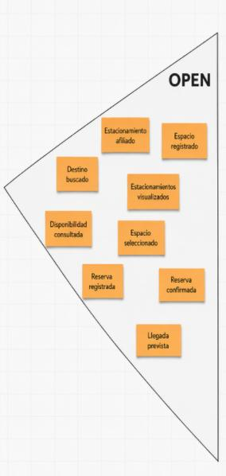

*Nota.* Elaboración propia (2026) en Miro.

Según la **Figura 10**, en esta fase se identificaron los siguientes eventos iniciales del dominio: **Estacionamiento afiliado**, **Espacio registrado**, **Destino buscado**, **Estacionamientos visualizados**, **Disponibilidad consultada**, **Espacio seleccionado**, **Reserva registrada**, **Reserva confirmada** y **Llegada prevista**. En conjunto, estos eventos representan la etapa temprana del proceso, en la que el conductor inicia la búsqueda de estacionamiento y el negocio ya dispone de espacios registrados y visibles dentro del ecosistema de la solución.

Asimismo, según la **Figura 10**, esta etapa resulta relevante porque evidencia que el problema no comienza únicamente cuando el usuario llega al local, sino desde el momento en que necesita tomar decisiones sin contar todavía con certeza sobre la disponibilidad real. Del mismo modo, incorpora desde el inicio elementos del lado operativo del negocio, evitando que el dominio quede reducido únicamente a la perspectiva del conductor.

---

### Etapa 2: Explore

En esta etapa se construyó la línea principal del dominio, ordenando cronológicamente los eventos de negocio más relevantes desde la llegada del conductor al local hasta el cierre operativo de la transacción. Esta fase permitió comprender con mayor claridad la secuencia del proceso principal y, al mismo tiempo, ubicar los principales puntos de dolor del escenario actual.

**Figura 11**

*Big Picture EventStorming - Etapa Explore*

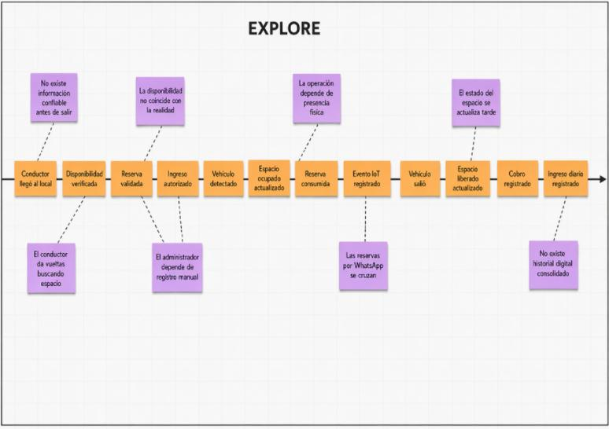

*Nota.* Elaboración propia (2026) en Miro.

Según la **Figura 11**, la línea principal del dominio quedó conformada por los siguientes eventos: **Conductor llegó al local**, **Disponibilidad verificada**, **Reserva validada**, **Ingreso autorizado**, **Vehículo detectado**, **Espacio ocupado actualizado**, **Reserva consumida**, **Evento IoT registrado**, **Vehículo salió**, **Espacio liberado actualizado**, **Cobro registrado** e **Ingreso diario registrado**. Esta secuencia resume el flujo operativo central del negocio, articulando la intención digital de la reserva con la validación operativa del administrador y con la detección física realizada por el componente IoT.

Asimismo, según la **Figura 11**, durante esta etapa se identificaron los principales **Pain Points** del dominio actual: **No existe información confiable antes de salir**, **El conductor da vueltas buscando espacio**, **La disponibilidad no coincide con la realidad**, **El administrador depende de registro manual**, **La operación depende de presencia física**, **Las reservas por WhatsApp se cruzan**, **El estado del espacio se actualiza tarde** y **No existe historial digital consolidado**. Estos puntos de dolor evidencian que el problema no se limita a la dificultad del conductor para encontrar estacionamiento, sino que también compromete la operación diaria del administrador, quien carece de automatización, visibilidad remota y trazabilidad confiable sobre lo que ocurre en su local.

En consecuencia, según la **Figura 11**, esta etapa permitió identificar con claridad la principal brecha del dominio: la desconexión entre el estado físico real del espacio de estacionamiento y la información que circula entre conductor, administrador y sistema digital. Dicha brecha constituye el núcleo del problema que ParkingNow busca resolver mediante la integración entre aplicación móvil, panel de gestión y detección física con IoT.

---

### Etapa 3: Close

En la etapa final se consolidaron los elementos que complementan el entendimiento global del dominio: actores, comandos, vistas de información y sistemas externos. Esta fase permitió responder quién interviene en el proceso, qué acciones desencadenan los eventos, qué información necesita visualizar cada participante y qué servicios externos forman parte del ecosistema.

**Figura 12**

*Big Picture EventStorming - Etapa Close*

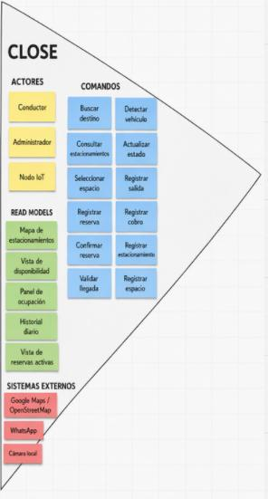

*Nota.* Elaboración propia (2026) en Miro.

Según la **Figura 12**, se identificaron como **Actors** a **Conductor**, **Administrador** y **Nodo IoT**. Estos actores representan, respectivamente, al usuario que busca y reserva estacionamiento, al operador que administra el local y al componente físico encargado de detectar ocupación y contribuir a la actualización del estado del servicio.

Asimismo, según la **Figura 12**, como **Commands** se definieron: **Buscar destino**, **Consultar estacionamientos**, **Seleccionar espacio**, **Registrar reserva**, **Confirmar reserva**, **Validar llegada**, **Detectar vehículo**, **Actualizar estado**, **Registrar salida**, **Registrar cobro**, **Registrar estacionamiento** y **Registrar espacio**. Estos comandos representan las acciones que desencadenan los hechos del dominio y permiten comprender la interacción entre los actores y la solución tecnológica.

Del mismo modo, según la **Figura 12**, como **Read Models** se identificaron: **Mapa de estacionamientos**, **Vista de disponibilidad**, **Panel de ocupación**, **Historial diario** y **Vista de reservas activas**. Estas vistas sintetizan la información necesaria para que conductores y administradores puedan tomar decisiones dentro del flujo del negocio.

Finalmente, según la **Figura 12**, se reconocieron como **External Systems** a **Google Maps / OpenStreetMap**, **WhatsApp** y **Cámara local**, ya que forman parte del entorno actual o potencial de interacción del servicio, ya sea para visualización de ubicaciones, coordinación operativa informal o apoyo visual en la supervisión del local.

---

### Conclusión del Big Picture EventStorming

Según las **Figuras 9, 10, 11 y 12**, el Big Picture EventStorming de ParkingNow permitió comprender de manera integral el flujo principal del negocio y evidenciar que el problema central del dominio radica en la falta de sincronización entre el estado físico real del estacionamiento y la información que reciben tanto el conductor como el administrador. Desde la perspectiva del conductor, esto se traduce en incertidumbre, pérdida de tiempo y estrés acumulado. Desde la perspectiva del administrador, se traduce en dependencia de registros manuales, falta de control remoto y ausencia de trazabilidad operativa consolidada.

Asimismo, este artefacto permitió identificar tempranamente los actores del dominio, los comandos relevantes, las vistas de información necesarias y los sistemas externos que intervienen en la experiencia actual del negocio. En conjunto, estos hallazgos constituyen una base directa para la siguiente etapa del informe, orientada a la definición del **Ubiquitous Language** y, posteriormente, al modelado estratégico y táctico de la solución.

**Enlace a Miro:** [Big Picture EventStorming de ParkingNow](https://miro.com/welcomeonboard/NkhScHNYNmNkT1ZsYTZIcmQybzdnRDRMRk1yRzV2SlMveGh5U0tmQ3RveGg0MDlObDIwUWxDcGhBWVpPOFQvSHArZTZWT3UxWlg2cUV2U0d2TDVacEVmQnUraUd4TE1vQmR5bitqV3AzWkRrMk1aY3N2VURpcWRrQy9YZlcrRHFhWWluRVAxeXRuUUgwWDl3Mk1qRGVRPT0hdjE=?share_link_id=213833676741)

## 2.5. Ubiquitous Language

Para asegurar una comunicación clara, consistente y sin ambigüedades entre todos los miembros del equipo y los stakeholders del proyecto, se ha definido el **Ubiquitous Language** de ParkingNow siguiendo los principios de **Domain-Driven Design (DDD)**. Este lenguaje compartido permite que los conceptos centrales del dominio del negocio sean comprendidos y utilizados de la misma manera en el análisis, el diseño y la construcción de la solución.

Los términos incluidos en esta sección corresponden únicamente al dominio de la gestión de estacionamientos urbanos y al modelo de negocio de ParkingNow. Por ello, no se consideran términos técnicos de implementación o de ingeniería de software como base de datos, API, endpoint, despliegue o repositorio. Cada término se presenta en inglés, acompañado de su equivalente en español entre paréntesis, mientras que la definición correspondiente se redacta en español.

| Término | Definición |
|---|---|
| **Administrator** (Administrador / Dueño) | Persona encargada de gestionar uno o más estacionamientos, controlar la disponibilidad de los espacios y supervisar la operación diaria del local. |
| **Affiliated Parking Lot** (Estacionamiento afiliado) | Estacionamiento que mantiene una relación formal con ParkingNow y cuyos espacios forman parte de la oferta visible para los conductores dentro del servicio. |
| **Affiliation** (Afiliación) | Relación formal mediante la cual un administrador incorpora su estacionamiento a la red de ParkingNow, permitiendo que sus espacios sean gestionados y visibles dentro del servicio. |
| **Availability** (Disponibilidad) | Condición de un espacio de estacionamiento en un momento determinado que indica si puede ser ocupado o reservado por un conductor. |
| **Booking Window** (Ventana de reserva) | Período de tiempo durante el cual una reserva permanece vigente antes de que el conductor llegue al estacionamiento. |
| **Consumed Reservation** (Reserva consumida) | Estado que adquiere una reserva cuando el conductor ya hizo uso efectivo del espacio reservado al ingresar y ocuparlo. |
| **Daily Revenue** (Ingreso diario) | Monto acumulado por el estacionamiento durante una jornada operativa a partir de los servicios de parqueo registrados. |
| **Driver** (Conductor) | Persona que utiliza un vehículo particular y busca un espacio de estacionamiento disponible para llegar a su destino de manera más rápida, predecible y segura. |
| **Entry** (Ingreso) | Hecho que marca la llegada de un vehículo a un espacio de estacionamiento y el inicio de su uso efectivo. |
| **Exit** (Salida) | Hecho que marca la liberación de un espacio de estacionamiento cuando el vehículo abandona el lugar. |
| **Non-Affiliated Parking Lot** (Estacionamiento no afiliado) | Estacionamiento que existe dentro del entorno urbano, pero que no mantiene una relación de afiliación con ParkingNow. Puede ser visible como referencia, pero no forma parte del servicio principal de reserva y disponibilidad verificada. |
| **Occupancy** (Ocupación) | Estado de un espacio de estacionamiento cuando se encuentra actualmente en uso por un vehículo. |
| **Occupancy Event** (Evento de ocupación) | Hecho relevante que registra un cambio en el estado de un espacio, como pasar de libre a ocupado o de ocupado a libre. |
| **Occupancy Status** (Estado de ocupación) | Condición en la que se encuentra un espacio de estacionamiento dentro del dominio del negocio. Puede expresarse, según el contexto operativo, como libre, reservado, ocupado o no confirmado. |
| **Parking Lot** (Estacionamiento) | Establecimiento físico que agrupa uno o más espacios de estacionamiento y ofrece el servicio de parqueo a conductores. |
| **Parking Session** (Sesión de estacionamiento) | Período durante el cual un vehículo utiliza un espacio de estacionamiento, desde su ingreso hasta su salida. |
| **Parking Space** (Espacio de estacionamiento) | Unidad física individual destinada al estacionamiento de un único vehículo dentro de un estacionamiento. |
| **Peak Demand** (Alta demanda / Hora punta) | Período del día en el que la cantidad de conductores que busca estacionamiento supera la disponibilidad habitual de espacios en una determinada zona urbana. |
| **Physical Detection** (Detección física) | Proceso mediante el cual un dispositivo instalado en el estacionamiento permite determinar si un espacio está libre u ocupado. Este mecanismo respalda la disponibilidad verificada que se muestra al conductor. |
| **Rate** (Tarifa) | Monto económico asociado al uso de un espacio de estacionamiento durante una sesión de estacionamiento o dentro de un rango de tiempo definido por el administrador. |
| **Reservation** (Reserva) | Acuerdo previo mediante el cual un conductor asegura temporalmente un espacio disponible antes de llegar físicamente al estacionamiento. |
| **Reservation Status** (Estado de reserva) | Condición en la que se encuentra una reserva dentro del proceso de negocio. Puede ser activa, confirmada, validada, consumida o cancelada. |
| **Reserved Space** (Espacio reservado) | Espacio de estacionamiento que ha sido asignado temporalmente a un conductor mediante una reserva activa y que, por ello, no debe ser ocupado por otro vehículo durante ese período. |
| **Search Time** (Tiempo de búsqueda) | Tiempo que transcurre desde que un conductor inicia la búsqueda de estacionamiento hasta que encuentra un espacio disponible o toma una decisión alternativa. |
| **Sensor Device** (Dispositivo sensor) | Dispositivo físico instalado en el estacionamiento para apoyar la verificación del estado de ocupación de los espacios. Su presencia distingue a un estacionamiento afiliado con disponibilidad verificada de uno que solo funciona como referencia. |
| **Urban Zone** (Zona urbana de alta demanda) | Área de la ciudad caracterizada por alta actividad comercial, laboral o de servicios, donde la búsqueda de estacionamiento suele ser más difícil y frecuente. |
| **Validated Reservation** (Reserva validada) | Reserva cuya vigencia y correspondencia con el conductor han sido confirmadas al momento de su llegada al estacionamiento, permitiendo autorizar el ingreso. |
| **Verified Availability** (Disponibilidad verificada) | Disponibilidad de un espacio de estacionamiento que cuenta con respaldo confiable respecto a su estado real de ocupación, reduciendo la incertidumbre tanto para el conductor como para el administrador. |

En conjunto, este lenguaje ubicuo permite establecer una base conceptual común para el dominio de ParkingNow, reduciendo ambigüedades y asegurando que todos los miembros del equipo comprendan de la misma manera los conceptos centrales del negocio. Asimismo, este glosario servirá como referencia para las siguientes secciones del informe, especialmente aquellas vinculadas al modelado del dominio, la especificación de requisitos y la arquitectura de la solución.

# Capítulo III: Requirements Specification

En este capítulo se presenta la especificación de requisitos de **ParkingNow**, a partir de los hallazgos obtenidos en las etapas previas de análisis del problema, entrevistas, needfinding, Big Picture EventStorming y definición del Ubiquitous Language. Su propósito es traducir el entendimiento del dominio en un conjunto estructurado de requisitos que orienten de manera clara el desarrollo del producto dentro del alcance del proyecto.

A partir de ello, este capítulo organiza los requerimientos funcionales, técnicos y físicos de la solución en artefactos que permiten vincular necesidades de los usuarios, objetivos del producto y decisiones de implementación a nivel de MVP académico. En particular, se detallan las **User Stories**, el **Impact Mapping** y el **Product Backlog**, con el fin de asegurar trazabilidad entre el problema identificado, el valor esperado para los segmentos objetivo y el trabajo que deberá ejecutar el equipo durante el desarrollo del sistema.

## 3.1. User Stories

En esta sección se presenta el conjunto de **User Stories** de **ParkingNow**, elaboradas a partir de los segmentos objetivo, los hallazgos de entrevistas, los User Personas y el modelado del dominio desarrollado en el capítulo anterior. Estas historias permiten expresar, desde la perspectiva de los distintos actores del sistema, las necesidades funcionales, técnicas y físicas que deben ser cubiertas por la solución propuesta.

El backlog integrado incluye historias orientadas al **Visitante** del landing page, al **Conductor**, al **Dueño o Administrador** del estacionamiento, al rol técnico **Developer** y al rol **Maker**, incorporando también **Technical Stories**, **Spike Stories**, historias de **Testing y Quality Assurance** y **Maker Stories**. Cada historia se encuentra redactada en formato **Como – quiero – para**, acompañada de criterios de aceptación en notación **Gherkin**, con el propósito de definir de manera clara, comprobable y consistente el alcance esperado del sistema.

Para mejorar la legibilidad del informe, las épicas y las historias se presentan en tablas separadas. La primera tabla resume las **19 épicas** del proyecto y la segunda consolida las **125 historias** que conforman el backlog de **ParkingNow**.

### 3.1.1. Épicas del proyecto

| Epic ID | Título | Descripción |
|---|---|---|
| EP01 | Landing Page / Visitante | Agrupa las historias orientadas a la presentación pública del producto, explicación de la propuesta de valor y captación de interés de visitantes del sitio. |
| EP02 | Conductor — Descubrimiento y búsqueda | Agrupa las historias asociadas a la búsqueda de estacionamientos cercanos, consulta de detalle y disponibilidad por espacio desde la aplicación móvil. |
| EP03 | Conductor — Reservas y ticket virtual | Agrupa las historias relacionadas con la reserva anticipada de espacios, el ticket virtual y el ciclo de vida de la reserva hasta su consumo o expiración. |
| EP04 | Conductor — Historial y estado de reserva | Agrupa las historias del seguimiento del estado actual de la reserva y la consulta del historial de uso del conductor dentro de la plataforma. |
| EP05 | Dueño / Administrador — Registro de estacionamiento y espacios | Agrupa las historias relacionadas con el alta del estacionamiento, configuración de sus espacios y mantenimiento de su información operativa. |
| EP06 | Dueño / Administrador — Monitoreo operativo y eventos | Agrupa las historias asociadas al monitoreo de estados de espacios, reservas activas, eventos IoT y vista de apoyo visual del local. |
| EP07 | Web App — Autenticación y sesión | Agrupa las historias de registro, inicio y cierre de sesión, recuperación de acceso y gestión de perfil para administradores del panel web. |
| EP08 | Mobile App — Autenticación y experiencia móvil | Agrupa las historias de registro, autenticación y experiencia base del conductor en la aplicación móvil, incluyendo manejo de sesión y perfil. |
| EP09 | Technical Stories — Backend RESTful API | Agrupa los requisitos técnicos del Core API que sustenta consultas, reservas, autenticación y exposición de datos a los clientes de la plataforma. |
| EP10 | Technical Stories — IoT API / Eventos IoT | Agrupa los requisitos técnicos de la IoT API responsable de la ingesta, validación y exposición de eventos provenientes del nodo físico. |
| EP11 | Technical Stories — Frontend Web | Agrupa los requisitos técnicos del panel web del administrador, incluyendo consumo de servicios, protección de rutas, actualización automática y manejo de errores. |
| EP12 | Technical Stories — Frontend Móvil | Agrupa los requisitos técnicos de la aplicación móvil del conductor, incluyendo consumo de servicios, manejo de permisos y actualización del estado de reservas. |
| EP13 | Technical Stories — Cloud / Realtime / Sincronización | Agrupa los requisitos técnicos relacionados con propagación en tiempo real, sincronización entre servicios, configuración por entornos y manejo del último estado conocido. |
| EP14 | Technical Stories — Embedded / Firmware ESP32 | Agrupa los requisitos técnicos del firmware del nodo ESP32, incluyendo lectura de sensores, envío de eventos, actuación local y manejo de conectividad. |
| EP15 | Technical Stories — Edge Computing / Lógica local | Agrupa los requisitos técnicos de la lógica edge del nodo: procesamiento local básico, persistencia temporal y reenvío de eventos tras recuperación de conexión. |
| EP16 | Technical Stories — Integraciones externas | Agrupa los requisitos técnicos de integración con fuentes externas como OpenStreetMap, incluyendo consumo, normalización y manejo de fallas. |
| EP17 | Technical Stories — Testing, Quality Assurance y Validación | Agrupa los requisitos técnicos orientados a asegurar la calidad, consistencia y resiliencia del sistema mediante pruebas unitarias, de integración, end-to-end y de validación de reglas críticas. |
| EP18 | Spike Stories — Investigación técnica | Agrupa los Spike Stories orientados a reducir incertidumbre técnica en aspectos críticos del proyecto, generando conocimiento verificable mediante prototipos o pruebas de concepto. |
| EP19 | Maker Stories — Maqueta física y prototipo IoT | Agrupa las historias relacionadas con la construcción, integración física, ordenamiento y documentación de la maqueta IoT utilizada para demostrar el funcionamiento de ParkingNow. |

### 3.1.2. Historias de usuario, técnicas, spike y maker stories

| Story ID | Título | Descripción | Criterios de Aceptación | Relacionado con (Epic ID) |
|---|---|---|---|---|
| US-LP.1 | Comprender la propuesta de valor del servicio | Como Visitante, quiero entender rápidamente qué ofrece ParkingNow, para decidir si el servicio se ajusta a mis necesidades de estacionamiento. | 1. Scenario: Comprensión inicial de la propuesta  Given el visitante ingresa por primera vez a la landing page  When el visitante lee la sección principal de presentación  Then el visitante identifica con claridad el problema que resuelve el servicio y a quién está dirigido   2. Scenario: Diferenciación frente a soluciones tradicionales  Given el visitante ha leído la propuesta general  When el visitante revisa la sección comparativa del servicio  Then el visitante reconoce al menos un elemento diferencial asociado al respaldo por sensado físico | EP01 |
| US-LP.2 | Conocer beneficios del servicio como conductor | Como Visitante interesado como conductor, quiero conocer los beneficios específicos para mi perfil, para evaluar si vale la pena instalar la aplicación móvil. | 1. Scenario: Beneficios para el conductor  Given el visitante se identifica con el perfil de conductor urbano  When el visitante consulta la sección de beneficios para conductores  Then el visitante identifica beneficios relacionados con ahorro de tiempo y mayor certeza sobre la disponibilidad   2. Scenario: Claridad de los beneficios  Given el visitante ha revisado los beneficios descritos  When el visitante intenta resumir lo que obtendría al usar el servicio  Then el visitante reconoce al menos tres beneficios diferenciados sin ambigüedad | EP01 |
| US-LP.3 | Conocer beneficios del servicio como administrador | Como Visitante interesado en afiliar su estacionamiento, quiero conocer los beneficios para administradores, para evaluar si el servicio responde a las necesidades operativas de mi negocio. | 1. Scenario: Beneficios para el administrador  Given el visitante se identifica como dueño o administrador de estacionamiento  When el visitante consulta la sección de beneficios para administradores  Then el visitante identifica beneficios vinculados a monitoreo, captación de demanda y reducción de gestión manual   2. Scenario: Adecuación al segmento de pequeña escala  Given el visitante opera un estacionamiento pequeño o mediano  When el visitante compara la propuesta con su operación actual  Then el visitante percibe que la propuesta se ajusta a operadores independientes | EP01 |
| US-LP.4 | Entender cómo funciona el servicio de forma simple | Como Visitante, quiero comprender de manera sencilla cómo funciona el servicio, para reducir la incertidumbre antes de tomar una decisión. | 1. Scenario: Explicación general del funcionamiento  Given el visitante desconoce el detalle técnico del servicio  When el visitante consulta la sección explicativa del funcionamiento  Then el visitante comprende cómo interactúan conductor, administrador y nodo IoT   2. Scenario: Lenguaje accesible  Given el visitante no tiene perfil técnico  When el visitante lee la descripción del funcionamiento  Then el visitante comprende la idea principal sin requerir conocimientos previos de IoT | EP01 |
| US-LP.5 | Percibir confianza y credibilidad del servicio | Como Visitante, quiero identificar señales de confianza sobre el servicio, para sentirme más seguro antes de compartir datos o afiliar mi negocio. | 1. Scenario: Señales de credibilidad visibles  Given el visitante ha recorrido las secciones principales del sitio  When el visitante busca referencias sobre la seriedad del servicio  Then el visitante encuentra elementos de confianza como descripción de la startup o información del equipo   2. Scenario: Coherencia de la información  Given el visitante compara las distintas secciones del sitio  When el visitante evalúa si los mensajes son consistentes  Then el visitante percibe coherencia entre propuesta de valor, beneficios y descripción del servicio | EP01 |
| US-LP.6 | Registrar interés mediante formulario de contacto | Como Visitante interesado, quiero dejar mis datos de contacto para recibir información adicional, para iniciar una posible relación con el servicio. | 1. Scenario: Envío exitoso del formulario  Given el visitante ha completado los campos requeridos del formulario  When el visitante confirma el envío de la solicitud  Then el sistema registra la solicitud y confirma al visitante que sus datos fueron recibidos   2. Scenario: Validación de datos mínimos  Given el visitante omite información obligatoria  When el visitante intenta enviar el formulario incompleto  Then el sistema indica qué información es requerida antes de permitir el envío | EP01 |
| US-LP.7 | Conocer quién está detrás del servicio | Como Visitante, quiero saber quién desarrolla el servicio y con qué propósito, para valorar la seriedad de la iniciativa antes de confiar en la plataforma. | 1. Scenario: Información institucional accesible  Given el visitante desea saber más sobre la organización  When el visitante consulta la sección sobre la startup  Then el visitante accede a información clara sobre la misión, visión y contexto del producto   2. Scenario: Transparencia sobre el equipo  Given el visitante evalúa la credibilidad de la solución  When el visitante revisa la información del equipo  Then el visitante comprende que el producto es desarrollado por un equipo identificado | EP01 |
| US-LP.8 | Resolver dudas frecuentes antes de adoptar el servicio | Como Visitante, quiero acceder a respuestas claras sobre las dudas más comunes, para tomar una decisión informada sin necesidad de solicitar contacto. | 1. Scenario: Acceso a preguntas frecuentes  Given el visitante tiene dudas generales sobre el servicio  When el visitante consulta la sección de preguntas frecuentes  Then el visitante encuentra respuestas sobre temas comunes como disponibilidad, reservas y afiliación   2. Scenario: Cobertura de dudas clave  Given el visitante necesita respuestas sobre aspectos operativos  When el visitante recorre el conjunto de preguntas disponibles  Then el visitante identifica al menos una respuesta que resuelve su duda principal | EP01 |
| US-DRV.1 | Identificar estacionamientos cercanos a su ubicación | Como Conductor, quiero conocer los estacionamientos disponibles cerca de donde estoy, para tomar una decisión rápida sin recorrer la zona buscando alternativas. | 1. Scenario: Consulta desde ubicación actual  Given el conductor ha otorgado permiso de ubicación a la aplicación  When el conductor consulta estacionamientos cerca de su posición  Then el conductor obtiene un conjunto de estacionamientos cercanos ordenados por proximidad   2. Scenario: Ausencia de estacionamientos cercanos  Given el conductor se encuentra en una zona sin estacionamientos registrados  When el conductor consulta estacionamientos cercanos  Then el conductor recibe una indicación clara de que no existen resultados dentro del radio consultado | EP02 |
| US-DRV.2 | Buscar estacionamientos cerca de un destino específico | Como Conductor, quiero buscar estacionamientos alrededor de un destino indicado, para planificar con anticipación dónde dejar mi vehículo antes de llegar. | 1. Scenario: Búsqueda por destino válido  Given el conductor indica un destino válido en la aplicación  When el conductor solicita estacionamientos cercanos a ese destino  Then el conductor obtiene un conjunto de estacionamientos asociados al área del destino   2. Scenario: Destino no reconocido  Given el conductor ingresa un destino no identificable  When el conductor solicita la búsqueda  Then el conductor recibe una indicación clara para reformular o precisar el destino | EP02 |
| US-DRV.3 | Consultar información relevante de un estacionamiento | Como Conductor, quiero revisar los datos principales de un estacionamiento, para decidir con mayor criterio si me conviene acercarme a ese lugar. | 1. Scenario: Detalle de estacionamiento afiliado  Given el conductor selecciona un estacionamiento afiliado al servicio  When el conductor solicita ver su información detallada  Then el conductor accede a datos clave como ubicación y disponibilidad general   2. Scenario: Detalle de estacionamiento de referencia  Given el conductor selecciona un estacionamiento solo como referencia de ubicación  When el conductor solicita ver su información  Then el conductor es informado de que ese estacionamiento no forma parte del servicio de reserva | EP02 |
| US-DRV.4 | Consultar disponibilidad por espacio en un estacionamiento afiliado | Como Conductor, quiero conocer cuántos espacios están disponibles en un estacionamiento afiliado, para decidir con confianza si me conviene desplazarme a ese lugar. | 1. Scenario: Estacionamiento con espacios disponibles  Given el conductor selecciona un estacionamiento afiliado  When el conductor consulta la disponibilidad por espacio  Then el conductor recibe información clara sobre cuántos espacios están libres al momento de la consulta   2. Scenario: Estacionamiento sin espacios disponibles  Given el conductor selecciona un estacionamiento afiliado sin espacios libres  When el conductor consulta la disponibilidad  Then el conductor es informado de manera explícita de que no hay espacios disponibles | EP02 |
| US-DRV.5 | Distinguir estacionamientos con disponibilidad verificada | Como Conductor, quiero diferenciar los estacionamientos con disponibilidad verificada por IoT de los que son solo referencia, para priorizar opciones que me dan mayor certeza antes de llegar. | 1. Scenario: Identificación de estacionamientos verificados  Given el conductor consulta los resultados de búsqueda  When el conductor observa el listado de estacionamientos  Then el conductor identifica cuáles cuentan con disponibilidad respaldada por detección física   2. Scenario: Identificación de estacionamientos no afiliados  Given el conductor observa estacionamientos del entorno que no pertenecen al servicio  When el conductor revisa su categorización  Then el conductor comprende que esos estacionamientos solo tienen valor como referencia de ubicación | EP02 |
| US-DRV.6 | Filtrar resultados por estacionamientos con disponibilidad | Como Conductor, quiero acotar los resultados a estacionamientos con espacios disponibles, para reducir opciones poco útiles cuando necesito decidir con rapidez. | 1. Scenario: Filtro con coincidencias  Given el conductor ha realizado una búsqueda inicial  When el conductor aplica el criterio de disponibilidad  Then el conductor recibe únicamente estacionamientos que reportan espacios libres al momento de la consulta   2. Scenario: Filtro sin coincidencias  Given ningún estacionamiento cercano tiene disponibilidad en el momento  When el conductor aplica el criterio de disponibilidad  Then el conductor recibe una indicación clara de que ninguna opción cumple con el criterio aplicado | EP02 |
| US-DRV.7 | Consultar información básica del estacionamiento | Como Conductor, quiero conocer información básica como horario o condiciones del estacionamiento, para evitar sorpresas al llegar y ahorrar tiempo. | 1. Scenario: Información complementaria publicada  Given el administrador ha publicado información complementaria del estacionamiento  When el conductor consulta el detalle del local  Then el conductor accede a información como horario estimado y condiciones generales   2. Scenario: Información complementaria ausente  Given el administrador no ha publicado información complementaria  When el conductor consulta el detalle del local  Then el conductor comprende que la información disponible es limitada y se muestra solo lo declarado | EP02 |
| US-DRV.8 | Reconocer si un estacionamiento está sin conexión | Como Conductor, quiero saber cuándo la disponibilidad no se está actualizando en tiempo real, para ajustar mis expectativas y decidir con información más realista. | 1. Scenario: Estacionamiento con nodo desconectado  Given el estacionamiento tiene su nodo IoT sin reportar eventos recientes  When el conductor consulta el estacionamiento  Then el conductor es informado de que la información corresponde al último estado conocido y no a una lectura actual   2. Scenario: Estacionamiento con nodo activo  Given el estacionamiento tiene su nodo IoT reportando normalmente  When el conductor consulta el estacionamiento  Then el conductor percibe que la información mostrada corresponde a un estado actualizado | EP02 |
| US-DRV.9 | Reservar un espacio disponible anticipadamente | Como Conductor, quiero reservar un espacio libre antes de llegar al estacionamiento, para asegurar mi llegada sin depender de la disponibilidad del momento. | 1. Scenario: Reserva exitosa sobre espacio disponible  Given el conductor ha identificado un espacio disponible en un estacionamiento afiliado  When el conductor confirma la reserva del espacio  Then el sistema registra la reserva y el espacio deja de estar disponible para otros conductores   2. Scenario: Reserva sobre espacio ya tomado  Given otro conductor ha reservado el mismo espacio antes  When el conductor intenta completar la reserva  Then el conductor es informado de que el espacio ya no está disponible y puede intentar con otra opción | EP03 |
| US-DRV.10 | Recibir confirmación inmediata de la reserva | Como Conductor, quiero obtener una confirmación clara cuando mi reserva es aceptada, para tener certeza del compromiso del espacio antes de desplazarme. | 1. Scenario: Confirmación inmediata  Given el conductor ha completado la acción de reserva  When el conductor espera la respuesta del sistema  Then el conductor recibe una confirmación explícita con la información esencial de la reserva   2. Scenario: Fallo durante la confirmación  Given ocurre un error temporal en el servicio de reservas  When el conductor intenta completar la reserva  Then el conductor recibe una indicación clara del problema y puede reintentar sin crear reservas duplicadas | EP03 |
| US-DRV.11 | Obtener un ticket virtual de la reserva | Como Conductor, quiero contar con un ticket virtual asociado a mi reserva, para acreditar al llegar al estacionamiento que el espacio me fue asignado. | 1. Scenario: Generación del ticket virtual  Given el conductor ha confirmado exitosamente una reserva  When el conductor accede a su ticket virtual  Then el conductor visualiza un ticket con información que identifica su reserva de forma única   2. Scenario: Consulta posterior del ticket  Given el conductor ya cuenta con una reserva activa  When el conductor consulta nuevamente el ticket durante su trayecto  Then el conductor accede al mismo ticket sin necesidad de volver a reservar | EP03 |
| US-DRV.12 | Consultar el identificador único de su reserva | Como Conductor, quiero identificar de forma única mi reserva, para poder referirme a ella con claridad al llegar al estacionamiento. | 1. Scenario: Identificador visible en la reserva  Given el conductor tiene una reserva activa  When el conductor consulta su ticket  Then el conductor accede a un identificador único asociado a su reserva   2. Scenario: Identificador estable  Given el conductor consulta la reserva en distintos momentos  When el conductor revisa el identificador en cada consulta  Then el conductor encuentra el mismo identificador durante toda la vigencia de la reserva | EP03 |
| US-DRV.13 | Conocer el tiempo límite para consumir su reserva | Como Conductor, quiero saber hasta cuándo es válida mi reserva, para organizarme y llegar a tiempo sin perder el espacio comprometido. | 1. Scenario: Tiempo límite comunicado  Given el conductor ha completado una reserva  When el conductor consulta el detalle de la reserva  Then el conductor percibe con claridad el tiempo límite a partir del cual la reserva podría expirar   2. Scenario: Proximidad al tiempo límite  Given el conductor mantiene una reserva próxima a su vencimiento  When el conductor consulta el estado de la reserva  Then el conductor es informado de que la reserva se encuentra próxima al tiempo límite | EP03 |
| US-DRV.14 | Expirar automáticamente la reserva si no se consume a tiempo | Como Conductor, quiero que el sistema libere el espacio si no llego dentro del tiempo acordado, para que el funcionamiento sea justo y el espacio pueda ofrecerse a otros conductores. | 1. Scenario: Reserva expirada por no consumo  Given el conductor no llega dentro del tiempo límite de su reserva  When el tiempo límite establecido se cumple  Then la reserva se marca como expirada y el espacio queda disponible nuevamente   2. Scenario: Consulta posterior de reserva expirada  Given el conductor tiene una reserva ya expirada  When el conductor consulta el estado de la reserva  Then el conductor percibe que la reserva se encuentra en estado expirado y comprende el motivo | EP03 |
| US-DRV.15 | Cancelar una reserva antes de utilizarla | Como Conductor, quiero cancelar mi reserva cuando mis planes cambien, para liberar el espacio a tiempo y no comprometerme innecesariamente. | 1. Scenario: Cancelación exitosa de reserva activa  Given el conductor tiene una reserva activa dentro del tiempo límite  When el conductor solicita la cancelación  Then la reserva queda cancelada y el espacio se libera para otros conductores   2. Scenario: Cancelación inválida  Given la reserva del conductor ya fue consumida o ha expirado  When el conductor intenta cancelarla  Then el conductor es informado de que la reserva no puede ser cancelada por su estado actual | EP03 |
| US-DRV.16 | Reconocer que su reserva fue consumida al ocupar el espacio | Como Conductor, quiero saber que mi reserva se marcó como consumida cuando ocupo el espacio, para confirmar que mi llegada fue reconocida correctamente por el sistema. | 1. Scenario: Reserva marcada como consumida  Given el conductor ha ocupado físicamente el espacio reservado  When el sistema detecta la ocupación del espacio asociado a esa reserva  Then el conductor puede verificar que su reserva figura como consumida en la aplicación   2. Scenario: Diferenciación frente a otros estados  Given el conductor consulta el historial de sus reservas  When el conductor revisa las reservas recientes  Then el conductor distingue claramente las reservas consumidas de las expiradas o canceladas | EP03 |
| US-DRV.17 | Consultar el estado actualizado de su reserva | Como Conductor, quiero conocer el estado actual de mi reserva activa, para tener certeza durante mi trayecto de que el espacio continúa asignado a mí. | 1. Scenario: Consulta de reserva vigente  Given el conductor tiene una reserva activa  When el conductor consulta el estado desde la aplicación  Then el conductor obtiene el estado actualizado de la reserva y del espacio asociado   2. Scenario: Consulta con nodo sin conexión  Given el nodo IoT del estacionamiento no está reportando eventos  When el conductor consulta el estado de su reserva  Then el conductor es informado de que la información no se está actualizando en tiempo real | EP04 |
| US-DRV.18 | Acceder al historial de reservas realizadas | Como Conductor, quiero revisar las reservas que he realizado previamente, para tener referencia de los estacionamientos que ya he utilizado. | 1. Scenario: Historial con reservas previas  Given el conductor ha realizado reservas con anterioridad  When el conductor accede a su historial  Then el conductor visualiza un listado ordenado de reservas pasadas con información mínima para identificarlas   2. Scenario: Historial sin reservas previas  Given el conductor aún no ha realizado reservas  When el conductor accede a su historial  Then el conductor recibe una indicación clara de que no hay reservas registradas todavía | EP04 |
| US-DRV.19 | Revisar el detalle de una reserva pasada | Como Conductor, quiero consultar los datos específicos de una reserva anterior, para recordar en qué estacionamiento estuve y bajo qué condiciones usé el servicio. | 1. Scenario: Detalle de reserva consumida  Given el conductor selecciona una reserva consumida  When el conductor consulta su detalle  Then el conductor accede a información como estacionamiento asociado, fecha y estado final   2. Scenario: Detalle de reserva cancelada o expirada  Given el conductor selecciona una reserva cancelada o expirada  When el conductor consulta su detalle  Then el conductor comprende claramente por qué esa reserva no fue consumida | EP04 |
| US-DRV.20 | Identificar rápidamente sus reservas activas | Como Conductor, quiero reconocer cuáles de mis reservas están activas, para saber si actualmente tengo un espacio comprometido sin revisar cada registro. | 1. Scenario: Existencia de reservas activas  Given el conductor tiene al menos una reserva activa  When el conductor revisa sus reservas  Then el conductor distingue claramente las reservas activas del resto   2. Scenario: Ausencia de reservas activas  Given el conductor no mantiene ninguna reserva activa  When el conductor revisa sus reservas  Then el conductor percibe con claridad que no hay reservas vigentes en ese momento | EP04 |
| US-DRV.21 | Comprender el motivo de cierre de una reserva | Como Conductor, quiero saber por qué una reserva finalizó, para entender lo ocurrido sin solicitar información al administrador. | 1. Scenario: Cierre por consumo normal  Given el conductor consulta una reserva cuyo espacio fue ocupado físicamente  When el conductor revisa el cierre de la reserva  Then el conductor comprende que la reserva finalizó al ser consumida   2. Scenario: Cierre por expiración o cancelación  Given el conductor consulta una reserva finalizada sin consumo  When el conductor revisa el motivo de cierre  Then el conductor distingue si la reserva expiró automáticamente o fue cancelada voluntariamente | EP04 |
| US-DRV.22 | Ser informado cuando el espacio reservado pierde sincronización | Como Conductor, quiero enterarme si el espacio que reservé deja de reportar su estado, para ajustar mis expectativas antes de llegar al estacionamiento. | 1. Scenario: Pérdida de sincronización del espacio reservado  Given el conductor tiene una reserva activa  When el nodo IoT asociado al espacio deja de reportar eventos  Then el conductor es informado de que el estado del espacio reservado no se está actualizando en tiempo real   2. Scenario: Recuperación de sincronización  Given el nodo IoT asociado vuelve a reportar eventos  When el conductor consulta nuevamente el estado de su reserva  Then el conductor percibe que la información vuelve a actualizarse con base en lecturas actuales | EP04 |
| US-OWN.1 | Registrar su estacionamiento en la plataforma | Como Administrador, quiero dar de alta mi estacionamiento dentro del servicio, para comenzar a gestionar mi operación desde el panel web. | 1. Scenario: Registro exitoso del estacionamiento  Given el administrador cuenta con los datos básicos de su estacionamiento  When el administrador completa el proceso de registro  Then el estacionamiento queda registrado y asociado a su cuenta como administrador responsable   2. Scenario: Datos obligatorios incompletos  Given el administrador omite datos obligatorios del registro  When el administrador intenta finalizar el alta  Then el administrador es informado de los datos faltantes antes de completar el registro | EP05 |
| US-OWN.2 | Registrar la ubicación del estacionamiento | Como Administrador, quiero registrar la ubicación precisa de mi estacionamiento, para que los conductores puedan encontrarlo correctamente en la plataforma. | 1. Scenario: Ubicación registrada correctamente  Given el administrador cuenta con la dirección y coordenadas del local  When el administrador completa la información de ubicación  Then la ubicación queda asociada al estacionamiento y puede usarse para búsquedas   2. Scenario: Ubicación incoherente  Given el administrador ingresa información inconsistente entre dirección y coordenadas  When el administrador intenta guardar la ubicación  Then el administrador es informado de la inconsistencia antes de confirmar el registro | EP05 |
| US-OWN.3 | Registrar los espacios del estacionamiento | Como Administrador, quiero configurar los espacios disponibles de mi estacionamiento, para que el sistema los reconozca y pueda monitorearlos individualmente. | 1. Scenario: Alta de espacios  Given el administrador ha registrado su estacionamiento  When el administrador agrega los espacios correspondientes  Then los espacios quedan asociados al estacionamiento y listos para su monitoreo   2. Scenario: Cantidad de espacios inválida  Given el administrador intenta registrar un número de espacios no válido  When el administrador intenta confirmar la configuración  Then el administrador es informado de que la cantidad indicada no es válida | EP05 |
| US-OWN.4 | Asignar un identificador claro a cada espacio | Como Administrador, quiero asociar un identificador reconocible a cada espacio, para diferenciar fácilmente los espacios al operar y revisar su estado. | 1. Scenario: Identificador único por espacio  Given el administrador configura los espacios de su estacionamiento  When el administrador asigna un identificador a cada uno  Then cada espacio queda asociado a un identificador distinto dentro del estacionamiento   2. Scenario: Identificador duplicado  Given el administrador intenta usar un identificador ya asignado en su estacionamiento  When el administrador intenta confirmar la asignación  Then el administrador es informado de que el identificador ya está en uso | EP05 |
| US-OWN.5 | Actualizar información del estacionamiento | Como Administrador, quiero modificar los datos de mi estacionamiento cuando sea necesario, para mantener actualizada la información que consultan los conductores. | 1. Scenario: Actualización de información básica  Given el administrador tiene su estacionamiento registrado  When el administrador actualiza datos como horario o descripción  Then los cambios quedan registrados y reflejados en la información del estacionamiento   2. Scenario: Actualización sin cambios  Given el administrador abre la edición y no realiza cambios efectivos  When el administrador intenta guardar  Then el administrador es informado de que no se detectaron modificaciones | EP05 |
| US-OWN.6 | Desactivar temporalmente un espacio | Como Administrador, quiero marcar un espacio como no disponible temporalmente, para gestionar correctamente situaciones como mantenimiento sin eliminar su configuración. | 1. Scenario: Desactivación temporal  Given el administrador tiene un espacio registrado y operativo  When el administrador lo marca como no disponible temporalmente  Then ese espacio deja de ofrecerse a los conductores hasta que el administrador lo reactive   2. Scenario: Reactivación del espacio  Given el administrador ha desactivado previamente un espacio  When el administrador lo reactiva  Then el espacio queda nuevamente disponible para reservas y monitoreo | EP05 |
| US-OWN.7 | Asociar el nodo IoT a su estacionamiento | Como Administrador, quiero vincular el nodo IoT físico a mi estacionamiento, para que los eventos detectados por sus sensores se reflejen correctamente en los espacios. | 1. Scenario: Asociación exitosa del nodo  Given el administrador cuenta con el código de identificación del nodo IoT  When el administrador completa la asociación en la plataforma  Then el nodo queda vinculado al estacionamiento y sus eventos se asignan a los espacios correspondientes   2. Scenario: Código de nodo inválido o ya asignado  Given el administrador intenta asociar un código inválido o ya vinculado a otro estacionamiento  When el administrador confirma la asociación  Then el administrador es informado del motivo del rechazo y la asociación no se completa | EP05 |
| US-OWN.8 | Conocer el estado actual de cada espacio | Como Administrador, quiero conocer en qué estado se encuentra cada espacio de mi estacionamiento, para gestionar la operación sin depender de revisión presencial constante. | 1. Scenario: Consulta de estados actuales  Given el administrador abre el panel de monitoreo  When el administrador revisa sus espacios  Then el administrador obtiene el estado actual de cada espacio como libre, reservado, ocupado o sin conexión   2. Scenario: Cambio de estado reflejado  Given un espacio cambia de estado por una reserva o por detección física  When el administrador consulta el panel luego del cambio  Then el administrador percibe el nuevo estado del espacio sin refrescar manualmente | EP06 |
| US-OWN.9 | Monitorear las reservas activas del estacionamiento | Como Administrador, quiero saber qué reservas están vigentes en mi local, para anticipar la llegada de conductores y ordenar la operación. | 1. Scenario: Existencia de reservas activas  Given el estacionamiento tiene reservas activas  When el administrador consulta la vista de reservas activas  Then el administrador accede a información mínima de cada reserva, como espacio asociado y tiempo límite   2. Scenario: Sin reservas activas  Given el estacionamiento no tiene reservas activas  When el administrador consulta la vista de reservas activas  Then el administrador percibe con claridad que no hay reservas activas vigentes | EP06 |
| US-OWN.10 | Consultar el historial de reservas del estacionamiento | Como Administrador, quiero revisar las reservas que han ocurrido en mi local, para tener trazabilidad del uso del servicio sin depender de registros manuales. | 1. Scenario: Historial con reservas  Given el estacionamiento ha tenido reservas previas  When el administrador accede al historial  Then el administrador visualiza las reservas pasadas con su estado final   2. Scenario: Historial vacío  Given el estacionamiento aún no tiene reservas registradas  When el administrador accede al historial  Then el administrador recibe una indicación clara de que no hay registros todavía | EP06 |
| US-OWN.11 | Revisar eventos IoT generados por el nodo | Como Administrador, quiero acceder a los eventos generados por el nodo IoT, para contar con trazabilidad operativa de lo que ocurre con los espacios de mi local. | 1. Scenario: Eventos IoT disponibles  Given el nodo IoT ha reportado eventos recientes  When el administrador consulta la vista de eventos  Then el administrador visualiza un listado ordenado de eventos con información del espacio involucrado   2. Scenario: Ausencia de eventos recientes  Given el nodo IoT no ha reportado eventos en el periodo consultado  When el administrador consulta la vista de eventos  Then el administrador percibe con claridad que no hay eventos registrados en ese periodo | EP06 |
| US-OWN.12 | Conocer el estado de conexión del nodo IoT | Como Administrador, quiero saber si el nodo IoT de mi estacionamiento está reportando normalmente, para reaccionar oportunamente ante incidentes operativos. | 1. Scenario: Nodo activo  Given el nodo IoT ha reportado actividad reciente  When el administrador consulta el estado de conexión  Then el administrador percibe que el nodo se encuentra operando normalmente   2. Scenario: Nodo sin conexión  Given el nodo IoT no ha reportado actividad dentro del tiempo esperado  When el administrador consulta el estado de conexión  Then el administrador es informado de que el nodo se encuentra sin conexión y de cuándo fue su último reporte | EP06 |
| US-OWN.13 | Enterarse de cambios relevantes sin revisión manual permanente | Como Administrador, quiero enterarme de cambios importantes sin estar revisando el panel todo el tiempo, para reducir la carga operativa y reaccionar solo cuando sea necesario. | 1. Scenario: Cambio relevante en la operación  Given se produce un cambio relevante como una nueva reserva o una desconexión del nodo  When el administrador tiene el panel abierto en su sesión  Then el administrador percibe el cambio sin refrescar manualmente la vista   2. Scenario: Ausencia de cambios  Given no se producen cambios relevantes durante un intervalo  When el administrador mantiene el panel abierto  Then la información del panel se mantiene estable y coherente con la operación | EP06 |
| US-OWN.14 | Apoyar la supervisión con una vista simple de cámara local | Como Administrador, quiero contar con una vista visual simple del estacionamiento, para complementar la información de ocupación cuando necesite confirmar lo que ocurre. | 1. Scenario: Acceso a la vista de cámara local  Given el estacionamiento cuenta con cámara local conectada al nodo  When el administrador accede a la vista de apoyo visual  Then el administrador visualiza una imagen básica del área del estacionamiento   2. Scenario: Cámara no disponible  Given la cámara local no se encuentra disponible en ese momento  When el administrador accede a la vista de apoyo visual  Then el administrador es informado de que la vista no está disponible temporalmente | EP06 |
| US-OWN.15 | Comprender discrepancias entre el estado lógico y el físico | Como Administrador, quiero entender qué sucede cuando un espacio reservado aparece como ocupado físicamente antes de tiempo, para reaccionar con criterio frente a estas situaciones. | 1. Scenario: Precedencia del estado físico  Given un espacio reservado es ocupado físicamente antes del consumo esperado  When el administrador consulta el estado del espacio  Then el administrador observa que el espacio aparece como ocupado y comprende que la detección física prevalece   2. Scenario: Alineación entre estado lógico y físico  Given una reserva se consume dentro del tiempo esperado  When el administrador revisa el espacio luego del consumo  Then el administrador percibe que el estado lógico y el físico son coherentes | EP06 |
| US-WEB.1 | Registrarse como administrador en el panel web | Como Administrador, quiero crear mi cuenta en el panel web, para acceder a las funcionalidades de gestión de mi estacionamiento. | 1. Scenario: Registro exitoso  Given el administrador proporciona datos válidos  When el administrador completa el proceso de registro  Then la cuenta queda creada y el administrador puede iniciar sesión   2. Scenario: Registro con datos inválidos  Given el administrador proporciona datos inválidos o incompletos  When el administrador intenta completar el registro  Then el administrador es informado de los errores antes de que se cree la cuenta | EP07 |
| US-WEB.2 | Iniciar sesión en el panel web | Como Administrador, quiero autenticarme en el panel web con mis credenciales, para acceder a la información y funcionalidades asociadas a mi estacionamiento. | 1. Scenario: Inicio de sesión exitoso  Given el administrador cuenta con credenciales válidas  When el administrador ingresa sus credenciales  Then el administrador obtiene acceso al panel y a su información   2. Scenario: Credenciales inválidas  Given el administrador ingresa credenciales incorrectas  When el administrador intenta autenticarse  Then el administrador recibe una indicación clara del error sin exponer información sensible | EP07 |
| US-WEB.3 | Cerrar sesión de forma segura | Como Administrador, quiero cerrar mi sesión cuando lo decida, para evitar que otras personas accedan a mi información desde el mismo equipo. | 1. Scenario: Cierre de sesión manual  Given el administrador se encuentra autenticado  When el administrador solicita cerrar sesión  Then la sesión se finaliza y el administrador pierde acceso a las funcionalidades protegidas   2. Scenario: Cierre automático por inactividad  Given el administrador permanece inactivo durante el tiempo configurado  When la sesión alcanza el tiempo máximo permitido  Then la sesión se cierra automáticamente y el administrador debe autenticarse nuevamente | EP07 |
| US-WEB.4 | Recuperar acceso ante olvido de credenciales | Como Administrador, quiero recuperar el acceso a mi cuenta si olvido mis credenciales, para no perder la gestión de mi estacionamiento cuando no recuerdo mi contraseña. | 1. Scenario: Solicitud válida de recuperación  Given el administrador tiene una cuenta con un correo válido  When el administrador solicita recuperar su acceso  Then el sistema envía instrucciones de recuperación al correo asociado   2. Scenario: Solicitud con correo no registrado  Given el administrador ingresa un correo no asociado a una cuenta  When el administrador solicita la recuperación  Then el sistema responde de forma consistente sin revelar si el correo existe en la plataforma | EP07 |
| US-WEB.5 | Administrar información básica de perfil | Como Administrador, quiero mantener actualizada la información básica de mi cuenta, para que la plataforma refleje datos vigentes de contacto. | 1. Scenario: Actualización del perfil  Given el administrador se encuentra autenticado  When el administrador modifica datos permitidos de su perfil  Then los cambios quedan registrados y visibles en siguientes consultas   2. Scenario: Intento de modificar datos no permitidos  Given el administrador intenta modificar información que no puede cambiarse  When el administrador intenta guardar esos cambios  Then el administrador es informado de que esos datos no pueden modificarse desde el perfil | EP07 |
| US-MOB.1 | Registrarse como conductor en la app móvil | Como Conductor, quiero crear mi cuenta desde la aplicación móvil, para acceder a las funcionalidades de búsqueda y reserva. | 1. Scenario: Registro exitoso desde la app  Given el conductor proporciona datos válidos desde la aplicación  When el conductor completa el registro  Then la cuenta queda creada y el conductor puede iniciar sesión   2. Scenario: Registro con información inválida  Given el conductor proporciona datos inválidos o incompletos  When el conductor intenta completar el registro  Then el conductor es informado de los errores antes de que se cree la cuenta | EP08 |
| US-MOB.2 | Iniciar sesión en la aplicación móvil | Como Conductor, quiero autenticarme rápidamente en la aplicación, para reservar un espacio con la menor fricción posible. | 1. Scenario: Autenticación exitosa  Given el conductor cuenta con credenciales válidas  When el conductor inicia sesión desde la aplicación  Then el conductor obtiene acceso a las funcionalidades asociadas a su cuenta   2. Scenario: Credenciales inválidas  Given el conductor ingresa credenciales incorrectas  When el conductor intenta autenticarse  Then el conductor recibe una indicación clara del error sin exponer información sensible | EP08 |
| US-MOB.3 | Cerrar sesión desde la aplicación móvil | Como Conductor, quiero cerrar mi sesión desde mi dispositivo, para evitar que terceros usen mi cuenta si comparto el equipo o lo pierdo. | 1. Scenario: Cierre de sesión manual  Given el conductor se encuentra autenticado en la app  When el conductor solicita cerrar sesión  Then la sesión se finaliza y el conductor pierde acceso a las funciones que requieren autenticación   2. Scenario: Autenticación posterior requerida  Given el conductor ha cerrado sesión previamente  When el conductor intenta acceder a funcionalidades que requieren autenticación  Then el conductor es redirigido a autenticarse nuevamente antes de continuar | EP08 |
| US-MOB.4 | Mantener su sesión activa entre usos normales | Como Conductor, quiero que mi sesión se conserve entre usos regulares de la aplicación, para no tener que autenticarme constantemente al abrir la app. | 1. Scenario: Sesión preservada entre aperturas  Given el conductor tiene sesión iniciada recientemente  When el conductor cierra y vuelve a abrir la aplicación dentro de un periodo razonable  Then el conductor accede nuevamente sin necesidad de autenticarse   2. Scenario: Expiración por inactividad prolongada  Given el conductor no utiliza la aplicación por un periodo prolongado  When el conductor vuelve a abrir la aplicación  Then la aplicación solicita autenticación nuevamente para proteger su cuenta | EP08 |
| US-MOB.5 | Actualizar información básica de su perfil desde la app | Como Conductor, quiero mantener al día mi información básica desde la aplicación, para que mis datos en la plataforma sigan siendo útiles y actualizados. | 1. Scenario: Actualización exitosa  Given el conductor se encuentra autenticado  When el conductor modifica datos permitidos de su perfil  Then los cambios quedan registrados en la cuenta del conductor   2. Scenario: Actualización inválida  Given el conductor intenta ingresar información inválida  When el conductor intenta guardar los cambios  Then el conductor es informado de los errores antes de aplicar los cambios | EP08 |
| TS-API.1 | Servicio de consulta de estacionamientos y espacios | Como Developer, quiero contar con un servicio que exponga la información de estacionamientos y sus espacios, para que los clientes web y móvil puedan presentarla de manera uniforme. | 1. Scenario: Respuesta consistente  Given el servicio está operativo y con datos disponibles  When un cliente autorizado realiza una consulta válida  Then el servicio responde con un contrato de datos que incluye estacionamiento, espacios y estado general   2. Scenario: Consulta sin resultados  Given no existen estacionamientos que cumplan los criterios enviados  When un cliente autorizado realiza la consulta  Then el servicio responde indicando ausencia de resultados sin tratarlo como error | EP09 |
| TS-API.2 | Servicio de gestión de reservas | Como Developer, quiero disponer de un servicio que gestione el ciclo de vida de las reservas, para mantener integridad operativa entre la aplicación móvil, el panel web y la información IoT. | 1. Scenario: Creación de reserva válida  Given el cliente solicita reservar un espacio disponible  When el servicio procesa la solicitud autenticada  Then el servicio registra la reserva y deja el espacio marcado como reservado   2. Scenario: Rechazo por espacio no disponible  Given el cliente solicita reservar un espacio ya tomado  When el servicio procesa la solicitud  Then el servicio rechaza la reserva y responde con información clara para el cliente | EP09 |
| TS-API.3 | Servicio de gestión de estacionamientos por el administrador | Como Developer, quiero contar con un servicio que permita al administrador gestionar su estacionamiento y sus espacios, para que las operaciones de alta y actualización se realicen de forma controlada. | 1. Scenario: Operación autorizada  Given el administrador autenticado envía una operación válida  When el servicio verifica autorización y valida la operación  Then el servicio ejecuta la operación y responde con el estado resultante   2. Scenario: Operación no autorizada  Given un cliente autenticado intenta operar sobre un estacionamiento ajeno  When el servicio procesa la solicitud  Then el servicio rechaza la operación y no produce modificaciones | EP09 |
| TS-API.4 | Servicio de autenticación de usuarios | Como Developer, quiero contar con un servicio de autenticación consistente, para que los clientes web y móvil verifiquen identidad bajo reglas uniformes. | 1. Scenario: Autenticación válida  Given un cliente envía credenciales válidas  When el servicio procesa la solicitud  Then el servicio responde con una credencial de sesión válida para el cliente   2. Scenario: Autenticación fallida  Given un cliente envía credenciales inválidas  When el servicio procesa la solicitud  Then el servicio responde con un error de autenticación sin exponer información sensible | EP09 |
| TS-API.5 | Validación consistente de solicitudes entrantes | Como Developer, quiero validar de forma consistente las solicitudes del backend, para rechazar datos inválidos antes de afectar el dominio del sistema. | 1. Scenario: Solicitud válida  Given un cliente envía una solicitud con datos válidos  When el servicio aplica sus validaciones  Then la solicitud continúa su procesamiento normal   2. Scenario: Solicitud inválida  Given un cliente envía una solicitud con datos inválidos o incompletos  When el servicio aplica sus validaciones  Then el servicio rechaza la solicitud y responde con información clara sobre los errores | EP09 |
| TS-API.6 | Manejo uniforme de errores del backend | Como Developer, quiero que el backend maneje los errores de manera uniforme, para que los clientes puedan interpretarlos y presentarlos de forma consistente. | 1. Scenario: Error controlado  Given ocurre una condición de error previsible como recurso inexistente o validación fallida  When el servicio responde al cliente  Then el servicio utiliza un formato uniforme que permite al cliente reaccionar de forma consistente   2. Scenario: Error no previsto  Given ocurre un error no previsto en el backend  When el servicio responde al cliente  Then el servicio responde con el mismo formato sin exponer detalles internos sensibles | EP09 |
| TS-API.7 | Servicio de consulta de historial de reservas | Como Developer, quiero exponer un servicio de consulta de historial de reservas, para que el conductor y el administrador accedan a su información histórica de forma ordenada. | 1. Scenario: Consulta con historial  Given existen reservas registradas para el usuario autenticado  When el cliente consulta el historial  Then el servicio responde con las reservas del usuario ordenadas por fecha   2. Scenario: Consulta sin historial  Given no existen reservas registradas para el usuario autenticado  When el cliente consulta el historial  Then el servicio responde con una lista vacía sin tratarlo como error | EP09 |
| TS-API.8 | Control de acceso por roles | Como Developer, quiero que el backend aplique control de acceso según el rol del usuario, para proteger funcionalidades sensibles de operaciones no autorizadas. | 1. Scenario: Acceso permitido según rol  Given un usuario autenticado con el rol adecuado realiza una operación  When el servicio evalúa autorización  Then el servicio permite la operación y responde normalmente   2. Scenario: Acceso denegado según rol  Given un usuario sin el rol adecuado intenta realizar una operación restringida  When el servicio evalúa autorización  Then el servicio rechaza la operación y responde con un error de autorización | EP09 |
| TS-IOT.1 | Ingesta de eventos IoT del nodo | Como Developer, quiero que la IoT API reciba de forma controlada los eventos enviados por el nodo físico, para reflejar de manera confiable los cambios detectados en los espacios. | 1. Scenario: Ingesta de evento válido  Given el nodo IoT envía un evento válido de cambio de estado  When la IoT API recibe el evento  Then la IoT API registra el evento y actualiza el estado del espacio correspondiente   2. Scenario: Ingesta de evento inválido  Given el nodo IoT envía un evento con datos incompletos o fuera de rango  When la IoT API recibe el evento  Then la IoT API descarta el evento y no produce cambios en el estado del sistema | EP10 |
| TS-IOT.2 | Validación de origen del evento IoT | Como Developer, quiero verificar que los eventos IoT provienen de un nodo autorizado, para impedir que datos externos afecten el estado real del sistema. | 1. Scenario: Evento desde nodo autorizado  Given el nodo IoT presenta credenciales válidas  When la IoT API recibe el evento  Then la IoT API procesa el evento de forma normal   2. Scenario: Evento desde origen no autorizado  Given el evento llega sin credenciales válidas  When la IoT API recibe el evento  Then la IoT API rechaza el evento sin aplicar cambios en el sistema | EP10 |
| TS-IOT.3 | Registro de heartbeat del nodo IoT | Como Developer, quiero registrar el pulso de vida del nodo IoT, para saber si el nodo continúa operando y reportando al sistema. | 1. Scenario: Heartbeat recibido a tiempo  Given el nodo IoT envía su heartbeat en el intervalo configurado  When la IoT API recibe el heartbeat  Then la IoT API actualiza la marca de último reporte del nodo   2. Scenario: Ausencia prolongada de heartbeat  Given el nodo IoT no envía heartbeat durante un periodo superior al umbral  When la IoT API evalúa la ausencia de reportes  Then la IoT API considera al nodo como sin conexión para efectos de consulta de estado | EP10 |
| TS-IOT.4 | Aplicación de la regla de precedencia de estados | Como Developer, quiero aplicar la regla de precedencia que prioriza el estado físico sobre el lógico, para que el estado visible del espacio refleje coherentemente la realidad del estacionamiento. | 1. Scenario: Conflicto resuelto a favor del estado físico  Given un espacio tiene estado lógico reservado y el sensor reporta ocupación física  When el sistema evalúa la regla de precedencia  Then el estado visible del espacio queda como ocupado por prevalencia física sobre la reserva   2. Scenario: Sin conflicto entre estados  Given un espacio tiene un único estado consistente entre su lógica de reserva y la detección física  When el sistema evalúa el estado  Then el estado visible del espacio coincide directamente con el único estado presente | EP10 |
| TS-IOT.5 | Persistencia del historial de eventos IoT | Como Developer, quiero que los eventos IoT queden registrados en el historial del sistema, para habilitar trazabilidad y validaciones posteriores. | 1. Scenario: Persistencia exitosa  Given la IoT API recibe un evento válido  When el sistema procesa el evento  Then el evento queda almacenado en el historial asociado al espacio correspondiente   2. Scenario: Consulta posterior del historial  Given existen eventos registrados en el historial  When un cliente autorizado consulta el historial  Then el sistema responde con los eventos ordenados en el tiempo | EP10 |
| TS-IOT.6 | Exposición del estado consolidado por espacio | Como Developer, quiero exponer un estado consolidado por espacio, para que los clientes presenten información coherente sin calcular la regla de precedencia por su cuenta. | 1. Scenario: Consulta con información disponible  Given los espacios tienen eventos y reservas registradas  When un cliente autorizado consulta el estado consolidado  Then el sistema responde con el estado resultante aplicando la regla de precedencia   2. Scenario: Consulta con nodo sin conexión  Given el nodo del estacionamiento se encuentra sin conexión  When un cliente autorizado consulta el estado consolidado  Then el sistema responde con el último estado conocido e indica explícitamente la falta de conexión | EP10 |
| TS-IOT.7 | Comportamiento ante desconexión del nodo | Como Developer, quiero que el sistema maneje de forma predecible la desconexión del nodo, para preservar coherencia en la experiencia del usuario ante fallas de conectividad. | 1. Scenario: Conservación del último estado conocido  Given el nodo pierde conexión luego de haber reportado eventos  When los clientes consultan el estado  Then el sistema conserva el último estado conocido y lo marca como no actualizado en tiempo real   2. Scenario: Recuperación tras reconexión  Given el nodo recupera conexión con el backend  When los clientes consultan el estado posteriormente  Then el sistema refleja los nuevos reportes del nodo retomando el comportamiento en tiempo real | EP10 |
| TS-WEB.1 | Estructura base del panel del administrador | Como Developer, quiero contar con una estructura base del panel web, para organizar coherentemente las vistas destinadas al administrador. | 1. Scenario: Navegación consistente  Given el administrador se encuentra autenticado  When el administrador se desplaza entre las vistas principales  Then la estructura base conserva orientación y consistencia entre vistas   2. Scenario: Acceso restringido a rutas protegidas  Given un usuario no autenticado intenta acceder a una vista del panel  When el cliente web evalúa la sesión  Then el cliente web impide el acceso a rutas protegidas sin autenticación | EP11 |
| TS-WEB.2 | Consumo consistente de servicios del backend | Como Developer, quiero que el cliente web consuma los servicios del backend de forma consistente, para simplificar el mantenimiento y reducir inconsistencias en la experiencia. | 1. Scenario: Respuesta exitosa del backend  Given el backend responde correctamente a las solicitudes del cliente  When el cliente web realiza sus consultas  Then el cliente web presenta la información recibida bajo el formato esperado   2. Scenario: Error controlado del backend  Given el backend responde con un error controlado  When el cliente web realiza la consulta  Then el cliente web interpreta el error y muestra un estado comprensible al administrador | EP11 |
| TS-WEB.3 | Actualización automática de vistas operativas | Como Developer, quiero que las vistas operativas se actualicen automáticamente ante cambios relevantes, para que el administrador no deba refrescar manualmente para ver novedades. | 1. Scenario: Cambio relevante notificado  Given se produce un cambio relevante como una nueva reserva o cambio de estado  When el cliente web tiene una vista operativa abierta  Then la vista incorpora el cambio sin intervención manual del administrador   2. Scenario: Pérdida momentánea de conexión  Given el cliente web pierde conexión temporalmente  When la conexión se restablece  Then el cliente web recupera la actualización automática sin requerir recarga manual | EP11 |
| TS-WEB.4 | Manejo de estados de carga y error | Como Developer, quiero que el cliente web maneje explícitamente los estados de carga y error, para que el administrador comprenda qué ocurre con la información mostrada. | 1. Scenario: Estado de carga durante consulta  Given el cliente inicia una consulta al backend  When el backend aún no ha respondido  Then el cliente web indica claramente que la información está siendo obtenida   2. Scenario: Estado de error ante falla  Given el backend responde con un error  When el cliente web procesa la respuesta  Then el cliente web muestra un estado de error comprensible y permite reintentar | EP11 |
| TS-WEB.5 | Protección del acceso a información sensible | Como Developer, quiero que el cliente web proteja la información sensible del administrador, para evitar que se exponga a usuarios no autorizados en el mismo dispositivo. | 1. Scenario: Sesión válida  Given el administrador mantiene una sesión vigente  When el administrador interactúa con el panel  Then la información sensible permanece accesible únicamente mientras la sesión es válida   2. Scenario: Cierre forzoso ante sesión inválida  Given la sesión del cliente deja de ser válida  When el administrador intenta continuar usando el panel  Then el cliente web fuerza el cierre de sesión y redirige a autenticación | EP11 |
| TS-MOB.1 | Estructura base de navegación de la app móvil | Como Developer, quiero contar con una estructura base de navegación en la app móvil, para organizar coherentemente las experiencias del conductor. | 1. Scenario: Desplazamiento consistente  Given el conductor abre la aplicación  When el conductor se desplaza entre las secciones principales  Then la estructura de navegación se mantiene consistente sin perder el contexto   2. Scenario: Regreso al punto anterior  Given el conductor se encuentra en una sección secundaria  When el conductor decide regresar  Then la aplicación retorna al punto anterior de forma predecible | EP12 |
| TS-MOB.2 | Consumo consistente de servicios del backend desde la app | Como Developer, quiero que la app móvil consuma los servicios del backend de forma consistente, para ofrecer una experiencia predecible al conductor. | 1. Scenario: Respuesta exitosa del backend  Given el backend responde correctamente a las solicitudes del cliente móvil  When la app móvil realiza sus consultas  Then la app muestra la información recibida bajo el formato esperado   2. Scenario: Error controlado del backend  Given el backend responde con un error controlado  When la app móvil realiza la consulta  Then la app interpreta el error y muestra un estado comprensible al conductor | EP12 |
| TS-MOB.3 | Actualización automática del estado de reservas activas | Como Developer, quiero que la app móvil refleje automáticamente cambios en el estado de la reserva del conductor, para que el usuario reciba información coherente sin acción manual. | 1. Scenario: Cambio de estado durante la sesión  Given la reserva del conductor cambia de estado  When el conductor tiene la aplicación abierta  Then la app móvil incorpora el cambio sin que el conductor refresque manualmente   2. Scenario: Reanudación tras pérdida de conexión  Given la app móvil pierde conexión temporalmente  When la conexión se restablece  Then la app recupera la información actualizada de la reserva | EP12 |
| TS-MOB.4 | Manejo de estados de carga y error en la app móvil | Como Developer, quiero que la app exprese con claridad los estados de carga y error, para que el conductor comprenda qué ocurre con la información solicitada. | 1. Scenario: Estado de carga durante consulta  Given la app inicia una consulta al backend  When la respuesta aún no está disponible  Then la app indica claramente al conductor que la información está siendo obtenida   2. Scenario: Estado de error durante consulta  Given el backend responde con un error  When la app procesa la respuesta  Then la app muestra un estado de error claro y permite reintentar | EP12 |
| TS-MOB.5 | Gestión del permiso de ubicación | Como Developer, quiero gestionar correctamente el permiso de ubicación del dispositivo, para habilitar funcionalidades dependientes sin degradar la experiencia cuando el permiso no está concedido. | 1. Scenario: Permiso de ubicación concedido  Given el conductor concede permiso de ubicación a la aplicación  When la app utiliza funcionalidades dependientes de la ubicación  Then la aplicación utiliza la ubicación únicamente para las funcionalidades autorizadas   2. Scenario: Permiso de ubicación denegado  Given el conductor no concede permiso de ubicación  When el conductor accede a funcionalidades que dependen de la ubicación  Then la aplicación ofrece alternativas y explica al conductor la limitación resultante | EP12 |
| TS-CLD.1 | Propagación en tiempo real de cambios de estado | Como Developer, quiero que los cambios de estado se propaguen en tiempo real a los clientes conectados, para preservar coherencia en la experiencia de conductores y administradores. | 1. Scenario: Propagación efectiva  Given un cambio de estado ocurre en el sistema  When hay clientes conectados que consumen información relacionada  Then los clientes reciben el cambio dentro de un tiempo razonable sin refresco manual   2. Scenario: Cliente sin conexión momentánea  Given un cliente pierde conexión temporalmente durante un cambio  When el cliente recupera conexión  Then el cliente recibe un estado coherente al reintegrarse | EP13 |
| TS-CLD.2 | Sincronización consistente entre Core API e IoT API | Como Developer, quiero que la Core API y la IoT API mantengan información consistente entre sí, para que los clientes observen un estado único y coherente del sistema. | 1. Scenario: Actualización reflejada en ambos servicios  Given se produce un cambio relevante originado en uno de los servicios  When ambos servicios evalúan el cambio  Then el estado consultable resulta consistente entre las distintas rutas   2. Scenario: Resolución ante inconsistencia temporal  Given ocurre una inconsistencia temporal entre los servicios  When los servicios ejecutan su rutina de sincronización  Then la inconsistencia se resuelve dentro de un tiempo razonable sin intervención manual | EP13 |
| TS-CLD.3 | Despliegue controlado de los servicios | Como Developer, quiero contar con un mecanismo controlado de despliegue de los servicios, para publicar actualizaciones de forma segura y reversible. | 1. Scenario: Despliegue exitoso  Given el equipo prepara una nueva versión estable  When se ejecuta el proceso de despliegue  Then la nueva versión queda publicada y los clientes continúan su operación normal   2. Scenario: Reversión ante fallo  Given una nueva versión genera un fallo relevante en el entorno  When el equipo decide revertir  Then el sistema vuelve a una versión estable previa en un tiempo acotado | EP13 |
| TS-CLD.4 | Configuración de servicios por entorno | Como Developer, quiero manejar configuración diferenciada por entorno, para separar operación de desarrollo y pruebas de la operación principal. | 1. Scenario: Configuración aplicada por entorno  Given los servicios se inician en un entorno determinado  When el sistema aplica la configuración correspondiente  Then los servicios operan con los parámetros asociados a ese entorno   2. Scenario: Aislamiento entre entornos  Given los servicios se inician en un entorno de pruebas  When el sistema aplica la configuración correspondiente  Then los servicios operan sin afectar datos o comportamientos del entorno principal | EP13 |
| TS-CLD.5 | Mantenimiento del último estado conocido | Como Developer, quiero que el sistema conserve el último estado conocido por espacio, para garantizar que los clientes reciban información coherente ante pérdidas de conexión. | 1. Scenario: Conservación ante desconexión del nodo  Given un nodo deja de reportar eventos  When un cliente consulta información del estacionamiento  Then el sistema responde con el último estado conocido y señala que no se actualiza en tiempo real   2. Scenario: Actualización con nueva información  Given el nodo retoma reportes válidos  When el sistema recibe nuevos eventos  Then el sistema actualiza el estado conocido reemplazando la información anterior | EP13 |
| TS-CLD.6 | Observabilidad básica de los servicios | Como Developer, quiero contar con observabilidad básica sobre los servicios, para identificar tempranamente problemas operativos sin afectar a los usuarios. | 1. Scenario: Registro de operaciones relevantes  Given los servicios procesan solicitudes  When se generan registros operativos  Then el equipo puede revisar los registros para entender el comportamiento del sistema   2. Scenario: Detección de incidencia  Given ocurre un patrón anómalo en el comportamiento de un servicio  When el equipo revisa los registros disponibles  Then la información registrada permite identificar la incidencia | EP13 |
| TS-CLD.7 | Tolerancia a fallas puntuales de conectividad | Como Developer, quiero que el sistema tolere fallas puntuales de conectividad entre componentes, para evitar que un incidente aislado degrade toda la experiencia del usuario. | 1. Scenario: Falla puntual contenida  Given ocurre una falla temporal en la conectividad entre componentes  When el sistema detecta la condición  Then el sistema continúa ofreciendo la información disponible sin impactar el resto de la operación   2. Scenario: Recuperación automática  Given la conectividad se restablece  When el sistema ejecuta su rutina de recuperación  Then los componentes vuelven a operar de forma coordinada sin intervención manual | EP13 |
| TS-EMB.1 | Lectura periódica del estado del sensor | Como Developer, quiero que el firmware del ESP32 lea periódicamente el estado del sensor asociado a cada espacio, para detectar de forma confiable los cambios de ocupación. | 1. Scenario: Lectura periódica estable  Given el nodo está energizado y operativo  When el firmware ejecuta el ciclo de lectura  Then el nodo obtiene lecturas del sensor dentro del intervalo configurado   2. Scenario: Lectura inconsistente puntual  Given el sensor reporta una lectura anómala puntual  When el firmware evalúa la lectura  Then el firmware no interpreta la lectura anómala como un cambio de estado sostenido | EP14 |
| TS-EMB.2 | Lógica local de estabilización del estado detectado | Como Developer, quiero que el firmware aplique una lógica de estabilización antes de considerar un cambio de estado, para reducir falsos positivos por lecturas transitorias. | 1. Scenario: Cambio sostenido reconocido  Given el sensor reporta una lectura compatible con un nuevo estado de forma sostenida  When el firmware evalúa la lógica de estabilización  Then el firmware reconoce el nuevo estado y lo reporta al backend   2. Scenario: Cambio transitorio no reportado  Given el sensor reporta una lectura puntual que no se sostiene  When el firmware evalúa la lógica de estabilización  Then el firmware descarta el cambio y mantiene el estado anterior | EP14 |
| TS-EMB.3 | Envío de eventos del nodo al backend | Como Developer, quiero que el nodo envíe eventos confiables al backend cuando detecte cambios relevantes, para mantener sincronizada la información del espacio. | 1. Scenario: Envío exitoso  Given el nodo reconoce un cambio sostenido de estado  When el nodo envía el evento al backend  Then el nodo recibe confirmación y marca el evento como entregado   2. Scenario: Falla en el envío  Given el nodo intenta enviar un evento y recibe una falla de conectividad  When el nodo evalúa la respuesta  Then el nodo conserva el evento para un intento posterior sin perder información | EP14 |
| TS-EMB.4 | Emisión de heartbeat del nodo | Como Developer, quiero que el nodo emita heartbeat periódico al backend, para permitir detectar oportunamente pérdidas de conexión del dispositivo. | 1. Scenario: Heartbeat emitido con normalidad  Given el nodo está operativo y con conectividad  When se cumple el intervalo configurado para el heartbeat  Then el nodo emite el heartbeat al backend   2. Scenario: Canal degradado  Given el nodo tiene conectividad intermitente  When se cumple el intervalo del heartbeat  Then el nodo intenta enviar el heartbeat y conserva su estado local ante fallas | EP14 |
| TS-EMB.5 | Actuación local mediante indicadores visuales | Como Developer, quiero que el nodo active indicadores físicos locales alineados con el estado del espacio, para ofrecer referencia operativa visible dentro del estacionamiento. | 1. Scenario: Coherencia entre indicador y estado  Given el espacio cambia de estado en el nodo  When el nodo actualiza su indicador físico local  Then el indicador físico refleja el estado actual del espacio   2. Scenario: Fallo del indicador  Given un indicador local no responde correctamente  When el nodo detecta el problema  Then el nodo conserva el estado digital correcto y el sistema no reporta al usuario un estado incorrecto | EP14 |
| TS-EMB.6 | Reconexión automática de red | Como Developer, quiero que el nodo gestione automáticamente la reconexión cuando pierda red, para reducir la intervención manual sobre el dispositivo. | 1. Scenario: Reconexión automática exitosa  Given el nodo pierde conectividad momentánea  When el firmware ejecuta su lógica de reconexión  Then el nodo restablece la conexión sin intervención manual   2. Scenario: Reconexión no lograda  Given el firmware no logra reconectar tras varios intentos  When el nodo evalúa la situación  Then el nodo entra en un estado seguro conservando información local hasta una próxima oportunidad | EP14 |
| TS-EMB.7 | Configuración inicial del nodo | Como Developer, quiero que el nodo admita una configuración inicial controlada, para asociarse correctamente a un estacionamiento sin cambios complejos en campo. | 1. Scenario: Configuración inicial exitosa  Given el nodo se energiza por primera vez con parámetros válidos  When el nodo ejecuta su proceso de configuración inicial  Then el nodo queda configurado con los parámetros necesarios para reportar al backend   2. Scenario: Parámetros inválidos  Given los parámetros de configuración iniciales son inválidos  When el nodo intenta iniciar  Then el nodo permanece en un estado seguro sin reportar eventos incorrectos | EP14 |
| TS-EDG.1 | Procesamiento edge del estado del espacio | Como Developer, quiero que el nodo procese localmente el estado del espacio antes de enviarlo al backend, para reducir eventos innecesarios y mejorar la calidad de la información reportada. | 1. Scenario: Procesamiento local de estado  Given el nodo detecta una lectura relevante  When el nodo aplica su lógica edge  Then el nodo produce un estado coherente antes de enviarlo al backend   2. Scenario: Lecturas repetidas sin cambio  Given el nodo obtiene lecturas que mantienen el mismo estado  When el nodo aplica su lógica edge  Then el nodo evita reportar cambios al backend cuando no existe variación real | EP15 |
| TS-EDG.2 | Persistencia temporal local en el nodo | Como Developer, quiero que el nodo guarde localmente sus eventos cuando el backend no esté disponible, para evitar perder información durante una caída momentánea de conexión. | 1. Scenario: Guardado local ante desconexión  Given el nodo no logra entregar eventos al backend  When el nodo evalúa el estado de conectividad  Then el nodo guarda el evento pendiente para un envío posterior   2. Scenario: Guardado con capacidad limitada  Given el almacenamiento local alcanza su capacidad disponible  When el nodo recibe un nuevo evento  Then el nodo conserva los eventos más recientes manteniendo su operación estable | EP15 |
| TS-EDG.3 | Reenvío de eventos almacenados tras reconexión | Como Developer, quiero que el nodo reenvíe los eventos guardados cuando recupera conexión, para mantener la trazabilidad del historial sin intervención manual. | 1. Scenario: Reenvío tras reconexión  Given el nodo tiene eventos guardados localmente  When el nodo recupera conexión con el backend  Then el nodo reenvía los eventos pendientes y marca como entregados los confirmados   2. Scenario: Reenvío parcial  Given solo parte de los eventos logra ser entregada  When el nodo revisa qué eventos fueron confirmados  Then el nodo conserva los no confirmados para un nuevo intento | EP15 |
| TS-EDG.4 | Orden de envío de eventos pendientes | Como Developer, quiero que el nodo envíe sus eventos pendientes en el orden en que fueron generados, para que el historial del sistema mantenga coherencia cronológica. | 1. Scenario: Envío en orden cronológico  Given el nodo tiene varios eventos pendientes de envío  When el nodo recupera conexión y comienza el reenvío  Then el nodo entrega los eventos en el mismo orden en que fueron generados   2. Scenario: Evento único pendiente  Given el nodo tiene un único evento pendiente  When el nodo envía el evento al backend  Then el evento se entrega sin depender de otros procesos | EP15 |
| TS-EDG.5 | Evitar duplicados en el reenvío | Como Developer, quiero que el nodo no reenvíe eventos ya confirmados por el backend, para que el historial no contenga cambios ficticios. | 1. Scenario: Evento confirmado no reenviado  Given el nodo envía un evento al backend  When el backend confirma su recepción  Then el nodo no vuelve a reenviar el mismo evento   2. Scenario: Reintento sin duplicación  Given el nodo no recibe confirmación oportuna de un evento enviado  When el nodo realiza un reintento  Then el backend reconoce el evento sin generar un registro duplicado | EP15 |
| TS-EDG.6 | Sincronización tras recuperación de conexión | Como Developer, quiero que el nodo sincronice su estado con el backend al recuperar conexión, para restaurar una visión coherente del espacio en el sistema. | 1. Scenario: Sincronización al reconectar  Given el nodo recupera conectividad luego de estar sin conexión  When el nodo ejecuta su rutina de sincronización  Then el estado del espacio queda coherente entre el nodo y el backend   2. Scenario: Sincronización con pendientes  Given no todos los eventos logran entregarse en un único intento  When el nodo revisa los eventos entregados  Then el nodo planifica la continuación sin perder información | EP15 |
| TS-EXT.1 | Integración con OpenStreetMap como referencia | Como Developer, quiero integrar información de OpenStreetMap para poblar el mapa inicial, para ofrecer utilidad al conductor desde el primer uso. | 1. Scenario: Obtención exitosa  Given la integración con OpenStreetMap está disponible  When el sistema consulta estacionamientos en una zona de interés  Then el sistema obtiene información válida y la integra como referencia en el mapa   2. Scenario: Información externa no disponible  Given la integración no responde correctamente  When el sistema consulta estacionamientos  Then el sistema continúa operando mostrando solo estacionamientos afiliados y señalando la limitación | EP16 |
| TS-EXT.2 | Diferenciar afiliados de referencias externas | Como Developer, quiero diferenciar técnicamente estacionamientos afiliados de los externos de referencia, para garantizar que los clientes traten cada caso de forma adecuada. | 1. Scenario: Diferenciación en la respuesta  Given existen estacionamientos afiliados y no afiliados en la zona consultada  When el sistema responde a la consulta  Then la respuesta permite distinguir claramente entre afiliados y no afiliados   2. Scenario: Ausencia de afiliados  Given solo existen estacionamientos de referencia en la zona consultada  When el sistema responde a la consulta  Then la respuesta expone únicamente referencias y deja explícito que no hay disponibilidad verificada | EP16 |
| TS-EXT.3 | Manejo de errores de integraciones externas | Como Developer, quiero manejar adecuadamente los errores de integraciones externas, para que la experiencia del usuario no se degrade ante fallas ajenas al sistema central. | 1. Scenario: Error temporal  Given la integración externa responde con un error temporal  When el sistema procesa la consulta  Then el sistema devuelve una respuesta coherente sin exponer detalles técnicos   2. Scenario: Indisponibilidad prolongada  Given la integración externa se mantiene indisponible  When el sistema continúa atendiendo consultas  Then el sistema degrada la experiencia de forma controlada indicando las limitaciones al cliente | EP16 |
| TS-EXT.4 | Caché básica de información externa | Como Developer, quiero reutilizar información obtenida recientemente de integraciones externas, para reducir consultas innecesarias y mejorar el tiempo de respuesta. | 1. Scenario: Reutilización de información reciente  Given el sistema cuenta con información reciente de una zona consultada  When un cliente solicita información de la misma zona  Then el sistema reutiliza la información disponible sin consultar nuevamente a la fuente   2. Scenario: Información vencida  Given la información almacenada ya no se considera vigente  When un cliente solicita información de la zona  Then el sistema consulta nuevamente a la fuente externa y actualiza la información reutilizable | EP16 |
| TS-EXT.5 | Normalización de datos externos | Como Developer, quiero normalizar los datos obtenidos desde fuentes externas, para integrarlos de forma coherente con el modelo interno del sistema. | 1. Scenario: Datos conformes al modelo interno  Given el sistema obtiene información externa con estructura conocida  When el sistema aplica su proceso de normalización  Then los datos quedan conformes al modelo interno y pueden ser usados por los clientes   2. Scenario: Datos incompletos  Given el sistema obtiene información externa con campos incompletos  When el sistema aplica su proceso de normalización  Then el sistema descarta o marca la información incompleta sin afectar los datos válidos | EP16 |
| TS-TST.1 | Pruebas unitarias de servicios del backend | Como Developer, quiero contar con pruebas unitarias de los servicios del backend, para asegurar el comportamiento esperado de la lógica central de forma aislada. | 1. Scenario: Escenarios principales  Given un servicio recibe entradas válidas previstas por su contrato  When se ejecutan las pruebas unitarias del servicio  Then las pruebas confirman que el servicio responde según lo esperado   2. Scenario: Casos límite  Given un servicio recibe entradas en sus límites aceptables  When se ejecutan las pruebas unitarias  Then las pruebas confirman que el servicio responde coherentemente sin efectos indeseados | EP17 |
| TS-TST.2 | Pruebas de integración entre Core API e IoT API | Como Developer, quiero validar la integración entre la Core API y la IoT API, para asegurar que el estado del sistema se mantenga coherente al atravesar ambos servicios. | 1. Scenario: Evento IoT reflejado en Core API  Given el nodo reporta un evento válido al sistema  When se ejecuta la prueba de integración  Then la prueba confirma que el estado reflejado por la Core API es coherente con el evento reportado   2. Scenario: Reserva reflejada en estado consolidado  Given se crea una reserva desde un cliente  When se ejecuta la prueba de integración  Then la prueba confirma que el estado consolidado del espacio es coherente con la reserva creada | EP17 |
| TS-TST.3 | Validación de la regla de precedencia de estados | Como Developer, quiero validar la regla de precedencia del estado del espacio, para garantizar que la ocupación física prevalece sobre la reserva cuando ambas coexisten. | 1. Scenario: Precedencia del estado físico  Given un espacio reservado es ocupado físicamente  When se ejecuta la validación de la regla  Then la validación confirma que el estado visible del espacio corresponde a ocupado   2. Scenario: Coherencia sin conflicto  Given un espacio reservado no presenta ocupación física  When se ejecuta la validación de la regla  Then la validación confirma que el estado visible se mantiene como reservado | EP17 |
| TS-TST.4 | Validación de sincronización en tiempo real | Como Developer, quiero validar que los cambios se propagan a los clientes en tiempo real, para asegurar coherencia en la experiencia del usuario ante actualizaciones del sistema. | 1. Scenario: Propagación dentro del umbral  Given se produce un cambio relevante en el sistema  When se ejecuta la validación de propagación  Then la validación confirma que los clientes reciben el cambio dentro de un umbral razonable   2. Scenario: Propagación tras reconexión  Given un cliente se reintegra a la capa realtime tras perder conexión  When se ejecuta la validación  Then la validación confirma que el cliente recibe un estado coherente tras reconectarse | EP17 |
| TS-TST.5 | Validación del comportamiento ante desconexión del nodo | Como Developer, quiero validar cómo se comporta el sistema ante desconexión del nodo IoT, para asegurar que los usuarios reciben información coherente en ese escenario. | 1. Scenario: Preservación del último estado conocido  Given el nodo deja de reportar eventos  When se ejecuta la validación de desconexión  Then la validación confirma que los clientes reciben el último estado conocido y un indicador de falta de sincronización   2. Scenario: Recuperación tras reconexión  Given el nodo recupera conexión y reporta eventos  When se ejecuta la validación  Then la validación confirma que el sistema retoma el comportamiento en tiempo real | EP17 |
| TS-TST.6 | Validación del reenvío de eventos almacenados | Como Developer, quiero validar que el nodo reenvía correctamente los eventos almacenados al recuperar conexión, para asegurar integridad del historial operativo. | 1. Scenario: Reenvío completo  Given el nodo tiene eventos almacenados y recupera conexión  When se ejecuta la validación de reenvío  Then la validación confirma que los eventos son entregados y reconocidos sin pérdida   2. Scenario: Sin duplicación  Given se ejecutan reintentos durante el reenvío  When se ejecuta la validación  Then la validación confirma que el historial del sistema no contiene eventos duplicados | EP17 |
| TS-TST.7 | Validación end-to-end del flujo principal | Como Developer, quiero validar de extremo a extremo el flujo central del sistema, para asegurar coherencia en la experiencia completa del conductor. | 1. Scenario: Flujo completo coherente  Given un conductor busca, reserva y ocupa un espacio disponible  When se ejecuta la validación end-to-end  Then la validación confirma que cada etapa refleja el estado esperado sin inconsistencias   2. Scenario: Flujo con interrupción intermedia  Given se interrumpe una etapa intermedia como la reserva  When se ejecuta la validación end-to-end  Then la validación confirma que el sistema retorna a un estado coherente sin comprometer datos | EP17 |
| TS-TST.8 | Validación de consistencia entre estado físico, lógico y mostrado | Como Developer, quiero validar que el estado físico, el lógico y el mostrado son coherentes entre sí, para asegurar la confiabilidad de la información en toda la plataforma. | 1. Scenario: Coherencia en estado estable  Given un espacio se encuentra en un estado estable  When se ejecuta la validación de consistencia  Then la validación confirma que la información mostrada coincide con el estado físico y lógico   2. Scenario: Coherencia durante transiciones  Given un espacio sufre una transición de estado  When se ejecuta la validación  Then la validación confirma que los tres niveles de información convergen al mismo estado | EP17 |
| TS-TST.9 | Validación de autenticación y autorización | Como Developer, quiero validar los mecanismos de autenticación y autorización, para asegurar que el acceso a recursos sensibles esté correctamente controlado. | 1. Scenario: Acceso permitido a usuario autorizado  Given un usuario con rol y credenciales válidas accede al sistema  When se ejecuta la validación  Then la validación confirma que el usuario accede únicamente a los recursos permitidos por su rol   2. Scenario: Acceso denegado a usuario no autorizado  Given un usuario sin permisos suficientes intenta acceder a un recurso restringido  When se ejecuta la validación  Then la validación confirma que el sistema niega el acceso sin exponer información sensible | EP17 |
| TS-TST.10 | Validación del ciclo de vida de la reserva y ticket virtual | Como Developer, quiero validar el flujo del ticket virtual y la expiración automática de reservas, para garantizar el correcto ciclo de vida de las reservas. | 1. Scenario: Ticket válido durante la vigencia  Given una reserva se encuentra dentro de su tiempo límite  When se ejecuta la validación del ticket virtual  Then la validación confirma que el ticket permanece disponible y consistente con la reserva   2. Scenario: Expiración por no consumo  Given una reserva excede su tiempo límite sin ser consumida  When se ejecuta la validación  Then la validación confirma que la reserva queda expirada y el espacio vuelve a estar disponible | EP17 |
| SP-01 | Investigación sobre confiabilidad del sensor ultrasónico | Como Developer, quiero investigar la confiabilidad del sensor ultrasónico para la detección de ocupación, para decidir con base en evidencia cómo aplicarlo dentro del nodo IoT del proyecto. | 1. Scenario: Resultado documentado  Given se definen escenarios representativos de prueba  When se ejecuta la investigación del sensor  Then se obtiene un informe con hallazgos de confiabilidad y recomendaciones técnicas   2. Scenario: Recomendación adoptable  Given se cuenta con los hallazgos principales  When se analizan alternativas de ajuste en el nodo  Then se propone una recomendación técnica verificable que puede ser adoptada por el equipo | EP18 |
| SP-02 | Investigación sobre estrategia de reconexión del nodo | Como Developer, quiero investigar distintas estrategias de reconexión del nodo ante caídas de conectividad, para elegir la opción más robusta dentro del contexto del proyecto. | 1. Scenario: Comparación documentada  Given se identifican estrategias candidatas para la reconexión  When se ejecuta la investigación correspondiente  Then se documentan ventajas, desventajas y condiciones de aplicación de cada estrategia   2. Scenario: Decisión arquitectónica  Given se dispone del análisis comparativo  When el equipo evalúa los hallazgos  Then se produce una decisión arquitectónica justificada para la reconexión del nodo | EP18 |
| SP-03 | Investigación sobre viabilidad de cámara local | Como Developer, quiero investigar la viabilidad de una vista simple de cámara local para el administrador, para determinar si es realista incorporarla dentro del alcance del proyecto. | 1. Scenario: Prueba de concepto documentada  Given se identifican alternativas técnicas viables para la vista de cámara  When se ejecuta una prueba de concepto acotada  Then se documentan hallazgos sobre calidad, latencia y complejidad de implementación   2. Scenario: Recomendación de alcance  Given se dispone de los resultados de la prueba de concepto  When el equipo evalúa los hallazgos frente al alcance del curso  Then se produce una recomendación clara sobre si incluir, limitar o descartar la funcionalidad | EP18 |
| SP-04 | Investigación sobre persistencia local en el ESP32 | Como Developer, quiero investigar alternativas de persistencia local temporal en el nodo, para definir cómo conservar eventos ante interrupciones de conectividad. | 1. Scenario: Alternativas evaluadas  Given se identifican alternativas viables de persistencia local en el nodo  When se ejecuta la investigación comparativa  Then se documentan las alternativas junto con sus implicaciones técnicas   2. Scenario: Recomendación adoptable  Given se dispone del análisis comparativo  When el equipo valora el impacto sobre el firmware del nodo  Then se produce una recomendación técnica adoptable para implementar la persistencia local | EP18 |
| SP-05 | Investigación sobre comportamiento realtime entre clientes y backend | Como Developer, quiero investigar el comportamiento en tiempo real entre clientes y backend en escenarios representativos, para anticipar riesgos de consistencia y preparar ajustes oportunos. | 1. Scenario: Escenarios evaluados  Given se definen escenarios con múltiples clientes conectados y cambios simultáneos  When se ejecuta la investigación en tiempo real  Then se documentan hallazgos sobre latencia, coherencia y manejo de reconexión   2. Scenario: Recomendaciones para el proyecto  Given se dispone de los hallazgos obtenidos  When el equipo evalúa su impacto sobre la experiencia del usuario  Then se producen recomendaciones concretas para reforzar la capa realtime del proyecto | EP18 |
| MS-01 | Construir la maqueta física del estacionamiento | Como Maker, quiero construir una maqueta física con espacios de estacionamiento definidos, para representar de forma tangible el escenario de validación del prototipo IoT. | 1. Scenario: Maqueta base construida  Given se cuenta con los materiales necesarios para la maqueta  When el equipo construye la base física del estacionamiento  Then la maqueta representa claramente al menos dos espacios de estacionamiento diferenciados   2. Scenario: Maqueta alineada al alcance del proyecto  Given el prototipo académico contempla dos espacios monitoreados  When se revisa la maqueta terminada  Then la representación física permite demostrar el flujo principal de ParkingNow sin exceder el alcance definido | EP19 |
| MS-02 | Instalar sensores ultrasónicos en la maqueta | Como Maker, quiero instalar sensores ultrasónicos en los espacios de la maqueta, para detectar físicamente la ocupación de cada espacio durante la demostración. | 1. Scenario: Sensores instalados correctamente  Given la maqueta cuenta con espacios definidos  When el equipo instala los sensores ultrasónicos en cada espacio monitoreado  Then cada sensor queda orientado hacia la zona donde se ubicará el vehículo de prueba   2. Scenario: Lectura física verificable  Given los sensores están conectados al nodo ESP32  When se coloca o retira un vehículo de prueba en un espacio  Then el sensor correspondiente genera lecturas compatibles con el cambio físico observado | EP19 |
| MS-03 | Integrar indicadores visuales locales | Como Maker, quiero integrar indicadores visuales en la maqueta, para representar localmente el estado de cada espacio durante la demostración. | 1. Scenario: Indicador asociado a cada espacio  Given la maqueta cuenta con espacios monitoreados  When el equipo instala indicadores visuales locales  Then cada espacio cuenta con una señal visible asociada a su estado operativo   2. Scenario: Coherencia visual durante la prueba  Given un espacio cambia entre libre y ocupado  When el nodo procesa el cambio de estado  Then el indicador visual refleja de forma coherente el estado detectado | EP19 |
| MS-04 | Ordenar cableado y alimentación del prototipo | Como Maker, quiero ordenar el cableado y la alimentación del prototipo, para reducir fallas físicas durante la demostración y facilitar su mantenimiento. | 1. Scenario: Cableado organizado  Given los sensores, indicadores y el ESP32 se encuentran instalados  When el equipo organiza el cableado físico del prototipo  Then las conexiones quedan identificables y no interfieren con la demostración de los espacios   2. Scenario: Alimentación estable  Given el prototipo se encuentra energizado para la prueba  When se ejecuta la demostración del flujo principal  Then el nodo y los componentes físicos operan sin interrupciones atribuibles a alimentación o conexiones sueltas | EP19 |
| MS-05 | Documentar evidencia física del prototipo IoT | Como Maker, quiero documentar la maqueta y sus componentes físicos, para sustentar la implementación del prototipo dentro del informe y la exposición final. | 1. Scenario: Evidencia visual registrada  Given la maqueta se encuentra ensamblada  When el equipo registra fotos o capturas del prototipo  Then se obtiene evidencia visual clara de la maqueta, sensores, nodo e indicadores instalados   2. Scenario: Evidencia alineada al informe  Given el informe requiere sustentar la solución IoT desarrollada  When se incorpora la evidencia del prototipo  Then la documentación permite comprender cómo la maqueta valida la trazabilidad entre evento físico y estado digital | EP19 |

## 3.2. Impact Mapping

En esta sección se presenta el **Impact Mapping** de **ParkingNow**, elaborado a partir de los hallazgos obtenidos en las entrevistas, los **User Personas**, los **User Journey Maps**, el **Big Picture EventStorming** y las **User Stories** definidas en la sección 3.1. Este artefacto permite establecer una relación clara entre los objetivos de negocio del producto, los actores principales del dominio, los cambios de comportamiento esperados en dichos actores y los entregables funcionales que la solución debe ofrecer para generar valor dentro del alcance del proyecto.

Para su elaboración, el equipo utilizó la herramienta **UXPressia**, siguiendo la lógica de **Business Goals (WHY)**, **Personas (WHO)**, **Impacts (HOW)**, **Deliverables (WHAT)** y **User Stories**. En concordancia con la rúbrica del curso, los **Business Goals** fueron formulados bajo un enfoque **SMART**, es decir, como metas específicas, medibles, alcanzables, relevantes y delimitadas en el tiempo. A partir de ello, se construyeron dos mapas diferenciados, uno para el segmento de **conductores urbanos** y otro para el segmento de **administradores de estacionamientos independientes**, con el fin de evidenciar cómo cada grupo contribuye al logro de objetivos concretos del producto.

### Segmento objetivo: Conductor urbano

El primer mapa toma como referencia al User Persona **Andrés Villanueva Ríos** y organiza la estrategia del producto en torno a tres objetivos de negocio principales: incrementar el uso de la plataforma para consultar disponibilidad de estacionamientos, fortalecer la confianza del conductor en la información mostrada por el sistema y promover el uso de la reserva anticipada dentro del piloto académico. Estos objetivos se vinculan directamente con la problemática identificada en el capítulo anterior, donde el conductor enfrenta pérdida de tiempo, incertidumbre y frustración al intentar estacionar en zonas de alta demanda vehicular de Lima Metropolitana.

Para asegurar que los objetivos del mapa sean evaluables, se formulan bajo el enfoque **SMART**:

- **Objetivo SMART 1:** Lograr que al menos el **60% de los conductores participantes del piloto académico** consulte disponibilidad de estacionamientos desde la aplicación móvil antes o durante su trayecto, dentro de un periodo de validación de **4 semanas**.
- **Objetivo SMART 2:** Alcanzar que al menos el **80% de los conductores participantes** perciba como confiable la disponibilidad mostrada por ParkingNow cuando esta se encuentre respaldada por detección física IoT, durante el periodo de validación del prototipo.
- **Objetivo SMART 3:** Conseguir que al menos el **40% de los conductores participantes** complete una reserva anticipada en menos de **5 minutos**, desde el inicio de la búsqueda hasta la generación del ticket virtual, durante el piloto académico.

**Figura 13**  
*Impact Mapping del segmento conductor urbano de ParkingNow*

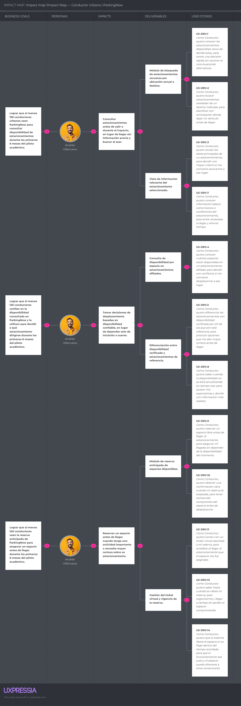

*Nota.* Elaboración propia (2026) en UXPressia.

Según la **Figura 13**, el mapa del conductor urbano se estructura sobre tres objetivos de negocio concretos. El primero busca incrementar el uso de la plataforma para consultar disponibilidad de estacionamientos durante el piloto académico. El segundo busca fortalecer la confianza del conductor en la información mostrada por el sistema, de modo que dicha información influya efectivamente en su decisión de desplazamiento. El tercero busca promover el uso de la reserva anticipada como mecanismo para reducir incertidumbre y asegurar un espacio antes de llegar al destino.

Los impactos esperados en este segmento se centran en que el conductor consulte opciones antes de salir o durante el trayecto, tome decisiones basadas en disponibilidad confiable y utilice la reserva anticipada cuando necesite mayor certeza sobre su estacionamiento. Estos cambios de comportamiento responden directamente a los pains identificados en las entrevistas y en el **User Journey Map**, donde la incertidumbre y la pérdida de tiempo aparecen como problemas recurrentes.

Para provocar dichos impactos, se definieron entregables como el módulo de búsqueda de estacionamientos cercanos, la vista de información relevante del estacionamiento, la consulta de disponibilidad por espacio, la diferenciación entre disponibilidad verificada y estacionamientos de referencia, el módulo de reserva anticipada y la gestión del ticket virtual con vigencia de reserva. Estos entregables se conectan con User Stories específicas del backlog, tales como **US-DRV.1**, **US-DRV.2**, **US-DRV.3**, **US-DRV.4**, **US-DRV.5**, **US-DRV.7**, **US-DRV.8**, **US-DRV.9**, **US-DRV.10**, **US-DRV.11**, **US-DRV.13** y **US-DRV.14**, lo que permite mantener trazabilidad entre la meta de negocio, la necesidad del usuario y el requerimiento que posteriormente será implementado por el equipo.

### Segmento objetivo: Administrador de estacionamiento independiente

El segundo mapa se orienta al User Persona **Luis Ramírez Torres**, representante del segmento de administradores de estacionamientos independientes. En este caso, el **Impact Mapping** se construye a partir de tres objetivos de negocio: promover la afiliación de estacionamientos al piloto, impulsar el uso activo de la plataforma para gestionar espacios y reservas, y facilitar la supervisión de eventos IoT y cambios operativos relevantes desde el panel web. Esta estructura responde a los hallazgos obtenidos en las entrevistas, donde se evidenció que los administradores operan con registros manuales, baja visibilidad remota y alta dependencia de su presencia física para mantener el control del negocio.

Para asegurar que los objetivos del mapa sean evaluables, se formulan bajo el enfoque **SMART**:

- **Objetivo SMART 1:** Afiliar al menos **3 estacionamientos independientes** al piloto académico de ParkingNow dentro de un periodo de validación de **4 semanas**.
- **Objetivo SMART 2:** Lograr que al menos el **70% de los administradores participantes** utilice el panel web para revisar ocupación, reservas o eventos operativos al menos **3 veces por semana** durante el piloto académico.
- **Objetivo SMART 3:** Conseguir que al menos el **80% de los cambios físicos de ocupación detectados en la maqueta IoT** se refleje correctamente en el panel web y en la aplicación móvil dentro de un tiempo razonable durante las pruebas del prototipo.

**Figura 14**  
*Impact Mapping del segmento administrador de estacionamiento independiente de ParkingNow*

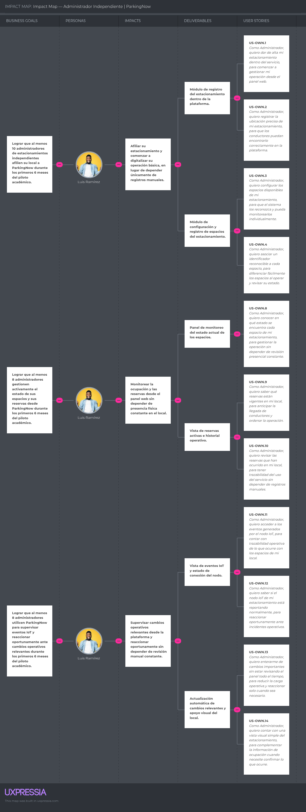

*Nota.* Elaboración propia (2026) en UXPressia.

Según la **Figura 14**, el mapa del administrador independiente se orienta a tres resultados de negocio concretos. El primero busca que más operadores afilien su estacionamiento a **ParkingNow** durante el piloto académico. El segundo busca que dichos administradores utilicen activamente la plataforma para gestionar sus espacios y reservas. El tercero busca que supervisen eventos IoT y cambios operativos relevantes desde el panel web, fortaleciendo el control del negocio sin depender de revisión presencial constante.

Los impactos definidos para este segmento buscan que el administrador afilie su estacionamiento y empiece a digitalizar su operación básica, monitoree ocupación y reservas desde el panel web sin depender de revisión presencial constante, y supervise cambios operativos relevantes desde la plataforma para reaccionar oportunamente sin revisar manualmente toda la operación. Estos impactos se alinean con los hallazgos del proceso de **Needfinding**, donde se identificó que los operadores pequeños valoran especialmente la simplicidad, la visibilidad remota y la reducción de tareas manuales.

Para responder a estos impactos, se plantearon entregables como el módulo de registro del estacionamiento, el módulo de configuración y registro de espacios, el panel de monitoreo del estado actual de los espacios, la vista de reservas activas e historial operativo, la vista de eventos IoT y estado de conexión del nodo, la actualización automática de cambios relevantes con apoyo visual del local y la maqueta IoT como evidencia física del funcionamiento del sistema. La relación entre estos entregables y el backlog se expresa a través de User Stories como **US-OWN.1**, **US-OWN.2**, **US-OWN.3**, **US-OWN.4**, **US-OWN.8**, **US-OWN.9**, **US-OWN.10**, **US-OWN.11**, **US-OWN.12**, **US-OWN.13**, **US-OWN.14**, **TS-IOT.1**, **TS-IOT.6**, **TS-EMB.1**, **TS-EMB.2**, **MS-01**, **MS-02**, **MS-03**, **MS-04** y **MS-05**, reforzando la coherencia entre el objetivo de negocio, el cambio esperado en el comportamiento del usuario y las funcionalidades priorizadas para el MVP académico.

En conjunto, ambos mapas permiten evidenciar que el desarrollo de **ParkingNow** no responde únicamente a la implementación aislada de funcionalidades, sino a una lógica estratégica en la que cada entregable y cada **User Story** contribuyen explícitamente a objetivos de negocio concretos. De esta manera, el **Impact Mapping** consolida la trazabilidad entre el problema identificado, el valor esperado para cada segmento y las decisiones funcionales, técnicas y físicas que estructuran la propuesta del producto.

## 3.3. Product Backlog

En esta sección se presenta el **Product Backlog** de **ParkingNow**, entendido como la lista priorizada de User Stories que orienta el desarrollo incremental de la solución dentro del alcance del proyecto. Su construcción se realizó a partir del backlog integrado definido en la sección 3.1, considerando como criterio principal de ordenamiento el **valor para el negocio**, tal como exige la rúbrica del curso.

En ese sentido, las historias relacionadas con el **Landing Page** y con las funcionalidades centrales de valor para los segmentos objetivo fueron ubicadas al inicio del backlog, mientras que las historias de autenticación, soporte técnico, testing, exploración y construcción física fueron ubicadas posteriormente según su aporte al desarrollo integral del producto. Para la estimación se utilizó la técnica de **Planning Poker**, asignando **Story Points** con la secuencia de Fibonacci **1, 2, 3, 5 y 8**, considerando riesgo, complejidad y repetición.

**A. URL del Product Backlog**  
**Enlace público:** https://parkingnow-backlog.atlassian.net/jira/software/projects/SCRUM/boards/1/backlog?atlOrigin=eyJpIjoiNTM4MTcxOWQyZmY0NDZiNzhiNDlmNzBmMzkyZDMxYjAiLCJwIjoiaiJ9

**B. Captura del tablero del Product Backlog**

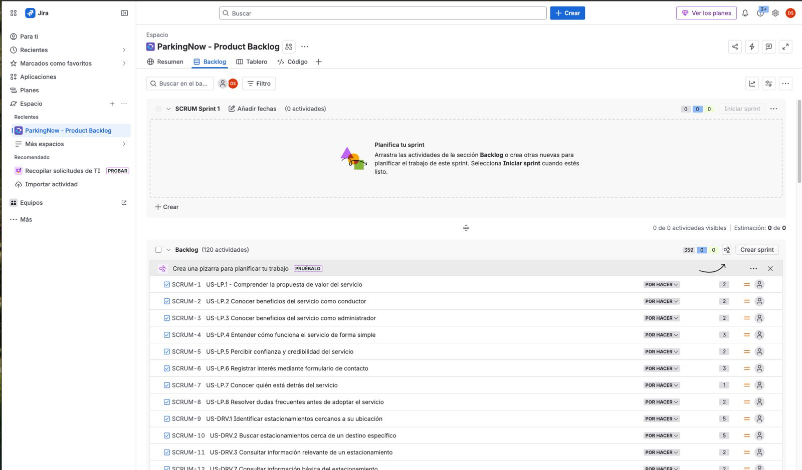

**C. Listado del Product Backlog**

| # Orden | User Story Id | Título | Descripción | Story Points (1 / 2 / 3 / 5 / 8) |
|---|---|---|---|---|
| 1 | US-LP.1 | Comprender la propuesta de valor del servicio | Como Visitante, quiero entender rápidamente qué ofrece ParkingNow, para decidir si el servicio se ajusta a mis necesidades de estacionamiento. | 2 |
| 2 | US-LP.2 | Conocer beneficios del servicio como conductor | Como Visitante interesado como conductor, quiero conocer los beneficios específicos para mi perfil, para evaluar si vale la pena instalar la aplicación móvil. | 2 |
| 3 | US-LP.3 | Conocer beneficios del servicio como administrador | Como Visitante interesado en afiliar su estacionamiento, quiero conocer los beneficios para administradores, para evaluar si el servicio responde a las necesidades operativas de mi negocio. | 2 |
| 4 | US-LP.4 | Entender cómo funciona el servicio de forma simple | Como Visitante, quiero comprender de manera sencilla cómo funciona el servicio, para reducir la incertidumbre antes de tomar una decisión. | 3 |
| 5 | US-LP.5 | Percibir confianza y credibilidad del servicio | Como Visitante, quiero identificar señales de confianza sobre el servicio, para sentirme más seguro antes de compartir datos o afiliar mi negocio. | 2 |
| 6 | US-LP.6 | Registrar interés mediante formulario de contacto | Como Visitante interesado, quiero dejar mis datos de contacto para recibir información adicional, para iniciar una posible relación con el servicio. | 3 |
| 7 | US-LP.7 | Conocer quién está detrás del servicio | Como Visitante, quiero saber quién desarrolla el servicio y con qué propósito, para valorar la seriedad de la iniciativa antes de confiar en la plataforma. | 1 |
| 8 | US-LP.8 | Resolver dudas frecuentes antes de adoptar el servicio | Como Visitante, quiero acceder a respuestas claras sobre las dudas más comunes, para tomar una decisión informada sin necesidad de solicitar contacto. | 2 |
| 9 | US-DRV.1 | Identificar estacionamientos cercanos a su ubicación | Como Conductor, quiero conocer los estacionamientos disponibles cerca de donde estoy, para tomar una decisión rápida sin recorrer la zona buscando alternativas. | 5 |
| 10 | US-DRV.2 | Buscar estacionamientos cerca de un destino específico | Como Conductor, quiero buscar estacionamientos alrededor de un destino indicado, para planificar con anticipación dónde dejar mi vehículo antes de llegar. | 5 |
| 11 | US-DRV.3 | Consultar información relevante de un estacionamiento | Como Conductor, quiero revisar los datos principales de un estacionamiento, para decidir con mayor criterio si me conviene acercarme a ese lugar. | 2 |
| 12 | US-DRV.7 | Consultar información básica del estacionamiento | Como Conductor, quiero conocer información básica como horario o condiciones del estacionamiento, para evitar sorpresas al llegar y ahorrar tiempo. | 2 |
| 13 | US-DRV.4 | Consultar disponibilidad por espacio en un estacionamiento afiliado | Como Conductor, quiero conocer cuántos espacios están disponibles en un estacionamiento afiliado, para decidir con confianza si me conviene desplazarme a ese lugar. | 3 |
| 14 | US-DRV.5 | Distinguir estacionamientos con disponibilidad verificada | Como Conductor, quiero diferenciar los estacionamientos con disponibilidad verificada por IoT de los que son solo referencia, para priorizar opciones que me dan mayor certeza antes de llegar. | 3 |
| 15 | US-DRV.6 | Filtrar resultados por estacionamientos con disponibilidad | Como Conductor, quiero acotar los resultados a estacionamientos con espacios disponibles, para reducir opciones poco útiles cuando necesito decidir con rapidez. | 2 |
| 16 | US-DRV.8 | Reconocer si un estacionamiento está sin conexión | Como Conductor, quiero saber cuándo la disponibilidad no se está actualizando en tiempo real, para ajustar mis expectativas y decidir con información más realista. | 3 |
| 17 | US-DRV.9 | Reservar un espacio disponible anticipadamente | Como Conductor, quiero reservar un espacio libre antes de llegar al estacionamiento, para asegurar mi llegada sin depender de la disponibilidad del momento. | 5 |
| 18 | US-DRV.10 | Recibir confirmación inmediata de la reserva | Como Conductor, quiero obtener una confirmación clara cuando mi reserva es aceptada, para tener certeza del compromiso del espacio antes de desplazarme. | 3 |
| 19 | US-DRV.11 | Obtener un ticket virtual de la reserva | Como Conductor, quiero contar con un ticket virtual asociado a mi reserva, para acreditar al llegar al estacionamiento que el espacio me fue asignado. | 3 |
| 20 | US-DRV.12 | Consultar el identificador único de su reserva | Como Conductor, quiero identificar de forma única mi reserva, para poder referirme a ella con claridad al llegar al estacionamiento. | 1 |
| 21 | US-DRV.13 | Conocer el tiempo límite para consumir su reserva | Como Conductor, quiero saber hasta cuándo es válida mi reserva, para organizarme y llegar a tiempo sin perder el espacio comprometido. | 2 |
| 22 | US-DRV.14 | Expirar automáticamente la reserva si no se consume a tiempo | Como Conductor, quiero que el sistema libere el espacio si no llego dentro del tiempo acordado, para que el funcionamiento sea justo y el espacio pueda ofrecerse a otros conductores. | 5 |
| 23 | US-DRV.15 | Cancelar una reserva antes de utilizarla | Como Conductor, quiero cancelar mi reserva cuando mis planes cambien, para liberar el espacio a tiempo y no comprometerme innecesariamente. | 3 |
| 24 | US-DRV.16 | Reconocer que su reserva fue consumida al ocupar el espacio | Como Conductor, quiero saber que mi reserva se marcó como consumida cuando ocupo el espacio, para confirmar que mi llegada fue reconocida correctamente por el sistema. | 3 |
| 25 | US-DRV.17 | Consultar el estado actualizado de su reserva | Como Conductor, quiero conocer el estado actual de mi reserva activa, para tener certeza durante mi trayecto de que el espacio continúa asignado a mí. | 3 |
| 26 | US-DRV.18 | Acceder al historial de reservas realizadas | Como Conductor, quiero revisar las reservas que he realizado previamente, para tener referencia de los estacionamientos que ya he utilizado. | 2 |
| 27 | US-DRV.19 | Revisar el detalle de una reserva pasada | Como Conductor, quiero consultar los datos específicos de una reserva anterior, para recordar en qué estacionamiento estuve y bajo qué condiciones usé el servicio. | 2 |
| 28 | US-DRV.20 | Identificar rápidamente sus reservas activas | Como Conductor, quiero reconocer cuáles de mis reservas están activas, para saber si actualmente tengo un espacio comprometido sin revisar cada registro. | 2 |
| 29 | US-DRV.21 | Comprender el motivo de cierre de una reserva | Como Conductor, quiero saber por qué una reserva finalizó, para entender lo ocurrido sin solicitar información al administrador. | 2 |
| 30 | US-DRV.22 | Ser informado cuando el espacio reservado pierde sincronización | Como Conductor, quiero enterarme si el espacio que reservé deja de reportar su estado, para ajustar mis expectativas antes de llegar al estacionamiento. | 3 |
| 31 | US-OWN.1 | Registrar su estacionamiento en la plataforma | Como Administrador, quiero dar de alta mi estacionamiento dentro del servicio, para comenzar a gestionar mi operación desde el panel web. | 3 |
| 32 | US-OWN.2 | Registrar la ubicación del estacionamiento | Como Administrador, quiero registrar la ubicación precisa de mi estacionamiento, para que los conductores puedan encontrarlo correctamente en la plataforma. | 2 |
| 33 | US-OWN.3 | Registrar los espacios del estacionamiento | Como Administrador, quiero configurar los espacios disponibles de mi estacionamiento, para que el sistema los reconozca y pueda monitorearlos individualmente. | 3 |
| 34 | US-OWN.4 | Asignar un identificador claro a cada espacio | Como Administrador, quiero asociar un identificador reconocible a cada espacio, para diferenciar fácilmente los espacios al operar y revisar su estado. | 2 |
| 35 | US-OWN.5 | Actualizar información del estacionamiento | Como Administrador, quiero modificar los datos de mi estacionamiento cuando sea necesario, para mantener actualizada la información que consultan los conductores. | 2 |
| 36 | US-OWN.6 | Desactivar temporalmente un espacio | Como Administrador, quiero marcar un espacio como no disponible temporalmente, para gestionar correctamente situaciones como mantenimiento sin eliminar su configuración. | 2 |
| 37 | US-OWN.7 | Asociar el nodo IoT a su estacionamiento | Como Administrador, quiero vincular el nodo IoT físico a mi estacionamiento, para que los eventos detectados por sus sensores se reflejen correctamente en los espacios. | 3 |
| 38 | US-OWN.8 | Conocer el estado actual de cada espacio | Como Administrador, quiero conocer en qué estado se encuentra cada espacio de mi estacionamiento, para gestionar la operación sin depender de revisión presencial constante. | 3 |
| 39 | US-OWN.9 | Monitorear las reservas activas del estacionamiento | Como Administrador, quiero saber qué reservas están vigentes en mi local, para anticipar la llegada de conductores y ordenar la operación. | 3 |
| 40 | US-OWN.10 | Consultar el historial de reservas del estacionamiento | Como Administrador, quiero revisar las reservas que han ocurrido en mi local, para tener trazabilidad del uso del servicio sin depender de registros manuales. | 2 |
| 41 | US-OWN.11 | Revisar eventos IoT generados por el nodo | Como Administrador, quiero acceder a los eventos generados por el nodo IoT, para contar con trazabilidad operativa de lo que ocurre con los espacios de mi local. | 3 |
| 42 | US-OWN.12 | Conocer el estado de conexión del nodo IoT | Como Administrador, quiero saber si el nodo IoT de mi estacionamiento está reportando normalmente, para reaccionar oportunamente ante incidentes operativos. | 2 |
| 43 | US-OWN.13 | Enterarse de cambios relevantes sin revisión manual permanente | Como Administrador, quiero enterarme de cambios importantes sin estar revisando el panel todo el tiempo, para reducir la carga operativa y reaccionar solo cuando sea necesario. | 3 |
| 44 | US-OWN.14 | Apoyar la supervisión con una vista simple de cámara local | Como Administrador, quiero contar con una vista visual simple del estacionamiento, para complementar la información de ocupación cuando necesite confirmar lo que ocurre. | 5 |
| 45 | US-OWN.15 | Comprender discrepancias entre el estado lógico y el físico | Como Administrador, quiero entender qué sucede cuando un espacio reservado aparece como ocupado físicamente antes de tiempo, para reaccionar con criterio frente a estas situaciones. | 3 |
| 46 | TS-API.1 | Servicio de consulta de estacionamientos y espacios | Como Developer, quiero contar con un servicio que exponga la información de estacionamientos y sus espacios, para que los clientes web y móvil puedan presentarla de manera uniforme. | 5 |
| 47 | TS-API.2 | Servicio de gestión de reservas | Como Developer, quiero disponer de un servicio que gestione el ciclo de vida de las reservas, para mantener integridad operativa entre la aplicación móvil, el panel web y la información IoT. | 8 |
| 48 | TS-API.3 | Servicio de gestión de estacionamientos por el administrador | Como Developer, quiero contar con un servicio que permita al administrador gestionar su estacionamiento y sus espacios, para que las operaciones de alta y actualización se realicen de forma controlada. | 5 |
| 49 | TS-API.5 | Validación consistente de solicitudes entrantes | Como Developer, quiero validar de forma consistente las solicitudes del backend, para rechazar datos inválidos antes de afectar el dominio del sistema. | 3 |
| 50 | TS-API.6 | Manejo uniforme de errores del backend | Como Developer, quiero que el backend maneje los errores de manera uniforme, para que los clientes puedan interpretarlos y presentarlos de forma consistente. | 2 |
| 51 | TS-API.7 | Servicio de consulta de historial de reservas | Como Developer, quiero exponer un servicio de consulta de historial de reservas, para que el conductor y el administrador accedan a su información histórica de forma ordenada. | 3 |
| 52 | TS-IOT.1 | Ingesta de eventos IoT del nodo | Como Developer, quiero que la IoT API reciba de forma controlada los eventos enviados por el nodo físico, para reflejar de manera confiable los cambios detectados en los espacios. | 5 |
| 53 | TS-IOT.4 | Aplicación de la regla de precedencia de estados | Como Developer, quiero aplicar la regla de precedencia que prioriza el estado físico sobre el lógico, para que el estado visible del espacio refleje coherentemente la realidad del estacionamiento. | 5 |
| 54 | TS-IOT.6 | Exposición del estado consolidado por espacio | Como Developer, quiero exponer un estado consolidado por espacio, para que los clientes presenten información coherente sin calcular la regla de precedencia por su cuenta. | 5 |
| 55 | TS-IOT.7 | Comportamiento ante desconexión del nodo | Como Developer, quiero que el sistema maneje de forma predecible la desconexión del nodo, para preservar coherencia en la experiencia del usuario ante fallas de conectividad. | 3 |
| 56 | TS-IOT.3 | Registro de heartbeat del nodo IoT | Como Developer, quiero registrar el pulso de vida del nodo IoT, para saber si el nodo continúa operando y reportando al sistema. | 2 |
| 57 | TS-IOT.5 | Persistencia del historial de eventos IoT | Como Developer, quiero que los eventos IoT queden registrados en el historial del sistema, para habilitar trazabilidad y validaciones posteriores. | 3 |
| 58 | TS-CLD.1 | Propagación en tiempo real de cambios de estado | Como Developer, quiero que los cambios de estado se propaguen en tiempo real a los clientes conectados, para preservar coherencia en la experiencia de conductores y administradores. | 5 |
| 59 | TS-CLD.2 | Sincronización consistente entre Core API e IoT API | Como Developer, quiero que la Core API y la IoT API mantengan información consistente entre sí, para que los clientes observen un estado único y coherente del sistema. | 5 |
| 60 | TS-CLD.5 | Mantenimiento del último estado conocido | Como Developer, quiero que el sistema conserve el último estado conocido por espacio, para garantizar que los clientes reciban información coherente ante pérdidas de conexión. | 3 |
| 61 | TS-CLD.7 | Tolerancia a fallas puntuales de conectividad | Como Developer, quiero que el sistema tolere fallas puntuales de conectividad entre componentes, para evitar que un incidente aislado degrade toda la experiencia del usuario. | 3 |
| 62 | TS-CLD.6 | Observabilidad básica de los servicios | Como Developer, quiero contar con observabilidad básica sobre los servicios, para identificar tempranamente problemas operativos sin afectar a los usuarios. | 2 |
| 63 | TS-CLD.4 | Configuración de servicios por entorno | Como Developer, quiero manejar configuración diferenciada por entorno, para separar operación de desarrollo y pruebas de la operación principal. | 2 |
| 64 | TS-CLD.3 | Despliegue controlado de los servicios | Como Developer, quiero contar con un mecanismo controlado de despliegue de los servicios, para publicar actualizaciones de forma segura y reversible. | 3 |
| 65 | TS-WEB.1 | Estructura base del panel del administrador | Como Developer, quiero contar con una estructura base del panel web, para organizar coherentemente las vistas destinadas al administrador. | 2 |
| 66 | TS-WEB.2 | Consumo consistente de servicios del backend | Como Developer, quiero que el cliente web consuma los servicios del backend de forma consistente, para simplificar el mantenimiento y reducir inconsistencias en la experiencia. | 3 |
| 67 | TS-WEB.3 | Actualización automática de vistas operativas | Como Developer, quiero que las vistas operativas se actualicen automáticamente ante cambios relevantes, para que el administrador no deba refrescar manualmente para ver novedades. | 3 |
| 68 | TS-WEB.4 | Manejo de estados de carga y error | Como Developer, quiero que el cliente web maneje explícitamente los estados de carga y error, para que el administrador comprenda qué ocurre con la información mostrada. | 2 |
| 69 | TS-MOB.1 | Estructura base de navegación de la app móvil | Como Developer, quiero contar con una estructura base de navegación en la app móvil, para organizar coherentemente las experiencias del conductor. | 2 |
| 70 | TS-MOB.2 | Consumo consistente de servicios del backend desde la app | Como Developer, quiero que la app móvil consuma los servicios del backend de forma consistente, para ofrecer una experiencia predecible al conductor. | 3 |
| 71 | TS-MOB.3 | Actualización automática del estado de reservas activas | Como Developer, quiero que la app móvil refleje automáticamente cambios en el estado de la reserva del conductor, para que el usuario reciba información coherente sin acción manual. | 3 |
| 72 | TS-MOB.4 | Manejo de estados de carga y error en la app móvil | Como Developer, quiero que la app exprese con claridad los estados de carga y error, para que el conductor comprenda qué ocurre con la información solicitada. | 2 |
| 73 | TS-MOB.5 | Gestión del permiso de ubicación | Como Developer, quiero gestionar correctamente el permiso de ubicación del dispositivo, para habilitar funcionalidades dependientes sin degradar la experiencia cuando el permiso no está concedido. | 2 |
| 74 | TS-EXT.1 | Integración con OpenStreetMap como referencia | Como Developer, quiero integrar información de OpenStreetMap para poblar el mapa inicial, para ofrecer utilidad al conductor desde el primer uso. | 3 |
| 75 | TS-EXT.2 | Diferenciar afiliados de referencias externas | Como Developer, quiero diferenciar técnicamente estacionamientos afiliados de los externos de referencia, para garantizar que los clientes traten cada caso de forma adecuada. | 2 |
| 76 | TS-EXT.5 | Normalización de datos externos | Como Developer, quiero normalizar los datos obtenidos desde fuentes externas, para integrarlos de forma coherente con el modelo interno del sistema. | 2 |
| 77 | TS-EXT.4 | Caché básica de información externa | Como Developer, quiero reutilizar información obtenida recientemente de integraciones externas, para reducir consultas innecesarias y mejorar el tiempo de respuesta. | 2 |
| 78 | TS-EXT.3 | Manejo de errores de integraciones externas | Como Developer, quiero manejar adecuadamente los errores de integraciones externas, para que la experiencia del usuario no se degrade ante fallas ajenas al sistema central. | 2 |
| 79 | TS-EMB.1 | Lectura periódica del estado del sensor | Como Developer, quiero que el firmware del ESP32 lea periódicamente el estado del sensor asociado a cada espacio, para detectar de forma confiable los cambios de ocupación. | 3 |
| 80 | TS-EMB.2 | Lógica local de estabilización del estado detectado | Como Developer, quiero que el firmware aplique una lógica de estabilización antes de considerar un cambio de estado, para reducir falsos positivos por lecturas transitorias. | 5 |
| 81 | TS-EMB.3 | Envío de eventos del nodo al backend | Como Developer, quiero que el nodo envíe eventos confiables al backend cuando detecte cambios relevantes, para mantener sincronizada la información del espacio. | 5 |
| 82 | TS-EMB.4 | Emisión de heartbeat del nodo | Como Developer, quiero que el nodo emita heartbeat periódico al backend, para permitir detectar oportunamente pérdidas de conexión del dispositivo. | 2 |
| 83 | TS-EMB.5 | Actuación local mediante indicadores visuales | Como Developer, quiero que el nodo active indicadores físicos locales alineados con el estado del espacio, para ofrecer referencia operativa visible dentro del estacionamiento. | 2 |
| 84 | TS-EMB.6 | Reconexión automática de red | Como Developer, quiero que el nodo gestione automáticamente la reconexión cuando pierda red, para reducir la intervención manual sobre el dispositivo. | 3 |
| 85 | TS-EMB.7 | Configuración inicial del nodo | Como Developer, quiero que el nodo admita una configuración inicial controlada, para asociarse correctamente a un estacionamiento sin cambios complejos en campo. | 2 |
| 86 | MS-01 | Construir la maqueta física del estacionamiento | Como Maker, quiero construir una maqueta física con espacios de estacionamiento definidos, para representar de forma tangible el escenario de validación del prototipo IoT. | 3 |
| 87 | MS-02 | Instalar sensores ultrasónicos en la maqueta | Como Maker, quiero instalar sensores ultrasónicos en los espacios de la maqueta, para detectar físicamente la ocupación de cada espacio durante la demostración. | 5 |
| 88 | MS-03 | Integrar indicadores visuales locales | Como Maker, quiero integrar indicadores visuales en la maqueta, para representar localmente el estado de cada espacio durante la demostración. | 3 |
| 89 | MS-04 | Ordenar cableado y alimentación del prototipo | Como Maker, quiero ordenar el cableado y la alimentación del prototipo, para reducir fallas físicas durante la demostración y facilitar su mantenimiento. | 2 |
| 90 | MS-05 | Documentar evidencia física del prototipo IoT | Como Maker, quiero documentar la maqueta y sus componentes físicos, para sustentar la implementación del prototipo dentro del informe y la exposición final. | 2 |
| 91 | TS-EDG.1 | Procesamiento edge del estado del espacio | Como Developer, quiero que el nodo procese localmente el estado del espacio antes de enviarlo al backend, para reducir eventos innecesarios y mejorar la calidad de la información reportada. | 3 |
| 92 | TS-EDG.2 | Persistencia temporal local en el nodo | Como Developer, quiero que el nodo guarde localmente sus eventos cuando el backend no esté disponible, para evitar perder información durante una caída momentánea de conexión. | 5 |
| 93 | TS-EDG.3 | Reenvío de eventos almacenados tras reconexión | Como Developer, quiero que el nodo reenvíe los eventos guardados cuando recupera conexión, para mantener la trazabilidad del historial sin intervención manual. | 5 |
| 94 | TS-EDG.4 | Orden de envío de eventos pendientes | Como Developer, quiero que el nodo envíe sus eventos pendientes en el orden en que fueron generados, para que el historial del sistema mantenga coherencia cronológica. | 2 |
| 95 | TS-EDG.5 | Evitar duplicados en el reenvío | Como Developer, quiero que el nodo no reenvíe eventos ya confirmados por el backend, para que el historial no contenga cambios ficticios. | 3 |
| 96 | TS-EDG.6 | Sincronización tras recuperación de conexión | Como Developer, quiero que el nodo sincronice su estado con el backend al recuperar conexión, para restaurar una visión coherente del espacio en el sistema. | 3 |
| 97 | TS-TST.1 | Pruebas unitarias de servicios del backend | Como Developer, quiero contar con pruebas unitarias de los servicios del backend, para asegurar el comportamiento esperado de la lógica central de forma aislada. | 3 |
| 98 | TS-TST.2 | Pruebas de integración entre Core API e IoT API | Como Developer, quiero validar la integración entre la Core API y la IoT API, para asegurar que el estado del sistema se mantenga coherente al atravesar ambos servicios. | 5 |
| 99 | TS-TST.3 | Validación de la regla de precedencia de estados | Como Developer, quiero validar la regla de precedencia del estado del espacio, para garantizar que la ocupación física prevalece sobre la reserva cuando ambas coexisten. | 3 |
| 100 | TS-TST.4 | Validación de sincronización en tiempo real | Como Developer, quiero validar que los cambios se propagan a los clientes en tiempo real, para asegurar coherencia en la experiencia del usuario ante actualizaciones del sistema. | 5 |
| 101 | TS-TST.5 | Validación del comportamiento ante desconexión del nodo | Como Developer, quiero validar cómo se comporta el sistema ante desconexión del nodo IoT, para asegurar que los usuarios reciben información coherente en ese escenario. | 3 |
| 102 | TS-TST.6 | Validación del reenvío de eventos almacenados | Como Developer, quiero validar que el nodo reenvía correctamente los eventos almacenados al recuperar conexión, para asegurar integridad del historial operativo. | 3 |
| 103 | TS-TST.7 | Validación end-to-end del flujo principal | Como Developer, quiero validar de extremo a extremo el flujo central del sistema, para asegurar coherencia en la experiencia completa del conductor. | 8 |
| 104 | TS-TST.8 | Validación de consistencia entre estado físico, lógico y mostrado | Como Developer, quiero validar que el estado físico, el lógico y el mostrado son coherentes entre sí, para asegurar la confiabilidad de la información en toda la plataforma. | 5 |
| 105 | TS-TST.10 | Validación del ciclo de vida de la reserva y ticket virtual | Como Developer, quiero validar el flujo del ticket virtual y la expiración automática de reservas, para garantizar el correcto ciclo de vida de las reservas. | 3 |
| 106 | SP-01 | Investigación sobre confiabilidad del sensor ultrasónico | Como Developer, quiero investigar la confiabilidad del sensor ultrasónico para la detección de ocupación, para decidir con base en evidencia cómo aplicarlo dentro del nodo IoT del proyecto. | 3 |
| 107 | SP-02 | Investigación sobre estrategia de reconexión del nodo | Como Developer, quiero investigar distintas estrategias de reconexión del nodo ante caídas de conectividad, para elegir la opción más robusta dentro del contexto del proyecto. | 3 |
| 108 | SP-03 | Investigación sobre viabilidad de cámara local | Como Developer, quiero investigar la viabilidad de una vista simple de cámara local para el administrador, para determinar si es realista incorporarla dentro del alcance del proyecto. | 5 |
| 109 | SP-04 | Investigación sobre persistencia local en el ESP32 | Como Developer, quiero investigar alternativas de persistencia local temporal en el nodo, para definir cómo conservar eventos ante interrupciones de conectividad. | 3 |
| 110 | SP-05 | Investigación sobre comportamiento realtime entre clientes y backend | Como Developer, quiero investigar el comportamiento en tiempo real entre clientes y backend en escenarios representativos, para anticipar riesgos de consistencia y preparar ajustes oportunos. | 5 |
| 111 | US-WEB.1 | Registrarse como administrador en el panel web | Como Administrador, quiero crear mi cuenta en el panel web, para acceder a las funcionalidades de gestión de mi estacionamiento. | 3 |
| 112 | US-MOB.1 | Registrarse como conductor en la app móvil | Como Conductor, quiero crear mi cuenta desde la aplicación móvil, para acceder a las funcionalidades de búsqueda y reserva. | 3 |
| 113 | US-WEB.2 | Iniciar sesión en el panel web | Como Administrador, quiero autenticarme en el panel web con mis credenciales, para acceder a la información y funcionalidades asociadas a mi estacionamiento. | 2 |
| 114 | US-MOB.2 | Iniciar sesión en la aplicación móvil | Como Conductor, quiero autenticarme rápidamente en la aplicación, para reservar un espacio con la menor fricción posible. | 2 |
| 115 | US-WEB.4 | Recuperar acceso ante olvido de credenciales | Como Administrador, quiero recuperar el acceso a mi cuenta si olvido mis credenciales, para no perder la gestión de mi estacionamiento cuando no recuerdo mi contraseña. | 2 |
| 116 | US-MOB.4 | Mantener su sesión activa entre usos normales | Como Conductor, quiero que mi sesión se conserve entre usos regulares de la aplicación, para no tener que autenticarme constantemente al abrir la app. | 2 |
| 117 | US-WEB.3 | Cerrar sesión de forma segura | Como Administrador, quiero cerrar mi sesión cuando lo decida, para evitar que otras personas accedan a mi información desde el mismo equipo. | 1 |
| 118 | US-MOB.3 | Cerrar sesión desde la aplicación móvil | Como Conductor, quiero cerrar mi sesión desde mi dispositivo, para evitar que terceros usen mi cuenta si comparto el equipo o lo pierdo. | 1 |
| 119 | US-WEB.5 | Administrar información básica de perfil | Como Administrador, quiero mantener actualizada la información básica de mi cuenta, para que la plataforma refleje datos vigentes de contacto. | 1 |
| 120 | US-MOB.5 | Actualizar información básica de su perfil desde la app | Como Conductor, quiero mantener al día mi información básica desde la aplicación, para que mis datos en la plataforma sigan siendo útiles y actualizados. | 1 |
| 121 | TS-API.4 | Servicio de autenticación de usuarios | Como Developer, quiero contar con un servicio de autenticación consistente, para que los clientes web y móvil verifiquen identidad bajo reglas uniformes. | 3 |
| 122 | TS-API.8 | Control de acceso por roles | Como Developer, quiero que el backend aplique control de acceso según el rol del usuario, para proteger funcionalidades sensibles de operaciones no autorizadas. | 3 |
| 123 | TS-IOT.2 | Validación de origen del evento IoT | Como Developer, quiero verificar que los eventos IoT provienen de un nodo autorizado, para impedir que datos externos afecten el estado real del sistema. | 3 |
| 124 | TS-WEB.5 | Protección del acceso a información sensible | Como Developer, quiero que el cliente web proteja la información sensible del administrador, para evitar que se exponga a usuarios no autorizados en el mismo dispositivo. | 2 |
| 125 | TS-TST.9 | Validación de autenticación y autorización | Como Developer, quiero validar los mecanismos de autenticación y autorización, para asegurar que el acceso a recursos sensibles esté correctamente controlado. | 3 |

