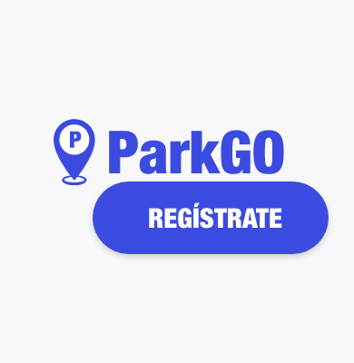
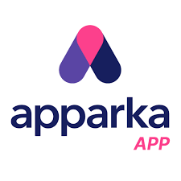

# **COURSE PROJECT** 

  

<strong>Universidad Peruana de Ciencias Aplicadas</strong>

<strong>Ingeniería de Software</strong> 
Ciclo: 7mo  
Desarrollo de Soluciones IOT - NRC: 6770    
<strong>Profesor:Javier Antonio Prudencio Vidal</strong> 

<h2 align="center">INFORME</h2>

<h3 align="center">Startup: Code Mondoguito </h3>

<strong>Producto: ParkingNow</strong>

<h3 align="center">Team Members:</h3>

| **Member**              | **Code** |
| ----------------------------- | -------------- |
|   |    |
| Cuya Villegas, Rafael Alberto    | U201913495    |
|  |      |
| Soto Quispe, Diego Ulises        | U2022144778    |
|  |      |
| Lapa De La Cruz, Gabriel Omar    |     |
|  |      |
| Vilca Valverde, Fiorella Angela  |     |
|  |      |

<strong>Abril 2026</strong>

# Registro de Versiones del Informe

| Versión | Fecha      | Autor(es)                                                                                                                                                                                                                   | Descripción de la modificación                                                                                                                                                                                                                                                                                                                                                                                                                                                                                                                                                                                                                      |
|---------|------------|------------------------------------------------------------------------------------------------------------------------------------------------------------------------------------------------------------------------------|-----------------------------------------------------------------------------------------------------------------------------------------------------------------------------------------------------------------------------------------------------------------------------------------------------------------------------------------------------------------------------------------------------------------------------------------------------------------------------------------------------------------------------------------------------------------------------------------------------------------------------------------------------|
| TB1     | 00/00/2026 | Rafael Alberto Cuya Villegas    Diego Ulises Soto Quispe    Gabriel Omar Lapa De La Cruz    Fiorella Angela Vilca Valverde | Capítulo I. Introducción   1.1 Startup Profile   1.1.1 Descripción de la Startup   1.1.2 Perfiles de integrantes del equipo    1.2 Solution Profile   1.2.1 Antecedentes y problemática   1.2.2 Lean UX Process   1.2.2.1 Lean UX Problem Statements   1.2.2.2 Lean UX Assumptions   1.2.2.3 Lean UX Hypothesis Statements   1.2.2.4 Lean UX Canvas    1.3 Segmentos objetivo    Capítulo II. Requirements Elicitation & Analysis    2.1 Competidores   2.1.1 Análisis competitivo   2.1.2 Estrategias y tácticas frente a competidores    2.2 Entrevistas   2.2.1 Diseño de entrevistas   2.2.2 Registro de entrevistas   2.2.3 Análisis de entrevistas    2.3 Needfinding   2.3.1 User Personas   2.3.2 User Task Matrix   2.3.3 User Journey Mapping   2.3.4 Empathy Mapping    2.4 Big Picture EventStorming   2.5 Ubiquitous Language    Capítulo III. Requirements Specification    3.1 User Stories   3.2 Impact Mapping   3.3 Product Backlog    Capítulo IV. Solution Software Design    4.1 Strategic-Level Domain-Driven Design   4.1.1 Design-Level EventStorming   4.1.1.1 Candidate Context Discovery   4.1.1.2 Domain Message Flows Modeling   4.1.1.3 Bounded Context Canvases   4.1.2 Context Mapping   4.1.3 Software Architecture   4.1.3.1 System Landscape Diagram   4.1.3.2 Context Level Diagrams   4.1.3.3 Container Level Diagrams   4.1.3.4 Deployment Diagrams    4.2 Tactical-Level Domain-Driven Design   4.2.1 Bounded Context: Domain Layer   4.2.2 Bounded Context: Interface Layer   4.2.3 Bounded Context: Application Layer   4.2.4 Bounded Context: Infrastructure Layer   4.2.5 Bounded Context: Component Diagrams   4.2.6 Bounded Context: Class Diagrams   4.2.7 Bounded Context: Database Design Diagram |

## Project Report Collaboration Insights

**Organización de GitHub:** [https://github.com/G3-UPC-1ASI0572-6770-IOT](https://github.com/G3-UPC-1ASI0572-6770-IOT)  
**Repositorio del Informe:** [https://github.com/G3-UPC-1ASI0572-6770-IOT/Report](https://github.com/G3-UPC-1ASI0572-6770-IOT/Report)

**TB1:** Las tareas asignadas para la entrega TB1 se han completado y están documentadas en el repositorio de GitHub perteneciente a la organización del equipo.

Durante la preparación del informe, se llevaron a cabo las siguientes actividades:

- Se redactaron y estructuraron los contenidos asignados a cada integrante en formato Markdown, realizando commits frecuentes para asegurar la evidencia del progreso en el repositorio.
- Se elaboraron los diferentes artefactos necesarios empleando las herramientas recomendadas y se centralizaron los recursos de imágenes en la carpeta `assets` del repositorio del informe.
- Se organizaron reuniones de coordinación para distribuir las áreas a desarrollar, revisar el estado de los elementos del documento y consolidar los avances requeridos para la presente iteración.

(añadir imagen de los commits en general del grupo)

### ABET, EAC - Student Outcome 5

**Criterio:** *La capacidad de funcionar efectivamente en un equipo cuyos miembros juntos proporcionan liderazgo, crean un entorno de colaboración e inclusivo, establecen objetivos, planifican tareas y cumplen objetivos.*

En el siguiente cuadro se describen las acciones realizadas y enunciados de conclusiones por parte del grupo, que permiten sustentar el haber alcanzado el logro del ABET, EAC - Student Outcome 5.

| Criterio específico | Acciones realizadas | Conclusiones |
|---------------------|---------------------|--------------|
| **Trabaja en equipo para proporcionar liderazgo en forma conjunta** | **Cuya Villegas, Rafael Alberto** TB1  **Soto Quispe, Diego Ulises** TB1  **Lapa De La Cruz, Gabriel Omar** TB1  **Vilca Valverde, Fiorella Angela** TB1 | TB1 |
| **Crea un entorno colaborativo e inclusivo, establece metas, planifica tareas y cumple objetivos** | **Cuya Villegas, Rafael Alberto** TB1  **Soto Quispe, Diego Ulises** TB1  **Lapa De La Cruz, Gabriel Omar** TB1  **Vilca Valverde, Fiorella Angela** TB1 | TB1 |

# Contenido

- [Registro de Versiones del Informe](#registro-de-versiones-del-informe)  
- [Project Report Collaboration Insights](#project-report-collaboration-insights)  
- [Student Outcome](#student-outcome)  

## Capítulo I: Presentación

- [1.1. Startup Profile](#11-startup-profile)  
  - [1.1.1. Descripción de la Startup](#111-descripción-de-la-startup)  
  - [1.1.2. Perfiles de integrantes del equipo](#112-perfiles-de-integrantes-del-equipo)  
- [1.2. Solution Profile](#12-solution-profile)  
  - [1.2.1. Antecedentes y problemática](#121-antecedentes-y-problemática)  
  - [1.2.2. Lean UX Process](#122-lean-ux-process)  
    - [1.2.2.1. Lean UX Problem Statements](#1221-lean-ux-problem-statements)  
    - [1.2.2.2. Lean UX Assumptions](#1222-lean-ux-assumptions)  
    - [1.2.2.3. Lean UX Hypothesis Statements](#1223-lean-ux-hypothesis-statements)  
    - [1.2.2.4. Lean UX Canvas](#1224-lean-ux-canvas)  
- [1.3. Segmentos objetivo](#13-segmentos-objetivo)  

## Capítulo II: Requirements Elicitation & Analysis

- [2.1. Competidores](#21-competidores)  
  - [2.1.1. Análisis competitivo](#211-análisis-competitivo)  
  - [2.1.2. Estrategias y tácticas frente a competidores](#212-estrategias-y-tácticas-frente-a-competidores)  
- [2.2. Entrevistas](#22-entrevistas)  
  - [2.2.1. Diseño de entrevistas](#221-diseño-de-entrevistas)  
  - [2.2.2. Registro de entrevistas](#222-registro-de-entrevistas)  
  - [2.2.3. Análisis de entrevistas](#223-análisis-de-entrevistas)  
- [2.3. Needfinding](#23-needfinding)  
  - [2.3.1. User Personas](#231-user-personas)  
  - [2.3.2. User Task Matrix](#232-user-task-matrix)  
  - [2.3.3. User Journey Mapping](#233-user-journey-mapping)  
  - [2.3.4. Empathy Mapping](#234-empathy-mapping)  
  - [2.3.5. As-is Scenario Mapping](#235-as-is-scenario-mapping)
- [2.4. Big Picture EventStorming](#24-big-picture-eventstorming)
- [2.5. Ubiquitous Language](#24-ubiquitous-language)

## Capítulo III: Requirements Specification

- [3.1. User Stories](#32-user-stories)  
- [3.2. Impact Mapping](#33-impact-mapping)  
- [3.3. Product Backlog](#34-product-backlog) 

## Capítulo IV: Solution Software Design

- [4.1. Strategic-Level Domain-Driven Design](#41-strategic-level-domain-driven-design)  
  - [4.1.1. EventStorming](#411-eventstorming)  
    - [4.1.1.1. Candidate Context Discovery](#4111-candidate-context-discovery)  
    - [4.1.1.2. Domain Message Flows Modeling](#4112-domain-message-flows-modeling)  
    - [4.1.1.3. Bounded Context Canvases](#4113-bounded-context-canvases)  
  - [4.1.2. Context Mapping](#412-context-mapping)  
  - [4.1.3. Software Architecture](#413-software-architecture)  
    - [4.1.3.1. Software Architecture Context Level Diagrams](#4131-software-architecture-context-level-diagrams)  
    - [4.1.3.2. Software Architecture Container Level Diagrams](#4132-software-architecture-container-level-diagrams)  
    - [4.1.3.3. Software Architecture Deployment Diagrams](#4133-software-architecture-deployment-diagrams)  
- [4.2. Tactical-Level Domain-Driven Design](#42-tactical-level-domain-driven-design)  
  - [4.2.X. Bounded Context: <Bounded Context Name>](#42x-bounded-context-bounded-context-name)  
    - [4.2.X.1. Domain Layer](#42x1-domain-layer)  
    - [4.2.X.2. Interface Layer](#42x2-interface-layer)  
    - [4.2.X.3. Application Layer](#42x3-application-layer)  
    - [4.2.X.4. Infrastructure Layer](#42x4-infrastructure-layer)  
    - [4.2.X.5. Bounded Context Software Architecture Component Level Diagrams](#42x5-bounded-context-software-architecture-component-level-diagrams)  
    - [4.2.X.6. Bounded Context Software Architecture Code Level Diagrams](#42x6-bounded-context-software-architecture-code-level-diagrams)  
    - [4.2.X.6.1. Bounded Context Domain Layer Class Diagrams](#42x61-bounded-context-domain-layer-class-diagrams)  
    - [4.2.X.6.2. Bounded Context Database Design Diagram](#42x62-bounded-context-database-design-diagram)
  
  ## Capítulo V: Solution UI/UX Design

- [5.1. Style Guidelines](#51-style-guidelines)  
  - [5.1.1. General Style Guidelines](#511-general-style-guidelines)  
    - [5.1.2. Web, Mobile and IoT Style Guidelines](#512-web-mobile-and-iot-style-guidelines)  
  - [5.2. Information Architecture](#52-information-architecture)  
    - [5.2.1. Organization Systems](#521-organization-systems)  
    - [5.2.2. Labelling Systems](#522-labelling-systems)  
    - [5.2.3. SEO Tags and Meta Tags](#523-seo-tags-and-meta-tags)  
    - [5.2.4. Searching Systems](#524-searching-systems)  
    - [5.2.5. Navigation Systems](#525-navigation-systems)  
  - [5.3. Landing Page UI Design](#53-landing-page-ui-design)  
    - [5.3.1. Landing Page Wireframe](#531-landing-page-wireframe)  
    - [5.3.2. Landing Page Mock-up](#532-landing-page-mock-up)  
  - [5.4. Applications UX/UI Design](#54-applications-uxui-design)  
    - [5.4.1. Applications Wireframes](#541-applications-wireframes)  
    - [5.4.2. Applications Wireflow Diagrams](#542-applications-wireflow-diagrams)  
    - [5.4.3. Applications Mock-ups](#543-applications-mock-ups)  
    - [5.4.4. Applications User Flow Diagrams](#544-applications-user-flow-diagrams)  
    - [5.4.5. Applications Prototyping](#545-applications-prototyping)
   - [5.6. IoT Device Design](#56-iot-device-design)

  ## Capítulo VI: Product Implementation, Validation & Deployment

- [6.1. Software Configuration Management](#61-software-configuration-management)  
  - [6.1.1. Software Development Environment Configuration](#611-software-development-environment-configuration)  
  - [6.1.2. Source Code Management](#612-source-code-management)  
  - [6.1.3. Source Code Style Guide & Conventions](#613-source-code-style-guide--conventions)  
  - [6.1.4. Software Deployment Configuration](#614-software-deployment-configuration)  
- [6.2. Landing Page & Mobile Application Implementation](#62-landing-page--mobile-application-implementation)  
  - [6.2.X. Sprint n](#62x-sprint-n)  
    - [6.2.X.1. Sprint Planning n](#62x1-sprint-planning-n)  
    - [6.2.X.2. Sprint Backlog n](#62x2-sprint-backlog-n)  
    - [6.2.X.3. Development Evidence for Sprint Review](#62x3-development-evidence-for-sprint-review)  
    - [6.2.X.4. Testing Suite Evidence for Sprint Review](#62x4-testing-suite-evidence-for-sprint-review)  
    - [6.2.X.5. Execution Evidence for Sprint Review](#62x5-execution-evidence-for-sprint-review)  
    - [6.2.X.6. Services Documentation Evidence for Sprint Review](#62x6-services-documentation-evidence-for-sprint-review)  
    - [6.2.X.7. Software Deployment Evidence for Sprint Review](#62x7-software-deployment-evidence-for-sprint-review)  
    - [6.2.X.8. Team Collaboration Insights during Sprint](#62x8-team-collaboration-insights-during-sprint)  
- [6.3. Validation Interviews](#63-validation-interviews)  
  - [6.3.1. Diseño de Entrevistas](#631-diseño-de-entrevistas)  
  - [6.3.2. Registro de Entrevistas](#632-registro-de-entrevistas)  
  - [6.3.3. Evaluaciones según heurísticas](#633-evaluaciones-según-heurísticas)  
- [6.4. Video About-the-Product](#64-video-about-the-product)  

## Secciones Finales

- [Conclusiones](#conclusiones)  
  - [Conclusiones y recomendaciones](#conclusiones-y-recomendaciones)  
  - [Video About-the-Team](#video-about-the-team)  
- [Bibliografía](#bibliografía)
- [Anexos](#anexos)

# Capítulo I: Introducción

## 1.1. Startup Profile

En esta sección se presenta el perfil de la startup ParkingNow, responsable de la concepción y
desarrollo de la solución propuesta. Se describe la empresa emergente, su propósito fundacional, misión,
visión y los valores que orientan su operación. Esta información contextualiza al lector
sobre el origen del proyecto y el equipo detrás de él, estableciendo las bases para
comprender la propuesta de valor que se desarrollará a lo largo del presente informe.

### 1.1.1. Descripción de la Startup

ParkingNow nació en 2026 como iniciativa de un equipo de estudiantes de
Ingeniería de Software de la Universidad Peruana de Ciencias Aplicadas (UPC),
motivados por la experiencia directa de la congestión vehicular en Lima y por
la ausencia de herramientas digitales accesibles para los pequeños operadores
del sector de estacionamientos urbanos. El equipo identificó una doble brecha
no resuelta en la movilidad de la ciudad --la incertidumbre del conductor y la
desconexión operativa del administrador independiente-- y decidió abordarla a
través de una plataforma distribuida que integra IoT, aplicaciones móviles y
servicios en la nube.

**ParkingNow** es una startup tecnológica peruana especializada en el desarrollo de soluciones inteligentes para la gestión de estacionamientos urbanos. Su propuesta se materializa en la plataforma **ParkingNow**, orientada a mejorar la disponibilidad, reserva y monitoreo de espacios de estacionamiento en entornos de alta densidad vehicular. Para ello, integra tecnologías IoT, aplicaciones móviles, paneles web y servicios en la nube con el fin de conectar, en tiempo real, a conductores urbanos con operadores de estacionamientos independientes.

La startup surge como respuesta a un problema estructural de la movilidad urbana en Lima Metropolitana: la dificultad crónica de encontrar estacionamiento disponible, la ausencia de herramientas digitales accesibles para pequeños operadores del sector y la desconexión entre el estado físico real de los espacios y la información que recibe el conductor. A través de su plataforma principal, **ParkingNow** propone una solución distribuida que combina sensores físicos embebidos en el espacio de estacionamiento con aplicaciones web y móvil, permitiendo la detección en tiempo real del estado de ocupación, la reserva anticipada de espacios y el monitoreo remoto de la operación por parte del administrador del local.

ParkingNow adopta un modelo de negocio **B2B2C** basado en la afiliación de estacionamientos independientes a la plataforma. En este modelo, el **cliente pagador principal** es el operador o administrador del estacionamiento afiliado, quien accede a la solución mediante una **suscripción mensual** a cambio de visibilidad digital, monitoreo en tiempo real, gestión de reservas y mejora operativa de sus espacios. Por su parte, el conductor participa como usuario final de la aplicación móvil, beneficiándose de la consulta de disponibilidad y de la reserva anticipada de espacios, sin asumir el rol de pagador principal en la etapa inicial del producto. De esta manera, ParkingNow genera valor para ambos segmentos: para el conductor, al reducir el tiempo y la incertidumbre en la búsqueda de estacionamiento; y para el operador, al digitalizar su operación sin exigir inversiones tecnológicas complejas.

**Misión**

Brindar una solución tecnológica confiable y accesible que permita a los conductores encontrar y reservar estacionamientos de manera más eficiente, mientras los administradores optimizan la ocupación y supervisión de sus espacios mediante herramientas digitales conectadas con información del entorno real.

**Visión**

Ser la plataforma de referencia en gestión inteligente de estacionamientos urbanos en América Latina, reconocida por la precisión de su capa IoT, la experiencia de usuario de sus aplicaciones y su capacidad de generar valor medible tanto para los conductores como para los operadores del sector.

**Valores**

- **Innovación práctica:** Aplicamos tecnología IoT accesible --como el ESP32 y
  sensores ultrasónicos HC-SR04+-- para resolver un problema cotidiano de movilidad
  urbana en Lima que afecta a miles de conductores y operadores independientes que
  aún no cuentan con soluciones digitales adaptadas a su escala.
- **Transparencia:** Brindamos información veraz y en tiempo real a todos los actores de la plataforma, eliminando la incertidumbre en la experiencia de estacionamiento.
- **Sostenibilidad:** Contribuimos activamente a la reducción de la congestión vehicular y la contaminación derivada de la búsqueda innecesaria de espacios.
- **Colaboración:** Construimos la solución de la mano con los operadores
  independientes de estacionamientos, entendiendo su contexto operativo real en Lima
  --recursos limitados, operación manual, márgenes ajustados-- y diseñando una
  plataforma que se adapte a sus necesidades concretas sin exigir inversiones
  tecnológicas complejas.

---

### 1.1.2. Perfiles de integrantes del equipo

| **Integrantes** | **Descripción** | **Conocimientos** |
|-----------------|-----------------|-------------------|
|   **Diego Ulises Soto Quispe** | Estudiante de 7.º ciclo en Ingeniería de Software. Perfil proactivo y responsable, enfocado en metodologías ágiles y resolución de problemas. | **Software y herramientas:** Visual Studio Code, Android Studio, WebStorm, Figma, Notion, GitHub, Docker, n8n, Postman, Swagger, HeyGen, Metricool, Office, CapCut, Clipchamp. **AI:** Agentes de IA, Skills, MCP, prompting avanzado, Codex CLI, Codex App, Gemini CLI, OpenCode, Claude Code CLI, GitHub Copilot CLI. **Tecnologías:** Angular, React, Vue.js, Next.js, Kotlin, Flutter, Node.js, Python, C++, .NET, JavaScript, TypeScript, APIs REST, Testing & QA, MySQL, PostgreSQL, MongoDB, SQLite, CI/CD, Scrum, Kanban. **Habilidades blandas:** Trabajo en equipo, comunicación efectiva, responsabilidad, organización, proactividad, empatía, capacidad de adaptación. |
|  **Rafael Alberto Cuya Villegas** | Estudiante de Ingeniería de Software en el 8vo ciclo. | HTML, CSS, Javascript, SQL, MongoDB, ciberseguridad, Python. |
|  **Elverth Jair Vásquez Villalobos** | Estudiante de Ingeniería de Software. Gusto por la tecnología y los negocios. | Vue.js, Angular, .NET, desarrollo frontend y backend. |
|  **Integrante 4** | | |
|  **Integrante 5** | | |

---

## 1.2. Solution Profile

En esta sección se desarrolla el perfil de la solución propuesta por ParkingNow,
partiendo de los antecedentes y de la problemática que justifican su desarrollo.
Asimismo, se presenta el proceso de Lean UX aplicado al dominio del problema, con el
fin de estructurar de manera clara las necesidades de los usuarios, la brecha existente
en el mercado y las hipótesis que orientan la construcción del producto. Esta estructura
responde directamente a lo solicitado por el enunciado del curso para la sección
Solution Profile.

### 1.2.1. Antecedentes y problemática

En el contexto de las ciudades latinoamericanas con alta densidad vehicular, la gestión
del estacionamiento urbano representa uno de los problemas de movilidad más frecuentes
y con mayor impacto en la experiencia cotidiana de los ciudadanos. En Lima Metropolitana,
se estima que circulan aproximadamente 1.8 millones de automóviles (El Comercio, 2024),
y el flujo vehicular nacional acumula 27 meses consecutivos de crecimiento al cierre del
primer trimestre de 2025 (Asociación Automotriz del Perú [AAP], 2025). Esta tendencia
sostenida ejerce una presión creciente sobre la infraestructura vial y de estacionamiento
de la ciudad. El informe *Cities in Motion 2025* posicionó a Lima en el puesto 176 de
movilidad y transporte a nivel mundial, reflejando una crisis estructural que empeora año
tras año (Infobae, 2025a).

En este escenario, encontrar espacios disponibles se convierte en un problema recurrente
y costoso para los conductores en términos de tiempo. Investigaciones recientes sobre
sistemas de Smart Parking confirman que la falta de información actualizada es una de
las principales causas de congestión vehicular urbana, y que soluciones basadas en IoT
con sensores y aplicaciones móviles pueden reducir significativamente ese impacto
(Ruiz Cruzado et al., 2026; Nur et al., 2025).

Desde la perspectiva de los operadores, el problema es igualmente crítico. Lima enfrenta
una informalidad crónica en el sector: parqueadores informales se han adueñado de
espacios públicos en múltiples distritos, cobrando tarifas sin regulación y desplazando
a operadores formales (Infobae, 2024). Los distritos de Miraflores, San Borja, Surco y
San Isidro cuentan apenas con 12,000 espacios de estacionamiento público entre los
cuatro, pese a que solo en Miraflores transitan 40,000 vehículos diarios (El Comercio,
2024). Esta brecha estructural entre oferta y demanda no podrá resolverse sin
herramientas digitales que permitan a los operadores formales gestionar mejor los
espacios disponibles y conectarlos con los conductores que los necesitan.

ParkingNow surge en este contexto como una propuesta orientada a resolver esa doble
brecha: reducir la incertidumbre del conductor al buscar un espacio y modernizar la
operación de los administradores mediante herramientas digitales conectadas al estado
físico real.

---

#### Análisis mediante la técnica 5W + 2H

**Who (¿Quién?):**
El problema afecta a dos grupos de usuarios con necesidades distintas pero
complementarias. Por un lado, los conductores urbanos de Lima Metropolitana que
utilizan vehículo particular y necesitan encontrar estacionamiento disponible de forma
frecuente en zonas de alta demanda vehicular, como los distritos de San Isidro,
Miraflores, Surco, La Molina y el Centro Histórico. El 51.1% de los encuestados en Lima
y Callao considera necesario incrementar los estacionamientos en vía pública, cifra que
asciende al 70.1% en el sector socioeconómico A (Lima Cómo Vamos, 2024). Por otro
lado, los administradores y propietarios de estacionamientos independientes que
gestionan sus espacios sin herramientas digitales integradas, en un contexto donde la
informalidad del sector limita la oferta formal de estacionamiento disponible para el
conductor (Infobae, 2024).

**What (¿Qué?):**
El problema central es la desconexión entre el estado físico real de los espacios y la
información que reciben el conductor y el administrador. El conductor no sabe qué
espacios están libres antes de llegar, y el administrador no cuenta con visibilidad
inmediata de la ocupación de su local. Estudios sobre sistemas de Smart Parking basados
en IoT demuestran que integrar sensores ultrasónicos y microcontroladores ESP32 con
plataformas de visualización permite cerrar con precisión esta brecha de información,
logrando detección confiable de vehículos con filtros antirrebote y notificación
automática de espacios liberados (Ruiz Cruzado et al., 2026).

**Where (¿Dónde?):**
El problema ocurre con mayor frecuencia en zonas urbanas de alta densidad vehicular de
Lima Metropolitana, especialmente en áreas aledañas a centros empresariales,
universidades, hospitales, mercados y zonas comerciales. Los cuatro distritos más
saturados (Miraflores, San Borja, Surco y San Isidro) combinan apenas 12,000 espacios
de estacionamiento público para atender una demanda vehicular diaria de decenas de miles
de vehículos (El Comercio, 2024). Esta situación evidencia que la problemática no es
puntual sino sistémica en el contexto urbano de la ciudad.

**When (¿Cuándo?):**
El problema se manifiesta de forma recurrente durante los días laborables, con mayor
intensidad en horarios de alta demanda vehicular: mañana (7:00 a 9:00 am), mediodía
(12:00 a 2:00 pm) y tarde-noche (5:00 a 8:00 pm). El flujo vehicular en el país registró
en julio de 2025 un crecimiento de 4.1% respecto al mismo mes del año anterior, con
los vehículos ligeros creciendo 3.8% y los pesados 4.6% (AAP, 2025), lo que anticipa
que la saturación seguirá agravándose en los próximos años. La problemática se agudiza
en fechas o eventos de alta concurrencia urbana.

**Why (¿Por qué?):**
La causa raíz es la falta de integración entre el entorno físico del estacionamiento y
los canales digitales de información y gestión. No existe un mecanismo accesible y
confiable que permita al conductor conocer la disponibilidad real de los espacios en
tiempo real, ni que permita al administrador monitorear su operación de forma
automatizada. A esto se suma una saturación vehicular que crece a razón de más de
150,000 vehículos por año en Lima, agravada por una infraestructura vial obsoleta y
la desarticulación del transporte público (Infobae, 2025b). Las soluciones tecnológicas
de control de acceso existentes implican inversiones elevadas y mantenimiento
especializado, lo que las hace inaccesibles para los operadores independientes de
pequeña escala.

**How (¿Cómo?):**
ParkingNow aborda esta problemática mediante una solución digital distribuida que
integra una aplicación móvil para el conductor, un panel web para el administrador,
servicios backend y una capa de sensado IoT basada en microcontroladores ESP32 y
sensores ultrasónicos HC-SR04+. La literatura científica reciente confirma la viabilidad
de este enfoque: sistemas de Smart Parking que integran sensor networks, ESP32 y
aplicaciones móviles logran una gestión eficiente de espacios con arquitecturas de bajo
costo y alta escalabilidad (Nur et al., 2025). El nodo IoT detecta físicamente el estado
de ocupación de cada espacio, procesa localmente esa información aplicando lógica edge,
y la reporta al backend mediante HTTP REST. Los cambios se propagan automáticamente a
las aplicaciones mediante Supabase Realtime, garantizando coherencia entre el estado
físico y los canales digitales.

**How Much (¿Cuánto?):**
El Instituto Nacional de Estadística e Informática (INEI) reportó en diciembre de 2025
un crecimiento sostenido del flujo vehicular nacional (INEI, 2026), reflejando que la
presión sobre la infraestructura de estacionamiento continúa en aumento. En el plano
operativo, empresas formales de estacionamiento como Tu Parqueo reportaron en 2024
tasas de ocupación del 80% en sus locales de San Isidro, Barranco y La Victoria, con
el 55% de sus ingresos generado por clientes eventuales (Gestión, 2024), lo que
evidencia la alta demanda del servicio cuando existe oferta organizada y visible. Estos
indicadores sustentan la oportunidad de negocio de ParkingNow: conectar esa demanda
insatisfecha con operadores independientes que actualmente no tienen herramientas para
captarla.

---

#### Puntos más importantes que debe resolver la solución

A partir del análisis anterior, ParkingNow debe resolver de forma prioritaria los
siguientes problemas:

1. **Falta de visibilidad sobre la disponibilidad real de espacios:** Los conductores
   no cuentan con información actualizada y verificada sobre qué espacios están libres
   antes de llegar al estacionamiento. La información disponible actualmente, cuando
   existe, no está respaldada por un mecanismo de detección física confiable.

2. **Ausencia de un mecanismo de reserva anticipada confiable:** No existe una forma
   simple y digital de garantizar un espacio antes de llegar físicamente al
   estacionamiento, lo que obliga al conductor a desplazarse con incertidumbre total
   sobre si encontrará o no un lugar disponible.

3. **Desconexión entre el estado físico y los canales digitales:** La disponibilidad
   informada no refleja necesariamente la realidad del espacio, porque no hay un
   mecanismo de sensado que vincule el entorno físico del estacionamiento con las
   plataformas digitales de información y gestión.

4. **Limitada capacidad operativa de los administradores independientes:** Los
   operadores gestionan sus espacios de forma manual, sin herramientas que les
   permitan monitorear ocupación, gestionar reservas activas y visualizar eventos
   operativos en tiempo real desde un canal digital accesible.

---

#### Objetivos de la solución

- Permitir a los conductores urbanos consultar la disponibilidad real de espacios de
  estacionamiento desde una aplicación móvil, con información actualizada en tiempo
  real a partir del estado detectado por los sensores IoT.
- Habilitar la reserva anticipada de espacios disponibles, proporcionando al conductor
  un ticket virtual de confirmación antes de llegar físicamente al estacionamiento.
- Dotar a los administradores de estacionamientos de un panel web que les permita
  monitorear el estado de ocupación de sus espacios, gestionar reservas activas y
  acceder al historial de eventos operativos generado por el nodo IoT.
- Construir una solución IoT distribuida que integre detección física mediante sensores
  ultrasónicos HC-SR04+ en un nodo ESP32, procesamiento local edge, reporte al backend
  vía HTTP REST y propagación automática de cambios a las aplicaciones mediante
  Supabase Realtime, bajo una arquitectura coherente de dispositivo embebido,
  Edge API, Core API y aplicaciones de usuario.
- Evidenciar la trazabilidad end-to-end entre el evento físico detectado por el sensor
  y su representación digital en tiempo real en las interfaces del conductor y del
  administrador, como validación de la integración de la arquitectura distribuida
  propuesta.

---

#### Restricciones del proyecto

- El alcance del proyecto corresponde a un **prototipo académico funcional**, por lo
  que la validación se realizará sobre un escenario controlado y representativo en
  forma de maqueta, no sobre una implementación masiva en entornos urbanos reales.
- El nodo IoT físico contempla **dos espacios de estacionamiento** en la maqueta de
  demostración, lo cual es suficiente para evidenciar la integración completa de la
  arquitectura distribuida dentro del alcance del curso.
- La solución no incluirá funcionalidades de pago ni facturación en esta primera
  versión, dado que el enfoque prioriza la trazabilidad del estado de los espacios
  y la experiencia de reserva como valor central de la plataforma.
- El despliegue se realizará sobre servicios cloud gratuitos o de bajo costo
  (Railway para backend, Vercel para frontend, Supabase free tier para base de datos
  y tiempo real), adecuados para el alcance universitario del proyecto.

---

### 1.2.2. Lean UX Process

En este apartado se describe el proceso Lean UX aplicado sobre el dominio del problema, con el objetivo de construir una visión compartida y validable del modelo de negocio que sustenta ParkingNow. El proceso parte de la identificación de los Problem Statements, continúa con la formulación de Assumptions sobre el negocio y los usuarios, y culmina en la redacción de Hypothesis Statements que serán sometidos a validación durante el ciclo de desarrollo del producto.

#### 1.2.2.1. Lean UX Problem Statements

**Problem Statement: Segmento Conductores Urbanos**

**Dominio:**
El estado actual de la movilidad urbana en Lima se ha centrado principalmente en
el mejoramiento de infraestructura vial y la implementación de sistemas de
transporte público masivo.

**Gap:**
Sin embargo, los servicios y plataformas existentes no logran abordar de forma
efectiva la brecha de información en tiempo real sobre la disponibilidad de
espacios de estacionamiento. Las soluciones digitales actuales no integran una
capa física de sensado que confirme el estado real del espacio, lo que genera
inconsistencias entre la información mostrada y la disponibilidad efectiva,
produciendo desconfianza en el usuario y limitando la adopción de estas
plataformas.

**Pain Points:**
Esto obliga al conductor a recorrer múltiples cuadras de forma incierta antes de
encontrar un espacio libre, agravando la congestión y deteriorando su experiencia
de movilidad.

**Visión / Solución propuesta:**
Nuestra solución abordará esta brecha mediante el desarrollo de una plataforma IoT
distribuida que integra sensores físicos en los espacios afiliados. Esto permitirá
al conductor consultar disponibilidad verificada en tiempo real, reservar desde su
aplicación móvil y llegar directamente a un lugar garantizado, sin necesidad de
búsqueda adicional.

**Segmento inicial:**
Nuestro enfoque inicial estará dirigido a conductores urbanos de Lima Metropolitana
que se desplazan frecuentemente a zonas de alta demanda vehicular (San Isidro,
Miraflores y Surco) y que han experimentado de forma recurrente la frustración de
perder tiempo buscando estacionamiento.

**Criterio de validación:**
Sabremos que hemos resuelto este problema cuando el uso de ParkingNow reduzca el
tiempo promedio de búsqueda y acceso a un espacio afiliado a menos de 5 minutos
desde el inicio de la búsqueda en la aplicación, y cuando la plataforma alcance un
NPS positivo superior a 30 en una etapa posterior de validación con usuarios reales.

---

**Problem Statement: Segmento Administradores de Estacionamientos Independientes**

**Dominio:**
El estado actual de los estacionamientos independientes en Lima se caracteriza por
una operación predominantemente manual, sin herramientas digitales de gestión, sin
presencia en plataformas de búsqueda para el conductor y sin capacidad de monitoreo
remoto del estado de sus espacios.

**Pain Points:**
Los operadores no tienen visibilidad inmediata de su propia operación y carecen de
datos históricos para tomar decisiones sobre precios, horarios o capacidad. Esta
informalidad operativa les impide competir con estacionamientos de mayor escala y
los margina de la demanda digital creciente de conductores que buscan opciones
verificadas y reservables en línea.

**Gap:**
Lo que las soluciones actuales del mercado no resuelven para este segmento es la
accesibilidad tecnológica. Los sistemas de control de acceso y monitoreo existentes
implican inversiones elevadas, configuración compleja y mantenimiento especializado,
lo que los hace inviables para operadores con locales de 2 a 20 espacios sin
respaldo tecnológico propio.

**Visión / Solución propuesta:**
Nuestra solución abordará esta brecha proporcionando al operador independiente un
esquema de afiliación de bajo costo de entrada, con un nodo IoT de hardware accesible
(ESP32 + sensores ultrasónicos) y un panel web intuitivo que le permita monitorear
sus espacios en tiempo real, visualizar reservas activas, gestionar su historial
operativo y ganar visibilidad digital frente a conductores de la zona.

**Segmento inicial:**
Nuestro enfoque inicial estará dirigido a administradores de estacionamientos
independientes ubicados en distritos de alta demanda vehicular de Lima, que operan
entre 2 y 30 espacios de manera manual y que no cuentan con ninguna herramienta
digital de gestión en la actualidad.

**Criterio de validación:**
Sabremos que hemos resuelto este problema cuando un estacionamiento afiliado a
ParkingNow registre un incremento del 25% en su tasa de ocupación durante los
primeros seis meses de uso de la plataforma, en comparación con su operación previa
sin herramientas digitales.

---

#### 1.2.2.2. Lean UX Assumptions

Las métricas cuantitativas presentadas en esta sección corresponden a supuestos iniciales de negocio, adopción y experiencia de usuario. En consecuencia, deben entenderse como referencias preliminares orientadas a la validación del modelo de ParkingNow y no como resultados observados ni como proyecciones definitivas del proyecto. Su contraste se realizará en etapas posteriores mediante entrevistas, validaciones con usuarios, pruebas piloto y evaluación del prototipo.

##### Business Outcomes Assumptions

1. **Generar un modelo de ingresos recurrente mediante afiliación de operadores:**  
   Como supuesto inicial de negocio, se plantea la posibilidad de afiliar al menos 15 estacionamientos independientes en Lima durante los primeros seis meses posteriores a un eventual lanzamiento. Este valor se considera una meta preliminar de validación comercial.  
   **Indicadores de referencia:** número de contratos de afiliación firmados y número de nodos IoT instalados y activos.

2. **Escalar la plataforma a nuevas zonas urbanas de Lima:**  
   Como supuesto de crecimiento, se plantea alcanzar presencia en al menos 5 distritos de Lima Metropolitana al término del primer año de operación. Esta métrica se formula como un objetivo exploratorio de expansión.  
   **Indicadores de referencia:** número de estacionamientos afiliados por distrito y volumen de reservas completadas por zona.

3. **Posicionarse como referente inicial de soluciones IoT para estacionamientos en Perú:**  
   Como supuesto preliminar de adopción, se plantea alcanzar al menos 1,000 conductores registrados y 500 reservas completadas durante los primeros meses de operación de una versión futura del producto. Estos valores constituyen métricas objetivo sujetas a validación posterior.  
   **Indicadores de referencia:** número de usuarios registrados, tasa de conversión de búsqueda a reserva y retención mensual de usuarios activos.

##### User Outcomes Assumptions

1. Los conductores urbanos de Lima necesitan poder identificar, seleccionar y
  acceder a un espacio de estacionamiento disponible en menos de 5 minutos, sin
  depender de búsqueda física adicional, para que consideren que la plataforma
  les genera un valor real en su experiencia de movilidad cotidiana.

2. Los administradores de estacionamientos independientes necesitan evidenciar un
  incremento concreto en su tasa de ocupación --estimado en al menos un 25% durante
  los primeros seis meses-- para considerar que la afiliación a ParkingNow justifica
  el costo de la suscripción mensual y la instalación del nodo IoT.

3. Los administradores necesitan eliminar la dependencia de registros manuales en su
  operación diaria y centralizar el monitoreo de estados, reservas y eventos en un
  único panel web, para considerar que la plataforma reduce su carga operativa de
  forma significativa.

4. Los conductores necesitan tener la certeza de que el espacio que reservan desde
  la aplicación estará efectivamente disponible al momento de llegar, respaldado por
  una fuente de verificación física confiable, para confiar en la plataforma y
  adoptarla como herramienta habitual en sus desplazamientos.

##### Business Assumptions

- Los conductores urbanos de Lima están dispuestos a adoptar una aplicación móvil para consultar disponibilidad y reservar estacionamiento, siempre que esta les garantice información confiable en tiempo real y reduzca de manera perceptible el tiempo de búsqueda.

- Los operadores o administradores de estacionamientos independientes están dispuestos a afiliarse a ParkingNow y asumir el pago de una suscripción mensual, siempre que la plataforma les ofrezca un beneficio económico claro en términos de mayor visibilidad digital, mejora operativa y potencial incremento de ocupación.

- Los operadores independientes de estacionamientos están dispuestos a integrar un nodo IoT en sus espacios si el costo de implementación es accesible, la configuración es simple y la solución no requiere conocimientos técnicos especializados para su operación cotidiana.

- En la etapa inicial del modelo de negocio, el conductor puede participar como usuario final de la aplicación sin asumir el rol de cliente pagador principal, ya que el valor económico directo de la solución se concentra en el operador afiliado.

- Existe suficiente densidad de estacionamientos independientes en distritos como San Isidro, Miraflores y Surco para construir una oferta inicial atractiva para los conductores de la zona y sostener una estrategia temprana de afiliación.

- La integración con OpenStreetMap permite poblar el mapa inicial con estacionamientos reales de Lima, aumentando la utilidad percibida de la plataforma desde el primer uso. Sin embargo, solo los estacionamientos afiliados ofrecerán disponibilidad validada en tiempo real y funcionalidad de reserva.

- El uso de Supabase Realtime como mecanismo de propagación de estados permite mantener coherencia entre el estado físico detectado por el sensor y la información mostrada en las aplicaciones, fortaleciendo la propuesta de valor de la plataforma para conductores y operadores.

##### User Assumptions

- Los conductores urbanos de Lima revisan la disponibilidad de estacionamiento preferentemente desde su teléfono móvil, antes o durante el trayecto hacia su destino.
- Los administradores de estacionamientos prefieren interfaces simples y visuales que no requieran formación técnica especializada para ser utilizadas.
- Los conductores valoran la posibilidad de ver en el mapa tanto estacionamientos afiliados (con reserva y disponibilidad en tiempo real) como estacionamientos no afiliados (solo referencia de ubicación), porque les da una visión completa de sus opciones.
- Los administradores valoran recibir una alerta inmediata cuando un espacio cambia de estado, especialmente cuando una reserva activa es consumida por la llegada física del vehículo.
- Tanto conductores como administradores esperan que la plataforma mantenga la última información conocida del estado de los espacios ante una eventual desconexión del nodo IoT, en lugar de mostrar errores o datos vacíos.

##### Features Assumptions

- **Detección de ocupación en tiempo real:** Sensores ultrasónicos HC-SR04+ conectados al ESP32 detectan la presencia de vehículos con un umbral de distancia configurable, aplicando lógica de debounce para evitar falsos positivos antes de reportar al backend.
- **Reserva anticipada de espacios:** El conductor puede seleccionar y reservar un espacio libre desde la app móvil antes de llegar físicamente al estacionamiento, con un ticket virtual como comprobante de la reserva.
- **Propagación automática de estados en tiempo real:** Cualquier cambio de estado físico detectado por el sensor (libre → ocupado → libre) se refleja automáticamente en la Web App del administrador y en la Mobile App del conductor vía Supabase Realtime, sin necesidad de recargar la pantalla.
- **Diferenciación entre estacionamientos afiliados y no afiliados:** La plataforma muestra en el mapa estacionamientos reales de Lima cargados desde OpenStreetMap, distinguiendo visualmente cuáles tienen disponibilidad en tiempo real y permiten reservas (afiliados) y cuáles son solo puntos de referencia (no afiliados).
- **Comportamiento degradado ante desconexión del nodo IoT:** Si el nodo deja de reportar, el sistema conserva el último estado conocido del espacio y lo marca visualmente como "no confirmado en tiempo real", sin ocultar ni eliminar la información disponible.
- **Vista de cámara local para el administrador:** Una cámara local integrada al nodo IoT permite al administrador verificar visualmente el estado desde el panel web.

---

#### 1.2.2.3. Lean UX Hypothesis Statements

Las siguientes hipótesis representan relaciones de causa-efecto que se espera contrastar en etapas posteriores del proyecto. Su finalidad es orientar el diseño del producto y establecer criterios iniciales de validación, sin constituir resultados demostrados en la presente entrega.

**Hipótesis 1:**

Creemos que mostrar disponibilidad de espacios validada en tiempo real mediante
sensores IoT embebidos en los espacios afiliados logrará reducir el tiempo de
búsqueda de estacionamiento de los conductores urbanos en Lima a menos de 5 minutos.
Sabremos que estamos en lo correcto cuando el 70% de los conductores que utilizan
la aplicación completen una reserva exitosa en menos de 5 minutos desde que inician
la búsqueda en la app.

---

**Hipótesis 2:**

Creemos que dotar a los administradores de estacionamientos independientes de un
panel web de monitoreo y gestión de reservas, integrado con un nodo IoT de hardware
accesible, logrará incrementar la tasa de ocupación de los espacios afiliados en al
menos un 25% durante los primeros seis meses de uso. Sabremos que estamos en lo
correcto cuando los estacionamientos afiliados registren un incremento mensual
sostenido en el número de reservas completadas respecto a su operación previa sin
la plataforma.

---

**Hipótesis 3:**

Creemos que garantizar que el espacio reservado se encuentre efectivamente disponible
al momento de la llegada del conductor --mediante validación física realizada por la
capa IoT-- logrará que la satisfacción del conductor alcance un NPS superior a 30 en
una etapa posterior de validación del producto. Sabremos que estamos en lo correcto
cuando al menos el 60% de los conductores que completaron una reserva califiquen la
experiencia con una puntuación de 9 o 10 en una encuesta de satisfacción posterior
a la visita.

---

**Hipótesis 4:**

Creemos que centralizar el monitoreo de estados de espacios, la visualización de
reservas activas y el historial de eventos operativos en un panel web integrado al
nodo IoT logrará reducir de forma significativa la carga operativa manual del
administrador de estacionamiento. Sabremos que estamos en lo correcto cuando los
administradores afiliados reporten haber eliminado el uso de registros físicos
manuales para el control de ocupación y reservas en su operación diaria.

---

**Hipótesis 5:**

Creemos que ofrecer un esquema de afiliación con un costo de integración accesible
y un retorno de inversión medible en términos de aumento de reservas y visibilidad
digital logrará que ParkingNow afilie al menos 15 estacionamientos independientes
en Lima durante los primeros seis meses de una etapa posterior de comercialización.
Sabremos que estamos en lo correcto cuando los operadores afiliados renueven su
suscripción mensual de forma consecutiva y recomienden la plataforma a otros
operadores del sector.

---

#### 1.2.2.4. Lean UX Canvas

A continuación se presenta el Lean UX Canvas elaborado para ParkingNow, que sintetiza los elementos clave del proceso Lean UX: el problema de negocio identificado, los segmentos de usuario, las ideas de solución, los beneficios esperados, las hipótesis centrales y los aprendizajes prioritarios que orientan el desarrollo del producto.

**Figura 1**

*Lean UX Canvas de ParkingNow para el dominio de gestión de estacionamientos urbanos en Lima Metropolitana*

**Nota**. Elaboración propia (2026).

Según la Figura 1, el Lean UX Canvas de ParkingNow identifica como problema central la desconexión entre el estado físico real de los espacios y los canales digitales de información. Esta brecha afecta tanto a conductores urbanos, que pierden tiempo buscando disponibilidad, como a administradores independientes, que operan sin visibilidad ni herramientas digitales.

Las ideas de solución se articulan en torno a una plataforma distribuida con sensores IoT (ESP32 + HC-SR04+), reservas anticipadas vía aplicación móvil y un panel web de monitoreo para el operador. Los outcomes de negocio priorizan, como objetivos preliminares de validación, el incremento de la tasa de ocupación de los estacionamientos afiliados y la reducción del tiempo de búsqueda del conductor. Asimismo, se plantea como meta inicial de experiencia de usuario alcanzar un NPS positivo superior a 30 en una etapa posterior de validación del producto. El aprendizaje más importante a contrastar en las primeras iteraciones será determinar si la disponibilidad respaldada por el nodo IoT contribuye efectivamente a reducir el tiempo de búsqueda y si la reserva anticipada mejora la percepción de valor y satisfacción del usuario. Estas métricas deben entenderse como referencias iniciales sujetas a validación, no como resultados demostrados en la presente fase.

Enlace al canvas: [https://canva.link/jukpsaamxd32d5t](https://canva.link/jukpsaamxd32d5t)

## 1.3. Segmentos objetivo

Los segmentos objetivo de ParkingNow han sido identificados a partir del análisis
del dominio del problema de la gestión de estacionamientos urbanos en Lima
Metropolitana. La plataforma atiende a dos tipos de usuarios con necesidades distintas
pero complementarias: los conductores urbanos que necesitan encontrar y reservar
estacionamiento de manera eficiente, y los administradores de estacionamientos
independientes que necesitan digitalizar y optimizar su operación. A continuación se
describe cada segmento con sus características demográficas y estadísticas de sustento.

---

### Segmento 1: Conductores Urbanos

**Descripción:**
Este segmento comprende a personas que se movilizan habitualmente en vehículo propio
por Lima Metropolitana y que se enfrentan de forma recurrente al problema de encontrar
estacionamiento disponible en zonas de alta demanda vehicular. Son los usuarios finales
de la aplicación móvil de ParkingNow, a través de la cual consultan disponibilidad
en tiempo real, ubican estacionamientos cercanos en el mapa, realizan reservas
anticipadas y gestionan su historial de uso.

**Características demográficas:**
- **Edad:** Entre 22 y 45 años, con mayor concentración entre los 25 y 38 años,
  correspondiente a la población económicamente activa que trabaja o estudia en
  distritos de alta densidad vehicular.
- **Género:** Hombres y mujeres con vehículo propio o acceso frecuente a uno.
- **Ubicación:** Residen o trabajan en Lima Metropolitana, con desplazamientos
  frecuentes a distritos como San Isidro, Miraflores, Surco, La Molina, Lince y el
  Centro Histórico.
- **Nivel socioeconómico:** NSE B y C, con capacidad de adquirir y mantener un vehículo
  propio y disposición hacia el uso de aplicaciones móviles de servicio.
- **Perfil tecnológico:** Usuarios habituales de smartphones con sistema operativo
  Android o iOS, familiarizados con aplicaciones de mapas, reservas y movilidad
  (Google Maps, Waze, Uber, Rappi).

**Información estadística de sustento:**
En Lima Metropolitana circulan aproximadamente 1.8 millones de automóviles, de los
cuales el 11.2% de la población los usa para desplazarse al trabajo y el 7.9% para
estudiar (El Comercio, 2024). El 51.1% de los encuestados en Lima y Callao considera
necesario incrementar los estacionamientos en vía pública, porcentaje que asciende al
70.1% en el sector socioeconómico A, lo que evidencia la alta insatisfacción con la
oferta actual (Lima Cómo Vamos, 2024). Asimismo, el informe *Cities in Motion 2025*
posicionó a Lima en el puesto 176 de movilidad a nivel mundial, siendo una de las
ciudades con peores indicadores de transporte urbano (Infobae, 2025a). El flujo
vehicular nacional acumula 27 meses de crecimiento consecutivo, con un incremento de
3.5% acumulado entre agosto de 2024 y julio de 2025 (AAP, 2025), lo que proyecta
mayor presión sobre la infraestructura de estacionamiento en los próximos años.

---

### Segmento 2: Administradores de Estacionamientos Independientes

**Descripción:**  
Este segmento comprende a los dueños y administradores de estacionamientos independientes de Lima Metropolitana que operan entre 2 y 30 espacios, generalmente bajo esquemas manuales o semi-formales y sin herramientas digitales integradas de gestión. Constituyen el cliente pagador principal de ParkingNow y los usuarios directos del panel web de la plataforma, desde el cual pueden registrar su local, configurar sus espacios, monitorear el estado de ocupación en tiempo real, gestionar reservas activas y consultar el historial de eventos generados por el nodo IoT instalado en su establecimiento. Se trata de un segmento relevante porque concentra una necesidad operativa clara, posee baja digitalización y puede obtener un beneficio económico directo a partir de una mejor visibilidad, control y aprovechamiento de sus espacios disponibles.

**Características demográficas:**  
- **Edad:** Entre 35 y 60 años, generalmente propietarios del local o administradores con varios años de experiencia operativa en el sector.  
- **Género:** Predominantemente hombres, aunque con presencia creciente de mujeres emprendedoras en actividades de servicios urbanos.  
- **Ubicación:** Operan estacionamientos ubicados en distritos de alta densidad comercial y residencial de Lima, especialmente en zonas próximas a centros empresariales, universidades, hospitales, mercados y áreas de alta concurrencia.  
- **Nivel tecnológico:** Medio-bajo en términos de adopción de herramientas digitales. En muchos casos, la operación se apoya todavía en cuadernos, registros manuales o procedimientos informales. Sin embargo, muestran disposición a adoptar soluciones simples, siempre que estas sean accesibles, fáciles de usar y generen mejoras visibles en ingresos u operación.  
- **Perfil de negocio:** Microempresas o negocios familiares con márgenes ajustados, alta sensibilidad al costo de implementación y orientación a resultados concretos, como aumento de ocupación, reducción de carga manual y mayor captación de clientes.

**Información estadística de sustento:**  
Lima presenta una informalidad persistente en la gestión del estacionamiento urbano. Reportes periodísticos recientes muestran que, en diversos distritos, la presencia de parqueadores informales y el uso no regulado del espacio urbano han desplazado o debilitado la operación formal del sector (Infobae, 2024). Esta situación evidencia la existencia de una oferta fragmentada, con baja visibilidad digital y escaso acceso a herramientas tecnológicas de gestión.

Asimismo, el INEI publicó en 2026 el informe *Región Lima: Estructura Empresarial, 2024*, en el cual se observa que las microempresas del sector servicios representan una parte importante del tejido empresarial regional y enfrentan mayores limitaciones de formalización y digitalización que empresas de mayor escala (INEI, 2026). Este contexto resulta consistente con el perfil de los estacionamientos independientes, que suelen operar con recursos limitados y baja incorporación de tecnología.

Desde el punto de vista técnico y económico, la literatura reciente sobre Smart Parking respalda la pertinencia de este segmento como usuario objetivo. Estudios recientes muestran que soluciones basadas en ESP32, sensores ultrasónicos y plataformas web permiten implementar sistemas de monitoreo de ocupación con costos accesibles, buena precisión y una complejidad técnica adecuada para contextos urbanos de pequeña escala (Ruiz Cruzado et al., 2026; Bustamante & Hidrobo, 2024). En consecuencia, los administradores de estacionamientos independientes constituyen un segmento viable para ParkingNow, no solo por su necesidad de digitalización, sino también porque pueden capturar un beneficio económico directo a partir de una mejora en la gestión, la visibilidad y la ocupación de sus espacios.

# Capítulo II: Requirements Elicitation & Analysis

## 2.1. Competidores

ParkingNow compite en el mercado de soluciones digitales para la gestión y búsqueda
de estacionamientos urbanos en Lima Metropolitana. Los principales competidores directos
con presencia activa en el mercado peruano son **Quadra**, **ParkGo** y **Apparka**
(Los Portales). En esta clasificación, **Quadra** y **ParkGo** se consideran competidores
más directos en la búsqueda y reserva digital de estacionamientos o cocheras. **Apparka**
también compite en la experiencia del conductor, pero desde una red formal y cerrada de
estacionamientos del grupo Los Portales. En este contexto, ParkingNow participa en el
mismo dominio funcional y se diferencia por una propuesta con sensado físico IoT para
respaldar la disponibilidad reportada.

**Quadra** es una startup peruana que opera como marketplace de estacionamientos,
conectando conductores con cocheras privadas y propietarios de espacios independientes
a través de una app móvil disponible en Android e iOS. Su modelo pay-per-use permite
al operador rentabilizar cocheras subutilizadas sin costos fijos, y cuenta con un módulo
SaaS con inteligencia artificial para gestión de accesos y reportes operativos. No
se identifica una integración explícita de sensado físico IoT para verificar la
disponibilidad real de los espacios.

**ParkGo** es una aplicación peruana fundada por Katherinne Oyarce que conecta
conductores con cocheras seguras en tiempo real. Cuenta con 4,500 usuarios activos en
Lima, Arequipa, Cusco y Huarmey, con un crecimiento del 40% anual reportado por El
Comercio en marzo de 2026. Opera bajo un modelo freemium con ingresos por comisión
sobre reservas completadas. Al igual que Quadra, no se identifica una capa IoT propia
que valide físicamente el estado de ocupación de los espacios.

**Apparka** es la plataforma digital del grupo Los Portales, líder en estacionamientos
formales en Perú. Permite encontrar, reservar y gestionar espacios en playas autorizadas
y aeropuertos a nivel nacional. Incorpora tecnología de reconocimiento de placas con
apertura automática de barreras y un sistema de abonados con Apparka Wallet. Su alcance
está limitado a la red de estacionamientos formales del grupo y no está orientada a
operadores independientes de pequeña escala.

---

### 2.1.1. Análisis competitivo

<table>
  <thead>
    <tr>
      <th colspan="5" align="left">Competitive Analysis Landscape</th>
    </tr>
    <tr>
      <th align="left">¿Por qué llevar a cabo este análisis?</th>
      <th colspan="5" align="left">Identificar las fortalezas, debilidades, oportunidades y amenazas de los principales competidores permite a ParkingNow delimitar su propuesta diferenciada en el mercado local: la integración de una capa IoT física para respaldar el estado de los espacios y conectar el entorno físico del estacionamiento con los canales digitales de información y gestión frente a soluciones basadas principalmente en disponibilidad declarativa.</th>
    </tr>
    <tr>
      <th colspan="2" align="left">(En la cabecera colocar por cada competidor nombre y logo)</th>
      <th>ParkingNow </th>
      <th>Quadra </th>
      <th>ParkGo </th>
      <th>Apparka </th>
    </tr>
  </thead>
  <tbody>
    <tr>
      <th rowspan="2" valign="middle">Perfil</th>
      <td><strong>Overview</strong></td>
      <td>Startup tecnológica peruana con una propuesta de plataforma IoT distribuida: sensores físicos (ESP32 + HC-SR04+), app móvil para conductores y panel web para administradores independientes, orientada a la detección de ocupación en tiempo real.</td>
      <td>Startup peruana que opera como marketplace de estacionamientos. Conecta conductores con cocheras privadas y propietarios independientes vía app móvil. Sin capa IoT propia.</td>
      <td>Aplicación peruana con 4,500 usuarios activos en Lima, Arequipa, Cusco y Huarmey. Crecimiento del 40% anual. Sin capa IoT propia para verificar disponibilidad física.</td>
      <td>Plataforma digital del grupo Los Portales. Permite encontrar, reservar y gestionar espacios en playas autorizadas y aeropuertos a nivel nacional.</td>
    </tr>
    <tr>
      <td><strong>Ventaja competitiva</strong> ¿Qué valor ofrece a los clientes?</td>
      <td>ParkingNow se diferencia en el mercado local por incorporar detección física de ocupación mediante sensores IoT. La propuesta está orientada a operadores independientes de 2 a 30 espacios con baja inversión tecnológica inicial.</td>
      <td>Modelo pay-per-use sin costos fijos para operadores, con módulo SaaS con IA para gestión avanzada de accesos y reportes.</td>
      <td>Crecimiento orgánico acelerado, presencia multiciudad en Perú y modelo de bajo costo operativo para conductores y propietarios de cocheras.</td>
      <td>Respaldo financiero y reputacional del grupo Los Portales, tecnología de reconocimiento de placas con apertura automática de barreras y cobertura en aeropuertos nacionales.</td>
    </tr>
    <tr>
      <th rowspan="2" valign="middle">Perfil de Marketing</th>
      <td><strong>Mercado objetivo</strong></td>
      <td>Conductores urbanos de Lima (22 a 45 años, NSE B-C) y administradores de estacionamientos independientes de 2 a 30 espacios en distritos de alta demanda vehicular.</td>
      <td>Conductores urbanos de Lima y propietarios de cocheras privadas que desean rentabilizar sus espacios subutilizados.</td>
      <td>Conductores urbanos en Lima, Arequipa, Cusco y Huarmey que buscan cocheras seguras y accesibles.</td>
      <td>Conductores urbanos, abonados a estacionamientos formales y viajeros en aeropuertos a nivel nacional.</td>
    </tr>
    <tr>
      <td><strong>Estrategias de marketing</strong></td>
      <td>Afiliación directa de operadores con propuesta de valor medible, integración con OpenStreetMap para visibilidad desde el primer uso, presencia digital en zonas de alta demanda.</td>
      <td>Marketing digital en redes sociales (Instagram, TikTok), posicionamiento como solución "sin vueltas", modelo de referidos para onboarding de propietarios.</td>
      <td>Relaciones públicas y cobertura mediática (El Comercio, TEC Perú), crecimiento boca a boca entre conductores y propietarios de cocheras.</td>
      <td>Marketing institucional respaldado por Los Portales, campañas de fidelización mediante Apparka Wallet y beneficios para abonados.</td>
    </tr>
    <tr>
      <th rowspan="3" valign="middle">Perfil de Producto</th>
      <td><strong>Productos & Servicios</strong></td>
      <td>App móvil para conductores (disponibilidad IoT, reserva anticipada, mapa), panel web para administradores (monitoreo, reservas, historial), nodo IoT físico (ESP32 + HC-SR04+ + ESP32-CAM).</td>
      <td>App para conductores (búsqueda y reserva), app para empresarios (gestión, reportes, pagos), módulo SaaS con IA.</td>
      <td>App móvil (búsqueda, reserva y acceso en tiempo real), gestión de permisos digitales, alertas automatizadas y análisis de ocupación.</td>
      <td>App Apparka (búsqueda, reserva, abonados, pago digital), reconocimiento de placas con apertura automática de barreras, cobertura en aeropuertos.</td>
    </tr>
    <tr>
      <td><strong>Precios & Costos</strong></td>
      <td>Afiliación de bajo costo (ESP32 + HC-SR04+), sin inversión tecnológica previa. Despliegue en servicios cloud gratuitos o de bajo costo (Railway, Vercel, Supabase free tier).</td>
      <td>Pay-per-use: el operador paga solo por reservas y pagos procesados, sin costos fijos.</td>
      <td>Descarga gratuita para conductores, ingresos por comisión sobre reservas completadas.</td>
      <td>Gratuito para conductores en funciones básicas; ingresos por tarifas en playas Los Portales y servicios de abonado.</td>
    </tr>
    <tr>
      <td><strong>Canales de distribución</strong> (Web y/o Móvil)</td>
      <td>Web App (panel administrador), Mobile App (conductor, Android/iOS), Landing Page, nodo IoT físico instalado en el local afiliado.</td>
      <td>App móvil (Android/iOS), sitio web quadra.com.pe, redes sociales.</td>
      <td>App móvil (Android/iOS), sitio web parkgo.com.pe, redes sociales.</td>
      <td>App móvil Apparka (Android/iOS), sitio web Los Portales, presencia física en playas y aeropuertos.</td>
    </tr>
    <tr>
      <th rowspan="4" valign="middle">Análisis SWOT</th>
      <td><strong>Fortalezas</strong></td>
      <td>Propuesta con capa IoT física orientada a disponibilidad respaldada en tiempo real; arquitectura de bajo costo; trazabilidad end-to-end entre evento físico y representación digital; diseño específico para operadores independientes.</td>
      <td>Modelo sin inversión en infraestructura propia; interfaz intuitiva; modelo pay-per-use atractivo; módulo SaaS con IA.</td>
      <td>Tracción real comprobada (4,500 usuarios, +40% anual); presencia multiciudad; cobertura mediática positiva.</td>
      <td>Respaldo financiero del grupo Los Portales; red consolidada de estacionamientos formales; tecnología avanzada de reconocimiento de placas; cobertura nacional.</td>
    </tr>
    <tr>
      <td><strong>Debilidades</strong></td>
      <td>Prototipo académico en etapa inicial; red de afiliados por construir; dependencia de instalación física del nodo IoT en cada local.</td>
      <td>Sin capa IoT: disponibilidad no verificada por sensado físico; depende de actualización manual por parte del operador.</td>
      <td>Base de usuarios aún limitada; verificación de disponibilidad no respaldada por sensado físico; cobertura IoT inexistente.</td>
      <td>Limitado a estacionamientos formales de Los Portales; no accesible para operadores independientes pequeños; alto costo de entrada para nuevos operadores.</td>
    </tr>
    <tr>
      <td><strong>Oportunidades</strong></td>
      <td>Alta informalidad del sector en Lima; crecimiento vehicular sostenido; no se observa evidencia de integración IoT física explícita orientada a pequeños operadores en competidores locales.</td>
      <td>Crecimiento del mercado de cocheras privadas en Lima; expansión a ciudades intermedias; posible integración futura con IoT de terceros.</td>
      <td>Expansión a más ciudades del Perú; posible integración de capa IoT para diferenciarse; alianzas con municipalidades.</td>
      <td>Expansión en nuevos distritos; crecimiento del turismo y uso de aeropuertos; integración con servicios de movilidad urbana.</td>
    </tr>
    <tr>
      <td><strong>Amenazas</strong></td>
      <td>Competidores con mayor tracción y recursos; posible replicación del modelo IoT por startups con mayor financiamiento; curva de adopción del hardware en operadores de perfil tecnológico bajo.</td>
      <td>Entrada de competidores con IoT integrado; posible comoditización del modelo marketplace sin diferencial tecnológico.</td>
      <td>Competencia creciente en Lima; posible entrada de actores internacionales; riesgo de no escalar sin diferencial tecnológico claro.</td>
      <td>Informalidad crónica que limita su expansión; competidores digitales más ágiles dirigidos a operadores independientes; cambios regulatorios en concesiones.</td>
    </tr>
  </tbody>
</table>

---

### 2.1.2. Estrategias y tácticas frente a competidores

A partir del análisis competitivo realizado en la sección anterior, se proponen las
siguientes estrategias y tácticas preliminares para afrontar las fortalezas de los
competidores, aprovechar sus debilidades y actuar sobre el contexto de oportunidades y
amenazas identificadas en el mercado de gestión de estacionamientos urbanos en Lima
Metropolitana.

---

**Estrategia 1: Diferenciación sostenida por capa IoT física**

No se identifica evidencia de una capa de sensado físico explícita en Quadra, ParkGo y
Apparka que verifique en tiempo real el estado de ocupación de los espacios en el
alcance analizado. En términos generales, las soluciones revisadas se apoyan en
disponibilidad declarativa, lo que puede generar inconsistencias entre lo que la
plataforma muestra y lo que el conductor encuentra al llegar físicamente al
estacionamiento. Esta brecha aparece como un factor asociado a la desconfianza del
usuario en plataformas digitales de estacionamiento. En este escenario, ParkingNow
podría construir una ventaja competitiva diferenciada en el mercado local mediante
sensores ultrasónicos HC-SR04+ integrados en un nodo ESP32 que reporta al backend.

- Se propone comunicar en los canales digitales que la disponibilidad mostrada en
  ParkingNow está "respaldada por sensor físico", diferenciándola de la disponibilidad
  declarativa observada en otras soluciones.
- Se plantea incorporar en la interfaz del conductor un indicador visual explícito que
  distinga espacios con disponibilidad verificada en tiempo real por IoT (afiliados) de
  espacios de referencia sin verificación (no afiliados cargados desde OpenStreetMap).
- Como línea estratégica preliminar, se considera pertinente desarrollar contenido
  explicativo en canales digitales sobre la diferencia entre disponibilidad declarativa
  y disponibilidad respaldada por sensor.

---

**Estrategia 2: Penetración directa en el segmento de operadores independientes**

Apparka está orientada exclusivamente a la red formal de Los Portales y no es accesible
para operadores independientes de pequeña escala. Quadra y ParkGo operan principalmente
con cocheras privadas individuales, pero no ofrecen herramientas de monitoreo en tiempo
real ni infraestructura IoT para el operador. Ninguno de los tres atiende de forma
específica al segmento de administradores de estacionamientos independientes de 2 a 30
espacios que operan de manera informal o semi-formal, el segmento con mayor
concentración de unidades no formalizadas en Lima Metropolitana (INEI, 2026). Este
segmento aparece como una oportunidad de entrada relevante para ParkingNow.

- Se plantea diseñar una propuesta de afiliación de bajo costo de entrada, con hardware
  accesible (ESP32 + sensores HC-SR04+) y un proceso de onboarding guiado paso a paso
  que no requiera formación técnica especializada por parte del operador.
- Se propone elaborar materiales de presentación en lenguaje sencillo que expliquen al
  operador independiente el beneficio directo de la afiliación: mayor visibilidad
  digital, más reservas y monitoreo remoto sin necesidad de presencia constante en el
  local.
- Se considera pertinente priorizar la afiliación inicial en distritos de alta demanda
  vehicular como San Isidro, Miraflores y Surco, donde la densidad de estacionamientos
  independientes es mayor y la presión de la demanda del conductor es más intensa.
- Podría implementarse un periodo de prueba sin costo durante los primeros meses de
  afiliación, con el fin de reducir la barrera de adopción y generar casos de referencia
  para nuevos operadores.

---

**Estrategia 3: Construcción de red inicial mediante OpenStreetMap**

Uno de los principales desafíos de cualquier marketplace en etapa de lanzamiento es el
problema del "huevo y la gallina": los conductores no descargan la app si no hay
suficientes estacionamientos disponibles, y los operadores no se afilian si no hay
suficientes conductores activos. ParkingNow podría abordar este obstáculo cargando
desde el inicio estacionamientos reales de Lima Metropolitana a partir de datos de
OpenStreetMap, proporcionando utilidad al conductor desde el primer uso incluso antes
de contar con afiliados propios. Esta aproximación no se observa de forma explícita en
competidores como Quadra o ParkGo, cuya oferta depende principalmente de su red
afiliada.

- Se plantea integrar la carga automática de estacionamientos desde OpenStreetMap desde
  etapas tempranas de desarrollo, distinguiendo visualmente en el mapa los
  estacionamientos afiliados con IoT de los no afiliados que solo sirven como
  referencia de ubicación.
- Como línea estratégica preliminar, se propone usar la densidad del mapa inicial como
  argumento de valor en la propuesta comercial para operadores independientes.
- Se considera pertinente actualizar periódicamente los datos de OpenStreetMap para
  mantener la relevancia y precisión del mapa frente a la oferta real de la ciudad.

---

**Estrategia 4: Posicionamiento en el contexto de crisis de movilidad en Lima**

El crecimiento vehicular sostenido en el país, con un incremento acumulado del 3.5%
entre agosto de 2024 y julio de 2025 (AAP, 2025), y el posicionamiento de Lima en el
puesto 176 de movilidad y transporte a nivel mundial (Infobae, 2025a) configuran un
entorno de alta urgencia percibida por los conductores urbanos. Este contexto es
favorable para ParkingNow, ya que refuerza la relevancia del problema que aborda y la
necesidad de soluciones tecnológicas más confiables que las actualmente
disponibles en el mercado local.

- Se propone desarrollar contenido en redes sociales y blog corporativo que relacione
  la crisis de estacionamiento en Lima con la propuesta diferencial de ParkingNow,
  orientado a conductores y operadores del segmento objetivo.
- Se plantea tomar como referencia la cobertura mediática obtenida por competidores
  como ParkGo (El Comercio, TEC Perú) para evaluar alianzas con medios especializados
  en movilidad urbana y tecnología.
- Como línea estratégica preliminar, se considera pertinente presentar a ParkingNow
  como una solución de infraestructura urbana inteligente que podría contribuir a
  reducir la congestión vehicular y la contaminación derivada de la búsqueda
  innecesaria de espacios en la ciudad.

## 2.2. Entrevistas

En esta sección se documenta el proceso de recolección de información
primaria mediante entrevistas a representantes de los dos segmentos
objetivo de ParkingNow: conductores urbanos de Lima Metropolitana y
administradores de estacionamientos independientes. El objetivo es
obtener datos cualitativos reales que permitan identificar necesidades,
comportamientos, frustraciones y expectativas de cada segmento, como
base para construir los arquetipos de usuario, los Empathy Maps, los
User Journey Maps y, posteriormente, los User Stories del producto.

---

### 2.2.1. Diseño de entrevistas

A continuación se presenta la relación de preguntas principales y
complementarias diseñadas para cada segmento objetivo. Las preguntas
están orientadas a recolectar características demográficas (edad,
género, distrito, estado civil, ocupación, familia) y características
subjetivas (personalidad, motivaciones, frustraciones, marcas de
referencia, dispositivos de preferencia, canales digitales de
interacción y biografía general), con el fin de contar con información
suficiente para construir los arquetipos de usuario de ParkingNow.

---

#### Segmento 1: Conductores Urbanos

##### Preguntas principales

1. ¿Cuántos años tienes?

2. ¿En qué distrito resides actualmente y cuál es
   tu estado civil?

3. ¿Tienes hijos o personas a tu cargo?

4. ¿Cuál es tu ocupación actual? ¿Trabajas,
   estudias o ambas cosas?

5. ¿Tienes vehículo propio? ¿Con qué frecuencia
   lo usas para desplazarte por Lima?

6. ¿Qué zonas de Lima visitas más frecuentemente
   con tu vehículo?

7. Cuando necesitas estacionar en una zona que no
   conoces bien, ¿cómo te preparas antes de salir?
   ¿Consultas algo en tu teléfono o simplemente vas?

8. ¿Cuánto tiempo estimas que demoras en promedio
   en encontrar un espacio disponible en zonas como
   San Isidro, Miraflores o Surco?

9. ¿Has llegado alguna vez a un estacionamiento y
   estaba completamente lleno? ¿Qué hiciste en ese
   momento?

10. ¿Con qué frecuencia te ocurre no encontrar
    estacionamiento disponible al llegar a tu destino?

11. Si existiera una aplicación móvil que te mostrara
    en tiempo real qué estacionamientos cercanos tienen
    espacios libres antes de que llegues, ¿la usarías?
    ¿Qué necesitarías para confiar en esa información?

12. ¿Estarías dispuesto a reservar un espacio desde
    tu teléfono antes de salir si eso te garantizara
    encontrar lugar al llegar?

13. ¿Qué aplicaciones móviles usas con más frecuencia
    en tu día a día?

14. ¿Usas Android o iOS? ¿Qué navegador usas
    habitualmente en tu celular?

15. ¿Qué es lo que más te frustra al buscar
    estacionamiento en Lima?

---

##### Preguntas complementarias

16. ¿Qué haces cuando no encuentras estacionamiento
    cerca de tu destino? ¿Das vueltas, cambias de
    plan o buscas transporte alternativo?

17. ¿Qué tan importante es para ti saber que la
    disponibilidad mostrada en la app está respaldada
    por un sensor físico real, y no solo por datos
    ingresados manualmente por el dueño del
    estacionamiento?

18. ¿Hay alguna app móvil que consideres muy bien
    hecha? ¿Qué es lo que más valoras de ella?

19. ¿Qué haría que dejes de usar una app de
    estacionamiento después de probarla? ¿Y qué
    haría que la recomiendes a alguien?

---

#### Segmento 2: Administradores de Estacionamientos Independientes

##### Preguntas principales

1. ¿Cuántos años tienes?

2. ¿En qué distrito está ubicado tu estacionamiento?

3. ¿Cuántos espacios tiene tu local actualmente?

4. ¿Cuánto tiempo llevas administrándolo?

5. ¿Operas solo o tienes personal de apoyo?

6. ¿Cómo controlas actualmente qué espacios están
   ocupados y cuáles están libres? ¿Usas algún
   sistema o es completamente manual?

7. ¿Cómo se enteran los conductores de que tu
   estacionamiento tiene espacios disponibles antes
   de llegar?

8. ¿Puedes saber en tiempo real cuántos espacios
   tienes ocupados si no estás físicamente en el
   local? ¿Cómo lo resuelves?

9. ¿Has tenido situaciones en que llegaron conductores
   esperando encontrar espacio y ya no había
   disponibilidad? ¿Cómo lo manejas?

10. ¿Qué parte de tu operación diaria te consume
    más tiempo o te genera más errores?

11. Si hubiera una plataforma web donde pudieras
    publicar tu estacionamiento y los conductores de
    la zona pudieran verte y reservar en línea,
    ¿te interesaría afiliar tu local? ¿Qué te
    preocuparía?

12. ¿Estarías dispuesto a instalar un sensor pequeño
    por espacio para que la disponibilidad se actualice
    automáticamente en la plataforma? ¿Qué condiciones
    necesitarías para aceptarlo?

13. ¿Desde qué dispositivo prefieres gestionar tu
    negocio: computadora, tablet o celular? ¿Cuál
    usas más en tu día a día?

14. ¿Usas alguna herramienta digital actualmente
    para gestionar tu negocio? ¿Cuál y para qué?

15. ¿Qué es lo que más te frustra del día a día
    en la gestión de tu local?

---

##### Preguntas complementarias

16. ¿Qué beneficio concreto necesitarías ver para
    considerar que vale la pena digitalizar tu
    operación? ¿Más reservas, menos trabajo manual
    o ambas cosas?

17. ¿Has intentado antes usar alguna app o sistema
    para gestionar tu estacionamiento? ¿Qué pasó?

18. ¿Qué necesitarías ver o comprobar antes de
    confiar en una plataforma web nueva para
    digitalizar tu negocio?

19. ¿Recomendarías la plataforma a otros
    administradores si te funciona bien? ¿Bajo
    qué condiciones?

### 2.2.2. Registro de entrevistas

En esta sección se presenta el registro de las entrevistas realizadas
a representantes de los dos segmentos objetivo de ParkingNow:
conductores urbanos de Lima Metropolitana y administradores de
estacionamientos independientes. Para cada segmento se realizaron
tres entrevistas, haciendo un total de seis entrevistas registradas
en video.

Cada entrevista incluye los datos del entrevistado, una captura de
pantalla del video correspondiente, el enlace al video editado
publicado en Microsoft Stream con el timing de inicio y duración
de cada entrevista, y un resumen descriptivo que recoge las
respuestas del entrevistado. Dicho resumen documenta tanto las
características objetivas del entrevistado —edad, género, distrito,
estado civil, ocupación y dispositivos de preferencia— como sus
características subjetivas —personalidad, motivaciones, frustraciones,
marcas de referencia y canales digitales de interacción—, con el fin
de que cada rasgo del arquetipo que se construirá en la sección 2.3
pueda trazarse directamente a los datos recolectados en estas
entrevistas.

Las entrevistas fueron conducidas siguiendo el diseño establecido en
la sección 2.2.1, respetando el orden de bloques: perfil demográfico,
comportamiento actual, expectativas y motivaciones, perfil tecnológico
y cierre. Todos los videos fueron editados en un único archivo y
publicados en Microsoft Stream/Clipchamp como evidencia del proceso
de needfinding.

**URL del video de entrevistas:**
[Enlace al video consolidado — por completar]

---

#### Entrevistas al Segmento 1: Conductores Urbanos

A continuación se registran las tres entrevistas realizadas a
conductores urbanos de Lima Metropolitana que utilizan vehículo
propio con frecuencia y se han enfrentado de forma recurrente
al problema de encontrar estacionamiento disponible en zonas
de alta demanda vehicular.

#### Entrevista 1 

| Campo             | Detalle |
|-------------------|---------|
| **Imagen**        | Por completar |
| **Entrevistado**  | Carlos Mendoza Ríos |
| **Entrevistador** | Diego Soto |
| **Sexo**          | Masculino |
| **Edad**          | 29 años |
| **Distrito**      | Surquillo |
| **Timing**        | Por completar |
| **Link**          | Por completar |
| **Resumen**       | Analista de sistemas que usa su auto a diario para trabajar en San Isidro. Reporta tiempos de búsqueda de 15 a 25 minutos y señala que, aunque utiliza Google Maps, no cuenta con información de disponibilidad. Muestra alta disposición a usar ParkingNow si la disponibilidad está respaldada por sensor físico y advierte que abandonaría la app si falla en el primer uso. |

#### Entrevista 2

| Campo             | Detalle |
|-------------------|---------|
| **Imagen**        | Por completar |
| **Entrevistado**  | Valeria Torres Chávez |
| **Entrevistador** | Rafael Cuya |
| **Sexo**          | Femenino |
| **Edad**          | 34 años |
| **Distrito**      | La Molina |
| **Timing**        | Por completar |
| **Link**          | Por completar |
| **Resumen**       | Ejecutiva de ventas que se moviliza casi todos los días entre Miraflores, San Borja, Surco y San Isidro. Indica demoras de 20 a 30 minutos para estacionar en zonas de alta demanda y valora la certeza de disponibilidad junto con la reserva previa. Considera que la validación por sensor físico es determinante para confiar en la solución y afirma que dejaría de usarla ante una falla inicial. |

#### Entrevista 3

| Campo             | Detalle |
|-------------------|---------|
| **Imagen**        | Por completar |
| **Entrevistado**  | Rodrigo Palomino Vega |
| **Entrevistador** | Gabriel Lapa |
| **Sexo**          | Masculino |
| **Edad**          | 41 años |
| **Distrito**      | San Miguel |
| **Timing**        | Por completar |
| **Link**          | Por completar |
| **Resumen**       | Docente universitario que usa su auto tres veces por semana, principalmente hacia Miraflores y San Isidro. Reporta tiempos de búsqueda entre 20 y 40 minutos y menciona un caso extremo de 45 minutos sin encontrar espacio. Señala que reservaría para compromisos fijos y que la confiabilidad del sistema depende de contar con validación por sensor físico, evitando la actualización manual. |

---

#### Entrevistas al Segmento 2: Administradores de Estacionamientos Independientes

A continuación se registran las tres entrevistas realizadas a
propietarios y administradores de estacionamientos independientes
de Lima Metropolitana que operan sus locales de forma manual
o semi-formal, sin herramientas digitales de gestión integradas.

#### Entrevista 4

| Campo             | Detalle |
|-------------------|---------|
| **Imagen**        | Por completar |
| **Entrevistado**  | Jorge Huamán Castillo |
| **Entrevistador** | Fiorella Vilca |
| **Sexo**          | Masculino |
| **Edad**          | 47 años |
| **Distrito**      | Miraflores |
| **Timing**        | Por completar |
| **Link**          | Por completar |
| **Resumen**       | Administra un estacionamiento de 12 espacios en Miraflores con control manual en cuaderno. Indica que no tiene visibilidad remota de la operación, salvo por llamadas o WhatsApp. Muestra interés en afiliarse a la plataforma si contribuye a captar más clientes y señala que instalaría sensores siempre que no requieran obras ni configuraciones complejas. |

#### Entrevista 5

| Campo             | Detalle |
|-------------------|---------|
| **Imagen**        | Por completar |
| **Entrevistado**  | Patricia Quispe Alvarado |
| **Entrevistador** | Diego Soto |
| **Sexo**          | Femenino |
| **Edad**          | 38 años |
| **Distrito**      | San Isidro |
| **Timing**        | Por completar |
| **Link**          | Por completar |
| **Resumen**       | Administra 20 espacios en San Isidro y gestiona la operación con pizarra y WhatsApp, lo que le genera errores frecuentes en reservas. Señala la necesidad de un panel web simple con control en tiempo real y automatización de disponibilidad. Indica que ya probó un sistema previo, pero lo descartó por costo y complejidad, por lo que requiere una demostración en vivo en su local para confiar. |

#### Entrevista 6

| Campo             | Detalle |
|-------------------|---------|
| **Imagen**        | Por completar |
| **Entrevistado**  | Manuel Ccoa Ticona |
| **Entrevistador** | Rafael Cuya |
| **Sexo**          | Masculino |
| **Edad**          | 55 años |
| **Distrito**      | Surco |
| **Timing**        | Por completar |
| **Link**          | Por completar |
| **Resumen**       | Administra 8 espacios en Surco y lleva el control de forma totalmente manual en papel, apoyándose solo en celular y WhatsApp. Explica que no puede ausentarse sin perder visibilidad del negocio. Considera útil monitorear espacios desde el teléfono y evaluaría instalar sensores si recibe acompañamiento de instalación y una explicación paso a paso. |

---

### 2.2.3. Análisis de entrevistas

En esta sección se presenta el análisis de las seis entrevistas
realizadas, tres por cada segmento objetivo. A partir de las
respuestas recopiladas se identifican las características objetivas
y subjetivas más representativas de cada segmento, sustentadas con
porcentajes que reflejan la frecuencia de cada hallazgo entre los
entrevistados. Este análisis constituye la base directa para la
construcción de los arquetipos de usuario en la sección 2.3.

---

#### Segmento 1: Conductores Urbanos

##### Características objetivas

**Edad y género**

Los tres entrevistados tienen entre 29 y 41 años, con un promedio
de 35 años. El 67% son hombres (Carlos, Rodrigo) y el 33% son
mujeres (Valeria). Este rango corresponde a la población
económicamente activa que se desplaza con frecuencia en vehículo
propio por Lima Metropolitana. En la muestra entrevistada,
residen en Surquillo, La Molina y San Miguel.

**Estado civil y carga familiar**

El 67% de los entrevistados está casado (Valeria, Rodrigo) y el
33% es soltero (Carlos). El 67% tiene hijos a su cargo (Valeria
con uno, Rodrigo con dos), lo que implica que la mayoría gestiona
su tiempo con responsabilidades familiares adicionales al trabajo.

**Ocupación**

El 100% trabaja a tiempo completo. Sus ocupaciones son analista
de sistemas (Carlos), ejecutiva de ventas (Valeria) y docente
universitario (Rodrigo). En todos los casos, el vehículo es un
medio de transporte esencial para cumplir sus responsabilidades
laborales.

**Frecuencia de uso del vehículo**

El 100% usa su vehículo con alta frecuencia: Carlos lo usa a
diario de lunes a viernes, Valeria casi todos los días y Rodrigo
tres veces por semana en días de clases. Ninguno considera
prescindir del auto para sus trayectos habituales.

**Zonas de desplazamiento**

El 100% se desplaza con frecuencia hacia San Isidro y
Miraflores. El 67% visita Surco (Carlos, Valeria). Estas
zonas coinciden con distritos de alta demanda vehicular
identificados en el análisis del problema.

**Dispositivo y navegador**

El 67% usa Android (Carlos, Rodrigo) y el 33% usa iOS (Valeria).
El 67% navega desde Chrome (Carlos, Rodrigo) y el 33% desde
Safari (Valeria). El 100% utiliza el smartphone como dispositivo
principal para apps de movilidad y servicio.

---

##### Características subjetivas

**Comportamiento actual al buscar estacionamiento**

En la totalidad de la muestra entrevistada no se cuenta con ninguna herramienta
que le informe sobre la disponibilidad real de estacionamiento
antes de llegar. Carlos y Rodrigo usan Google Maps para la ruta
pero reconocen que no les dice nada sobre disponibilidad de
espacios. Valeria simplemente sale sin consultar nada al respecto.

**Tiempo promedio de búsqueda**

El 100% demora más de 15 minutos en encontrar estacionamiento
en zonas de alta demanda. Carlos estima entre 15 y 25 minutos,
Valeria entre 20 y 30 minutos, y Rodrigo entre 20 y 40 minutos
en días complicados, llegando a no encontrar espacio en 45
minutos en el peor caso reportado.

**Frecuencia del problema**

El 100% enfrenta este problema de forma recurrente. Carlos lo
vive tres o cuatro veces por semana, Valeria dos o tres veces
por semana, y Rodrigo estima que el 70% de las veces que va a
Miraflores tiene problemas para estacionar.

**Reacción ante la falta de disponibilidad**

El 100% da vueltas como primera reacción. El 67% recurre a
estacionamientos de pago como segunda alternativa (Carlos,
Valeria). El 33% ha llegado a retirarse del lugar sin completar
su objetivo por no encontrar espacio (Rodrigo). El 33% ha
optado por estacionarse en zonas no autorizadas ante la urgencia
(Carlos, Valeria).

**Disposición a usar una app móvil de disponibilidad en tiempo real**

En los tres casos se afirma que usarían una app móvil de disponibilidad en
tiempo real. Carlos la usaría sin dudarlo, Valeria confirma que
claro que sí, y Rodrigo señala que con dudas iniciales pero que
sí la adoptaría si demuestra ser confiable.

**Disposición a reservar desde el celular**

El 100% reservaría un espacio desde su teléfono si eso les
garantizara disponibilidad al llegar. Carlos pone como condición
que el proceso sea simple (máximo tres pasos), Valeria lo haría
especialmente antes de reuniones importantes, y Rodrigo lo haría
para sus compromisos fijos de docencia.

**Importancia del sensor físico para la confianza**

De forma consistente entre los entrevistados, se considera importante o muy importante que la
disponibilidad mostrada en la app esté respaldada por un sensor
físico real. Carlos lo señala como lo que le daría confianza
real frente a la disponibilidad declarativa. Valeria afirma que
es lo que marcaría la diferencia entre confiar y no confiar.
Rodrigo indica que eso elimina la dependencia de que alguien
recuerde actualizar la app.

**Aplicaciones móviles de referencia**

El 100% usa Google Maps o Waze para navegación. El 67% usa
Rappi (Carlos, Valeria). El 67% usa apps bancarias como Yape
o BCP (Carlos, Rodrigo). El 33% usa Uber (Valeria). La app
más admirada por su experiencia de usuario es Yape para Carlos
(por simplicidad), Uber para Valeria (por predictibilidad) y
BCP para Rodrigo (por funcionalidad directa). El patrón común
es la valoración de apps simples, rápidas y que cumplen
exactamente lo que prometen.

**Principales frustraciones**

El 100% menciona la pérdida de tiempo como frustración central.
El 67% menciona la incertidumbre de no saber si encontrará
espacio (Valeria, Rodrigo). El 67% asocia la búsqueda de
estacionamiento con estrés que afecta su rendimiento posterior
(Carlos, Valeria).

**Condición de abandono de la app**

El 100% abandonaría la app si falla la primera vez que confían
en su información. Carlos dice "una vez y ya no la uso más",
Valeria afirma "si me falla la primera vez ya no la vuelvo a
usar", y Rodrigo señala que no le daría segunda oportunidad.
Esto sugiere un umbral de tolerancia muy bajo ante información
incorrecta en el primer uso.

---

##### Conclusiones del segmento 1

Los conductores urbanos entrevistados comparten un perfil
homogéneo: adultos de entre 29 y 41 años, trabajadores activos,
usuarios frecuentes del vehículo en zonas de alta demanda
vehicular como Miraflores, San Isidro y Surco. En la totalidad de
la muestra, el problema de estacionamiento se presenta de forma
recurrente, con tiempos de búsqueda que superan los 15 minutos, y
no se reportan herramientas que anticipen la disponibilidad real
antes de llegar.

La disposición a adoptar una app móvil aparece de forma
consistente, condicionada a que la información sea confiable y
esté respaldada por un mecanismo físico verificable. El sensor IoT
aparece como un factor clave para generar esa confianza en la
totalidad de la muestra entrevistada.
La tolerancia al error se perfila como muy baja: un solo fallo en
la primera experiencia podría derivar en abandono de la
plataforma.

---

#### Segmento 2: Administradores de Estacionamientos Independientes

##### Características objetivas

**Edad y género**

Los tres entrevistados tienen entre 38 y 55 años, con un promedio
de 47 años. El 67% son hombres (Jorge, Manuel) y el 33% son
mujeres (Patricia). Este rango refleja el perfil de operadores
con varios años de experiencia en el sector, que iniciaron sus
negocios antes de la era de las plataformas digitales.

**Tamaño y antigüedad del local**

Los locales tienen entre 8 y 20 espacios, con un promedio de
13 espacios. El tiempo de operación varía entre 5 y 14 años,
con un promedio de 9 años. En los tres casos operan en distritos de alta
demanda vehicular: Miraflores (Jorge), San Isidro (Patricia)
y Surco (Manuel).

**Personal de apoyo**

El 33% opera completamente solo con apoyo eventual de un
familiar (Manuel). El 33% tiene un trabajador de apoyo en
turno parcial (Jorge). El 33% cuenta con dos trabajadores en
turnos diferenciados (Patricia). En ningún caso existe un
sistema formal de coordinación más allá de WhatsApp.

**Dispositivo preferido para gestión**

El 100% gestiona su negocio principalmente desde el celular.
Jorge y Manuel usan exclusivamente el celular, sin computadora.
Patricia usa celular y laptop dependiendo de dónde se encuentre,
siendo la única que requiere que el panel web funcione bien
en ambos dispositivos.

**Herramientas digitales actuales**

El 100% usa WhatsApp como única herramienta digital de
coordinación. El 33% usa adicionalmente Yape para pagos (Jorge).
El 33% usa Google Sheets para control básico de ingresos
(Patricia). El 0% tiene un sistema digital formal de gestión
de estacionamiento activo.

---

##### Características subjetivas

**Sistema de control de espacios**

El 100% lleva el control de espacios de forma completamente
manual. Jorge usa un cuaderno de entradas y salidas, Manuel
anota en papel que lleva en el bolsillo, y Patricia usa una
pizarra física en la entrada actualizada por sus trabajadores.
Ninguno tiene un mecanismo digital que refleje el estado real
de los espacios en tiempo real.

**Visibilidad remota de la operación**

El 100% reconoce que no puede saber en tiempo real cuántos
espacios tiene disponibles si no está físicamente en el local.
Jorge llama a su trabajador o espera un mensaje de WhatsApp.
Patricia llama a su personal, con riesgo de discrepancias
comprobadas. Manuel directamente no sabe lo que pasa cuando
no está.

**Conductores llegando sin espacio disponible**

El 100% ha tenido situaciones en que conductores llegaron al
local y no había espacio disponible. Jorge lo reporta como
algo frecuente en mediodía y fin de tarde. Patricia ha tenido
que devolver dinero por reservas por WhatsApp no honradas.
Manuel solo puede disculparse y pedir que vuelvan más tarde.

**Mayor fuente de errores operativos**

El 67% identifica la presencia obligatoria como su mayor
problema operativo (Jorge, Manuel): no pueden ausentarse sin
perder el control del negocio. El 33% identifica el desorden
en las reservas manuales como su mayor fuente de conflictos
(Patricia): mensajes cruzados, confirmaciones perdidas y
clientes que no cancelan.

**Interés en una plataforma web de gestión**

En la totalidad de la muestra se observa interés en afiliarse a una plataforma web.
Jorge lo considera atractivo si le trae más clientes sin
costo fijo rígido. Patricia afirma que ya lo necesita y que
solo le preocupa la curva de aprendizaje para su personal.
Manuel lo ve posible si alguien le enseña en persona.

**Disposición a instalar sensores**

En los tres casos se consideraría instalar sensores bajo condiciones de
simplicidad. La condición compartida por el 100% es que no
requiera obras ni electricista. El 67% requiere una demostración
o caso de éxito previo antes de comprometerse (Jorge, Manuel).
El 33% prioriza que el sistema automatice la actualización de
disponibilidad sin intervención de su personal (Patricia).

**Experiencia previa con herramientas digitales de gestión**

El 67% nunca ha intentado ninguna app o sistema para gestionar
su estacionamiento (Jorge, Manuel), principalmente por
desconocer que existan opciones para locales pequeños. El 33%
intentó un sistema hace dos años pero lo abandonó por alto
costo y complejidad de interfaz (Patricia).

**Beneficio principal esperado**

El 33% prioriza atraer más reservas y conductores nuevos que
no conocían el local (Jorge). El 33% prioriza eliminar errores
en reservas y tener visibilidad remota en tiempo real (Patricia).
El 33% prioriza poder monitorear espacios desde el celular sin
depender de terceros (Manuel). En los tres casos el beneficio
esperado es operativo y medible, no tecnológico en abstracto.

**Condición para confiar en la plataforma**

El 67% necesita ver un caso real de otro negocio similar que
ya la use con buenos resultados (Jorge, Manuel). El 33% necesita
una demostración en vivo en su propio local (Patricia). El 0%
se conformaría con material promocional o videos sin evidencia
real.

---

##### Conclusiones del segmento 2

Los administradores entrevistados comparten un perfil operativo
homogéneo: propietarios o gestores de locales de 8 a 20 espacios,
con entre 5 y 14 años de experiencia, que operan completamente
de forma manual y sin visibilidad digital de su negocio. En la
totalidad de la muestra se depende de la presencia física o de
comunicación informal por WhatsApp para conocer el estado del
local en tiempo real.

La disposición a digitalizar aparece de forma consistente, pero condicionada a
simplicidad de instalación, bajo costo de entrada y demostración
tangible de valor. El sensor IoT es percibido como viable en los
tres casos, siempre que no implique obras ni conocimiento técnico. La
principal barrera no es el precio sino la incertidumbre sobre
si la plataforma funcionará realmente para un negocio de su
escala, lo que sugiere que la prueba social y la demostración en
vivo se perfilan como mecanismos de conversión relevantes para
este segmento.

---

#### Conclusiones generales

Los hallazgos del segmento 1 (conductores urbanos) evidencian
una necesidad urgente de información confiable y verificada en
tiempo real sobre la disponibilidad de estacionamientos, con
disposición consistente a reservar desde una app móvil si la
plataforma demuestra coherencia entre lo que muestra y lo que
el conductor encuentra al llegar. El sensor físico IoT aparece
como un elemento diferenciador relevante que podría generar esa confianza en la
totalidad de la muestra entrevistada.

En el segmento 2 (administradores independientes), se evidencia
una necesidad clara de digitalizar una operación que hoy depende
en gran medida de la presencia física del dueño y de coordinación
informal. En la totalidad de la muestra se observa valor en una plataforma web de monitoreo
en tiempo real y reservas automatizadas, con la condición de
que la instalación sea simple, el costo sea accesible y alguien
les acompañe en el proceso de adopción.

Ambos segmentos se complementan de manera directa: los conductores
necesitan información verificada que solo puede existir si los
administradores tienen sensores instalados, y los administradores
necesitan más reservas y visibilidad digital que solo pueden
conseguir si los conductores tienen una app confiable que los
conecte. Esta interdependencia respalda preliminarmente el modelo de negocio
distribuido de ParkingNow y sustenta la prioridad de construir
ambas experiencias de usuario con igual nivel de atención.

## 2.3. Needfinding

En esta sección se presentan los artefactos resultantes del proceso de análisis de la
información recolectada en las entrevistas de la sección 2.2. A partir de los hallazgos
identificados en ambos segmentos objetivo, el equipo construyó de forma colaborativa
los siguientes artefactos: User Personas, User Task Matrix, User Journey Maps, Empathy
Maps y As-Is Scenario Mapping. Cada uno de estos artefactos tiene como propósito
consolidar el entendimiento sobre las necesidades reales, comportamientos y
frustraciones de los conductores urbanos y los administradores de estacionamientos
independientes, asegurando que los rasgos representados puedan trazarse directamente
a los datos recolectados en las entrevistas.

### 2.3.1. User Personas

A partir del análisis de entrevistas realizado en la sección 2.2.3, el equipo
construyó una ficha de User Persona por cada segmento objetivo de ParkingNow.
Los arquetipos sintetizan las características objetivas y subjetivas más
representativas de cada segmento: datos demográficos, ocupación, dispositivos
de preferencia, canales digitales, motivaciones, frustraciones y marcas de
referencia identificadas en las entrevistas. Las fichas fueron elaboradas
en UXPressia.

---

Figura 2

*User Persona del segmento conductores urbanos de Lima Metropolitana*

*Nota.* Elaboración propia (2026).

Según la Figura 2, el arquetipo del conductor urbano corresponde a un profesional
de 35 años, casado, que usa su vehículo a diario en zonas de alta demanda como
San Isidro, Miraflores y Surco. Sus principales frustraciones son la pérdida de
tiempo buscando estacionamiento —entre 15 y 30 minutos en hora punta— y la
ausencia de información confiable sobre disponibilidad real antes de llegar.
Muestra alta disposición a reservar desde su celular, condicionada a que la
información esté respaldada por un sensor físico, y presenta tolerancia cero
al error en el primer uso de la plataforma.

---

Figura 3

*User Persona del segmento administradores de estacionamientos independientes*

*Nota.* Elaboración propia (2026).

Según la Figura 3, el arquetipo del administrador independiente corresponde a un
operador de 47 años que gestiona entre 8 y 20 espacios de forma completamente
manual, sin visibilidad remota de su operación. Su mayor frustración es no poder
ausentarse del local sin perder el control del negocio. Muestra interés en
digitalizar su operación siempre que la instalación sea simple, el costo sea
accesible y alguien le acompañe en el proceso de adopción inicial.

### 2.3.2. User Task Matrix

En esta sección se presenta el User Task Matrix de ParkingNow, que concentra
las tareas que los dos User Personas realizan para cumplir sus objetivos en el
dominio del estacionamiento urbano, con independencia de la existencia de la
solución. Los segmentos considerados son **Andrés Villanueva Ríos** (conductor
urbano) y **Jorge Quispe Huamán** (administrador de estacionamiento
independiente). Cada tarea es evaluada en términos de frecuencia e importancia
para cada segmento, con el fin de identificar las actividades más críticas,
las coincidencias entre ambos perfiles y las diferencias que orientan el diseño
de las experiencias de usuario de la plataforma.

| Tareas | Andrés Villanueva / Frecuencia | Andrés Villanueva / Importancia | Jorge Quispe / Frecuencia | Jorge Quispe / Importancia |
|---|---|---|---|---|
| Planificar la ruta hacia el destino antes de salir | Casi siempre | Alta | No aplica | No aplica |
| Buscar estacionamiento disponible en la zona de destino | Siempre | Alta | No aplica | No aplica |
| Buscar alternativas ante falta de disponibilidad | Casi siempre | Alta | No aplica | No aplica |
| Pagar por el servicio de estacionamiento | Siempre | Alta | No aplica | No aplica |
| Calcular tiempo extra por dificultad de estacionamiento | Casi siempre | Media | No aplica | No aplica |
| Coordinar llegada a tiempo a compromisos laborales | Siempre | Alta | No aplica | No aplica |
| Controlar entradas y salidas de vehículos en el local | No aplica | No aplica | Siempre | Alta |
| Registrar manualmente el estado de ocupación de espacios | No aplica | No aplica | Siempre | Alta |
| Comunicar disponibilidad de espacios a conductores | No aplica | No aplica | Casi siempre | Alta |
| Gestionar cobros a clientes al momento de retiro | No aplica | No aplica | Siempre | Alta |
| Coordinar con el personal de apoyo la operación del local | No aplica | No aplica | Casi siempre | Alta |
| Monitorear la operación del local a distancia | No aplica | No aplica | A veces | Alta |
| Atender conductores que llegan sin espacio disponible | No aplica | No aplica | Casi siempre | Media |
| Registrar ingresos diarios del negocio | No aplica | No aplica | Siempre | Alta |

**Análisis**

Las tareas con mayor frecuencia e importancia para **Andrés** son buscar
estacionamiento disponible, coordinar llegada a tiempo a compromisos y pagar
por el servicio, todas con frecuencia "Siempre" e importancia "Alta". Esto
evidencia que el proceso de estacionamiento es una actividad crítica e
inseparable de su rutina laboral diaria. La tarea buscar alternativas ante
falta de disponibilidad aparece como "Casi siempre / Alta", lo que confirma
que el conductor ya tiene incorporado en su rutina un plan de contingencia
ante la escasez de espacios, asumiendo un costo habitual de tiempo y estrés.

Para **Jorge**, las tareas de mayor frecuencia e importancia son controlar
entradas y salidas, registrar ocupación manualmente, gestionar cobros y
registrar ingresos diarios, todas con frecuencia "Siempre" e importancia
"Alta". Esto confirma que la operación del local depende completamente de
su presencia física y de procesos manuales sin automatización. Destaca que
monitorear la operación a distancia tiene importancia "Alta" pero frecuencia
"A veces", evidenciando que Jorge reconoce su valor pero no puede realizarlo
con la frecuencia deseada por falta de herramientas.

La principal **coincidencia** entre ambos segmentos es la necesidad de
información en tiempo real sobre el estado de los espacios: el conductor
necesita saber qué hay libre antes de llegar, y el administrador necesita
saber qué está ocupado sin tener que estar presente. Esta intersección
es el punto de valor más directo que ParkingNow resuelve mediante su
capa IoT distribuida.

La principal **diferencia** es que las tareas del conductor son de
desplazamiento y búsqueda, mientras que las del administrador son de
control operativo y coordinación. Ambos operan en dominios distintos
pero complementarios: el conductor interactúa con el espacio desde
afuera hacia adentro, y el administrador lo gestiona desde adentro
hacia afuera.

### 2.3.3. User Journey Maps

En esta sección se presentan los User Journey Maps As-Is de los dos segmentos
objetivo de ParkingNow. Estos mapas ilustran el recorrido actual de cada User
Persona en su contexto real, sin la existencia de la solución, con el propósito
de identificar los puntos de mayor fricción, frustración y oportunidad en la
experiencia de cada segmento. El journey del conductor urbano recorre el proceso
completo desde que planifica su salida hasta que llega a su destino, evidenciando
la ausencia total de información verificada sobre disponibilidad de estacionamiento
en cada etapa. El journey del administrador independiente recorre su jornada
operativa desde la apertura del local hasta el cierre del día, evidenciando la
dependencia de procesos manuales y la imposibilidad de monitorear su negocio a
distancia. Ambos mapas fueron elaborados en UXPressia, vinculados directamente a
los User Personas construidos en la sección 2.3.1, y toman como insumo los
hallazgos del análisis de entrevistas de la sección 2.2.3.

---

Figura 4

*User Journey Map As-Is del segmento conductores urbanos de Lima Metropolitana*

.png>)

*Nota.* Elaboración propia (2026) en UXPressia.

Según la Figura 4, el journey As-Is del conductor urbano evidencia una experiencia
marcada por la ausencia de información confiable en tiempo real durante todas las
etapas del recorrido. La curva de experiencia se mantiene en nivel neutral en las
etapas de planificación y salida, desciende a sadness en la etapa de búsqueda —
donde el conductor pierde entre 15 y 40 minutos dando vueltas sin herramienta
alguna que le anticipe la disponibilidad — y alcanza su punto más crítico en la
etapa de intento de estacionamiento, donde la frustración llega a nivel rage ante
la reiterada falta de espacio disponible al llegar al destino. El journey concluye
en nivel sadness, reflejando que el conductor llega a su compromiso laboral con
estrés acumulado que afecta su rendimiento posterior. Las oportunidades identificadas
en cada etapa apuntan directamente a la propuesta de valor de ParkingNow: anticipar
disponibilidad, permitir reserva garantizada y respaldar la información con
verificación física mediante sensor IoT.

---

Figura 5

*User Journey Map As-Is del segmento administradores de estacionamientos independientes*

.png>)

*Nota.* Elaboración propia (2026) en UXPressia.

Según la Figura 5, el journey As-Is del administrador independiente evidencia una
operación completamente dependiente de la presencia física del dueño y de
herramientas informales como cuaderno, pizarra y WhatsApp. La curva de experiencia
se mantiene en nivel neutral en las etapas de apertura y operación diaria, desciende
a sadness en la etapa de gestión de conductores — donde se producen los conflictos
más frecuentes por llegadas sin espacio disponible y reservas fallidas — y alcanza
su punto más crítico en la etapa de coordinación a distancia, donde el administrador
depende de terceros para saber qué ocurre en su propio local sin poder verificarlo.
El journey cierra en nivel sadness, reflejando que el día termina sin reporte ni
historial digital de la operación. Las oportunidades identificadas en cada etapa
sustentan el diseño del panel web de ParkingNow: monitoreo remoto en tiempo real,
actualización automática de disponibilidad mediante sensores y sistema de reservas
digitales que elimine la coordinación informal por WhatsApp.

### 2.3.4. Empathy Mapping

En esta sección se presentan los Empathy Maps de los dos segmentos objetivo de
ParkingNow. Estos artefactos profundizan en la dimensión emocional y perceptiva
de cada User Persona, recogiendo lo que piensan, sienten, escuchan, hacen, sufren
y esperan ganar en el contexto del problema del estacionamiento urbano en Lima
Metropolitana. Cada Empathy Map fue construido a partir de los hallazgos del
análisis de entrevistas de la sección 2.2.3 y complementa la visión objetiva de
los User Personas de la sección 2.3.1, añadiendo la capa subjetiva necesaria para
diseñar experiencias de usuario empáticas y centradas en necesidades reales.
Los mapas fueron elaborados en UXPressia, vinculados a los User Personas
correspondientes.

---

Figura 6

*Empathy Map del segmento conductores urbanos de Lima Metropolitana*

*Nota.* Elaboración propia (2026) en UXPressia.

Según la Figura 6, el Empathy Map del conductor urbano revela que su principal
dolor no es solo el tiempo perdido buscando estacionamiento, sino la incertidumbre
previa que genera ansiedad desde el momento en que planifica su salida. El
conductor piensa que debería existir una forma de saber si habrá espacio antes
de llegar — de la misma manera en que ya existen apps que anticipan el tráfico —
y su principal ganancia esperada es la certeza respaldada por un mecanismo físico
verificable, no por datos ingresados manualmente. La tolerancia al error es
mínima: una sola falla en el primer uso representa la pérdida definitiva de su
confianza en la plataforma.

---

Figura 7

*Empathy Map del segmento administradores de estacionamientos independientes*

*Nota.* Elaboración propia (2026) en UXPressia.

Según la Figura 7, el Empathy Map del administrador independiente revela que su
principal dolor no es técnico sino operativo: la imposibilidad de alejarse de su
negocio sin perder el control de lo que ocurre en él. El administrador no rechaza
la tecnología por principio, sino por desconocimiento de que existan soluciones
accesibles para locales de su escala. Su principal ganancia esperada es poder
monitorear su operación desde el celular sin necesitar conocimientos técnicos ni
realizar inversiones en infraestructura compleja. La prueba social — ver que
funciona en un negocio similar al suyo — emerge como el mecanismo de conversión
más relevante para este segmento.