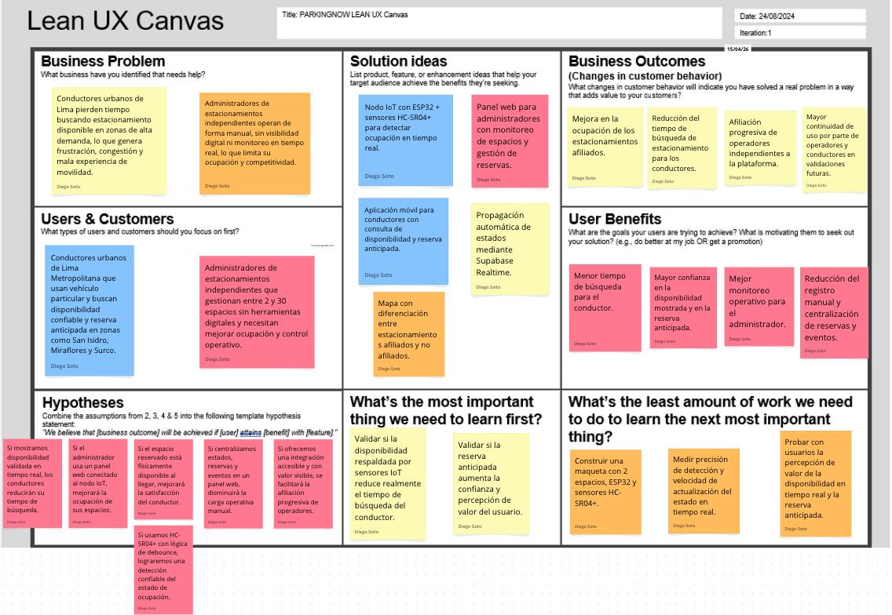
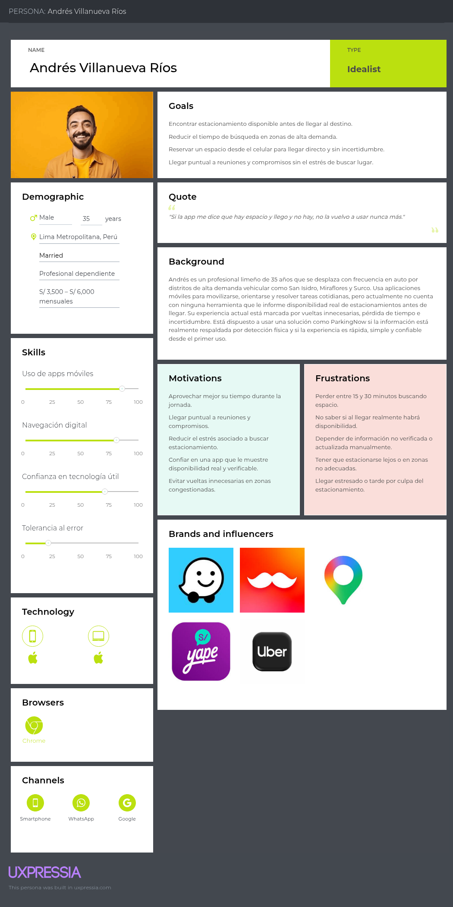
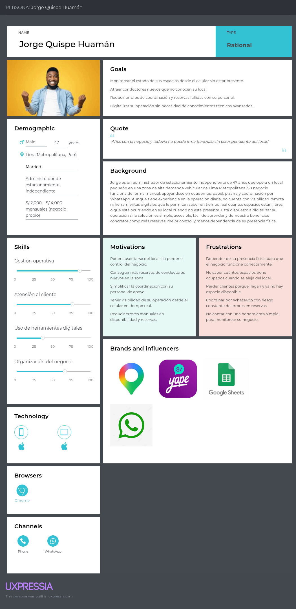

  

<strong>Universidad Peruana de Ciencias Aplicadas</strong>

<strong>Ingeniería de Software</strong> 
Ciclo: 7mo  
1ASI0572 Desarrollo de Soluciones IoT - NRC: 6770    
<strong>Profesor: Javier Antonio Prudencio Vidal</strong> 

<h2 align="center">Informe de Trabajo Final</h2>

<h3 align="center">Startup: Code Mondoguito</h3>

<strong>Producto: ParkingNow</strong>

<h3 align="center">Relación de integrantes:</h3>

| **Apellidos y Nombres**       | **Código**   |
|-------------------------------|--------------|
| Cuya Villegas, Rafael Alberto | U201913495   |
| Soto Quispe, Diego Ulises     | U202214477   |
| Lapa De La Cruz, Gabriel Omar | [COMPLETAR]  |
| Vilca Valverde, Fiorella Angela | [COMPLETAR]  |

<strong>Abril 2026</strong>

# Registro de Versiones del Informe

| Versión | Fecha      | Autor | Descripción de la modificación |
|---------|------------|-------|--------------------------------|
| AV1     | 20/04/2026 | Soto Quispe, Diego Ulises | Se incorporó el **Capítulo I. Introducción**, incluyendo: **1.1 Startup Profile** (1.1.1 Descripción de la Startup, 1.1.2 Perfiles de integrantes del equipo), **1.2 Solution Profile** (1.2.1 Antecedentes y problemática, 1.2.2 Lean UX Process completo) y **1.3 Segmentos objetivo**. |
| AV1     | 21/04/2026 | Soto Quispe, Diego Ulises | Se incorporó el **Capítulo II. Requirements Elicitation & Analysis**, incluyendo: **2.1 Competidores** (análisis competitivo + estrategias), **2.2 Entrevistas** (diseño, registro y análisis), **2.3 Needfinding** (Personas, Task Matrix, Journey Mapping, Empathy Mapping), **2.4 Big Picture EventStorming** y **2.5 Ubiquitous Language**. |
| AV1     | 22/04/2026 | Soto Quispe, Diego Ulises | Se incorporó el **Capítulo III. Requirements Specification**, incluyendo: **3.1 User Stories** con Acceptance Criteria en Gherkin, **3.2 Impact Mapping** y **3.3 Product Backlog** priorizado. |
| AV1 | 20/04/2026 | Cuya Villegas, Rafael Alberto | Se incorporó y desarrolló parte del **Capítulo IV. Solution Software Design**, liderando la definición de **4.1 Strategic-Level DDD** (Design-Level EventStorming, Candidate Context Discovery, Domain Message Flows Modeling) y la estructuración inicial de **Bounded Context Canvases** y **Context Mapping**. |
| AV1 | 21/04/2026 | Soto Quispe, Diego Ulises | Se incorporó y desarrolló parte del **Capítulo IV. Solution Software Design**, participando en la consolidación de **4.1 Strategic-Level DDD**, la propuesta de **Software Architecture (C4 Model)** y la revisión de coherencia entre diagramas de contexto, contenedores y despliegue. |
| AV1 | 22/04/2026 | Lapa De La Cruz, Gabriel Omar | Se incorporó y desarrolló parte del **Capítulo IV. Solution Software Design**, enfocándose en **4.2 Tactical-Level DDD**, elaboración de **Component Level Diagrams (C4)**, validación de notación UML en Class Diagrams y apoyo en la documentación de capas de infraestructura y aplicación. |
| AV1 | 23/04/2026 | Vilca Valverde, Fiorella Angela | Se incorporó y desarrolló parte del **Capítulo IV. Solution Software Design**, encargándose del **Database Design Diagram**, documentación de entidades/relaciones, validación de consistencia entre Domain Layer y esquema de persistencia, y revisión final de formato Markdown y Tabla de Contenidos. |

## Project Report Collaboration Insights

**Organización de GitHub:** [https://github.com/G3-UPC-1ASI0572-6770-IOT](https://github.com/G3-UPC-1ASI0572-6770-IOT)  
**Repositorio del Informe:** [https://github.com/G3-UPC-1ASI0572-6770-IOT/Report](https://github.com/G3-UPC-1ASI0572-6770-IOT/Report)

**Entrega AV1:** Las actividades asignadas para la presente iteración han sido completadas y documentadas de forma colaborativa en el repositorio de control de versiones perteneciente a la organización del equipo en GitHub.

### Proceso de Elaboración Colaborativa

Durante el ciclo de desarrollo del informe para la entrega AV1, el equipo ejecutó las siguientes actividades coordinadas:

- **Redacción estructurada en Markdown:** Cada integrante elaboró los contenidos asignados empleando sintaxis Markdown, realizando commits frecuentes y descriptivos bajo la convención *Conventional Commits*, con el fin de garantizar trazabilidad y evidencia del progreso individual y grupal en el repositorio.

- **Elaboración de artefactos técnicos y de diseño:** Se generaron los diagramas, modelos y documentos requeridos empleando las herramientas indicadas en el enunciado del curso (UXPressia, Structurizr, LucidChart, Figma, entre otras). Los recursos gráficos resultantes fueron centralizados en la carpeta `assets/` del repositorio del informe, siguiendo una nomenclatura consistente para facilitar su referencia en el documento final.

- **Coordinación y revisión iterativa:** Se realizaron sesiones de trabajo síncrono y asíncrono para distribuir responsabilidades, validar la coherencia transversal entre secciones, revisar el estado de los artefactos y consolidar los avances requeridos para la presente entrega.

- **Participación integral del equipo:** Todos los miembros del equipo participaron activamente en la elaboración del informe, contribuyendo en la redacción, revisión técnica, validación de formato y generación de evidencias de colaboración, tal como se detalla en el *Registro de Versiones del Informe* y en la sección *Student Outcome*.

### Evidencias de Colaboración en GitHub

A continuación se presentan las métricas de colaboración extraídas del repositorio del informe, que evidencian la participación distribuida de los integrantes del equipo:

> *[Insertar aquí captura de pantalla de GitHub Insights: gráfico de contribuciones por miembro, historial de commits y actividad por rama]*

### ABET, EAC - Student Outcome 5

**Criterio:** *La capacidad de funcionar efectivamente en un equipo cuyos miembros juntos proporcionan liderazgo, crean un entorno de colaboración e inclusivo, establecen objetivos, planifican tareas y cumplen objetivos.*

En el siguiente cuadro se describen las acciones realizadas y enunciados de conclusiones por parte del grupo, que permiten sustentar el haber alcanzado el logro del ABET, EAC - Student Outcome 5.

| Criterio específico | Acciones realizadas | Conclusiones |
|---------------------|---------------------|--------------|
| **Trabaja en equipo para proporcionar liderazgo en forma conjunta** | **Soto Quispe, Diego Ulises** **AV1:** Lideró la definición del Sprint Goal y la priorización preliminar del Product Backlog para la entrega AV1. Coordinó la sesión de Big Picture EventStorming para alinear la visión general del dominio y revisó la coherencia entre Lean UX Canvas y los User Stories del Capítulo III.  **Cuya Villegas, Rafael Alberto** **AV1:** Lideró la estructuración de los Bounded Context Canvases en el Capítulo IV. Coordinó la revisión técnica de los diagramas C4 a nivel Context y Container, y facilitó la integración entre los artefactos de DDD estratégico y el diseño táctico.  **Lapa De La Cruz, Gabriel Omar** **AV1:** Lideró la elaboración de los Component Level Diagrams y la validación de la notación UML empleada en el diseño táctico. Coordinó la revisión de consistencia entre capas y apoyó en la integración de evidencias técnicas dentro del repositorio del informe.  **Vilca Valverde, Fiorella Angela** **AV1:** Lideró la documentación del Database Design Diagram y la validación de las relaciones de persistencia. Coordinó la revisión de formato, ortografía y estructura Markdown, además de verificar la coherencia entre Domain Layer y el esquema de base de datos. | **AV1:** El equipo distribuyó el liderazgo de manera conjunta según la especialidad técnica de cada integrante, permitiendo avanzar en paralelo en los Capítulos I, II, III y IV sin generar bloqueos relevantes. La organización del trabajo evidenció liderazgo compartido, coordinación efectiva y capacidad de integración de artefactos en una sola entrega coherente. |
| **Crea un entorno colaborativo e inclusivo, establece metas, planifica tareas y cumple objetivos** | **Soto Quispe, Diego Ulises** **AV1:** Definió el Sprint Goal para AV1 orientado a comunicar la arquitectura conceptual y los requisitos validados de ParkingNow IoT. Planificó tareas del Sprint Backlog según las fortalezas técnicas del equipo y promovió reuniones breves de seguimiento para sincronizar avances y resolver bloqueos.  **Cuya Villegas, Rafael Alberto** **AV1:** Propuso el uso de Structurizr para la elaboración de diagramas bajo C4 Model y participó en la sesión de Candidate Context Discovery. Colaboró en la redacción del Ubiquitous Language y revisó artefactos de Needfinding antes de su consolidación en el informe.  **Lapa De La Cruz, Gabriel Omar** **AV1:** Configuró lineamientos de trabajo en el repositorio del informe siguiendo GitFlow y Conventional Commits. Colaboró en la elaboración de Domain Message Flows Modeling y documentó decisiones técnicas para facilitar la trazabilidad de aportes en el equipo.  **Vilca Valverde, Fiorella Angela** **AV1:** Estableció criterios de formato para el informe en Markdown, la jerarquía de títulos y la nomenclatura de recursos gráficos. Colaboró en la revisión de consistencia entre User Personas, historias de usuario y criterios de aceptación, además de centralizar los recursos en la carpeta `assets/`. | **AV1:** El equipo mantuvo un entorno colaborativo mediante acuerdos explícitos de trabajo, uso de convenciones comunes y revisión cruzada de artefactos. La planificación de tareas se realizó con base en objetivos concretos y responsabilidades claras, lo que permitió cumplir oportunamente con el alcance definido para AV1 y sostener una participación equilibrada entre los integrantes. |

# Contenido

- [Registro de Versiones del Informe](#registro-de-versiones-del-informe)  
- [Project Report Collaboration Insights](#project-report-collaboration-insights)  
- [Student Outcome](#student-outcome)  

## Capítulo I: Introducción

- [1.1. Startup Profile](#11-startup-profile)  
  - [1.1.1. Descripción de la Startup](#111-descripción-de-la-startup)  
  - [1.1.2. Perfiles de integrantes del equipo](#112-perfiles-de-integrantes-del-equipo)  
- [1.2. Solution Profile](#12-solution-profile)  
  - [1.2.1. Antecedentes y problemática](#121-antecedentes-y-problemática)  
  - [1.2.2. Lean UX Process](#122-lean-ux-process)  
    - [1.2.2.1. Lean UX Problem Statements](#1221-lean-ux-problem-statements)  
    - [1.2.2.2. Lean UX Assumptions](#1222-lean-ux-assumptions)  
    - [1.2.2.3. Lean UX Hypothesis Statements](#1223-lean-ux-hypothesis-statements)  
    - [1.2.2.4. Lean UX Canvas](#1224-lean-ux-canvas)  
- [1.3. Segmentos objetivo](#13-segmentos-objetivo)  

## Capítulo II: Requirements Elicitation & Analysis

- [2.1. Competidores](#21-competidores)  
  - [2.1.1. Análisis competitivo](#211-análisis-competitivo)  
  - [2.1.2. Estrategias y tácticas frente a competidores](#212-estrategias-y-tácticas-frente-a-competidores)  
- [2.2. Entrevistas](#22-entrevistas)  
  - [2.2.1. Diseño de entrevistas](#221-diseño-de-entrevistas)  
  - [2.2.2. Registro de entrevistas](#222-registro-de-entrevistas)  
  - [2.2.3. Análisis de entrevistas](#223-análisis-de-entrevistas)  
- [2.3. Needfinding](#23-needfinding)  
  - [2.3.1. User Personas](#231-user-personas)  
  - [2.3.2. User Task Matrix](#232-user-task-matrix)  
  - [2.3.3. User Journey Mapping](#233-user-journey-mapping)  
  - [2.3.4. Empathy Mapping](#234-empathy-mapping)  
- [2.4. Big Picture EventStorming](#24-big-picture-eventstorming)  
- [2.5. Ubiquitous Language](#25-ubiquitous-language)  

## Capítulo III: Requirements Specification

- [3.1. User Stories](#31-user-stories)  
- [3.2. Impact Mapping](#32-impact-mapping)  
- [3.3. Product Backlog](#33-product-backlog)  

## Capítulo IV: Solution Software Design

- [4.1. Strategic-Level Domain-Driven Design](#41-strategic-level-domain-driven-design)  
  - [4.1.1. Design-Level EventStorming](#411-design-level-eventstorming)  
    - [4.1.1.1. Candidate Context Discovery](#4111-candidate-context-discovery)  
    - [4.1.1.2. Domain Message Flows Modeling](#4112-domain-message-flows-modeling)  
    - [4.1.1.3. Bounded Context Canvases](#4113-bounded-context-canvases)  
  - [4.1.2. Context Mapping](#412-context-mapping)  
  - [4.1.3. Software Architecture](#413-software-architecture)  
    - [4.1.3.1. System Landscape Diagram](#4131-system-landscape-diagram)  
    - [4.1.3.2. Context Level Diagrams](#4132-context-level-diagrams)  
    - [4.1.3.3. Container Level Diagrams](#4133-container-level-diagrams)  
    - [4.1.3.4. Deployment Diagrams](#4134-deployment-diagrams)  
- [4.2. Tactical-Level Domain-Driven Design](#42-tactical-level-domain-driven-design)  
  - [4.2.X. Bounded Context: Parking Management](#42x-bounded-context-parking-management)  
    - [4.2.X.1. Domain Layer](#42x1-domain-layer)  
    - [4.2.X.2. Interface Layer](#42x2-interface-layer)  
    - [4.2.X.3. Application Layer](#42x3-application-layer)  
    - [4.2.X.4. Infrastructure Layer](#42x4-infrastructure-layer)  
    - [4.2.X.5. Component Level Diagrams](#42x5-component-level-diagrams)  
    - [4.2.X.6. Code Level Diagrams](#42x6-code-level-diagrams)  
      - [4.2.X.6.1. Class Diagrams](#42x61-class-diagrams)  
      - [4.2.X.6.2. Database Design Diagram](#42x62-database-design-diagram)  

## Capítulo V: Solution UI/UX Design

- [5.1. Style Guidelines](#51-style-guidelines)  
  - [5.1.1. General Style Guidelines](#511-general-style-guidelines)  
  - [5.1.2. Web, Mobile and IoT Style Guidelines](#512-web-mobile-and-iot-style-guidelines)  
- [5.2. Information Architecture](#52-information-architecture)  
  - [5.2.1. Organization Systems](#521-organization-systems)  
  - [5.2.2. Labeling Systems](#522-labeling-systems)  
  - [5.2.3. SEO Tags and Meta Tags](#523-seo-tags-and-meta-tags)  
  - [5.2.4. Searching Systems](#524-searching-systems)  
  - [5.2.5. Navigation Systems](#525-navigation-systems)  
- [5.3. Landing Page UI Design](#53-landing-page-ui-design)  
  - [5.3.1. Landing Page Wireframe](#531-landing-page-wireframe)  
  - [5.3.2. Landing Page Mock-up](#532-landing-page-mock-up)  
- [5.4. Applications UX/UI Design](#54-applications-uxui-design)  
  - [5.4.1. Applications Wireframes](#541-applications-wireframes)  
  - [5.4.2. Applications Wireflow Diagrams](#542-applications-wireflow-diagrams)  
  - [5.4.3. Applications Mock-ups](#543-applications-mock-ups)  
  - [5.4.4. Applications User Flow Diagrams](#544-applications-user-flow-diagrams)  
- [5.5. Applications Prototyping](#55-applications-prototyping)  
- [5.6. IoT Device Design](#56-iot-device-design)  

## Capítulo VI: Product Implementation, Validation & Deployment

- [6.1. Software Configuration Management](#61-software-configuration-management)  
  - [6.1.1. Software Development Environment Configuration](#611-software-development-environment-configuration)  
  - [6.1.2. Source Code Management](#612-source-code-management)  
  - [6.1.3. Source Code Style Guide & Conventions](#613-source-code-style-guide--conventions)  
  - [6.1.4. Software Deployment Configuration](#614-software-deployment-configuration)  
- [6.2. Landing Page, Services & Applications Implementation](#62-landing-page-services-applications-implementation)  
  - [6.2.X. Sprint n](#62x-sprint-n)  
    - [6.2.X.1. Sprint Planning n](#62x1-sprint-planning-n)  
    - [6.2.X.2. Aspect Leaders and Collaborators](#62x2-aspect-leaders-and-collaborators)  
    - [6.2.X.3. Sprint Backlog n](#62x3-sprint-backlog-n)  
    - [6.2.X.4. Development Evidence for Sprint Review](#62x4-development-evidence-for-sprint-review)  
    - [6.2.X.5. Testing Suite Evidence for Sprint Review](#62x5-testing-suite-evidence-for-sprint-review)  
    - [6.2.X.6. Execution Evidence for Sprint Review](#62x6-execution-evidence-for-sprint-review)  
    - [6.2.X.7. Services Documentation Evidence for Sprint Review](#62x7-services-documentation-evidence-for-sprint-review)  
    - [6.2.X.8. Software Deployment Evidence for Sprint Review](#62x8-software-deployment-evidence-for-sprint-review)  
    - [6.2.X.9. Team Collaboration Insights during Sprint](#62x9-team-collaboration-insights-during-sprint)  
- [6.3. Validation Interviews](#63-validation-interviews)  
  - [6.3.1. Diseño de Entrevistas](#631-diseño-de-entrevistas)  
  - [6.3.2. Registro de Entrevistas](#632-registro-de-entrevistas)  
  - [6.3.3. Evaluaciones según heurísticas](#633-evaluaciones-según-heurísticas)  
- [6.4. Video About-the-Product](#64-video-about-the-product)  

## Secciones Finales

- [Conclusiones](#conclusiones)  
  - [Conclusiones y recomendaciones](#conclusiones-y-recomendaciones)  
  - [Video About-the-Team](#video-about-the-team)  
- [Bibliografía](#bibliografía)  
- [Anexos](#anexos)

# Capítulo I: Introducción

## 1.1. Startup Profile

En esta sección se presenta el perfil de la startup **Code Mondoguito**, responsable de la concepción, desarrollo y comercialización de su producto principal: **ParkingNow**. Se describe la empresa emergente, su propósito fundacional, misión, visión y los valores que orientan su operación. Esta información contextualiza al lector sobre el origen del proyecto y el equipo detrás de él, estableciendo las bases para comprender la propuesta de valor que se desarrollará a lo largo del presente informe.

### 1.1.1. Descripción de la Startup

**Code Mondoguito** nació en 2026 como iniciativa de un equipo de estudiantes de Ingeniería de Software de la Universidad Peruana de Ciencias Aplicadas (UPC), motivados por la problemática de la congestión vehicular y la gestión ineficiente de estacionamientos en Lima. La startup identifica una brecha operativa en el sector de estacionamientos urbanos independientes: la falta de herramientas digitales accesibles que conecten la disponibilidad física de espacios con la demanda de los conductores.

Su propuesta se materializa en **ParkingNow**, una plataforma tecnológica orientada a optimizar la gestión, reserva y monitoreo de estacionamientos en entornos de alta densidad. La solución integra una arquitectura distribuida que combina dispositivos IoT, aplicaciones móviles y servicios en la nube, permitiendo la detección en tiempo real del estado de ocupación y la digitalización operativa para administradores de estacionamientos.

Code Mondoguito adopta un modelo de negocio **B2B2C** basado en la afiliación de estacionamientos independientes. El cliente pagador principal es el operador del estacionamiento, quien accede a la plataforma mediante una suscripción mensual a cambio de visibilidad digital, monitoreo en tiempo real y gestión automatizada. El conductor participa como usuario final, beneficiándose de la consulta de disponibilidad y reserva anticipada sin costo directo en la etapa inicial.

**Misión**

Brindar una solución tecnológica confiable y accesible que permita a los conductores encontrar y reservar estacionamientos de manera eficiente, mientras los administradores optimizan la ocupación y supervisión de sus espacios mediante herramientas digitales conectadas con información del entorno real.

**Visión**

Ser la plataforma de referencia en gestión inteligente de estacionamientos urbanos en América Latina, reconocida por la precisión de su capa IoT, la experiencia de usuario de sus aplicaciones y su capacidad de generar valor medible para conductores y operadores del sector.

**Valores**

- **Innovación aplicada:** Desarrollamos tecnología accesible para resolver problemas cotidianos de movilidad urbana, priorizando soluciones escalables y adaptadas a la realidad operativa local.
- **Transparencia:** Garantizamos información veraz y en tiempo real a todos los actores de la plataforma, eliminando la incertidumbre en la experiencia de estacionamiento.
- **Sostenibilidad:** Contribuimos activamente a la reducción de la congestión vehicular y la contaminación derivada de la búsqueda innecesaria de espacios.
- **Colaboración:** Construimos la solución de la mano con los operadores independientes, entendiendo su contexto operativo y diseñando una plataforma que se adapte a sus necesidades sin exigir inversiones tecnológicas complejas.

---

### 1.1.2. Perfiles de integrantes del equipo

| **Integrante** | **Datos Académicos** | **Conocimientos y Aporte al Equipo** |
|----------------|----------------------|--------------------------------------|
|   **Diego Ulises Soto Quispe** | **Código:** U202214477 **Carrera:** Ingeniería de Software, 7mo ciclo | **Software y herramientas:** Visual Studio Code, Android Studio, WebStorm, Figma, Notion, GitHub, Docker, n8n, Postman, Swagger, HeyGen, Metricool, Office, CapCut, Clipchamp.  **AI:** Agentes de IA, Skills, MCP, prompting avanzado, Codex CLI, Codex App, Gemini CLI, OpenCode, Claude Code CLI, GitHub Copilot CLI.  **Tecnologías:** Angular, React, Vue.js, Next.js, Kotlin, Flutter, Node.js, Python, C++, .NET, JavaScript, TypeScript, APIs REST, Testing & QA, MySQL, PostgreSQL, MongoDB, SQLite, CI/CD, Scrum, Kanban.  **Habilidades blandas:** Trabajo en equipo, comunicación efectiva, responsabilidad, organización, proactividad, empatía, capacidad de adaptación. |
|   **Rafael Alberto Cuya Villegas** | **Código:** U201913495 **Carrera:** Ingeniería de Software, 8vo ciclo | Especializado en ciberseguridad, bases de datos (SQL, MongoDB) y desarrollo backend (Python, JS). Responsable de la seguridad de la API, optimización de consultas y gestión de la infraestructura de datos para garantizar la integridad de la información en tiempo real. |
|   **Gabriel Omar Lapa De La Cruz** | **Código:** [COMPLETAR] **Carrera:** Ingeniería de Software, [X] ciclo | Enfocado en desarrollo backend (.NET, Vue.js) y modelado arquitectónico. Participa en la implementación de servicios RESTful, elaboración de diagramas C4 y documentación técnica de los bounded contexts para asegurar la trazabilidad del diseño. |
|   **Fiorella Angela Vilca Valverde** | **Código:** [COMPLETAR] **Carrera:** Ingeniería de Software, [X] ciclo | Especializada en experiencia de usuario (UX/UI), testing y modelado de datos. Encargada del diseño de interfaces en Figma, validación de requisitos con usuarios y aseguramiento de calidad para garantizar que la solución resuelva las necesidades reales del conductor y administrador. |

---

## 1.2. Solution Profile

En esta sección se desarrolla el perfil de la solución propuesta por ParkingNow, producto de la startup Code Mondoguito, partiendo de los antecedentes y de la problemática que justifican su desarrollo. Asimismo, se presenta el proceso de Lean UX aplicado al dominio del problema, con el fin de estructurar de manera clara las necesidades de los usuarios, la brecha existente en el mercado y las hipótesis que orientan la construcción del producto. Esta estructura responde directamente a lo solicitado por el enunciado del curso para la sección Solution Profile.

### 1.2.1. Antecedentes y problemática

En el contexto de las ciudades latinoamericanas con alta densidad vehicular, la gestión del estacionamiento urbano representa uno de los problemas de movilidad más frecuentes y con mayor impacto en la experiencia cotidiana de los ciudadanos. En Lima Metropolitana, se estima que circulan aproximadamente 1.8 millones de automóviles (El Comercio, 2024), y el flujo vehicular nacional acumula 27 meses consecutivos de crecimiento al cierre del primer trimestre de 2025 (Asociación Automotriz del Perú [AAP], 2025). Esta tendencia sostenida ejerce una presión creciente sobre la infraestructura vial y de estacionamiento de la ciudad. El informe *Cities in Motion 2025* posicionó a Lima en el puesto 176 de movilidad y transporte a nivel mundial, reflejando una crisis estructural que empeora año tras año (Infobae, 2025a).

En este escenario, encontrar espacios disponibles se convierte en un problema recurrente y costoso para los conductores en términos de tiempo. Investigaciones recientes sobre sistemas de Smart Parking confirman que la falta de información actualizada es una de las principales causas de congestión vehicular urbana, y que soluciones basadas en IoT con sensores y aplicaciones móviles pueden reducir significativamente ese impacto (Ruiz Cruzado et al., 2026; Nur et al., 2025).

Desde la perspectiva de los operadores, el problema es igualmente crítico. Lima enfrenta una informalidad crónica en el sector: parqueadores informales se han adueñado de espacios públicos en múltiples distritos, cobrando tarifas sin regulación y desplazando a operadores formales (Infobae, 2024). Los distritos de Miraflores, San Borja, Surco y San Isidro cuentan apenas con 12,000 espacios de estacionamiento público entre los cuatro, pese a que solo en Miraflores transitan 40,000 vehículos diarios (El Comercio, 2024). Esta brecha estructural entre oferta y demanda no podrá resolverse sin herramientas digitales que permitan a los operadores formales gestionar mejor los espacios disponibles y conectarlos con los conductores que los necesitan.

ParkingNow surge en este contexto como una propuesta orientada a resolver esa doble brecha: reducir la incertidumbre del conductor al buscar un espacio y modernizar la operación de los administradores mediante herramientas digitales conectadas al estado físico real.

---

#### Enunciado del Problema

En zonas de alta densidad vehicular de Lima Metropolitana, los conductores enfrentan incertidumbre recurrente para encontrar estacionamientos disponibles, mientras que los administradores independientes gestionan sus espacios de forma manual y sin visibilidad digital en tiempo real. Esta desconexión entre el estado físico real de los espacios y la información accesible para ambos actores genera pérdida de tiempo, congestión vehicular y subutilización de la oferta existente. Frente a ello, ParkingNow propone una solución IoT distribuida orientada a vincular detección física, procesamiento local y sincronización automática de la disponibilidad en aplicaciones de usuario.

#### Análisis mediante la técnica 5W + 2H

**Who (¿Quién?):**
El problema afecta a dos grupos de usuarios con necesidades distintas pero complementarias. Por un lado, los conductores urbanos de Lima Metropolitana que utilizan vehículo particular y necesitan encontrar estacionamiento disponible de forma frecuente en zonas de alta demanda vehicular, como los distritos de San Isidro, Miraflores, Surco, La Molina y el Centro Histórico. El 51.1% de los encuestados en Lima y Callao considera necesario incrementar los estacionamientos en vía pública, cifra que asciende al 70.1% en el sector socioeconómico A (Lima Cómo Vamos, 2024). Por otro lado, los administradores y propietarios de estacionamientos independientes que gestionan sus espacios sin herramientas digitales integradas, en un contexto donde la informalidad del sector limita la oferta formal de estacionamiento disponible para el conductor (Infobae, 2024).

**What (¿Qué?):**
El problema central es la desconexión entre el estado físico real de los espacios y la información que reciben el conductor y el administrador. El conductor no sabe qué espacios están libres antes de llegar, y el administrador no cuenta con visibilidad inmediata de la ocupación de su local. Estudios sobre sistemas de Smart Parking basados en IoT demuestran que integrar sensores ultrasónicos y microcontroladores ESP32 con plataformas de visualización permite cerrar con precisión esta brecha de información, logrando detección confiable de vehículos con filtros antirrebote y notificación automática de espacios liberados (Ruiz Cruzado et al., 2026).

**Where (¿Dónde?):**
El problema ocurre con mayor frecuencia en zonas urbanas de alta densidad vehicular de Lima Metropolitana, especialmente en áreas aledañas a centros empresariales, universidades, hospitales, mercados y zonas comerciales. Los cuatro distritos más saturados (Miraflores, San Borja, Surco y San Isidro) combinan apenas 12,000 espacios de estacionamiento público para atender una demanda vehicular diaria de decenas de miles de vehículos (El Comercio, 2024). Esta situación evidencia que la problemática no es puntual sino sistémica en el contexto urbano de la ciudad.

**When (¿Cuándo?):**
El problema se manifiesta de forma recurrente durante los días laborables, con mayor intensidad en horarios de alta demanda vehicular: mañana (7:00 a 9:00 am), mediodía (12:00 a 2:00 pm) y tarde-noche (5:00 a 8:00 pm). El flujo vehicular en el país registró en julio de 2025 un crecimiento de 4.1% respecto al mismo mes del año anterior, con los vehículos ligeros creciendo 3.8% y los pesados 4.6% (AAP, 2025), lo que anticipa que la saturación seguirá agravándose en los próximos años. La problemática se agudiza en fechas o eventos de alta concurrencia urbana.

**Why (¿Por qué?):**
La causa raíz es la falta de integración entre el entorno físico del estacionamiento y los canales digitales de información y gestión. No existe un mecanismo accesible y confiable que permita al conductor conocer la disponibilidad real de los espacios en tiempo real, ni que permita al administrador monitorear su operación de forma automatizada. A esto se suma una saturación vehicular que crece a razón de más de 150,000 vehículos por año en Lima, agravada por una infraestructura vial obsoleta y la desarticulación del transporte público (Infobae, 2025b). Las soluciones tecnológicas de control de acceso existentes implican inversiones elevadas y mantenimiento especializado, lo que las hace inaccesibles para los operadores independientes de pequeña escala.

**How (¿Cómo?):**
ParkingNow aborda esta problemática mediante una solución digital distribuida que integra una aplicación móvil para el conductor, un panel web para el administrador, servicios backend y una capa de sensado IoT basada en microcontroladores ESP32 y sensores ultrasónicos HC-SR04+. La literatura científica reciente confirma la viabilidad de este enfoque: sistemas de Smart Parking que integran sensor networks, ESP32 y aplicaciones móviles logran una gestión eficiente de espacios con arquitecturas de bajo costo y alta escalabilidad (Nur et al., 2025). El nodo IoT detecta físicamente el estado de ocupación de cada espacio, procesa localmente esa información aplicando lógica edge, y la reporta al backend mediante HTTP REST. Los cambios se propagan automáticamente a las aplicaciones mediante Supabase Realtime, garantizando coherencia entre el estado físico y los canales digitales.

**How Much (¿Cuánto?):**
El Instituto Nacional de Estadística e Informática (INEI) reportó en diciembre de 2025 un crecimiento sostenido del flujo vehicular nacional (INEI, 2026), reflejando que la presión sobre la infraestructura de estacionamiento continúa en aumento. En el plano operativo, empresas formales de estacionamiento como Tu Parqueo reportaron en 2024 tasas de ocupación del 80% en sus locales de San Isidro, Barranco y La Victoria, con el 55% de sus ingresos generado por clientes eventuales (Gestión, 2024), lo que evidencia la alta demanda del servicio cuando existe oferta organizada y visible. Estos indicadores sustentan la oportunidad de negocio de ParkingNow: conectar esa demanda insatisfecha con operadores independientes que actualmente no tienen herramientas para captarla.

---

#### Puntos más importantes que debe resolver la solución

A partir del análisis anterior, ParkingNow debe resolver de forma prioritaria los siguientes problemas:

1. **Falta de visibilidad sobre la disponibilidad real de espacios:** Los conductores no cuentan con información actualizada y verificada sobre qué espacios están libres antes de llegar al estacionamiento. La información disponible actualmente, cuando existe, no está respaldada por un mecanismo de detección física confiable.

2. **Ausencia de un mecanismo de reserva anticipada confiable:** No existe una forma simple y digital de garantizar un espacio antes de llegar físicamente al estacionamiento, lo que obliga al conductor a desplazarse con incertidumbre total sobre si encontrará o no un lugar disponible.

3. **Desconexión entre el estado físico y los canales digitales:** La disponibilidad informada no refleja necesariamente la realidad del espacio, porque no hay un mecanismo de sensado que vincule el entorno físico del estacionamiento con las plataformas digitales de información y gestión.

4. **Limitada capacidad operativa de los administradores independientes:** Los operadores gestionan sus espacios de forma manual, sin herramientas que les permitan monitorear ocupación, gestionar reservas activas y visualizar eventos operativos en tiempo real desde un canal digital accesible.

---

#### Objetivos de la solución

- Permitir a los conductores urbanos consultar la disponibilidad real de espacios de estacionamiento desde una aplicación móvil, con información actualizada en tiempo real a partir del estado detectado por los sensores IoT.
- Habilitar la reserva anticipada de espacios disponibles, proporcionando al conductor un ticket virtual de confirmación antes de llegar físicamente al estacionamiento.
- Dotar a los administradores de estacionamientos de un panel web que les permita monitorear el estado de ocupación de sus espacios, gestionar reservas activas y acceder al historial de eventos operativos generado por el nodo IoT.
- Construir una solución IoT distribuida que integre detección física mediante sensores ultrasónicos HC-SR04+ en un nodo ESP32, procesamiento local edge, reporte al backend vía HTTP REST y propagación automática de cambios a las aplicaciones mediante Supabase Realtime, bajo una arquitectura coherente de dispositivo embebido, Edge API, Core API y aplicaciones de usuario.
- Evidenciar la trazabilidad end-to-end entre el evento físico detectado por el sensor y su representación digital en tiempo real en las interfaces del conductor y del administrador, como validación de la integración de la arquitectura distribuida propuesta.

---

#### Restricciones del proyecto

- El alcance del proyecto corresponde a un **prototipo académico funcional**, por lo que la validación se realizará sobre un escenario controlado y representativo en forma de maqueta, no sobre una implementación masiva en entornos urbanos reales.
- El nodo IoT físico contempla **dos espacios de estacionamiento** en la maqueta de demostración, lo cual es suficiente para evidenciar la integración completa de la arquitectura distribuida dentro del alcance del curso.
- La solución no incluirá funcionalidades de pago ni facturación en esta primera versión, dado que el enfoque prioriza la trazabilidad del estado de los espacios y la experiencia de reserva como valor central de la plataforma.
- El despliegue se realizará sobre servicios cloud gratuitos o de bajo costo (Railway para backend, Vercel para frontend, Supabase free tier para base de datos y tiempo real), adecuados para el alcance universitario del proyecto.

---

### 1.2.2. Lean UX Process

En esta sección se aplica el proceso Lean UX sobre el dominio del problema de estacionamiento urbano en Lima, con el objetivo de construir una visión compartida y validable del modelo de negocio que sustenta **ParkingNow**, producto de la startup **Code Mondoguito**. El proceso parte de la identificación de los Problem Statements, continúa con la formulación de Assumptions sobre el negocio y los usuarios, y culmina en la redacción de Hypothesis Statements que orientarán la validación progresiva del producto durante su ciclo de desarrollo.

> **Nota metodológica:** Las Assumptions se han categorizado en cinco grupos para facilitar su trazabilidad con los outcomes de negocio, outcomes de usuario y features del producto:
> - **Business Outcomes Assumptions:** Supuestos sobre métricas de negocio medibles.
> - **User Outcomes Assumptions:** Supuestos sobre comportamientos y necesidades del usuario.
> - **Business Assumptions:** Supuestos sobre adopción del modelo y contexto de mercado.
> - **User Assumptions:** Supuestos sobre preferencias y hábitos de interacción.
> - **Features Assumptions:** Supuestos sobre funcionalidades técnicas y su viabilidad.

---

#### 1.2.2.1. Lean UX Problem Statements

##### Problem Statement #1: Segmento Conductores Urbanos

| Elemento | Descripción |
|----------|-------------|
| **Domain** | El estado actual de la movilidad urbana en Lima se ha centrado principalmente en el mejoramiento de infraestructura vial y en la implementación de sistemas de transporte público masivo. |
| **Customer Segments** | Conductores urbanos de Lima Metropolitana que utilizan vehículo particular y se desplazan frecuentemente a zonas de alta demanda vehicular, como San Isidro, Miraflores, Surco, La Molina y el Centro Histórico. |
| **Pain Points** | Los conductores recorren múltiples cuadras de forma incierta antes de encontrar un espacio libre, lo que genera pérdida de tiempo, incremento de la congestión vehicular y deterioro de su experiencia de movilidad. |
| **Gap** | Las soluciones digitales actuales no integran una capa física de sensado que confirme el estado real del espacio, generando inconsistencias entre la información mostrada y la disponibilidad efectiva. |
| **Visión / Solución propuesta** | ParkingNow abordará esta brecha mediante una plataforma IoT distribuida que integre sensores físicos en espacios afiliados, permitiendo consultar disponibilidad verificada en tiempo real, reservar desde la aplicación móvil y llegar directamente a un lugar garantizado. |
| **Initial Segment** | Conductores urbanos de 25 a 45 años, de nivel socioeconómico B y C, que trabajan o estudian en distritos de alta demanda vehicular y han experimentado de forma recurrente la frustración de perder tiempo buscando estacionamiento. |
| **Criterio de validación** | Se considerará que este problema empieza a resolverse cuando el uso de ParkingNow permita reducir el tiempo promedio de búsqueda y acceso a un espacio afiliado a menos de 5 minutos desde el inicio de la búsqueda en la aplicación, y cuando la experiencia alcance niveles positivos de satisfacción en etapas posteriores de validación con usuarios reales. |

##### Problem Statement #2: Segmento Administradores de Estacionamientos Independientes

| Elemento | Descripción |
|----------|-------------|
| **Domain** | El estado actual de los estacionamientos independientes en Lima se caracteriza por una operación predominantemente manual, sin herramientas digitales de gestión, sin presencia en plataformas de búsqueda y sin capacidad de monitoreo remoto. |
| **Customer Segments** | Administradores y propietarios de estacionamientos independientes que gestionan entre 2 y 30 espacios en distritos de alta demanda vehicular de Lima, sin herramientas digitales integradas. |
| **Pain Points** | Los operadores no tienen visibilidad inmediata de su operación, carecen de datos históricos para tomar decisiones y no pueden competir con estacionamientos de mayor escala, lo que los margina de la demanda digital creciente. |
| **Gap** | Las soluciones actuales del mercado no resuelven la accesibilidad tecnológica para este segmento, ya que implican inversiones elevadas, configuración compleja y mantenimiento especializado, inviables para operadores pequeños sin respaldo tecnológico. |
| **Visión / Solución propuesta** | ParkingNow proporcionará al operador independiente un esquema de afiliación de bajo costo, con nodo IoT accesible y panel web intuitivo para monitorear espacios en tiempo real, gestionar reservas y ganar visibilidad digital. |
| **Initial Segment** | Administradores de estacionamientos independientes ubicados en Miraflores, San Isidro y Surco, que operan manualmente entre 2 y 30 espacios y no cuentan actualmente con ninguna herramienta digital de gestión. |
| **Criterio de validación** | Se considerará que este problema empieza a resolverse cuando un estacionamiento afiliado a ParkingNow evidencie una mejora sostenida en su ocupación y en su capacidad de gestión operativa respecto a su situación previa sin herramientas digitales. |

---

#### 1.2.2.2. Lean UX Assumptions

> Las métricas cuantitativas presentadas en esta sección corresponden a supuestos iniciales de negocio, adopción y experiencia de usuario. Deben entenderse como referencias preliminares orientadas a la validación del modelo de ParkingNow, y no como resultados observados ni como proyecciones definitivas del proyecto. Su contraste se realizará en etapas posteriores mediante entrevistas, validaciones con usuarios, pruebas piloto y evaluación del prototipo.

##### Business Outcomes Assumptions

1. **Generar un modelo de ingresos recurrente mediante afiliación de operadores:**  
   Como supuesto inicial de negocio, se plantea la posibilidad de afiliar al menos 15 estacionamientos independientes en Lima durante los primeros seis meses posteriores a un eventual lanzamiento.  
   **Indicadores de referencia:** número de contratos firmados, cantidad de nodos IoT instalados y cantidad de nodos activos.

2. **Escalar la plataforma a nuevas zonas urbanas de Lima:**  
   Como supuesto de crecimiento, se plantea alcanzar presencia en al menos 5 distritos de Lima Metropolitana al término del primer año de operación.  
   **Indicadores de referencia:** número de estacionamientos afiliados por distrito y volumen de reservas completadas por zona.

3. **Posicionarse como referente inicial de soluciones IoT para estacionamientos en Perú:**  
   Como supuesto preliminar de adopción, se plantea alcanzar al menos 1,000 conductores registrados y 500 reservas completadas durante los primeros meses de operación de una versión futura del producto.  
   **Indicadores de referencia:** número de usuarios registrados, tasa de conversión de búsqueda a reserva y retención mensual de usuarios activos.

##### User Outcomes Assumptions

1. Los conductores urbanos de Lima necesitan identificar, seleccionar y acceder a un espacio disponible en menos de 5 minutos, sin búsqueda física adicional, para percibir valor real en su experiencia de movilidad.

2. Los administradores independientes necesitan evidenciar una mejora concreta en su tasa de ocupación durante los primeros meses de uso para considerar que la afiliación a ParkingNow justifica el costo de la suscripción y la instalación del nodo IoT.

3. Los administradores necesitan eliminar la dependencia de registros manuales y centralizar el monitoreo de estados, reservas y eventos en un único panel web para reducir significativamente su carga operativa.

4. Los conductores necesitan certeza de que el espacio reservado estará disponible al momento de su llegada, respaldado por verificación física confiable, para adoptar la plataforma como herramienta habitual.

##### Business Assumptions

- Los conductores urbanos de Lima adoptarán una aplicación móvil para consultar disponibilidad y reservar, siempre que esta les garantice información confiable en tiempo real y reduzca perceptiblemente el tiempo de búsqueda.

- Los operadores independientes se afiliarán a ParkingNow y asumirán una suscripción mensual, siempre que la plataforma les ofrezca un beneficio económico claro en términos de visibilidad, mejora operativa y potencial incremento de ocupación.

- Los operadores integrarán un nodo IoT si el costo es accesible, la configuración es simple y la solución no requiere conocimientos técnicos especializados para su operación cotidiana.

- En la etapa inicial, el conductor participa como usuario final de la aplicación sin asumir el rol de cliente pagador principal, ya que el valor económico directo se concentra en el operador afiliado.

- Existe densidad suficiente de estacionamientos independientes en San Isidro, Miraflores y Surco para construir una oferta inicial atractiva y sostener una estrategia temprana de afiliación.

- La integración con OpenStreetMap permite poblar el mapa inicial con estacionamientos reales de Lima, incrementando la utilidad percibida de la plataforma desde el primer uso.

- El uso de Supabase Realtime como mecanismo de propagación de estados permite mantener coherencia entre el estado físico detectado y la información mostrada en las aplicaciones.

##### User Assumptions

- Los conductores revisan la disponibilidad de estacionamiento preferentemente desde su teléfono móvil, antes o durante el trayecto hacia su destino.

- Los administradores prefieren interfaces simples y visuales que no requieran formación técnica especializada.

- Los conductores valoran visualizar en el mapa tanto estacionamientos afiliados, con reserva y disponibilidad en tiempo real, como estacionamientos no afiliados, usados como referencia de ubicación.

- Los administradores valoran recibir alertas inmediatas cuando un espacio cambia de estado, especialmente cuando una reserva activa es consumida por la llegada física del vehículo.

- Tanto conductores como administradores esperan que la plataforma mantenga el último estado conocido ante una eventual desconexión del nodo IoT, en lugar de mostrar errores o datos vacíos.

##### Features Assumptions

- **Detección de ocupación en tiempo real:** Sensores HC-SR04+ conectados al ESP32 detectan la presencia de vehículos con un umbral configurable, aplicando lógica de *debounce* para evitar falsos positivos.

- **Reserva anticipada de espacios:** El conductor puede seleccionar y reservar un espacio libre desde la aplicación móvil antes de llegar físicamente al estacionamiento, con un ticket virtual como comprobante.

- **Propagación automática de estados:** Los cambios de estado físico del espacio se reflejan automáticamente en la Web App y en la Mobile App vía Supabase Realtime, sin necesidad de recargar la pantalla.

- **Diferenciación entre afiliados y no afiliados:** El mapa muestra estacionamientos reales de Lima cargados desde OpenStreetMap, distinguiendo visualmente cuáles tienen disponibilidad en tiempo real y permiten reservas, y cuáles son solo puntos de referencia.

- **Comportamiento degradado ante desconexión:** Si el nodo deja de reportar, el sistema conserva el último estado conocido y lo marca visualmente como no confirmado en tiempo real.

- **Vista de cámara local:** Una cámara integrada al nodo IoT permite al administrador verificar visualmente el estado desde el panel web.

---

#### 1.2.2.3. Lean UX Hypothesis Statements

> Las siguientes hipótesis representan relaciones de causa-efecto que se espera contrastar en etapas posteriores del proyecto. Su finalidad es orientar el diseño del producto y establecer criterios iniciales de validación, sin constituir resultados demostrados en la presente entrega.

##### Hypothesis Statement #1

**Creemos que lograremos:** reducir el tiempo de búsqueda de estacionamiento de los conductores urbanos en Lima a menos de 5 minutos.  
**Si:** mostramos disponibilidad validada en tiempo real mediante sensores IoT embebidos en los espacios afiliados.  
**Con:** la evidencia de que una proporción significativa de conductores complete una reserva exitosa en menos de 5 minutos desde que inicia la búsqueda en la aplicación.

##### Hypothesis Statement #2

**Creemos que lograremos:** mejorar la tasa de ocupación de los espacios afiliados durante los primeros meses de uso.  
**Si:** dotamos a los administradores de un panel web de monitoreo y gestión de reservas, integrado con un nodo IoT de hardware accesible.  
**Con:** la evidencia de que los estacionamientos afiliados registren un incremento sostenido en el número de reservas completadas respecto a su operación previa sin la plataforma.

##### Hypothesis Statement #3

**Creemos que lograremos:** mejorar la satisfacción del conductor en una etapa posterior de validación del producto.  
**Si:** garantizamos que el espacio reservado se encuentre efectivamente disponible al momento de la llegada del conductor, mediante validación física realizada por la capa IoT.  
**Con:** la evidencia de que los conductores que completan una reserva califiquen positivamente la experiencia posterior a su visita.

##### Hypothesis Statement #4

**Creemos que lograremos:** reducir de forma significativa la carga operativa manual del administrador de estacionamiento.  
**Si:** centralizamos el monitoreo de estados de espacios, la visualización de reservas activas y el historial de eventos operativos en un panel web integrado al nodo IoT.  
**Con:** la evidencia de que los administradores afiliados reporten haber eliminado o reducido sustancialmente el uso de registros físicos manuales para el control de ocupación y reservas.

##### Hypothesis Statement #5

**Creemos que lograremos:** facilitar la afiliación progresiva de estacionamientos independientes a la plataforma en una etapa posterior de comercialización.  
**Si:** ofrecemos un esquema de integración accesible y un retorno de valor medible en términos de reservas y visibilidad digital.  
**Con:** la evidencia de que los operadores afiliados mantengan su suscripción y recomienden la plataforma a otros operadores del sector.

##### Hypothesis Statement #6 *(Técnica)*

**Creemos que lograremos:** una detección confiable del estado de ocupación de los espacios en condiciones normales de operación.  
**Si:** implementamos sensores ultrasónicos HC-SR04+ con lógica de *debounce* en el firmware del ESP32.  
**Con:** la evidencia de que el nodo IoT mantenga un nivel aceptable de precisión y minimice falsos positivos y falsos negativos durante el periodo de prueba del prototipo.

---

#### 1.2.2.4. Lean UX Canvas

A continuación se presenta el Lean UX Canvas elaborado para ParkingNow, que sintetiza los elementos clave del proceso Lean UX: el problema de negocio identificado, los segmentos de usuario, las ideas de solución, los beneficios esperados, las hipótesis centrales y los aprendizajes prioritarios que orientan el desarrollo del producto.

**Figura 1**  
*Lean UX Canvas de ParkingNow para el dominio de gestión de estacionamientos urbanos en Lima Metropolitana*

**Nota.** Elaboración propia (2026). Iteración 1. Fecha: 15/04/2026.

> Según la Figura 1, el Lean UX Canvas de ParkingNow identifica como problema central la desconexión entre el estado físico real de los espacios y los canales digitales de información. Esta brecha afecta tanto a conductores urbanos, que pierden tiempo buscando disponibilidad, como a administradores independientes, que operan sin visibilidad ni herramientas digitales.
>
> Las ideas de solución se articulan en torno a una plataforma distribuida con sensores IoT, reservas anticipadas vía aplicación móvil y un panel web de monitoreo para el operador. Los outcomes de negocio priorizan, como objetivos preliminares de validación, la mejora en la ocupación de los estacionamientos afiliados y la reducción del tiempo de búsqueda del conductor. Asimismo, se plantea como referencia inicial de experiencia de usuario alcanzar niveles positivos de satisfacción en una etapa posterior de validación del producto.
>
> El aprendizaje más importante a contrastar en las primeras iteraciones será determinar si la disponibilidad respaldada por el nodo IoT contribuye efectivamente a reducir el tiempo de búsqueda y si la reserva anticipada mejora la percepción de valor del usuario. Estas referencias deben entenderse como hipótesis iniciales sujetas a validación, no como resultados demostrados en la presente fase.

> **Nota sobre el artefacto:** El Lean UX Canvas fue elaborado como un artefacto visual de trabajo para sintetizar los supuestos centrales del modelo de negocio y orientar la validación temprana del producto dentro del alcance de la presente entrega.

**Enlace al canvas:** [https://canva.link/jukpsaamxd32d5t](https://canva.link/jukpsaamxd32d5t)

## 1.3. Segmentos objetivo

Los segmentos objetivo de ParkingNow han sido identificados a partir del análisis del dominio del problema de la gestión de estacionamientos urbanos en Lima Metropolitana. La plataforma atiende a dos tipos de usuarios con necesidades distintas pero complementarias: los conductores urbanos que necesitan encontrar y reservar estacionamiento de manera eficiente, y los administradores de estacionamientos independientes que necesitan digitalizar y optimizar su operación. A continuación se describe cada segmento con sus características demográficas y estadísticas de sustento.

---

### Segmento 1: Conductores Urbanos

**Descripción:**
Este segmento comprende a personas que se movilizan habitualmente en vehículo propio por Lima Metropolitana y que se enfrentan de forma recurrente al problema de encontrar estacionamiento disponible en zonas de alta demanda vehicular. Son los usuarios finales de la aplicación móvil de ParkingNow, a través de la cual consultan disponibilidad en tiempo real, ubican estacionamientos cercanos en el mapa, realizan reservas anticipadas y gestionan su historial de uso.

**Características demográficas:**
- **Edad:** Entre 25 y 45 años, con mayor concentración entre los 28 y 40 años, correspondiente a la población económicamente activa que trabaja o estudia en distritos de alta densidad vehicular.
- **Género:** Hombres y mujeres con vehículo propio o acceso frecuente a uno.
- **Ubicación:** Residen o trabajan en Lima Metropolitana, con desplazamientos frecuentes a distritos como San Isidro, Miraflores, Surco, La Molina, Lince y el Centro Histórico.
- **Perfil socioeconómico:** Usuarios con capacidad de uso frecuente de vehículo particular y familiaridad con aplicaciones móviles de movilidad y servicios, representativos de los estratos medios y medio-altos de la ciudad.
- **Perfil tecnológico:** Usuarios habituales de smartphones con sistema operativo Android o iOS, familiarizados con aplicaciones de mapas, reservas y movilidad (Google Maps, Waze, Uber, Rappi).

**Información estadística de sustento:**
En Lima Metropolitana circulan aproximadamente 1.8 millones de automóviles, de los cuales el 11.2% de la población los usa para desplazarse al trabajo y el 7.9% para estudiar (El Comercio, 2024). El 51.1% de los encuestados en Lima y Callao considera necesario incrementar los estacionamientos en vía pública, porcentaje que asciende al 70.1% en el sector socioeconómico A, lo que evidencia la alta insatisfacción con la oferta actual (Lima Cómo Vamos, 2024). Asimismo, el informe *Cities in Motion 2025* posicionó a Lima en el puesto 176 de movilidad a nivel mundial, siendo una de las ciudades con peores indicadores de transporte urbano (Infobae, 2025a). El flujo vehicular nacional acumula 27 meses de crecimiento consecutivo, con un incremento de 3.5% acumulado entre agosto de 2024 y julio de 2025 (AAP, 2025), lo que proyecta mayor presión sobre la infraestructura de estacionamiento en los próximos años.

---

### Segmento 2: Administradores de Estacionamientos Independientes

**Descripción:**
Este segmento comprende a los dueños y administradores de estacionamientos independientes de Lima Metropolitana que operan entre 2 y 30 espacios, generalmente bajo esquemas manuales o semi-formales y sin herramientas digitales integradas de gestión. Constituyen el cliente pagador principal de ParkingNow y los usuarios directos del panel web de la plataforma, desde el cual pueden registrar su local, configurar sus espacios, monitorear el estado de ocupación en tiempo real, gestionar reservas activas y consultar el historial de eventos generados por el nodo IoT instalado en su establecimiento.

**Características demográficas:**
- **Edad:** Entre 35 y 60 años, generalmente propietarios del local o administradores con varios años de experiencia operativa en el sector.
- **Género:** Predominantemente hombres, con presencia creciente de mujeres emprendedoras en actividades de servicios urbanos.
- **Ubicación:** Operan estacionamientos ubicados en distritos de alta densidad comercial y residencial de Lima, especialmente en zonas próximas a centros empresariales, universidades, hospitales, mercados y áreas de alta concurrencia.
- **Nivel tecnológico:** Medio-bajo en términos de adopción de herramientas digitales. En muchos casos, la operación se apoya todavía en registros manuales o procedimientos informales. Sin embargo, muestran disposición a adoptar soluciones simples, siempre que sean accesibles, fáciles de usar y generen mejoras visibles en ingresos u operación.
- **Perfil de negocio:** Microempresas o negocios familiares con márgenes ajustados, alta sensibilidad al costo de implementación y orientación a resultados concretos, como aumento de ocupación y mayor captación de clientes.

**Información estadística de sustento:**
Lima presenta una informalidad persistente en la gestión del estacionamiento urbano. Reportes periodísticos recientes muestran que, en diversos distritos, la presencia de parqueadores informales y el uso no regulado del espacio urbano han desplazado o debilitado la operación formal del sector (Infobae, 2024). Esta situación evidencia la existencia de una oferta fragmentada, con baja visibilidad digital y escaso acceso a herramientas tecnológicas de gestión.

Asimismo, el INEI publicó en 2026 el informe *Región Lima: Estructura Empresarial, 2024*, en el cual se observa que las microempresas del sector servicios representan una parte importante del tejido empresarial regional y enfrentan mayores limitaciones de formalización y digitalización que empresas de mayor escala (INEI, 2026). Este contexto resulta consistente con el perfil de los estacionamientos independientes, que suelen operar con recursos limitados y baja incorporación de tecnología. Desde el punto de vista técnico y económico, la literatura reciente sobre Smart Parking respalda la pertinencia de este segmento como usuario objetivo, ya que soluciones basadas en ESP32 y sensores ultrasónicos permiten implementar sistemas de monitoreo de ocupación con costos accesibles y una complejidad técnica adecuada para contextos de pequeña escala (Ruiz Cruzado et al., 2026; Bustamante & Hidrobo, 2024).

---

**Priorización de segmentos:**
Estos segmentos fueron priorizados porque representan, respectivamente, al usuario final que demanda disponibilidad confiable y al cliente pagador que obtiene valor operativo y económico directo de la solución. La integración de ambos segmentos en la arquitectura de ParkingNow garantiza un modelo de negocio sostenible, donde la capa IoT valida la disponibilidad física, la aplicación móvil resuelve la incertidumbre del conductor y el panel web digitaliza la operación del administrador.

## 2.1. Competidores

ParkingNow compite en el mercado de soluciones digitales para la gestión y búsqueda de estacionamientos urbanos en Lima Metropolitana. Los principales competidores directos con presencia activa en el mercado peruano son **Quadra**, **ParkGo** y **Apparka**. En esta clasificación, **Quadra** y **ParkGo** se consideran competidores más directos en la búsqueda y reserva digital de estacionamientos o cocheras. **Apparka** también compite en la experiencia del conductor, pero desde una red formal y cerrada de estacionamientos perteneciente al grupo Los Portales. En este contexto, ParkingNow participa en el mismo dominio funcional y busca diferenciarse por una propuesta orientada a respaldar la disponibilidad reportada mediante sensado físico IoT y una arquitectura adaptada a operadores independientes de pequeña escala.

**Quadra** es una empresa peruana que opera como marketplace y ecosistema digital de estacionamientos, conectando conductores con cocheras privadas, emprendedores y empresas mediante aplicaciones móviles y un componente SaaS. Su comunicación pública destaca reservas, tickets digitales, monitoreo de disponibilidad en tiempo real, automatización, integración con add-ons de hardware y planes empresariales orientados a optimizar ocupación y accesos. Sin embargo, no se identifica en su comunicación pública una propuesta centrada explícitamente en sensado físico por espacio con trazabilidad end-to-end orientada a operadores independientes de 2 a 30 espacios, como la planteada por ParkingNow.

**ParkGo** es una aplicación peruana creada por Katherinne Oyarce que conecta conductores con cocheras disponibles y busca reducir el tiempo necesario para encontrar estacionamiento. Una nota reciente de *El Comercio* indica que la aplicación suma 4,500 usuarios en Lima Metropolitana, Arequipa, Cusco y Huarmey, y que ha observado un crecimiento del 40% en el último año. Su propuesta visible al mercado se centra en la conexión digital entre oferta y demanda de espacios, sin que se observe en su comunicación pública una capa de sensado físico del espacio equivalente a la propuesta por ParkingNow.

**Apparka** es la plataforma digital del grupo Los Portales orientada a la ubicación y gestión de estacionamientos dentro de su propia red. La memoria anual del grupo señala que APPARKA es de uso exclusivo en los estacionamientos de Los Portales y permite ubicar el estacionamiento más cercano, además de realizar pagos desde el celular (Los Portales, 2024). En consecuencia, compite en la experiencia del conductor dentro del mercado formal, pero no está orientada a operadores independientes de pequeña escala.

---

### 2.1.1. Análisis competitivo

<table>
  <thead>
    <tr>
      <th colspan="6" align="left">Competitive Analysis Landscape</th>
    </tr>
    <tr>
      <th align="left">¿Por qué llevar a cabo este análisis?</th>
      <th colspan="5" align="left">Identificar las fortalezas, debilidades, oportunidades y amenazas de los principales competidores permite a ParkingNow delimitar su propuesta diferenciada en el mercado local: integrar detección física del estado del espacio con canales digitales de información y gestión, y enfocarse en operadores independientes de pequeña escala.</th>
    </tr>
    <tr>
      <th colspan="2" align="left">(En la cabecera colocar por cada competidor nombre y logo)</th>
      <th>ParkingNow </th>
      <th>Quadra </th>
      <th>ParkGo </th>
      <th>Apparka </th>
    </tr>
  </thead>
  <tbody>
    <tr>
      <th rowspan="2" valign="middle">Perfil</th>
      <td><strong>Overview</strong></td>
      <td>Startup tecnológica peruana con una propuesta de plataforma IoT distribuida: sensores físicos, app móvil para conductores y panel web para administradores independientes, orientada a detectar ocupación y reflejarla digitalmente en tiempo real.</td>
      <td>Empresa peruana con app para conductores, app para anfitriones/emprendedores y componente SaaS para negocios. Su propuesta visible incluye reservas, tickets digitales, monitoreo de disponibilidad, automatización y add-ons de hardware.</td>
      <td>Aplicación peruana que conecta conductores con cocheras disponibles. La cobertura reportada comprende Lima Metropolitana, Arequipa, Cusco y Huarmey, con 4,500 usuarios y crecimiento anual del 40% según <em>El Comercio</em>.</td>
      <td>Plataforma digital del grupo Los Portales para ubicar y pagar estacionamientos dentro de su propia red. Su uso está restringido a los estacionamientos del grupo.</td>
    </tr>
    <tr>
      <td><strong>Ventaja competitiva</strong> ¿Qué valor ofrece a los clientes?</td>
      <td>ParkingNow busca diferenciarse por respaldar la disponibilidad mostrada mediante sensado físico IoT y por estar diseñado para operadores independientes de 2 a 30 espacios con baja inversión tecnológica inicial.</td>
      <td>Ofrece un ecosistema digital más amplio para marketplace y gestión, con reservas, tickets digitales, automatización y opciones empresariales.</td>
      <td>Presenta tracción real reciente y una propuesta simple de conexión entre conductores y cocheras disponibles.</td>
      <td>Cuenta con el respaldo financiero y reputacional de Los Portales y opera sobre una red consolidada de estacionamientos formales.</td>
    </tr>
    <tr>
      <th rowspan="2" valign="middle">Perfil de Marketing</th>
      <td><strong>Mercado objetivo</strong></td>
      <td>Conductores urbanos de Lima Metropolitana de 25 a 45 años y administradores de estacionamientos independientes de 2 a 30 espacios en distritos de alta demanda vehicular.</td>
      <td>Conductores urbanos, propietarios de cocheras privadas, emprendedores y empresas que desean monetizar y gestionar espacios de estacionamiento.</td>
      <td>Conductores urbanos que buscan cocheras disponibles y propietarios de espacios que desean rentabilizarlos.</td>
      <td>Conductores urbanos y usuarios de la red formal de estacionamientos del grupo Los Portales.</td>
    </tr>
    <tr>
      <td><strong>Estrategias de marketing</strong></td>
      <td>Afiliación directa de operadores, propuesta de valor basada en disponibilidad respaldada por sensor, integración con OpenStreetMap para utilidad temprana y presencia digital en zonas de alta demanda.</td>
      <td>Presencia web y aplicaciones para distintos perfiles, posicionamiento en monetización de cocheras y gestión digital del estacionamiento.</td>
      <td>Cobertura mediática reciente y posicionamiento como solución práctica al problema de estacionar en la ciudad.</td>
      <td>Marketing institucional y aprovechamiento de la red y marca del grupo Los Portales.</td>
    </tr>
    <tr>
      <th rowspan="3" valign="middle">Perfil de Producto</th>
      <td><strong>Productos & Servicios</strong></td>
      <td>App móvil para conductores, panel web para administradores, nodo IoT físico y sincronización de estados en tiempo real.</td>
      <td>App para conductores, app para anfitriones/emprendedores, servicios empresariales, tickets digitales, reservas y funcionalidades SaaS con automatización.</td>
      <td>App móvil para ubicar cocheras disponibles y conectar oferta y demanda de espacios.</td>
      <td>Aplicación para ubicar estacionamientos y realizar pagos dentro de la red de Los Portales.</td>
    </tr>
    <tr>
      <td><strong>Precios & Costos</strong></td>
      <td>Afiliación de bajo costo y despliegue sobre servicios cloud gratuitos o de bajo costo, orientado al alcance académico y a operadores pequeños.</td>
      <td>Cuenta con un modelo para emprendedores con comisión por reserva exitosa y planes SaaS empresariales con costos mensuales e instalación.</td>
      <td>La propuesta pública se sostiene en la intermediación entre conductores y cocheras; la nota periodística no detalla una estructura tarifaria técnica completa.</td>
      <td>Las funciones de la app operan dentro del ecosistema comercial del grupo y sus servicios asociados de estacionamiento.</td>
    </tr>
    <tr>
      <td><strong>Canales de distribución</strong> (Web y/o Móvil)</td>
      <td>Web App, Mobile App, Landing Page y nodo IoT instalado en el local afiliado.</td>
      <td>Web, app conductor, app empresario, app persona natural y oferta SaaS.</td>
      <td>Aplicación móvil y presencia digital respaldada por cobertura periodística reciente.</td>
      <td>Aplicación móvil y red física de estacionamientos del grupo Los Portales.</td>
    </tr>
    <tr>
      <th rowspan="4" valign="middle">Análisis SWOT</th>
      <td><strong>Fortalezas</strong></td>
      <td>Integración entre detección física del estado del espacio y actualización digital en tiempo real; arquitectura de bajo costo; enfoque específico en operadores independientes.</td>
      <td>Ecosistema digital más desarrollado, automatización, marketplace activo y alternativas para emprendedores y empresas.</td>
      <td>Tracción reciente visible, crecimiento y cobertura en más de una ciudad.</td>
      <td>Respaldo financiero y operativo del grupo Los Portales y red consolidada de estacionamientos formales.</td>
    </tr>
    <tr>
      <td><strong>Debilidades</strong></td>
      <td>Prototipo académico en etapa inicial; red de afiliados por construir; dependencia de instalación física del nodo IoT en cada local.</td>
      <td>No se identifica en su comunicación pública una propuesta explícita de sensado físico por espacio orientada a operadores independientes pequeños como la de ParkingNow.</td>
      <td>No se observa en la información pública revisada una capa de sensado físico del espacio equivalente a la propuesta por ParkingNow.</td>
      <td>Limitado a la red formal de Los Portales; no orientado a operadores independientes de pequeña escala.</td>
    </tr>
    <tr>
      <td><strong>Oportunidades</strong></td>
      <td>Alta informalidad del sector en Lima; crecimiento vehicular sostenido; oportunidad de entrada en operadores pequeños con baja digitalización.</td>
      <td>Expansión del mercado de cocheras privadas y posible profundización tecnológica de su ecosistema.</td>
      <td>Expansión territorial y fortalecimiento de propuesta con nuevos diferenciales tecnológicos.</td>
      <td>Mayor integración con servicios del ecosistema de movilidad y crecimiento del uso de su red formal.</td>
    </tr>
    <tr>
      <td><strong>Amenazas</strong></td>
      <td>Competidores con mayor tracción y recursos; posible replicación del modelo IoT; curva de adopción del hardware por parte de operadores con bajo perfil tecnológico.</td>
      <td>Entrada de competidores con mayor diferenciación basada en sensado físico y mayor profundidad en integración operativo-digital.</td>
      <td>Competencia creciente y necesidad de diferenciarse más allá del marketplace digital.</td>
      <td>Competidores digitales más ágiles dirigidos a operadores independientes y restricciones propias de operar sobre una red cerrada.</td>
    </tr>
  </tbody>
</table>

---

### 2.1.2. Estrategias y tácticas frente a competidores

A partir del análisis competitivo realizado en la sección anterior, se proponen las siguientes estrategias y tácticas preliminares para afrontar las fortalezas de los competidores, aprovechar sus debilidades y actuar sobre las oportunidades y amenazas identificadas en el mercado de gestión de estacionamientos urbanos en Lima Metropolitana.

---

**Estrategia 1: Diferenciación sostenida por disponibilidad respaldada físicamente**

La revisión pública de competidores permite observar propuestas de reserva, marketplace, automatización y gestión digital; sin embargo, ParkingNow puede diferenciarse al comunicar de forma explícita que la disponibilidad mostrada al conductor se encuentra respaldada por detección física del estado del espacio dentro de una arquitectura IoT orientada a operadores independientes de pequeña escala. Esta diferencia puede convertirse en un atributo central de confianza para el usuario.

- Comunicar en canales digitales que la disponibilidad mostrada por ParkingNow está respaldada por detección física del espacio.
- Incorporar en la interfaz del conductor un indicador visual que distinga espacios afiliados con verificación IoT de espacios no afiliados cargados desde OpenStreetMap.
- Desarrollar contenido explicativo sobre la diferencia entre disponibilidad declarativa y disponibilidad respaldada físicamente.

---

**Estrategia 2: Penetración directa en el segmento de operadores independientes**

Apparka se concentra en la red de Los Portales y Quadra/ParkGo priorizan el mercado de intermediación digital entre conductores y espacios disponibles. En ese escenario, ParkingNow puede enfocarse de manera más directa en administradores de estacionamientos independientes de 2 a 30 espacios, con una propuesta de digitalización y monitoreo en tiempo real ajustada a sus restricciones operativas y económicas.

- Diseñar una propuesta de afiliación de bajo costo de entrada con hardware accesible y onboarding guiado.
- Elaborar materiales de presentación en lenguaje sencillo para explicar beneficios directos: visibilidad digital, más reservas y monitoreo remoto.
- Priorizar la afiliación inicial en distritos de alta demanda vehicular como San Isidro, Miraflores y Surco.
- Evaluar un periodo inicial de prueba o adopción asistida para reducir barreras de entrada.

---

**Estrategia 3: Construcción de red inicial mediante OpenStreetMap**

En etapas tempranas, ParkingNow puede reducir el problema de arranque del marketplace utilizando OpenStreetMap para poblar el mapa con estacionamientos reales de Lima Metropolitana, diferenciando visualmente entre estacionamientos afiliados y no afiliados. Esta táctica permite ofrecer utilidad al conductor desde el primer uso, incluso antes de consolidar una red amplia de afiliados propios.

- Integrar la carga de estacionamientos desde OpenStreetMap desde etapas tempranas de desarrollo.
- Diferenciar visualmente en el mapa los estacionamientos afiliados con verificación IoT de los no afiliados que solo sirven como referencia.
- Utilizar la densidad inicial del mapa como argumento de valor en la propuesta comercial para operadores.
- Actualizar periódicamente los datos cartográficos para mantener la relevancia del mapa frente a la oferta real de la ciudad.

---

**Estrategia 4: Posicionamiento local frente a la crisis de movilidad**

El contexto de congestión y presión creciente sobre la infraestructura de estacionamiento en Lima favorece una narrativa de posicionamiento local para ParkingNow. La marca puede presentarse como una solución orientada a reducir fricción en la búsqueda de estacionamiento y a digitalizar una parte poco atendida del ecosistema urbano: los operadores independientes. Esta estrategia debe centrarse más en relevancia local y contenido educativo que en promesas amplias de transformación urbana.

- Desarrollar contenido en redes sociales y blog corporativo que vincule el problema de estacionamiento en Lima con la propuesta diferencial de ParkingNow.
- Tomar como referencia la cobertura mediática obtenida por competidores como ParkGo para evaluar alianzas con medios especializados en movilidad y tecnología.
- Posicionar a ParkingNow como una solución práctica y local para conductores y operadores en distritos de alta demanda vehicular.

## 2.2. Entrevistas

En esta sección se documenta el proceso de recolección de información primaria mediante entrevistas a representantes de los dos segmentos objetivo de ParkingNow: conductores urbanos de Lima Metropolitana y administradores de estacionamientos independientes. El objetivo es obtener datos cualitativos reales que permitan identificar necesidades, comportamientos, frustraciones y expectativas de cada segmento, como base para construir los arquetipos de usuario, los Empathy Maps, los User Journey Maps y, posteriormente, los User Stories del producto.

---

### 2.2.1. Diseño de entrevistas

A continuación se presenta la relación de preguntas principales y complementarias diseñadas para cada segmento objetivo. Las preguntas fueron organizadas en bloques para asegurar consistencia entre entrevistas y permitir la comparación posterior de hallazgos. Estas se orientan a recolectar características demográficas (edad, género, distrito, estado civil, ocupación y familia) y características subjetivas (motivaciones, frustraciones, referentes de uso, dispositivos de preferencia, canales digitales de interacción y comportamiento actual), con el fin de contar con información suficiente para construir los arquetipos de usuario de ParkingNow.

---

#### Segmento 1: Conductores Urbanos

##### Preguntas principales

1. ¿Cuántos años tienes?

2. ¿En qué distrito resides actualmente y cuál es tu estado civil?

3. ¿Tienes hijos o personas a tu cargo?

4. ¿Cuál es tu ocupación actual? ¿Trabajas, estudias o ambas cosas?

5. ¿Tienes vehículo propio? ¿Con qué frecuencia lo usas para desplazarte por Lima?

6. ¿Qué zonas de Lima visitas más frecuentemente con tu vehículo?

7. Cuando necesitas estacionar en una zona que no conoces bien, ¿cómo te preparas antes de salir? ¿Consultas algo en tu teléfono o simplemente vas?

8. ¿Cuánto tiempo estimas que demoras en promedio en encontrar un espacio disponible en zonas como San Isidro, Miraflores o Surco?

9. ¿Has llegado alguna vez a un estacionamiento y estaba completamente lleno? ¿Qué hiciste en ese momento?

10. ¿Con qué frecuencia te ocurre no encontrar estacionamiento disponible al llegar a tu destino?

11. Si existiera una aplicación móvil que te mostrara en tiempo real qué estacionamientos cercanos tienen espacios libres antes de que llegues, ¿la usarías? ¿Qué necesitarías para confiar en esa información?

12. ¿Estarías dispuesto a reservar un espacio desde tu teléfono antes de salir si eso te garantizara encontrar lugar al llegar?

13. ¿Qué aplicaciones móviles usas con más frecuencia en tu día a día?

14. ¿Usas Android o iOS? ¿Qué navegador usas habitualmente en tu celular?

15. ¿Qué es lo que más te frustra al buscar estacionamiento en Lima?

---

##### Preguntas complementarias

16. ¿Qué haces cuando no encuentras estacionamiento cerca de tu destino? ¿Das vueltas, cambias de plan o buscas transporte alternativo?

17. ¿Qué tan importante es para ti saber que la disponibilidad mostrada en la app está respaldada por un sensor físico real, y no solo por datos ingresados manualmente por el dueño del estacionamiento?

18. ¿Hay alguna app móvil que consideres muy bien hecha? ¿Qué es lo que más valoras de ella?

19. ¿Qué haría que dejes de usar una app de estacionamiento después de probarla? ¿Y qué haría que la recomiendes a alguien?

---

#### Segmento 2: Administradores de Estacionamientos Independientes

##### Preguntas principales

1. ¿Cuántos años tienes?

2. ¿En qué distrito está ubicado tu estacionamiento?

3. ¿Cuántos espacios tiene tu local actualmente?

4. ¿Cuánto tiempo llevas administrándolo?

5. ¿Operas solo o tienes personal de apoyo?

6. ¿Cómo controlas actualmente qué espacios están ocupados y cuáles están libres? ¿Usas algún sistema o es completamente manual?

7. ¿Cómo se enteran los conductores de que tu estacionamiento tiene espacios disponibles antes de llegar?

8. ¿Puedes saber en tiempo real cuántos espacios tienes ocupados si no estás físicamente en el local? ¿Cómo lo resuelves?

9. ¿Has tenido situaciones en que llegaron conductores esperando encontrar espacio y ya no había disponibilidad? ¿Cómo lo manejas?

10. ¿Qué parte de tu operación diaria te consume más tiempo o te genera más errores?

11. Si hubiera una plataforma web donde pudieras publicar tu estacionamiento y los conductores de la zona pudieran verte y reservar en línea, ¿te interesaría afiliar tu local? ¿Qué te preocuparía?

12. ¿Estarías dispuesto a instalar un sensor pequeño por espacio para que la disponibilidad se actualice automáticamente en la plataforma? ¿Qué condiciones necesitarías para aceptarlo?

13. ¿Desde qué dispositivo prefieres gestionar tu negocio: computadora, tablet o celular? ¿Cuál usas más en tu día a día?

14. ¿Usas alguna herramienta digital actualmente para gestionar tu negocio? ¿Cuál y para qué?

15. ¿Qué es lo que más te frustra del día a día en la gestión de tu local?

---

##### Preguntas complementarias

16. ¿Qué beneficio concreto necesitarías ver para considerar que vale la pena digitalizar tu operación? ¿Más reservas, menos trabajo manual o ambas cosas?

17. ¿Has intentado antes usar alguna app o sistema para gestionar tu estacionamiento? ¿Qué pasó?

18. ¿Qué necesitarías ver o comprobar antes de confiar en una plataforma web nueva para digitalizar tu negocio?

19. ¿Recomendarías la plataforma a otros administradores si te funciona bien? ¿Bajo qué condiciones?

---

### 2.2.2. Registro de entrevistas

En esta sección se presenta el registro de las entrevistas realizadas a representantes de los dos segmentos objetivo de ParkingNow: conductores urbanos de Lima Metropolitana y administradores de estacionamientos independientes. Para cada segmento se realizaron tres entrevistas, haciendo un total de seis entrevistas registradas en video.

Cada entrevista incluye los datos del entrevistado, una captura de pantalla del video correspondiente, el enlace al video editado publicado en Microsoft Stream, con el timing de inicio y duración de cada entrevista, y un resumen descriptivo que recoge las respuestas principales del entrevistado. Dicho resumen documenta características objetivas —edad, género, distrito, ocupación y dispositivo de preferencia— y características subjetivas —motivaciones, frustraciones, hábitos de uso, referentes digitales y condiciones de confianza—, con el fin de que cada rasgo del arquetipo que se construirá en la sección 2.3 pueda trazarse directamente a los datos recolectados en estas entrevistas.

Las entrevistas fueron conducidas siguiendo el diseño establecido en la sección 2.2.1, respetando el orden general de bloques: perfil demográfico, comportamiento actual, expectativas y motivaciones, perfil tecnológico y cierre. Todos los videos fueron editados en un único archivo y publicados en Microsoft Stream/Clipchamp como evidencia del proceso de needfinding.

**URL del video de entrevistas:**  
[Enlace al video consolidado — por completar]

---

#### Entrevistas al Segmento 1: Conductores Urbanos

A continuación se registran las tres entrevistas realizadas a conductores urbanos de Lima Metropolitana que utilizan vehículo propio con frecuencia y se han enfrentado de forma recurrente al problema de encontrar estacionamiento disponible en zonas de alta demanda vehicular.

#### Entrevista 1

| Campo             | Detalle |
|-------------------|---------|
| **Imagen**        | Por completar |
| **Entrevistado**  | Carlos Mendoza Ríos |
| **Entrevistador** | Diego Soto |
| **Sexo**          | Masculino |
| **Edad**          | 29 años |
| **Distrito**      | Surquillo |
| **Timing**        | Por completar |
| **Link**          | Por completar |
| **Resumen**       | Analista de sistemas que usa su auto a diario para trabajar en San Isidro y desplazarse también por Miraflores y Surco. Indica que normalmente tarda entre 15 y 25 minutos en encontrar estacionamiento en zonas de alta demanda y que actualmente solo usa Google Maps para la ruta, sin contar con información previa de disponibilidad. Utiliza Android con Chrome y valora aplicaciones rápidas y simples como Yape. Señala que usaría ParkingNow si la disponibilidad estuviera respaldada por sensor físico y afirma que abandonaría la app si esta falla en su primera experiencia de uso. |

#### Entrevista 2

| Campo             | Detalle |
|-------------------|---------|
| **Imagen**        | Por completar |
| **Entrevistado**  | Valeria Torres Chávez |
| **Entrevistador** | Rafael Cuya |
| **Sexo**          | Femenino |
| **Edad**          | 34 años |
| **Distrito**      | La Molina |
| **Timing**        | Por completar |
| **Link**          | Por completar |
| **Resumen**       | Ejecutiva de ventas que se moviliza casi todos los días entre Miraflores, San Borja, Surco y San Isidro. Reporta demoras de 20 a 30 minutos para estacionar en zonas de alta demanda y expresa que la principal dificultad no es solo el tiempo perdido, sino la incertidumbre de no saber si encontrará espacio. Usa iPhone con Safari y toma como referencia la experiencia predecible de Uber. Considera valiosa la reserva anticipada desde el celular, especialmente antes de reuniones importantes, y señala que la validación por sensor físico sería determinante para confiar en la solución. |

#### Entrevista 3

| Campo             | Detalle |
|-------------------|---------|
| **Imagen**        | Por completar |
| **Entrevistado**  | Rodrigo Palomino Vega |
| **Entrevistador** | Gabriel Lapa |
| **Sexo**          | Masculino |
| **Edad**          | 41 años |
| **Distrito**      | San Miguel |
| **Timing**        | Por completar |
| **Link**          | Por completar |
| **Resumen**       | Docente universitario que usa su auto tres veces por semana para desplazarse principalmente hacia Miraflores y San Isidro. Reporta tiempos de búsqueda entre 20 y 40 minutos y menciona un caso extremo de 45 minutos sin encontrar espacio. Usa Android con Chrome, tiene hábitos de descarga de apps más conservadores y valora que una aplicación cumpla exactamente lo que promete, como sucede con la app del BCP. Indica que reservaría espacios para compromisos fijos y que la confiabilidad del sistema depende de contar con validación por sensor físico, evitando la actualización manual. |

---

#### Entrevistas al Segmento 2: Administradores de Estacionamientos Independientes

A continuación se registran las tres entrevistas realizadas a propietarios y administradores de estacionamientos independientes de Lima Metropolitana que operan sus locales de forma manual o semi-formal, sin herramientas digitales de gestión integradas.

#### Entrevista 4

| Campo             | Detalle |
|-------------------|---------|
| **Imagen**        | Por completar |
| **Entrevistado**  | Jorge Huamán Castillo |
| **Entrevistador** | Fiorella Vilca |
| **Sexo**          | Masculino |
| **Edad**          | 47 años |
| **Distrito**      | Miraflores |
| **Timing**        | Por completar |
| **Link**          | Por completar |
| **Resumen**       | Administra un estacionamiento de 12 espacios en Miraflores con control manual en cuaderno y apoyo parcial de un trabajador. Indica que no tiene visibilidad remota de la operación, salvo por llamadas o mensajes de WhatsApp, y que una de sus principales frustraciones es depender de su presencia física para mantener el control del negocio. Gestiona principalmente desde el celular y usa herramientas simples como WhatsApp y Yape. Muestra interés en afiliar su local si esto contribuye a captar más clientes y señala que instalaría sensores siempre que no requieran obras ni configuraciones complejas. |

#### Entrevista 5

| Campo             | Detalle |
|-------------------|---------|
| **Imagen**        | Por completar |
| **Entrevistado**  | Patricia Quispe Alvarado |
| **Entrevistador** | Diego Soto |
| **Sexo**          | Femenino |
| **Edad**          | 38 años |
| **Distrito**      | San Isidro |
| **Timing**        | Por completar |
| **Link**          | Por completar |
| **Resumen**       | Administra 20 espacios en San Isidro y gestiona la operación con pizarra física, WhatsApp y apoyo de dos trabajadores, lo que le genera errores frecuentes en reservas y discrepancias de disponibilidad. Usa tanto celular como laptop y requiere que cualquier panel web funcione bien en ambos dispositivos. Señala la necesidad de un sistema simple con control en tiempo real y automatización de disponibilidad. Indica que ya probó una solución previa, pero la descartó por costo y complejidad, por lo que necesita una demostración en vivo en su local para confiar en una nueva plataforma. |

#### Entrevista 6

| Campo             | Detalle |
|-------------------|---------|
| **Imagen**        | Por completar |
| **Entrevistado**  | Manuel Ccoa Ticona |
| **Entrevistador** | Rafael Cuya |
| **Sexo**          | Masculino |
| **Edad**          | 55 años |
| **Distrito**      | Surco |
| **Timing**        | Por completar |
| **Link**          | Por completar |
| **Resumen**       | Administra 8 espacios en Surco y lleva el control de forma totalmente manual en papel, apoyándose únicamente en llamadas, celular y WhatsApp. Explica que no puede ausentarse sin perder visibilidad del negocio, lo que representa su principal frustración operativa. No usa computadora para gestionar el local y muestra una baja adopción tecnológica, aunque considera útil monitorear espacios desde el celular sin depender de terceros. Estaría dispuesto a instalar sensores si alguien le muestra el funcionamiento de forma clara y el sistema no implica complicaciones técnicas. |

---

### 2.2.3. Análisis de entrevistas

En esta sección se presenta el análisis de las seis entrevistas realizadas, tres por cada segmento objetivo. A partir de las respuestas recopiladas se identifican las características objetivas y subjetivas más representativas de cada segmento, sustentadas con proporciones observadas dentro de la muestra entrevistada. Este análisis constituye la base directa para la construcción de los arquetipos de usuario en la sección 2.3.

---

#### Segmento 1: Conductores Urbanos

##### Características objetivas

**Edad y género**

Los tres entrevistados tienen entre 29 y 41 años, con un promedio de 35 años. Dos de los tres entrevistados son hombres, equivalente al 67% (2/3), y una de las tres entrevistadas es mujer, equivalente al 33% (1/3). Este rango corresponde a población económicamente activa que se desplaza con frecuencia en vehículo propio por Lima Metropolitana. Dentro de la muestra analizada, residen en Surquillo, La Molina y San Miguel.

**Estado civil y carga familiar**

Dos de los tres entrevistados están casados, equivalente al 67% (2/3), y uno es soltero, equivalente al 33% (1/3). Asimismo, dos de los tres entrevistados, equivalente al 67% (2/3), tienen hijos o personas a su cargo, lo que sugiere que la mayoría combina sus desplazamientos laborales con responsabilidades familiares adicionales.

**Ocupación**

En los tres casos entrevistados, equivalente al 100% (3/3), se identificó trabajo a tiempo completo. Las ocupaciones corresponden a un analista de sistemas, una ejecutiva de ventas y un docente universitario. En todos los casos, equivalente al 100% (3/3), el vehículo aparece como un medio de transporte importante para cumplir sus responsabilidades laborales.

**Frecuencia de uso del vehículo**

Los tres entrevistados, equivalente al 100% (3/3), usan su vehículo con alta frecuencia: un caso de uso diario de lunes a viernes, un caso de uso casi diario y un caso de uso tres veces por semana. En todos los casos, equivalente al 100% (3/3), el auto se percibe como parte importante de la rutina de movilidad.

**Zonas de desplazamiento**

En los tres casos, equivalente al 100% (3/3), se repiten San Isidro y Miraflores como zonas de desplazamiento frecuentes. En dos de los tres casos, equivalente al 67% (2/3), también aparece Surco. Estas zonas coinciden con distritos de alta demanda vehicular y alta presión sobre el estacionamiento.

**Dispositivo y navegador**

Dos de los tres entrevistados, equivalente al 67% (2/3), usan Android con Chrome, mientras que una entrevistada, equivalente al 33% (1/3), usa iPhone con Safari. En la totalidad de la muestra, equivalente al 100% (3/3), el smartphone es el dispositivo principal para aplicaciones de movilidad y servicios.

---

##### Características subjetivas

**Comportamiento actual al buscar estacionamiento**

En los tres casos entrevistados, equivalente al 100% (3/3), no se identificó una herramienta que les informe de manera anticipada sobre la disponibilidad real de estacionamiento antes de llegar. Dos entrevistados, equivalente al 67% (2/3), usan Google Maps o Waze para planificar la ruta, pero reconocen que estas herramientas no resuelven el problema de disponibilidad. En el caso restante, equivalente al 33% (1/3), la búsqueda se realiza directamente al llegar a la zona.

**Tiempo promedio de búsqueda**

En los tres casos, equivalente al 100% (3/3), se reportan tiempos de búsqueda superiores a 15 minutos en zonas de alta demanda. Las respuestas oscilan entre 15 y 40 minutos, con un caso extremo de 45 minutos sin encontrar espacio. Esto evidencia que la búsqueda de estacionamiento representa una pérdida significativa de tiempo para este segmento.

**Frecuencia del problema**

En toda la muestra, equivalente al 100% (3/3), el problema aparece de forma recurrente. Dos entrevistados, equivalente al 67% (2/3), lo viven varias veces por semana y un tercero, equivalente al 33% (1/3), lo asocia a la mayoría de sus visitas a Miraflores. Esto sugiere que no se trata de un evento aislado, sino de una fricción habitual en su experiencia de movilidad.

**Reacción ante la falta de disponibilidad**

En los tres casos, equivalente al 100% (3/3), la primera reacción consiste en dar vueltas buscando una alternativa cercana. Dos de los tres entrevistados, equivalente al 67% (2/3), recurren luego a estacionamientos de pago. También aparecen decisiones no ideales, como estacionarse en zonas no autorizadas o cambiar de plan cuando no encuentran espacio.

**Disposición a usar una app móvil de disponibilidad en tiempo real**

En los tres casos, equivalente al 100% (3/3), se observa disposición a usar una aplicación móvil que muestre disponibilidad en tiempo real. Dos entrevistados, equivalente al 67% (2/3), lo afirman de manera directa e inmediata, mientras que un tercero, equivalente al 33% (1/3), expresa cautela inicial, aunque también muestra apertura si la solución demuestra ser confiable.

**Disposición a reservar desde el celular**

Los tres entrevistados, equivalente al 100% (3/3), indican que reservarían un espacio desde el celular si eso les garantizara disponibilidad al llegar. Sin embargo, esta disposición está condicionada a que el proceso sea rápido, claro y simple, especialmente en contextos de trabajo o compromisos con horario fijo.

**Importancia del sensor físico para la confianza**

En toda la muestra, equivalente al 100% (3/3), el sensor físico aparece como un factor relevante de confianza. Los entrevistados distinguen claramente entre una disponibilidad declarada manualmente y una disponibilidad respaldada por detección física del estado del espacio. Este hallazgo refuerza el valor diferencial de la propuesta IoT de ParkingNow.

**Aplicaciones móviles de referencia**

Google Maps, Waze, Rappi, Uber y apps bancarias aparecen de forma recurrente en la muestra. En cuanto a referentes de experiencia, los entrevistados valoran aplicaciones que sean simples, rápidas, predecibles y funcionales. Este patrón es importante para las decisiones de UX del producto.

**Principales frustraciones**

La pérdida de tiempo aparece en los tres casos, equivalente al 100% (3/3), como la frustración principal. En dos de los tres casos, equivalente al 67% (2/3), también se menciona la incertidumbre de no saber si se encontrará espacio al llegar. Además, se identifica una asociación entre esta búsqueda y niveles de estrés que afectan negativamente el inicio de actividades laborales o compromisos personales.

**Condición de abandono de la app**

En los tres casos, equivalente al 100% (3/3), se observa una tolerancia muy baja al error. Todos señalan, con distintos matices, que una primera falla importante en la disponibilidad mostrada sería suficiente para abandonar la aplicación. Esto implica que la confianza inicial será crítica para la adopción.

---

##### Conclusiones del segmento 1

Los conductores urbanos entrevistados comparten un perfil relativamente homogéneo: adultos económicamente activos, usuarios frecuentes de vehículo particular y visitantes habituales de distritos con alta demanda vehicular, como Miraflores, San Isidro y Surco. En la muestra analizada, el problema de estacionamiento aparece de forma recurrente, con tiempos de búsqueda que superan de manera consistente los 15 minutos, y sin acceso a herramientas que anticipen la disponibilidad real antes de llegar.

Asimismo, se observa disposición a adoptar una app móvil de estacionamiento, siempre que la información mostrada sea confiable y esté respaldada por un mecanismo físico verificable. Dentro de esta muestra, el sensor IoT aparece como un elemento con potencial para generar confianza, mientras que la tolerancia al error en la primera experiencia de uso es muy baja. En consecuencia, la promesa de valor para este segmento debe centrarse en confiabilidad, rapidez y simplicidad.

---

#### Segmento 2: Administradores de Estacionamientos Independientes

##### Características objetivas

**Edad y género**

Los tres entrevistados tienen entre 38 y 55 años, con un promedio de 47 años. Dos de los tres entrevistados son hombres, equivalente al 67% (2/3), y una es mujer, equivalente al 33% (1/3). Este rango refleja operadores con varios años de experiencia en el sector, cuyo negocio se ha desarrollado mayormente fuera de ecosistemas digitales formales.

**Tamaño y antigüedad del local**

Los estacionamientos entrevistados tienen entre 8 y 20 espacios, con un promedio de 13 espacios. El tiempo de operación varía entre 5 y 14 años, con un promedio aproximado de 9 años. En los tres casos, equivalente al 100% (3/3), operan en distritos de alta demanda vehicular: Miraflores, San Isidro y Surco.

**Personal de apoyo**

La estructura operativa es pequeña y varía entre operación individual, apoyo parcial y apoyo por turnos. Un caso, equivalente al 33% (1/3), opera solo con apoyo eventual de un familiar, otro, equivalente al 33% (1/3), cuenta con un trabajador y otro, equivalente al 33% (1/3), con dos trabajadores en turnos distintos. En todos los casos, equivalente al 100% (3/3), la coordinación sigue siendo informal.

**Dispositivo preferido para gestión**

En los tres casos, equivalente al 100% (3/3), el celular aparece como el dispositivo principal de gestión. Dos entrevistados, equivalente al 67% (2/3), dependen exclusivamente de este medio y una entrevistada, equivalente al 33% (1/3), complementa su uso con laptop. Esto sugiere que la solución debe priorizar accesibilidad y claridad en entornos móviles.

**Herramientas digitales actuales**

En los tres casos, equivalente al 100% (3/3), se usa WhatsApp como herramienta digital básica de coordinación. Solo un caso, equivalente al 33% (1/3), menciona Yape para pagos y otro, equivalente al 33% (1/3), Google Sheets para control de ingresos. No se identificó un sistema digital formal de gestión de estacionamientos en uso activo dentro de la muestra entrevistada.

---

##### Características subjetivas

**Sistema de control de espacios**

En los tres casos, equivalente al 100% (3/3), el control de espacios sigue siendo manual. Se utilizan cuadernos, papel o pizarra física, sin mecanismos automáticos que reflejen el estado real de los espacios en tiempo real. Esto evidencia una baja digitalización operativa.

**Visibilidad remota de la operación**

En toda la muestra, equivalente al 100% (3/3), se observa ausencia de visibilidad remota real. Cuando el administrador no está físicamente en el local, depende de llamadas, mensajes o de terceros para conocer el estado del negocio. Esta dependencia aparece como una fuente importante de fricción.

**Conductores llegando sin espacio disponible**

Los tres entrevistados, equivalente al 100% (3/3), reportan situaciones en las que llegan conductores esperando encontrar espacio y este ya no se encuentra disponible. Esto genera incomodidad, pérdida de clientes y, en un caso, incluso devoluciones de dinero por reservas informales mal gestionadas.

**Mayor fuente de errores operativos**

En dos de los tres casos, equivalente al 67% (2/3), la principal dificultad está asociada a la necesidad de presencia constante para mantener el control del negocio. En el tercer caso, equivalente al 33% (1/3), la principal fuente de error está en la gestión manual de reservas, especialmente cuando intervienen varios trabajadores o canales como WhatsApp.

**Interés en una plataforma web de gestión**

En los tres casos, equivalente al 100% (3/3), se observa interés por una plataforma web de gestión y visibilidad digital. Sin embargo, este interés está condicionado a simplicidad de uso, claridad del beneficio y reducción real de problemas operativos. No hay rechazo al cambio, pero sí cautela.

**Disposición a instalar sensores**

En los tres casos, equivalente al 100% (3/3), existe apertura a instalar sensores, siempre que la instalación sea simple y no implique obras, electricista ni procesos complejos. Además, dos de los tres entrevistados, equivalente al 67% (2/3), requieren evidencia previa o un caso similar exitoso para confiar, mientras que un caso, equivalente al 33% (1/3), prioriza que el sistema automatice la actualización de disponibilidad.

**Experiencia previa con herramientas digitales de gestión**

Dos de los tres entrevistados, equivalente al 67% (2/3), nunca han usado un sistema de gestión para estacionamientos, principalmente porque no conocían opciones ajustadas a negocios pequeños. El caso restante, equivalente al 33% (1/3), sí probó una solución anterior, pero la abandonó por complejidad y costo.

**Beneficio principal esperado**

Los beneficios esperados son concretos y operativos. Un entrevistado, equivalente al 33% (1/3), prioriza atraer más clientes, otro, equivalente al 33% (1/3), reducir errores y ganar visibilidad en tiempo real, y otro, equivalente al 33% (1/3), poder monitorear el estado del local desde el celular sin depender de terceros. En conjunto, los tres administradores, equivalente al 100% (3/3), priorizan beneficios prácticos antes que atributos tecnológicos abstractos.

**Condición para confiar en la plataforma**

La confianza no depende de marketing general, sino de evidencia tangible. Dos de los tres entrevistados, equivalente al 67% (2/3), necesitan ver un caso real de negocio similar funcionando correctamente, mientras que un caso, equivalente al 33% (1/3), necesita una demostración en vivo en su propio local. Esto sugiere que la adopción inicial dependerá mucho de demostración práctica y prueba social.

---

##### Conclusiones del segmento 2

Los administradores entrevistados comparten un perfil operativo relativamente homogéneo: propietarios o gestores de locales pequeños o medianos, con varios años de experiencia y una operación aún fuertemente manual. En la muestra analizada, se observa dependencia de la presencia física del dueño o de mecanismos informales de coordinación para conocer el estado del negocio en tiempo real.

También se observa apertura a digitalizar la operación, pero esta está claramente condicionada a simplicidad de instalación, bajo costo de entrada y evidencia tangible de valor. Dentro de esta muestra, el sensor IoT es percibido como viable siempre que no introduzca complejidad técnica. En consecuencia, la propuesta de valor para este segmento debe centrarse en control remoto, reducción de errores, facilidad de adopción y generación de beneficios operativos medibles.

---

#### Conclusiones generales

Los hallazgos del segmento 1 evidencian una necesidad clara de información confiable y verificada en tiempo real sobre la disponibilidad de estacionamientos, así como disposición a reservar desde una app móvil si la plataforma demuestra coherencia entre lo que muestra y lo que el conductor encuentra al llegar. En esta muestra, el sensor físico IoT aparece como un factor importante de confianza.

En el segmento 2, se observa una necesidad igualmente clara de digitalizar una operación que hoy depende en gran medida de la presencia física del dueño y de coordinación informal. En la muestra analizada, los administradores valoran una plataforma web con monitoreo en tiempo real y automatización de disponibilidad, siempre que la instalación sea simple, el costo sea razonable y exista acompañamiento en la adopción inicial.

Ambos segmentos se complementan de manera directa: los conductores necesitan información verificada que solo puede sostenerse si los administradores cuentan con mecanismos de actualización confiables, mientras que los administradores necesitan más reservas y visibilidad digital que solo pueden conseguir si los conductores tienen una app confiable que los conecte con sus espacios. Esta interdependencia respalda preliminarmente el modelo de negocio distribuido de ParkingNow y justifica la construcción equilibrada de ambas experiencias de usuario.

Estos hallazgos servirán como base directa para la construcción de los User Personas, Empathy Maps, User Journey Maps y demás artefactos de Needfinding desarrollados en la sección 2.3.

## 2.3. Needfinding

En esta sección se presentan los artefactos resultantes del proceso de análisis de la
información recolectada en las entrevistas de la sección 2.2. A partir de los hallazgos
identificados en ambos segmentos objetivo, el equipo construyó de forma colaborativa
los siguientes artefactos: User Personas, User Task Matrix, User Journey Maps, Empathy
Maps y As-Is Scenario Mapping. Cada uno de estos artefactos tiene como propósito
consolidar el entendimiento sobre las necesidades reales, comportamientos y
frustraciones de los conductores urbanos y los administradores de estacionamientos
independientes, asegurando que los rasgos representados puedan trazarse directamente
a los datos recolectados en las entrevistas.

### 2.3.1. User Personas

A partir del análisis de entrevistas realizado en la sección 2.2.3, el equipo
construyó una ficha de User Persona por cada segmento objetivo de ParkingNow.
Los arquetipos sintetizan las características objetivas y subjetivas más
representativas de cada segmento: datos demográficos, ocupación, dispositivos
de preferencia, canales digitales, motivaciones, frustraciones y marcas de
referencia identificadas en las entrevistas. Las fichas fueron elaboradas
en UXPressia.

> **Nota metodológica:** Los User Personas presentados en esta sección corresponden
> a arquetipos construidos a partir de patrones recurrentes identificados en las
> entrevistas, por lo que no representan literalmente a un único entrevistado,
> sino una síntesis de rasgos comunes observados en cada segmento.

---

**Figura 2**

*User Persona del segmento conductores urbanos de Lima Metropolitana*

*Nota.* Elaboración propia (2026).

Según la Figura 2, el arquetipo del conductor urbano corresponde a un profesional de 35 años, casado, que usa su vehículo con alta frecuencia para desplazarse hacia zonas de alta demanda vehicular como San Isidro, Miraflores y Surco. Utiliza principalmente su smartphone para consultar rutas y servicios digitales, y dentro de la muestra se observaron tanto usuarios de Android con Chrome como de iPhone con Safari. Asimismo, está familiarizado con aplicaciones de uso cotidiano como Google Maps, Waze, Yape, Rappi y WhatsApp. Sus principales motivaciones son ahorrar tiempo, llegar puntual a reuniones y compromisos, y reducir el estrés asociado a la búsqueda de estacionamiento en Lima. Entre sus mayores frustraciones destacan la pérdida de entre 15 y 30 minutos dando vueltas, la incertidumbre de no saber si realmente encontrará espacio al llegar y la falta de coherencia entre la información digital y el estado real del lugar. Asimismo, muestra alta disposición a reservar desde su celular siempre que la información esté respaldada por un sensor físico y presenta una tolerancia muy baja al error en el primer uso de la plataforma. Este arquetipo sintetiza patrones observados en las Entrevistas 1, 2 y 3.

---

**Figura 3**

*User Persona del segmento administradores de estacionamientos independientes*

*Nota.* Elaboración propia (2026).

Según la Figura 3, el arquetipo del administrador independiente corresponde a un operador de 47 años que gestiona un estacionamiento de pequeña escala en Lima Metropolitana. Su operación depende en gran medida de registros manuales, coordinación informal por WhatsApp y supervisión presencial, lo que le impide tener visibilidad remota confiable sobre el estado de sus espacios. Utiliza principalmente su celular para coordinar y gestionar aspectos operativos del negocio y, en algunos casos, complementa esta gestión con laptop. Además, recurre a herramientas básicas como WhatsApp, Yape, Google Maps y, de manera puntual, hojas de cálculo. Sus principales motivaciones son monitorear la ocupación desde el celular sin necesidad de estar presente, captar nuevos conductores y reducir errores en la gestión diaria del local. Entre sus mayores frustraciones destacan la dependencia de su presencia física para mantener el control del negocio, la imposibilidad de saber en tiempo real cuántos espacios están ocupados cuando se encuentra fuera del establecimiento y los errores derivados de una gestión manual. Muestra disposición a digitalizar su operación siempre que la solución sea simple, accesible, fácil de aprender y demuestre beneficios concretos para un negocio de su escala. Este arquetipo sintetiza patrones observados en las Entrevistas 4, 5 y 6.

### 2.3.2. User Task Matrix

En esta sección se presenta el User Task Matrix de ParkingNow, que concentra las tareas que los User Personas, representativos de cada segmento objetivo, realizan para cumplir sus objetivos dentro del dominio del estacionamiento urbano, independientemente de la existencia de la solución propuesta. Los segmentos considerados son el conductor urbano y el administrador de estacionamiento independiente, representados mediante los arquetipos construidos en la sección 2.3.1. Cada tarea se evalúa en términos de frecuencia e importancia para cada segmento, con el fin de identificar las actividades más críticas, las coincidencias entre ambos perfiles y las diferencias que orientan el diseño de las experiencias de usuario de la plataforma.

| Tarea | Andrés Villanueva (Frecuencia) | Andrés Villanueva (Importancia) | Jorge Quispe (Frecuencia) | Jorge Quispe (Importancia) |
|-------|-------------------------------|--------------------------------|--------------------------|--------------------------|
| Planificar la ruta hacia el destino antes de salir | Frecuentemente | Alta | — | — |
| Buscar estacionamiento disponible en la zona de destino | Siempre | Alta | — | — |
| Buscar alternativas ante falta de disponibilidad | Frecuentemente | Alta | — | — |
| Pagar por el servicio de estacionamiento | Siempre | Alta | — | — |
| Considerar tiempo adicional por dificultad para estacionar | Frecuentemente | Media | — | — |
| Salir con anticipación para llegar a tiempo a compromisos | Siempre | Alta | — | — |
| Controlar entradas y salidas de vehículos en el local | — | — | Siempre | Alta |
| Registrar manualmente el estado de ocupación de espacios | — | — | Siempre | Alta |
| Comunicar disponibilidad de espacios a conductores | — | — | Frecuentemente | Alta |
| Gestionar cobros a clientes al momento de retiro | — | — | Siempre | Alta |
| Coordinar con el personal de apoyo la operación del local | — | — | Frecuentemente | Alta |
| Monitorear la operación del local a distancia | — | — | Ocasionalmente | Alta |
| Atender conductores que llegan sin espacio disponible | — | — | Frecuentemente | Media |
| Registrar ingresos diarios del negocio | — | — | Siempre | Alta |

**Análisis**

La valoración de frecuencia e importancia se estableció a partir de los patrones identificados en las Entrevistas 1 a 6 y de su síntesis en los User Personas de la sección 2.3.1.

Las tareas con mayor frecuencia e importancia para **Andrés** son buscar estacionamiento disponible, pagar por el servicio y salir con anticipación para llegar a tiempo a sus compromisos, todas con frecuencia `Siempre` e importancia `Alta`. Esto evidencia que el proceso de estacionamiento forma parte crítica de su rutina de movilidad. Asimismo, la tarea `Buscar alternativas ante falta de disponibilidad` aparece con valoración `Frecuentemente / Alta`, lo que confirma que el conductor ya ha incorporado en su comportamiento habitual un mecanismo de contingencia frente a la escasez de espacios.

Para **Jorge**, las tareas de mayor frecuencia e importancia son controlar entradas y salidas, registrar manualmente la ocupación, gestionar cobros y registrar ingresos diarios, todas con frecuencia `Siempre` e importancia `Alta`. Esto confirma que la operación del local depende de procesos manuales y de supervisión constante. Destaca además que `Monitorear la operación del local a distancia` presenta importancia `Alta` pero frecuencia `Ocasionalmente`, lo que evidencia que el administrador reconoce su valor, pero no puede realizar esta tarea con regularidad debido a la falta de herramientas adecuadas.

La principal **coincidencia** entre ambos segmentos es la necesidad de contar con visibilidad confiable sobre el estado de ocupación de los espacios. El conductor requiere esa información antes de llegar a su destino, mientras que el administrador necesita conocerla para operar y responder adecuadamente a la demanda. Esta intersección representa uno de los puntos de valor más directos que la solución propuesta busca resolver.

La principal **diferencia** radica en la naturaleza de las tareas realizadas por cada segmento. En el caso del conductor, las actividades se centran en desplazamiento, búsqueda y manejo de incertidumbre. En el caso del administrador, las tareas se enfocan en control operativo, coordinación y registro manual de la actividad diaria del local. Ambos actúan sobre el mismo dominio, pero desde perspectivas complementarias.

Estos hallazgos servirán como base directa para la elaboración de los User Journey Maps en la siguiente sección, donde se representará el recorrido As-Is de cada User Persona en la situación actual, sin la intervención de la solución propuesta.

### 2.3.3. User Journey Maps

En esta sección se presentan los User Journey Maps As-Is de los dos segmentos
objetivo de ParkingNow. Estos mapas ilustran el recorrido actual de cada User
Persona en su contexto real, sin la existencia de la solución, con el propósito
de identificar los puntos de mayor fricción, frustración y oportunidad en la
experiencia de cada segmento. El journey del conductor urbano recorre el proceso
completo desde que planifica su salida hasta que llega a su destino, evidenciando
la ausencia total de información verificada sobre disponibilidad de estacionamiento
en cada etapa. El journey del administrador independiente recorre su jornada
operativa desde la apertura del local hasta el cierre del día, evidenciando la
dependencia de procesos manuales y la imposibilidad de monitoreo a distancia. Ambos mapas fueron elaborados en UXPressia, vinculados directamente a
los User Personas construidos en la sección 2.3.1, y toman como insumo los
hallazgos del análisis de entrevistas de la sección 2.2.3.

---

Figura 4

*User Journey Map As-Is del segmento conductores urbanos de Lima Metropolitana*

.png>)

*Nota.* Elaboración propia (2026) en UXPressia.

Según la Figura 4, el journey As-Is del conductor urbano evidencia una experiencia
marcada por la ausencia de información confiable en tiempo real durante todas las
etapas del recorrido. La curva de experiencia se mantiene en nivel neutral en las
etapas de planificación y salida, desciende a sadness en la etapa de búsqueda —
donde el conductor pierde entre 15 y 40 minutos dando vueltas sin herramienta
alguna que le anticipe la disponibilidad — y alcanza su punto más crítico en la
etapa de intento de estacionamiento, donde la frustración llega a nivel rage ante
la reiterada falta de espacio disponible al llegar al destino. El journey concluye
en nivel sadness, reflejando que el conductor llega a su compromiso laboral con
estrés acumulado que afecta su rendimiento posterior. Las oportunidades identificadas
en cada etapa apuntan directamente a la propuesta de valor de ParkingNow: anticipar
disponibilidad, permitir reserva garantizada y respaldar la información con
verificación física mediante sensor IoT.

---

Figura 5

*User Journey Map As-Is del segmento administradores de estacionamientos independientes*

.png>)

*Nota.* Elaboración propia (2026) en UXPressia.

Según la Figura 5, el journey As-Is del administrador independiente evidencia una
operación completamente dependiente de la presencia física del dueño y de
herramientas informales como cuaderno, pizarra y WhatsApp. La curva de experiencia
se mantiene en nivel neutral en las etapas de apertura y operación diaria, desciende
a sadness en la etapa de gestión de conductores — donde se producen los conflictos
más frecuentes por llegadas sin espacio disponible y reservas fallidas — y alcanza
su punto más crítico en la etapa de coordinación a distancia, donde el administrador
depende de terceros para saber qué ocurre en su propio local sin poder verificarlo.
El journey cierra en nivel sadness, reflejando que el día termina sin reporte ni
historial digital de la operación. Las oportunidades identificadas en cada etapa
sustentan el diseño del panel web de ParkingNow: monitoreo remoto en tiempo real,
actualización automática de disponibilidad mediante sensores y sistema de reservas
digitales que elimine la coordinación informal por WhatsApp.

### 2.3.4. Empathy Mapping

En esta sección se presentan los Empathy Maps de los dos segmentos objetivo de
ParkingNow. Estos artefactos profundizan en la dimensión emocional y perceptiva
de cada User Persona, recogiendo lo que piensan, sienten, escuchan, hacen, sufren
y esperan ganar en el contexto del problema del estacionamiento urbano en Lima
Metropolitana. Cada Empathy Map fue construido a partir de los hallazgos del
análisis de entrevistas de la sección 2.2.3 y complementa la visión objetiva de
los User Personas de la sección 2.3.1, añadiendo la capa subjetiva necesaria para
diseñar experiencias de usuario empáticas y centradas en necesidades reales.
Los mapas fueron elaborados en UXPressia, vinculados a los User Personas
correspondientes.

---

Figura 6

*Empathy Map del segmento conductores urbanos de Lima Metropolitana*

*Nota.* Elaboración propia (2026) en UXPressia.

Según la Figura 6, el Empathy Map del conductor urbano revela que su principal
dolor no es solo el tiempo perdido buscando estacionamiento, sino la incertidumbre
previa que genera ansiedad desde el momento en que planifica su salida. El
conductor piensa que debería existir una forma de saber si habrá espacio antes
de llegar — de la misma manera en que ya existen apps que anticipan el tráfico —
y su principal ganancia esperada es la certeza respaldada por un mecanismo físico
verificable, no por datos ingresados manualmente. La tolerancia al error es
mínima: una sola falla en el primer uso representa la pérdida definitiva de su
confianza en la plataforma.

---

Figura 7

*Empathy Map del segmento administradores de estacionamientos independientes*

*Nota.* Elaboración propia (2026) en UXPressia.

Según la Figura 7, el Empathy Map del administrador independiente revela que su
principal dolor no es técnico sino operativo: la imposibilidad de alejarse de su
negocio sin perder el control de lo que ocurre en él. El administrador no rechaza
la tecnología por principio, sino por desconocimiento de que existan soluciones
accesibles para locales de su escala. Su principal ganancia esperada es poder
monitorear su operación desde el celular sin necesidad de conocimientos técnicos ni
realizar inversiones en infraestructura compleja. La prueba social — ver que
funciona en un negocio similar al suyo — emerge como el mecanismo de conversión
más relevante para este segmento.

### 2.3.5. As-Is Scenario Mapping

En esta sección se presentan los As-Is Scenario Maps de los dos segmentos
objetivo de ParkingNow. El As-Is Scenario Mapping es una técnica de Design
Thinking que permite documentar el entendimiento colectivo del equipo sobre
los flujos de trabajo actuales de los usuarios, registrando en cada paso lo
que el usuario hace (Doing), piensa (Thinking) y siente (Feeling), sin la
existencia de la solución propuesta. Su propósito es identificar con precisión
los puntos de mayor fricción en la experiencia actual de cada segmento, como
base para definir las oportunidades de diseño que guiarán el desarrollo de
ParkingNow. Los mapas fueron elaborados a partir de los hallazgos del análisis
de entrevistas de la sección 2.2.3 y son coherentes con los User Journey Maps
de la sección 2.3.3.

---

Figura 8

*As-Is Scenario Map del segmento conductores urbanos de Lima Metropolitana*

*Nota.* Elaboración propia (2026).

Según la Figura 8, el As-Is Scenario Map del conductor urbano evidencia que
la mayor fricción se concentra en los pasos 3 y 4 — búsqueda e intento de
estacionamiento — donde el usuario combina una acción de alto costo físico
(dar vueltas en auto por 15 a 40 minutos) con pensamientos de frustración
creciente y emociones que escalan desde tensión hasta pérdida de control
del tiempo. El paso 1 revela una brecha crítica de diseño: el conductor
planifica su salida con Google Maps pero no cuenta con ninguna herramienta
que le anticipe la disponibilidad de estacionamiento, generando una
incertidumbre que condiciona negativamente toda la experiencia posterior.

---

Figura 9

*As-Is Scenario Map del segmento administradores de estacionamientos independientes*

*Nota.* Elaboración propia (2026).

Según la Figura 9, el As-Is Scenario Map del administrador independiente
evidencia que la mayor fricción se concentra en los pasos 4 y 5 — ausencia
del local y coordinación a distancia — donde el usuario abandona el control
de su propio negocio al depender exclusivamente de que terceros le informen
correctamente por WhatsApp o llamada. El paso 6 revela una segunda brecha
crítica: el administrador cierra el día sin reporte ni historial digital,
lo que le impide tomar decisiones basadas en datos reales de su operación.
Ambos mapas confirman la interdependencia entre los dos segmentos: la
solución que el conductor necesita solo puede existir si el administrador
tiene herramientas que digitalicen su operación sin complejidad.

## 2.5. Ubiquitous Language

Este es el lenguaje compartido utilizado por todo el equipo de ParkingNow,
para asegurar una comprensión común de los conceptos clave dentro del dominio
del negocio. Los términos están en inglés con su equivalente en español entre
paréntesis, y sus definiciones en español. Solo se incluyen términos del dominio
del negocio, no términos técnicos de ingeniería de software.

| Término | Definición |
|---|---|
| **Parking Space** (Espacio de estacionamiento) | Unidad física individual dentro de un estacionamiento destinada al estacionamiento de un vehículo. Es la unidad mínima de disponibilidad en el dominio de ParkingNow. |
| **Parking Lot** (Estacionamiento) | Instalación física compuesta por uno o más Parking Spaces, administrada por un Operator y registrada o no en la plataforma. |
| **Affiliated Parking Lot** (Estacionamiento afiliado) | Parking Lot cuyos Parking Spaces están equipados con un Sensor Node y registrados en ParkingNow, lo que permite reportar Verified Availability en tiempo real. |
| **Non-Affiliated Parking Lot** (Estacionamiento no afiliado) | Parking Lot visible en el mapa de ParkingNow a partir de datos de OpenStreetMap, pero sin Sensor Node instalado. Su disponibilidad no está verificada. |
| **Driver** (Conductor) | Usuario del segmento de conductores urbanos que utiliza la app móvil de ParkingNow para consultar disponibilidad, buscar Parking Spaces y realizar Reservations. |
| **Operator** (Operador / Administrador) | Usuario del segmento de administradores independientes que gestiona uno o más Parking Lots y accede al panel web de ParkingNow para monitorear Occupancy y administrar Reservations. |
| **Availability** (Disponibilidad) | Estado de un Parking Space que indica si está libre u ocupado en un momento determinado. Puede ser Declarative Availability o Verified Availability. |
| **Declarative Availability** (Disponibilidad declarativa) | Disponibilidad de un Parking Space reportada manualmente por el Operator sin respaldo de un Sensor Node. Susceptible a errores por actualización tardía o incorrecta. |
| **Verified Availability** (Disponibilidad verificada) | Disponibilidad de un Parking Space respaldada por la lectura en tiempo real de un Sensor Node instalado físicamente en el espacio. Constituye el diferencial central de ParkingNow frente a sus competidores. |
| **Occupancy** (Ocupación) | Estado de un Parking Space que indica que se encuentra actualmente en uso por un vehículo, determinado por la detección del Sensor Node o por el registro manual del Operator. |
| **Sensor Node** (Nodo sensor) | Dispositivo físico instalado por espacio en un Affiliated Parking Lot que detecta la presencia de un vehículo y reporta el estado de Occupancy al backend de la plataforma en tiempo real. |
| **Reservation** (Reserva) | Acción mediante la cual un Driver asegura un Parking Space disponible en un Affiliated Parking Lot por un período determinado antes de llegar físicamente al lugar. |
| **Booking Window** (Ventana de reserva) | Período de tiempo durante el cual una Reservation está activa y el Parking Space queda bloqueado para el Driver que la realizó. |
| **Entry** (Ingreso) | Evento que registra la llegada de un vehículo a un Parking Space, marcando el inicio de su Occupancy. |
| **Exit** (Salida) | Evento que registra la partida de un vehículo de un Parking Space, marcando el fin de su Occupancy y liberando el espacio. |
| **Occupancy Map** (Mapa de ocupación) | Representación visual del estado de todos los Parking Spaces de un Parking Lot en tiempo real, accesible desde el panel web para el Operator. |
| **Peak Demand** (Alta demanda / Hora punta) | Período del día en que la concentración de Drivers buscando Parking Spaces supera la disponibilidad existente en una zona geográfica determinada, generando mayor tiempo de búsqueda y frustración. |
| **Operator Onboarding** (Incorporación de operador) | Proceso mediante el cual un nuevo Operator registra su Parking Lot en ParkingNow, instala los Sensor Nodes correspondientes y configura su perfil en el panel web para comenzar a recibir Reservations. |
| **Affiliation** (Afiliación) | Vínculo formal entre un Operator y ParkingNow que convierte un Parking Lot en un Affiliated Parking Lot, habilitando Verified Availability y visibilidad digital del local para los Drivers. |
| **Real-time Detection** (Detección en tiempo real) | Capacidad del Sensor Node de reportar cambios en el estado de Occupancy de un Parking Space de forma continua y sin intervención manual del Operator. |
| **Urban Zone** (Zona urbana de alta demanda) | Área geográfica dentro de Lima Metropolitana con alta concentración de actividad comercial y laboral, donde la escasez de Parking Spaces es recurrente durante Peak Demand. Ejemplos: San Isidro, Miraflores, Surco. |
| **Earnings Report** (Reporte de ingresos) | Registro histórico generado automáticamente por la plataforma con las entradas, salidas, Reservations completadas e ingresos del Parking Lot en un período determinado, accesible para el Operator desde el panel web. |