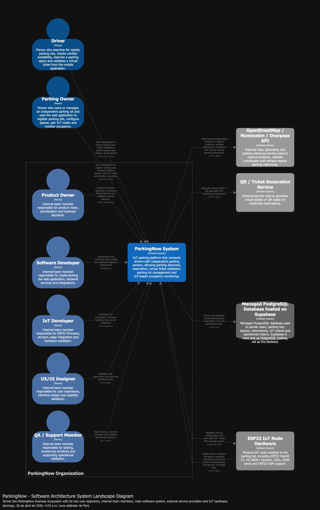
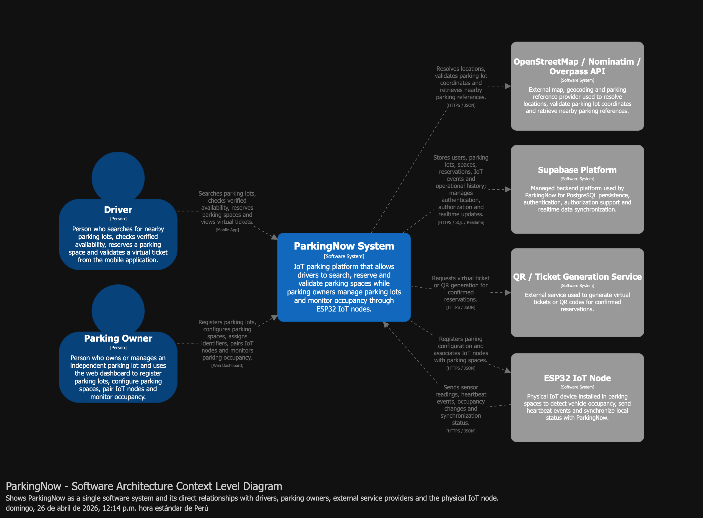
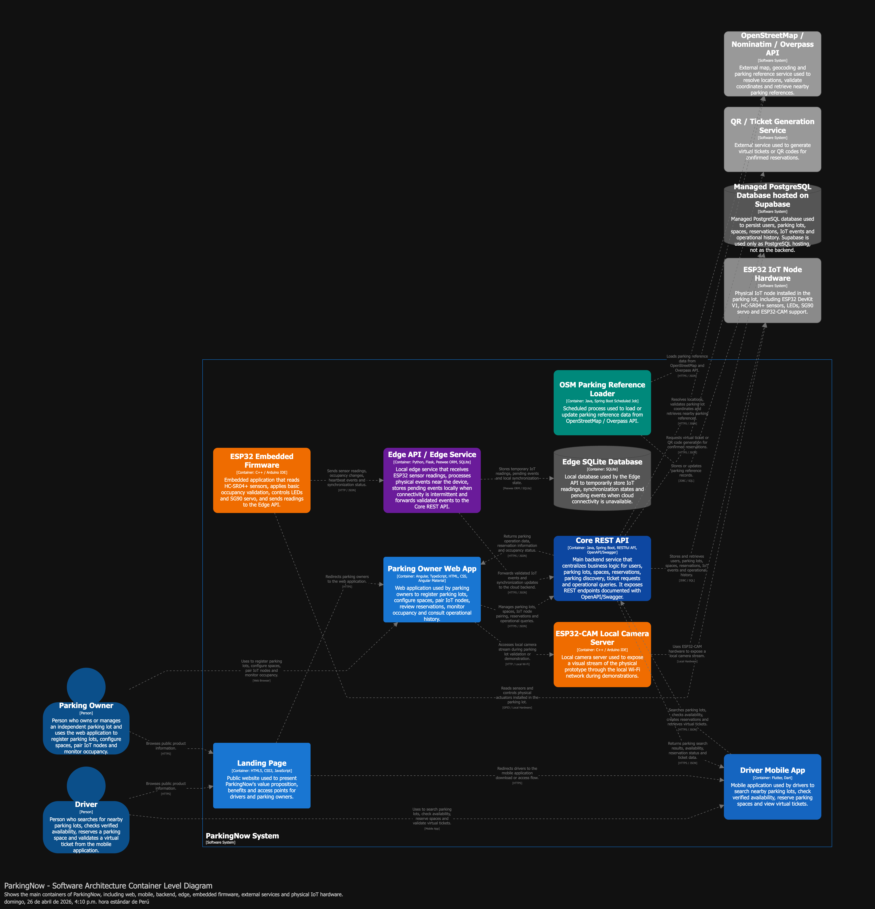
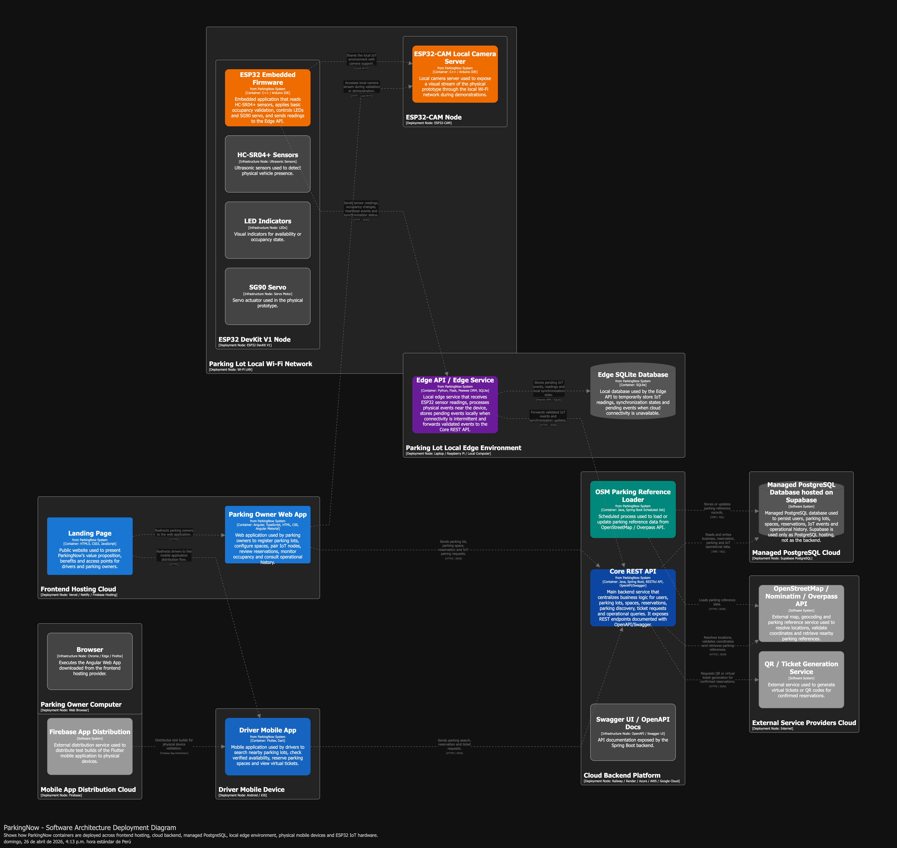

## 4.1.3. Software Architecture

En esta sección se presenta la arquitectura de software propuesta para **ParkingNow**, tomando como base las decisiones obtenidas en el diseño estratégico del dominio. Después de identificar los bounded contexts, sus responsabilidades, sus relaciones y sus patrones de integración mediante Domain-Driven Design, el siguiente paso consiste en representar cómo estas decisiones se traducen en una arquitectura técnica concreta para el sistema.

Para ello, se utiliza el **C4 Model**, un enfoque de documentación arquitectónica que permite describir el sistema desde distintos niveles de abstracción. Este modelo facilita explicar la arquitectura de manera progresiva, empezando por una vista general del ecosistema, continuando con la frontera del sistema, luego con sus contenedores principales y finalmente con la infraestructura donde serán desplegados. De esta forma, el diseño arquitectónico de ParkingNow puede ser comprendido tanto desde una perspectiva de negocio como desde una perspectiva técnica.

La arquitectura de ParkingNow se plantea inicialmente como un **monolito modular**, organizado internamente de acuerdo con los bounded contexts definidos en las secciones anteriores. Esta decisión permite mantener una separación clara de responsabilidades sin introducir, en esta etapa del proyecto, la complejidad operacional de una arquitectura basada en microservicios. Por ello, los contextos como **Reservation**, **IoT Monitoring**, **Parking Management**, **Parking Discovery**, **Operational Notification** e **Identity & Access Management** no se interpretan como servicios independientes, sino como módulos internos alineados con el dominio dentro de una misma solución backend.

Esta decisión resulta adecuada para el alcance del MVP, ya que permite reducir la complejidad de despliegue, simplificar la integración entre módulos, facilitar las pruebas y acelerar la entrega de valor. Al mismo tiempo, mantiene una estructura arquitectónica preparada para una posible evolución futura, en caso alguno de los módulos requiera mayor autonomía, escalabilidad independiente o despliegue separado.

Desde el punto de vista tecnológico, ParkingNow se implementa con una **Landing Page** en **HTML5, CSS3 y JavaScript**; una **Parking Owner Web App** en **Angular, TypeScript, HTML, CSS y Angular Material** siguiendo Material Design; una **Driver Mobile App** en **Flutter y Dart**; un **Core REST API** en **Java, Spring Boot, RESTful API y documentación OpenAPI Specification mediante Swagger**; un **Edge API / Edge Service** en **Python, Flask, Peewee ORM y SQLite**; firmware **ESP32** y servidor local **ESP32-CAM** en **C++ / Arduino IDE**; y la plataforma administrada **Supabase** para **PostgreSQL, Supabase Auth y Supabase Realtime**. Esta arquitectura separa aplicaciones cliente, servicios backend, capa edge, persistencia cloud, servicios externos y hardware IoT dentro de las vistas C4.

Asimismo, la arquitectura contempla integraciones con sistemas externos necesarios para completar las capacidades del producto. Entre ellos se consideran servicios de mapas y geocodificación como **OpenStreetMap / Nominatim / Overpass API**, servicios de autenticación, generación de tickets virtuales o QR, y servicios de sincronización en tiempo real. Estas integraciones se mantienen alineadas con el Context Map definido previamente, donde se estableció el uso de patrones como **Customer/Supplier**, **Open Host Service** y **Anti-Corruption Layer** para proteger el modelo de dominio frente a dependencias externas.

Para documentar esta arquitectura, se elaboran cuatro vistas principales siguiendo el enfoque C4. En primer lugar, el **System Landscape Diagram** muestra el ecosistema general donde participa ParkingNow junto con sus usuarios y sistemas relacionados. En segundo lugar, el **System Context Diagram** delimita la frontera de ParkingNow como sistema de software y muestra sus relaciones directas con actores y servicios externos. En tercer lugar, el **Container Diagram** describe las aplicaciones, APIs, bases de datos y componentes ejecutables que conforman la solución. Finalmente, el **Deployment Diagram** representa cómo estos contenedores se despliegan en infraestructura concreta, considerando servicios como Vercel, Railway, Supabase y el entorno físico donde opera el dispositivo ESP32.

Los diagramas serán desarrollados utilizando **Structurizr DSL**, lo cual permite representar la arquitectura como código y mantener consistencia entre las distintas vistas del modelo. Esta elección facilita la trazabilidad de las decisiones arquitectónicas, mejora la mantenibilidad de los diagramas y permite documentar la solución de forma estructurada para el informe final.

En conjunto, esta sección permite pasar del diseño estratégico del dominio hacia una propuesta técnica concreta, mostrando cómo ParkingNow se organiza, se comunica, se despliega y se integra con los servicios necesarios para ofrecer una experiencia confiable de búsqueda, reserva, monitoreo y administración de espacios de estacionamiento.

### 4.1.3.1. Software Architecture System Landscape Diagram

El **Software Architecture System Landscape Diagram** presenta la vista más general del ecosistema de software de **ParkingNow**. Esta vista permite identificar, desde un nivel panorámico, a los actores humanos que participan en el negocio, el sistema principal desarrollado por el equipo y los sistemas externos que intervienen para completar las capacidades de la solución.

A diferencia de los diagramas posteriores del modelo C4, en esta vista no se detallan todavía los contenedores internos, aplicaciones, APIs, bases de datos ni módulos del sistema. ParkingNow se representa como un único sistema de software dentro de su ecosistema empresarial. De esta manera, el diagrama permite comprender cómo el producto se relaciona con los usuarios finales, los dueños de estacionamientos, los servicios externos de mapas, la plataforma backend administrada y el entorno físico donde opera el nodo IoT.

Para ParkingNow, el ecosistema se organiza en tres grupos principales. El primero corresponde al **ParkingNow Business Ecosystem**, donde se encuentran los actores principales del negocio: el **Driver** y el **Parking Owner**, junto con el sistema principal **ParkingNow System**. El segundo grupo corresponde a los **External Service Providers**, que agrupa los servicios externos utilizados por la plataforma, como **OpenStreetMap / Nominatim / Overpass API**, **Supabase Platform** y **QR / Ticket Generation Service**. Finalmente, el tercer grupo corresponde al **Parking Lot Edge Environment**, donde se ubica el **ESP32 IoT Node**, encargado de detectar la ocupación física de los espacios de estacionamiento.

**Figura 45**  
*Software Architecture System Landscape Diagram*

*Nota.* Elaboración propia (2026) usando Structurizr DSL.

Según la Figura 45, el **Driver** representa al conductor urbano que utiliza ParkingNow para buscar estacionamientos cercanos, consultar disponibilidad verificada, reservar un espacio y visualizar su ticket virtual desde la aplicación móvil. Este actor se relaciona directamente con **ParkingNow System**, ya que todas sus interacciones principales ocurren dentro de la plataforma.

El **Parking Owner** representa al dueño o encargado de un estacionamiento independiente. Este actor utiliza ParkingNow para registrar su estacionamiento, configurar espacios, asociar nodos IoT y monitorear el estado de ocupación de sus espacios. Además, se relaciona con el **ESP32 IoT Node** porque dicho dispositivo forma parte del entorno físico del estacionamiento y debe ser instalado u operado dentro de sus espacios.

**ParkingNow System** es el sistema principal de la solución. Su función es conectar a conductores con estacionamientos independientes, permitiendo búsqueda, reserva, validación de tickets virtuales, monitoreo IoT de ocupación y actualización operativa del estado de los espacios. En esta vista, ParkingNow se muestra como una sola unidad de software, sin exponer todavía su arquitectura interna.

El sistema se integra con **OpenStreetMap / Nominatim / Overpass API** para resolver ubicaciones, validar coordenadas de estacionamientos y recuperar referencias de estacionamientos cercanos. Esta integración permite que la plataforma pueda ofrecer una experiencia de búsqueda basada en ubicación y referencias geográficas.

Asimismo, ParkingNow utiliza **Supabase Platform** como plataforma administrada para persistencia de datos, autenticación, autorización y sincronización en tiempo real. Esta plataforma soporta el almacenamiento de usuarios, estacionamientos, espacios, reservas, eventos IoT e historial operativo.

El servicio **QR / Ticket Generation Service** participa como proveedor externo para generar tickets virtuales o códigos QR asociados a reservas confirmadas. De esta manera, ParkingNow puede emitir un comprobante digital que luego será utilizado por el conductor durante el proceso de llegada y validación.

Finalmente, el **ESP32 IoT Node** representa el dispositivo físico instalado en los espacios de estacionamiento. Este nodo envía lecturas del sensor, eventos de ocupación, señales de heartbeat y estados de sincronización hacia ParkingNow. A su vez, ParkingNow registra la configuración de emparejamiento y asocia el nodo IoT con los espacios correspondientes.

Las principales interacciones representadas en el diagrama son las siguientes:

| Elemento origen | Elemento destino | Interacción |
|---|---|---|
| Driver | ParkingNow System | Busca estacionamientos, consulta disponibilidad, reserva espacios y visualiza tickets virtuales. |
| Parking Owner | ParkingNow System | Registra estacionamientos, configura espacios, empareja nodos IoT y monitorea ocupación. |
| Parking Owner | ESP32 IoT Node | Instala y opera los nodos IoT dentro de los espacios físicos del estacionamiento. |
| ParkingNow System | OpenStreetMap / Nominatim / Overpass API | Resuelve ubicaciones, valida coordenadas y recupera referencias geográficas cercanas. |
| ParkingNow System | Supabase Platform | Almacena datos, gestiona autenticación, autorización y sincronización en tiempo real. |
| ParkingNow System | QR / Ticket Generation Service | Solicita la generación de tickets virtuales o códigos QR para reservas confirmadas. |
| ParkingNow System | ESP32 IoT Node | Registra la configuración de emparejamiento y asocia el nodo IoT con los espacios. |
| ESP32 IoT Node | ParkingNow System | Envía lecturas de sensores, eventos de ocupación, heartbeats y estados de sincronización. |

En conclusión, el **System Landscape Diagram** permite visualizar el ecosistema completo donde opera ParkingNow sin entrar todavía en detalles internos de implementación. Esta vista confirma que la solución se apoya en dos actores humanos principales, un sistema central de software, servicios externos administrados y un componente físico IoT ubicado en el estacionamiento. Con ello, se establece la base para el siguiente nivel del modelo C4, donde se delimitará con mayor precisión la frontera del sistema mediante el **Software Architecture Context Level Diagram**.

### 4.1.3.2. Software Architecture Context Level Diagram

El **Software Architecture Context Level Diagram** permite representar la frontera directa de **ParkingNow System** como sistema de software. A diferencia del System Landscape Diagram, que muestra el ecosistema general, esta vista se enfoca específicamente en ParkingNow como sistema central y en sus relaciones directas con los usuarios y sistemas externos que necesita para operar.

En este nivel del modelo C4, ParkingNow se representa como una sola unidad de software. Por ello, no se muestran todavía sus aplicaciones internas, APIs, base de datos, módulos del backend ni bounded contexts. Los bounded contexts identificados previamente mediante Domain-Driven Design serán considerados en los niveles internos de arquitectura, especialmente en el Container Level y, de ser necesario, en el Component Level. En esta vista, el objetivo principal es delimitar qué actores interactúan con ParkingNow y qué sistemas externos se comunican directamente con él.

Para el caso de ParkingNow, se consideran dos actores humanos principales. El primero es el **Driver**, quien utiliza la aplicación móvil para buscar estacionamientos cercanos, consultar disponibilidad verificada, reservar espacios y visualizar tickets virtuales. El segundo es el **Parking Owner**, quien representa al dueño o encargado de un estacionamiento independiente y utiliza el panel web para registrar estacionamientos, configurar espacios, asociar nodos IoT y monitorear la ocupación.

Asimismo, el sistema mantiene relaciones directas con servicios externos. **OpenStreetMap / Nominatim / Overpass API** permite resolver ubicaciones, validar coordenadas y recuperar referencias geográficas cercanas. **Supabase Platform** se utiliza como plataforma administrada para persistencia, autenticación, autorización y sincronización en tiempo real. **QR / Ticket Generation Service** permite generar tickets virtuales o códigos QR para reservas confirmadas. Finalmente, el **ESP32 IoT Node** representa el dispositivo físico instalado en el estacionamiento para enviar lecturas de sensores, eventos de ocupación, señales de heartbeat y estados de sincronización.

**Figura 46**  
*Software Architecture Context Level Diagram*

*Nota.* Elaboración propia (2026) usando Structurizr DSL.

Según la Figura 46, **ParkingNow System** se ubica como el sistema central de la solución. El **Driver** interactúa con ParkingNow desde la aplicación móvil para buscar estacionamientos, consultar disponibilidad verificada, reservar espacios y visualizar tickets virtuales. Esta interacción concentra las funcionalidades orientadas al conductor y permite que el sistema entregue información confiable antes de iniciar una reserva.

Por otro lado, el **Parking Owner** interactúa con ParkingNow desde el panel web. Este actor registra estacionamientos, configura espacios, asigna identificadores, empareja nodos IoT y monitorea la ocupación de sus espacios. De esta forma, el sistema permite que estacionamientos independientes digitalicen su disponibilidad y mejoren la gestión operativa de sus espacios.

La relación entre **ParkingNow System** y **OpenStreetMap / Nominatim / Overpass API** permite resolver ubicaciones, validar coordenadas de estacionamientos y recuperar referencias cercanas. Esta integración es necesaria para que el sistema pueda ofrecer búsqueda geolocalizada y mostrar estacionamientos relacionados con el destino del conductor.

La relación con **Supabase Platform** concentra servicios administrados de persistencia, autenticación, autorización y sincronización en tiempo real. ParkingNow utiliza esta plataforma para almacenar usuarios, estacionamientos, espacios, reservas, eventos IoT e historial operativo, además de propagar actualizaciones hacia las interfaces correspondientes.

La integración con **QR / Ticket Generation Service** permite generar tickets virtuales o códigos QR para reservas confirmadas. Estos tickets forman parte del proceso de validación de llegada del conductor y permiten vincular una reserva digital con el acceso físico al estacionamiento.

Finalmente, el **ESP32 IoT Node** mantiene una relación bidireccional con ParkingNow. Por un lado, ParkingNow registra la configuración de emparejamiento y asocia el nodo con espacios específicos. Por otro lado, el nodo ESP32 envía lecturas de sensores, eventos de ocupación, heartbeats y estados de sincronización. Esta interacción permite que la disponibilidad mostrada por el sistema tenga respaldo físico mediante monitoreo IoT.

Las principales interacciones representadas en el diagrama son las siguientes:

| Elemento origen | Elemento destino | Tecnología / Canal | Interacción |
|---|---|---|---|
| Driver | ParkingNow System | Mobile App | Busca estacionamientos, consulta disponibilidad verificada, reserva espacios y visualiza tickets virtuales. |
| Parking Owner | ParkingNow System | Web Dashboard | Registra estacionamientos, configura espacios, asigna identificadores, empareja nodos IoT y monitorea ocupación. |
| ParkingNow System | OpenStreetMap / Nominatim / Overpass API | HTTPS / JSON | Resuelve ubicaciones, valida coordenadas y recupera referencias geográficas cercanas. |
| ParkingNow System | Supabase Platform | HTTPS / WebSocket | Almacena datos, gestiona autenticación, autorización y sincronización en tiempo real. |
| ParkingNow System | QR / Ticket Generation Service | HTTPS / JSON | Solicita la generación de tickets virtuales o códigos QR para reservas confirmadas. |
| ParkingNow System | ESP32 IoT Node | HTTPS / JSON | Registra la configuración de emparejamiento y asocia nodos IoT con espacios de estacionamiento. |
| ESP32 IoT Node | ParkingNow System | HTTPS / JSON | Envía lecturas de sensores, eventos de ocupación, heartbeats y estados de sincronización. |

En conclusión, el **Software Architecture Context Level Diagram** delimita claramente el alcance de ParkingNow como sistema de software. Esta vista permite diferenciar las responsabilidades propias del sistema frente a las responsabilidades de los usuarios y servicios externos. Además, establece la base para el siguiente nivel del modelo C4, donde se abrirá la caja de ParkingNow para representar sus aplicaciones, APIs, base de datos y componentes de infraestructura mediante el **Container Level Diagram**.

### 4.1.3.3. Software Architecture Container Level Diagrams

El **Software Architecture Container Level Diagram** permite representar la estructura interna de alto nivel de **ParkingNow System**. A diferencia del Context Level Diagram, donde ParkingNow se muestra como una única caja de software, en este nivel se abre el sistema para identificar las aplicaciones, servicios, APIs, procesos batch, firmware embebido y plataformas externas que participan en la solución.

En el modelo C4, el término **container** no se refiere necesariamente a un contenedor Docker, sino a una unidad de software ejecutable o desplegable de alto nivel. Por ello, en este diagrama se representan aplicaciones frontend, aplicaciones móviles, APIs backend, procesos de carga de datos, firmware embebido, plataformas administradas y hardware físico relacionado con el sistema.

Para ParkingNow, el Container Level Diagram resulta especialmente importante porque la solución no está compuesta únicamente por una aplicación web o móvil, sino por un ecosistema IoT distribuido. La arquitectura integra una aplicación móvil para conductores, una aplicación web para dueños de estacionamiento, una landing page pública, APIs backend, carga de referencias geográficas, sincronización en tiempo real mediante Supabase y software embebido ejecutado sobre un nodo ESP32.

**Figura 47**  
*Software Architecture Container Level Diagram*

*Nota.* Elaboración propia (2026) usando Structurizr DSL.

Según la Figura 47, **ParkingNow System** se compone de ocho contenedores principales: **Landing Page**, **Parking Owner Web App**, **Driver Mobile App**, **Core REST API**, **Edge API**, **OSM Parking Reference Loader**, **ESP32 Embedded + Edge Firmware** y **ESP32-CAM Local Camera Server**. Además, el sistema se integra con servicios externos como **OpenStreetMap / Nominatim / Overpass API**, **QR / Ticket Generation Service**, **Supabase Platform** y el hardware físico **ESP32 IoT Node Hardware**.

La **Landing Page** corresponde al sitio público de ParkingNow. Está desarrollada con **HTML5, CSS3 y JavaScript**. Su finalidad es presentar la propuesta de valor del producto, explicar los beneficios para conductores y dueños de estacionamiento, y redirigir a cada segmento hacia la experiencia correspondiente. En este nivel, la Landing Page se considera un contenedor independiente porque puede desplegarse y evolucionar de forma separada respecto de las aplicaciones principales.

La **Parking Owner Web App** corresponde al panel web utilizado por el dueño de estacionamiento. Está desarrollada con **Angular, TypeScript, HTML, CSS y Angular Material**. Este contenedor permite registrar estacionamientos, configurar espacios, asociar nodos IoT, revisar reservas, monitorear ocupación y consultar historial operativo. La Web App consume el Core REST API mediante HTTPS/JSON y también se suscribe a Supabase Realtime para recibir cambios de estado en tiempo real.

La **Driver Mobile App** corresponde a la aplicación móvil utilizada por el conductor. Está desarrollada con **Flutter, Dart y Supabase Flutter**. Este contenedor permite buscar estacionamientos cercanos, consultar disponibilidad verificada, seleccionar un espacio, registrar una reserva y visualizar el ticket virtual asociado. La Mobile App consume el Core REST API para operaciones de negocio y utiliza Supabase Realtime para recibir actualizaciones sobre disponibilidad, reservas y estado del ticket.

El **Core REST API** representa el backend principal de negocio. Está desarrollado con **Java, Spring Boot, RESTful API y documentación OpenAPI Specification mediante Swagger**. Este contenedor gestiona las operaciones relacionadas con usuarios, estacionamientos, espacios, reservas, búsqueda de estacionamientos, tickets virtuales y consultas operativas. También se comunica con OpenStreetMap / Nominatim / Overpass API para resolver ubicaciones y referencias geográficas, y con el QR / Ticket Generation Service para generar tickets virtuales o códigos QR asociados a reservas confirmadas.

El **Edge API** representa el backend especializado en la recepción de eventos físicos provenientes del nodo ESP32. Está desarrollado con **Python, Flask, Peewee ORM y SQLite**. Este contenedor recibe lecturas de sensores, eventos de ocupación, eventos de liberación, heartbeats y estados de sincronización. Además, valida la API Key del dispositivo, procesa eventos físicos cerca del dispositivo, conserva eventos temporalmente en SQLite cuando corresponde y reenvía eventos validados al Core REST API.

El **OSM Parking Reference Loader** corresponde a un proceso batch desarrollado con **Java y Spring Boot**. Su responsabilidad es cargar referencias iniciales de estacionamientos desde OpenStreetMap / Overpass API hacia Supabase. Este contenedor no forma parte del flujo transaccional principal, sino que permite preparar datos de referencia para el proceso de descubrimiento de estacionamientos cercanos. De esta manera, la plataforma puede mostrar estacionamientos afiliados y referencias externas, diferenciando claramente cuáles cuentan con disponibilidad verificada.

El **ESP32 Embedded + Edge Firmware** corresponde al software embebido ejecutado sobre el nodo ESP32. Está desarrollado en **C++ mediante Arduino IDE**. Este firmware lee los sensores ultrasónicos HC-SR04+, aplica lógica local de debounce, determina cambios de ocupación, controla LEDs, mueve el servo SG90 y reporta eventos relevantes al Edge API mediante HTTP POST con payload JSON y API Key. Este contenedor representa la lógica edge del sistema, ya que procesa información localmente antes de enviarla al backend.

El **ESP32-CAM Local Camera Server** corresponde a un servidor local de cámara ejecutado sobre la ESP32-CAM. Está desarrollado en **C++ mediante Arduino IDE** y permite acceder a una vista local del entorno físico durante la demostración. Este contenedor se comunica con el hardware de cámara y puede ser consultado desde el navegador cuando el usuario se encuentra conectado a la misma red Wi-Fi local. Su función es brindar soporte visual al prototipo físico, sin reemplazar el flujo principal de detección por sensores.

La **Supabase Platform** se modela como una plataforma externa administrada. Incluye **PostgreSQL**, **Supabase Auth** y **Supabase Realtime**. ParkingNow utiliza Supabase para persistir usuarios, estacionamientos, espacios, reservas, eventos IoT, dispositivos, historial operativo y estados de sincronización. Asimismo, Supabase permite autenticar usuarios y propagar cambios en tiempo real hacia la Web App y la Mobile App.

El **ESP32 IoT Node Hardware** se representa fuera del límite de ParkingNow System porque corresponde al hardware físico instalado en el estacionamiento. Incluye el **ESP32 DevKit V1**, sensores ultrasónicos **HC-SR04+**, LEDs, servo **SG90** y **ESP32-CAM**. Aunque el firmware forma parte del software de ParkingNow, el hardware se modela como elemento externo porque representa el dispositivo físico donde dicho software se ejecuta.

Las responsabilidades principales de cada contenedor se resumen en la siguiente tabla:

| Contenedor | Tecnología | Responsabilidad principal |
|---|---|---|
| Landing Page | HTML, CSS, JavaScript | Presentar el producto y redirigir a los usuarios hacia la experiencia correspondiente. |
| Parking Owner Web App | Angular, TypeScript, HTML, CSS y Angular Material | Permitir al dueño registrar estacionamientos, configurar espacios, emparejar nodos IoT y monitorear ocupación. |
| Driver Mobile App | Flutter, Dart, Supabase Flutter | Permitir al conductor buscar estacionamientos, consultar disponibilidad, reservar espacios y visualizar tickets virtuales. |
| Core REST API | Java, Spring Boot, TypeScript | Gestionar usuarios, estacionamientos, espacios, reservas, discovery, tickets virtuales y consultas operativas. |
| Edge API / Edge Service | Python, Flask, Peewee ORM y SQLite | Recibir eventos del ESP32, validar dispositivos, procesar eventos físicos cerca del dispositivo, conservar eventos temporalmente en SQLite y reenviar eventos validados al Core REST API. |
| OSM Parking Reference Loader | Java/Spring Boot, TypeScript | Cargar referencias iniciales de estacionamientos desde OpenStreetMap / Overpass API. |
| ESP32 Embedded + Edge Firmware | C++ / Arduino IDE | Leer sensores, procesar ocupación localmente, controlar actuadores y reportar eventos al Edge API. |
| ESP32-CAM Local Camera Server | C++ / Arduino IDE | Proporcionar vista local de cámara para soporte visual del prototipo físico. |
| Supabase Platform | PostgreSQL, Supabase Auth, Supabase Realtime | Persistir datos, gestionar autenticación y propagar cambios en tiempo real. |
| ESP32 IoT Node Hardware | ESP32 DevKit V1, HC-SR04+, LEDs, SG90, ESP32-CAM | Ejecutar el firmware y capturar eventos físicos del estacionamiento. |

La comunicación entre contenedores se organiza en torno a tres flujos principales. El primer flujo corresponde a la interacción de usuarios. El **Driver** utiliza la **Driver Mobile App** para buscar estacionamientos, consultar disponibilidad y reservar espacios. El **Parking Owner** utiliza la **Parking Owner Web App** para registrar su estacionamiento, configurar espacios, asociar nodos IoT y monitorear la operación.

El segundo flujo corresponde al backend de negocio. La Web App y la Mobile App consumen el **Core REST API** mediante **HTTPS/JSON**. Este API centraliza las operaciones de negocio y se comunica con **Supabase Platform** para persistencia, autenticación y sincronización. También se integra con **OpenStreetMap / Nominatim / Overpass API** para operaciones geográficas y con **QR / Ticket Generation Service** para generar tickets virtuales o códigos QR.

El tercer flujo corresponde al procesamiento IoT. El **ESP32 Embedded + Edge Firmware** lee los sensores HC-SR04+, procesa localmente el estado de ocupación y envía eventos al **Edge API** mediante **HTTP POST/JSON** con una **API Key**. El Edge API valida el dispositivo, procesa el evento cerca del dispositivo, conserva eventos temporalmente en SQLite cuando corresponde y reenvía eventos validados al Core REST API. Luego, **Supabase Realtime** propaga el cambio hacia la Web App y la Mobile App, permitiendo que el estado físico del estacionamiento se refleje digitalmente en tiempo real.

Las principales comunicaciones representadas en el diagrama son las siguientes:

| Origen | Destino | Tecnología / Protocolo | Propósito |
|---|---|---|---|
| Driver | Driver Mobile App | Mobile App | Buscar estacionamientos, reservar espacios y visualizar tickets virtuales. |
| Parking Owner | Parking Owner Web App | Web Browser | Registrar estacionamientos, configurar espacios y monitorear ocupación. |
| Landing Page | Parking Owner Web App | HTTPS | Redirigir al dueño hacia el panel web. |
| Driver Mobile App | Core REST API | HTTPS / JSON | Buscar estacionamientos, consultar disponibilidad, reservar y obtener tickets. |
| Parking Owner Web App | Core REST API | HTTPS / JSON | Gestionar estacionamientos, espacios, reservas, nodos IoT e historial operativo. |
| Core REST API | Supabase Platform | Spring Data JPA / JDBC / PostgreSQL Driver | Leer y escribir datos principales del negocio. |
| Edge API | Core REST API | HTTPS / JSON | Reenviar eventos IoT validados para su procesamiento de negocio central. |
| Parking Owner Web App | Supabase Platform | Supabase Auth / Realtime WebSocket | Autenticar sesión y recibir actualizaciones en tiempo real. |
| Driver Mobile App | Supabase Platform | Supabase Flutter / WebSocket | Autenticar sesión y recibir cambios de disponibilidad, reserva y ticket. |
| Supabase Platform | Parking Owner Web App | Supabase Realtime / WebSocket | Publicar cambios operativos, reservas, espacios y eventos IoT. |
| Supabase Platform | Driver Mobile App | Supabase Realtime / WebSocket | Publicar cambios de disponibilidad, reservas y tickets. |
| Core REST API | OpenStreetMap / Nominatim / Overpass API | HTTPS / JSON | Resolver ubicaciones, validar coordenadas y obtener referencias geográficas. |
| OSM Parking Reference Loader | OpenStreetMap / Nominatim / Overpass API | HTTPS / JSON | Cargar referencias iniciales de estacionamientos. |
| OSM Parking Reference Loader | Supabase Platform | Spring Data JPA / JDBC / PostgreSQL Driver | Guardar referencias externas normalizadas. |
| Core REST API | QR / Ticket Generation Service | HTTPS / JSON | Solicitar generación de ticket virtual o código QR. |
| ESP32 Embedded + Edge Firmware | ESP32 IoT Node Hardware | GPIO / PWM / Camera | Leer sensores y controlar LEDs, servo y cámara. |
| ESP32-CAM Local Camera Server | ESP32 IoT Node Hardware | CameraWebServer / Local Wi-Fi | Capturar vista local desde la ESP32-CAM. |
| Parking Owner | ESP32-CAM Local Camera Server | Browser / Local Wi-Fi | Visualizar cámara local durante la demostración física. |
| ESP32 Embedded + Edge Firmware | Edge API | HTTP POST / JSON + x-api-key | Enviar lecturas, ocupación, heartbeats y estado de sincronización. |
| Edge API | ESP32 Embedded + Edge Firmware | HTTP / JSON | Retornar resultado de procesamiento y estado de validación. |

Una decisión relevante de esta arquitectura es separar el **Core REST API** y el **Edge API** por responsabilidad. Esta separación no implica adoptar una arquitectura de microservicios compleja, sino diferenciar claramente el tráfico de negocio del tráfico proveniente del hardware físico. El Core REST API atiende operaciones humanas y de negocio; el Edge API atiende eventos físicos, heartbeats y sincronización del nodo ESP32. Esta división reduce acoplamiento, facilita el control de seguridad mediante API Key y permite aislar el flujo crítico de monitoreo IoT.

Otra decisión importante es colocar el **firmware embebido y edge** dentro del límite de ParkingNow System, mientras que el **hardware ESP32** se mantiene fuera como elemento físico externo. Esto permite diferenciar correctamente entre el software desarrollado por el equipo y el dispositivo sobre el cual dicho software se ejecuta. El firmware forma parte de la solución porque contiene lógica de lectura, filtrado, decisión y comunicación; el hardware, en cambio, representa el entorno físico de ejecución.

También se incorpora el **OSM Parking Reference Loader** como contenedor independiente porque la carga de referencias externas no forma parte del flujo transaccional normal de reservas. Su función es preparar datos geográficos iniciales para enriquecer la experiencia de búsqueda del conductor. Esta separación evita sobrecargar el Core REST API con tareas batch de importación.

Finalmente, el uso de **Supabase Realtime** permite evitar la implementación manual de WebSockets. Cuando el Core REST API actualiza el estado de un espacio en Supabase PostgreSQL, el cambio se propaga automáticamente hacia la Web App y la Mobile App. Esta decisión reduce complejidad técnica y permite cumplir el objetivo principal del sistema: reflejar digitalmente, en tiempo real, la ocupación física detectada por el nodo IoT.

En conclusión, el **Software Architecture Container Level Diagram** muestra que ParkingNow se construye como una solución IoT distribuida compuesta por aplicaciones frontend, servicios backend, procesamiento batch, persistencia administrada, sincronización en tiempo real y firmware embebido. Esta arquitectura permite conectar el mundo físico del estacionamiento con la experiencia digital del conductor y del dueño, manteniendo separación de responsabilidades y trazabilidad entre los eventos físicos detectados por el ESP32 y los cambios visibles en las interfaces del sistema.

### 4.1.3.4. Software Architecture Deployment Diagrams

El **Software Architecture Deployment Diagram** representa cómo los contenedores definidos en el nivel anterior se distribuyen físicamente en dispositivos, plataformas cloud, servicios administrados y entorno IoT local. A diferencia del **Container Level Diagram**, donde se explican las unidades de software de alto nivel, este diagrama muestra **dónde se ejecuta cada parte de ParkingNow** y qué infraestructura soporta su funcionamiento.

En el caso de **ParkingNow**, el despliegue combina aplicaciones cliente, servicios backend, plataformas administradas y hardware físico. La aplicación móvil se ejecuta en el dispositivo del conductor; la aplicación web y la landing page se entregan desde **Vercel** hacia el navegador del dueño de estacionamiento; las APIs backend se despliegan en **Railway**; la persistencia, autenticación y sincronización en tiempo real se apoyan en **Supabase**; y el nodo físico **ESP32** opera dentro de la red Wi-Fi local del estacionamiento.

Este diagrama permite evidenciar la naturaleza distribuida de ParkingNow como solución IoT: el evento físico ocurre en la maqueta o estacionamiento real, es procesado por el firmware embebido del ESP32, se envía hacia el backend en la nube, se persiste en Supabase y finalmente se propaga hacia la Web App y la Mobile App mediante sincronización en tiempo real.

**Figura 48**  
*Software Architecture Deployment Diagram*

*Nota.* Elaboración propia (2026) usando Structurizr DSL.

Según la Figura 48, el despliegue de ParkingNow se organiza en nueve nodos principales: **Driver Mobile Device**, **Parking Owner Computer**, **Vercel Cloud**, **Cloud Backend Platform (Railway u otra plataforma compatible)**, **Edge Environment / Local Edge Device**, **Supabase Cloud**, **OpenStreetMap Cloud**, **QR / Ticket Provider Cloud** y **Parking Lot Local Wi-Fi Network**. Cada nodo representa un entorno de ejecución o infraestructura donde se aloja una parte del sistema o de sus dependencias externas.

El nodo **Driver Mobile Device** representa el dispositivo móvil personal del conductor, ya sea Android o iOS. En este entorno se ejecuta la **Driver Mobile App**, desarrollada con **Flutter** y **Dart**. Desde este dispositivo, el conductor puede buscar estacionamientos cercanos, consultar disponibilidad verificada, realizar reservas y visualizar tickets virtuales. La aplicación móvil se comunica con el **Core REST API** mediante HTTPS/JSON y también mantiene suscripciones con **Supabase Realtime** para recibir cambios de disponibilidad o estado de reserva.

El nodo **Parking Owner Computer** representa la laptop o computadora de escritorio utilizada por el dueño de estacionamiento. En este nodo no se despliega directamente la Web App, sino que se ejecuta un **Web Browser**, como Chrome, Edge, Safari o Firefox. Desde el navegador, el dueño accede a la **Parking Owner Web App** servida desde Vercel y, durante la demostración física, puede visualizar el stream local del **ESP32-CAM Local Camera Server** si se encuentra conectado a la misma red Wi-Fi local del estacionamiento.

El nodo **Vercel Cloud** representa la plataforma PaaS utilizada para alojar y entregar los activos frontend de ParkingNow. Dentro de este nodo se encuentra **Vercel Edge Network**, donde se despliegan la **Landing Page** y la **Parking Owner Web App**. La Landing Page permite presentar la propuesta de valor del producto y redirigir a cada usuario hacia su experiencia correspondiente. La Web App permite que el dueño de estacionamiento registre su local, configure espacios, asocie nodos IoT y monitoree la operación.

El nodo **Cloud Backend Platform (Railway u otra plataforma cloud compatible)** representa la plataforma utilizada para alojar los servicios backend centrales. En este entorno se despliegan dos unidades principales: **Core REST API Service** y **OSM Loader Job**. El **Core REST API** atiende las operaciones de negocio asociadas a usuarios, estacionamientos, espacios, reservas, tickets virtuales y consultas operativas. El **OSM Loader Job** se utiliza para cargar referencias iniciales de estacionamientos desde OpenStreetMap / Overpass hacia Supabase.

El nodo **Edge Environment / Local Edge Device** representa el entorno local donde se ejecuta el **Edge API / Edge Service** desarrollado con **Python, Flask, Peewee ORM y SQLite**. Este servicio recibe eventos físicos del ESP32, valida dispositivos, conserva eventos temporalmente en SQLite cuando corresponde y reenvía eventos validados hacia el Core REST API.

El nodo **Supabase Cloud** representa la plataforma BaaS utilizada para persistencia, autenticación y sincronización. Dentro de este nodo se consideran tres elementos principales: **Supabase PostgreSQL Database**, **Supabase Auth** y **Supabase Realtime**. PostgreSQL almacena usuarios, estacionamientos, espacios, reservas, eventos IoT, estado de dispositivos e historial operativo. Supabase Auth gestiona sesiones e identidad de conductores y dueños de estacionamiento. Supabase Realtime publica cambios hacia la Web App y la Mobile App mediante WebSockets administrados.

El nodo **OpenStreetMap Cloud** representa la infraestructura externa de mapas, geocodificación y referencias geográficas. En este entorno se ejecuta el servicio **OpenStreetMap / Nominatim / Overpass API**, utilizado por ParkingNow para resolver ubicaciones, validar coordenadas de estacionamientos y cargar referencias externas de estacionamientos cercanos.

El nodo **QR / Ticket Provider Cloud** representa el proveedor externo encargado de generar tickets virtuales o códigos QR para reservas confirmadas. ParkingNow solicita estos tickets desde el Core REST API cuando una reserva pasa a estado confirmado y debe contar con un mecanismo de validación para la llegada del conductor.

El nodo **Parking Lot Local Wi-Fi Network** representa el entorno físico de la maqueta o estacionamiento. Dentro de este entorno se encuentra el **Wi-Fi Router**, que proporciona conectividad local al nodo ESP32, y el **ESP32 IoT Node Hardware**, compuesto por **ESP32 DevKit V1**, sensores ultrasónicos **HC-SR04+**, LEDs, servo **SG90** y módulo **ESP32-CAM**. En este hardware se ejecutan dos contenedores de software: **ESP32 Embedded + Edge Firmware** y **ESP32-CAM Local Camera Server**.

El **ESP32 Embedded + Edge Firmware** se ejecuta directamente sobre el ESP32. Este firmware lee los sensores ultrasónicos, aplica lógica de debounce, determina si un espacio está libre u ocupado, controla LEDs y servo, y envía eventos hacia el Edge API mediante HTTP POST/JSON con una API Key. Por su parte, el **ESP32-CAM Local Camera Server** permite capturar y servir una vista local de cámara mediante la red Wi-Fi, útil para la demostración física del prototipo.

El mapeo de nodos de despliegue se resume en la siguiente tabla:

| Nodo de despliegue | Tecnología / Plataforma | Elementos desplegados | Responsabilidad |
|---|---|---|---|
| Driver Mobile Device | iOS / Android | Driver Mobile App | Ejecutar la aplicación móvil del conductor para búsqueda, reserva y ticket virtual. |
| Parking Owner Computer | Windows / macOS / Linux + Web Browser | Web Browser | Acceder a la Web App y visualizar, si corresponde, el stream local del ESP32-CAM. |
| Vercel Cloud | Vercel PaaS | Landing Page, Parking Owner Web App | Alojar y entregar los activos frontend de ParkingNow. |
| Cloud Backend Platform (Railway u otra) | PaaS compatible con Java/Spring Boot | Core REST API, OSM Parking Reference Loader | Ejecutar servicios backend centrales y proceso batch de carga geográfica. |
| Edge Environment / Local Edge Device | Python, Flask, Peewee ORM, SQLite | Edge API / Edge Service | Procesar telemetría IoT local y reenviar eventos validados al Core REST API. |
| Supabase Cloud | Supabase BaaS | PostgreSQL, Auth, Realtime | Persistir datos, autenticar usuarios y propagar cambios en tiempo real. |
| OpenStreetMap Cloud | External Cloud Service | OpenStreetMap / Nominatim / Overpass API | Resolver ubicaciones, validar coordenadas y proporcionar referencias externas. |
| QR / Ticket Provider Cloud | External Cloud Service | QR / Ticket Generation Service | Generar tickets virtuales o códigos QR para reservas confirmadas. |
| Parking Lot Local Wi-Fi Network | Wi-Fi LAN | ESP32 IoT Node Hardware, firmware, camera server, sensores, LEDs y servo | Ejecutar detección física de ocupación y comunicación local/cloud. |

La comunicación entre los nodos de despliegue se organiza en torno a los flujos principales del sistema. El **Driver Mobile Device** se comunica con el **Core REST API** desplegado en Railway mediante **HTTPS/JSON** para buscar estacionamientos, consultar disponibilidad, crear reservas y recuperar tickets. Además, se comunica con **Supabase Cloud** mediante **Supabase Flutter / WebSocket** para autenticación y recepción de actualizaciones en tiempo real.

El **Parking Owner Computer** descarga la **Parking Owner Web App** desde **Vercel Cloud** mediante HTTPS. Una vez cargada en el navegador, la aplicación se comunica con el **Core REST API** mediante HTTPS/JSON para gestionar estacionamientos, espacios, reservas y emparejamientos IoT. También mantiene suscripciones con Supabase Realtime para reflejar cambios de ocupación, reservas y eventos operativos sin recargar la página.

El **Core REST API** desplegado en Railway se comunica con **Supabase Cloud** para leer y escribir datos de negocio. También se integra con **OpenStreetMap / Nominatim / Overpass API** para resolver ubicaciones y referencias geográficas, y con **QR / Ticket Generation Service** para generar tickets virtuales asociados a reservas confirmadas.

El **Edge API**, desplegado en el **Edge Environment / Local Edge Device**, recibe eventos desde el **ESP32 Embedded + Edge Firmware** mediante **HTTP POST/JSON** con una **x-api-key**. Este mecanismo permite validar que los eventos provienen de un dispositivo reconocido. Luego, el Edge API procesa la telemetría, conserva eventos temporalmente en SQLite cuando corresponde y reenvía eventos validados al Core REST API.

El flujo IoT completo puede entenderse así: el sensor HC-SR04+ detecta una variación física de distancia; el firmware del ESP32 procesa la lectura localmente; si el cambio es válido, envía el evento al Edge API; el Edge API valida y reenvía el evento al Core REST API; el Core REST API actualiza Supabase PostgreSQL; y Supabase Realtime propaga el cambio hacia la Web App y la Mobile App. De esta forma, el estado físico del estacionamiento queda reflejado digitalmente en las interfaces del sistema.

Las principales comunicaciones del despliegue se resumen en la siguiente tabla:

| Origen | Destino | Protocolo / Canal | Propósito |
|---|---|---|---|
| Driver Mobile Device | Core REST API en Railway | HTTPS / JSON | Buscar estacionamientos, consultar disponibilidad, reservar y recuperar tickets. |
| Driver Mobile Device | Supabase Cloud | Supabase Flutter / WebSocket | Autenticación y recepción de cambios en tiempo real. |
| Parking Owner Computer | Vercel Cloud | HTTPS | Descargar Landing Page y Parking Owner Web App. |
| Parking Owner Web App | Core REST API en Railway | HTTPS / JSON | Gestionar estacionamientos, espacios, reservas, nodos IoT e historial operativo. |
| Parking Owner Web App | Supabase Cloud | Supabase Auth / Realtime WebSocket | Autenticación y actualizaciones operativas en tiempo real. |
| Core REST API en Railway | Supabase Cloud | Spring Data JPA / JDBC / PostgreSQL Driver | Leer y escribir datos principales del negocio. |
| Edge API en Edge Environment | Core REST API en plataforma cloud | HTTPS / JSON | Reenviar eventos IoT validados y telemetría procesada para su consolidación. |
| Core REST API en Railway | OpenStreetMap Cloud | HTTPS / JSON | Resolver ubicaciones, validar coordenadas y obtener referencias. |
| OSM Loader Job en Railway | OpenStreetMap Cloud | HTTPS / JSON | Cargar referencias iniciales de estacionamientos. |
| OSM Loader Job en Railway | Supabase Cloud | Spring Data JPA / JDBC / PostgreSQL Driver | Guardar referencias externas normalizadas. |
| Core REST API en Railway | QR / Ticket Provider Cloud | HTTPS / JSON | Solicitar generación de ticket virtual o código QR. |
| ESP32 Firmware | Edge API en Edge Environment | HTTP POST / JSON + x-api-key | Enviar lecturas, eventos de ocupación, heartbeat y estado de sincronización. |
| Edge API en Edge Environment | ESP32 Firmware | HTTP / JSON | Retornar resultado de procesamiento y validación. |
| ESP32 Firmware | Sensores HC-SR04+ | GPIO | Leer distancia para determinar ocupación del espacio. |
| ESP32 Firmware | LED Indicators | GPIO | Mostrar estado local del espacio. |
| ESP32 Firmware | SG90 Servo | PWM | Controlar movimiento físico en la maqueta. |
| ESP32-CAM Local Camera Server | ESP32-CAM Module | CameraWebServer | Capturar y servir vista local de cámara. |
| Parking Owner Computer | ESP32-CAM Local Camera Server | HTTP / Local Wi-Fi | Visualizar cámara local durante la demostración física. |

Una decisión importante del despliegue es utilizar **Vercel** para el frontend. Esta plataforma permite publicar la Landing Page y la Web App como activos estáticos o aplicaciones frontend optimizadas, reduciendo la necesidad de administrar servidores web manualmente. Además, facilita el despliegue continuo y permite servir la aplicación desde una infraestructura edge.

Otra decisión relevante es utilizar una **plataforma cloud compatible (como Railway)** para los servicios backend centrales. Esta plataforma permite desplegar aplicaciones Java/Spring Boot de forma sencilla, gestionar variables de entorno y mantener separados el Core REST API y el OSM Loader Job respecto del procesamiento edge local. Esta separación permite que el tráfico IoT proveniente del ESP32 no se mezcle directamente con las operaciones de negocio del conductor y del dueño de estacionamiento.

El uso de **Supabase Cloud** responde a la necesidad de contar con persistencia relacional, autenticación y sincronización en tiempo real sin implementar infraestructura adicional. Supabase PostgreSQL permite modelar datos estructurados como usuarios, estacionamientos, espacios, reservas y eventos IoT. Supabase Auth facilita la gestión de sesiones. Supabase Realtime permite propagar cambios hacia las aplicaciones cliente sin construir manualmente un servidor WebSocket.

El **Parking Lot Local Wi-Fi Network** se mantiene como nodo de despliegue independiente porque representa el entorno físico del prototipo IoT. En este entorno se ejecuta el firmware embebido, se conectan sensores y actuadores, y se produce la interacción con el mundo físico. Esta separación permite diferenciar claramente entre infraestructura cloud y operación local del dispositivo.

También se decidió mantener el **ESP32-CAM Local Camera Server** como servicio local. Su función es apoyar visualmente la demostración del prototipo cuando el dueño de estacionamiento se encuentra conectado a la misma red Wi-Fi. No se considera parte crítica del flujo de reserva, ya que la ocupación verificada se determina mediante los sensores ultrasónicos y el procesamiento del firmware.

En conclusión, el **Software Architecture Deployment Diagram** muestra que ParkingNow se despliega como una solución distribuida entre dispositivos móviles, navegador web, servicios cloud, plataforma BaaS y hardware IoT local. Esta configuración permite conectar el evento físico detectado por el ESP32 con la experiencia digital del conductor y del dueño de estacionamiento. Además, el uso de servicios administrados como Vercel, Railway y Supabase reduce la complejidad operativa del MVP y permite concentrar el desarrollo en la lógica de negocio, la experiencia de usuario y la integración IoT.

