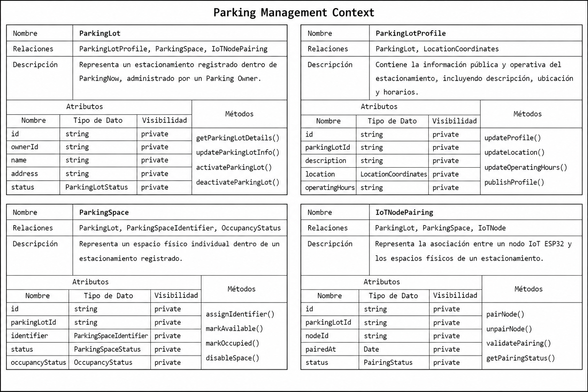
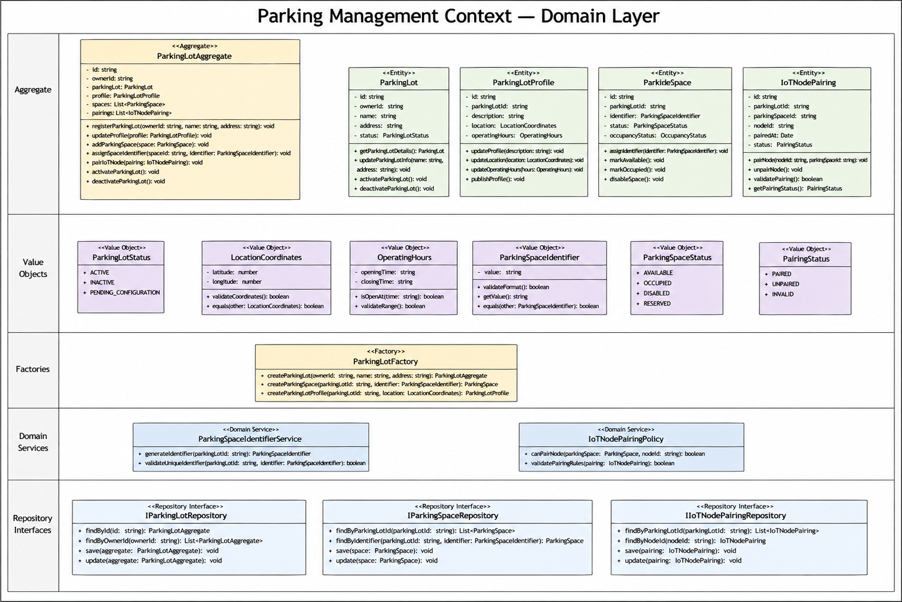
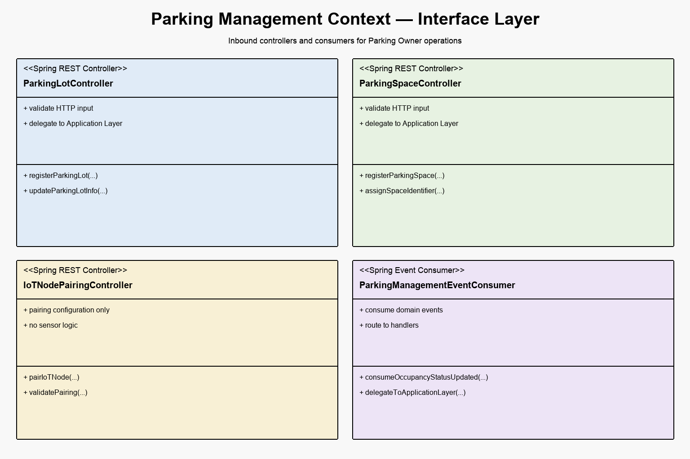
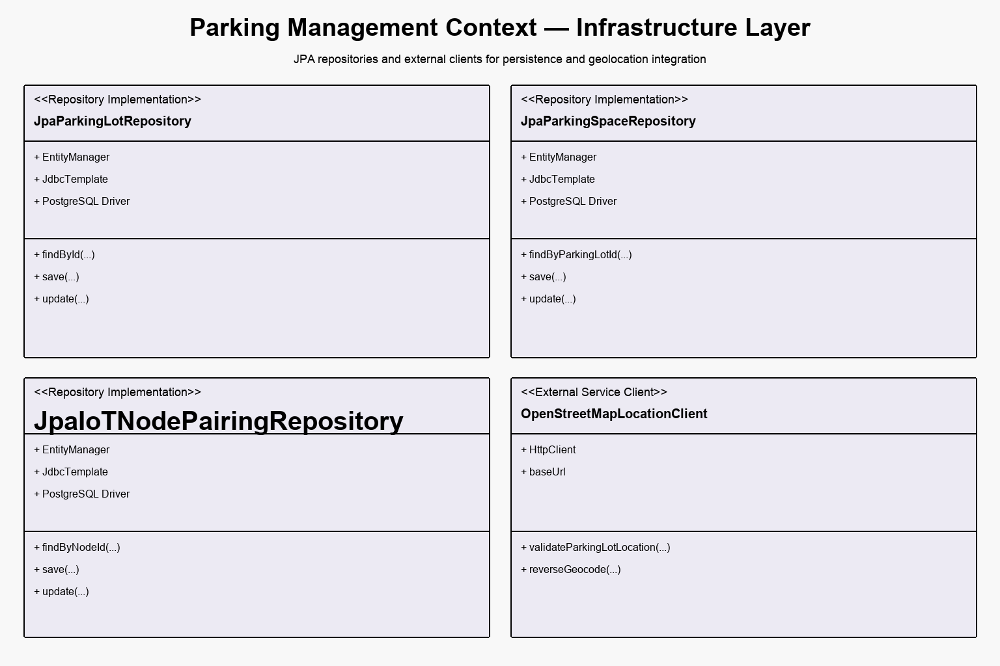
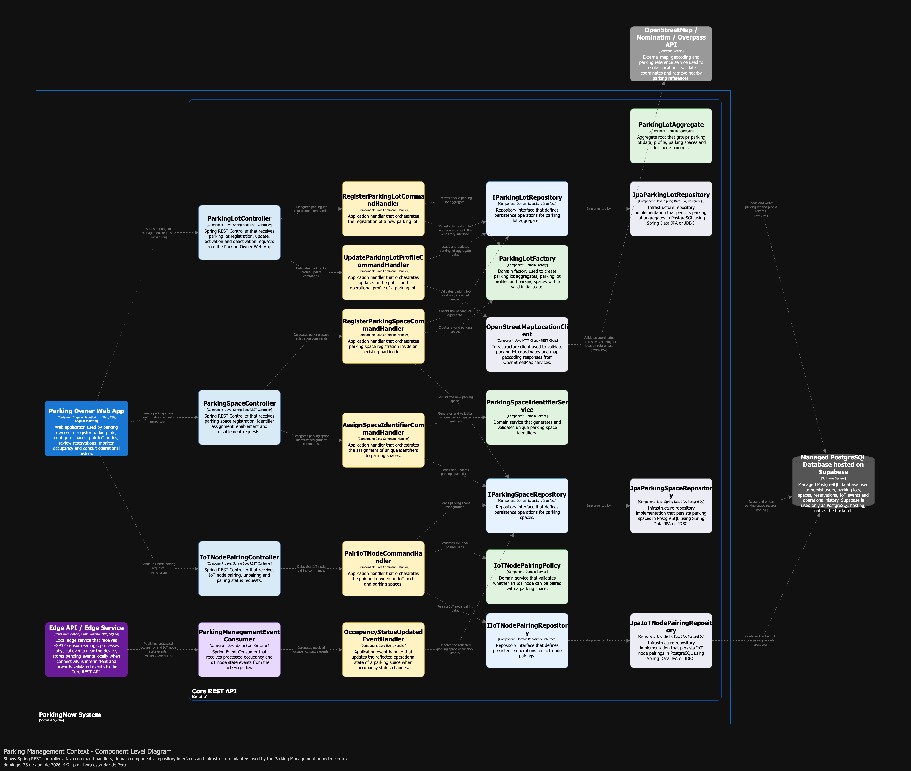
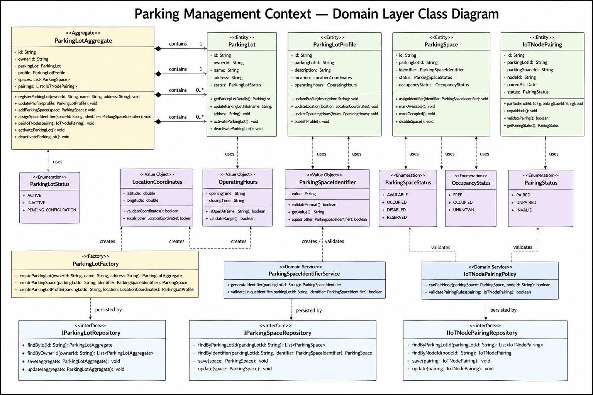
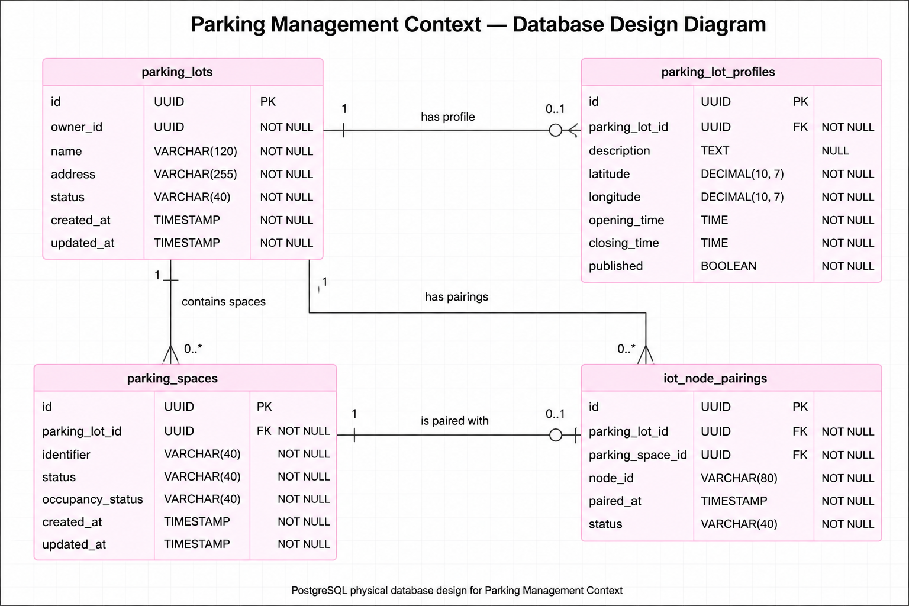

## 4.2. Tactical-Level Domain-Driven Design

En esta sección se desarrolla el diseño táctico de **Domain-Driven Design** para **ParkingNow**, tomando como base los bounded contexts identificados en el diseño estratégico. Mientras que el nivel estratégico permitió definir los límites principales del dominio y sus relaciones, el nivel táctico permite profundizar en la estructura interna de cada contexto y describir cómo sus reglas de negocio serán representadas en capas, clases, componentes y estructuras de persistencia.

Para ParkingNow, este diseño táctico resulta necesario porque la solución integra procesos digitales y físicos dentro de un mismo flujo: búsqueda de estacionamientos, reserva de espacios, validación de disponibilidad, monitoreo IoT, actualización en tiempo real e identificación de usuarios. Por ello, cada bounded context será desarrollado de manera independiente, manteniendo coherencia con el lenguaje ubicuo del dominio y con la arquitectura definida previamente mediante el modelo C4.

El análisis táctico permitirá precisar las responsabilidades internas de cada contexto, evitando que reglas de negocio distintas se mezclen dentro de una única lógica general. De esta manera, ParkingNow conserva una organización modular, trazable y alineada con el dominio, facilitando su implementación progresiva dentro del **Core REST API en Java/Spring Boot**, el **Edge API en Python/Flask/Peewee ORM/SQLite**, la capa de persistencia en **Supabase PostgreSQL** y el firmware embebido del nodo **ESP32**.

### 4.2.1. Bounded Context: Parking Management

El bounded context **Parking Management** agrupa las clases responsables de administrar los estacionamientos registrados en ParkingNow, sus perfiles, espacios físicos, identificadores y asociación con nodos IoT. Este contexto es utilizado principalmente por el **Parking Owner**, quien registra su estacionamiento, configura sus espacios y prepara la infraestructura necesaria para que la plataforma pueda ofrecer disponibilidad verificada.

En este contexto se documentan las clases principales que permiten representar el registro del estacionamiento, la información pública del local, la configuración de espacios y el emparejamiento con el nodo IoT. Estas clases sirven como base para el diseño táctico posterior, donde se detallarán las capas de dominio, aplicación, interfaz e infraestructura.

**Figura 49**  
*Parking Management Context Class Dictionary*

*Nota.* Elaboración propia (2026).

#### Diccionario de clases

##### ParkingLot

| Campo | Detalle |
|---|---|
| Nombre | `ParkingLot` |
| Relaciones | `ParkingLotProfile`, `ParkingSpace`, `IoTNodePairing` |
| Descripción | Representa un estacionamiento registrado dentro de ParkingNow, administrado por un Parking Owner. |

| Atributo | Tipo de dato | Visibilidad |
|---|---|---|
| `id` | `string` | `private` |
| `ownerId` | `string` | `private` |
| `name` | `string` | `private` |
| `address` | `string` | `private` |
| `status` | `ParkingLotStatus` | `private` |

| Método | Descripción |
|---|---|
| `getParkingLotDetails()` | Obtiene la información principal del estacionamiento. |
| `updateParkingLotInfo()` | Actualiza los datos generales del estacionamiento. |
| `activateParkingLot()` | Habilita el estacionamiento para operación. |
| `deactivateParkingLot()` | Deshabilita temporalmente el estacionamiento. |

##### ParkingLotProfile

| Campo | Detalle |
|---|---|
| Nombre | `ParkingLotProfile` |
| Relaciones | `ParkingLot`, `LocationCoordinates` |
| Descripción | Contiene la información pública y operativa del estacionamiento, incluyendo descripción, ubicación y horarios. |

| Atributo | Tipo de dato | Visibilidad |
|---|---|---|
| `id` | `string` | `private` |
| `parkingLotId` | `string` | `private` |
| `description` | `string` | `private` |
| `location` | `LocationCoordinates` | `private` |
| `operatingHours` | `string` | `private` |

| Método | Descripción |
|---|---|
| `updateProfile()` | Actualiza la información pública del perfil. |
| `updateLocation()` | Modifica la ubicación geográfica del estacionamiento. |
| `updateOperatingHours()` | Actualiza los horarios de operación. |
| `publishProfile()` | Publica el perfil para que pueda aparecer en búsquedas. |

##### ParkingSpace

| Campo | Detalle |
|---|---|
| Nombre | `ParkingSpace` |
| Relaciones | `ParkingLot`, `ParkingSpaceIdentifier`, `OccupancyStatus` |
| Descripción | Representa un espacio físico individual dentro de un estacionamiento registrado. |

| Atributo | Tipo de dato | Visibilidad |
|---|---|---|
| `id` | `string` | `private` |
| `parkingLotId` | `string` | `private` |
| `identifier` | `ParkingSpaceIdentifier` | `private` |
| `status` | `ParkingSpaceStatus` | `private` |
| `occupancyStatus` | `OccupancyStatus` | `private` |

| Método | Descripción |
|---|---|
| `assignIdentifier()` | Asigna un identificador único al espacio. |
| `markAvailable()` | Marca el espacio como disponible. |
| `markOccupied()` | Marca el espacio como ocupado. |
| `disableSpace()` | Deshabilita temporalmente el espacio. |

##### IoTNodePairing

| Campo | Detalle |
|---|---|
| Nombre | `IoTNodePairing` |
| Relaciones | `ParkingLot`, `ParkingSpace`, `IoTNode` |
| Descripción | Representa la asociación entre un nodo IoT ESP32 y los espacios físicos de un estacionamiento. |

| Atributo | Tipo de dato | Visibilidad |
|---|---|---|
| `id` | `string` | `private` |
| `parkingLotId` | `string` | `private` |
| `nodeId` | `string` | `private` |
| `pairedAt` | `Date` | `private` |
| `status` | `PairingStatus` | `private` |

| Método | Descripción |
|---|---|
| `pairNode()` | Asocia el nodo IoT al estacionamiento o espacio. |
| `unpairNode()` | Elimina la asociación del nodo IoT. |
| `validatePairing()` | Valida que el nodo pueda asociarse correctamente. |
| `getPairingStatus()` | Obtiene el estado actual del emparejamiento. |

#### 4.2.1.1. Domain Layer

La **Domain Layer** del bounded context **Parking Management** representa el núcleo de reglas de negocio relacionadas con el registro, configuración y administración de estacionamientos dentro de ParkingNow. Esta capa contiene las clases que modelan los conceptos principales del dominio sin depender de tecnologías externas, frameworks, controladores, bases de datos ni servicios de infraestructura.

En este contexto, el actor principal es el **Parking Owner**, entendido como el dueño o encargado del estacionamiento independiente. Las clases del dominio permiten registrar un estacionamiento, definir su perfil público, configurar espacios físicos, asignar identificadores únicos y establecer la asociación entre espacios y nodos IoT. Aunque algunos estados de ocupación provienen del contexto **IoT Monitoring**, en **Parking Management** solo se mantiene la referencia operativa del estado del espacio, no la lógica física de detección del sensor.

**Figura 50**  
*Parking Management Context Domain Layer Diagram*

*Nota.* Elaboración propia (2026).

Según la Figura 50, el diseño de dominio de **Parking Management** se organiza alrededor del aggregate **ParkingLotAggregate**, el cual actúa como raíz de consistencia para el registro y administración del estacionamiento. Este aggregate agrupa la información principal del estacionamiento, su perfil, sus espacios físicos y las asociaciones con nodos IoT.

El aggregate **ParkingLotAggregate** permite garantizar que las operaciones críticas del contexto se realicen de manera consistente. Por ejemplo, un espacio no debe configurarse si el estacionamiento no existe, un identificador de espacio debe ser único dentro de un estacionamiento y un nodo IoT solo puede emparejarse con espacios previamente registrados. Por ello, el aggregate concentra operaciones como registrar el estacionamiento, actualizar el perfil, agregar espacios, asignar identificadores y emparejar nodos IoT.

Las entidades principales del contexto son **ParkingLot**, **ParkingLotProfile**, **ParkingSpace** e **IoTNodePairing**. La entidad **ParkingLot** representa el estacionamiento registrado por el Parking Owner. Contiene información esencial como identificador, dueño, nombre, dirección y estado. La entidad **ParkingLotProfile** contiene información pública y operativa del estacionamiento, como descripción, ubicación y horario de atención. La entidad **ParkingSpace** representa cada espacio físico dentro del estacionamiento, incluyendo su identificador, estado operativo y estado de ocupación reflejado. Finalmente, **IoTNodePairing** representa la asociación entre un nodo IoT ESP32 y uno o más espacios físicos del estacionamiento.

Los **Value Objects** del contexto permiten encapsular valores relevantes del dominio. **LocationCoordinates** representa la ubicación geográfica del estacionamiento mediante latitud y longitud. **ParkingSpaceIdentifier** representa el identificador único de un espacio físico. **OperatingHours** define el rango horario de operación del estacionamiento. Además, **ParkingLotStatus**, **ParkingSpaceStatus** y **PairingStatus** representan estados válidos dentro del contexto, evitando el uso de valores arbitrarios o inconsistentes.

La capa de dominio también incluye la fábrica **ParkingLotFactory**, encargada de construir objetos del dominio con una configuración válida desde el inicio. Esta fábrica permite crear un aggregate de estacionamiento, espacios y perfiles sin duplicar reglas de construcción en otras capas del sistema.

Asimismo, se definen servicios de dominio como **ParkingSpaceIdentifierService** e **IoTNodePairingPolicy**. El primero se encarga de generar y validar identificadores únicos de espacios dentro de un estacionamiento. El segundo valida reglas de emparejamiento entre nodos IoT y espacios físicos. Estos servicios se mantienen en la capa de dominio porque representan reglas puras del negocio y no detalles técnicos de persistencia o comunicación.

Finalmente, se definen interfaces de repositorio como **IParkingLotRepository**, **IParkingSpaceRepository** e **IIoTNodePairingRepository**. Estas interfaces expresan las operaciones necesarias para recuperar y guardar aggregates o entidades del contexto, pero no contienen detalles de implementación. La implementación concreta hacia Supabase o PostgreSQL se define posteriormente en la **Infrastructure Layer**.

La clasificación de clases de la Domain Layer se resume en la siguiente tabla:

| Categoría | Clases |
|---|---|
| Aggregate | `ParkingLotAggregate` |
| Entities | `ParkingLot`, `ParkingLotProfile`, `ParkingSpace`, `IoTNodePairing` |
| Value Objects | `LocationCoordinates`, `ParkingSpaceIdentifier`, `OperatingHours`, `ParkingLotStatus`, `ParkingSpaceStatus`, `PairingStatus` |
| Factory | `ParkingLotFactory` |
| Domain Services | `ParkingSpaceIdentifierService`, `IoTNodePairingPolicy` |
| Repository Interfaces | `IParkingLotRepository`, `IParkingSpaceRepository`, `IIoTNodePairingRepository` |

##### Aggregate

| Clase | Responsabilidad |
|---|---|
| `ParkingLotAggregate` | Actuar como raíz de consistencia del contexto, agrupando el estacionamiento, su perfil, espacios y emparejamientos IoT. |

El aggregate **ParkingLotAggregate** asegura que las operaciones internas del contexto respeten las reglas de negocio. Por ejemplo, impide que un espacio se registre sin pertenecer a un estacionamiento, permite validar la unicidad de identificadores y centraliza la asociación de nodos IoT.

##### Entities

| Clase | Responsabilidad |
|---|---|
| `ParkingLot` | Representar el estacionamiento registrado por el Parking Owner. |
| `ParkingLotProfile` | Representar la información pública y operativa del estacionamiento. |
| `ParkingSpace` | Representar un espacio físico individual dentro de un estacionamiento. |
| `IoTNodePairing` | Representar la asociación entre un nodo IoT y los espacios físicos. |

Las entidades poseen identidad propia y pueden cambiar de estado durante el ciclo de vida del estacionamiento. Por ejemplo, un **ParkingSpace** puede pasar de disponible a deshabilitado, o un **IoTNodePairing** puede pasar de emparejado a desemparejado.

##### Value Objects

| Clase | Responsabilidad |
|---|---|
| `LocationCoordinates` | Encapsular latitud y longitud del estacionamiento. |
| `ParkingSpaceIdentifier` | Representar el identificador único de un espacio. |
| `OperatingHours` | Representar el horario de operación del estacionamiento. |
| `ParkingLotStatus` | Definir los estados válidos del estacionamiento. |
| `ParkingSpaceStatus` | Definir los estados válidos de un espacio. |
| `PairingStatus` | Definir los estados válidos de una asociación IoT. |

Los value objects no tienen identidad propia y se comparan por sus valores. Esto permite mantener consistencia en conceptos como coordenadas, identificadores y estados.

##### Factory

| Clase | Responsabilidad |
|---|---|
| `ParkingLotFactory` | Crear aggregates, perfiles y espacios con valores iniciales válidos. |

La fábrica evita que otras capas del sistema creen objetos del dominio de manera incompleta o inconsistente. De esta manera, las reglas de construcción permanecen dentro de la capa de dominio.

##### Domain Services

| Clase | Responsabilidad |
|---|---|
| `ParkingSpaceIdentifierService` | Generar y validar identificadores únicos para espacios de estacionamiento. |
| `IoTNodePairingPolicy` | Validar reglas de emparejamiento entre nodos IoT y espacios físicos. |

Los servicios de dominio representan reglas que no pertenecen naturalmente a una sola entidad. En este contexto, la generación de identificadores y la validación de emparejamientos requieren evaluar datos del estacionamiento, espacios y nodos, por lo que se modelan como servicios de dominio.

##### Repository Interfaces

| Interfaz | Responsabilidad |
|---|---|
| `IParkingLotRepository` | Definir operaciones de persistencia para el aggregate de estacionamiento. |
| `IParkingSpaceRepository` | Definir operaciones de consulta y persistencia de espacios. |
| `IIoTNodePairingRepository` | Definir operaciones de consulta y persistencia de emparejamientos IoT. |

Estas interfaces permiten que la capa de dominio exprese sus necesidades de persistencia sin depender de Supabase, PostgreSQL ni de ningún mecanismo técnico específico. La implementación concreta se desarrolla en la capa de infraestructura.

En conclusión, la **Domain Layer** de **Parking Management** concentra las reglas puras para administrar estacionamientos, configurar espacios y controlar asociaciones con nodos IoT. Esta capa permite mantener el modelo del dominio independiente de detalles técnicos y asegura que las reglas centrales del contexto se mantengan consistentes durante la implementación.

#### 4.2.1.2. Interface Layer

La **Interface Layer** del bounded context **Parking Management** representa el punto de entrada para las operaciones relacionadas con la administración de estacionamientos, espacios físicos y asociación de nodos IoT. Esta capa recibe solicitudes desde el panel web utilizado por el **Parking Owner** y también puede recibir eventos provenientes de otros contextos, como actualizaciones de ocupación o cambios de estado del nodo IoT.

En esta capa no se implementan reglas de negocio. Su responsabilidad se limita a recibir la solicitud, validar superficialmente el formato de entrada, construir los comandos o queries correspondientes y delegar el procesamiento a la **Application Layer**. De esta manera, los controladores se mantienen simples y el comportamiento del negocio permanece concentrado en las capas internas del bounded context.

**Figura 51**  
*Parking Management Context Interface Layer Diagram*

*Nota.* Elaboración propia (2026).

Según la Figura 51, la capa de interfaz del bounded context **Parking Management** está compuesta por tres controladores REST implementados como **Spring REST Controllers** y un consumidor de eventos. Los controladores exponen las operaciones necesarias para que el **Parking Owner** registre estacionamientos, configure espacios, asigne identificadores y empareje nodos IoT. El consumidor de eventos permite que el contexto reciba cambios relevantes producidos por otros bounded contexts, sin mezclar directamente sus reglas internas.

##### ParkingLotController

La clase `ParkingLotController` expone las operaciones relacionadas con el registro y mantenimiento del estacionamiento. Este controlador recibe solicitudes para crear un estacionamiento, consultar sus detalles, listar los estacionamientos de un Parking Owner, actualizar información general, activar o desactivar el estacionamiento.

| Método | Responsabilidad |
|---|---|
| `registerParkingLot(request: RegisterParkingLotRequest): ParkingLotResponse` | Recibe la solicitud para registrar un nuevo estacionamiento. |
| `getParkingLotDetails(parkingLotId: string): ParkingLotResponse` | Obtiene los datos generales de un estacionamiento. |
| `getOwnerParkingLots(ownerId: string): List<ParkingLotResponse>` | Lista los estacionamientos asociados a un Parking Owner. |
| `updateParkingLotInfo(parkingLotId: string, request: UpdateParkingLotRequest): ParkingLotResponse` | Recibe la solicitud de actualización de información del estacionamiento. |
| `activateParkingLot(parkingLotId: string): void` | Solicita la activación operativa del estacionamiento. |
| `deactivateParkingLot(parkingLotId: string): void` | Solicita la desactivación temporal del estacionamiento. |

##### ParkingSpaceController

La clase `ParkingSpaceController` concentra las operaciones de entrada relacionadas con los espacios físicos de un estacionamiento. Permite registrar nuevos espacios, consultar los espacios existentes, asignar identificadores y habilitar o deshabilitar espacios según la operación del estacionamiento.

| Método | Responsabilidad |
|---|---|
| `registerParkingSpace(parkingLotId: string, request: RegisterParkingSpaceRequest): ParkingSpaceResponse` | Recibe la solicitud para registrar un espacio dentro de un estacionamiento. |
| `getParkingSpaces(parkingLotId: string): List<ParkingSpaceResponse>` | Consulta los espacios registrados para un estacionamiento. |
| `assignSpaceIdentifier(spaceId: string, request: AssignSpaceIdentifierRequest): ParkingSpaceResponse` | Recibe la solicitud para asignar un identificador único al espacio. |
| `disableParkingSpace(spaceId: string): void` | Solicita la deshabilitación temporal de un espacio. |
| `enableParkingSpace(spaceId: string): void` | Solicita la habilitación de un espacio previamente deshabilitado. |

##### IoTNodePairingController

La clase `IoTNodePairingController` expone las operaciones necesarias para asociar nodos IoT con espacios físicos del estacionamiento. Este controlador no procesa lecturas del sensor ni eventos físicos de ocupación; esa responsabilidad pertenece al bounded context **IoT Monitoring**. En este contexto, su función es recibir solicitudes de configuración y delegarlas a la capa de aplicación.

| Método | Responsabilidad |
|---|---|
| `pairIoTNode(parkingLotId: string, request: PairIoTNodeRequest): IoTNodePairingResponse` | Recibe la solicitud para emparejar un nodo IoT con un estacionamiento o espacio. |
| `unpairIoTNode(pairingId: string): void` | Solicita la eliminación de una asociación IoT existente. |
| `validatePairing(pairingId: string): PairingValidationResponse` | Solicita la validación de una asociación IoT. |
| `getPairingStatus(pairingId: string): PairingStatusResponse` | Consulta el estado actual de la asociación IoT. |

##### ParkingManagementEventConsumer

La clase `ParkingManagementEventConsumer` permite que el bounded context **Parking Management** reciba eventos relevantes generados por otros contextos. Por ejemplo, puede recibir una actualización de ocupación producida por **IoT Monitoring** para reflejar el estado operativo de un espacio. Sin embargo, este consumer no interpreta directamente las reglas físicas del sensor; únicamente recibe el evento y delega su procesamiento a la **Application Layer**.

| Método | Responsabilidad |
|---|---|
| `consumeOccupancyStatusUpdated(event: OccupancyStatusUpdatedEvent): void` | Recibe eventos de actualización de ocupación de espacios. |
| `consumeIoTNodePaired(event: IoTNodePairedEvent): void` | Recibe eventos relacionados con el emparejamiento de nodos IoT. |
| `consumeIoTNodeDisconnected(event: IoTNodeDisconnectedEvent): void` | Recibe eventos cuando un nodo IoT deja de estar disponible. |
| `delegateToApplicationLayer(event: DomainEvent): void` | Delega el evento recibido a los handlers correspondientes de la capa de aplicación. |

En conclusión, la **Interface Layer** de **Parking Management** actúa como una frontera de entrada para solicitudes HTTP y eventos de dominio. Esta capa permite que el **Parking Owner** interactúe con las funcionalidades de gestión del estacionamiento sin acoplar directamente la interfaz con las reglas del dominio. A su vez, permite que el bounded context reciba eventos relevantes desde otros contextos manteniendo una separación clara entre recepción, orquestación y lógica de negocio.

#### 4.2.1.3. Application Layer

La **Application Layer** del bounded context **Parking Management** contiene las clases encargadas de orquestar los casos de uso relacionados con la administración de estacionamientos, configuración de espacios y asociación de nodos IoT. Esta capa actúa como intermediaria entre la **Interface Layer**, que recibe las solicitudes del exterior, y la **Domain Layer**, donde se encuentran las reglas de negocio puras.

En este contexto, la capa de aplicación procesa comandos generados por las acciones del **Parking Owner**, como registrar un estacionamiento, actualizar su perfil, registrar espacios, asignar identificadores y emparejar nodos IoT. También puede procesar eventos relevantes provenientes de otros contextos, como la actualización del estado de ocupación de un espacio. Sin embargo, esta capa no contiene reglas de negocio complejas; su responsabilidad es coordinar el flujo de ejecución, invocar servicios de dominio, utilizar interfaces de repositorio y devolver el resultado correspondiente.

**Figura 52**  
*Parking Management Context Application Layer Diagram*

*Nota.* Elaboración propia (2026).

Según la Figura 52, la **Application Layer** de **Parking Management** está compuesta por command handlers y event handlers. Los command handlers ejecutan acciones solicitadas por el Parking Owner desde el panel web, mientras que el event handler permite reaccionar ante eventos producidos por otros contextos. Estas clases no implementan directamente lógica de negocio; únicamente coordinan objetos del dominio, servicios de dominio e interfaces de repositorio.

##### RegisterParkingLotCommandHandler

La clase `RegisterParkingLotCommandHandler` orquesta el caso de uso de registro de un nuevo estacionamiento. Recibe un comando con los datos iniciales del estacionamiento, utiliza la fábrica del dominio para construir el aggregate correspondiente y delega la persistencia mediante la interfaz `IParkingLotRepository`.

| Elemento | Detalle |
|---|---|
| Clase | `RegisterParkingLotCommandHandler` |
| Tipo | Command Handler |
| Dependencias | `ParkingLotFactory`, `IParkingLotRepository` |
| Método principal | `handle(command: RegisterParkingLotCommand): ParkingLotAggregate` |
| Responsabilidad | Coordinar el registro inicial de un estacionamiento administrado por un Parking Owner. |

Esta clase no valida reglas de negocio por sí misma. La creación válida del aggregate se delega a `ParkingLotFactory`, mientras que la persistencia se realiza mediante la abstracción del repositorio.

##### UpdateParkingLotProfileCommandHandler

La clase `UpdateParkingLotProfileCommandHandler` orquesta la actualización del perfil operativo y público de un estacionamiento. Recibe los datos actualizados del perfil, recupera el aggregate correspondiente y delega la modificación al modelo de dominio.

| Elemento | Detalle |
|---|---|
| Clase | `UpdateParkingLotProfileCommandHandler` |
| Tipo | Command Handler |
| Dependencias | `IParkingLotRepository` |
| Método principal | `handle(command: UpdateParkingLotProfileCommand): ParkingLotProfile` |
| Responsabilidad | Coordinar la actualización del perfil de un estacionamiento registrado. |

Este handler permite modificar información como descripción, ubicación y horarios, pero la consistencia de dichos valores pertenece al **Domain Layer**, no a la capa de aplicación.

##### RegisterParkingSpaceCommandHandler

La clase `RegisterParkingSpaceCommandHandler` orquesta el registro de un nuevo espacio físico dentro de un estacionamiento existente. Para ello, recupera el estacionamiento asociado, utiliza la fábrica del dominio para crear el espacio y delega el guardado mediante `IParkingSpaceRepository`.

| Elemento | Detalle |
|---|---|
| Clase | `RegisterParkingSpaceCommandHandler` |
| Tipo | Command Handler |
| Dependencias | `IParkingLotRepository`, `IParkingSpaceRepository`, `ParkingLotFactory` |
| Método principal | `handle(command: RegisterParkingSpaceCommand): ParkingSpace` |
| Responsabilidad | Coordinar la creación de un espacio físico dentro de un estacionamiento. |

La existencia del estacionamiento y la correcta creación del espacio se coordinan desde esta clase, pero las reglas sobre la validez del espacio pertenecen al aggregate y a los objetos del dominio.

##### AssignSpaceIdentifierCommandHandler

La clase `AssignSpaceIdentifierCommandHandler` orquesta la asignación de un identificador único a un espacio físico. Utiliza el servicio de dominio `ParkingSpaceIdentifierService` para generar o validar el identificador y luego actualiza el espacio mediante la interfaz de repositorio correspondiente.

| Elemento | Detalle |
|---|---|
| Clase | `AssignSpaceIdentifierCommandHandler` |
| Tipo | Command Handler |
| Dependencias | `IParkingSpaceRepository`, `ParkingSpaceIdentifierService` |
| Método principal | `handle(command: AssignSpaceIdentifierCommand): ParkingSpace` |
| Responsabilidad | Coordinar la asignación de identificadores únicos a espacios físicos. |

Esta clase evita duplicar la lógica de generación o validación de identificadores en los controladores. La regla de unicidad se mantiene como responsabilidad del dominio.

##### PairIoTNodeCommandHandler

La clase `PairIoTNodeCommandHandler` orquesta el emparejamiento de un nodo IoT con un espacio físico del estacionamiento. Utiliza `IoTNodePairingPolicy` para validar si la asociación es permitida y luego registra el emparejamiento mediante la interfaz `IIoTNodePairingRepository`.

| Elemento | Detalle |
|---|---|
| Clase | `PairIoTNodeCommandHandler` |
| Tipo | Command Handler |
| Dependencias | `IParkingSpaceRepository`, `IIoTNodePairingRepository`, `IoTNodePairingPolicy` |
| Método principal | `handle(command: PairIoTNodeCommand): IoTNodePairing` |
| Responsabilidad | Coordinar la asociación entre nodos IoT y espacios físicos. |

Este handler no procesa lecturas de sensores ni eventos físicos. Su función se limita a coordinar la configuración del emparejamiento desde el punto de vista administrativo del Parking Owner.

##### OccupancyStatusUpdatedEventHandler

La clase `OccupancyStatusUpdatedEventHandler` procesa eventos de actualización de ocupación provenientes del contexto **IoT Monitoring**. Su responsabilidad es reflejar el nuevo estado operativo del espacio dentro de **Parking Management**, manteniendo actualizada la vista administrativa del estacionamiento.

| Elemento | Detalle |
|---|---|
| Clase | `OccupancyStatusUpdatedEventHandler` |
| Tipo | Event Handler |
| Dependencias | `IParkingSpaceRepository` |
| Método principal | `handle(event: OccupancyStatusUpdatedEvent): void` |
| Responsabilidad | Coordinar la actualización del estado operativo de un espacio cuando cambia su ocupación física. |

Aunque este handler recibe eventos relacionados con ocupación, la detección física y el procesamiento del sensor pertenecen al bounded context **IoT Monitoring**. En **Parking Management**, el evento se utiliza únicamente para mantener sincronizado el estado administrativo del espacio.

##### Resumen de clases de la Application Layer

| Clase | Tipo | Responsabilidad |
|---|---|---|
| `RegisterParkingLotCommandHandler` | Command Handler | Orquestar el registro inicial de un estacionamiento. |
| `UpdateParkingLotProfileCommandHandler` | Command Handler | Orquestar la actualización del perfil del estacionamiento. |
| `RegisterParkingSpaceCommandHandler` | Command Handler | Orquestar el registro de espacios físicos. |
| `AssignSpaceIdentifierCommandHandler` | Command Handler | Orquestar la asignación de identificadores únicos a espacios. |
| `PairIoTNodeCommandHandler` | Command Handler | Orquestar el emparejamiento entre nodos IoT y espacios. |
| `OccupancyStatusUpdatedEventHandler` | Event Handler | Orquestar la actualización del estado operativo ante eventos de ocupación. |

En conclusión, la **Application Layer** de **Parking Management** mantiene una estructura delgada y orientada a casos de uso. Sus clases coordinan comandos y eventos, invocan reglas del dominio e interactúan con interfaces de repositorio, pero no contienen lógica de negocio pura. Esta separación permite que el bounded context conserve una arquitectura limpia, trazable y alineada con Domain-Driven Design.

#### 4.2.1.4. Infrastructure Layer

La **Infrastructure Layer** del bounded context **Parking Management** contiene las clases técnicas que permiten conectar las reglas del dominio con servicios externos, mecanismos de persistencia y clientes de integración. En esta capa se implementan las interfaces definidas en la **Domain Layer**, principalmente los repositorios encargados de almacenar y recuperar estacionamientos, espacios físicos y emparejamientos IoT.

A diferencia de la **Domain Layer**, esta capa sí depende de tecnologías concretas. Para ParkingNow, la infraestructura del contexto utiliza **Supabase** como plataforma de persistencia sobre PostgreSQL y clientes externos como **OpenStreetMap / Nominatim / Overpass API** para validar ubicaciones y consultar referencias geográficas. Estas dependencias se mantienen fuera del dominio para evitar que las reglas de negocio queden acopladas a una tecnología específica.

**Figura 53**  
*Parking Management Context Infrastructure Layer Diagram*

*Nota.* Elaboración propia (2026).

Según la Figura 53, la **Infrastructure Layer** de **Parking Management** está compuesta por clases que implementan repositorios concretos y clientes de integración externa. Estas clases no contienen reglas de negocio; su responsabilidad es ejecutar operaciones técnicas como consultas, inserciones, actualizaciones, eliminación de registros y comunicación con servicios geográficos externos.

##### JpaParkingLotRepository

La clase `JpaParkingLotRepository` implementa la persistencia concreta del aggregate `ParkingLotAggregate`. Esta clase utiliza **Spring Data JPA**, **JDBC**, **EntityManager** o **PostgreSQL Driver** para leer y escribir información relacionada con estacionamientos registrados por el **Parking Owner**.

| Elemento | Detalle |
|---|---|
| Clase | `JpaParkingLotRepository` |
| Tipo | Repository Implementation |
| Implementa | `IParkingLotRepository` |
| Dependencia principal | `Spring Data JPA/EntityManager/PostgreSQL Driver` |
| Responsabilidad | Persistir y recuperar aggregates de estacionamiento desde Supabase PostgreSQL. |

| Método | Responsabilidad |
|---|---|
| `findById(parkingLotId: string): ParkingLotAggregate` | Busca un estacionamiento por su identificador. |
| `findByOwnerId(ownerId: string): List<ParkingLotAggregate>` | Lista los estacionamientos asociados a un Parking Owner. |
| `save(aggregate: ParkingLotAggregate): void` | Guarda un nuevo aggregate de estacionamiento. |
| `update(aggregate: ParkingLotAggregate): void` | Actualiza la información de un estacionamiento existente. |
| `deleteById(parkingLotId: string): void` | Elimina o desactiva técnicamente un estacionamiento según la política aplicada. |

Esta clase traduce el modelo del dominio hacia estructuras persistentes, pero no decide si un estacionamiento puede activarse, desactivarse o publicarse. Esas reglas pertenecen al dominio.

##### JpaParkingSpaceRepository

La clase `JpaParkingSpaceRepository` implementa la persistencia concreta de los espacios físicos registrados dentro de un estacionamiento. Su función es permitir que la capa de aplicación recupere, guarde y actualice espacios sin conocer detalles de Supabase ni de PostgreSQL.

| Elemento | Detalle |
|---|---|
| Clase | `JpaParkingSpaceRepository` |
| Tipo | Repository Implementation |
| Implementa | `IParkingSpaceRepository` |
| Dependencia principal | `Spring Data JPA/EntityManager/PostgreSQL Driver` |
| Responsabilidad | Persistir y consultar espacios físicos configurados por el Parking Owner. |

| Método | Responsabilidad |
|---|---|
| `findByParkingLotId(parkingLotId: string): List<ParkingSpace>` | Obtiene todos los espacios registrados para un estacionamiento. |
| `findByIdentifier(parkingLotId: string, identifier: ParkingSpaceIdentifier): ParkingSpace` | Busca un espacio por su identificador dentro de un estacionamiento. |
| `save(space: ParkingSpace): void` | Guarda un nuevo espacio físico. |
| `update(space: ParkingSpace): void` | Actualiza el estado o configuración de un espacio. |
| `deleteById(spaceId: string): void` | Elimina o deshabilita técnicamente un espacio según corresponda. |

Esta clase soporta operaciones como registrar espacios, asignar identificadores, habilitar o deshabilitar espacios. La validación de identificadores únicos no pertenece a esta clase; dicha responsabilidad se mantiene en el servicio de dominio `ParkingSpaceIdentifierService`.

##### JpaIoTNodePairingRepository

La clase `JpaIoTNodePairingRepository` implementa la persistencia de las asociaciones entre nodos IoT y espacios físicos. Esta clase permite registrar qué nodo ESP32 está relacionado con un estacionamiento o con espacios específicos.

| Elemento | Detalle |
|---|---|
| Clase | `JpaIoTNodePairingRepository` |
| Tipo | Repository Implementation |
| Implementa | `IIoTNodePairingRepository` |
| Dependencia principal | `Spring Data JPA/EntityManager/PostgreSQL Driver` |
| Responsabilidad | Persistir y consultar emparejamientos entre nodos IoT y espacios físicos. |

| Método | Responsabilidad |
|---|---|
| `findByParkingLotId(parkingLotId: string): List<IoTNodePairing>` | Obtiene los emparejamientos asociados a un estacionamiento. |
| `findByNodeId(nodeId: string): IoTNodePairing` | Busca el emparejamiento asociado a un nodo IoT específico. |
| `save(pairing: IoTNodePairing): void` | Guarda un nuevo emparejamiento IoT. |
| `update(pairing: IoTNodePairing): void` | Actualiza el estado de un emparejamiento existente. |
| `deleteById(pairingId: string): void` | Elimina o desactiva un emparejamiento IoT. |

Esta clase no procesa lecturas de sensores ni eventos físicos. Su alcance se limita a la configuración administrativa del emparejamiento. La detección de ocupación y el procesamiento de eventos del ESP32 pertenecen al bounded context **IoT Monitoring**.

##### OpenStreetMapLocationClient

La clase `OpenStreetMapLocationClient` representa el cliente de infraestructura encargado de comunicarse con servicios geográficos externos como **OpenStreetMap**, **Nominatim** u **Overpass API**. En el contexto **Parking Management**, su función principal es apoyar la validación de ubicación del estacionamiento registrado por el Parking Owner.

| Elemento | Detalle |
|---|---|
| Clase | `OpenStreetMapLocationClient` |
| Tipo | External Service Client |
| Dependencias principales | `HttpClient`, `baseUrl` |
| Responsabilidad | Consumir servicios geográficos externos para validar ubicaciones y consultar referencias cercanas. |

| Método | Responsabilidad |
|---|---|
| `validateParkingLotLocation(latitude: number, longitude: number): boolean` | Valida si las coordenadas del estacionamiento son consistentes. |
| `reverseGeocode(latitude: number, longitude: number): LocationAddress` | Obtiene una dirección aproximada a partir de coordenadas. |
| `searchNearbyParkingReferences(latitude: number, longitude: number): List<ExternalParkingReference>` | Consulta referencias externas de estacionamientos cercanos. |
| `mapExternalResponse(response: object): LocationValidationResult` | Transforma la respuesta externa a un resultado utilizable por la aplicación. |

Esta clase protege al dominio de la estructura propia de la API externa. Si OpenStreetMap o Nominatim modifican su formato de respuesta, el cambio se controla dentro de esta clase y no afecta directamente a las entidades ni a los aggregates del dominio.

##### Resumen de clases de la Infrastructure Layer

| Clase | Tipo | Responsabilidad |
|---|---|---|
| `JpaParkingLotRepository` | Repository Implementation | Implementar la persistencia concreta del aggregate `ParkingLotAggregate`. |
| `JpaParkingSpaceRepository` | Repository Implementation | Implementar la persistencia concreta de espacios físicos. |
| `JpaIoTNodePairingRepository` | Repository Implementation | Implementar la persistencia concreta de emparejamientos IoT. |
| `OpenStreetMapLocationClient` | External Service Client | Validar ubicaciones y consultar referencias geográficas mediante servicios externos. |

En conclusión, la **Infrastructure Layer** de **Parking Management** permite que el bounded context se comunique con tecnologías concretas sin contaminar el dominio. Los repositorios implementan las interfaces definidas en la capa de dominio y el cliente de OpenStreetMap encapsula la comunicación con servicios externos. De esta forma, ParkingNow mantiene una separación clara entre reglas de negocio, orquestación de casos de uso y detalles técnicos de persistencia o integración.

#### 4.2.1.5. Bounded Context Software Architecture Component Level Diagrams

El **Bounded Context Software Architecture Component Level Diagram** permite representar cómo se organizan e interactúan los componentes internos del bounded context **Parking Management** dentro del contenedor **Core REST API**. Este diagrama corresponde al nivel 3 del modelo C4, por lo que no muestra todavía clases de bajo nivel ni tablas de base de datos, sino componentes de software con responsabilidades claras dentro del contexto.

Para ParkingNow, el bounded context **Parking Management** se implementa principalmente dentro del **Core REST API**, desarrollado con **Java, Spring Boot, RESTful API y documentación OpenAPI Specification mediante Swagger**. Este contexto recibe solicitudes desde la **Parking Owner Web App**, orquesta casos de uso relacionados con estacionamientos, espacios y emparejamiento de nodos IoT, aplica reglas del dominio y utiliza adaptadores de infraestructura para persistir información en Supabase PostgreSQL o validar datos geográficos mediante servicios externos.

**Figura 54**  
*Parking Management Context Component Level Diagram*

*Nota.* Elaboración propia (2026) usando Structurizr DSL.

Según la Figura 54, el bounded context **Parking Management** se organiza en componentes pertenecientes a cuatro capas principales: **Interface Layer**, **Application Layer**, **Domain Layer** e **Infrastructure Layer**. Esta organización permite separar la recepción de solicitudes, la orquestación de casos de uso, las reglas del dominio y los detalles técnicos de persistencia o integración externa.

En la **Interface Layer**, los componentes `ParkingLotController`, `ParkingSpaceController` e `IoTNodePairingController` reciben solicitudes HTTP desde la **Parking Owner Web App**. Estas solicitudes corresponden a acciones como registrar estacionamientos, configurar espacios, asignar identificadores y emparejar nodos IoT. Además, el componente `ParkingManagementEventConsumer` permite recibir eventos relevantes desde otros contextos, como actualizaciones de ocupación o cambios de estado del nodo IoT.

La **Application Layer** contiene los handlers encargados de coordinar los casos de uso del contexto. `RegisterParkingLotCommandHandler` orquesta el registro de un estacionamiento; `UpdateParkingLotProfileCommandHandler` coordina la actualización de la información pública y operativa del estacionamiento; `RegisterParkingSpaceCommandHandler` permite crear espacios físicos; `AssignSpaceIdentifierCommandHandler` coordina la asignación de identificadores únicos; `PairIoTNodeCommandHandler` gestiona la asociación entre espacios y nodos IoT; y `OccupancyStatusUpdatedEventHandler` actualiza el estado operativo del espacio cuando recibe un evento de ocupación.

La **Domain Layer** concentra los componentes que representan el núcleo del negocio. `ParkingLotAggregate` actúa como raíz de consistencia del contexto y agrupa el estacionamiento, su perfil, sus espacios y sus emparejamientos IoT. `ParkingLotFactory` permite crear objetos de dominio con un estado inicial válido. `ParkingSpaceIdentifierService` encapsula la generación y validación de identificadores únicos de espacios. `IoTNodePairingPolicy` valida las reglas de emparejamiento entre nodos IoT y espacios físicos.

La **Infrastructure Layer** contiene las implementaciones concretas de persistencia e integración. `JpaParkingLotRepository`, `JpaParkingSpaceRepository` y `JpaIoTNodePairingRepository` implementan las interfaces de repositorio definidas en la capa de dominio y se encargan de leer y escribir datos en **Supabase PostgreSQL**. Por otro lado, `OpenStreetMapLocationClient` permite validar coordenadas y resolver referencias geográficas mediante servicios externos como **OpenStreetMap / Nominatim / Overpass API**.

La siguiente tabla resume los principales componentes representados en el diagrama:

| Capa | Componente | Responsabilidad |
|---|---|---|
| Interface Layer | `ParkingLotController` | Recibir solicitudes relacionadas con registro, consulta, activación y actualización de estacionamientos. |
| Interface Layer | `ParkingSpaceController` | Recibir solicitudes para registrar espacios, consultar espacios y asignar identificadores. |
| Interface Layer | `IoTNodePairingController` | Recibir solicitudes para emparejar, desemparejar y validar nodos IoT. |
| Interface Layer | `ParkingManagementEventConsumer` | Recibir eventos de ocupación o cambios de estado IoT provenientes de otros contextos. |
| Application Layer | `RegisterParkingLotCommandHandler` | Orquestar el registro de un nuevo estacionamiento. |
| Application Layer | `UpdateParkingLotProfileCommandHandler` | Orquestar la actualización del perfil público y operativo del estacionamiento. |
| Application Layer | `RegisterParkingSpaceCommandHandler` | Orquestar el registro de espacios físicos dentro de un estacionamiento. |
| Application Layer | `AssignSpaceIdentifierCommandHandler` | Orquestar la asignación de identificadores únicos a espacios. |
| Application Layer | `PairIoTNodeCommandHandler` | Orquestar el emparejamiento entre nodos IoT y espacios físicos. |
| Application Layer | `OccupancyStatusUpdatedEventHandler` | Reflejar cambios de ocupación física dentro del estado operativo del espacio. |
| Domain Layer | `ParkingLotAggregate` | Mantener la consistencia del estacionamiento, perfil, espacios y emparejamientos IoT. |
| Domain Layer | `ParkingLotFactory` | Crear objetos de dominio con estado inicial válido. |
| Domain Layer | `ParkingSpaceIdentifierService` | Generar y validar identificadores únicos de espacios. |
| Domain Layer | `IoTNodePairingPolicy` | Validar reglas de emparejamiento entre nodos IoT y espacios físicos. |
| Domain Layer | `IParkingLotRepository` | Definir operaciones de persistencia para el aggregate de estacionamiento. |
| Domain Layer | `IParkingSpaceRepository` | Definir operaciones de persistencia para espacios físicos. |
| Domain Layer | `IIoTNodePairingRepository` | Definir operaciones de persistencia para emparejamientos IoT. |
| Infrastructure Layer | `JpaParkingLotRepository` | Implementar la persistencia de estacionamientos en Supabase PostgreSQL. |
| Infrastructure Layer | `JpaParkingSpaceRepository` | Implementar la persistencia de espacios físicos en Supabase PostgreSQL. |
| Infrastructure Layer | `JpaIoTNodePairingRepository` | Implementar la persistencia de asociaciones entre nodos IoT y espacios. |
| Infrastructure Layer | `OpenStreetMapLocationClient` | Validar coordenadas y resolver referencias geográficas externas. |

El flujo principal del componente inicia cuando el **Parking Owner** utiliza la **Parking Owner Web App** para registrar o configurar un estacionamiento. La aplicación web envía una solicitud HTTP al controlador correspondiente dentro del **Core REST API**. Luego, el controlador delega la operación a un command handler de la **Application Layer**. Este handler coordina la operación, invoca componentes del dominio cuando se requieren reglas de negocio y utiliza interfaces de repositorio para persistir los cambios.

Por ejemplo, cuando el Parking Owner registra un estacionamiento, `ParkingLotController` recibe la solicitud y la delega a `RegisterParkingLotCommandHandler`. Este handler utiliza `ParkingLotFactory` para crear un `ParkingLotAggregate` válido y luego lo guarda mediante `IParkingLotRepository`. La implementación concreta de esta interfaz es `JpaParkingLotRepository`, encargada de persistir los datos en Supabase PostgreSQL.

En el caso de la configuración de espacios, `ParkingSpaceController` delega los comandos hacia `RegisterParkingSpaceCommandHandler` o `AssignSpaceIdentifierCommandHandler`. Este último utiliza `ParkingSpaceIdentifierService` para validar la unicidad y formato del identificador antes de actualizar el espacio. De esta manera, la regla de negocio no queda en el controlador ni en el repositorio, sino en el dominio.

Para el emparejamiento IoT, `IoTNodePairingController` recibe la solicitud de asociación entre un nodo ESP32 y un espacio físico. Luego, `PairIoTNodeCommandHandler` utiliza `IoTNodePairingPolicy` para validar si el emparejamiento es permitido. Si la operación es válida, el resultado se persiste mediante `IIoTNodePairingRepository`, cuya implementación concreta es `JpaIoTNodePairingRepository`.

El componente `ParkingManagementEventConsumer` permite que este bounded context reciba eventos generados por otros contextos, especialmente desde **IoT Monitoring**. Por ejemplo, cuando el nodo ESP32 reporta un cambio de ocupación, el contexto de monitoreo IoT puede publicar un evento `OccupancyStatusUpdatedEvent`. En Parking Management, este evento es procesado por `OccupancyStatusUpdatedEventHandler`, que actualiza el estado operativo reflejado del espacio. La detección física sigue perteneciendo a IoT Monitoring; Parking Management solo mantiene la vista administrativa actualizada.

En conclusión, el **Component Level Diagram** de **Parking Management** muestra cómo el bounded context estructura internamente sus responsabilidades dentro del **Core REST API**. La separación entre controladores, handlers, dominio e infraestructura permite mantener una arquitectura limpia, donde las reglas de negocio no se mezclan con detalles técnicos. Esta organización facilita la evolución del sistema, reduce el acoplamiento y mantiene coherencia con el diseño táctico de Domain-Driven Design.

#### 4.2.1.6. Bounded Context Software Architecture Code Level Diagrams

En esta sección se presentan los diagramas de nivel de código correspondientes al bounded context **Parking Management**. A diferencia de los diagramas C4 anteriores, que muestran la arquitectura desde una perspectiva de sistema, contenedores y componentes, este bloque profundiza en la estructura interna del contexto a nivel de clases del dominio y diseño físico de base de datos.

Para ello, primero se presenta el **Domain Layer Class Diagram**, donde se detallan las entidades, objetos de valor, agregados, servicios de dominio e interfaces de repositorio que representan las reglas principales del contexto. Luego, se presenta el **Database Design Diagram**, donde se muestra cómo se persisten los datos de este bounded context en una base de datos relacional PostgreSQL, indicando tablas, columnas, llaves primarias, llaves foráneas y relaciones entre entidades.

Estos diagramas permiten cerrar el diseño táctico del bounded context **Parking Management**, asegurando trazabilidad entre el modelo de dominio, las reglas de negocio y la estructura de persistencia utilizada por la solución.

##### 4.2.1.6.1. Bounded Context Domain Layer Class Diagrams

El **Bounded Context Domain Layer Class Diagram** presenta el diseño UML de las clases que forman parte de la capa de dominio del bounded context **Parking Management**. Este diagrama se enfoca únicamente en los elementos que representan reglas de negocio puras, por lo que no incluye controladores, servicios REST, frameworks, repositorios de infraestructura ni detalles de base de datos.

En este contexto, el núcleo del dominio está representado por el aggregate `ParkingLotAggregate`, el cual mantiene la consistencia entre el estacionamiento registrado, su perfil público, sus espacios físicos y las asociaciones con nodos IoT. A partir de este aggregate se organizan las entidades principales, los value objects, los servicios de dominio, la fábrica de creación y las interfaces de repositorio que serán implementadas posteriormente por la capa de infraestructura.

**Figura 55**  
*Parking Management Context Domain Layer Class Diagram*

*Nota.* Elaboración propia (2026) usando LucidChart / PlantUML.

Según la Figura 55, el aggregate `ParkingLotAggregate` actúa como raíz de consistencia del bounded context **Parking Management**. Este aggregate contiene una entidad `ParkingLot`, un `ParkingLotProfile`, una colección de `ParkingSpace` y una colección de `IoTNodePairing`. Esta estructura permite asegurar que las operaciones principales del contexto, como registrar un estacionamiento, actualizar su perfil, crear espacios físicos o asociar nodos IoT, se realicen bajo reglas consistentes del dominio.

La entidad `ParkingLot` representa el estacionamiento registrado dentro de ParkingNow. Contiene datos como el identificador, el dueño del estacionamiento, el nombre, la dirección y el estado operativo. Su comportamiento permite actualizar información general, activar el estacionamiento o desactivarlo según las reglas del negocio.

La entidad `ParkingLotProfile` representa la información pública y operativa del estacionamiento. Esta clase utiliza los value objects `LocationCoordinates` y `OperatingHours` para modelar la ubicación geográfica y los horarios de operación. De esta manera, la ubicación y los horarios se tratan como objetos inmutables y validados dentro del dominio.

La entidad `ParkingSpace` representa un espacio físico individual dentro de un estacionamiento. Cada espacio contiene un identificador propio, un estado de configuración y un estado de ocupación. Para evitar identificadores duplicados o inválidos, el dominio utiliza el value object `ParkingSpaceIdentifier` y el servicio de dominio `ParkingSpaceIdentifierService`.

La entidad `IoTNodePairing` representa la asociación entre un nodo IoT y un espacio físico del estacionamiento. Esta relación es validada mediante el servicio de dominio `IoTNodePairingPolicy`, el cual define si un nodo puede emparejarse con determinado espacio y si la asociación cumple las reglas del bounded context.

Los objetos de valor definidos en este diagrama permiten encapsular conceptos que no requieren identidad propia, pero sí reglas de validación. `LocationCoordinates` valida latitud y longitud; `OperatingHours` valida los rangos horarios; `ParkingSpaceIdentifier` valida el formato del identificador del espacio; y las enumeraciones `ParkingLotStatus`, `ParkingSpaceStatus`, `OccupancyStatus` y `PairingStatus` restringen los estados permitidos dentro del modelo.

La fábrica `ParkingLotFactory` centraliza la creación de objetos de dominio relevantes, evitando que los aggregates y entidades nazcan en estados inválidos. Esta fábrica permite crear estacionamientos, perfiles y espacios físicos con los datos mínimos necesarios y respetando las reglas iniciales del contexto.

Finalmente, las interfaces `IParkingLotRepository`, `IParkingSpaceRepository` e `IIoTNodePairingRepository` definen las abstracciones de persistencia que el dominio necesita para guardar y recuperar aggregates, espacios y emparejamientos IoT. Estas interfaces pertenecen al Domain Layer porque expresan contratos requeridos por el dominio, pero sus implementaciones concretas se ubican en la Infrastructure Layer.

##### 4.2.1.6.2. Bounded Context Database Design Diagram

El **Bounded Context Database Design Diagram** presenta el diseño físico de base de datos correspondiente al bounded context **Parking Management**. Este diagrama muestra cómo se almacenan las entidades principales del contexto en una base de datos relacional PostgreSQL, detallando tablas, columnas, tipos de datos, llaves primarias, llaves foráneas y relaciones entre registros.

A diferencia del diagrama de clases del dominio, este diagrama representa la estructura de persistencia. Por ello, se utilizan nombres de tablas, columnas y constraints propios de un modelo relacional. Para este contexto se consideran únicamente las tablas necesarias para gestionar estacionamientos, perfiles operativos, espacios físicos y emparejamientos con nodos IoT.

**Figura 56**  
*Parking Management Context Database Design Diagram*

*Nota.* Elaboración propia (2026) usando LucidChart / Vertabelo.

Según la Figura 56, la tabla principal del bounded context es `parking_lots`, ya que representa el estacionamiento registrado por un **Parking Owner**. Esta tabla contiene información base como el identificador del estacionamiento, el identificador del dueño, el nombre, la dirección, el estado y las fechas de creación y actualización.

La tabla `parking_lot_profiles` almacena la información pública y operativa del estacionamiento. Se relaciona con `parking_lots` mediante la columna `parking_lot_id`, definida como llave foránea. Esta relación permite separar los datos principales del estacionamiento de su perfil publicado, incluyendo descripción, coordenadas geográficas, horario de apertura, horario de cierre y estado de publicación.

La tabla `parking_spaces` almacena los espacios físicos configurados dentro de cada estacionamiento. Cada registro pertenece a un estacionamiento mediante la llave foránea `parking_lot_id`. Además, contiene el identificador visible del espacio, su estado de configuración y su estado de ocupación. Esta tabla permite administrar los espacios disponibles, ocupados, reservados o deshabilitados dentro del estacionamiento.

La tabla `iot_node_pairings` registra la asociación entre un nodo IoT y un espacio físico. Esta tabla contiene referencias hacia `parking_lots` y `parking_spaces`, permitiendo conocer qué nodo está emparejado con qué espacio. También almacena el identificador del nodo, la fecha de emparejamiento y el estado de la asociación.

Las relaciones principales del diseño son las siguientes:

| Relación | Cardinalidad | Descripción |
|---|---|---|
| `parking_lots` → `parking_lot_profiles` | 1 a 0..1 | Un estacionamiento puede tener un perfil operativo publicado o pendiente de configuración. |
| `parking_lots` → `parking_spaces` | 1 a 0..* | Un estacionamiento puede contener múltiples espacios físicos. |
| `parking_lots` → `iot_node_pairings` | 1 a 0..* | Un estacionamiento puede tener múltiples emparejamientos de nodos IoT. |
| `parking_spaces` → `iot_node_pairings` | 1 a 0..1 | Un espacio puede estar asociado como máximo a un nodo IoT activo. |

El diseño utiliza claves primarias de tipo `UUID` para mantener identificadores únicos a nivel de sistema. Las relaciones entre tablas se implementan mediante llaves foráneas, asegurando integridad referencial entre estacionamientos, perfiles, espacios y emparejamientos IoT.

La persistencia se define sobre **PostgreSQL**, pudiendo alojarse en una base de datos administrada como Supabase PostgreSQL. Sin embargo, la lógica de negocio no se implementa en la base de datos ni en Supabase, sino en el **Core REST API** desarrollado con Java y Spring Boot. De esta forma, la base de datos cumple únicamente la responsabilidad de persistencia dentro de la arquitectura.