## 4.2. Tactical-Level Domain-Driven Design

En esta sección se desarrolla el diseño táctico de **Domain-Driven Design** para **ParkingNow**, tomando como base los bounded contexts identificados en el diseño estratégico. Mientras que el nivel estratégico permitió definir los límites principales del dominio y sus relaciones, el nivel táctico permite profundizar en la estructura interna de cada contexto y describir cómo sus reglas de negocio serán representadas en capas, clases, componentes y estructuras de persistencia.

Para ParkingNow, este diseño táctico resulta necesario porque la solución integra procesos digitales y físicos dentro de un mismo flujo: búsqueda de estacionamientos, reserva de espacios, validación de disponibilidad, monitoreo IoT, actualización en tiempo real e identificación de usuarios. Por ello, cada bounded context será desarrollado de manera independiente, manteniendo coherencia con el lenguaje ubicuo del dominio y con la arquitectura definida previamente mediante el modelo C4.

El análisis táctico permitirá precisar las responsabilidades internas de cada contexto, evitando que reglas de negocio distintas se mezclen dentro de una única lógica general. De esta manera, ParkingNow conserva una organización modular, trazable y alineada con el dominio, facilitando su implementación progresiva dentro del **Core REST API en Java/Spring Boot**, el **Edge API en Python/Flask/Peewee ORM/SQLite**, la capa de persistencia en **Supabase PostgreSQL** y el firmware embebido del nodo **ESP32**.

### 4.2.1. Bounded Context: Parking Management

El bounded context **Parking Management** agrupa las clases responsables de administrar los estacionamientos registrados en ParkingNow, sus perfiles, espacios físicos, identificadores y asociación con nodos IoT. Este contexto es utilizado principalmente por el **Parking Owner**, quien registra su estacionamiento, configura sus espacios y prepara la infraestructura necesaria para que la plataforma pueda ofrecer disponibilidad verificada.

En este contexto se documentan las clases principales que permiten representar el registro del estacionamiento, la información pública del local, la configuración de espacios y el emparejamiento con el nodo IoT. Estas clases sirven como base para el diseño táctico posterior, donde se detallarán las capas de dominio, aplicación, interfaz e infraestructura.

**Figura 49**  
*Parking Management Context Class Dictionary*

*Nota.* Elaboración propia (2026).

#### Diccionario de clases

##### ParkingLot

| Campo | Detalle |
|---|---|
| Nombre | `ParkingLot` |
| Relaciones | `ParkingLotProfile`, `ParkingSpace`, `IoTNodePairing` |
| Descripción | Representa un estacionamiento registrado dentro de ParkingNow, administrado por un Parking Owner. |

| Atributo | Tipo de dato | Visibilidad |
|---|---|---|
| `id` | `string` | `private` |
| `ownerId` | `string` | `private` |
| `name` | `string` | `private` |
| `address` | `string` | `private` |
| `status` | `ParkingLotStatus` | `private` |

| Método | Descripción |
|---|---|
| `getParkingLotDetails()` | Obtiene la información principal del estacionamiento. |
| `updateParkingLotInfo()` | Actualiza los datos generales del estacionamiento. |
| `activateParkingLot()` | Habilita el estacionamiento para operación. |
| `deactivateParkingLot()` | Deshabilita temporalmente el estacionamiento. |

##### ParkingLotProfile

| Campo | Detalle |
|---|---|
| Nombre | `ParkingLotProfile` |
| Relaciones | `ParkingLot`, `LocationCoordinates` |
| Descripción | Contiene la información pública y operativa del estacionamiento, incluyendo descripción, ubicación y horarios. |

| Atributo | Tipo de dato | Visibilidad |
|---|---|---|
| `id` | `string` | `private` |
| `parkingLotId` | `string` | `private` |
| `description` | `string` | `private` |
| `location` | `LocationCoordinates` | `private` |
| `operatingHours` | `string` | `private` |

| Método | Descripción |
|---|---|
| `updateProfile()` | Actualiza la información pública del perfil. |
| `updateLocation()` | Modifica la ubicación geográfica del estacionamiento. |
| `updateOperatingHours()` | Actualiza los horarios de operación. |
| `publishProfile()` | Publica el perfil para que pueda aparecer en búsquedas. |

##### ParkingSpace

| Campo | Detalle |
|---|---|
| Nombre | `ParkingSpace` |
| Relaciones | `ParkingLot`, `ParkingSpaceIdentifier`, `OccupancyStatus` |
| Descripción | Representa un espacio físico individual dentro de un estacionamiento registrado. |

| Atributo | Tipo de dato | Visibilidad |
|---|---|---|
| `id` | `string` | `private` |
| `parkingLotId` | `string` | `private` |
| `identifier` | `ParkingSpaceIdentifier` | `private` |
| `status` | `ParkingSpaceStatus` | `private` |
| `occupancyStatus` | `OccupancyStatus` | `private` |

| Método | Descripción |
|---|---|
| `assignIdentifier()` | Asigna un identificador único al espacio. |
| `markAvailable()` | Marca el espacio como disponible. |
| `markOccupied()` | Marca el espacio como ocupado. |
| `disableSpace()` | Deshabilita temporalmente el espacio. |

##### IoTNodePairing

| Campo | Detalle |
|---|---|
| Nombre | `IoTNodePairing` |
| Relaciones | `ParkingLot`, `ParkingSpace`, `IoTNode` |
| Descripción | Representa la asociación entre un nodo IoT ESP32 y los espacios físicos de un estacionamiento. |

| Atributo | Tipo de dato | Visibilidad |
|---|---|---|
| `id` | `string` | `private` |
| `parkingLotId` | `string` | `private` |
| `nodeId` | `string` | `private` |
| `pairedAt` | `Date` | `private` |
| `status` | `PairingStatus` | `private` |

| Método | Descripción |
|---|---|
| `pairNode()` | Asocia el nodo IoT al estacionamiento o espacio. |
| `unpairNode()` | Elimina la asociación del nodo IoT. |
| `validatePairing()` | Valida que el nodo pueda asociarse correctamente. |
| `getPairingStatus()` | Obtiene el estado actual del emparejamiento. |

#### 4.2.1.1. Domain Layer

La **Domain Layer** del bounded context **Parking Management** representa el núcleo de reglas de negocio relacionadas con el registro, configuración y administración de estacionamientos dentro de ParkingNow. Esta capa contiene las clases que modelan los conceptos principales del dominio sin depender de tecnologías externas, frameworks, controladores, bases de datos ni servicios de infraestructura.

En este contexto, el actor principal es el **Parking Owner**, entendido como el dueño o encargado del estacionamiento independiente. Las clases del dominio permiten registrar un estacionamiento, definir su perfil público, configurar espacios físicos, asignar identificadores únicos y establecer la asociación entre espacios y nodos IoT. Aunque algunos estados de ocupación provienen del contexto **IoT Monitoring**, en **Parking Management** solo se mantiene la referencia operativa del estado del espacio, no la lógica física de detección del sensor.

**Figura 50**  
*Parking Management Context Domain Layer Diagram*

*Nota.* Elaboración propia (2026).

Según la Figura 50, el diseño de dominio de **Parking Management** se organiza alrededor del aggregate **ParkingLotAggregate**, el cual actúa como raíz de consistencia para el registro y administración del estacionamiento. Este aggregate agrupa la información principal del estacionamiento, su perfil, sus espacios físicos y las asociaciones con nodos IoT.

El aggregate **ParkingLotAggregate** permite garantizar que las operaciones críticas del contexto se realicen de manera consistente. Por ejemplo, un espacio no debe configurarse si el estacionamiento no existe, un identificador de espacio debe ser único dentro de un estacionamiento y un nodo IoT solo puede emparejarse con espacios previamente registrados. Por ello, el aggregate concentra operaciones como registrar el estacionamiento, actualizar el perfil, agregar espacios, asignar identificadores y emparejar nodos IoT.

Las entidades principales del contexto son **ParkingLot**, **ParkingLotProfile**, **ParkingSpace** e **IoTNodePairing**. La entidad **ParkingLot** representa el estacionamiento registrado por el Parking Owner. Contiene información esencial como identificador, dueño, nombre, dirección y estado. La entidad **ParkingLotProfile** contiene información pública y operativa del estacionamiento, como descripción, ubicación y horario de atención. La entidad **ParkingSpace** representa cada espacio físico dentro del estacionamiento, incluyendo su identificador, estado operativo y estado de ocupación reflejado. Finalmente, **IoTNodePairing** representa la asociación entre un nodo IoT ESP32 y uno o más espacios físicos del estacionamiento.

Los **Value Objects** del contexto permiten encapsular valores relevantes del dominio. **LocationCoordinates** representa la ubicación geográfica del estacionamiento mediante latitud y longitud. **ParkingSpaceIdentifier** representa el identificador único de un espacio físico. **OperatingHours** define el rango horario de operación del estacionamiento. Además, **ParkingLotStatus**, **ParkingSpaceStatus** y **PairingStatus** representan estados válidos dentro del contexto, evitando el uso de valores arbitrarios o inconsistentes.

La capa de dominio también incluye la fábrica **ParkingLotFactory**, encargada de construir objetos del dominio con una configuración válida desde el inicio. Esta fábrica permite crear un aggregate de estacionamiento, espacios y perfiles sin duplicar reglas de construcción en otras capas del sistema.

Asimismo, se definen servicios de dominio como **ParkingSpaceIdentifierService** e **IoTNodePairingPolicy**. El primero se encarga de generar y validar identificadores únicos de espacios dentro de un estacionamiento. El segundo valida reglas de emparejamiento entre nodos IoT y espacios físicos. Estos servicios se mantienen en la capa de dominio porque representan reglas puras del negocio y no detalles técnicos de persistencia o comunicación.

Finalmente, se definen interfaces de repositorio como **IParkingLotRepository**, **IParkingSpaceRepository** e **IIoTNodePairingRepository**. Estas interfaces expresan las operaciones necesarias para recuperar y guardar aggregates o entidades del contexto, pero no contienen detalles de implementación. La implementación concreta hacia Supabase o PostgreSQL se define posteriormente en la **Infrastructure Layer**.

La clasificación de clases de la Domain Layer se resume en la siguiente tabla:

| Categoría | Clases |
|---|---|
| Aggregate | `ParkingLotAggregate` |
| Entities | `ParkingLot`, `ParkingLotProfile`, `ParkingSpace`, `IoTNodePairing` |
| Value Objects | `LocationCoordinates`, `ParkingSpaceIdentifier`, `OperatingHours`, `ParkingLotStatus`, `ParkingSpaceStatus`, `PairingStatus` |
| Factory | `ParkingLotFactory` |
| Domain Services | `ParkingSpaceIdentifierService`, `IoTNodePairingPolicy` |
| Repository Interfaces | `IParkingLotRepository`, `IParkingSpaceRepository`, `IIoTNodePairingRepository` |

##### Aggregate

| Clase | Responsabilidad |
|---|---|
| `ParkingLotAggregate` | Actuar como raíz de consistencia del contexto, agrupando el estacionamiento, su perfil, espacios y emparejamientos IoT. |

El aggregate **ParkingLotAggregate** asegura que las operaciones internas del contexto respeten las reglas de negocio. Por ejemplo, impide que un espacio se registre sin pertenecer a un estacionamiento, permite validar la unicidad de identificadores y centraliza la asociación de nodos IoT.

##### Entities

| Clase | Responsabilidad |
|---|---|
| `ParkingLot` | Representar el estacionamiento registrado por el Parking Owner. |
| `ParkingLotProfile` | Representar la información pública y operativa del estacionamiento. |
| `ParkingSpace` | Representar un espacio físico individual dentro de un estacionamiento. |
| `IoTNodePairing` | Representar la asociación entre un nodo IoT y los espacios físicos. |

Las entidades poseen identidad propia y pueden cambiar de estado durante el ciclo de vida del estacionamiento. Por ejemplo, un **ParkingSpace** puede pasar de disponible a deshabilitado, o un **IoTNodePairing** puede pasar de emparejado a desemparejado.

##### Value Objects

| Clase | Responsabilidad |
|---|---|
| `LocationCoordinates` | Encapsular latitud y longitud del estacionamiento. |
| `ParkingSpaceIdentifier` | Representar el identificador único de un espacio. |
| `OperatingHours` | Representar el horario de operación del estacionamiento. |
| `ParkingLotStatus` | Definir los estados válidos del estacionamiento. |
| `ParkingSpaceStatus` | Definir los estados válidos de un espacio. |
| `PairingStatus` | Definir los estados válidos de una asociación IoT. |

Los value objects no tienen identidad propia y se comparan por sus valores. Esto permite mantener consistencia en conceptos como coordenadas, identificadores y estados.

##### Factory

| Clase | Responsabilidad |
|---|---|
| `ParkingLotFactory` | Crear aggregates, perfiles y espacios con valores iniciales válidos. |

La fábrica evita que otras capas del sistema creen objetos del dominio de manera incompleta o inconsistente. De esta manera, las reglas de construcción permanecen dentro de la capa de dominio.

##### Domain Services

| Clase | Responsabilidad |
|---|---|
| `ParkingSpaceIdentifierService` | Generar y validar identificadores únicos para espacios de estacionamiento. |
| `IoTNodePairingPolicy` | Validar reglas de emparejamiento entre nodos IoT y espacios físicos. |

Los servicios de dominio representan reglas que no pertenecen naturalmente a una sola entidad. En este contexto, la generación de identificadores y la validación de emparejamientos requieren evaluar datos del estacionamiento, espacios y nodos, por lo que se modelan como servicios de dominio.

##### Repository Interfaces

| Interfaz | Responsabilidad |
|---|---|
| `IParkingLotRepository` | Definir operaciones de persistencia para el aggregate de estacionamiento. |
| `IParkingSpaceRepository` | Definir operaciones de consulta y persistencia de espacios. |
| `IIoTNodePairingRepository` | Definir operaciones de consulta y persistencia de emparejamientos IoT. |

Estas interfaces permiten que la capa de dominio exprese sus necesidades de persistencia sin depender de Supabase, PostgreSQL ni de ningún mecanismo técnico específico. La implementación concreta se desarrolla en la capa de infraestructura.

En conclusión, la **Domain Layer** de **Parking Management** concentra las reglas puras para administrar estacionamientos, configurar espacios y controlar asociaciones con nodos IoT. Esta capa permite mantener el modelo del dominio independiente de detalles técnicos y asegura que las reglas centrales del contexto se mantengan consistentes durante la implementación.

#### 4.2.1.2. Interface Layer

La **Interface Layer** del bounded context **Parking Management** representa el punto de entrada para las operaciones relacionadas con la administración de estacionamientos, espacios físicos y asociación de nodos IoT. Esta capa recibe solicitudes desde el panel web utilizado por el **Parking Owner** y también puede recibir eventos provenientes de otros contextos, como actualizaciones de ocupación o cambios de estado del nodo IoT.

En esta capa no se implementan reglas de negocio. Su responsabilidad se limita a recibir la solicitud, validar superficialmente el formato de entrada, construir los comandos o queries correspondientes y delegar el procesamiento a la **Application Layer**. De esta manera, los controladores se mantienen simples y el comportamiento del negocio permanece concentrado en las capas internas del bounded context.

**Figura 51**  
*Parking Management Context Interface Layer Diagram*

*Nota.* Elaboración propia (2026).

Según la Figura 51, la capa de interfaz del bounded context **Parking Management** está compuesta por tres controladores REST implementados como **Spring REST Controllers** y un consumidor de eventos. Los controladores exponen las operaciones necesarias para que el **Parking Owner** registre estacionamientos, configure espacios, asigne identificadores y empareje nodos IoT. El consumidor de eventos permite que el contexto reciba cambios relevantes producidos por otros bounded contexts, sin mezclar directamente sus reglas internas.

##### ParkingLotController

La clase `ParkingLotController` expone las operaciones relacionadas con el registro y mantenimiento del estacionamiento. Este controlador recibe solicitudes para crear un estacionamiento, consultar sus detalles, listar los estacionamientos de un Parking Owner, actualizar información general, activar o desactivar el estacionamiento.

| Método | Responsabilidad |
|---|---|
| `registerParkingLot(request: RegisterParkingLotRequest): ParkingLotResponse` | Recibe la solicitud para registrar un nuevo estacionamiento. |
| `getParkingLotDetails(parkingLotId: string): ParkingLotResponse` | Obtiene los datos generales de un estacionamiento. |
| `getOwnerParkingLots(ownerId: string): List<ParkingLotResponse>` | Lista los estacionamientos asociados a un Parking Owner. |
| `updateParkingLotInfo(parkingLotId: string, request: UpdateParkingLotRequest): ParkingLotResponse` | Recibe la solicitud de actualización de información del estacionamiento. |
| `activateParkingLot(parkingLotId: string): void` | Solicita la activación operativa del estacionamiento. |
| `deactivateParkingLot(parkingLotId: string): void` | Solicita la desactivación temporal del estacionamiento. |

##### ParkingSpaceController

La clase `ParkingSpaceController` concentra las operaciones de entrada relacionadas con los espacios físicos de un estacionamiento. Permite registrar nuevos espacios, consultar los espacios existentes, asignar identificadores y habilitar o deshabilitar espacios según la operación del estacionamiento.

| Método | Responsabilidad |
|---|---|
| `registerParkingSpace(parkingLotId: string, request: RegisterParkingSpaceRequest): ParkingSpaceResponse` | Recibe la solicitud para registrar un espacio dentro de un estacionamiento. |
| `getParkingSpaces(parkingLotId: string): List<ParkingSpaceResponse>` | Consulta los espacios registrados para un estacionamiento. |
| `assignSpaceIdentifier(spaceId: string, request: AssignSpaceIdentifierRequest): ParkingSpaceResponse` | Recibe la solicitud para asignar un identificador único al espacio. |
| `disableParkingSpace(spaceId: string): void` | Solicita la deshabilitación temporal de un espacio. |
| `enableParkingSpace(spaceId: string): void` | Solicita la habilitación de un espacio previamente deshabilitado. |

##### IoTNodePairingController

La clase `IoTNodePairingController` expone las operaciones necesarias para asociar nodos IoT con espacios físicos del estacionamiento. Este controlador no procesa lecturas del sensor ni eventos físicos de ocupación; esa responsabilidad pertenece al bounded context **IoT Monitoring**. En este contexto, su función es recibir solicitudes de configuración y delegarlas a la capa de aplicación.

| Método | Responsabilidad |
|---|---|
| `pairIoTNode(parkingLotId: string, request: PairIoTNodeRequest): IoTNodePairingResponse` | Recibe la solicitud para emparejar un nodo IoT con un estacionamiento o espacio. |
| `unpairIoTNode(pairingId: string): void` | Solicita la eliminación de una asociación IoT existente. |
| `validatePairing(pairingId: string): PairingValidationResponse` | Solicita la validación de una asociación IoT. |
| `getPairingStatus(pairingId: string): PairingStatusResponse` | Consulta el estado actual de la asociación IoT. |

##### ParkingManagementEventConsumer

La clase `ParkingManagementEventConsumer` permite que el bounded context **Parking Management** reciba eventos relevantes generados por otros contextos. Por ejemplo, puede recibir una actualización de ocupación producida por **IoT Monitoring** para reflejar el estado operativo de un espacio. Sin embargo, este consumer no interpreta directamente las reglas físicas del sensor; únicamente recibe el evento y delega su procesamiento a la **Application Layer**.

| Método | Responsabilidad |
|---|---|
| `consumeOccupancyStatusUpdated(event: OccupancyStatusUpdatedEvent): void` | Recibe eventos de actualización de ocupación de espacios. |
| `consumeIoTNodePaired(event: IoTNodePairedEvent): void` | Recibe eventos relacionados con el emparejamiento de nodos IoT. |
| `consumeIoTNodeDisconnected(event: IoTNodeDisconnectedEvent): void` | Recibe eventos cuando un nodo IoT deja de estar disponible. |
| `delegateToApplicationLayer(event: DomainEvent): void` | Delega el evento recibido a los handlers correspondientes de la capa de aplicación. |

En conclusión, la **Interface Layer** de **Parking Management** actúa como una frontera de entrada para solicitudes HTTP y eventos de dominio. Esta capa permite que el **Parking Owner** interactúe con las funcionalidades de gestión del estacionamiento sin acoplar directamente la interfaz con las reglas del dominio. A su vez, permite que el bounded context reciba eventos relevantes desde otros contextos manteniendo una separación clara entre recepción, orquestación y lógica de negocio.

#### 4.2.1.3. Application Layer

La **Application Layer** del bounded context **Parking Management** contiene las clases encargadas de orquestar los casos de uso relacionados con la administración de estacionamientos, configuración de espacios y asociación de nodos IoT. Esta capa actúa como intermediaria entre la **Interface Layer**, que recibe las solicitudes del exterior, y la **Domain Layer**, donde se encuentran las reglas de negocio puras.

En este contexto, la capa de aplicación procesa comandos generados por las acciones del **Parking Owner**, como registrar un estacionamiento, actualizar su perfil, registrar espacios, asignar identificadores y emparejar nodos IoT. También puede procesar eventos relevantes provenientes de otros contextos, como la actualización del estado de ocupación de un espacio. Sin embargo, esta capa no contiene reglas de negocio complejas; su responsabilidad es coordinar el flujo de ejecución, invocar servicios de dominio, utilizar interfaces de repositorio y devolver el resultado correspondiente.

**Figura 52**  
*Parking Management Context Application Layer Diagram*

*Nota.* Elaboración propia (2026).

Según la Figura 52, la **Application Layer** de **Parking Management** está compuesta por command handlers y event handlers. Los command handlers ejecutan acciones solicitadas por el Parking Owner desde el panel web, mientras que el event handler permite reaccionar ante eventos producidos por otros contextos. Estas clases no implementan directamente lógica de negocio; únicamente coordinan objetos del dominio, servicios de dominio e interfaces de repositorio.

##### RegisterParkingLotCommandHandler

La clase `RegisterParkingLotCommandHandler` orquesta el caso de uso de registro de un nuevo estacionamiento. Recibe un comando con los datos iniciales del estacionamiento, utiliza la fábrica del dominio para construir el aggregate correspondiente y delega la persistencia mediante la interfaz `IParkingLotRepository`.

| Elemento | Detalle |
|---|---|
| Clase | `RegisterParkingLotCommandHandler` |
| Tipo | Command Handler |
| Dependencias | `ParkingLotFactory`, `IParkingLotRepository` |
| Método principal | `handle(command: RegisterParkingLotCommand): ParkingLotAggregate` |
| Responsabilidad | Coordinar el registro inicial de un estacionamiento administrado por un Parking Owner. |

Esta clase no valida reglas de negocio por sí misma. La creación válida del aggregate se delega a `ParkingLotFactory`, mientras que la persistencia se realiza mediante la abstracción del repositorio.

##### UpdateParkingLotProfileCommandHandler

La clase `UpdateParkingLotProfileCommandHandler` orquesta la actualización del perfil operativo y público de un estacionamiento. Recibe los datos actualizados del perfil, recupera el aggregate correspondiente y delega la modificación al modelo de dominio.

| Elemento | Detalle |
|---|---|
| Clase | `UpdateParkingLotProfileCommandHandler` |
| Tipo | Command Handler |
| Dependencias | `IParkingLotRepository` |
| Método principal | `handle(command: UpdateParkingLotProfileCommand): ParkingLotProfile` |
| Responsabilidad | Coordinar la actualización del perfil de un estacionamiento registrado. |

Este handler permite modificar información como descripción, ubicación y horarios, pero la consistencia de dichos valores pertenece al **Domain Layer**, no a la capa de aplicación.

##### RegisterParkingSpaceCommandHandler

La clase `RegisterParkingSpaceCommandHandler` orquesta el registro de un nuevo espacio físico dentro de un estacionamiento existente. Para ello, recupera el estacionamiento asociado, utiliza la fábrica del dominio para crear el espacio y delega el guardado mediante `IParkingSpaceRepository`.

| Elemento | Detalle |
|---|---|
| Clase | `RegisterParkingSpaceCommandHandler` |
| Tipo | Command Handler |
| Dependencias | `IParkingLotRepository`, `IParkingSpaceRepository`, `ParkingLotFactory` |
| Método principal | `handle(command: RegisterParkingSpaceCommand): ParkingSpace` |
| Responsabilidad | Coordinar la creación de un espacio físico dentro de un estacionamiento. |

La existencia del estacionamiento y la correcta creación del espacio se coordinan desde esta clase, pero las reglas sobre la validez del espacio pertenecen al aggregate y a los objetos del dominio.

##### AssignSpaceIdentifierCommandHandler

La clase `AssignSpaceIdentifierCommandHandler` orquesta la asignación de un identificador único a un espacio físico. Utiliza el servicio de dominio `ParkingSpaceIdentifierService` para generar o validar el identificador y luego actualiza el espacio mediante la interfaz de repositorio correspondiente.

| Elemento | Detalle |
|---|---|
| Clase | `AssignSpaceIdentifierCommandHandler` |
| Tipo | Command Handler |
| Dependencias | `IParkingSpaceRepository`, `ParkingSpaceIdentifierService` |
| Método principal | `handle(command: AssignSpaceIdentifierCommand): ParkingSpace` |
| Responsabilidad | Coordinar la asignación de identificadores únicos a espacios físicos. |

Esta clase evita duplicar la lógica de generación o validación de identificadores en los controladores. La regla de unicidad se mantiene como responsabilidad del dominio.

##### PairIoTNodeCommandHandler

La clase `PairIoTNodeCommandHandler` orquesta el emparejamiento de un nodo IoT con un espacio físico del estacionamiento. Utiliza `IoTNodePairingPolicy` para validar si la asociación es permitida y luego registra el emparejamiento mediante la interfaz `IIoTNodePairingRepository`.

| Elemento | Detalle |
|---|---|
| Clase | `PairIoTNodeCommandHandler` |
| Tipo | Command Handler |
| Dependencias | `IParkingSpaceRepository`, `IIoTNodePairingRepository`, `IoTNodePairingPolicy` |
| Método principal | `handle(command: PairIoTNodeCommand): IoTNodePairing` |
| Responsabilidad | Coordinar la asociación entre nodos IoT y espacios físicos. |

Este handler no procesa lecturas de sensores ni eventos físicos. Su función se limita a coordinar la configuración del emparejamiento desde el punto de vista administrativo del Parking Owner.

##### OccupancyStatusUpdatedEventHandler

La clase `OccupancyStatusUpdatedEventHandler` procesa eventos de actualización de ocupación provenientes del contexto **IoT Monitoring**. Su responsabilidad es reflejar el nuevo estado operativo del espacio dentro de **Parking Management**, manteniendo actualizada la vista administrativa del estacionamiento.

| Elemento | Detalle |
|---|---|
| Clase | `OccupancyStatusUpdatedEventHandler` |
| Tipo | Event Handler |
| Dependencias | `IParkingSpaceRepository` |
| Método principal | `handle(event: OccupancyStatusUpdatedEvent): void` |
| Responsabilidad | Coordinar la actualización del estado operativo de un espacio cuando cambia su ocupación física. |

Aunque este handler recibe eventos relacionados con ocupación, la detección física y el procesamiento del sensor pertenecen al bounded context **IoT Monitoring**. En **Parking Management**, el evento se utiliza únicamente para mantener sincronizado el estado administrativo del espacio.

##### Resumen de clases de la Application Layer

| Clase | Tipo | Responsabilidad |
|---|---|---|
| `RegisterParkingLotCommandHandler` | Command Handler | Orquestar el registro inicial de un estacionamiento. |
| `UpdateParkingLotProfileCommandHandler` | Command Handler | Orquestar la actualización del perfil del estacionamiento. |
| `RegisterParkingSpaceCommandHandler` | Command Handler | Orquestar el registro de espacios físicos. |
| `AssignSpaceIdentifierCommandHandler` | Command Handler | Orquestar la asignación de identificadores únicos a espacios. |
| `PairIoTNodeCommandHandler` | Command Handler | Orquestar el emparejamiento entre nodos IoT y espacios. |
| `OccupancyStatusUpdatedEventHandler` | Event Handler | Orquestar la actualización del estado operativo ante eventos de ocupación. |

En conclusión, la **Application Layer** de **Parking Management** mantiene una estructura delgada y orientada a casos de uso. Sus clases coordinan comandos y eventos, invocan reglas del dominio e interactúan con interfaces de repositorio, pero no contienen lógica de negocio pura. Esta separación permite que el bounded context conserve una arquitectura limpia, trazable y alineada con Domain-Driven Design.

#### 4.2.1.4. Infrastructure Layer

La **Infrastructure Layer** del bounded context **Parking Management** contiene las clases técnicas que permiten conectar las reglas del dominio con servicios externos, mecanismos de persistencia y clientes de integración. En esta capa se implementan las interfaces definidas en la **Domain Layer**, principalmente los repositorios encargados de almacenar y recuperar estacionamientos, espacios físicos y emparejamientos IoT.

A diferencia de la **Domain Layer**, esta capa sí depende de tecnologías concretas. Para ParkingNow, la infraestructura del contexto utiliza **Supabase** como plataforma de persistencia sobre PostgreSQL y clientes externos como **OpenStreetMap / Nominatim / Overpass API** para validar ubicaciones y consultar referencias geográficas. Estas dependencias se mantienen fuera del dominio para evitar que las reglas de negocio queden acopladas a una tecnología específica.

**Figura 53**  
*Parking Management Context Infrastructure Layer Diagram*

*Nota.* Elaboración propia (2026).

Según la Figura 53, la **Infrastructure Layer** de **Parking Management** está compuesta por clases que implementan repositorios concretos y clientes de integración externa. Estas clases no contienen reglas de negocio; su responsabilidad es ejecutar operaciones técnicas como consultas, inserciones, actualizaciones, eliminación de registros y comunicación con servicios geográficos externos.

##### JpaParkingLotRepository

La clase `JpaParkingLotRepository` implementa la persistencia concreta del aggregate `ParkingLotAggregate`. Esta clase utiliza **Spring Data JPA**, **JDBC**, **EntityManager** o **PostgreSQL Driver** para leer y escribir información relacionada con estacionamientos registrados por el **Parking Owner**.

| Elemento | Detalle |
|---|---|
| Clase | `JpaParkingLotRepository` |
| Tipo | Repository Implementation |
| Implementa | `IParkingLotRepository` |
| Dependencia principal | `Spring Data JPA/EntityManager/PostgreSQL Driver` |
| Responsabilidad | Persistir y recuperar aggregates de estacionamiento desde Supabase PostgreSQL. |

| Método | Responsabilidad |
|---|---|
| `findById(parkingLotId: string): ParkingLotAggregate` | Busca un estacionamiento por su identificador. |
| `findByOwnerId(ownerId: string): List<ParkingLotAggregate>` | Lista los estacionamientos asociados a un Parking Owner. |
| `save(aggregate: ParkingLotAggregate): void` | Guarda un nuevo aggregate de estacionamiento. |
| `update(aggregate: ParkingLotAggregate): void` | Actualiza la información de un estacionamiento existente. |
| `deleteById(parkingLotId: string): void` | Elimina o desactiva técnicamente un estacionamiento según la política aplicada. |

Esta clase traduce el modelo del dominio hacia estructuras persistentes, pero no decide si un estacionamiento puede activarse, desactivarse o publicarse. Esas reglas pertenecen al dominio.

##### JpaParkingSpaceRepository

La clase `JpaParkingSpaceRepository` implementa la persistencia concreta de los espacios físicos registrados dentro de un estacionamiento. Su función es permitir que la capa de aplicación recupere, guarde y actualice espacios sin conocer detalles de Supabase ni de PostgreSQL.

| Elemento | Detalle |
|---|---|
| Clase | `JpaParkingSpaceRepository` |
| Tipo | Repository Implementation |
| Implementa | `IParkingSpaceRepository` |
| Dependencia principal | `Spring Data JPA/EntityManager/PostgreSQL Driver` |
| Responsabilidad | Persistir y consultar espacios físicos configurados por el Parking Owner. |

| Método | Responsabilidad |
|---|---|
| `findByParkingLotId(parkingLotId: string): List<ParkingSpace>` | Obtiene todos los espacios registrados para un estacionamiento. |
| `findByIdentifier(parkingLotId: string, identifier: ParkingSpaceIdentifier): ParkingSpace` | Busca un espacio por su identificador dentro de un estacionamiento. |
| `save(space: ParkingSpace): void` | Guarda un nuevo espacio físico. |
| `update(space: ParkingSpace): void` | Actualiza el estado o configuración de un espacio. |
| `deleteById(spaceId: string): void` | Elimina o deshabilita técnicamente un espacio según corresponda. |

Esta clase soporta operaciones como registrar espacios, asignar identificadores, habilitar o deshabilitar espacios. La validación de identificadores únicos no pertenece a esta clase; dicha responsabilidad se mantiene en el servicio de dominio `ParkingSpaceIdentifierService`.

##### JpaIoTNodePairingRepository

La clase `JpaIoTNodePairingRepository` implementa la persistencia de las asociaciones entre nodos IoT y espacios físicos. Esta clase permite registrar qué nodo ESP32 está relacionado con un estacionamiento o con espacios específicos.

| Elemento | Detalle |
|---|---|
| Clase | `JpaIoTNodePairingRepository` |
| Tipo | Repository Implementation |
| Implementa | `IIoTNodePairingRepository` |
| Dependencia principal | `Spring Data JPA/EntityManager/PostgreSQL Driver` |
| Responsabilidad | Persistir y consultar emparejamientos entre nodos IoT y espacios físicos. |

| Método | Responsabilidad |
|---|---|
| `findByParkingLotId(parkingLotId: string): List<IoTNodePairing>` | Obtiene los emparejamientos asociados a un estacionamiento. |
| `findByNodeId(nodeId: string): IoTNodePairing` | Busca el emparejamiento asociado a un nodo IoT específico. |
| `save(pairing: IoTNodePairing): void` | Guarda un nuevo emparejamiento IoT. |
| `update(pairing: IoTNodePairing): void` | Actualiza el estado de un emparejamiento existente. |
| `deleteById(pairingId: string): void` | Elimina o desactiva un emparejamiento IoT. |

Esta clase no procesa lecturas de sensores ni eventos físicos. Su alcance se limita a la configuración administrativa del emparejamiento. La detección de ocupación y el procesamiento de eventos del ESP32 pertenecen al bounded context **IoT Monitoring**.

##### OpenStreetMapLocationClient

La clase `OpenStreetMapLocationClient` representa el cliente de infraestructura encargado de comunicarse con servicios geográficos externos como **OpenStreetMap**, **Nominatim** u **Overpass API**. En el contexto **Parking Management**, su función principal es apoyar la validación de ubicación del estacionamiento registrado por el Parking Owner.

| Elemento | Detalle |
|---|---|
| Clase | `OpenStreetMapLocationClient` |
| Tipo | External Service Client |
| Dependencias principales | `HttpClient`, `baseUrl` |
| Responsabilidad | Consumir servicios geográficos externos para validar ubicaciones y consultar referencias cercanas. |

| Método | Responsabilidad |
|---|---|
| `validateParkingLotLocation(latitude: number, longitude: number): boolean` | Valida si las coordenadas del estacionamiento son consistentes. |
| `reverseGeocode(latitude: number, longitude: number): LocationAddress` | Obtiene una dirección aproximada a partir de coordenadas. |
| `searchNearbyParkingReferences(latitude: number, longitude: number): List<ExternalParkingReference>` | Consulta referencias externas de estacionamientos cercanos. |
| `mapExternalResponse(response: object): LocationValidationResult` | Transforma la respuesta externa a un resultado utilizable por la aplicación. |

Esta clase protege al dominio de la estructura propia de la API externa. Si OpenStreetMap o Nominatim modifican su formato de respuesta, el cambio se controla dentro de esta clase y no afecta directamente a las entidades ni a los aggregates del dominio.

##### Resumen de clases de la Infrastructure Layer

| Clase | Tipo | Responsabilidad |
|---|---|---|
| `JpaParkingLotRepository` | Repository Implementation | Implementar la persistencia concreta del aggregate `ParkingLotAggregate`. |
| `JpaParkingSpaceRepository` | Repository Implementation | Implementar la persistencia concreta de espacios físicos. |
| `JpaIoTNodePairingRepository` | Repository Implementation | Implementar la persistencia concreta de emparejamientos IoT. |
| `OpenStreetMapLocationClient` | External Service Client | Validar ubicaciones y consultar referencias geográficas mediante servicios externos. |

En conclusión, la **Infrastructure Layer** de **Parking Management** permite que el bounded context se comunique con tecnologías concretas sin contaminar el dominio. Los repositorios implementan las interfaces definidas en la capa de dominio y el cliente de OpenStreetMap encapsula la comunicación con servicios externos. De esta forma, ParkingNow mantiene una separación clara entre reglas de negocio, orquestación de casos de uso y detalles técnicos de persistencia o integración.

#### 4.2.1.5. Bounded Context Software Architecture Component Level Diagrams

El **Bounded Context Software Architecture Component Level Diagram** permite representar cómo se organizan e interactúan los componentes internos del bounded context **Parking Management** dentro del contenedor **Core REST API**. Este diagrama corresponde al nivel 3 del modelo C4, por lo que no muestra todavía clases de bajo nivel ni tablas de base de datos, sino componentes de software con responsabilidades claras dentro del contexto.

Para ParkingNow, el bounded context **Parking Management** se implementa principalmente dentro del **Core REST API**, desarrollado con **Java, Spring Boot, RESTful API y documentación OpenAPI Specification mediante Swagger**. Este contexto recibe solicitudes desde la **Parking Owner Web App**, orquesta casos de uso relacionados con estacionamientos, espacios y emparejamiento de nodos IoT, aplica reglas del dominio y utiliza adaptadores de infraestructura para persistir información en Supabase PostgreSQL o validar datos geográficos mediante servicios externos.

**Figura 54**  
*Parking Management Context Component Level Diagram*

*Nota.* Elaboración propia (2026) usando Structurizr DSL.

Según la Figura 54, el bounded context **Parking Management** se organiza en componentes pertenecientes a cuatro capas principales: **Interface Layer**, **Application Layer**, **Domain Layer** e **Infrastructure Layer**. Esta organización permite separar la recepción de solicitudes, la orquestación de casos de uso, las reglas del dominio y los detalles técnicos de persistencia o integración externa.

En la **Interface Layer**, los componentes `ParkingLotController`, `ParkingSpaceController` e `IoTNodePairingController` reciben solicitudes HTTP desde la **Parking Owner Web App**. Estas solicitudes corresponden a acciones como registrar estacionamientos, configurar espacios, asignar identificadores y emparejar nodos IoT. Además, el componente `ParkingManagementEventConsumer` permite recibir eventos relevantes desde otros contextos, como actualizaciones de ocupación o cambios de estado del nodo IoT.

La **Application Layer** contiene los handlers encargados de coordinar los casos de uso del contexto. `RegisterParkingLotCommandHandler` orquesta el registro de un estacionamiento; `UpdateParkingLotProfileCommandHandler` coordina la actualización de la información pública y operativa del estacionamiento; `RegisterParkingSpaceCommandHandler` permite crear espacios físicos; `AssignSpaceIdentifierCommandHandler` coordina la asignación de identificadores únicos; `PairIoTNodeCommandHandler` gestiona la asociación entre espacios y nodos IoT; y `OccupancyStatusUpdatedEventHandler` actualiza el estado operativo del espacio cuando recibe un evento de ocupación.

La **Domain Layer** concentra los componentes que representan el núcleo del negocio. `ParkingLotAggregate` actúa como raíz de consistencia del contexto y agrupa el estacionamiento, su perfil, sus espacios y sus emparejamientos IoT. `ParkingLotFactory` permite crear objetos de dominio con un estado inicial válido. `ParkingSpaceIdentifierService` encapsula la generación y validación de identificadores únicos de espacios. `IoTNodePairingPolicy` valida las reglas de emparejamiento entre nodos IoT y espacios físicos.

La **Infrastructure Layer** contiene las implementaciones concretas de persistencia e integración. `JpaParkingLotRepository`, `JpaParkingSpaceRepository` y `JpaIoTNodePairingRepository` implementan las interfaces de repositorio definidas en la capa de dominio y se encargan de leer y escribir datos en **Supabase PostgreSQL**. Por otro lado, `OpenStreetMapLocationClient` permite validar coordenadas y resolver referencias geográficas mediante servicios externos como **OpenStreetMap / Nominatim / Overpass API**.

La siguiente tabla resume los principales componentes representados en el diagrama:

| Capa | Componente | Responsabilidad |
|---|---|---|
| Interface Layer | `ParkingLotController` | Recibir solicitudes relacionadas con registro, consulta, activación y actualización de estacionamientos. |
| Interface Layer | `ParkingSpaceController` | Recibir solicitudes para registrar espacios, consultar espacios y asignar identificadores. |
| Interface Layer | `IoTNodePairingController` | Recibir solicitudes para emparejar, desemparejar y validar nodos IoT. |
| Interface Layer | `ParkingManagementEventConsumer` | Recibir eventos de ocupación o cambios de estado IoT provenientes de otros contextos. |
| Application Layer | `RegisterParkingLotCommandHandler` | Orquestar el registro de un nuevo estacionamiento. |
| Application Layer | `UpdateParkingLotProfileCommandHandler` | Orquestar la actualización del perfil público y operativo del estacionamiento. |
| Application Layer | `RegisterParkingSpaceCommandHandler` | Orquestar el registro de espacios físicos dentro de un estacionamiento. |
| Application Layer | `AssignSpaceIdentifierCommandHandler` | Orquestar la asignación de identificadores únicos a espacios. |
| Application Layer | `PairIoTNodeCommandHandler` | Orquestar el emparejamiento entre nodos IoT y espacios físicos. |
| Application Layer | `OccupancyStatusUpdatedEventHandler` | Reflejar cambios de ocupación física dentro del estado operativo del espacio. |
| Domain Layer | `ParkingLotAggregate` | Mantener la consistencia del estacionamiento, perfil, espacios y emparejamientos IoT. |
| Domain Layer | `ParkingLotFactory` | Crear objetos de dominio con estado inicial válido. |
| Domain Layer | `ParkingSpaceIdentifierService` | Generar y validar identificadores únicos de espacios. |
| Domain Layer | `IoTNodePairingPolicy` | Validar reglas de emparejamiento entre nodos IoT y espacios físicos. |
| Domain Layer | `IParkingLotRepository` | Definir operaciones de persistencia para el aggregate de estacionamiento. |
| Domain Layer | `IParkingSpaceRepository` | Definir operaciones de persistencia para espacios físicos. |
| Domain Layer | `IIoTNodePairingRepository` | Definir operaciones de persistencia para emparejamientos IoT. |
| Infrastructure Layer | `JpaParkingLotRepository` | Implementar la persistencia de estacionamientos en Supabase PostgreSQL. |
| Infrastructure Layer | `JpaParkingSpaceRepository` | Implementar la persistencia de espacios físicos en Supabase PostgreSQL. |
| Infrastructure Layer | `JpaIoTNodePairingRepository` | Implementar la persistencia de asociaciones entre nodos IoT y espacios. |
| Infrastructure Layer | `OpenStreetMapLocationClient` | Validar coordenadas y resolver referencias geográficas externas. |

El flujo principal del componente inicia cuando el **Parking Owner** utiliza la **Parking Owner Web App** para registrar o configurar un estacionamiento. La aplicación web envía una solicitud HTTP al controlador correspondiente dentro del **Core REST API**. Luego, el controlador delega la operación a un command handler de la **Application Layer**. Este handler coordina la operación, invoca componentes del dominio cuando se requieren reglas de negocio y utiliza interfaces de repositorio para persistir los cambios.

Por ejemplo, cuando el Parking Owner registra un estacionamiento, `ParkingLotController` recibe la solicitud y la delega a `RegisterParkingLotCommandHandler`. Este handler utiliza `ParkingLotFactory` para crear un `ParkingLotAggregate` válido y luego lo guarda mediante `IParkingLotRepository`. La implementación concreta de esta interfaz es `JpaParkingLotRepository`, encargada de persistir los datos en Supabase PostgreSQL.

En el caso de la configuración de espacios, `ParkingSpaceController` delega los comandos hacia `RegisterParkingSpaceCommandHandler` o `AssignSpaceIdentifierCommandHandler`. Este último utiliza `ParkingSpaceIdentifierService` para validar la unicidad y formato del identificador antes de actualizar el espacio. De esta manera, la regla de negocio no queda en el controlador ni en el repositorio, sino en el dominio.

Para el emparejamiento IoT, `IoTNodePairingController` recibe la solicitud de asociación entre un nodo ESP32 y un espacio físico. Luego, `PairIoTNodeCommandHandler` utiliza `IoTNodePairingPolicy` para validar si el emparejamiento es permitido. Si la operación es válida, el resultado se persiste mediante `IIoTNodePairingRepository`, cuya implementación concreta es `JpaIoTNodePairingRepository`.

El componente `ParkingManagementEventConsumer` permite que este bounded context reciba eventos generados por otros contextos, especialmente desde **IoT Monitoring**. Por ejemplo, cuando el nodo ESP32 reporta un cambio de ocupación, el contexto de monitoreo IoT puede publicar un evento `OccupancyStatusUpdatedEvent`. En Parking Management, este evento es procesado por `OccupancyStatusUpdatedEventHandler`, que actualiza el estado operativo reflejado del espacio. La detección física sigue perteneciendo a IoT Monitoring; Parking Management solo mantiene la vista administrativa actualizada.

En conclusión, el **Component Level Diagram** de **Parking Management** muestra cómo el bounded context estructura internamente sus responsabilidades dentro del **Core REST API**. La separación entre controladores, handlers, dominio e infraestructura permite mantener una arquitectura limpia, donde las reglas de negocio no se mezclan con detalles técnicos. Esta organización facilita la evolución del sistema, reduce el acoplamiento y mantiene coherencia con el diseño táctico de Domain-Driven Design.

#### 4.2.1.6. Bounded Context Software Architecture Code Level Diagrams

En esta sección se presentan los diagramas de nivel de código correspondientes al bounded context **Parking Management**. A diferencia de los diagramas C4 anteriores, que muestran la arquitectura desde una perspectiva de sistema, contenedores y componentes, este bloque profundiza en la estructura interna del contexto a nivel de clases del dominio y diseño físico de base de datos.

Para ello, primero se presenta el **Domain Layer Class Diagram**, donde se detallan las entidades, objetos de valor, agregados, servicios de dominio e interfaces de repositorio que representan las reglas principales del contexto. Luego, se presenta el **Database Design Diagram**, donde se muestra cómo se persisten los datos de este bounded context en una base de datos relacional PostgreSQL, indicando tablas, columnas, llaves primarias, llaves foráneas y relaciones entre entidades.

Estos diagramas permiten cerrar el diseño táctico del bounded context **Parking Management**, asegurando trazabilidad entre el modelo de dominio, las reglas de negocio y la estructura de persistencia utilizada por la solución.

##### 4.2.1.6.1. Bounded Context Domain Layer Class Diagrams

El **Bounded Context Domain Layer Class Diagram** presenta el diseño UML de las clases que forman parte de la capa de dominio del bounded context **Parking Management**. Este diagrama se enfoca únicamente en los elementos que representan reglas de negocio puras, por lo que no incluye controladores, servicios REST, frameworks, repositorios de infraestructura ni detalles de base de datos.

En este contexto, el núcleo del dominio está representado por el aggregate `ParkingLotAggregate`, el cual mantiene la consistencia entre el estacionamiento registrado, su perfil público, sus espacios físicos y las asociaciones con nodos IoT. A partir de este aggregate se organizan las entidades principales, los value objects, los servicios de dominio, la fábrica de creación y las interfaces de repositorio que serán implementadas posteriormente por la capa de infraestructura.

**Figura 55**  
*Parking Management Context Domain Layer Class Diagram*

*Nota.* Elaboración propia (2026) usando LucidChart / PlantUML.

Según la Figura 55, el aggregate `ParkingLotAggregate` actúa como raíz de consistencia del bounded context **Parking Management**. Este aggregate contiene una entidad `ParkingLot`, un `ParkingLotProfile`, una colección de `ParkingSpace` y una colección de `IoTNodePairing`. Esta estructura permite asegurar que las operaciones principales del contexto, como registrar un estacionamiento, actualizar su perfil, crear espacios físicos o asociar nodos IoT, se realicen bajo reglas consistentes del dominio.

La entidad `ParkingLot` representa el estacionamiento registrado dentro de ParkingNow. Contiene datos como el identificador, el dueño del estacionamiento, el nombre, la dirección y el estado operativo. Su comportamiento permite actualizar información general, activar el estacionamiento o desactivarlo según las reglas del negocio.

La entidad `ParkingLotProfile` representa la información pública y operativa del estacionamiento. Esta clase utiliza los value objects `LocationCoordinates` y `OperatingHours` para modelar la ubicación geográfica y los horarios de operación. De esta manera, la ubicación y los horarios se tratan como objetos inmutables y validados dentro del dominio.

La entidad `ParkingSpace` representa un espacio físico individual dentro de un estacionamiento. Cada espacio contiene un identificador propio, un estado de configuración y un estado de ocupación. Para evitar identificadores duplicados o inválidos, el dominio utiliza el value object `ParkingSpaceIdentifier` y el servicio de dominio `ParkingSpaceIdentifierService`.

La entidad `IoTNodePairing` representa la asociación entre un nodo IoT y un espacio físico del estacionamiento. Esta relación es validada mediante el servicio de dominio `IoTNodePairingPolicy`, el cual define si un nodo puede emparejarse con determinado espacio y si la asociación cumple las reglas del bounded context.

Los objetos de valor definidos en este diagrama permiten encapsular conceptos que no requieren identidad propia, pero sí reglas de validación. `LocationCoordinates` valida latitud y longitud; `OperatingHours` valida los rangos horarios; `ParkingSpaceIdentifier` valida el formato del identificador del espacio; y las enumeraciones `ParkingLotStatus`, `ParkingSpaceStatus`, `OccupancyStatus` y `PairingStatus` restringen los estados permitidos dentro del modelo.

La fábrica `ParkingLotFactory` centraliza la creación de objetos de dominio relevantes, evitando que los aggregates y entidades nazcan en estados inválidos. Esta fábrica permite crear estacionamientos, perfiles y espacios físicos con los datos mínimos necesarios y respetando las reglas iniciales del contexto.

Finalmente, las interfaces `IParkingLotRepository`, `IParkingSpaceRepository` e `IIoTNodePairingRepository` definen las abstracciones de persistencia que el dominio necesita para guardar y recuperar aggregates, espacios y emparejamientos IoT. Estas interfaces pertenecen al Domain Layer porque expresan contratos requeridos por el dominio, pero sus implementaciones concretas se ubican en la Infrastructure Layer.

##### 4.2.1.6.2. Bounded Context Database Design Diagram

El **Bounded Context Database Design Diagram** presenta el diseño físico de base de datos correspondiente al bounded context **Parking Management**. Este diagrama muestra cómo se almacenan las entidades principales del contexto en una base de datos relacional PostgreSQL, detallando tablas, columnas, tipos de datos, llaves primarias, llaves foráneas y relaciones entre registros.

A diferencia del diagrama de clases del dominio, este diagrama representa la estructura de persistencia. Por ello, se utilizan nombres de tablas, columnas y constraints propios de un modelo relacional. Para este contexto se consideran únicamente las tablas necesarias para gestionar estacionamientos, perfiles operativos, espacios físicos y emparejamientos con nodos IoT.

**Figura 56**  
*Parking Management Context Database Design Diagram*

*Nota.* Elaboración propia (2026) usando LucidChart / Vertabelo.

Según la Figura 56, la tabla principal del bounded context es `parking_lots`, ya que representa el estacionamiento registrado por un **Parking Owner**. Esta tabla contiene información base como el identificador del estacionamiento, el identificador del dueño, el nombre, la dirección, el estado y las fechas de creación y actualización.

La tabla `parking_lot_profiles` almacena la información pública y operativa del estacionamiento. Se relaciona con `parking_lots` mediante la columna `parking_lot_id`, definida como llave foránea. Esta relación permite separar los datos principales del estacionamiento de su perfil publicado, incluyendo descripción, coordenadas geográficas, horario de apertura, horario de cierre y estado de publicación.

La tabla `parking_spaces` almacena los espacios físicos configurados dentro de cada estacionamiento. Cada registro pertenece a un estacionamiento mediante la llave foránea `parking_lot_id`. Además, contiene el identificador visible del espacio, su estado de configuración y su estado de ocupación. Esta tabla permite administrar los espacios disponibles, ocupados, reservados o deshabilitados dentro del estacionamiento.

La tabla `iot_node_pairings` registra la asociación entre un nodo IoT y un espacio físico. Esta tabla contiene referencias hacia `parking_lots` y `parking_spaces`, permitiendo conocer qué nodo está emparejado con qué espacio. También almacena el identificador del nodo, la fecha de emparejamiento y el estado de la asociación.

Las relaciones principales del diseño son las siguientes:

| Relación | Cardinalidad | Descripción |
|---|---|---|
| `parking_lots` → `parking_lot_profiles` | 1 a 0..1 | Un estacionamiento puede tener un perfil operativo publicado o pendiente de configuración. |
| `parking_lots` → `parking_spaces` | 1 a 0..* | Un estacionamiento puede contener múltiples espacios físicos. |
| `parking_lots` → `iot_node_pairings` | 1 a 0..* | Un estacionamiento puede tener múltiples emparejamientos de nodos IoT. |
| `parking_spaces` → `iot_node_pairings` | 1 a 0..1 | Un espacio puede estar asociado como máximo a un nodo IoT activo. |

El diseño utiliza claves primarias de tipo `UUID` para mantener identificadores únicos a nivel de sistema. Las relaciones entre tablas se implementan mediante llaves foráneas, asegurando integridad referencial entre estacionamientos, perfiles, espacios y emparejamientos IoT.

La persistencia se define sobre **PostgreSQL**, pudiendo alojarse en una base de datos administrada como Supabase PostgreSQL. Sin embargo, la lógica de negocio no se implementa en la base de datos ni en Supabase, sino en el **Core REST API** desarrollado con Java y Spring Boot. De esta forma, la base de datos cumple únicamente la responsabilidad de persistencia dentro de la arquitectura.

### 4.2.2. Bounded Context: Parking Discovery

El bounded context **Parking Discovery** agrupa las clases responsables de permitir que el conductor busque estacionamientos cercanos, consulte referencias externas, revise disponibilidad verificada y seleccione un espacio disponible dentro de ParkingNow. Este contexto es utilizado principalmente por el **Driver**, quien interactúa desde la aplicación móvil para encontrar una alternativa de estacionamiento según su destino, ubicación y disponibilidad actual.

Este contexto cumple un rol de **supporting domain**, ya que apoya el proceso principal de reserva conectando información proveniente de otros bounded contexts y servicios externos. Por un lado, obtiene estacionamientos y espacios activos desde **Parking Management**; por otro, consulta disponibilidad verificada proveniente de **IoT Monitoring**. Además, puede apoyarse en servicios externos como **OpenStreetMap / Overpass API** para resolver referencias cercanas o estacionamientos no afiliados.

El objetivo principal de **Parking Discovery** es reducir la incertidumbre del conductor al buscar un estacionamiento. Para ello, el contexto organiza la búsqueda por destino, construye resultados cercanos, combina referencias externas con disponibilidad interna y muestra al conductor una lista de opciones para que pueda seleccionar un estacionamiento o un espacio disponible.

**Figura 57**  
*Parking Discovery Context Class Dictionary*

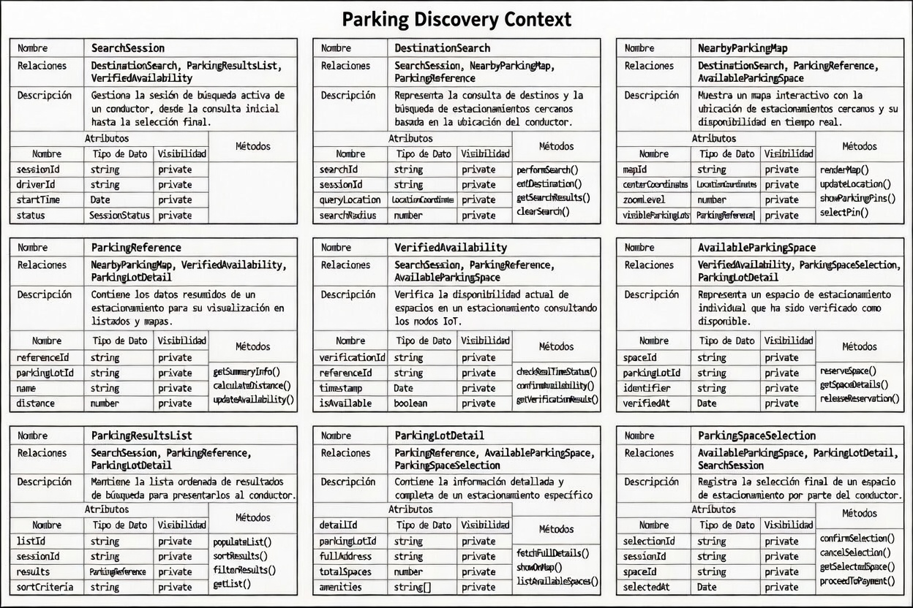

#### Diccionario de clases

##### SearchSession

| Campo | Detalle |
|---|---|
| Nombre | `SearchSession` |
| Relaciones | `DestinationSearch`, `NearbyParkingMap`, `ParkingResultsList` |
| Descripción | Representa una sesión de búsqueda iniciada por el conductor desde la aplicación móvil. |

| Atributo | Tipo de dato | Visibilidad |
|---|---|---|
| `id` | `string` | `private` |
| `driverId` | `string` | `private` |
| `destination` | `DestinationSearch` | `private` |
| `startedAt` | `Date` | `private` |
| `status` | `SearchSessionStatus` | `private` |

| Método | Descripción |
|---|---|
| `startSearch()` | Inicia una búsqueda de estacionamientos cercanos. |
| `updateDestination()` | Actualiza el destino consultado por el conductor. |
| `closeSearch()` | Finaliza la sesión de búsqueda. |
| `getSearchSummary()` | Obtiene el resumen de la búsqueda realizada. |

##### DestinationSearch

| Campo | Detalle |
|---|---|
| Nombre | `DestinationSearch` |
| Relaciones | `SearchSession`, `LocationCoordinates` |
| Descripción | Representa el destino ingresado por el conductor para encontrar estacionamientos cercanos. |

| Atributo | Tipo de dato | Visibilidad |
|---|---|---|
| `id` | `string` | `private` |
| `queryText` | `string` | `private` |
| `coordinates` | `LocationCoordinates` | `private` |
| `resolvedAddress` | `string` | `private` |
| `resolvedAt` | `Date` | `private` |

| Método | Descripción |
|---|---|
| `resolveDestination()` | Convierte el texto ingresado en coordenadas geográficas. |
| `updateCoordinates()` | Actualiza las coordenadas del destino. |
| `getResolvedAddress()` | Devuelve la dirección resuelta del destino. |

##### NearbyParkingMap

| Campo | Detalle |
|---|---|
| Nombre | `NearbyParkingMap` |
| Relaciones | `ParkingReference`, `ParkingResultsList` |
| Descripción | Representa el mapa de estacionamientos cercanos generado a partir del destino del conductor. |

| Atributo | Tipo de dato | Visibilidad |
|---|---|---|
| `id` | `string` | `private` |
| `searchSessionId` | `string` | `private` |
| `centerLocation` | `LocationCoordinates` | `private` |
| `radiusMeters` | `number` | `private` |
| `generatedAt` | `Date` | `private` |

| Método | Descripción |
|---|---|
| `generateNearbyMap()` | Genera el mapa de estacionamientos cercanos. |
| `filterByRadius()` | Filtra referencias según el radio de búsqueda. |
| `getMapResults()` | Obtiene los resultados mostrados en el mapa. |

##### ParkingReference

| Campo | Detalle |
|---|---|
| Nombre | `ParkingReference` |
| Relaciones | `NearbyParkingMap`, `ExternalParkingReference`, `VerifiedAvailability` |
| Descripción | Representa una referencia de estacionamiento encontrada durante la búsqueda, ya sea afiliada o externa. |

| Atributo | Tipo de dato | Visibilidad |
|---|---|---|
| `id` | `string` | `private` |
| `parkingLotId` | `string` | `private` |
| `name` | `string` | `private` |
| `location` | `LocationCoordinates` | `private` |
| `source` | `ParkingReferenceSource` | `private` |
| `availability` | `VerifiedAvailability` | `private` |

| Método | Descripción |
|---|---|
| `markAsAffiliated()` | Marca la referencia como estacionamiento afiliado. |
| `markAsExternal()` | Marca la referencia como estacionamiento externo. |
| `attachAvailability()` | Asocia disponibilidad verificada a la referencia. |
| `getReferenceDetails()` | Obtiene los detalles principales de la referencia. |

##### VerifiedAvailability

| Campo | Detalle |
|---|---|
| Nombre | `VerifiedAvailability` |
| Relaciones | `ParkingReference`, `AvailableParkingSpace` |
| Descripción | Representa la disponibilidad validada de un estacionamiento o espacio a partir de información interna e IoT. |

| Atributo | Tipo de dato | Visibilidad |
|---|---|---|
| `id` | `string` | `private` |
| `parkingLotId` | `string` | `private` |
| `availableSpacesCount` | `number` | `private` |
| `confidenceLevel` | `AvailabilityConfidenceLevel` | `private` |
| `verifiedAt` | `Date` | `private` |

| Método | Descripción |
|---|---|
| `isAvailable()` | Indica si existe disponibilidad para el conductor. |
| `updateAvailability()` | Actualiza la disponibilidad verificada. |
| `degradeAvailability()` | Reduce el nivel de confianza si la información está desactualizada. |
| `getAvailableSpacesCount()` | Devuelve la cantidad de espacios disponibles. |

##### AvailableParkingSpace

| Campo | Detalle |
|---|---|
| Nombre | `AvailableParkingSpace` |
| Relaciones | `VerifiedAvailability`, `ParkingSpaceSelection` |
| Descripción | Representa un espacio disponible que puede ser seleccionado por el conductor. |

| Atributo | Tipo de dato | Visibilidad |
|---|---|---|
| `id` | `string` | `private` |
| `parkingLotId` | `string` | `private` |
| `spaceId` | `string` | `private` |
| `identifier` | `string` | `private` |
| `status` | `AvailabilityStatus` | `private` |

| Método | Descripción |
|---|---|
| `markSelectable()` | Marca el espacio como seleccionable. |
| `markUnavailable()` | Marca el espacio como no disponible. |
| `getSpaceIdentifier()` | Obtiene el identificador visible del espacio. |

##### ParkingResultsList

| Campo | Detalle |
|---|---|
| Nombre | `ParkingResultsList` |
| Relaciones | `SearchSession`, `ParkingReference`, `ParkingLotDetail` |
| Descripción | Representa la lista de resultados de estacionamientos mostrada al conductor. |

| Atributo | Tipo de dato | Visibilidad |
|---|---|---|
| `id` | `string` | `private` |
| `searchSessionId` | `string` | `private` |
| `results` | `List<ParkingReference>` | `private` |
| `sortCriteria` | `ParkingResultSortCriteria` | `private` |
| `generatedAt` | `Date` | `private` |

| Método | Descripción |
|---|---|
| `addResult()` | Agrega una referencia de estacionamiento a la lista. |
| `sortResults()` | Ordena los resultados por distancia, disponibilidad o relevancia. |
| `filterUnavailable()` | Oculta resultados sin disponibilidad utilizable. |
| `getResults()` | Devuelve la lista de resultados disponibles. |

##### ParkingLotDetail

| Campo | Detalle |
|---|---|
| Nombre | `ParkingLotDetail` |
| Relaciones | `ParkingReference`, `VerifiedAvailability`, `AvailableParkingSpace` |
| Descripción | Representa el detalle de un estacionamiento antes de que el conductor seleccione un espacio. |

| Atributo | Tipo de dato | Visibilidad |
|---|---|---|
| `id` | `string` | `private` |
| `parkingLotId` | `string` | `private` |
| `name` | `string` | `private` |
| `address` | `string` | `private` |
| `availability` | `VerifiedAvailability` | `private` |
| `availableSpaces` | `List<AvailableParkingSpace>` | `private` |

| Método | Descripción |
|---|---|
| `loadDetails()` | Carga los datos principales del estacionamiento. |
| `showVerifiedAvailability()` | Muestra disponibilidad verificada. |
| `showAvailableSpaces()` | Muestra los espacios disponibles para selección. |

##### ParkingSpaceSelection

| Campo | Detalle |
|---|---|
| Nombre | `ParkingSpaceSelection` |
| Relaciones | `AvailableParkingSpace`, `Reservation` |
| Descripción | Representa la selección de un espacio disponible por parte del conductor antes de iniciar una reserva. |

| Atributo | Tipo de dato | Visibilidad |
|---|---|---|
| `id` | `string` | `private` |
| `driverId` | `string` | `private` |
| `parkingLotId` | `string` | `private` |
| `spaceId` | `string` | `private` |
| `selectedAt` | `Date` | `private` |

| Método | Descripción |
|---|---|
| `selectSpace()` | Selecciona un espacio disponible. |
| `validateSelection()` | Valida que el espacio siga disponible antes de continuar. |
| `cancelSelection()` | Cancela la selección del espacio. |
| `sendToReservation()` | Envía la selección al contexto de reservas. |

#### 4.2.2.1. Domain Layer

La **Domain Layer** del bounded context **Parking Discovery** representa el núcleo de reglas de negocio relacionadas con la búsqueda, consulta y selección de estacionamientos disponibles dentro de ParkingNow. Esta capa contiene las clases que modelan el proceso mediante el cual un conductor busca estacionamientos cercanos, revisa referencias externas, consulta disponibilidad verificada y selecciona un espacio disponible antes de iniciar una reserva.

En este contexto, el actor principal es el **Driver**, quien utiliza la aplicación móvil para buscar estacionamientos según su destino o ubicación. La capa de dominio permite representar conceptos como la sesión de búsqueda, el destino consultado, el mapa de estacionamientos cercanos, la lista de resultados, la disponibilidad verificada y la selección de espacios. Aunque este contexto consulta información proveniente de **Parking Management**, **IoT Monitoring** y servicios externos como **OpenStreetMap / Overpass API**, la lógica interna de Parking Discovery se mantiene independiente de los detalles técnicos de esas integraciones.

**Figura 58**  
*Parking Discovery Context Domain Layer Diagram*

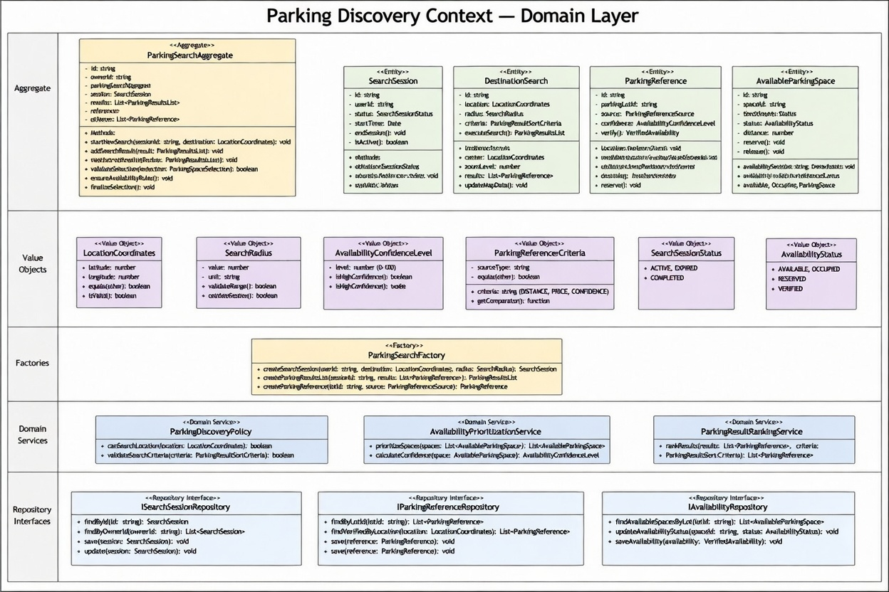

*Nota.* Elaboración propia (2026).

El diseño de dominio de **Parking Discovery** se organiza alrededor del aggregate **ParkingSearchAggregate**, el cual actúa como raíz de consistencia del contexto. Este aggregate agrupa la sesión de búsqueda, el destino ingresado por el conductor, las referencias de estacionamiento encontradas, la disponibilidad verificada y la selección de espacios disponibles.

El aggregate **ParkingSearchAggregate** permite garantizar que las operaciones críticas del contexto se realicen de manera consistente. Por ejemplo, una búsqueda no debe generar resultados sin un destino válido, una referencia externa debe identificarse como auxiliar si no pertenece a la plataforma, la disponibilidad verificada por IoT debe tener prioridad sobre la disponibilidad estática y un espacio solo puede ser seleccionado si se encuentra disponible al momento de la consulta.

Las entidades principales del contexto son **SearchSession**, **DestinationSearch**, **NearbyParkingMap**, **ParkingReference**, **VerifiedAvailability**, **AvailableParkingSpace**, **ParkingResultsList**, **ParkingLotDetail** y **ParkingSpaceSelection**. La entidad **SearchSession** representa la búsqueda iniciada por el conductor. **DestinationSearch** representa el destino o ubicación consultada. **NearbyParkingMap** permite organizar las referencias cercanas dentro de un radio de búsqueda. **ParkingReference** representa un estacionamiento encontrado, ya sea afiliado o externo. **VerifiedAvailability** contiene la disponibilidad validada del estacionamiento. **AvailableParkingSpace** representa un espacio disponible para selección. **ParkingResultsList** organiza los resultados mostrados al conductor. **ParkingLotDetail** muestra información detallada antes de seleccionar un espacio. Finalmente, **ParkingSpaceSelection** representa la selección temporal de un espacio disponible antes de pasar al contexto de reservas.

Los **Value Objects** del contexto permiten encapsular valores relevantes para la búsqueda y la disponibilidad. **LocationCoordinates** representa la ubicación geográfica usada para búsquedas y referencias. **SearchRadius** define el radio de búsqueda permitido. **AvailabilityConfidenceLevel** representa el nivel de confianza de la disponibilidad consultada. **ParkingReferenceSource** diferencia si una referencia proviene de ParkingNow o de un servicio externo. **ParkingResultSortCriteria** define el criterio de ordenamiento de resultados, como distancia, disponibilidad o relevancia. Además, **SearchSessionStatus** y **AvailabilityStatus** restringen los estados válidos dentro del flujo de descubrimiento.

La capa de dominio también incluye la fábrica **ParkingSearchFactory**, encargada de crear sesiones de búsqueda, resultados y selecciones iniciales con valores válidos. Esta fábrica evita que otras capas creen objetos incompletos o inconsistentes.

Asimismo, se definen servicios de dominio como **ParkingDiscoveryPolicy**, **AvailabilityPrioritizationService** y **ParkingResultRankingService**. El primero valida reglas generales de búsqueda y selección. El segundo establece que la disponibilidad verificada por IoT tiene prioridad sobre disponibilidad estática o desactualizada. El tercero ordena los resultados según criterios como cercanía, disponibilidad y relevancia para el conductor.

Finalmente, se definen interfaces de repositorio como **ISearchSessionRepository**, **IParkingReferenceRepository** e **IAvailabilityRepository**. Estas interfaces expresan las operaciones necesarias para guardar sesiones de búsqueda, recuperar referencias y consultar disponibilidad, sin depender de implementaciones técnicas concretas. Las implementaciones reales hacia el Core REST API, PostgreSQL, OpenStreetMap o servicios internos se desarrollan posteriormente en la **Infrastructure Layer**.

La clasificación de clases de la Domain Layer se resume en la siguiente tabla:

| Categoría | Clases |
|---|---|
| Aggregate | `ParkingSearchAggregate` |
| Entities | `SearchSession`, `DestinationSearch`, `NearbyParkingMap`, `ParkingReference`, `VerifiedAvailability`, `AvailableParkingSpace`, `ParkingResultsList`, `ParkingLotDetail`, `ParkingSpaceSelection` |
| Value Objects | `LocationCoordinates`, `SearchRadius`, `AvailabilityConfidenceLevel`, `ParkingReferenceSource`, `ParkingResultSortCriteria`, `SearchSessionStatus`, `AvailabilityStatus` |
| Factory | `ParkingSearchFactory` |
| Domain Services | `ParkingDiscoveryPolicy`, `AvailabilityPrioritizationService`, `ParkingResultRankingService` |
| Repository Interfaces | `ISearchSessionRepository`, `IParkingReferenceRepository`, `IAvailabilityRepository` |

##### Aggregate

| Clase | Responsabilidad |
|---|---|
| `ParkingSearchAggregate` | Actuar como raíz de consistencia del contexto, agrupando la sesión de búsqueda, el destino, las referencias, la disponibilidad verificada y la selección del espacio. |

El aggregate **ParkingSearchAggregate** asegura que las operaciones internas del contexto respeten las reglas del negocio. Por ejemplo, impide generar resultados sin una búsqueda válida, evita mostrar disponibilidad desactualizada como información principal y valida que un espacio solo pueda seleccionarse si se encuentra disponible.

##### Entities

| Clase | Responsabilidad |
|---|---|
| `SearchSession` | Representar la sesión de búsqueda iniciada por el conductor. |
| `DestinationSearch` | Representar el destino o ubicación ingresada por el conductor. |
| `NearbyParkingMap` | Representar el mapa de estacionamientos cercanos al destino consultado. |
| `ParkingReference` | Representar una referencia de estacionamiento encontrada, afiliada o externa. |
| `VerifiedAvailability` | Representar la disponibilidad validada de un estacionamiento o espacio. |
| `AvailableParkingSpace` | Representar un espacio disponible para ser seleccionado. |
| `ParkingResultsList` | Organizar la lista de resultados mostrados al conductor. |
| `ParkingLotDetail` | Representar el detalle de un estacionamiento antes de seleccionar un espacio. |
| `ParkingSpaceSelection` | Representar la selección temporal de un espacio disponible antes de generar una reserva. |

Las entidades poseen identidad propia y pueden cambiar durante el flujo de búsqueda. Por ejemplo, una **SearchSession** puede pasar de activa a cerrada, una **ParkingReference** puede enriquecerse con disponibilidad verificada y una **ParkingSpaceSelection** puede confirmarse o cancelarse antes de iniciar la reserva.

##### Value Objects

| Clase | Responsabilidad |
|---|---|
| `LocationCoordinates` | Encapsular latitud y longitud del destino o estacionamiento. |
| `SearchRadius` | Definir el radio permitido para buscar estacionamientos cercanos. |
| `AvailabilityConfidenceLevel` | Representar el nivel de confianza de la disponibilidad consultada. |
| `ParkingReferenceSource` | Identificar si la referencia proviene de ParkingNow o de un servicio externo. |
| `ParkingResultSortCriteria` | Definir el criterio de ordenamiento de resultados. |
| `SearchSessionStatus` | Definir los estados válidos de una sesión de búsqueda. |
| `AvailabilityStatus` | Definir los estados válidos de disponibilidad de un espacio. |

Los value objects no tienen identidad propia y se comparan por sus valores. Esto permite mantener consistencia en datos como coordenadas, radio de búsqueda, fuente de referencia y nivel de confianza de disponibilidad.

##### Factory

| Clase | Responsabilidad |
|---|---|
| `ParkingSearchFactory` | Crear sesiones de búsqueda, resultados y selecciones con valores iniciales válidos. |

La fábrica evita que otras capas creen objetos del dominio de manera incompleta. Por ejemplo, una sesión de búsqueda debe tener conductor, destino y estado inicial válido antes de generar resultados.

##### Domain Services

| Clase | Responsabilidad |
|---|---|
| `ParkingDiscoveryPolicy` | Validar reglas generales para búsqueda, visualización y selección de estacionamientos. |
| `AvailabilityPrioritizationService` | Priorizar la disponibilidad verificada por IoT sobre información estática o desactualizada. |
| `ParkingResultRankingService` | Ordenar resultados según distancia, disponibilidad, relevancia o criterios definidos. |

Los servicios de dominio representan reglas que no pertenecen naturalmente a una sola entidad. En este contexto, priorizar disponibilidad, ordenar resultados y validar selección requiere evaluar información de diferentes entidades, por lo que se modelan como servicios de dominio.

##### Repository Interfaces

| Interfaz | Responsabilidad |
|---|---|
| `ISearchSessionRepository` | Definir operaciones de persistencia para sesiones de búsqueda. |
| `IParkingReferenceRepository` | Definir operaciones de consulta y persistencia de referencias de estacionamiento. |
| `IAvailabilityRepository` | Definir operaciones de consulta de disponibilidad verificada y espacios disponibles. |

Estas interfaces permiten que la capa de dominio exprese sus necesidades de persistencia y consulta sin depender de tecnologías concretas. Las implementaciones hacia bases de datos, APIs externas o servicios internos se ubican en la **Infrastructure Layer**.

En conclusión, la **Domain Layer** de **Parking Discovery** concentra las reglas puras relacionadas con la búsqueda y selección de estacionamientos. Esta capa permite que el conductor consulte opciones cercanas, revise disponibilidad verificada y seleccione un espacio de forma consistente, manteniendo el modelo del dominio independiente de detalles técnicos como APIs externas, base de datos o frameworks.

#### 4.2.2.2. Interface Layer

La **Interface Layer** del bounded context **Parking Discovery** representa el punto de entrada para las operaciones relacionadas con la búsqueda de estacionamientos, consulta de disponibilidad y selección de espacios por parte del **Driver**. Esta capa recibe solicitudes desde la **Mobile App**, así como posibles eventos provenientes de otros contextos, y se encarga de transformarlas en comandos o queries que serán procesados por la **Application Layer**.

En esta capa no se implementan reglas de negocio. Su responsabilidad es validar superficialmente los datos de entrada, mapear requests hacia objetos del dominio (comandos o queries) y delegar la ejecución a la capa de aplicación. De esta forma, se mantiene una separación clara entre la interfaz de usuario y la lógica del dominio.

**Figura 59**  
*Parking Discovery Context Interface Layer Diagram*

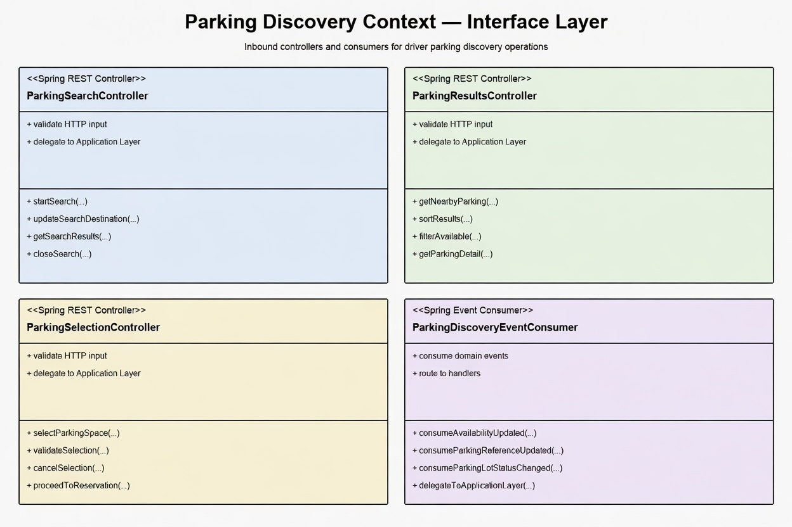

*Nota.* Elaboración propia (2026).

La Interface Layer de **Parking Discovery** está compuesta principalmente por controladores REST que exponen funcionalidades para iniciar búsquedas, consultar resultados, revisar detalles de estacionamientos y seleccionar espacios disponibles. Además, puede incluir consumidores de eventos para reaccionar ante cambios relevantes en disponibilidad o referencias externas.

##### ParkingSearchController

La clase `ParkingSearchController` expone las operaciones principales relacionadas con la búsqueda de estacionamientos cercanos. Este controlador recibe solicitudes del conductor cuando inicia una búsqueda o actualiza su destino.

| Método | Responsabilidad |
|---|---|
| `startSearch(request: StartSearchRequest): SearchSessionResponse` | Inicia una nueva sesión de búsqueda con el destino ingresado por el conductor. |
| `updateSearchDestination(searchId: string, request: UpdateDestinationRequest): SearchSessionResponse` | Actualiza el destino de una búsqueda activa. |
| `getSearchResults(searchId: string): ParkingResultsResponse` | Obtiene la lista de resultados de estacionamientos cercanos. |
| `closeSearch(searchId: string): void` | Finaliza una sesión de búsqueda activa. |

Este controlador actúa como el primer punto de interacción del conductor con el sistema de descubrimiento.

##### ParkingResultsController

La clase `ParkingResultsController` permite gestionar y consultar los resultados generados durante una búsqueda. Este controlador se encarga de devolver información organizada y filtrada al conductor.

| Método | Responsabilidad |
|---|---|
| `getNearbyParking(searchId: string): List<ParkingReferenceResponse>` | Obtiene los estacionamientos cercanos generados en la búsqueda. |
| `sortResults(searchId: string, criteria: SortCriteriaRequest): List<ParkingReferenceResponse>` | Ordena los resultados según distancia, disponibilidad u otros criterios. |
| `filterAvailable(searchId: string): List<ParkingReferenceResponse>` | Filtra los resultados mostrando solo estacionamientos disponibles. |
| `getParkingDetail(parkingLotId: string): ParkingLotDetailResponse` | Obtiene el detalle completo de un estacionamiento. |

Este controlador permite que la experiencia del usuario sea dinámica, ajustando resultados según preferencias o condiciones de disponibilidad.

##### ParkingSelectionController

La clase `ParkingSelectionController` expone las operaciones relacionadas con la selección de espacios disponibles dentro de un estacionamiento.

| Método | Responsabilidad |
|---|---|
| `selectParkingSpace(request: SelectParkingSpaceRequest): ParkingSelectionResponse` | Permite al conductor seleccionar un espacio disponible. |
| `validateSelection(selectionId: string): ValidationResponse` | Verifica que el espacio seleccionado siga disponible. |
| `cancelSelection(selectionId: string): void` | Cancela la selección realizada por el conductor. |
| `proceedToReservation(selectionId: string): void` | Envía la selección al contexto de reservas para continuar el flujo. |

Este controlador asegura que la selección del espacio sea válida antes de pasar a la siguiente etapa del proceso.

##### ParkingDiscoveryEventConsumer

La clase `ParkingDiscoveryEventConsumer` permite que el bounded context **Parking Discovery** reciba eventos provenientes de otros contextos, principalmente relacionados con disponibilidad y cambios en referencias externas.

| Método | Responsabilidad |
|---|---|
| `consumeAvailabilityUpdated(event: AvailabilityUpdatedEvent): void` | Recibe actualizaciones de disponibilidad desde IoT Monitoring. |
| `consumeParkingReferenceUpdated(event: ParkingReferenceUpdatedEvent): void` | Recibe actualizaciones de referencias externas o internas. |
| `consumeParkingLotStatusChanged(event: ParkingLotStatusChangedEvent): void` | Recibe cambios en el estado de estacionamientos desde Parking Management. |
| `delegateToApplicationLayer(event: DomainEvent): void` | Delega el procesamiento del evento a la capa de aplicación. |

Este componente permite mantener sincronizada la información mostrada al conductor sin acoplar directamente las reglas de negocio entre contextos.

##### Resumen de la Interface Layer

| Componente | Tipo | Responsabilidad |
|---|---|---|
| `ParkingSearchController` | REST Controller | Gestionar la creación y control de sesiones de búsqueda. |
| `ParkingResultsController` | REST Controller | Gestionar la consulta, filtrado y ordenamiento de resultados. |
| `ParkingSelectionController` | REST Controller | Gestionar la selección de espacios disponibles. |
| `ParkingDiscoveryEventConsumer` | Event Consumer | Procesar eventos externos relacionados con disponibilidad y referencias. |

En conclusión, la **Interface Layer** de **Parking Discovery** actúa como una frontera de entrada entre el usuario (Driver) y el sistema. Esta capa permite recibir solicitudes desde la aplicación móvil y eventos desde otros contextos, manteniendo los controladores simples y delegando toda la lógica al nivel de aplicación. Esto garantiza una arquitectura desacoplada, clara y alineada con los principios de Domain-Driven Design.

#### 4.2.2.3. Application Layer

La **Application Layer** del bounded context **Parking Discovery** contiene las clases encargadas de orquestar los casos de uso relacionados con la búsqueda de estacionamientos, consulta de disponibilidad y selección de espacios por parte del **Driver**. Esta capa actúa como intermediaria entre la **Interface Layer**, que recibe las solicitudes desde la aplicación móvil, y la **Domain Layer**, donde se encuentran las reglas de negocio puras.

En este contexto, la capa de aplicación procesa comandos generados por acciones del conductor, como iniciar una búsqueda, actualizar un destino, consultar resultados, visualizar detalles de un estacionamiento y seleccionar un espacio disponible. Asimismo, también puede procesar eventos provenientes de otros bounded contexts, como actualizaciones de disponibilidad desde **IoT Monitoring** o cambios de estado desde **Parking Management**. Sin embargo, esta capa no contiene lógica de negocio compleja; su responsabilidad es coordinar el flujo, invocar servicios del dominio y utilizar interfaces de repositorio.

**Figura 60**  
*Parking Discovery Context Application Layer Diagram*

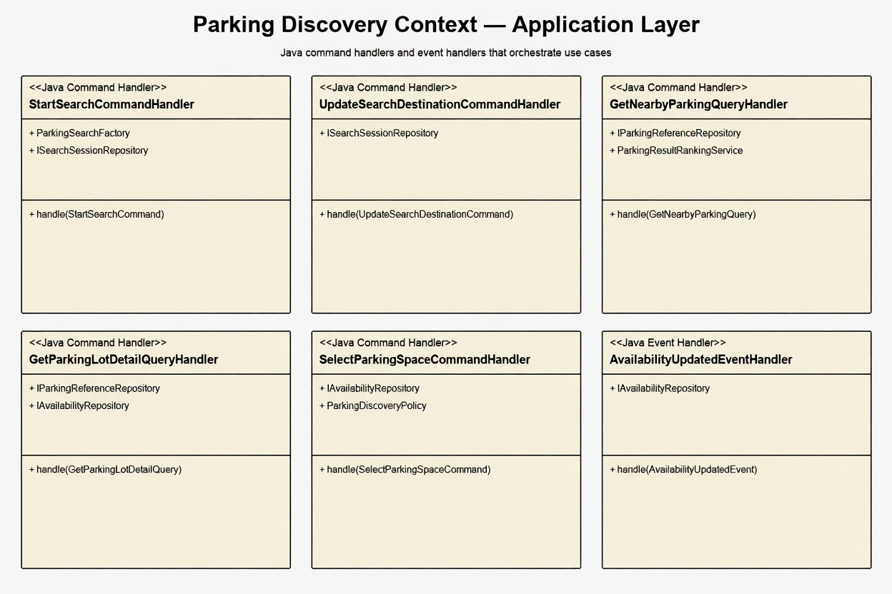

*Nota.* Elaboración propia (2026).

La **Application Layer** de **Parking Discovery** está compuesta por command handlers, query handlers y event handlers, los cuales ejecutan y coordinan los diferentes casos de uso del contexto.

##### StartSearchCommandHandler

La clase `StartSearchCommandHandler` orquesta el inicio de una sesión de búsqueda de estacionamientos. Recibe el destino ingresado por el conductor, utiliza la fábrica del dominio para crear una nueva sesión y la persiste mediante el repositorio correspondiente.

| Elemento | Detalle |
|---|---|
| Clase | `StartSearchCommandHandler` |
| Tipo | Command Handler |
| Dependencias | `ParkingSearchFactory`, `ISearchSessionRepository` |
| Método principal | `handle(command: StartSearchCommand): SearchSession` |
| Responsabilidad | Coordinar la creación de una nueva sesión de búsqueda para el conductor. |

Este handler asegura que la búsqueda inicie con un estado válido, delegando la construcción al dominio.

##### UpdateSearchDestinationCommandHandler

La clase `UpdateSearchDestinationCommandHandler` permite actualizar el destino de una búsqueda activa. Recupera la sesión existente y delega la actualización al dominio.

| Elemento | Detalle |
|---|---|
| Clase | `UpdateSearchDestinationCommandHandler` |
| Tipo | Command Handler |
| Dependencias | `ISearchSessionRepository` |
| Método principal | `handle(command: UpdateSearchDestinationCommand): SearchSession` |
| Responsabilidad | Coordinar la actualización del destino de una búsqueda en curso. |

##### GetNearbyParkingQueryHandler

La clase `GetNearbyParkingQueryHandler` orquesta la obtención de estacionamientos cercanos a partir de un destino. Consulta referencias internas y externas, y construye la lista de resultados.

| Elemento | Detalle |
|---|---|
| Clase | `GetNearbyParkingQueryHandler` |
| Tipo | Query Handler |
| Dependencias | `IParkingReferenceRepository`, `ParkingResultRankingService` |
| Método principal | `handle(query: GetNearbyParkingQuery): List<ParkingReference>` |
| Responsabilidad | Obtener y organizar los estacionamientos cercanos al destino del conductor. |

Este handler no define cómo ordenar resultados, sino que utiliza servicios de dominio para ello.

##### GetParkingLotDetailQueryHandler

La clase `GetParkingLotDetailQueryHandler` permite consultar el detalle completo de un estacionamiento antes de seleccionar un espacio.

| Elemento | Detalle |
|---|---|
| Clase | `GetParkingLotDetailQueryHandler` |
| Tipo | Query Handler |
| Dependencias | `IParkingReferenceRepository`, `IAvailabilityRepository` |
| Método principal | `handle(query: GetParkingLotDetailQuery): ParkingLotDetail` |
| Responsabilidad | Obtener la información detallada de un estacionamiento, incluyendo disponibilidad. |

##### SelectParkingSpaceCommandHandler

La clase `SelectParkingSpaceCommandHandler` orquesta la selección de un espacio disponible por parte del conductor. Valida la disponibilidad antes de confirmar la selección.

| Elemento | Detalle |
|---|---|
| Clase | `SelectParkingSpaceCommandHandler` |
| Tipo | Command Handler |
| Dependencias | `IAvailabilityRepository`, `ParkingDiscoveryPolicy` |
| Método principal | `handle(command: SelectParkingSpaceCommand): ParkingSpaceSelection` |
| Responsabilidad | Coordinar la selección de un espacio disponible dentro de un estacionamiento. |

Este handler asegura que el espacio esté disponible al momento de la selección.

##### ValidateSelectionCommandHandler

La clase `ValidateSelectionCommandHandler` valida que un espacio previamente seleccionado siga disponible antes de continuar hacia la reserva.

| Elemento | Detalle |
|---|---|
| Clase | `ValidateSelectionCommandHandler` |
| Tipo | Command Handler |
| Dependencias | `IAvailabilityRepository` |
| Método principal | `handle(command: ValidateSelectionCommand): ValidationResult` |
| Responsabilidad | Verificar que el espacio seleccionado sigue disponible. |

##### AvailabilityUpdatedEventHandler

La clase `AvailabilityUpdatedEventHandler` procesa eventos provenientes de **IoT Monitoring**, reflejando cambios en la disponibilidad de estacionamientos o espacios.

| Elemento | Detalle |
|---|---|
| Clase | `AvailabilityUpdatedEventHandler` |
| Tipo | Event Handler |
| Dependencias | `IAvailabilityRepository` |
| Método principal | `handle(event: AvailabilityUpdatedEvent): void` |
| Responsabilidad | Actualizar la disponibilidad en el contexto de descubrimiento. |

##### ParkingLotStatusChangedEventHandler

La clase `ParkingLotStatusChangedEventHandler` procesa eventos provenientes de **Parking Management**, reflejando cambios en el estado de estacionamientos.

| Elemento | Detalle |
|---|---|
| Clase | `ParkingLotStatusChangedEventHandler` |
| Tipo | Event Handler |
| Dependencias | `IParkingReferenceRepository` |
| Método principal | `handle(event: ParkingLotStatusChangedEvent): void` |
| Responsabilidad | Actualizar el estado de las referencias de estacionamientos. |

##### Resumen de clases de la Application Layer

| Clase | Tipo | Responsabilidad |
|---|---|---|
| `StartSearchCommandHandler` | Command Handler | Iniciar una sesión de búsqueda. |
| `UpdateSearchDestinationCommandHandler` | Command Handler | Actualizar el destino de búsqueda. |
| `GetNearbyParkingQueryHandler` | Query Handler | Obtener estacionamientos cercanos. |
| `GetParkingLotDetailQueryHandler` | Query Handler | Obtener detalles de un estacionamiento. |
| `SelectParkingSpaceCommandHandler` | Command Handler | Seleccionar un espacio disponible. |
| `ValidateSelectionCommandHandler` | Command Handler | Validar selección antes de reservar. |
| `AvailabilityUpdatedEventHandler` | Event Handler | Procesar cambios de disponibilidad. |
| `ParkingLotStatusChangedEventHandler` | Event Handler | Procesar cambios de estado de estacionamientos. |

En conclusión, la **Application Layer** de **Parking Discovery** se encarga de coordinar los casos de uso del sistema, sin implementar reglas de negocio complejas. Esta capa recibe comandos y queries desde la interfaz, invoca servicios del dominio y utiliza repositorios para acceder a datos, manteniendo una arquitectura clara, desacoplada y alineada con Domain-Driven Design.

#### 4.2.2.4. Infrastructure Layer

La **Infrastructure Layer** del bounded context **Parking Discovery** contiene las clases técnicas encargadas de conectar las reglas del dominio con servicios externos, fuentes de datos y mecanismos de persistencia. En esta capa se implementan las interfaces definidas en la **Domain Layer**, principalmente los repositorios de sesiones de búsqueda, referencias de estacionamientos y disponibilidad.

A diferencia de la capa de dominio, esta capa sí depende de tecnologías concretas. En el caso de ParkingNow, **Parking Discovery** interactúa con múltiples fuentes: el **Core REST API (Spring Boot)** para obtener estacionamientos registrados, el contexto **IoT Monitoring** para consultar disponibilidad verificada y servicios externos como **OpenStreetMap / Nominatim / Overpass API** para resolver ubicaciones y referencias cercanas. Además, puede utilizar una base de datos como **PostgreSQL (Supabase)** para persistir sesiones de búsqueda o resultados temporales.

**Figura 61**  
*Parking Discovery Context Infrastructure Layer Diagram*

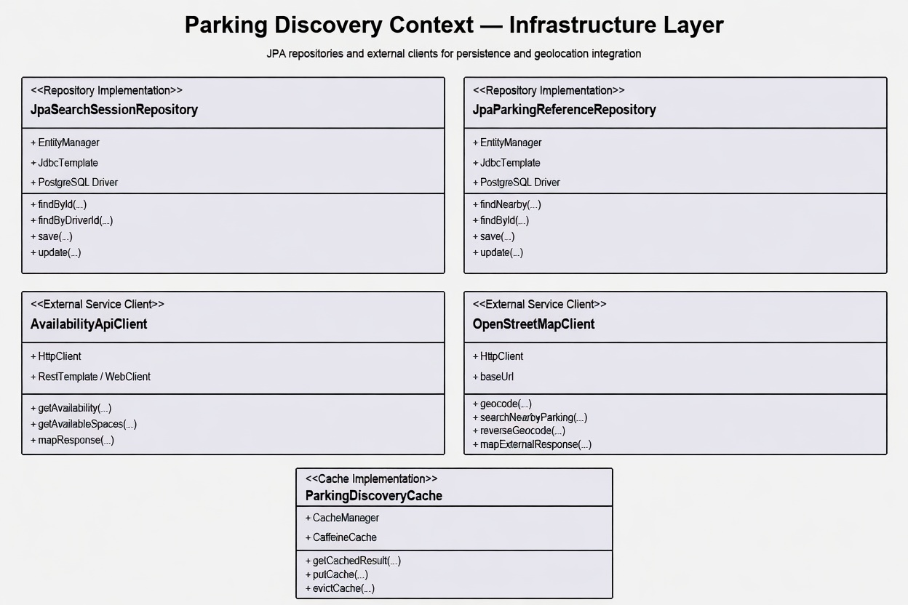

La **Infrastructure Layer** no contiene reglas de negocio; su responsabilidad es ejecutar operaciones técnicas como consumo de APIs, consultas a base de datos, mapeo de respuestas externas y adaptación de datos hacia el modelo del dominio.

##### JpaSearchSessionRepository

La clase `JpaSearchSessionRepository` implementa la persistencia concreta de las sesiones de búsqueda iniciadas por los conductores.

| Elemento | Detalle |
|---|---|
| Clase | `JpaSearchSessionRepository` |
| Tipo | Repository Implementation |
| Implementa | `ISearchSessionRepository` |
| Dependencia principal | `Spring Data JPA / PostgreSQL Driver` |
| Responsabilidad | Persistir y recuperar sesiones de búsqueda del conductor. |

| Método | Responsabilidad |
|---|---|
| `findById(searchId: string): SearchSession` | Busca una sesión de búsqueda por su identificador. |
| `findByDriverId(driverId: string): List<SearchSession>` | Obtiene las búsquedas realizadas por un conductor. |
| `save(session: SearchSession): void` | Guarda una nueva sesión de búsqueda. |
| `update(session: SearchSession): void` | Actualiza una sesión existente. |
| `deleteById(searchId: string): void` | Elimina o cierra una sesión de búsqueda. |

##### JpaParkingReferenceRepository

La clase `JpaParkingReferenceRepository` implementa la persistencia de referencias de estacionamientos afiliados dentro del sistema.

| Elemento | Detalle |
|---|---|
| Clase | `JpaParkingReferenceRepository` |
| Tipo | Repository Implementation |
| Implementa | `IParkingReferenceRepository` |
| Dependencia principal | `Spring Data JPA / PostgreSQL Driver` |
| Responsabilidad | Persistir y consultar referencias internas de estacionamientos. |

| Método | Responsabilidad |
|---|---|
| `findNearby(coordinates: LocationCoordinates, radius: number): List<ParkingReference>` | Obtiene estacionamientos cercanos registrados en ParkingNow. |
| `findById(parkingLotId: string): ParkingReference` | Busca una referencia específica. |
| `save(reference: ParkingReference): void` | Guarda una referencia interna. |
| `update(reference: ParkingReference): void` | Actualiza información de referencia. |

##### AvailabilityApiClient

La clase `AvailabilityApiClient` representa el cliente encargado de consultar la disponibilidad verificada desde el bounded context **IoT Monitoring** o desde el Core API.

| Elemento | Detalle |
|---|---|
| Clase | `AvailabilityApiClient` |
| Tipo | External Service Client |
| Dependencias principales | `HttpClient`, `REST API` |
| Responsabilidad | Consultar disponibilidad de estacionamientos y espacios en tiempo real. |

| Método | Responsabilidad |
|---|---|
| `getAvailability(parkingLotId: string): VerifiedAvailability` | Obtiene la disponibilidad de un estacionamiento. |
| `getAvailableSpaces(parkingLotId: string): List<AvailableParkingSpace>` | Obtiene espacios disponibles dentro de un estacionamiento. |
| `mapResponse(response: object): VerifiedAvailability` | Convierte la respuesta externa al modelo del dominio. |

Este cliente permite desacoplar el dominio de la estructura de la API de IoT Monitoring.

##### OpenStreetMapClient

La clase `OpenStreetMapClient` permite interactuar con servicios externos para resolver destinos y obtener referencias de estacionamientos cercanos no afiliados.

| Elemento | Detalle |
|---|---|
| Clase | `OpenStreetMapClient` |
| Tipo | External Service Client |
| Dependencias principales | `HttpClient`, `OpenStreetMap API`, `Nominatim`, `Overpass API` |
| Responsabilidad | Resolver ubicaciones y obtener referencias externas de estacionamientos. |

| Método | Responsabilidad |
|---|---|
| `geocode(query: string): LocationCoordinates` | Convierte texto de búsqueda en coordenadas geográficas. |
| `searchNearbyParking(coordinates: LocationCoordinates): List<ExternalParkingReference>` | Obtiene referencias externas cercanas. |
| `reverseGeocode(lat: number, lon: number): string` | Obtiene dirección a partir de coordenadas. |
| `mapExternalResponse(response: object): List<ParkingReference>` | Convierte datos externos al modelo del dominio. |

##### ParkingDiscoveryCache

La clase `ParkingDiscoveryCache` permite almacenar temporalmente resultados de búsqueda para mejorar el rendimiento y reducir llamadas a servicios externos.

| Elemento | Detalle |
|---|---|
| Clase | `ParkingDiscoveryCache` |
| Tipo | Cache Component |
| Dependencias principales | `Redis / In-Memory Cache` |
| Responsabilidad | Almacenar resultados de búsqueda y disponibilidad temporalmente. |

| Método | Responsabilidad |
|---|---|
| `getCachedResults(key: string): ParkingResultsList` | Obtiene resultados desde caché. |
| `storeResults(key: string, results: ParkingResultsList): void` | Guarda resultados en caché. |
| `invalidateCache(key: string): void` | Invalida resultados desactualizados. |

##### Resumen de clases de la Infrastructure Layer

| Clase | Tipo | Responsabilidad |
|---|---|---|
| `JpaSearchSessionRepository` | Repository Implementation | Persistir sesiones de búsqueda. |
| `JpaParkingReferenceRepository` | Repository Implementation | Persistir y consultar referencias internas. |
| `AvailabilityApiClient` | External Service Client | Consultar disponibilidad en tiempo real. |
| `OpenStreetMapClient` | External Service Client | Resolver ubicaciones y referencias externas. |
| `ParkingDiscoveryCache` | Cache Component | Optimizar rendimiento mediante caché de resultados. |

En conclusión, la **Infrastructure Layer** de **Parking Discovery** permite integrar el contexto con múltiples fuentes de información sin afectar el dominio. Esta capa implementa repositorios, clientes de APIs y mecanismos de caché, asegurando que el sistema pueda consultar datos en tiempo real, combinar información interna y externa, y ofrecer resultados eficientes al conductor, manteniendo una arquitectura desacoplada y alineada con Domain-Driven Design.

#### 4.2.2.5. Bounded Context Software Architecture Component Level Diagrams

El **Bounded Context Software Architecture Component Level Diagram** permite representar cómo se organizan e interactúan los componentes internos del bounded context **Parking Discovery** dentro del contenedor **Core REST API**. Este diagrama corresponde al nivel 3 del modelo C4, por lo que muestra componentes de software con responsabilidades claras, sin llegar todavía al detalle de clases, métodos internos o tablas de base de datos.

Para ParkingNow, el bounded context **Parking Discovery** se implementa principalmente dentro del **Core REST API**, desarrollado con **Java, Spring Boot, RESTful API y documentación OpenAPI Specification mediante Swagger**. Este contexto recibe solicitudes desde la **Driver Mobile App**, permite iniciar búsquedas de estacionamientos, consultar resultados cercanos, obtener detalles de estacionamientos, validar disponibilidad y seleccionar un espacio antes de continuar hacia el flujo de reserva.

**Figura 62**  
*Parking Discovery Context Component Level Diagram*

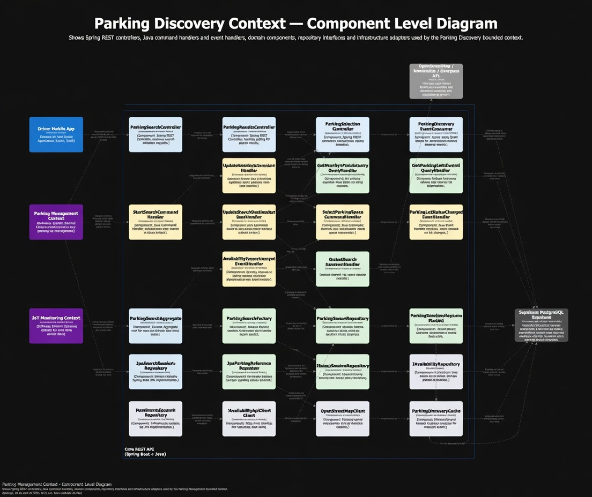

*Nota.* Elaboración propia (2026) usando Structurizr DSL.

Además, este contexto se integra con otros bounded contexts y servicios externos. Desde **Parking Management** obtiene información de estacionamientos registrados y activos. Desde **IoT Monitoring** obtiene disponibilidad actualizada o verificada mediante sensores. Desde servicios externos como **OpenStreetMap / Nominatim / Overpass API**, puede resolver destinos, coordenadas y referencias externas de estacionamientos cercanos.

El objetivo del diagrama de componentes es mostrar cómo **Parking Discovery** separa la recepción de solicitudes, la orquestación de casos de uso, las reglas de dominio y los detalles técnicos de infraestructura. Esta organización mantiene una arquitectura limpia y facilita la futura implementación del contexto en el backend.

Según el diseño propuesto, el bounded context **Parking Discovery** se organiza en cuatro capas principales: **Interface Layer**, **Application Layer**, **Domain Layer** e **Infrastructure Layer**.

##### Interface Layer

La **Interface Layer** representa la entrada al bounded context. En esta capa se ubican los controladores REST y consumidores de eventos que reciben solicitudes desde la aplicación móvil del conductor o eventos provenientes de otros contextos.

| Componente | Responsabilidad |
|---|---|
| `ParkingSearchController` | Recibe solicitudes para iniciar, actualizar o cerrar una sesión de búsqueda de estacionamientos. |
| `ParkingResultsController` | Expone operaciones para consultar estacionamientos cercanos, filtrar resultados y obtener detalles de estacionamientos. |
| `ParkingSelectionController` | Recibe solicitudes para seleccionar un espacio disponible y validar la selección antes de reservar. |
| `ParkingDiscoveryEventConsumer` | Recibe eventos externos relacionados con disponibilidad, cambios de estado de estacionamientos o referencias actualizadas. |

El componente `ParkingSearchController` es utilizado cuando el conductor inicia una búsqueda desde la aplicación móvil. Por ejemplo, cuando el usuario ingresa un destino o usa su ubicación actual, este controlador recibe la solicitud y la delega a la capa de aplicación.

El componente `ParkingResultsController` permite consultar los resultados generados durante la búsqueda. Este componente devuelve al conductor una lista de estacionamientos cercanos, ordenados por criterios como distancia, disponibilidad o relevancia.

El componente `ParkingSelectionController` participa cuando el conductor decide elegir un espacio disponible. Su función es recibir la selección y solicitar la validación correspondiente antes de enviar el flujo hacia el contexto de reservas.

El componente `ParkingDiscoveryEventConsumer` permite que el contexto reaccione ante eventos externos, como cambios en la disponibilidad reportados por **IoT Monitoring** o cambios de estado de estacionamientos reportados por **Parking Management**.

##### Application Layer

La **Application Layer** contiene los componentes que orquestan los casos de uso del bounded context. Estos componentes no contienen reglas de negocio puras, sino que coordinan comandos, queries, servicios de dominio y repositorios.

| Componente | Responsabilidad |
|---|---|
| `StartSearchCommandHandler` | Coordina el inicio de una nueva sesión de búsqueda para el conductor. |
| `UpdateSearchDestinationCommandHandler` | Coordina la actualización del destino de una búsqueda activa. |
| `GetNearbyParkingQueryHandler` | Obtiene estacionamientos cercanos combinando referencias internas y externas. |
| `GetParkingLotDetailQueryHandler` | Recupera el detalle de un estacionamiento, incluyendo disponibilidad y espacios disponibles. |
| `SelectParkingSpaceCommandHandler` | Coordina la selección de un espacio disponible por parte del conductor. |
| `ValidateSelectionCommandHandler` | Verifica que el espacio seleccionado siga disponible antes de continuar con la reserva. |
| `AvailabilityUpdatedEventHandler` | Procesa eventos de disponibilidad provenientes de IoT Monitoring. |
| `ParkingLotStatusChangedEventHandler` | Procesa eventos de cambios de estado provenientes de Parking Management. |

El componente `StartSearchCommandHandler` recibe la solicitud de inicio de búsqueda desde `ParkingSearchController`. Luego utiliza la fábrica del dominio para crear una sesión válida y la persiste mediante el repositorio correspondiente.

El componente `GetNearbyParkingQueryHandler` representa uno de los casos de uso más importantes del contexto. Su responsabilidad es obtener estacionamientos cercanos al destino del conductor, combinando datos internos de ParkingNow con referencias externas y aplicando criterios de ordenamiento.

El componente `GetParkingLotDetailQueryHandler` permite cargar la información específica de un estacionamiento antes de que el conductor tome una decisión. Esta información puede incluir nombre, dirección, ubicación, disponibilidad verificada y espacios disponibles.

El componente `SelectParkingSpaceCommandHandler` se activa cuando el conductor selecciona un espacio. Este handler valida la selección utilizando las reglas del dominio y consulta la disponibilidad más reciente antes de permitir continuar hacia el flujo de reserva.

Los event handlers permiten mantener actualizada la información de descubrimiento sin mezclar responsabilidades entre contextos. Por ejemplo, si **IoT Monitoring** reporta que un espacio cambió a ocupado, `AvailabilityUpdatedEventHandler` actualiza la disponibilidad que luego verá el conductor en la aplicación móvil.

##### Domain Layer

La **Domain Layer** contiene los componentes que representan el núcleo del negocio dentro del contexto **Parking Discovery**. Aquí se ubican el aggregate, la fábrica, los servicios de dominio y las interfaces de repositorio.

| Componente | Responsabilidad |
|---|---|
| `ParkingSearchAggregate` | Mantiene la consistencia de la sesión de búsqueda, destino, resultados, disponibilidad y selección. |
| `ParkingSearchFactory` | Crea sesiones de búsqueda, resultados y selecciones con valores iniciales válidos. |
| `ParkingDiscoveryPolicy` | Valida reglas de búsqueda, visualización y selección de estacionamientos. |
| `AvailabilityPrioritizationService` | Prioriza disponibilidad verificada por IoT sobre información estática o desactualizada. |
| `ParkingResultRankingService` | Ordena resultados por distancia, disponibilidad, relevancia o criterios definidos. |
| `ISearchSessionRepository` | Define operaciones necesarias para persistir sesiones de búsqueda. |
| `IParkingReferenceRepository` | Define operaciones para consultar referencias de estacionamientos. |
| `IAvailabilityRepository` | Define operaciones para consultar disponibilidad verificada y espacios disponibles. |

El componente `ParkingSearchAggregate` actúa como raíz de consistencia del contexto. Permite asegurar que una búsqueda tenga un destino válido, que los resultados estén asociados a una sesión activa y que una selección de espacio solo ocurra cuando exista disponibilidad.

El componente `ParkingDiscoveryPolicy` define reglas del dominio como validar que una búsqueda tenga coordenadas correctas, que un resultado sea mostrable al conductor o que una selección no continúe si el espacio ya no está disponible.

El componente `AvailabilityPrioritizationService` es importante porque el sistema puede recibir disponibilidad desde distintas fuentes. Cuando exista información verificada por sensores IoT, esta debe tener mayor prioridad que información estática o externa.

El componente `ParkingResultRankingService` permite ordenar los resultados que ve el conductor. Por ejemplo, puede priorizar estacionamientos más cercanos, con mayor disponibilidad o con mejor relevancia según el destino ingresado.

Las interfaces de repositorio expresan contratos que necesita el dominio, pero no definen cómo se implementa la persistencia ni de dónde provienen los datos. Esa responsabilidad pertenece a la capa de infraestructura.

##### Infrastructure Layer

La **Infrastructure Layer** contiene los adaptadores técnicos necesarios para persistir datos y conectarse con servicios externos. Esta capa implementa las interfaces definidas en la capa de dominio y encapsula detalles técnicos de base de datos, APIs externas, caché y comunicación HTTP.

| Componente | Responsabilidad |
|---|---|
| `JpaSearchSessionRepository` | Implementa la persistencia de sesiones de búsqueda en PostgreSQL / Supabase. |
| `JpaParkingReferenceRepository` | Consulta y persiste referencias internas de estacionamientos registrados. |
| `AvailabilityApiClient` | Consulta disponibilidad en tiempo real desde IoT Monitoring o servicios internos. |
| `OpenStreetMapClient` | Resuelve destinos, coordenadas y referencias externas usando OpenStreetMap / Nominatim / Overpass API. |
| `ParkingDiscoveryCache` | Almacena temporalmente resultados y disponibilidad para mejorar rendimiento. |

El componente `JpaSearchSessionRepository` guarda y recupera sesiones de búsqueda iniciadas por los conductores. Esto permite tener trazabilidad de las búsquedas y recuperar información asociada a una sesión.

El componente `JpaParkingReferenceRepository` permite consultar estacionamientos registrados en ParkingNow. Estas referencias provienen principalmente del bounded context **Parking Management**, pero son adaptadas para el flujo de descubrimiento del conductor.

El componente `AvailabilityApiClient` se comunica con **IoT Monitoring** para obtener disponibilidad actualizada de estacionamientos o espacios. Su función es transformar la respuesta técnica de ese contexto en objetos utilizables por **Parking Discovery**.

El componente `OpenStreetMapClient` se conecta con servicios externos para resolver ubicaciones ingresadas por el usuario. Por ejemplo, si el conductor busca una dirección o zona, este cliente puede convertirla en coordenadas y consultar referencias cercanas.

El componente `ParkingDiscoveryCache` permite mejorar el rendimiento del sistema almacenando resultados temporales. Esto evita consultar repetidamente servicios externos cuando varios conductores buscan estacionamientos en zonas similares.

##### Relaciones principales entre componentes

El flujo principal inicia cuando el **Driver** utiliza la **Driver Mobile App** para buscar estacionamientos cercanos. La aplicación envía una solicitud HTTP al `ParkingSearchController`, el cual delega la operación hacia `StartSearchCommandHandler`.

Luego, `StartSearchCommandHandler` utiliza `ParkingSearchFactory` para crear una sesión de búsqueda válida y la guarda mediante `ISearchSessionRepository`, cuya implementación concreta es `JpaSearchSessionRepository`.

Después, cuando el conductor solicita resultados cercanos, `ParkingResultsController` delega la consulta a `GetNearbyParkingQueryHandler`. Este componente consulta referencias internas mediante `IParkingReferenceRepository`, cuya implementación concreta es `JpaParkingReferenceRepository`, y también puede consultar referencias externas mediante `OpenStreetMapClient`.

Para enriquecer los resultados con disponibilidad, `GetNearbyParkingQueryHandler` utiliza `IAvailabilityRepository` o `AvailabilityApiClient`. Luego, el servicio de dominio `AvailabilityPrioritizationService` decide qué disponibilidad debe mostrarse como principal, priorizando la información verificada por IoT. Finalmente, `ParkingResultRankingService` ordena los resultados antes de enviarlos a la aplicación móvil.

Cuando el conductor abre el detalle de un estacionamiento, `ParkingResultsController` invoca `GetParkingLotDetailQueryHandler`. Este handler recupera la referencia del estacionamiento, consulta su disponibilidad y devuelve una vista detallada con espacios disponibles.

Cuando el conductor selecciona un espacio, la solicitud llega a `ParkingSelectionController`, que delega la acción a `SelectParkingSpaceCommandHandler`. Este handler utiliza `ParkingDiscoveryPolicy` y `IAvailabilityRepository` para verificar que el espacio siga disponible. Si la selección es válida, se genera una `ParkingSpaceSelection` que puede ser enviada posteriormente al bounded context de reservas.

El contexto también se mantiene actualizado mediante eventos. Si **IoT Monitoring** publica un evento de actualización de disponibilidad, `ParkingDiscoveryEventConsumer` lo recibe y lo delega a `AvailabilityUpdatedEventHandler`. Si **Parking Management** informa que un estacionamiento fue desactivado o actualizado, el evento se delega a `ParkingLotStatusChangedEventHandler`.

##### Resumen de componentes del diagrama

| Capa | Componente | Responsabilidad |
|---|---|---|
| Interface Layer | `ParkingSearchController` | Recibir solicitudes para iniciar, actualizar o cerrar búsquedas. |
| Interface Layer | `ParkingResultsController` | Recibir solicitudes para consultar, ordenar y filtrar resultados. |
| Interface Layer | `ParkingSelectionController` | Recibir solicitudes para seleccionar y validar espacios disponibles. |
| Interface Layer | `ParkingDiscoveryEventConsumer` | Recibir eventos externos de disponibilidad y cambios de estado. |
| Application Layer | `StartSearchCommandHandler` | Orquestar el inicio de una sesión de búsqueda. |
| Application Layer | `UpdateSearchDestinationCommandHandler` | Orquestar la actualización del destino buscado. |
| Application Layer | `GetNearbyParkingQueryHandler` | Orquestar la consulta de estacionamientos cercanos. |
| Application Layer | `GetParkingLotDetailQueryHandler` | Orquestar la consulta del detalle de un estacionamiento. |
| Application Layer | `SelectParkingSpaceCommandHandler` | Orquestar la selección de un espacio disponible. |
| Application Layer | `ValidateSelectionCommandHandler` | Validar que el espacio seleccionado siga disponible. |
| Application Layer | `AvailabilityUpdatedEventHandler` | Procesar eventos de disponibilidad desde IoT Monitoring. |
| Application Layer | `ParkingLotStatusChangedEventHandler` | Procesar eventos de cambios desde Parking Management. |
| Domain Layer | `ParkingSearchAggregate` | Mantener la consistencia de búsqueda, resultados, disponibilidad y selección. |
| Domain Layer | `ParkingSearchFactory` | Crear objetos de búsqueda con estado inicial válido. |
| Domain Layer | `ParkingDiscoveryPolicy` | Validar reglas de búsqueda y selección. |
| Domain Layer | `AvailabilityPrioritizationService` | Priorizar disponibilidad verificada por IoT. |
| Domain Layer | `ParkingResultRankingService` | Ordenar resultados según criterios del dominio. |
| Domain Layer | `ISearchSessionRepository` | Definir persistencia de sesiones de búsqueda. |
| Domain Layer | `IParkingReferenceRepository` | Definir consulta de referencias de estacionamiento. |
| Domain Layer | `IAvailabilityRepository` | Definir consulta de disponibilidad verificada. |
| Infrastructure Layer | `JpaSearchSessionRepository` | Implementar persistencia de sesiones en PostgreSQL / Supabase. |
| Infrastructure Layer | `JpaParkingReferenceRepository` | Implementar consulta de referencias internas. |
| Infrastructure Layer | `AvailabilityApiClient` | Consultar disponibilidad en tiempo real desde IoT Monitoring. |
| Infrastructure Layer | `OpenStreetMapClient` | Resolver ubicaciones y referencias externas. |
| Infrastructure Layer | `ParkingDiscoveryCache` | Almacenar resultados temporales para mejorar rendimiento. |

##### Flujo sugerido para representar en C4 Component Diagram

Para construir posteriormente el diagrama en **Structurizr DSL** o **PlantUML**, se recomienda representar los siguientes elementos:

| Elemento C4 | Nombre sugerido | Descripción |
|---|---|---|
| Person | `Driver` | Usuario que busca estacionamientos desde la aplicación móvil. |
| Container externo | `Driver Mobile App` | Aplicación móvil usada por el conductor. |
| Container principal | `Core REST API` | Backend principal donde se implementa Parking Discovery. |
| Component | `ParkingSearchController` | Controlador REST para búsquedas. |
| Component | `ParkingResultsController` | Controlador REST para resultados y detalles. |
| Component | `ParkingSelectionController` | Controlador REST para selección de espacios. |
| Component | `ParkingDiscoveryEventConsumer` | Consumidor de eventos de disponibilidad y estado. |
| Component | `StartSearchCommandHandler` | Caso de uso para iniciar búsqueda. |
| Component | `GetNearbyParkingQueryHandler` | Caso de uso para obtener estacionamientos cercanos. |
| Component | `GetParkingLotDetailQueryHandler` | Caso de uso para obtener detalles. |
| Component | `SelectParkingSpaceCommandHandler` | Caso de uso para seleccionar espacio. |
| Component | `ParkingSearchAggregate` | Aggregate principal del dominio. |
| Component | `ParkingDiscoveryPolicy` | Reglas de búsqueda y selección. |
| Component | `ParkingResultRankingService` | Ordenamiento de resultados. |
| Component | `AvailabilityPrioritizationService` | Priorización de disponibilidad verificada. |
| Component | `JpaSearchSessionRepository` | Persistencia de sesiones. |
| Component | `JpaParkingReferenceRepository` | Consulta de referencias internas. |
| Component | `AvailabilityApiClient` | Cliente para disponibilidad IoT. |
| Component | `OpenStreetMapClient` | Cliente para servicios geográficos externos. |
| Component | `ParkingDiscoveryCache` | Caché de resultados. |
| Sistema externo | `IoT Monitoring Context` | Provee disponibilidad verificada por sensores. |
| Sistema externo | `Parking Management Context` | Provee estacionamientos registrados y activos. |
| Sistema externo | `OpenStreetMap / Nominatim / Overpass API` | Provee coordenadas y referencias externas. |
| Base de datos | `Supabase PostgreSQL` | Persiste sesiones, referencias y datos relacionados. |

##### Relaciones sugeridas para el diagrama

| Origen | Destino | Relación |
|---|---|---|
| `Driver` | `Driver Mobile App` | Busca estacionamientos cercanos y selecciona espacios. |
| `Driver Mobile App` | `ParkingSearchController` | Envía solicitudes HTTP para iniciar búsquedas. |
| `Driver Mobile App` | `ParkingResultsController` | Consulta resultados y detalles de estacionamientos. |
| `Driver Mobile App` | `ParkingSelectionController` | Envía selección de espacio disponible. |
| `ParkingSearchController` | `StartSearchCommandHandler` | Delega inicio de búsqueda. |
| `ParkingSearchController` | `UpdateSearchDestinationCommandHandler` | Delega actualización del destino. |
| `ParkingResultsController` | `GetNearbyParkingQueryHandler` | Solicita resultados cercanos. |
| `ParkingResultsController` | `GetParkingLotDetailQueryHandler` | Solicita detalle de estacionamiento. |
| `ParkingSelectionController` | `SelectParkingSpaceCommandHandler` | Delega selección de espacio. |
| `ParkingSelectionController` | `ValidateSelectionCommandHandler` | Valida disponibilidad antes de reservar. |
| `StartSearchCommandHandler` | `ParkingSearchFactory` | Crea sesión de búsqueda válida. |
| `StartSearchCommandHandler` | `ISearchSessionRepository` | Guarda sesión de búsqueda. |
| `GetNearbyParkingQueryHandler` | `IParkingReferenceRepository` | Consulta referencias internas. |
| `GetNearbyParkingQueryHandler` | `OpenStreetMapClient` | Consulta referencias externas y coordenadas. |
| `GetNearbyParkingQueryHandler` | `AvailabilityApiClient` | Consulta disponibilidad actualizada. |
| `GetNearbyParkingQueryHandler` | `AvailabilityPrioritizationService` | Prioriza disponibilidad verificada. |
| `GetNearbyParkingQueryHandler` | `ParkingResultRankingService` | Ordena resultados. |
| `SelectParkingSpaceCommandHandler` | `ParkingDiscoveryPolicy` | Valida reglas de selección. |
| `SelectParkingSpaceCommandHandler` | `IAvailabilityRepository` | Verifica disponibilidad del espacio. |
| `ParkingDiscoveryEventConsumer` | `AvailabilityUpdatedEventHandler` | Delega eventos de disponibilidad. |
| `ParkingDiscoveryEventConsumer` | `ParkingLotStatusChangedEventHandler` | Delega eventos de cambios de estado. |
| `JpaSearchSessionRepository` | `Supabase PostgreSQL` | Lee y escribe sesiones de búsqueda. |
| `JpaParkingReferenceRepository` | `Supabase PostgreSQL` | Consulta referencias internas. |
| `AvailabilityApiClient` | `IoT Monitoring Context` | Consulta disponibilidad verificada. |
| `OpenStreetMapClient` | `OpenStreetMap / Nominatim / Overpass API` | Resuelve ubicaciones y referencias externas. |
| `ParkingDiscoveryCache` | `GetNearbyParkingQueryHandler` | Entrega resultados temporales si están disponibles. |

En conclusión, el **Component Level Diagram** de **Parking Discovery** muestra cómo el bounded context organiza sus componentes internos para permitir la búsqueda de estacionamientos, consulta de disponibilidad y selección de espacios. La separación entre controladores, handlers, dominio e infraestructura facilita que el contexto se mantenga desacoplado, reutilizable y alineado con Domain-Driven Design. Esta estructura también permite construir posteriormente un diagrama C4 claro en Structurizr o PlantUML, representando las relaciones entre la aplicación móvil, el Core REST API, los servicios externos, los contextos internos y la base de datos.

#### 4.2.2.6. Bounded Context Software Architecture Code Level Diagrams

En esta sección se presentan los diagramas de nivel de código correspondientes al bounded context **Parking Discovery**. A diferencia de los diagramas C4 anteriores, que muestran la arquitectura desde una perspectiva de sistema, contenedores y componentes, este bloque profundiza en la estructura interna del contexto a nivel de clases del dominio y diseño físico de base de datos.

Para ello, primero se presenta el **Domain Layer Class Diagram**, donde se detallan las entidades, objetos de valor, agregados, servicios de dominio e interfaces de repositorio que representan las reglas principales del contexto. Luego, se presenta el **Database Design Diagram**, donde se muestra cómo se persisten los datos de este bounded context en una base de datos relacional PostgreSQL, indicando tablas, columnas, llaves primarias, llaves foráneas y relaciones entre entidades.

Estos diagramas permiten cerrar el diseño táctico del bounded context **Parking Discovery**, asegurando trazabilidad entre el modelo de dominio, las reglas de negocio y la estructura de persistencia utilizada por la solución.

##### 4.2.2.6.1. Bounded Context Domain Layer Class Diagrams

El **Bounded Context Domain Layer Class Diagram** presenta el diseño UML de las clases que forman parte de la capa de dominio del bounded context **Parking Discovery**. Este diagrama se enfoca exclusivamente en los elementos que representan reglas de negocio puras, por lo que no incluye controladores, servicios REST, frameworks, implementaciones de repositorios ni detalles de base de datos.

En este contexto, el núcleo del dominio está representado por el aggregate **`ParkingSearchAggregate`**, el cual actúa como raíz de consistencia del proceso de descubrimiento. Este aggregate agrupa los elementos principales que intervienen en la búsqueda de estacionamientos: la sesión de búsqueda, el destino consultado, las referencias encontradas, la disponibilidad verificada y la selección de espacios.

**Figura 63**  
*Parking Discovery Context Domain Layer Class Diagram*

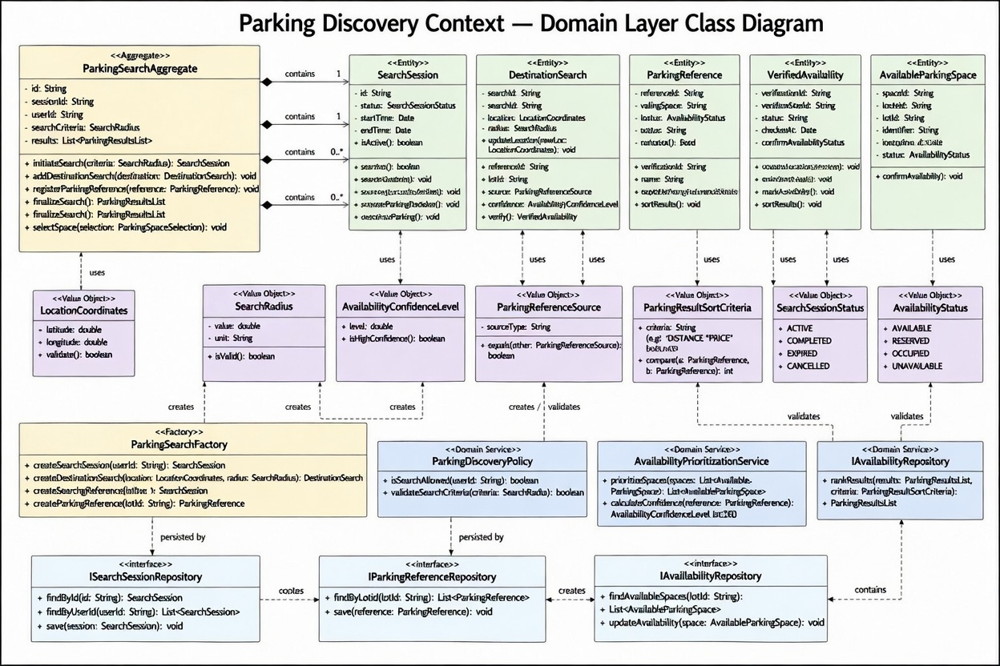

*Nota.* Elaboración propia (2026) usando LucidChart / PlantUML.

El aggregate **`ParkingSearchAggregate`** contiene una entidad `SearchSession`, un objeto `DestinationSearch`, una colección de `ParkingReference`, una estructura de `VerifiedAvailability`, una colección de `AvailableParkingSpace` y una entidad `ParkingSpaceSelection`. Esta organización permite garantizar que las operaciones de búsqueda, visualización y selección se realicen de manera consistente dentro del contexto.

La entidad **`SearchSession`** representa la sesión de búsqueda iniciada por el conductor. Contiene información como el identificador de la sesión, el identificador del conductor, el destino consultado y el estado de la búsqueda. Su comportamiento permite iniciar, actualizar y finalizar el proceso de búsqueda.

La entidad **`DestinationSearch`** representa el destino ingresado por el conductor. Esta clase utiliza el value object `LocationCoordinates` para encapsular la latitud y longitud, asegurando que las búsquedas se realicen sobre ubicaciones válidas.

La entidad **`ParkingReference`** representa una referencia de estacionamiento encontrada durante la búsqueda. Puede corresponder a un estacionamiento afiliado (proveniente de ParkingNow) o a una referencia externa (proveniente de OpenStreetMap u otros servicios). Esta entidad puede enriquecerse con información de disponibilidad.

La entidad **`VerifiedAvailability`** representa la disponibilidad validada de un estacionamiento o de sus espacios. Esta información puede provenir del contexto **IoT Monitoring**, por lo que incluye un nivel de confianza representado mediante el value object `AvailabilityConfidenceLevel`.

La entidad **`AvailableParkingSpace`** representa un espacio físico disponible dentro de un estacionamiento. Contiene el identificador del espacio, su estado y su capacidad de ser seleccionado por el conductor.

La entidad **`ParkingResultsList`** organiza los resultados obtenidos durante la búsqueda. Permite aplicar filtros y criterios de ordenamiento antes de mostrar la información al conductor.

La entidad **`ParkingLotDetail`** representa el detalle completo de un estacionamiento, incluyendo información descriptiva y disponibilidad de espacios.

La entidad **`ParkingSpaceSelection`** representa la selección temporal de un espacio realizada por el conductor antes de iniciar el proceso de reserva.

Los **Value Objects** definidos en este diagrama permiten encapsular valores relevantes del dominio sin necesidad de identidad propia. Entre ellos se encuentran:

- `LocationCoordinates`, que encapsula latitud y longitud
- `SearchRadius`, que define el radio de búsqueda
- `AvailabilityConfidenceLevel`, que representa el nivel de confianza de la disponibilidad
- `ParkingReferenceSource`, que identifica si la referencia es interna o externa
- `ParkingResultSortCriteria`, que define el criterio de ordenamiento de resultados
- `SearchSessionStatus`, que define los estados válidos de una sesión de búsqueda
- `AvailabilityStatus`, que define los estados válidos de disponibilidad de un espacio

Estos value objects permiten mantener consistencia en conceptos clave del dominio y evitar el uso de valores arbitrarios.

La capa de dominio también incluye la fábrica **`ParkingSearchFactory`**, encargada de crear objetos del dominio con un estado inicial válido. Esta fábrica permite construir sesiones de búsqueda, resultados y selecciones sin duplicar reglas de inicialización en otras capas.

Asimismo, se definen servicios de dominio como **`ParkingDiscoveryPolicy`**, **`AvailabilityPrioritizationService`** y **`ParkingResultRankingService`**. El primero valida reglas generales del proceso de búsqueda y selección, el segundo prioriza la disponibilidad verificada por IoT frente a información estática, y el tercero permite ordenar los resultados según criterios relevantes para el conductor.

Finalmente, se incluyen las interfaces de repositorio **`ISearchSessionRepository`**, **`IParkingReferenceRepository`** e **`IAvailabilityRepository`**, que definen los contratos necesarios para persistir y consultar datos del dominio. Estas interfaces no contienen detalles de implementación, los cuales se definen en la capa de infraestructura.

En conjunto, este diagrama de clases permite visualizar cómo se estructura internamente el dominio de **Parking Discovery**, asegurando que las reglas de negocio relacionadas con la búsqueda de estacionamientos, la consulta de disponibilidad y la selección de espacios se mantengan coherentes, desacopladas y alineadas con los principios de Domain-Driven Design.

##### 4.2.2.6.2. Bounded Context Database Design Diagram

El **Bounded Context Database Design Diagram** presenta el diseño físico de base de datos correspondiente al bounded context **Parking Discovery**. Este diagrama muestra cómo se almacenan las entidades principales del contexto en una base de datos relacional PostgreSQL, detallando tablas, columnas, tipos de datos, llaves primarias, llaves foráneas y relaciones entre registros.

A diferencia del diagrama de clases del dominio, este diagrama representa la estructura de persistencia. Por ello, se utilizan nombres de tablas y columnas propios de un modelo relacional, siguiendo buenas prácticas como el uso de `snake_case`, identificadores únicos tipo `UUID` y relaciones mediante claves foráneas.

**Figura 64**  
*Parking Discovery Context Database Design Diagram*

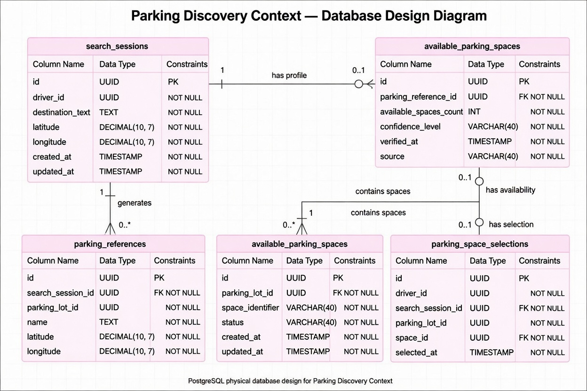

*Nota.* Elaboración propia (2026) usando LucidChart / Vertabelo.

En este contexto, se consideran únicamente las tablas necesarias para soportar el proceso de búsqueda, consulta de resultados y selección de espacios por parte del conductor.

---

##### Tabla `search_sessions`

Esta tabla almacena las sesiones de búsqueda iniciadas por los conductores.

| Columna | Tipo de dato | Descripción |
|---|---|---|
| `id` | `UUID` | Identificador único de la sesión de búsqueda. |
| `driver_id` | `UUID` | Identificador del conductor. |
| `destination_text` | `TEXT` | Texto del destino ingresado. |
| `latitude` | `DECIMAL` | Latitud del destino. |
| `longitude` | `DECIMAL` | Longitud del destino. |
| `status` | `VARCHAR` | Estado de la sesión (activa, finalizada). |
| `created_at` | `TIMESTAMP` | Fecha de creación. |
| `updated_at` | `TIMESTAMP` | Fecha de actualización. |

---

##### Tabla `parking_references`

Esta tabla almacena las referencias de estacionamientos obtenidas durante la búsqueda. Puede incluir tanto referencias internas (ParkingNow) como externas (OpenStreetMap).

| Columna | Tipo de dato | Descripción |
|---|---|---|
| `id` | `UUID` | Identificador de la referencia. |
| `parking_lot_id` | `UUID` | Referencia al estacionamiento interno (nullable si es externo). |
| `name` | `TEXT` | Nombre del estacionamiento. |
| `latitude` | `DECIMAL` | Latitud. |
| `longitude` | `DECIMAL` | Longitud. |
| `source` | `VARCHAR` | Fuente de la referencia (INTERNAL / EXTERNAL). |
| `created_at` | `TIMESTAMP` | Fecha de creación. |

---

##### Tabla `verified_availability`

Esta tabla almacena la disponibilidad validada de los estacionamientos, generalmente proveniente del contexto **IoT Monitoring**.

| Columna | Tipo de dato | Descripción |
|---|---|---|
| `id` | `UUID` | Identificador único. |
| `parking_lot_id` | `UUID` | Estacionamiento asociado. |
| `available_spaces_count` | `INT` | Cantidad de espacios disponibles. |
| `confidence_level` | `VARCHAR` | Nivel de confianza de la disponibilidad. |
| `verified_at` | `TIMESTAMP` | Fecha de verificación. |

---

##### Tabla `available_parking_spaces`

Esta tabla representa los espacios disponibles dentro de un estacionamiento específico.

| Columna | Tipo de dato | Descripción |
|---|---|---|
| `id` | `UUID` | Identificador del espacio. |
| `parking_lot_id` | `UUID` | Estacionamiento al que pertenece. |
| `space_identifier` | `VARCHAR` | Identificador visible del espacio. |
| `status` | `VARCHAR` | Estado del espacio (AVAILABLE / UNAVAILABLE). |

---

##### Tabla `parking_space_selections`

Esta tabla almacena las selecciones de espacios realizadas por los conductores antes de iniciar el proceso de reserva.

| Columna | Tipo de dato | Descripción |
|---|---|---|
| `id` | `UUID` | Identificador de la selección. |
| `driver_id` | `UUID` | Identificador del conductor. |
| `parking_lot_id` | `UUID` | Estacionamiento seleccionado. |
| `space_id` | `UUID` | Espacio seleccionado. |
| `selected_at` | `TIMESTAMP` | Fecha de selección. |

---

##### Relaciones principales

| Relación | Cardinalidad | Descripción |
|---|---|---|
| `search_sessions` → `parking_references` | 1 a 0..* | Una sesión puede generar múltiples referencias. |
| `parking_references` → `verified_availability` | 1 a 0..1 | Una referencia puede tener disponibilidad verificada. |
| `parking_references` → `available_parking_spaces` | 1 a 0..* | Un estacionamiento puede tener múltiples espacios. |
| `available_parking_spaces` → `parking_space_selections` | 1 a 0..1 | Un espacio puede ser seleccionado una vez. |

---

##### Consideraciones de diseño

- Se utilizan identificadores tipo **UUID** para garantizar unicidad global.
- Las relaciones se implementan mediante **llaves foráneas**, asegurando integridad referencial.
- La disponibilidad (`verified_availability`) puede actualizarse frecuentemente, por lo que se maneja separada de las referencias.
- Las referencias externas no siempre tendrán `parking_lot_id`, lo que permite integrar datos híbridos (internos + externos).
- Las selecciones son temporales y pueden eliminarse o invalidarse si el espacio deja de estar disponible.

---

En conclusión, el diseño de base de datos del bounded context **Parking Discovery** permite soportar de manera eficiente el flujo de búsqueda de estacionamientos, consulta de disponibilidad y selección de espacios. La estructura mantiene coherencia con el modelo de dominio, separa responsabilidades y permite integrar información proveniente tanto de sistemas internos como de servicios externos, asegurando escalabilidad y consistencia en la solución.

#### 4.2.4. Bounded Context: IoT Monitoring Context

El bounded context **IoT Monitoring Context** concentra las capacidades relacionadas con el monitoreo operativo de los nodos IoT instalados en los espacios de estacionamiento. Este contexto permite recibir lecturas físicas provenientes del dispositivo ESP32, validar mediciones del sensor ultrasónico, detectar cambios de ocupación, registrar eventos operativos, controlar el estado de conexión del nodo y sincronizar los eventos procesados hacia el backend principal de ParkingNow.

A diferencia del **Parking Management Context**, que se encarga de registrar estacionamientos, configurar espacios y asociar nodos IoT, el **IoT Monitoring Context** se enfoca en el comportamiento operativo del dispositivo una vez instalado. Su responsabilidad principal es convertir señales físicas del prototipo IoT en eventos confiables para el sistema, evitando que lecturas inválidas, pérdidas temporales de conexión o estados inconsistentes afecten la disponibilidad mostrada a los usuarios.

Desde la perspectiva tecnológica, este contexto se implementa principalmente en el **Edge API / Edge Service**, desarrollado con **Python, Flask, Peewee ORM y SQLite**, debido a que el procesamiento inicial debe realizarse cerca del dispositivo físico. Este contexto también se integra con el **ESP32 Embedded Firmware**, desarrollado en **C++ / Arduino IDE**, y con el **Core REST API**, desarrollado con **Java y Spring Boot**, para sincronizar eventos validados hacia la capa cloud de ParkingNow.

**Figura 57**  
*IoT Monitoring Context Class Dictionary*

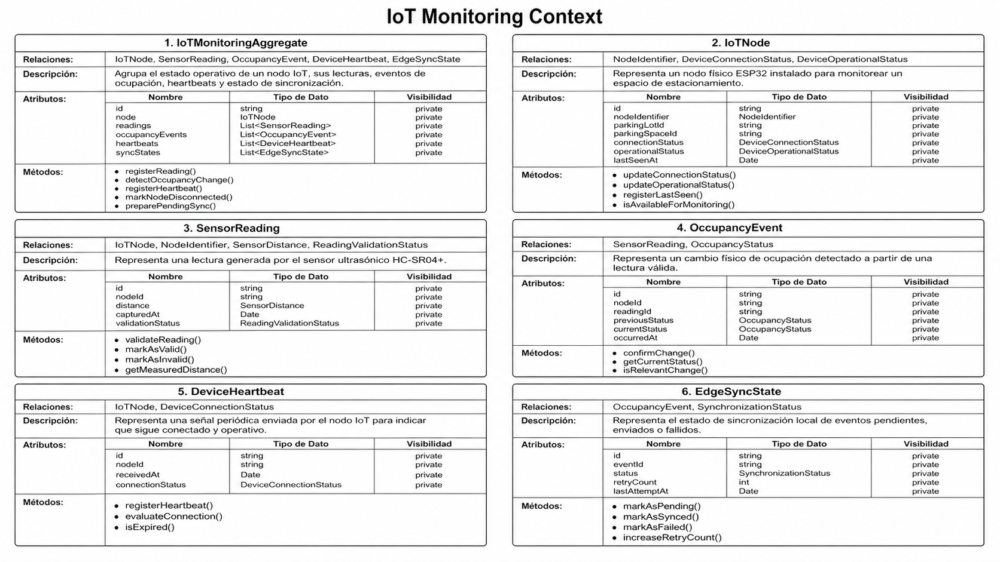

*Nota.* Elaboración propia (2026) usando LucidChart.

A continuación, se presenta el diccionario de clases identificado para el bounded context **IoT Monitoring Context**.

| Clase | Tipo | Propósito | Relaciones principales |
|---|---|---|---|
| `IoTMonitoringAggregate` | Aggregate | Agrupa el estado operativo de un nodo IoT, sus lecturas, eventos de ocupación, heartbeats y estado de sincronización. | Contiene `IoTNode`, `SensorReading`, `OccupancyEvent`, `DeviceHeartbeat` y `EdgeSyncState`. |
| `IoTNode` | Entity | Representa un nodo físico ESP32 instalado para monitorear un espacio de estacionamiento. | Usa `NodeIdentifier`, `DeviceConnectionStatus` y `DeviceOperationalStatus`. |
| `SensorReading` | Entity | Representa una lectura generada por el sensor ultrasónico HC-SR04+. | Usa `NodeIdentifier`, `SensorDistance` y `ReadingValidationStatus`. |
| `OccupancyEvent` | Entity | Representa un cambio físico de ocupación detectado a partir de una lectura válida. | Usa `OccupancyStatus` y se genera desde `SensorReading`. |
| `DeviceHeartbeat` | Entity | Representa una señal periódica enviada por el nodo IoT para indicar que sigue conectado y operativo. | Se relaciona con `IoTNode`. |
| `EdgeSyncState` | Entity | Representa el estado de sincronización local de eventos pendientes, enviados o fallidos. | Usa `SynchronizationStatus`. |
| `NodeIdentifier` | Value Object | Encapsula el identificador único del nodo IoT. | Es usado por `IoTNode`, `SensorReading`, `OccupancyEvent` y `DeviceHeartbeat`. |
| `SensorDistance` | Value Object | Representa la distancia medida por el sensor ultrasónico y valida rangos físicos aceptables. | Es usado por `SensorReading`. |
| `OccupancyStatus` | Enumeration | Define los estados físicos posibles de un espacio monitoreado. | Es usado por `OccupancyEvent`. |
| `DeviceConnectionStatus` | Enumeration | Define el estado de conexión del nodo IoT. | Es usado por `IoTNode`. |
| `DeviceOperationalStatus` | Enumeration | Define el estado operativo del dispositivo físico. | Es usado por `IoTNode`. |
| `ReadingValidationStatus` | Enumeration | Define si una lectura es válida, inválida o sospechosa. | Es usado por `SensorReading`. |
| `SynchronizationStatus` | Enumeration | Define si un evento local está pendiente, sincronizado o fallido. | Es usado por `EdgeSyncState`. |
| `SensorReadingFactory` | Factory | Crea lecturas de sensor a partir del payload recibido desde el ESP32. | Crea `SensorReading` y `SensorDistance`. |
| `OccupancyEventFactory` | Factory | Crea eventos de ocupación a partir de lecturas validadas. | Crea `OccupancyEvent`. |
| `SensorReadingValidationService` | Domain Service | Valida si una lectura del sensor se encuentra dentro de rangos físicos aceptables. | Usa `SensorReading` y `SensorDistance`. |
| `OccupancyDetectionPolicy` | Domain Service | Determina si una lectura representa un cambio real de ocupación. | Usa `SensorReading` y `OccupancyStatus`. |
| `HeartbeatMonitoringPolicy` | Domain Service | Determina si un nodo debe considerarse conectado, desconectado o inestable. | Usa `DeviceHeartbeat` y `DeviceConnectionStatus`. |
| `IIoTNodeMonitoringRepository` | Repository Interface | Define operaciones de persistencia para el estado operativo del nodo IoT. | Es implementada en Infrastructure Layer. |
| `ISensorReadingRepository` | Repository Interface | Define operaciones de persistencia para lecturas de sensores. | Es implementada en Infrastructure Layer. |
| `IOccupancyEventRepository` | Repository Interface | Define operaciones de persistencia para eventos de ocupación. | Es implementada en Infrastructure Layer. |
| `IDeviceHeartbeatRepository` | Repository Interface | Define operaciones de persistencia para heartbeats del dispositivo. | Es implementada en Infrastructure Layer. |
| `IEdgeSyncStateRepository` | Repository Interface | Define operaciones de persistencia para estados de sincronización local. | Es implementada en Infrastructure Layer. |

##### 4.2.4.1. Domain Layer

La **Domain Layer** del **IoT Monitoring Context** contiene las clases que representan las reglas centrales del monitoreo físico de espacios de estacionamiento. Esta capa modela el estado del nodo IoT, las lecturas generadas por sensores, los eventos de ocupación, los heartbeats del dispositivo y las reglas necesarias para validar si un evento físico debe considerarse confiable.

Esta capa no depende de frameworks, controladores, bases de datos ni servicios externos. Su responsabilidad es definir el comportamiento del dominio IoT de forma independiente de la tecnología utilizada para implementarlo. Por ello, aquí se incluyen entidades, objetos de valor, enumeraciones, fábricas, servicios de dominio e interfaces de repositorio.

**Figura 58**  
*IoT Monitoring Context Domain Layer*

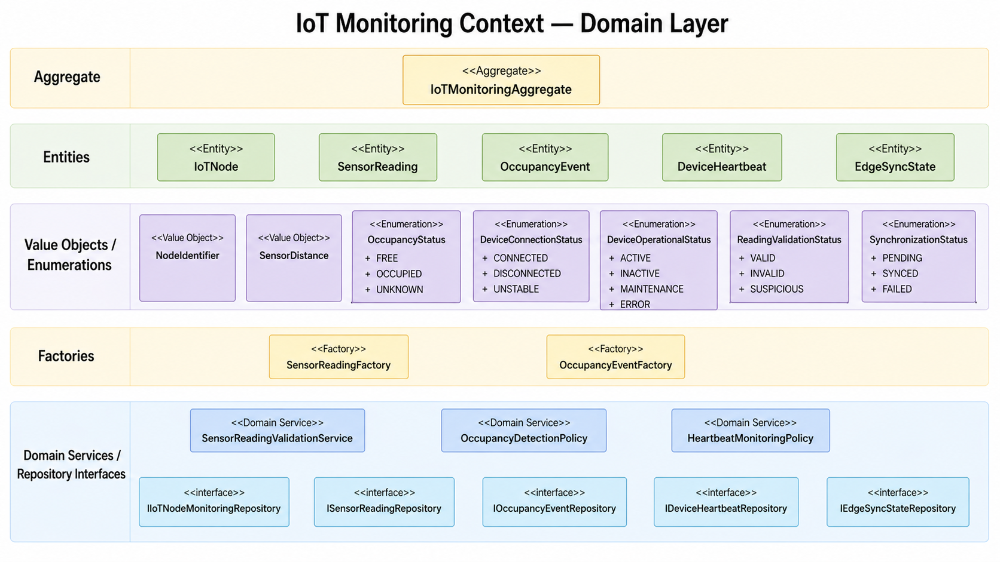

*Nota.* Elaboración propia (2026) usando LucidChart / PlantUML.

El aggregate principal de este contexto es `IoTMonitoringAggregate`, encargado de mantener la consistencia entre el nodo IoT, sus lecturas, sus eventos de ocupación, sus heartbeats y el estado de sincronización local. Este aggregate permite que las operaciones relacionadas con el monitoreo físico se procesen bajo reglas coherentes antes de ser persistidas o sincronizadas hacia el Core REST API.

La entidad `IoTNode` representa el nodo físico ESP32 instalado en un espacio de estacionamiento. Esta clase mantiene información sobre el identificador del nodo, su estado de conexión y su estado operativo. Su comportamiento permite actualizar su estado cuando se reciben lecturas válidas, heartbeats o eventos de desconexión.

La entidad `SensorReading` representa una lectura física enviada por el sensor ultrasónico HC-SR04+. Esta lectura incluye el identificador del nodo, la distancia medida, el momento de captura y el estado de validación. El dominio utiliza `SensorDistance` para encapsular la medición y evitar valores inválidos, como distancias negativas o fuera del rango físico esperado.

La entidad `OccupancyEvent` representa un cambio de ocupación detectado a partir de una lectura válida. Este evento permite determinar si un espacio físico se encuentra libre, ocupado o en estado desconocido. La creación de este evento se apoya en `OccupancyDetectionPolicy`, que define las reglas para interpretar las lecturas del sensor.

La entidad `DeviceHeartbeat` representa una señal periódica enviada por el ESP32 para indicar que el nodo sigue conectado. Esta información es utilizada por `HeartbeatMonitoringPolicy`, que permite determinar si el dispositivo debe considerarse conectado, desconectado o inestable.

La entidad `EdgeSyncState` representa el estado de sincronización de los eventos locales procesados por el Edge API. Esto permite manejar escenarios donde la conectividad con el Core REST API sea intermitente, evitando la pérdida de eventos físicos importantes.

Dentro de los objetos de valor se encuentran `NodeIdentifier` y `SensorDistance`. El primero asegura que el identificador del nodo tenga un formato válido y consistente. El segundo encapsula la medición del sensor y valida que la distancia se encuentre dentro de los límites permitidos.

Las enumeraciones `OccupancyStatus`, `DeviceConnectionStatus`, `DeviceOperationalStatus`, `ReadingValidationStatus` y `SynchronizationStatus` restringen los estados permitidos dentro del modelo, evitando inconsistencias al representar la ocupación física, la conexión del dispositivo, su operación, la validez de las lecturas y el estado de sincronización.

Las fábricas `SensorReadingFactory` y `OccupancyEventFactory` centralizan la creación de lecturas y eventos, evitando que estas entidades se construyan en estados inválidos. Los servicios de dominio `SensorReadingValidationService`, `OccupancyDetectionPolicy` y `HeartbeatMonitoringPolicy` encapsulan reglas que no pertenecen a una sola entidad, pero que son necesarias para mantener la coherencia del contexto.

Finalmente, las interfaces `IIoTNodeMonitoringRepository`, `ISensorReadingRepository`, `IOccupancyEventRepository`, `IDeviceHeartbeatRepository` e `IEdgeSyncStateRepository` representan contratos de persistencia requeridos por el dominio. Sus implementaciones concretas se ubican en la Infrastructure Layer.

##### 4.2.4.2. Interface Layer

La **Interface Layer** del **IoT Monitoring Context** representa el punto de entrada para las solicitudes y eventos provenientes del entorno físico IoT. Esta capa está compuesta por controladores REST y consumidores de eventos encargados de recibir payloads generados por el ESP32, peticiones de sincronización y señales operativas del dispositivo.

En este contexto, los controladores se implementan principalmente dentro del **Edge API / Edge Service**, desarrollado con **Python y Flask**. Su responsabilidad es recibir solicitudes HTTP, validar superficialmente la estructura del payload y delegar el procesamiento hacia la Application Layer. Esta capa no contiene lógica de negocio pura ni reglas de detección de ocupación.

**Figura 59**  
*IoT Monitoring Context Interface Layer*

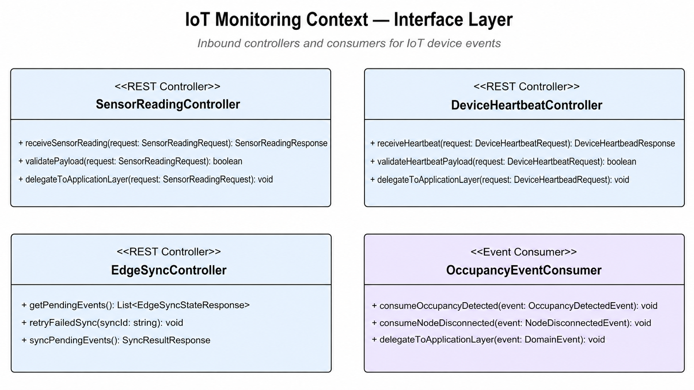

*Nota.* Elaboración propia (2026) usando LucidChart.

Las clases consideradas para esta capa son las siguientes:

| Clase | Tipo | Propósito |
|---|---|---|
| `SensorReadingController` | REST Controller | Recibe lecturas de sensores enviadas por el ESP32 mediante HTTP/JSON. |
| `DeviceHeartbeatController` | REST Controller | Recibe heartbeats periódicos del dispositivo para validar su estado de conexión. |
| `EdgeSyncController` | REST Controller | Expone operaciones para consultar y reenviar eventos pendientes de sincronización. |
| `OccupancyEventConsumer` | Event Consumer | Consume eventos internos generados por el procesamiento de lecturas válidas. |

La clase `SensorReadingController` recibe las lecturas enviadas por el firmware del ESP32. Su responsabilidad consiste en validar que el payload tenga los campos mínimos requeridos, como identificador del nodo, distancia medida y timestamp. Luego delega el procesamiento al `RegisterSensorReadingCommandHandler`.

La clase `DeviceHeartbeatController` recibe señales periódicas del nodo IoT. Estas señales permiten conocer si el dispositivo sigue conectado y funcionando. Esta clase delega el procesamiento al `RegisterDeviceHeartbeatCommandHandler`.

La clase `EdgeSyncController` permite gestionar la sincronización de eventos almacenados localmente en SQLite. Su propósito es consultar eventos pendientes, reintentar envíos fallidos y coordinar el flujo de sincronización con el Core REST API.

La clase `OccupancyEventConsumer` consume eventos internos de ocupación generados dentro del Edge API después de validar una lectura. Su responsabilidad es delegar la actualización del estado operativo y el registro del evento hacia la Application Layer.

##### 4.2.4.3. Application Layer

La **Application Layer** del **IoT Monitoring Context** contiene los command handlers y event handlers que orquestan los casos de uso relacionados con el monitoreo IoT. Esta capa actúa como intermediaria entre la Interface Layer, el Domain Layer y la Infrastructure Layer.

Su responsabilidad es coordinar el flujo de procesamiento: recibe datos validados superficialmente desde los controladores, utiliza fábricas y servicios de dominio para aplicar reglas, consulta o actualiza repositorios y finalmente solicita la sincronización de eventos hacia el Core REST API cuando corresponde.

Esta capa debe mantenerse delgada. No contiene reglas de negocio puras ni detalles tecnológicos de persistencia. Las reglas de validación de lecturas, detección de ocupación o monitoreo de conexión pertenecen al Domain Layer, mientras que el almacenamiento en SQLite o la comunicación HTTP hacia el backend pertenecen a Infrastructure Layer.

**Figura 60**  
*IoT Monitoring Context Application Layer*

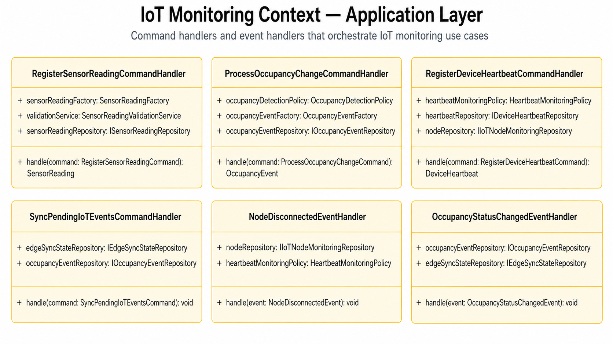

*Nota.* Elaboración propia (2026) usando LucidChart.

Las clases consideradas para esta capa son las siguientes:

| Clase | Tipo | Propósito |
|---|---|---|
| `RegisterSensorReadingCommandHandler` | Command Handler | Orquesta el registro y validación de una lectura enviada por el ESP32. |
| `ProcessOccupancyChangeCommandHandler` | Command Handler | Orquesta la generación de un evento de ocupación a partir de una lectura válida. |
| `RegisterDeviceHeartbeatCommandHandler` | Command Handler | Orquesta el registro de heartbeats del dispositivo y la actualización de su estado de conexión. |
| `SyncPendingIoTEventsCommandHandler` | Command Handler | Orquesta el reenvío de eventos pendientes hacia el Core REST API. |
| `NodeDisconnectedEventHandler` | Event Handler | Reacciona ante la pérdida de heartbeats o desconexión temporal del nodo. |
| `OccupancyStatusChangedEventHandler` | Event Handler | Reacciona ante un cambio de ocupación detectado y prepara su sincronización. |

El `RegisterSensorReadingCommandHandler` inicia el flujo principal del contexto. Recibe la lectura enviada por el `SensorReadingController`, utiliza `SensorReadingFactory` para construir una entidad válida y solicita a `SensorReadingValidationService` la validación del rango físico de medición. Si la lectura es aceptada, la almacena mediante `ISensorReadingRepository`.

El `ProcessOccupancyChangeCommandHandler` se encarga de interpretar una lectura validada y determinar si representa un cambio real de ocupación. Para ello utiliza `OccupancyDetectionPolicy` y `OccupancyEventFactory`. Si se detecta un cambio relevante, se genera un `OccupancyEvent`.

El `RegisterDeviceHeartbeatCommandHandler` procesa las señales periódicas enviadas por el nodo ESP32. Su flujo permite actualizar el estado de conexión del dispositivo y registrar evidencia de que el nodo continúa operativo.

El `SyncPendingIoTEventsCommandHandler` coordina la sincronización de eventos pendientes almacenados localmente. Este handler obtiene eventos con estado pendiente o fallido desde `IEdgeSyncStateRepository` y solicita a la infraestructura el envío hacia el Core REST API.

El `NodeDisconnectedEventHandler` reacciona cuando un nodo deja de enviar heartbeats durante un tiempo superior al permitido. Su responsabilidad es actualizar el estado operativo y registrar el evento para que el sistema pueda advertir posibles fallas del dispositivo.

El `OccupancyStatusChangedEventHandler` reacciona cuando se detecta un cambio de ocupación. Su responsabilidad es preparar la información para su sincronización y permitir que el backend principal actualice el estado operativo del espacio correspondiente.

##### 4.2.4.4. Infrastructure Layer

La **Infrastructure Layer** del **IoT Monitoring Context** contiene las clases que conectan el contexto con tecnologías concretas, como SQLite, Peewee ORM, HTTP clients y servicios externos. Esta capa implementa las interfaces de repositorio definidas en el Domain Layer y provee adaptadores para la comunicación con el Core REST API.

En este contexto, la infraestructura local es importante porque el Edge API debe poder operar incluso si la conexión con la nube es intermitente. Por ello, se utiliza **SQLite** como almacenamiento local y **Peewee ORM** como mecanismo de acceso a datos desde Python.

**Figura 61**  
*IoT Monitoring Context Infrastructure Layer*

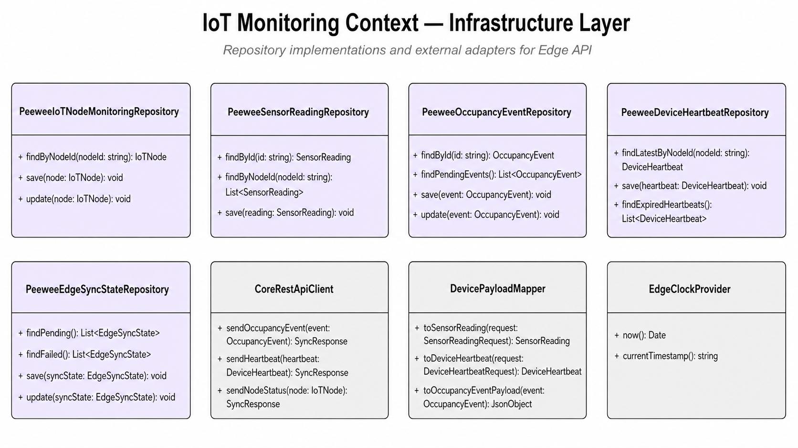

*Nota.* Elaboración propia (2026) usando LucidChart.

Las clases consideradas para esta capa son las siguientes:

| Clase | Tipo | Propósito |
|---|---|---|
| `PeeweeIoTNodeMonitoringRepository` | Repository Implementation | Implementa `IIoTNodeMonitoringRepository` usando Peewee ORM y SQLite. |
| `PeeweeSensorReadingRepository` | Repository Implementation | Implementa `ISensorReadingRepository` para guardar lecturas del sensor en SQLite. |
| `PeeweeOccupancyEventRepository` | Repository Implementation | Implementa `IOccupancyEventRepository` para persistir eventos de ocupación. |
| `PeeweeDeviceHeartbeatRepository` | Repository Implementation | Implementa `IDeviceHeartbeatRepository` para registrar heartbeats del dispositivo. |
| `PeeweeEdgeSyncStateRepository` | Repository Implementation | Implementa `IEdgeSyncStateRepository` para controlar eventos pendientes de sincronización. |
| `CoreRestApiClient` | External Service Client | Envía eventos IoT validados hacia el Core REST API mediante HTTPS/JSON. |
| `EdgeClockProvider` | Infrastructure Service | Proporciona timestamps consistentes para eventos registrados en el Edge API. |
| `DevicePayloadMapper` | Mapper | Transforma payloads JSON recibidos desde el ESP32 en objetos del dominio. |

La clase `PeeweeIoTNodeMonitoringRepository` permite almacenar y recuperar el estado operativo local del nodo IoT. Su implementación usa Peewee ORM sobre SQLite, evitando que el dominio dependa directamente de detalles de base de datos.

La clase `PeeweeSensorReadingRepository` persiste las lecturas recibidas desde el sensor ultrasónico. Esto permite conservar evidencia de las mediciones utilizadas para detectar cambios de ocupación.

La clase `PeeweeOccupancyEventRepository` almacena eventos de ocupación detectados localmente. Estos eventos pueden ser enviados inmediatamente al backend principal o quedar pendientes si no existe conexión.

La clase `PeeweeDeviceHeartbeatRepository` registra los heartbeats del dispositivo. Esto permite identificar desconexiones, latencia o fallas del nodo IoT.

La clase `PeeweeEdgeSyncStateRepository` controla el estado de sincronización de los eventos locales. Gracias a esta clase, el Edge API puede identificar eventos pendientes, fallidos o sincronizados.

La clase `CoreRestApiClient` actúa como cliente HTTP para enviar eventos validados hacia el Core REST API. Esta clase encapsula detalles de comunicación como endpoints, headers, timeouts y formato JSON.

La clase `DevicePayloadMapper` transforma los payloads recibidos desde el firmware ESP32 en objetos utilizados por la Application Layer y el Domain Layer. Esto evita que el formato externo del dispositivo contamine el modelo de dominio.

##### 4.2.4.5. Bounded Context Software Architecture Component Level Diagrams

El **Bounded Context Software Architecture Component Level Diagram** del **IoT Monitoring Context** muestra la descomposición interna del contenedor **Edge API / Edge Service**, el cual concentra la lógica principal de recepción, validación, procesamiento y sincronización de eventos físicos provenientes del ESP32.

Este diagrama corresponde al nivel 3 del C4 Model. En él se muestran los componentes principales del Edge API, incluyendo controladores Flask, command handlers, event handlers, componentes de dominio, repositorios locales implementados con Peewee ORM y adaptadores externos para sincronizar eventos hacia el Core REST API.

**Figura 62**  
*IoT Monitoring Context Component Level Diagram*

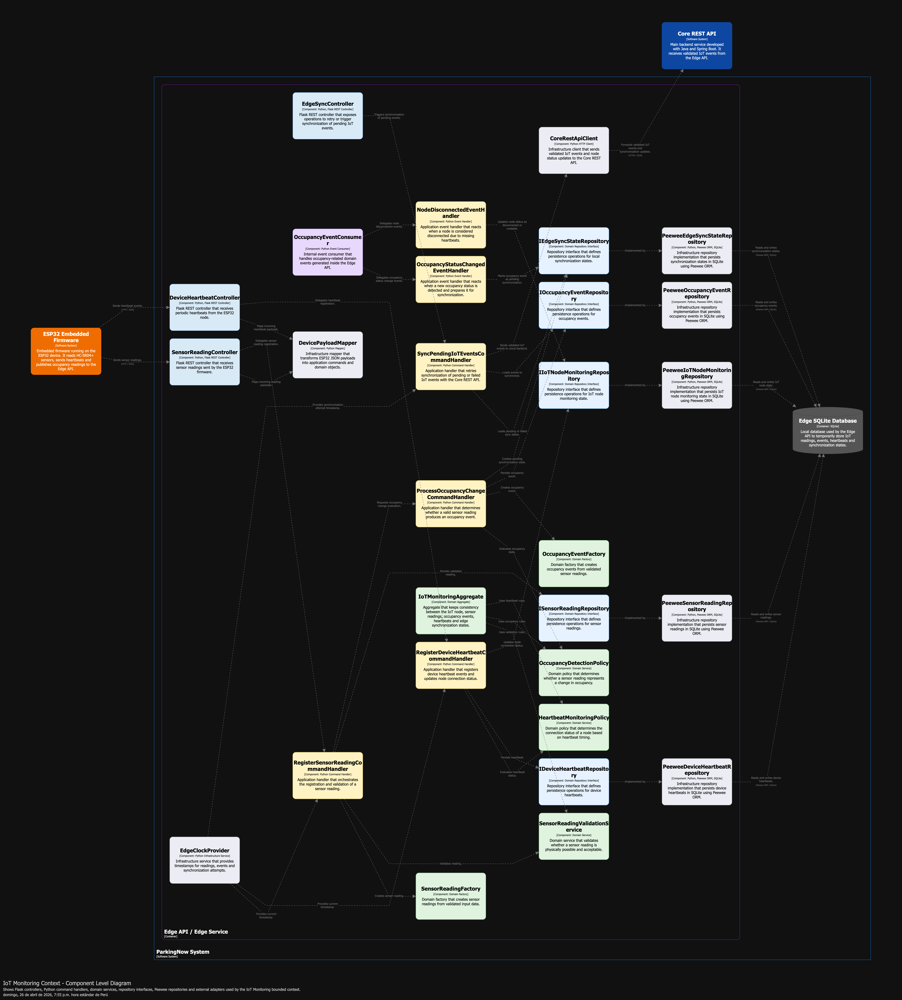

*Nota.* Elaboración propia (2026) usando Structurizr DSL.

Según la Figura 62, el flujo principal inicia cuando el **ESP32 Embedded Firmware** envía una lectura al `SensorReadingController`. Este controlador recibe el payload HTTP/JSON y delega la operación al `RegisterSensorReadingCommandHandler`. Luego, la Application Layer utiliza `SensorReadingFactory` y `SensorReadingValidationService` para construir y validar la lectura.

Cuando una lectura válida representa un cambio físico relevante, el `ProcessOccupancyChangeCommandHandler` utiliza `OccupancyDetectionPolicy` y `OccupancyEventFactory` para generar un `OccupancyEvent`. Dicho evento se almacena localmente mediante `PeeweeOccupancyEventRepository` y se registra su estado de sincronización usando `PeeweeEdgeSyncStateRepository`.

Posteriormente, el `SyncPendingIoTEventsCommandHandler` utiliza `CoreRestApiClient` para enviar los eventos validados hacia el **Core REST API**, desarrollado con Java y Spring Boot. Si la conexión falla, el evento queda almacenado localmente en SQLite para ser reenviado después.

La siguiente tabla resume los componentes principales del diagrama:

| Capa | Componente | Tecnología | Responsabilidad |
|---|---|---|---|
| Interface Layer | `SensorReadingController` | Python / Flask | Recibe lecturas de sensores enviadas por el ESP32. |
| Interface Layer | `DeviceHeartbeatController` | Python / Flask | Recibe heartbeats periódicos del nodo IoT. |
| Interface Layer | `EdgeSyncController` | Python / Flask | Permite consultar y reenviar eventos pendientes. |
| Interface Layer | `OccupancyEventConsumer` | Python / Flask Events | Consume eventos internos de ocupación. |
| Application Layer | `RegisterSensorReadingCommandHandler` | Python | Orquesta el registro y validación de lecturas. |
| Application Layer | `ProcessOccupancyChangeCommandHandler` | Python | Orquesta la creación de eventos de ocupación. |
| Application Layer | `RegisterDeviceHeartbeatCommandHandler` | Python | Orquesta el registro de heartbeats. |
| Application Layer | `SyncPendingIoTEventsCommandHandler` | Python | Orquesta la sincronización de eventos pendientes. |
| Domain Layer | `IoTMonitoringAggregate` | Domain Model | Mantiene la consistencia del estado operativo IoT. |
| Domain Layer | `SensorReadingValidationService` | Domain Service | Valida rangos físicos de medición. |
| Domain Layer | `OccupancyDetectionPolicy` | Domain Service | Determina cambios reales de ocupación. |
| Domain Layer | `HeartbeatMonitoringPolicy` | Domain Service | Determina estados de conexión del nodo. |
| Infrastructure Layer | `PeeweeSensorReadingRepository` | Peewee ORM / SQLite | Persiste lecturas de sensores. |
| Infrastructure Layer | `PeeweeOccupancyEventRepository` | Peewee ORM / SQLite | Persiste eventos de ocupación. |
| Infrastructure Layer | `PeeweeDeviceHeartbeatRepository` | Peewee ORM / SQLite | Persiste heartbeats del dispositivo. |
| Infrastructure Layer | `PeeweeEdgeSyncStateRepository` | Peewee ORM / SQLite | Persiste estados de sincronización. |
| Infrastructure Layer | `CoreRestApiClient` | HTTP Client | Envía eventos validados al Core REST API. |

##### 4.2.4.6. Bounded Context Software Architecture Code Level Diagrams

En esta sección se presentan los diagramas de nivel de código correspondientes al bounded context **IoT Monitoring**. A diferencia del Component Level Diagram, que muestra bloques estructurales de alto nivel dentro del Edge API, este bloque profundiza en el diseño de clases del dominio y en la estructura física de persistencia utilizada por este contexto.

Primero se presenta el **Domain Layer Class Diagram**, donde se detallan las entidades, objetos de valor, agregados, servicios de dominio, fábricas e interfaces de repositorio del contexto. Luego se presenta el **Database Design Diagram**, donde se especifican las tablas, columnas, llaves primarias, llaves foráneas y relaciones utilizadas para persistir la información operativa del monitoreo IoT.

Estos diagramas permiten cerrar el diseño táctico del bounded context **IoT Monitoring**, asegurando trazabilidad entre las reglas del dominio, el procesamiento local del Edge API y la persistencia de eventos físicos generados por el dispositivo ESP32.

###### 4.2.4.6.1. Bounded Context Domain Layer Class Diagrams

El **Bounded Context Domain Layer Class Diagram** presenta el diseño UML de las clases que forman parte de la capa de dominio del bounded context **IoT Monitoring**. Este diagrama se enfoca exclusivamente en los elementos que representan reglas de negocio puras relacionadas con monitoreo IoT, sin incluir controladores, frameworks, clientes HTTP, bases de datos ni detalles de infraestructura.

**Figura 63**  
*IoT Monitoring Context Domain Layer Class Diagram*

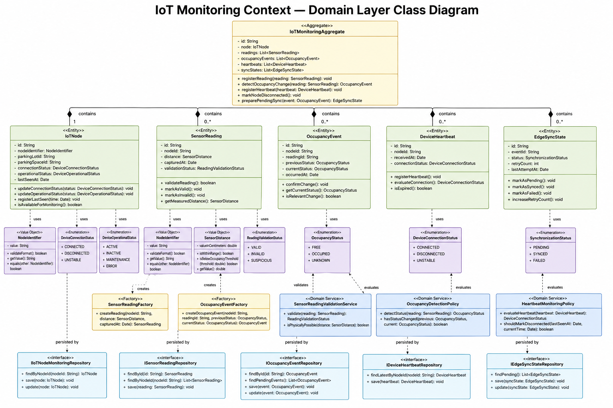

*Nota.* Elaboración propia (2026) usando LucidChart / PlantUML.

Según la Figura 63, el aggregate `IoTMonitoringAggregate` actúa como raíz de consistencia del contexto. Este aggregate contiene el nodo IoT monitoreado, las lecturas generadas por sensores, los eventos de ocupación, los heartbeats del dispositivo y los estados de sincronización local.

La entidad `IoTNode` representa al dispositivo ESP32 instalado en el entorno físico. Esta entidad mantiene su identificador, estado de conexión, estado operativo y último momento de actividad. Su comportamiento permite actualizar el estado del nodo cuando recibe lecturas, heartbeats o eventos de desconexión.

La entidad `SensorReading` representa una medición física capturada por el sensor ultrasónico. Esta clase utiliza el value object `SensorDistance` para encapsular la distancia medida y validar que se encuentre dentro del rango físico permitido. Además, utiliza `ReadingValidationStatus` para indicar si la lectura es válida, inválida o sospechosa.

La entidad `OccupancyEvent` representa el resultado de interpretar una lectura física. Esta entidad permite registrar si un espacio pasa a estar libre, ocupado o en estado desconocido. La transición de estado se determina mediante `OccupancyDetectionPolicy`.

La entidad `DeviceHeartbeat` permite registrar señales periódicas enviadas por el ESP32. Estas señales son utilizadas para determinar si el nodo sigue conectado, se encuentra inestable o debe considerarse desconectado.

La entidad `EdgeSyncState` permite controlar la sincronización de eventos locales. Su objetivo es evitar pérdida de información cuando la conexión con el Core REST API no está disponible.

Los servicios de dominio `SensorReadingValidationService`, `OccupancyDetectionPolicy` y `HeartbeatMonitoringPolicy` concentran reglas que no pertenecen a una única entidad. Estas reglas permiten validar mediciones físicas, detectar cambios de ocupación y determinar el estado de conexión del dispositivo.

Las interfaces `IIoTNodeMonitoringRepository`, `ISensorReadingRepository`, `IOccupancyEventRepository`, `IDeviceHeartbeatRepository` e `IEdgeSyncStateRepository` definen los contratos de persistencia requeridos por el dominio. Sus implementaciones concretas pertenecen a la Infrastructure Layer.

###### 4.2.4.6.2. Bounded Context Database Design Diagram

El **Bounded Context Database Design Diagram** presenta el diseño físico de base de datos correspondiente al bounded context **IoT Monitoring**. Este diagrama muestra cómo se almacenan localmente las lecturas, eventos, heartbeats y estados de sincronización procesados por el Edge API.

Para este contexto se utiliza una base de datos local **SQLite**, accedida mediante **Peewee ORM**, debido a que el Edge API debe conservar eventos aun cuando la conexión hacia el Core REST API sea intermitente. Esta persistencia local permite que el sistema mantenga trazabilidad de lecturas y eventos físicos sin depender completamente de la conectividad cloud.

**Figura 64**  
*IoT Monitoring Context Database Design Diagram*

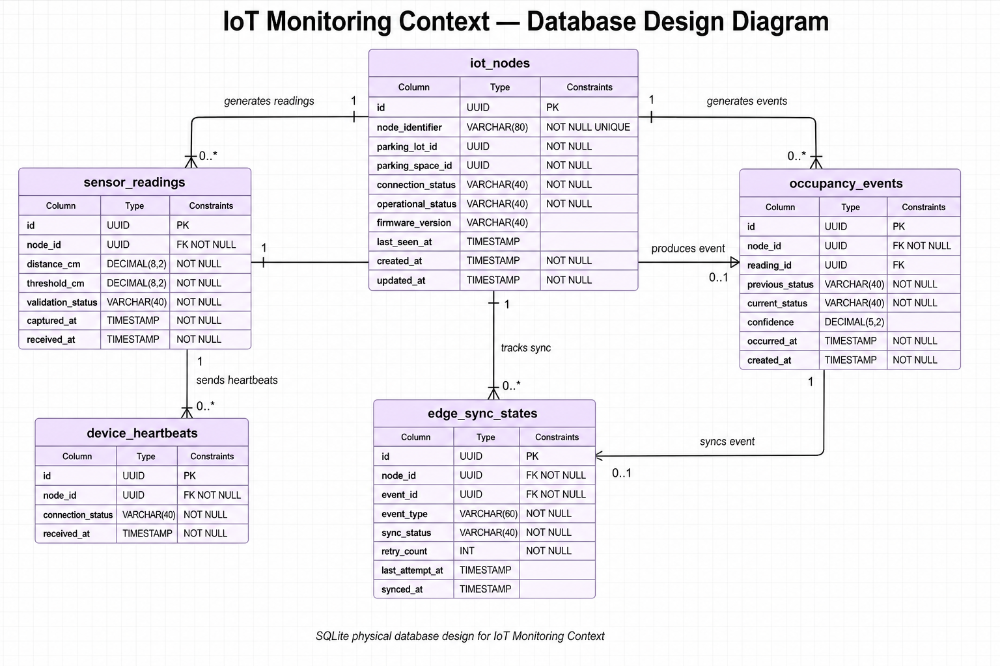

*Nota.* Elaboración propia (2026) usando LucidChart / Vertabelo.

Las tablas consideradas para este bounded context son las siguientes:

| Tabla | Propósito |
|---|---|
| `iot_nodes` | Almacena el estado operativo local de los nodos IoT monitoreados. |
| `sensor_readings` | Registra las lecturas físicas enviadas por sensores ultrasónicos. |
| `occupancy_events` | Registra eventos de cambio de ocupación generados desde lecturas validadas. |
| `device_heartbeats` | Registra señales periódicas enviadas por el dispositivo para verificar conexión. |
| `edge_sync_states` | Controla el estado de sincronización de eventos locales hacia el Core REST API. |

La tabla `iot_nodes` representa los dispositivos IoT monitoreados por el Edge API. Incluye el identificador del nodo, referencias externas hacia el estacionamiento o espacio asociado, estado de conexión, estado operativo, versión de firmware y fecha de última actividad. Las referencias `parking_lot_id` y `parking_space_id` se consideran referencias externas al **Parking Management Context**, por lo que no se dibujan sus tablas dentro de este diagrama.

La tabla `sensor_readings` almacena las lecturas capturadas por el sensor ultrasónico. Cada lectura se asocia con un nodo IoT mediante la llave foránea `node_id`. Esta tabla registra la distancia medida, el umbral utilizado, el estado de validación y los timestamps de captura y recepción.

La tabla `occupancy_events` almacena los eventos de ocupación detectados por el Edge API. Cada evento se relaciona con un nodo y, opcionalmente, con una lectura específica. Esta tabla permite conocer el estado anterior, el estado actual, el nivel de confianza y el momento en que ocurrió el cambio físico.

La tabla `device_heartbeats` almacena las señales periódicas enviadas por el ESP32. Esta información permite determinar si un nodo continúa activo o si ha dejado de comunicarse con el Edge API.

La tabla `edge_sync_states` registra el estado de sincronización de eventos locales. Esta tabla permite identificar qué eventos están pendientes, cuáles fueron sincronizados correctamente y cuáles fallaron durante el envío hacia el Core REST API.

| Relación | Cardinalidad | Descripción |
|---|---|---|
| `iot_nodes` → `sensor_readings` | 1 a 0..* | Un nodo IoT puede generar múltiples lecturas de sensor. |
| `iot_nodes` → `occupancy_events` | 1 a 0..* | Un nodo IoT puede generar múltiples eventos de ocupación. |
| `sensor_readings` → `occupancy_events` | 1 a 0..1 | Una lectura puede generar como máximo un evento de ocupación. |
| `iot_nodes` → `device_heartbeats` | 1 a 0..* | Un nodo IoT puede enviar múltiples heartbeats. |
| `iot_nodes` → `edge_sync_states` | 1 a 0..* | Un nodo IoT puede tener múltiples registros de sincronización asociados. |

El diseño utiliza identificadores de tipo `UUID` para mantener unicidad en los registros generados por el Edge API. Los estados se almacenan como `VARCHAR`, alineados con las enumeraciones definidas en el Domain Layer. Las relaciones internas se implementan mediante llaves foráneas, asegurando integridad entre nodos, lecturas, eventos, heartbeats y estados de sincronización.

A nivel físico, esta base de datos pertenece al entorno local del Edge API y no reemplaza la base PostgreSQL administrada utilizada por el backend principal. Su función es permitir continuidad operativa, almacenamiento temporal y sincronización posterior de eventos IoT procesados localmente.